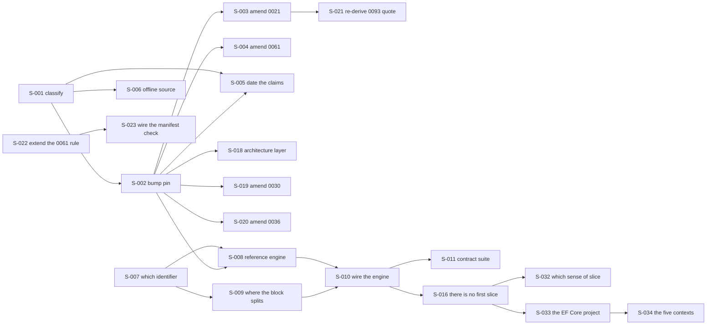

# Seed issue tracker

Scheduled work, decomposed. [`../.claude/rules/seeds.md`](../.claude/rules/seeds.md) is the
authority on what a seed is, what fields it carries, and why. This file is the tracker and does not
restate that rule.

**This file may be cited.** That is the difference between it and
[`BUILD-PLAN.md`](BUILD-PLAN.md), which is temporary, will be deleted, and may never be pointed at.
An item moves from that queue into this file when it becomes actionable, and its queue row is
deleted in the same change.

**This file decides nothing.** Every seed points at the ADR, design, or source file that owns its
subject. Where a seed and its owner disagree, the seed is the bug.

## Where the work stands

**Front of the work: S-011 and S-033.** Both reach running code and neither has a blocker. S-011
closes the chain S-010 opened. S-033 opens the foundation chain that S-016 found waiting.

The handoff they continue, stated once and not restated: the last code increment is commit `3ad32e0`,
the engine wiring inside `AddNamiIdentity`, and `BUILD-PLAN.md` section 1 records that **S-007 through
S-011 plus S-016 are what PR-7 did not deliver**, that being the engine wiring and the first slice.
What happened in each increment is in its commit message, and the traps they produced are in
[`../src/CLAUDE.md`](../src/CLAUDE.md) and [`../tests/CLAUDE.md`](../tests/CLAUDE.md). None of it is
copied here.

**Half of that handoff sentence names nothing, and S-016 is where that is recorded.** "The first
slice" is this repository's own phrase, absent from the corpus the designs were reconciled from, and
the work after the wiring is the rest of the foundation rather than a slice. Read S-016's result
before planning from those three words.

**Counted 2026-08-08, with S-016 closed and its three seeds added: 34 seeds, 18 done, 14 open, and 2
blocked.** Measured at `3ad32e0`, the commit this increment started from, **22** commits had landed
after `8e19123` and **four of them moved build or code**, being three `feat(core)` commits and the pin
bump. The rest paid down citation and transcription debt that the OpenIddict pin bump exposed, and the
bump was the probe rather than the cause.

**Two earlier versions of this paragraph went stale, and both did so the same way.** It once said
eleven seeds had closed and every one was documentation, which was true when written and false later
the same day. Its replacement carried a board count taken **before** the seeds this increment adds,
which the same increment then invalidated. So the counts here name what they were counted over, and a
reader who doubts one should re-run it rather than quote it forward.

**What the two trackers each hold**, because the boundary leaked on 2026-08-08 and three items lived in
both files at once:

| Where | Holds | May be cited |
|---|---|---|
| this file | scheduled work, and each seed's own dated result | yes, by anything |
| [`BUILD-PLAN.md`](BUILD-PLAN.md) | items owed with an owner and a trigger, claims not verified, and one thin pointer at the front of the work | **no**, by nothing |
| git | what actually happened, per commit | not a document |

## How to read the chain

A seed with `Blocked by: none` is actionable today. Start there. When a seed is done, read its
`Unblocks` line and mark those seeds `open`.



## Status board

| ID | Title | Status | Blocked by |
|---|---|---|---|
| S-001 | Classify every `7.5.0` reference before changing any | done | none |
| S-002 | Bump the manifest to `[7.6.0]` and re-read the nine licences | done | S-001 done |
| S-003 | Amend ADR-0021 for the new pin and the half-run playbook | done | S-002 done |
| S-004 | Amend the ADR-0061 stack row to the new pin | done | S-002 done |
| S-005 | Date or re-point every source-read claim the bump invalidates | open | S-001, S-002 both done |
| S-006 | Decide what replaces the offline 7.5.0 source tree | open | S-001 done |
| S-007 | Resolve umbrella versus granular for `Core`'s engine reference | done | none |
| S-008 | Reference the engine from `Core` and enumerate the restore graph | done | S-007 done |
| S-009 | Decide where the `AddOpenIddict` block splits at the persistence boundary | done | S-007 done |
| S-010 | Wire the engine inside `AddNamiIdentity` | done | S-008, S-009, S-028 all done |
| S-011 | Stand up the contract-regression suite ADR-0021 part C requires | open | S-010 done |
| S-012 | Reconcile design 01's context count against its own table | open | none |
| S-013 | Give the provider-selector key the decided form and an owner | open | none |
| S-014 | Place the three builder calls that exist in no document here | open | none |
| S-015 | Re-own design 04's boot-validation citation | open | none |
| S-016 | Define what the first slice is | done | S-010 done |
| S-017 | Assign a configuration key to the nine options that have none | open | none |
| S-018 | Move the architecture layer's four engine-version statements to the new pin | done | S-002 done |
| S-019 | Amend ADR-0030's stack sentence to the new pin | done | S-002 done |
| S-020 | Amend ADR-0036's live-pin clause to the new pin | done | S-002 done |
| S-021 | Re-derive ADR-0093's verbatim quotation of ADR-0021 | done | S-003 done |
| S-022 | Extend ADR-0061's maintenance rule to cover a version moving inside a row | open | none |
| S-023 | Wire the ADR-0061-against-manifest check now its own trigger has fired | blocked | S-022 |
| S-024 | Correct view 03's inverted `DbContext` pooling row, and read the other eight | done | none |
| S-025 | Un-pin ADR-0030's seam range, as ADR-0021 already did to its own | done | none |
| S-026 | Correct the two ADRs that label ADR-0018 by the option it declined | done | none |
| S-027 | Give the three stack entries with no licence row one: OpenTofu, Bootstrap 5, Playwright | open | none |
| S-028 | Re-read design 04 section 3's API names at 7.6.0, split out of S-010 | done | S-009 done |
| S-029 | Give `RefreshTokenReuseLeeway` a member and rename its key to match | done | S-028 done |
| S-030 | Resolve `ClockSkewToleranceSeconds`, a key for something design 04 calls a constant | open | none |
| S-031 | Resolve `EndpointPaths:*`, ten keys with no member and no options type | open | none |
| S-032 | Say which sense of "slice" design 01 means when it labels `Core` | open | S-016 done |
| S-033 | Land `Nami.Identity.EntityFrameworkCore` as a project carrying no context | open | S-016 done |
| S-034 | Give the five contexts their classes and their pooling posture | blocked | S-033 |

---

## S-001. Classify every `7.5.0` reference before changing any

**Status:** done · **Blocked by:** none · **Unblocks:** S-002, S-005, S-006

**Why this is a seed and not the first step of the bump.** Counted 2026-08-08, `7.5.0` appears on
**73 lines across 24 files**, excluding `BUILD-PLAN.md`. They are not the same kind of sentence, and
a bulk find-and-replace would corrupt two of the three kinds. Two of the hits are the name of a
rejected option in ADR-0021's own Considered Options list, and rewriting those would delete the
record of a decision. Many others are dated source reads, which `docs/CLAUDE.md` says must stay in
the past tense, because "a dated measurement edited to match today stops being evidence".

**End state.** A classification exists, in this seed, assigning every one of the
73 lines to exactly one of three buckets. It was written for a pull request body, and the
maintainer works directly on `main`, so it lands here instead, which is also what
`.claude/rules/seeds.md` asks for when prose has no other owner:

- **A, the live pin.** Sentences asserting what Nami pins today. These change.
- **B, the historical record.** Rejected options, amendment histories, and anything already written
  in the past tense with a date. These do not change.
- **C, the dated source read.** Claims of the form "read at the pinned version". These keep their
  date and their tense and gain a note that the pin has moved past them.

The count per bucket is stated, and the three counts sum to 73.

**Verification.** Two searches, not one, because one spelling is not the whole set. This
requirement is a correction the seed's own work produced, and finding 1 below is why.

```bash
git grep -n "7\.5\.0"      -- . ':!docs/BUILD-PLAN.md' ':!docs/SEEDS.md' ':!.claude/rules/seeds.md'
git grep -nP "7\.5(?!\.0)" -- . ':!docs/BUILD-PLAN.md' ':!docs/SEEDS.md' ':!.claude/rules/seeds.md'
```

Re-run both on the day of the work, because a total is a measurement and this one is dated
2026-08-08. Every line in the combined output appears in exactly one bucket, and the check runs in
both directions: no line in the output is unclassified, and no classified line is absent from the
output. The second search uses `-P` and not `-E`, because `docs/CLAUDE.md` records that `git grep
-E` does not honour `\b` in this clone.

The three exclusions each have a reason. `BUILD-PLAN.md` may never be cited. `SEEDS.md` and
`.claude/rules/seeds.md` hold this seed's own prose, so counting them counts the words describing
the work as if they were the work.

**Sources.** `docs/CLAUDE.md`, the section on a pointer at a file you are deleting from;
`docs/adr/0021-openiddict-version-adaptation.md:14`, `:32`, `:39`, `:71`;
`docs/adr/0061-technology-stack-of-record.md:49`.

**Out of scope.** Editing any of the 99 lines. This seed produces a classification, and the only
file it changes is this one.

### S-001 result, measured 2026-08-08 at commit `5c3e5ad`

**Read every line number below as that tree's, not as today's.** S-002, S-003, and S-021 landed
immediately after this seed and rewrote `Directory.Packages.props`,
`docs/DEPENDENCY-LICENSES.md`, `docs/adr/0021-openiddict-version-adaptation.md`, and
`docs/adr/0093-warnings-as-errors.md`, so the bucket-A pointers into those four files describe lines
that no longer say 7.5.0 and may no longer sit at those numbers. Re-deriving them would be wrong
rather than tidy, because the classification is a snapshot of the tree the bump was planned against.
`docs/CLAUDE.md` states the rule this follows: a sentence asserting what another file currently
contains is a measurement, so it is dated, written in the past tense, and names the commit it was
true at.

**The test that assigns the bucket.** The seed named three buckets and gave no test, so this is the
test used: **when the pin becomes 7.6.0, what must happen to this line?** Bucket A means the digits
change. Bucket B means nothing happens. Bucket C means the digits stay and the line gains a note
that the pin has moved past them. The boundary between B and C is whether the line is a closed
record or a fact the repository still rests on. A closed record is B, and a fact still relied on is
C.

| Spelling searched | Lines | Files | A | B | C |
|---|---|---|---|---|---|
| `7.5.0` | 73 | 24 | 14 | 4 | 55 |
| `7.5` with no patch number | 26 | 18 | 8 | 3 | 15 |
| **Combined** | **99** | **36** | **22** | **7** | **70** |

**The seed's own figure is confirmed.** Re-running the seed's command today returned 88 lines across
26 files, against the 73 across 24 it was written with. The whole difference is the tracker carrying
the seed: `SEEDS.md` held 14 and `.claude/rules/seeds.md` held 1, and both were written after the
measurement. Excluding those two files reproduces 73 across 24 exactly.

Seven findings follow. The first three change what the bump has to touch.

**1. The seed's own verification command was too narrow, and it hid eight bucket-A lines.** The
`7.5.0` search cannot see a line writing `OpenIddict 7.5` with no patch number, and 26 such lines
exist. Twelve of the 36 files carry only that shorter spelling, so the seed's command returned no
line at all from any of them. Eight of the 26 are bucket A. A bump run against the seed's command as
written would leave eight live-pin statements reading 7.5.

**2. Four bucket-A lines sit in `docs/architecture/`, and no seed owned them.**
`01-introduction-scope.md:14`, `03-drivers-and-constraints.md:114`, `04-system-context.md:21`, and
`README.md:10` each state the engine version. S-003 owns ADR-0021, S-004 owns ADR-0061, and S-005
owns bucket C, so all four fell outside every existing seed. S-018 now owns them.

**3. The bump amends four ADRs rather than two.** Besides ADR-0021 (S-003) and ADR-0061 (S-004),
`docs/adr/0030-dotnet-version-upgrade.md:14` names `OpenIddict 7.5` inside its sentence about the
stack .NET 10 underpins, and `docs/adr/0036-database-key-strategy-uuidv7.md:40` writes "the pin is
7.5.0 (ADR-0061)" in the present tense. S-019 and S-020 now own them, one seed each, because one ADR
per commit is the rule.

**4. ADR-0093 quotes a bucket-A line of ADR-0021 word for word.**
`docs/adr/0093-warnings-as-errors.md:150` writes that the playbook "already instructs the project to
`clear obsolete warnings on 7.5 now`" and cites `0021:44`. That string is `0021:44` itself, which is
bucket A. Editing the source falsifies the quotation, and a style pass may not simplify a quotation,
so the two edits have to land together as two commits. S-021 owns the second one.

**5. Bucket C is not uniform, and S-005 needs the split.** A bucket-C line naming 7.5.0 explicitly
inside a record that already carries a date needs no edit at all, only confirming, which is what
S-005 already says of `design/04-core-protocol.md:55`. Six such lines are ADR `consulted:` entries,
dated by their own frontmatter `date:` field. The lines that do need the note are the ones coupling
the read to the word **pinned**, because that coupling is what breaks.

**6. Two bucket-B lines are rejected options, and rewriting them would delete a decision.**
`0021:32` and `0021:71` are both the option "Pin 7.5.0 forever and never upgrade". Three more
bucket-B lines are illustrations of a bump sequence, `7.5` to `7.6` to `8.0`, at `0011:56`,
`0021:43`, and `design/12-key-management.md:64`. An illustration of a sequence stays true after the
pin moves along it.

**7. One false positive, named so a later searcher does not count it again.**
`docs/DEPENDENCY-LICENSES.md:132` matches a bare `7.5` search and has nothing to do with the engine:
it is `jcharts:jcharts:0.7.5` in the licence-bucket table.

**Per-file counts.** These sum to the combined row above, and they are what makes the classification
re-derivable without a 99-row table.

| File | A | B | C |
|---|---|---|---|
| `Directory.Packages.props` | 10 | 0 | 0 |
| `docs/CLAUDE.md` | 0 | 1 | 1 |
| `docs/DEPENDENCY-LICENSES.md` | 1 | 0 | 9 |
| `docs/adr/0004-refresh-token-posture.md` | 0 | 0 | 4 |
| `docs/adr/0011-no-restart-key-rotation.md` | 0 | 1 | 2 |
| `docs/adr/0014-advanced-protocol-scope.md` | 0 | 0 | 8 |
| `docs/adr/0018-dbcontext-pooling-for-pool-mode.md` | 0 | 0 | 1 |
| `docs/adr/0019-single-logout-strategy.md` | 0 | 0 | 1 |
| `docs/adr/0020-admin-architecture.md` | 0 | 1 | 0 |
| `docs/adr/0021-openiddict-version-adaptation.md` | 3 | 3 | 1 |
| `docs/adr/0030-dotnet-version-upgrade.md` | 1 | 0 | 0 |
| `docs/adr/0033-key-scope-isolation-model.md` | 0 | 0 | 5 |
| `docs/adr/0035-self-service-client-registration.md` | 0 | 0 | 7 |
| `docs/adr/0036-database-key-strategy-uuidv7.md` | 1 | 0 | 0 |
| `docs/adr/0039-revocation-propagation-and-cache-coherence.md` | 0 | 0 | 3 |
| `docs/adr/0043-security-hardening-invariants-startup-check.md` | 0 | 0 | 1 |
| `docs/adr/0048-introspection-revocation-endpoint-isolation.md` | 0 | 0 | 2 |
| `docs/adr/0061-technology-stack-of-record.md` | 1 | 0 | 0 |
| `docs/adr/0091-browser-facing-response-headers.md` | 0 | 0 | 2 |
| `docs/adr/0093-warnings-as-errors.md` | 1 | 0 | 0 |
| `docs/architecture/01-introduction-scope.md` | 1 | 0 | 0 |
| `docs/architecture/03-drivers-and-constraints.md` | 1 | 0 | 0 |
| `docs/architecture/04-system-context.md` | 1 | 0 | 0 |
| `docs/architecture/09-runtime-flow-views.md` | 0 | 0 | 1 |
| `docs/architecture/README.md` | 1 | 0 | 0 |
| `docs/design/02-data.md` | 0 | 0 | 3 |
| `docs/design/04-core-protocol.md` | 0 | 0 | 4 |
| `docs/design/05-resource-server-validation.md` | 0 | 0 | 3 |
| `docs/design/06-sender-constrained-tokens.md` | 0 | 0 | 2 |
| `docs/design/08-user-management.md` | 0 | 0 | 1 |
| `docs/design/09-federation-and-claims-profile.md` | 0 | 0 | 1 |
| `docs/design/12-key-management.md` | 0 | 1 | 2 |
| `docs/design/22-openiddict-seam-catalogue.md` | 0 | 0 | 3 |
| `docs/design/23-configuration-and-client-declaration.md` | 0 | 0 | 1 |
| `src/CLAUDE.md` | 0 | 0 | 1 |
| `src/Nami.Identity.Core/Nami.Identity.Core.csproj` | 0 | 0 | 1 |

**The 22 bucket-A lines in full**, because this is the list S-002 and the four new seeds act on and
it is short enough to write out. `Directory.Packages.props:122`, `:123`, and `:164` through `:171`;
`docs/DEPENDENCY-LICENSES.md:183`; `docs/adr/0021-openiddict-version-adaptation.md:14`, `:39`, and
`:44`; `docs/adr/0030-dotnet-version-upgrade.md:14`;
`docs/adr/0036-database-key-strategy-uuidv7.md:40`;
`docs/adr/0061-technology-stack-of-record.md:49`; `docs/adr/0093-warnings-as-errors.md:150`;
`docs/architecture/01-introduction-scope.md:14`;
`docs/architecture/03-drivers-and-constraints.md:114`; `docs/architecture/04-system-context.md:21`;
and `docs/architecture/README.md:10`.

**The 7 bucket-B lines in full**, because leaving a line alone is a decision that a later reader
will want to check. `docs/CLAUDE.md:182`; `docs/adr/0011-no-restart-key-rotation.md:56`;
`docs/adr/0020-admin-architecture.md:85`; `docs/adr/0021-openiddict-version-adaptation.md:32`,
`:43`, and `:71`; `docs/design/12-key-management.md:64`.

Bucket C is the remaining 70 lines, and S-005 owns them. It is not written out here because the two
searches plus the two lists above produce it by subtraction.

---

## S-002. Bump the manifest to `[7.6.0]` and re-read the nine licences

**Status:** done · **Blocked by:** S-001, which is done · **Unblocks:** S-003, S-004, S-005, S-008,
S-018, S-019, S-020

**What 7.6.0 actually contains**, read at the release page on 2026-08-08. It is a maintenance
release with three changes and no breaking change. The Entity Framework 6.x and EF Core stores
"have been updated to automatically restore the `EntityState` of token entities after failed
application deletion". `OpenIddict.Client.WebIntegration` "now supports Vercel and ID Austria". And
"all the .NET and third-party dependencies have been updated to their latest version". Published
2026-07-15.

**Only one of the three reaches Nami.** The first touches `OpenIddict.EntityFrameworkCore`, which
the persistence adapter will take. The second is in a package S-007 exists to keep out of the graph.
The third moves the transitive closure, which reaches the ADR-0026 licence scan rather than the pin.

**End state.**

- All eight `PackageVersion` rows in `Directory.Packages.props` read `[7.6.0]`, and no
  `PackageVersion` row reads `[7.5.0]`. **The scope on that second half is a correction this seed
  had to make to itself**, and the result section below says why the unscoped form it was written
  with cannot be satisfied.
- `DEPENDENCY-LICENSES.md` section 3.3 records nine licence reads at 7.6.0, each with the read
  location and the date, and carries the new upstream commit,
  `5ce649a5bbbf1340c9be9c4f264197af563ab473`. Read on 2026-08-08 for
  `OpenIddict.Server.AspNetCore` 7.6.0, which declares
  `<license type="expression">Apache-2.0</license>`; the other eight are re-read by this seed rather
  than carried forward from the 7.5.0 reading.
- The 7.5.0 reading is **past-tensed and kept**, not deleted, so the pin's history stays checkable.
- The manifest comment states that the playbook of ADR-0021 parameter D ran in part: the release
  notes were read, and the contract-regression suite it also requires does not exist. S-011 is named
  as the seed that closes that half.

**Verification.** `dotnet build`, `dotnet test`, `dotnet format --verify-no-changes`, the four
self-tests, the guardrail, the decisions index, and `markdownlint-cli2` with its file count
cross-checked against `git ls-files '*.md'`. No `PackageReference` exists yet, so the restore graph
does not move and the build is expected to be unchanged; if it is not, that is a finding and this
seed stops.

**Sources.** `docs/adr/0021-openiddict-version-adaptation.md:39` for the bracket form and `:44` for
the playbook; `docs/adr/0026-dependency-license-policy.md` section A for the permissive list;
`docs/DEPENDENCY-LICENSES.md` section 7 for the read-at-source rule.

**Out of scope.** Amending ADR-0021 or ADR-0061, which are S-003 and S-004, because one ADR per
commit. Adding a `PackageReference`, which is S-008.

### S-002 result, measured 2026-08-08

The pin is `[7.6.0]` on all eight rows. Ten licences were read at their own `.nuspec`, not nine, and
the tenth is the finding. Four things this seed did not expect are recorded below.

**7.6.0 is the latest stable, and two 8.0 previews now exist.** Read at the flat container version
index for `OpenIddict.Core` on 2026-08-08: 85 published versions, ending `7.5.0`, `7.6.0`,
`8.0.0-preview.1.26302.68`, and `8.0.0-preview.2.26365.61`. That matters beyond this seed.
`docs/adr/0021-openiddict-version-adaptation.md:44` asks the project to "run the rotation contract
test against an 8.0 preview early", and until now no preview was named as existing. Two are. S-003
records the trigger and S-011 owns the test.

**1. Nine was an undercount, and the tenth package is named in no file here.**
`OpenIddict.EntityFrameworkCore.Models` arrives transitively through
`OpenIddict.EntityFrameworkCore`, on exactly the footing that put `OpenIddict.Abstractions` inside
the nine. Searched 2026-08-08 across every tracked file except `BUILD-PLAN.md`,
`EntityFrameworkCore.Models` returned zero hits. It was read at 7.6.0 and at 7.5.0, both on
2026-08-08, and both declare `<license type="expression">Apache-2.0</license>`. So this is an
omission in the record rather than a change in the graph, and section 3.3 now carries ten rows.

**2. The transitive closure moved in version and not in shape.** Every net10.0 dependency group was
diffed, 7.5.0 against 7.6.0. No dependency identifier was added and none was removed.
`Microsoft.Extensions.*` moved 10.0.7 to 10.0.10, `Microsoft.IdentityModel.*` 8.16.0 to 8.19.2,
`Microsoft.EntityFrameworkCore.Relational` 10.0.7 to 10.0.10, and
`Quartz.Extensions.DependencyInjection` 3.15.1 to 3.18.2. So the ADR-0026 section C scan set gains
no new identifier from this bump, which is a stronger statement than the seed's premise that "the
third moves the transitive closure" and it is the one that was measured.

**3. The offline reference tree no longer matches the pin, and the proof is a tenth nuspec.**
`docs/CLAUDE.md` records the checked-in corpus source at
`aa7fac0996cb1c86c4310a005bdc66077eb53ba8`. `OpenIddict.EntityFrameworkCore.Models` **7.5.0**
declares that same commit at its own `.nuspec`, read 2026-08-08, which is independent confirmation
that the tree matched the old pin. All ten packages at **7.6.0** declare
`5ce649a5bbbf1340c9be9c4f264197af563ab473` instead. So S-006 is not a tidy-up: from this commit
until S-006 lands, an engine claim cannot be verified offline at the pinned version. Both the
manifest comment and licence-record section 3.3 now say so out loud rather than leaving the old
sentence standing.

**4. This seed's own verification asked for something its out-of-scope clause forbids.** It required
that `git grep "\[7\.5\.0\]"` return nothing. Run after the bump, it returns four hits and every one
is correct: `docs/adr/0021-openiddict-version-adaptation.md:39` is S-003's line and this seed may not
touch it; `Directory.Packages.props:120` and `docs/DEPENDENCY-LICENSES.md:192` are this bump's own
history, which `docs/CLAUDE.md` requires be written in the past tense rather than deleted; and
`.claude/rules/seeds.md:28` uses the string as an illustration of a declarative end state. An
unscoped absence check cannot pass here, so the End state above is now scoped to `PackageVersion`
rows. Measured after the bump: 8 rows at `[7.6.0]`, 0 at `[7.5.0]`.

**Bucket C inside the licence record was handled here, not by S-005.** S-001 classified nine
`docs/DEPENDENCY-LICENSES.md` lines as bucket C, and this seed's own end state required the 7.5.0
reading be past-tensed and kept. It is, as a "superseded 7.5.0 reading" paragraph at the end of
section 3.3. S-005 does not need to revisit that file for those nine lines.

**Verification run 2026-08-08, all nine gates.** Guardrail green; decisions index green at 97 ADRs;
`markdownlint-cli2` 195 files 0 issues with `git ls-files '*.md'` also 195; `dotnet build` 0
Warning(s) 0 Error(s); `dotnet test` 5 and 33 passed; `dotnet format --verify-no-changes` exit 0;
and the four self-tests exit 0. The build is unchanged, which the seed predicted, because no
`PackageReference` exists and so no restore graph moved.

**One false green was produced and caught during this seed, and it is worth the line.** A first
format run was written as `dotnet format ... --nologo | tail && echo "format OK"`. `dotnet format`
does not accept `--nologo`, so it exited 1 and printed its help text, while the `&&` chained on
`tail` and printed the success message anyway. The command list in
[`../.claude/rules/commands.md`](../.claude/rules/commands.md) does not carry that flag, and adding
it was the mistake. Read an exit code directly, never through a pipe.

---

## S-003. Amend ADR-0021 for the new pin and the half-run playbook

**Status:** done · **Blocked by:** S-002, which is done · **Unblocks:** S-021

**The honest difficulty.** This ADR's parameter D requires, for each release, that the
contract-regression suite runs. Searched 2026-08-08, `tests/` holds only
`Nami.Identity.ArchitectureTests` and `Nami.Identity.UnitTests`, and `contract-regression` returns
zero hits across `tests/` and `src/`. So the first bump this repository performs runs half of its
own playbook. The amendment records that as an accepted gap with a named closing seed, rather than
letting a green build imply the playbook ran.

**End state.** ADR-0021 says the pin is 7.6.0. Line 14's "Nami pins OpenIddict 7.5.0" is updated
and the change is recorded in More Information in this ADR's existing amendment style. Parameter
A's bracket example reads `[7.6.0]`. The two Considered Options mentions of 7.5.0 are **unchanged**,
because they name a rejected option. A new More Information entry records the 2026-08-08 bump, what
the release contained, which half of parameter D ran, and that S-011 owes the other half.

**Three lines here, not two, and the third is quoted elsewhere.** S-001 classified `:14`, `:39`, and
`:44` as bucket A, and `:32`, `:43`, and `:71` as bucket B. When this seed was written, line `:44`
read "clear obsolete warnings on 7.5 now" and `docs/adr/0093-warnings-as-errors.md:150` quoted that
string word for word while citing `0021:44`. So editing `:44` falsified a quotation in another ADR.
S-021 repaired it, and the two commits landed together.

**Verification.** `bash scripts/check-adrs.sh` after `git add`, and
`python3 scripts/check-decisions-index.py`. Check 3 requires the index row status to equal the
frontmatter status, so confirm neither moved.

**Sources.** `docs/adr/0021-openiddict-version-adaptation.md:14`, `:32`, `:39`, `:43`, `:44`, `:71`.

**Out of scope.** ADR-0061's row, which is S-004. Building the suite, which is S-011.

### S-003 result, measured 2026-08-08

Three lines changed, `:14`, `:39`, and `:44`, and one More Information amendment was added. The
amendment is longer than the edit because the bump turned four of this ADR's own forward-looking
sentences into checkable ones, and three of them checked out.

**The half-run playbook is recorded, as planned.** The release notes were read. The
contract-regression suite does not exist, and the amendment names S-011 rather than letting a green
build imply otherwise.

**1. The 7.6.0 release notes were verified at source rather than inherited from this seed.** Read at
the GitHub release body for tag `7.6.0` on 2026-08-08: published 2026-07-15T15:50:25Z,
`prerelease: false`, and exactly the three changes S-002 recorded. This seed's own premise is
therefore confirmed by a second read rather than quoted forward.

**2. Both 8.0 breaking changes parameter D predicted on 2026-07-04 are confirmed, and one is now
narrower.** Read at the `8.0.0-preview.1` release body: "All the members obsoleted in previous
versions of OpenIddict have been removed", and three named types, not one, "no longer inherit from
ASP.NET Core's `AuthenticationSchemeOptions` class in OpenIddict 8.x". The parameter said "an options
type" and did not name the base class. Both are now named. The parameter's own text was left alone
because it was right; the confirmation went in the amendment.

**3. The roadmap reading in the Confirmation has been overtaken, and this is the finding with the
longest reach.** That line records, verified 2026-07-04, that DCR (issue #2404) and back-channel
logout (issue #2175) both target `8.0.0-preview.2`. Preview.2 shipped 2026-07-15 without either.
Searching the release body is not enough to prove absence, so the issues were read the same day:
**both are open and both now carry milestone `8.0.0-preview.3`**. The target slipped one preview.
Issue #1345 (telemetry) is still open with no milestone, which confirms parameter E rather than
changing it. `ADR-0021:60` is the **only** line in the repository naming an 8.0 preview, searched
2026-08-08 for `8.0.0-preview`, `8.0 preview`, and `preview.[123]` across every tracked file except
the work queue, so the slip is contained to one line that already carries its date. Parameter E's
`replace-when-native: OpenIddict 8.0` markers are unaffected, naming 8.0 rather than a preview, so
ADR-0014 and ADR-0019 need no change.

**4. Four further 8.0 breaking changes do not reach Nami, and one measured line is the reason.**
Preview.1 drops ASP.NET Core 2.3 and EF Core 2.3, raises the .NET Framework floor to 4.8, removes the
.NET Standard 2.0/2.1 and UAP target frameworks, and moves to `Microsoft.Extensions.*` 10.x.
`Directory.Build.props:114` sets `NamiLibraryTargetFrameworks` to `net10.0` and nothing else. So none
of the first three applies today, and the S-002 dependency diff already showed the graph at 10.x. The
amendment states the condition under which this stops being true, which is that knob gaining a
`net48` entry.

**5. Parameter F's source read was left exactly as written, deliberately.** It verifies OpenIddict
types "in the checked-in 7.5.0 source", which names its own version, so by S-001's bucket-C test it
needs confirming rather than editing. What the amendment adds is that the checked-in tree no longer
matches the pin, pointing at S-006 and S-005.

**Verification.** `bash scripts/check-adrs.sh` after `git add`, and
`python3 scripts/check-decisions-index.py`, both green. Check 3 compares the index row status against
the frontmatter status: both still read `accepted`, and neither was touched. `stack-record: true` is
unchanged, so Check 4 sees the same ADR-0061 row it saw before, and moving that row is S-004.
`markdownlint-cli2` green at 195 files. The two pointers S-021 depends on were re-read after the
edit: `0021:44` is still parameter D and `0093:150` still holds the stale quotation, so S-021's
sources did not move.

---

## S-004. Amend the ADR-0061 stack row to the new pin

**Status:** done · **Blocked by:** S-002, which is done · **Unblocks:** nothing yet. S-022 and S-023
are seeds this one **established** rather than unblocked: the gap each names existed before this seed
ran, and neither was waiting on it

**End state.** `docs/adr/0061-technology-stack-of-record.md:49` reads 7.6 rather than 7.5 in its
`Protocol engine` row, with the change recorded in that ADR's own maintenance style.

**Why it is a separate seed.** Two reasons, and the second is the real one. One ADR per commit is
the repository's rule. And ADR-0061 is guardrail-enforced from two directions by Check 4, so a
change to it is a different risk from a change to ADR-0021, which Check 4 does not read.

**Verification.** `bash scripts/check-adrs.sh` and `bash scripts/test-check-adrs.sh`. Check 4
compares two lists both derived from this repository's own markup, so a green result proves they
agree and proves nothing about a shared omission; read the row rather than the exit code.

**Sources.** `docs/adr/0061-technology-stack-of-record.md:49`, and `:84` for the limit of Check 4.

**Out of scope.** Every other row in that table.

### S-004 result, measured 2026-08-08

One cell changed, and the seed's own warning turned out to name the wrong blind spot.

**The edit.** `:49` reads "OpenIddict 7.6 (pinned, seam-isolated)". The patch number is deliberately
absent: every version in that table is written to major or minor only, and four other rows were read
to confirm it (".NET 10", "PostgreSQL 18", "EF Core 10", "Bootstrap 5"). ADR-0021 parameter A owns the
exact pin with its bracket, and an index repeating it would be a second place to be wrong.

**1. The maintenance rule does not authorize this edit, which is why S-022 now exists.** Read at
source, `0061:80` has two clauses: add a row when an ADR is accepted, and re-point a row when a choice
is superseded. A version moving **inside** an existing row is neither. The edit was made instead under
the sentence beside them, that the table "is an index, never the authority", so a stale version cell is
the table being the bug. Extending the rule to say so is a change to a binding rule, so it is its own
seed rather than a line smuggled into a transcription.

**2. The seed pointed at the wrong limit of Check 4, and the real one is narrower.** This seed's
Sources cite `0061:84` for what Check 4 cannot see, and that paragraph describes a **shared omission**:
a technology with no row and no marker, two empty entries agreeing perfectly. That is not this case.
This was a row that existed and was wrong. Read at `scripts/check-adrs.sh` on 2026-08-08, Check 4
extracts only the **last** cell of each row with `sed -E 's/.*\| ([0-9, ]+) \|$/\1/'` and set-compares
those ADR numbers against the `stack-record: true` markers. It never reads the "Committed choice" cell
at all. So the version could have stayed at 7.5 indefinitely with every gate green, and it did stay
wrong from the moment S-002 landed the pin until this commit.

**3. The trigger `0061:86` names has fired, which is why S-023 now exists.** That paragraph says to
wire the table-against-manifest check "when the manifest carries runtime packages", and that until then
the human step is the whole of it. When it was written the manifest held one build-time analyzer. It now
holds **eight** bracket-pinned OpenIddict rows, landed 2026-08-08 by S-002, and those are runtime
packages indexed by the very row this seed corrected. So the manifest side of the check can find
something rather than nothing, and the first thing it would find is the defect this seed fixed by hand.

**Verification.** `bash scripts/check-adrs.sh` and `bash scripts/test-check-adrs.sh`, both green, and
`python3 scripts/check-decisions-index.py` green at 97 ADRs. Per this seed's own instruction the row
was read rather than the exit code: `:49` names 7.6 and still cites `0021, 0014, 0048`, so Check 4's
last-cell extraction sees an unchanged set. The frontmatter was untouched, so `stack-record: true` and
`status: "accepted"` still satisfy Checks 3 and 4. `markdownlint-cli2` green at 195 files.

---

## S-005. Date or re-point every source-read claim the bump invalidates

**Status:** open · **Blocked by:** S-001 and S-002, both done · **Unblocks:** nothing yet

**The problem in one sentence.** At least a dozen documents state a fact about the engine and
attribute it to "the pinned version", and after S-002 the pinned version is not the one that was
read.

**End state.** Every bucket-C line from S-001 either names 7.5.0 explicitly with its original date,
or is rewritten to name the version actually read. No line says "the pinned version" while meaning
a version that is no longer pinned. `design/04-core-protocol.md:55`, which reads "Every API name in
this block was read at OpenIddict release tag 7.5.0", is already in the correct shape and is
confirmed rather than edited.

**The set is 70 lines, and S-001 says which.** Subtract S-001's 22 bucket-A lines and its 7 bucket-B
lines from the 99 its two searches returned. Two facts from that classification change this seed's
shape. A bucket-C line that already names 7.5.0 inside a record carrying its own date needs
confirming and no edit, and six of them are ADR `consulted:` entries dated by their frontmatter
`date:` field. The lines that do need the note are the ones coupling a read to the word **pinned**.

**Verification.** `git grep -n "at the pinned version"` returns only lines whose surrounding text
names 7.6.0, or names 7.5.0 with a date. **That pattern alone is too narrow to close this seed.**
Measured 2026-08-08, it matched 7 lines across 5 files outside `SEEDS.md`, while the wider phrase
`the pinned` matched 34 files. So run the wider phrase as well and read every hit that also names a
version. Re-run `/refresh-citations` afterwards, because this seed edits many files and will age
pointers into them.

**Sources.** `docs/design/04-core-protocol.md:55` and `:1054`;
`docs/design/22-openiddict-seam-catalogue.md:250` and `:606`;
`docs/design/23-configuration-and-client-declaration.md:486`;
`docs/adr/0091-browser-facing-response-headers.md:30` and `:438`;
`docs/design/05-resource-server-validation.md:597`;
`docs/design/06-sender-constrained-tokens.md:121`.

**Out of scope.** Re-verifying any of the claims against 7.6.0 source. This seed fixes what the
claims say about their own provenance. Whether each claim is still true at 7.6.0 is S-011's
subject, and S-006 is what makes checking it possible at all.

---

## S-006. Decide what replaces the offline 7.5.0 source tree

**Status:** open · **Blocked by:** S-001, which is done · **Unblocks:** nothing yet

**Why this is a decision and not a chore.** `docs/CLAUDE.md` records that the external design
corpus carries a checked-in OpenIddict source tree, that it sits at commit
`aa7fac0996cb1c86c4310a005bdc66077eb53ba8`, and that "the local NuGet cache carries only 7.4.0, so
that tree is the only offline way to verify a 7.5.0 default". 7.6.0 declares a different upstream
commit, `5ce649a5bbbf1340c9be9c4f264197af563ab473`, read 2026-08-08. So after S-002 there is no
offline way to read the pinned engine's source, and this repository's evidence rule leans on exactly
that ability.

**End state.** A decision exists, recorded as an ADR because it changes how every future engine
claim is verified. It picks one of: read the shipped assemblies from the restored package, which is
what ADR-0091 already did once; obtain the 7.6.0 source for offline reading; or accept that engine
claims are verified online and say so. Whatever is chosen, `docs/CLAUDE.md`'s paragraph about the
reference tree is corrected in the same change, because it currently describes a tree that matches
the pin and will not.

**Verification.** The ADR lands with rows in both indexes and passes Check 3 and Check 7.
`docs/CLAUDE.md` no longer claims the checked-in tree matches the pin.

**Sources.** `docs/CLAUDE.md`, the "Reading the external design corpus" section;
`docs/adr/0091-browser-facing-response-headers.md:5`, which read a shipped assembly rather than
source and is the precedent for one of the options.

**Out of scope.** Re-verifying any specific claim. This seed decides the method.

---

## S-007. Resolve umbrella versus granular for `Core`'s engine reference

**Status:** done · **Blocked by:** none · **Unblocks:** S-008, S-009

**The disagreement, quoted from both sides. Both sit in a section 6 titled "Dependencies and
wiring", which is what makes them the same question asked twice.**
`docs/design/01-foundations.md:455`, under section 6's "Key libraries and licenses" heading, lists
the engine as `OpenIddict (AspNetCore, EntityFrameworkCore, Quartz)`.
`docs/design/04-core-protocol.md:827`, in its own section 6, lists
`OpenIddict.Server (.AspNetCore)`, `:828` lists `OpenIddict.Validation (.AspNetCore,
.ServerIntegration)`, and `:829` lists `OpenIddict.Core / .EntityFrameworkCore / .Quartz`. That
document never names the umbrella package at all.

**This seed cited `:430` until 2026-08-08, and the correction is worth more than the two digits.**
Line 430 was the umbrella row at commit `213fddc`. Commit `65ccddc` added rows to design 01 and
moved it to `:455`. This seed was written at `c122190`, **two commits after the shift**, and carried
the old number anyway. So the pointer was right when someone first read it and was transcribed
forward without being re-derived, landing in a brand-new document already stale. Read at `:430`
today, and at `8e19123` and `65ccddc`, the line is about a secret resolver in section 5 and has
nothing to do with packages. `docs/CLAUDE.md` names this exact shape: "A line number ages, and the
edit that ages it is usually your own." Here it aged inside the increment that created the seed.
The other pointer, `:98-99`, was re-read the same day and is correct.

**Why it matters, measured 2026-08-08 at the nuget.org flat container.**
`OpenIddict.AspNetCore` declares **seven** net10.0 dependencies, being the whole client stack plus
the `OpenIddict` meta-package, and the meta-package reaches
`OpenIddict.Client.WebIntegration`, whose nupkg is **2 891 507 bytes**, for a server that is not an
OAuth client. `OpenIddict.Server.AspNetCore` declares **one**, `OpenIddict.Server`. Every extra node
is a licence read owed under ADR-0026, which is why the count is the argument and the size is only
the illustration.

**Re-measured 2026-08-08 at 7.6.0, and the chain is stated as edges rather than asserted.**
`OpenIddict.AspNetCore` declares seven net10.0 dependencies: `Client.AspNetCore`,
`Client.DataProtection`, `Server.AspNetCore`, `Server.DataProtection`, `Validation.AspNetCore`,
`Validation.DataProtection`, and the `OpenIddict` meta-package. That meta-package declares ten,
including `OpenIddict.Client.WebIntegration`. So the path is
`OpenIddict.AspNetCore` to `OpenIddict` to `Client.WebIntegration`, each edge read at its own nuspec.
**The byte figure read 2 864 477 until 2026-08-08**, which was the 7.5.0 package; the seven and the one
did not move with the pin, and the size did.

**End state.** One of the two documents is corrected, and the correction says which was the bug and
why. Design 01 is the implementer source of record for the package graph, and design 04 for
everything inside the protocol host, so the resolution has to say which question each table was
answering before deciding which one is wrong.

**Verification.** `git grep -n "OpenIddict.AspNetCore"` returns no line that presents the umbrella
as what `Core` references, or design 04 is corrected instead and the same check passes in reverse.
`bash scripts/check-adrs.sh` and `markdownlint-cli2`.

**Sources.** `docs/design/01-foundations.md:98-99` and `:455`, both re-read 2026-08-08;
`docs/design/04-core-protocol.md:827-829` and `:1024-1029`.

**Out of scope.** Adding the reference, which is S-008.

### S-007 result, measured 2026-08-08

**Design 01 was the bug, and it was wrong in two ways rather than one.** The seed framed this as
umbrella versus granular. Read at source, `design/01:455` also **omitted six packages**, which is the
larger half and the one a script can check.

| | Package identifiers | Set-identical to the manifest's eight `PackageVersion` rows? |
|---|---|---|
| `Directory.Packages.props` | 8 | reference |
| Design 04 section 6, three rows expanded | 8 | **yes**, checked by script |
| Design 01 section 6, one row expanded | 3 | no |

Design 01 named `OpenIddict.AspNetCore`, **pinned nowhere**, and omitted `OpenIddict.Core`,
`.Server`, `.Server.AspNetCore`, `.Validation`, `.Validation.AspNetCore`, and
`.Validation.ServerIntegration`.

**Which question each table was answering, because the seed required that before naming a bug.**
Both sit in a section 6 titled "Dependencies and wiring", both carry the same four columns
(`Library | Purpose | License | ADR`), and both use the same parenthesised-suffix notation. So they
were answering the same question, and the disagreement is a defect rather than a difference of
altitude. Design 04 section 6 is the implementer source of record for what the protocol host takes;
design 01's is a product-wide summary that compressed the family name and lost its members. The
correction points at design 04 as the owner and names the umbrella as excluded, so the same
compression cannot recur silently.

**The cost, re-measured at 7.6.0 rather than inherited.** `OpenIddict.AspNetCore` declares seven
`net10.0` dependencies and reaches `OpenIddict.Client.WebIntegration`, a 2 891 507-byte nupkg, through
the `OpenIddict` meta-package. `OpenIddict.Server.AspNetCore` declares one. Every node is a licence
read owed under ADR-0026, so the count decides and the size illustrates.

**One thing this seed deliberately did not settle.** Which assembly references which of the eight.
`Core`'s own list is S-008, and where the `AddOpenIddict` block splits at the persistence boundary is
S-009, because design 01 section 3.1 forbids `Core` from referencing a database provider while
`OpenIddict.EntityFrameworkCore` is one of the eight. Answering that here would have pre-empted both.

**One false green I produced and caught.** A first check ran
`git grep -n "OpenIddict.AspNetCore" -- Directory.Packages.props && echo PINNED` and printed
`PINNED`. The matches were the words inside the file's own comment, not a `PackageVersion Include=`
value. The authoritative check extracts the `Include=` attributes and compares sets, and it reports
the umbrella as absent. **Grep for the string, and the string appears in the prose about the string.**

**Verification.** `git grep -nP "OpenIddict\.AspNetCore" -- docs/design/` returns only lines that name
it as excluded or as the rejected option. The set comparison above was re-run after the edit.
`bash scripts/check-adrs.sh`, `python3 scripts/check-decisions-index.py`, and `markdownlint-cli2`, all
green.

---

## S-008. Reference the engine from `Core` and enumerate the restore graph

**Status:** done · **Blocked by:** S-007 and S-002, both done · **Unblocks:** S-010

**End state.**

- `src/Nami.Identity.Core/Nami.Identity.Core.csproj` carries the `PackageReference` items S-007
  settled, with no `Version` attribute, because Central Package Management is on and a version there
  is `NU1008`.
- `DEPENDENCY-LICENSES.md` gains a restore-graph enumeration in the style of its section 3.1, read
  from `src/Nami.Identity.Core/obj/project.assets.json` after restore, with every node's licence
  read at its own nuspec and the date recorded.
- **The reflection facts gain something to catch**, and the seed proves it rather than asserting it.
  Measured 2026-08-08, `Nami.Identity.Core.dll`'s reference table held only `System.*` and
  `Microsoft.Extensions.*`. After this seed at least one engine assembly appears in that table, and the
  class remarks recording the current state are updated to say so.

  **This bullet said "the two inert architecture facts" until 2026-08-08 and that overstated the
  problem.** Read at
  `tests/Nami.Identity.ArchitectureTests/CoreDependencyRuleTests.cs:18-37`, the accurate position is
  three claims, not two, and they are not all the same:
  - `CoreTypesDependOnNothingOutsideTheFramework` reads the **type graph**, not the reference table, so
    the elision limit does not reach it.
  - `CoreReferencesNoAdapterOrDatabaseProviderOrCloudSdk` reads the reference table, and its forbidden
    prefixes match nothing there today. The table is not empty; it holds nothing forbidden.
  - `CoreReferencesNoSiblingNamiPackageExceptAbstractions` is the one that "currently asserts an empty
    set that is empty for a reason other than the rule it states", in the file's own words:
    `Nami.Identity.Abstractions` is referenced by the project yet absent from the assembly's reference
    table, because no `Core` type touches it and an unused reference is elided from metadata.

  **"Cannot be failed on purpose" is the wrong summary, and the file says so.** Both reflection facts
  **were** failed on purpose on 2026-08-08, by pointing them at a reference that is present:
  `Microsoft.Extensions.Options` in the forbidden list failed the second, and aiming the third's prefix
  filter at `Microsoft.Extensions.` failed it too. So the mechanism is proven to read the real table.
  What is unproven is that the lists have anything to catch today, and the file states plainly that
  "the two claims are different". Carry that distinction into this seed's result rather than collapsing
  it.

**Verification.** All nine gates, plus the restore graph read from `project.assets.json` rather than
predicted. **The planted-break check moved to S-010**, and the reason is the result below: an unused
reference reaches no metadata, so there is nothing for a planted forbidden prefix to catch until code
touches an engine type.

### S-008 result, measured 2026-08-08

`Core` carries two `PackageReference` items, `OpenIddict.Server` and `OpenIddict.Server.AspNetCore`,
with no `Version` attribute. The graph went from two nodes to ten. **The engine restores and builds
clean at 7.6.0**, which is the first real test the S-002 bump has had: until this seed nothing
referenced the engine, so "the bump is safe" was untested in the only way that matters.

**Which two of the eight, and why not the other six.** S-007 settled that the engine is design 04's
eight and not the umbrella; it deliberately left `Core`'s own subset open. The maintainer chose the
Server pair. `.EntityFrameworkCore` is persistence and `.Quartz` is scheduling, both forbidden to
`Core` by design 01 section 3.1. `OpenIddict.Core` carries managers **and** stores, so whether it
belongs is S-009's question rather than one to answer from a csproj. The three `.Validation` packages
arrive when something validates a token, which is S-010.

**The restore graph, read rather than predicted.** Ten entries: nine packages plus the
`Nami.Identity.Abstractions` project reference. Three Apache-2.0 OpenIddict nodes, five new MIT nodes
(`Microsoft.IdentityModel.Abstractions`, `.JsonWebTokens`, `.Logging`, `.Tokens` at 8.19.2, and
`Microsoft.Bcl.Cryptography` 10.0.2), and the pre-existing MIT analyzer. Each licence read at its own
nuspec on 2026-08-08. `DEPENDENCY-LICENSES.md` section 3.4 carries the enumeration.

**1. This seed's own end state was wrong, and I carried the error into it earlier the same day.** It
said the reflection facts would gain something to catch. Measured by adding the reference, building,
and reading the emitted metadata: `Nami.Identity.Core.dll` carries **no `OpenIddict` string at all**.
The reference is elided because no type touches it, exactly as `tests/CLAUDE.md` recorded on
2026-08-02 and as the csproj comment warned in its own last sentence. So the graph grew by eight
packages while the compiled surface did not move, and both facts are as inert as before. The seed's
third bullet and its planted-break verification both moved to S-010.

**2. A nuspec-declared diff is not a restore graph, in both directions.** Section 3.3 concluded that
the 7.5.0-to-7.6.0 bump added no dependency identifier. That is still true of declared first-level
edges and says nothing about the restore. Three restored nodes appear in no first-level group:
`Microsoft.IdentityModel.Abstractions`, `.Logging`, and `Microsoft.Bcl.Cryptography`. And one declared
edge is **absent** from the graph: `Microsoft.Extensions.Logging`.

**3. The absent edge has a named mechanism, and it leaves an open question for the ADR-0026 gate.**
The restore pruned it. `OpenIddict.Server`'s node lists two dependencies where its nuspec declares
three, and `project.frameworks.net10.0.packagesToPrune` carries `Microsoft.Extensions.Logging` at
`(,10.0.32767]`, one of eight `Microsoft.Extensions.Logging.*` identifiers on that list. That is .NET
10's `PrunePackageReference`, populated from the two framework references this project declares. **So
whether that package owes a licence read depends on which artifact a scanner reads**, and ADR-0026
section C does not say which. Recorded, not decided.

**4. The bracket pin is visible in a build artifact for the first time.**
`projectFileDependencyGroups` reads `OpenIddict.Server >= 7.6.0 <= 7.6.0` beside
`Microsoft.CodeAnalysis.PublicApiAnalyzers >= 5.6.0`. That is ADR-0021 parameter A's pin-versus-floor
distinction, and the eight transitive nodes carry no upper bound, which is the same parameter's stated
limit.

**Sources.** `src/CLAUDE.md`, the section on versions living in `Directory.Packages.props`;
`tests/Nami.Identity.ArchitectureTests/CoreDependencyRuleTests.cs`, the class remarks recording the
elision measurement; `docs/DEPENDENCY-LICENSES.md` section 3.1 for the enumeration shape.

**Out of scope.** Calling `AddOpenIddict`, which is S-010.

---

## S-009. Decide where the `AddOpenIddict` block splits at the persistence boundary

**Status:** done · **Blocked by:** S-007, which is done · **Unblocks:** S-010

**The contradiction, quoted from both sides.**
`docs/design/01-foundations.md:98-99` says `Core` "depends only on `Abstractions` plus the protocol
engine" and "must not reference any adapter, database provider, or cloud SDK".
`docs/design/04-core-protocol.md:66-68` writes the wiring as
`.AddCore(o => o.UseEntityFrameworkCore().UseDbContext<OpenIddictDbContext>().UseQuartz())`.
`UseEntityFrameworkCore` is persistence and `UseQuartz` is scheduling, so the block cannot live
whole inside `Core`.

**What is already settled, and the citation this seed had for it was wrong.** The settled part is
that `Core` ships `AddNamiIdentity()`, which wires the engine, and that the host calls only that. So
the question is not whether `Core` calls the engine. It is which fluent segments belong to `Core` and
which to the persistence adapter.

**This seed attributed that to "ADR-0096 decision 4" and no such thing exists.** Searched
2026-08-08, `AddOpenIddict` returns **zero** hits in
`docs/adr/0096-fluent-builder-api-surface.md`, and that ADR's parameters are lettered A through G
with no numbered decisions. The real owner is `docs/design/01-foundations.md:385`, "`AddNamiIdentity(cfg)`
wires the engine", with `:110` assigning "engine wiring, slices, the builder" to
`Nami.Identity.Core`. Both are **designs**, so the wrapping is a realization and not an ADR-level
commitment. The phrase "decision 4" came from the conversation that wrote the seed, which is the same
chat-window-plan failure the tracker exists to end.

**End state.** A statement exists, in the layer entitled to make it, of which segments of the block
belong to which assembly. If the answer turns out to be a decision rather than a realization, it is
an ADR; if it is a realization of ADR-0024 and ADR-0027, it is a design correction. The seed says
which it concluded and why.

**Verification.** `bash scripts/check-adrs.sh`, and the claim is checkable by reading: no document
asks `Core` to call a persistence-configuring method.

**Sources.** `docs/design/01-foundations.md:98-99`; `docs/design/04-core-protocol.md:66-68`;
`docs/adr/0024-architecture-style.md:47`; `docs/adr/0027-packaging-and-distribution.md:35`.

**Out of scope.** Writing the wiring, which is S-010.

### S-009 result, measured 2026-08-08

**It is a realization, not a decision, so no ADR was raised.** Design 04 section 3 now carries an
ownership table and presents the persistence segment as its own call. Four reads settled it, and the
fourth is the one that makes this a correction rather than an invention.

**1. The rule already existed.** `design/01:97-102` states the ADR-0024 dependency rule and that
`Core` "must not reference any adapter, database provider, or cloud SDK". Nothing new was decided.
Design 04 had written a chain that rule forbids.

**2. The split is determined by the C# type system.** Read at the upstream commit
`5ce649a5bbbf1340c9be9c4f264197af563ab473` that 7.6.0 declares, each segment extends one builder type
that arrives in one package:

| Segment | Extends | Package | Owner |
|---|---|---|---|
| `AddOpenIddict()` | `IServiceCollection` | `OpenIddict.Abstractions` | anyone |
| `.AddCore(...)` | `OpenIddictBuilder` | `OpenIddict.Core` | persistence adapter |
| `UseEntityFrameworkCore()` | `OpenIddictCoreBuilder` | `.EntityFrameworkCore` | persistence adapter |
| `UseDbContext<T>()` | `OpenIddictEntityFrameworkCoreBuilder` | `.EntityFrameworkCore` | persistence adapter |
| `UseQuartz()` | `OpenIddictCoreBuilder` | `.Quartz` | the scheduling registration |
| `.AddServer(...)` | `OpenIddictBuilder` | `.Server`, `.Server.AspNetCore` | **`Core`** |
| `.AddValidation(...)` | `OpenIddictBuilder` | `.Validation`, `.ServerIntegration`, `.AspNetCore` | **`Core`** |

`UseQuartz` extending `OpenIddictCoreBuilder` is the part that could have been guessed wrong: it is
scheduling, not persistence, yet it rides the same segment because of the type it extends.

**3. Splitting composes safely, and this is the load-bearing mechanism.**
`src/OpenIddict.Abstractions/OpenIddictExtensions.cs:20` declares `AddOpenIddict()` with the entire
body `return new OpenIddictBuilder(services)`. It is a stateless factory, not a registration. `AddCore`
registers only through `TryAddScoped` and `TryAddEnumerable`, whose own comment says the initializer is
"registered only once". So two assemblies may each call `AddOpenIddict()` and nothing double-registers.
**Had this read come back the other way the answer would have been a decision, and probably an ADR.**

**4. Two sibling designs already write it split.** `design/02:995-997` carries the persistence segment
as its own `AddOpenIddict().AddCore(...)` call, and `design/06:437-444` carries the server and
validation segments as separate statements. Design 04 was the only document presenting the block whole,
which is what makes this a correction to one document rather than a new convention for three.

**One thing checked and found not to be a defect.** `design/02:996` writes
`UseDbContext<PoolDbContext>` where design 04 writes `UseDbContext<OpenIddictDbContext>`. Searched
2026-08-08, `PoolDbContext` occurs in that one file only, on four lines, all inside a quotation from
the spike-A-4 harness (`PoolDbContext.cs`, `SpikeHost.cs`, `PoolIsolationTests.cs`). `OpenIddictDbContext`
is the production name and occurs across eight files. So the two names are a quotation and a type, not
a disagreement, and naming that here stops a later reader filing it as one.

**Verification.** The claim is checkable by reading, as the seed asked: no document now asks `Core` to
call a persistence-configuring method. `bash scripts/check-adrs.sh`,
`python3 scripts/check-decisions-index.py`, and `markdownlint-cli2`, all green. The corrected code block
was re-read as valid C#: two `services.AddOpenIddict()` statements, the first ending at `.UseQuartz());`
and the second closing at `.AddValidation(...);`.

---

## S-010. Wire the engine inside `AddNamiIdentity`

**Status:** done · **Blocked by:** S-008, S-009, S-028, and S-029, all done · **Unblocks:** S-011, S-016

**This seed was split on 2026-08-08 and its evidence half is S-028, which is done.** The API re-read
at 7.6.0 was the larger and more uncertain half, and it was not single-agent-sized alongside the
wiring: thirty-three names had to be matched against `public` declarations in seven upstream files,
and doing it found a call that does not compile. Splitting is the normal outcome the maintenance rule
names, and the original stays here naming what it split into.

**End state, narrowed.** `AddNamiIdentity` calls `AddOpenIddict()` and configures the segments S-009
assigned to `Core`, being `.AddServer(...)` and `.AddValidation(...)`. The values are the ones design
04 section 3 fixes, read from `NamiIdentityOptions` where a member exists for them. The API names are
already verified by S-028 and are not re-derived here.

- `Core`'s csproj gains `OpenIddict.Validation`, `.Validation.AspNetCore`, and
  `.Validation.ServerIntegration`, which S-009's table assigns to it and S-008 deliberately left out.
  `DEPENDENCY-LICENSES.md` gains the restore-graph delta, read from `project.assets.json`.
- **The two reflection facts become live here, which is what S-008 could not deliver.** Once code
  names an engine type, the reference stops being elided. The seed proves it by reading the emitted
  metadata rather than asserting it, and by planting a forbidden prefix and watching
  `CoreReferencesNoAdapterOrDatabaseProviderOrCloudSdk` fail on a real engine assembly.

**One gap to resolve or record, found by S-028 and not caused by it.** Design 04 section 6 names the
configuration key `Nami:Protocol:RefreshReuseLeewaySeconds` and section 3 calls
`SetRefreshTokenReuseLeeway(TimeSpan.FromSeconds(30))`, but `NamiIdentityOptions` carries **no
member** for it, so there is nothing to bind or to read. The same holds for
`Nami:Protocol:ClockSkewToleranceSeconds` and `Nami:Protocol:EndpointPaths:*`. That is the mirror of
S-017, which is about members with no key. Either the wiring hard-codes the value and says so, or the
member is added, and the seed states which it chose.

**Verification.** All nine gates. Plus a unit fact per configured value that a later edit could
change silently, on the same reasoning that made the options defaults worth pinning: measured
2026-08-08, a changed default produced a green build, a green format run, and a byte-identical
public API file. Each fact is watched to fail against a planted break before it is believed.

**Sources.** `docs/design/04-core-protocol.md` section 3, the implementer source of record for the
block, as corrected by S-009 and S-028; `docs/adr/0021-openiddict-version-adaptation.md:46` for the
handler-order rules; this file's S-028 for the API verification.

**Out of scope.** Any slice, which is S-016. The contract-regression suite, which is S-011.
Re-verifying the API names, which S-028 did.

### S-010 result, measured 2026-08-08

`AddNamiIdentity` wires the engine. Five of the eight pinned packages are referenced, the graph is
fourteen nodes, and **the finding is that both architecture facts were green over the exact violation
they exist to catch** until this seed fixed one of them.

**What landed.** `OpenIddictWiring.AddNamiOpenIddictSegments` carries the `.AddServer(...)` and
`.AddValidation(...)` segments S-009 assigned here, with only what a decision fixes: the ten endpoint
URIs, the v1 flow set with mandatory PKCE, the registered scopes, S256-only, and the six pass-throughs.
`ConfigureServerOptionsFromNamiOptions` carries the four values that arrive from
`NamiIdentityOptions`. Nothing is written in both places, so the registration order of two
`IConfigureOptions` instances never has to be reasoned about.

**The mechanism was sourced, not invented.** A builder setter takes a literal at registration time and
the option values resolve later, so the bridge is a custom
`IConfigureOptions<OpenIddictServerOptions>`. ADR-0011 makes that the archetypal seam and
`design/12:308` and `:324` show the same shape with a key store as its dependency.

**1. Three of the four bridged values tighten the engine's own default, and one matches it.** Read at
`OpenIddictServerOptions` at 7.6.0, because a value that is set and a default that is known are two
claims here:

| Property | Nami | Engine default |
|---|---|---|
| `AccessTokenLifetime` | 15 minutes | **1 hour** |
| `RefreshTokenLifetime` | 8 hours | **14 days** |
| `RefreshTokenReuseLeeway` | 30 seconds | 30 seconds |
| `DisableAccessTokenEncryption` | set `true` | `false`, so the engine encrypts unless told not to |

Losing the refresh-token line alone turns an 8-hour ceiling into a 14-day one with every gate green.
That is recorded on the class rather than left to be rediscovered.

**2. The namespace fact is structurally blind to the violation that matters, and no edit to its list
can fix that.** Read at the 7.6.0 upstream commit, OpenIddict declares **every** `Add*` and `Use*`
extension and **every** builder in `Microsoft.Extensions.DependencyInjection`: `OpenIddictBuilder`,
`OpenIddictServerBuilder`, `OpenIddictCoreBuilder`, and `OpenIddictEntityFrameworkCoreBuilder` are all
there. Only options and constants sit under `OpenIddict.*`. So
`services.AddOpenIddict().AddCore(o => o.UseEntityFrameworkCore())`, exactly what design 01 section 3.1
forbids here, names no type outside the allowed namespaces. Planting that call left the fact green.

**3. The assembly-reference fact was green too, and that was a hole from the day the list was
written.** Its prefixes carried `Microsoft.EntityFrameworkCore` and `Quartz`, and
`"OpenIddict.EntityFrameworkCore".StartsWith("Microsoft.EntityFrameworkCore")` is false, as is
`"OpenIddict.Quartz".StartsWith("Quartz")`. Two entries that look like they cover those packages cover
different ones. **Three `OpenIddict.` prefixes were added and the plant then failed**, which is the
only reason either fact covers the persistence boundary. The prefixes are narrow: none of the six
allowed engine assemblies starts with any of them, and `OpenIddict.EntityFrameworkCore` also covers its
`.Models` sibling.

**4. The allow-list widened by exactly two entries, and the narrowness is the point.** Only
`OpenIddict.Abstractions` and `OpenIddict.Server` were added, being the only two `OpenIddict.*`
namespaces the wiring names. A bare `OpenIddict` entry would have admitted the three forbidden
packages. The class remarks had predicted this edit and asked that it be reviewable rather than
silent, and it is one line.

**5. Only one of the two reflection facts changed state.** The second now filters a table holding six
`OpenIddict.*` entries rather than an empty one. The third is still inert: its whole subject is Nami
sibling packages and `Nami.Identity.Abstractions` remains absent from the reference table, because no
`Core` type touches an `Abstractions` type yet. So S-008's corrected wording, that the facts go live
here, was right about one and wrong about the other.

**Verification.** All nine gates green. The realistic plant was run four times: green on both facts
before the fix, red on the assembly fact after it, and the tree confirmed green with the plant removed.
The reference table was read out of the built assembly rather than predicted, before and after. The
restore graph was read from `project.assets.json`: ten nodes to fourteen. One new licence read,
`Microsoft.IdentityModel.Protocols` 8.19.2 MIT, recorded in licence-record section 3.5.

**One thing this seed did not do.** No unit fact covers the wiring itself. Every value it sets is
either fixed in the builder chain, where a change is visible in the diff, or bridged from an option
whose default a unit fact already pins. Asserting the resolved `OpenIddictServerOptions` needs a built
service provider, which is an integration concern and belongs with S-011's contract-regression suite
rather than here.

---

## S-011. Stand up the contract-regression suite ADR-0021 part C requires

**Status:** blocked · **Blocked by:** S-010 · **Unblocks:** nothing yet

**Why it is blocked rather than first.** The suite asserts seam behaviour on the pinned engine, and
most seams need the engine wired before there is behaviour to assert. That is also why the 7.6.0
bump proceeds without it, and why S-003 records the gap instead of hiding it.

**End state.** A test project exists that asserts at least the seams reachable from what S-010
wired, it runs in CI as its own job, and ADR-0021's Confirmation is updated to say which part of its
build-time item is now closed and which is not. Each assertion is watched to fail against a planted
break before it is believed, per the rule this repository reached three times by three mechanisms.

**Verification.** The suite runs in CI. Every assertion has a recorded planted break and the run log
line showing it failed.

**Sources.** `docs/adr/0021-openiddict-version-adaptation.md:43` for what the suite must cover, and
`:62` for the build-time item; `docs/design/22-openiddict-seam-catalogue.md` for the seam registry;
`tests/CLAUDE.md`, the section on a rule you have not failed on purpose.

**Out of scope.** Conformance testing, which part D names separately and which needs a running host.

---

## S-012. Reconcile design 01's context count against its own table

**Status:** open · **Blocked by:** none · **Unblocks:** nothing yet

**The defect, counted 2026-08-08.** `docs/design/01-foundations.md` section 2 says "the **four**
database contexts" once. Six other places say "the **five** contexts": the package table in section
3.1, section 4's own opening sentence, the composition-root paragraph in section 5.1, the first-run
diagram in section 5.2, the patterns note in section 6, and the integration-test bullet in section
9. Section 4's table then lists **four** rows.

**The fifth is real, not a miscount.** `ControlPlaneTenantDbContext` appears in
`docs/adr/0001-multi-tenant-isolation-model.md`,
`docs/adr/0018-dbcontext-pooling-for-pool-mode.md`, `docs/design/02-data.md` five times,
`docs/design/10-email-notification.md`, and
`docs/design/17-erasure-and-data-subject-rights.md`.

**End state.** Section 4's table lists five contexts with their scope and pooling posture, matching
`design/02-data.md`, and section 2's "four" is corrected. The seed says which of the two numbers was
the transcription and which was derived, because a count and a list disagreeing means one of them was
copied.

**Verification.** `git grep -c "five contexts" docs/design/01-foundations.md` and a read of section
4's table row count agree. `markdownlint-cli2` and the guardrail.

**Sources.** As enumerated above.

**Out of scope.** The schema of the fifth context, which `design/02-data.md` owns.

---

## S-013. Give the provider-selector key the decided form and an owner

**Status:** open · **Blocked by:** none · **Unblocks:** nothing yet

**Two defects in one place.** `docs/adr/0065-coding-and-naming-conventions.md:78` fixes
configuration keys as `Nami:Section:Key` and makes them a public contract under ADR-0044 parameter
I. `Cloud:Provider` has no `Nami:` prefix. And
`docs/design/10-email-notification.md:168` calls it "the `Cloud:Provider` selector shape whose SSOT
is the foundations config" while `docs/design/12-key-management.md:683` names a shared
`CloudProviderSelector`, yet `docs/design/01-foundations.md` section 5.1 says only "A provider
selector reads one configuration value" and names neither the key nor the type. Two citations
resolve to a document that does not hold the claim.

**End state.** Design 01 section 5.1 names the key and the type, in the ADR-0065 form, or the two
citing documents are corrected to point at whatever does own them. Either way, no document attributes
a fact to design 01 that design 01 does not carry.

**Verification.** `git grep -n "Cloud:Provider"` returns only the decided spelling.
`bash scripts/check-adrs.sh` and `markdownlint-cli2`.

**Sources.** As quoted above.

**Out of scope.** Implementing the selector.

---

## S-014. Place the three builder calls that exist in no document here

**Status:** open · **Blocked by:** none · **Unblocks:** nothing yet

**The absence, with its search.** Counted 2026-08-08 over `docs/` excluding `BUILD-PLAN.md`, three
fluent calls the module set will need appear in **zero files**: an external-provider registration,
a scope-seeding call, and a client-seeding call. For the external-provider call five spellings were
tried and all five returned zero: `AddExternalProvider`, `AddExternalIdentityProvider`,
`AddFederation`, `AddExternalIdP`, `AddOidcProvider`. The **concept** does resolve, in
`docs/adr/0002-federation-external-idp-integration.md` and four other files, and naming that stops a
later reader re-finding it as coverage.

**End state.** Each of the three has a name and an owning design: the external-provider call in
`design/09-federation-and-claims-profile.md`, and the two seeding calls in
`design/23-configuration-and-client-declaration.md`. Design 01 section 3.4's sample is extended so
it stops showing four of the module calls and hiding the rest.

**Verification.** Each name resolves to exactly one owning design. `bash scripts/check-adrs.sh`.

**Sources.** `docs/design/01-foundations.md` section 3.4;
`docs/adr/0028-user-management.md:38` for the shape an existing module call takes;
`docs/adr/0096-fluent-builder-api-surface.md` parameter G for why they are extension methods.

**Out of scope.** Implementing any of them.

---

## S-015. Re-own design 04's boot-validation citation

**Status:** open · **Blocked by:** none · **Unblocks:** nothing yet

**The defect.** `docs/design/04-core-protocol.md:811` says the `Nami:Protocol:*` keys "are validated
at boot (ADR-0052)". ADR-0052's five parameters A through E are entirely about client and scope
declaration, and its subject is `ClientDefinition` and `ScopeDefinition`. It carries no clause about
protocol configuration keys.

**What is not the answer.** `docs/adr/0043-security-hardening-invariants-startup-check.md` is the
nearest live mechanism and is a different thing: it asserts a fixed list of named security
invariants, not the presence of a configuration value. Searched 2026-08-08 across `docs/adr/`, nine
spellings for an options-validation mechanism returned zero files each: `IValidateOptions`,
`ValidateOnStart`, `ValidateDataAnnotations`, `AddOptions`, `missing value`, `required value`,
`fail at start`, `fails at start`. A tenth, `OptionsBuilder`, returned one file, and the hit is
`DbContextOptionsBuilder` at `docs/adr/0036-database-key-strategy-uuidv7.md:40`, an EF Core type.

**End state.** The citation names an owner that carries the claim, or the claim is marked not
verified with its search. ADR-0096 parameter C decided the mechanism for `NamiIdentityOptions` only
and says so, so it is a precedent and not an answer for the protocol keys.

**Verification.** `bash scripts/check-adrs.sh`, and a read of the cited ADR confirming it holds the
claim.

**Sources.** `docs/design/04-core-protocol.md:811`; `docs/adr/0052-ergonomic-config-layer.md`
parameters A through E; `docs/adr/0096-fluent-builder-api-surface.md` parameter C.

**Out of scope.** Deciding the mechanism for the protocol keys, which is design 04's own change and
may need an ADR.

---

## S-016. Define what the first slice is

**Status:** done · **Blocked by:** S-010, which is done · **Unblocks:** S-032, S-033

**The absence, with its search.** Counted 2026-08-08 with `git grep -i` over every tracked file
except `BUILD-PLAN.md`, `first slice` returned **zero**. `docs/adr/0024-architecture-style.md:47`
says the IdP-core "slice" is "the handler pipeline plus a few domain services (claims, consent,
keys)", which describes the layer rather than naming a first unit of work.

**The adjacent question, partly answered.** `docs/adr/0027-packaging-and-distribution.md:85` asks
which assembly carries the five pass-through controllers. `ADR-0024:47` places "the authorization
controller, endpoints, and `AddOpenIddict()` wiring in the server host", which answers one of the
five; `0024:51` names all five endpoints and no assembly.

**End state.** One slice is named, with its owning design, and it is small enough to be a seed of its
own. The naming says whether it was decided or transcribed.

**Verification, replaced by this seed's own work, and the old clause is quoted rather than deleted.**
Until 2026-08-08 this line read: "The named slice resolves to a design that describes its request,
handler, and response, per `docs/adr/0024-architecture-style.md:44`." No slice reachable at M1 can
satisfy it, and finding 2 below carries both readings with the lines that establish it. **The clause
was wrong when it was written, not made wrong by the answer**, which is the only ground on which
editing it is not the forbidden move of bending a check to fit. What replaces it: the absence is
established by naming every spelling searched and every tree searched, and each finding resolves at a
file and a line.

**Sources.** `docs/adr/0024-architecture-style.md:44`, `:47`, `:49`, and `:100`;
`README.md:48` and `:51`; and the external design corpus, read as `docs/CLAUDE.md` requires, at the
root documents rather than at `DD/`. The corpus is not part of this repository and its identifiers do
not resolve here, so they are named as external provenance only, on the precedent
`docs/adr/0018-dbcontext-pooling-for-pool-mode.md:62` already sets.

**Out of scope.** Writing the slice. That is the seed this one creates.

### S-016 result, measured 2026-08-08 at commit `3ad32e0`

**No slice is named, and that is the finding rather than a failure to finish.** "First slice" is this
repository's own phrase. It is absent from the design corpus these layers were reconciled from, and
that corpus plans work in a unit which is not a slice at all.

**1. The absence, with every spelling and the tree it was searched over.** Run with
`grep -rli --include='*.md'` across all **275** markdown files of the corpus tree, which includes its
`DD/`, `SAD/`, `adr/`, `decisions/`, and `knowledge-based/` folders:

| Spelling | Files |
|---|---|
| `first slice` | 0 |
| `slice đầu tiên` | 0 |
| `slice đầu` | 0 |
| `vertical slice đầu` | 0 |
| `slice thứ nhất` | 0 |

**The method was proved on a term known to be present before any zero was believed**: `vertical-slice`
returns **18** files from the same tree with the same command. `docs/CLAUDE.md` records why that step
is not optional, a search returning zero because the tool ignored its syntax reporting it in exactly
the shape a real absence takes.

**What that corpus uses instead of a slice.** Its implementation roadmap draws a critical path of
numbered phases, Foundations then Database then Core protocol, and its foundations phase document
carries a list of **23 numbered tasks**. The unit of work there is a task inside a phase. Asking which
slice is first asks in a vocabulary that document does not use, which is why the question read as
ambiguous rather than as unanswered.

**2. The clause this seed carried required a shape only M4 can produce.** `docs/adr/0024-architecture-style.md:44`
defines a feature slice as request, handler, validator, and response in the Application layer. `:49`
puts those slices in `Admin.Api`. `README.md:51` puts the Admin API at **M4**. The work in front of the
repository is M1 (`README.md:48`, "Core protocol server issues tokens"). Meanwhile `:47` says the
IdP-core has no such tower at all, its "slice" being "the handler pipeline plus a few domain services
(claims, consent, keys)". Two senses, and the clause cited the one out of reach.

Corroborating that reach rather than resting on the milestone table alone: `:100` still carries the
slice template and the `Features/<Area>/<UseCase>/` convention as a build-time follow-up, "settled
when the admin code is written". Counted 2026-08-08 over tracked files excluding `BUILD-PLAN.md`,
`Features/` appears on four `docs/adr/` lines and one `docs/architecture/` line, and on **zero**
`docs/design/` lines.

**3. Three readings that looked like defects here are inherited, and each resolves in the corpus.**
Every one of them was going to become a seed. One does.

| Read here as a defect | Where it resolves |
|---|---|
| `docs/design/01-foundations.md:68` and `:110` label `Core` "vertical slices", which `0024:47` denies the IdP-core | Faithful transcription. That corpus's foundations phase document describes `.Core` as "server wiring + vertical-slice + builder", and its architecture document fixes the sense: "IdP-core giữ host phẳng (như OpenIddict samples), \"slice\" = handler pipeline" |
| ADR-0024 holding two senses of "slice" read as a drafting fault introduced here | Inherited. That corpus's own architecture-style ADR states the same pair, the IdP-core "slice" being the handler pipeline plus a few domain services, with no separate Domain, Application, and Infrastructure tower for the protocol flow |
| `docs/design/01-foundations.md:251-256` records `IClaimsProfileService` eliding the task type on an `Async` member | Inherited, and **not** answered anywhere. `BuildIdentityAsync` appears exactly **once** in that whole tree, in its federation detailed design, as `BuildIdentityAsync(subject, scopes, tenant) ClaimsIdentity`, with no task type. Four spellings of the task-typed form, `Task<ClaimsIdentity>`, `ValueTask<ClaimsIdentity>`, and both mermaid tilde forms, return **zero** files |

The third row is worth stating precisely, because it is the opposite of a lookup. The corpus layer
that exists to carry field and interface level contracts is the layer that omits this one, so the port
stays unwritable and `src/CLAUDE.md`'s record of a port that could not be written stands unchanged.
Only the first row earns a seed, and a small one: **S-032** makes design 01 say which of the two senses
its label names. The label is right and it is silent.

**4. The corpus reading produced no seed at all for the multi-tenancy and persistence facts, because
this repository is ahead of it there.** Recorded so the next agent to open that tree does not
re-derive it.

| Fact | That corpus | Here |
|---|---|---|
| `ITenantInfo`'s field surface | probed at Finbuckle 10.1.1, 2026-07-28 | `docs/adr/0001-multi-tenant-isolation-model.md:48`, probed at **10.1.2**, 2026-08-01 |
| Pooled reuse leaking the tenant across requests | its spike A-4, test T7 | `docs/adr/0018-dbcontext-pooling-for-pool-mode.md:62`, carrying that spike, its date, and its verification records |
| Finbuckle's pin | 10.1.1 | 10.1.1, resting on that ADR's spike record alone, which `docs/design/22-openiddict-seam-catalogue.md:584` already says out loud |

`Directory.Packages.props` carries **11** `PackageVersion` rows and no Finbuckle row. That is correct
while nothing references the package, on the manifest's own rule that a row for a package nothing
references is itself the defect.

**5. Where the foundation stands, counted rather than estimated.** Measured against `src/` at commit
`3ad32e0`:

| | Count |
|---|---|
| Projects under `src/` | **2**, `Nami.Identity.Abstractions` and `Nami.Identity.Core` |
| Packages named by `docs/design/01-foundations.md` section 3.1 | **10** table rows, four of which bundle siblings, so **15** packages, plus **3** applications |
| Projects that corpus's foundations task list names under `src/` | **13**, of which 2 exist |
| Port files in `Abstractions` | **2**, `IAuditSink` and `ISecurityEventSink`, against the **10** in design 01's port catalogue |
| `DbContext` classes anywhere in `src/` | **0** |
| `Program.cs` anywhere in `src/` | **0**, so there is no host and no `/health` |

That is the answer the seed was reaching for. The next unit is not a slice, and it is not the token
path either. It is the rest of the foundation, and **S-033** is its door.

**What this seed got wrong first, recorded because the wrong answer was plausible.** Before the corpus
was read, this seed was about to name the client-credentials path at `connect/token` as the first
slice, on `docs/design/04-core-protocol.md:184` and `:219-220`. That path sits in the corpus's **third**
phase while its first is unfinished, so the naming would have pointed the work two phases past the
projects it needs. The reading that caught it was the roadmap's critical path, not any line in this
repository.

**One thing this seed did not do.** It did not amend ADR-0024 to separate its two senses. The corpus
shows this repository transcribed that wording faithfully, so there is no defect here to repair, and
narrowing an accepted ADR is a decision rather than a correction.

---

## S-017. Assign a configuration key to the nine options that have none

**Status:** open · **Blocked by:** none · **Unblocks:** nothing yet

**Not a defect, a consequence that was chosen.**
`docs/adr/0096-fluent-builder-api-surface.md` parameter F declined to mint eleven public
configuration contracts in one change, and left each key to the design owning its member's subject.
`docs/design/04-core-protocol.md` section 6 has assigned three. Nine members are therefore settable
in code only, and an operator cannot change them without recompiling.

**End state.** Each of the nine either has a key in the `Nami:Section:Key` form, assigned by the
design owning its subject, or is recorded as deliberately code-only with the reason. The seed does
not have to close all nine; it may split into one seed per owning design, and doing so is the
expected outcome rather than a failure to finish.

**Verification.** Every member of `NamiIdentityOptions` either appears in a configuration-key table
or is named in a list of code-only options.

**Sources.** `docs/adr/0096-fluent-builder-api-surface.md` parameter F;
`docs/adr/0065-coding-and-naming-conventions.md:78`;
`docs/adr/0044-public-api-stability-and-semver.md` parameter I.

**Out of scope.** Changing any default.

---

## S-018. Move the architecture layer's four engine-version statements to the new pin

**Status:** done · **Blocked by:** S-002, which is done · **Unblocks:** nothing yet

**Why this seed exists at all.** S-001 found four bucket-A lines that no seed owned. The reason they
were missed is the finding worth keeping: S-001's own search spelling was `7.5.0`, and all four write
`OpenIddict 7.5` with no patch number, so the search that was supposed to find every live-pin
statement returned none of them.

**End state.** All four lines name the pin S-002 landed:

| Line | What it says today |
|---|---|
| `docs/architecture/01-introduction-scope.md:14` | "built on OpenIddict 7.5" |
| `docs/architecture/03-drivers-and-constraints.md:114` | a table row, "OpenIddict 7.5, version-pinned and seam-isolated" |
| `docs/architecture/04-system-context.md:21` | a mermaid node label, "on OpenIddict 7.5 and .NET 10" |
| `docs/architecture/README.md:10` | "built on OpenIddict 7.5 and .NET 10" |

**This layer may not decide, so it may not disagree either.** `docs/architecture/README.md:32-33`
says this layer "points into them as the authoritative source, and where it disagrees with one of
them, this layer is the bug". A version statement here that outlives the pin is exactly that
disagreement, so the fix is a transcription from ADR-0061 and not a judgement.

**Verification.** `git grep -nP "OpenIddict 7\.5(?!\.0)" -- docs/architecture/` returns only
`09-runtime-flow-views.md:296`, which is bucket C and belongs to S-005. `bash scripts/check-adrs.sh`
after `git add`, `python3 scripts/check-decisions-index.py`, and `markdownlint-cli2` with its file
count cross-checked against `git ls-files '*.md'`. The mermaid label at `04:21` is inside a fenced
block, so read it rather than trusting a link checker, which is the trap `docs/design/CLAUDE.md`
records for pointers inside fences.

**Sources.** The four lines above, each read 2026-08-08; `docs/architecture/README.md:31-35` for why
this layer may not hold a version the ADR does not;
`docs/adr/0061-technology-stack-of-record.md:49` for the row that is authoritative once S-004 lands.

**Out of scope.** `09-runtime-flow-views.md:296`, which is a source-read claim rather than a pin
statement. Every other version in these four files, including .NET 10.

### S-018 result, measured 2026-08-08

All four lines read 7.6, and the seed's verification passes exactly as written:
`git grep -nP "OpenIddict 7\.5(?!\.0)" -- docs/architecture/` returns only
`09-runtime-flow-views.md:296`, which is bucket C and belongs to S-005.

**Two 8.0 forward references were read rather than assumed unaffected.**
`01-introduction-scope.md:137` waits for "the native OpenIddict 8.0 implementation" of dynamic client
registration, and `09-runtime-flow-views.md:716` carries a decommission marker for "OpenIddict 8.0's
native implementation" of back-channel logout. Both name 8.0 and neither names a preview, so the slip
S-003 found, both features moving from milestone `8.0.0-preview.2` to `8.0.0-preview.3`, does not reach
either line. This confirms in the architecture layer what S-003's amendment claimed about ADR-0014 and
ADR-0019.

**The finding is one row below the edit, and it is not a version.**
`03-drivers-and-constraints.md:116` reads "EF Core 10 with Npgsql, pooled `DbContext`". ADR-0018 is
titled "Register the Pool-mode OpenIddict DbContext **non-pooled** in v1". The row is inverted on a
tenant-isolation property, and it sits two lines under the row this seed corrected. It is **not** a
version statement, so it is outside this seed by its own scope line, and it is now **S-024**. Bundling a
correctness fix about tenant leakage into a version transcription would have hidden it in this commit's
diff.

**Verification.** `bash scripts/check-adrs.sh` after `git add`,
`python3 scripts/check-decisions-index.py`, and `markdownlint-cli2` with its file count cross-checked
against `git ls-files '*.md'`. The mermaid label at `04:21` sits inside a fenced block where no link
checker reaches, so it was read directly, which is the trap `docs/design/CLAUDE.md` records for pointers
inside fences.

---

## S-024. Correct view 03's inverted `DbContext` pooling row, and read the other eight

**Status:** done · **Blocked by:** none · **Unblocks:** nothing yet

**The contradiction, quoted from four sides.**

| Source | What it says |
|---|---|
| `docs/architecture/03-drivers-and-constraints.md:116` | "EF Core 10 with Npgsql, pooled `DbContext`" |
| `docs/adr/0018-dbcontext-pooling-for-pool-mode.md:10` | titled "Register the Pool-mode OpenIddict DbContext **non-pooled** in v1, with pooled-plus-mutable deferred" |
| `docs/adr/0061-technology-stack-of-record.md:51` | "DbContext pooling is **per context**, and the tenant-scoped hot path is deliberately **not** pooled in v1" |
| `docs/architecture/21-performance-scalability.md:81` | "For the Pool-mode operational context, **v1 registers the DbContext non-pooled**" |

**The architecture layer therefore disagrees with itself**, view 03 against view 21, which
`docs/design/CLAUDE.md` names as the cheapest signal that one of them was transcribed rather than read.
And `docs/architecture/README.md:32-33` settles which is the bug: this layer "points into them as the
authoritative source, and where it disagrees with one of them, this layer is the bug".

**This is a known defect that a previous pass missed, and both facts are already written down.**
`docs/architecture/07-container-view.md:288-290` records that "both this view and the ADR-0061 stack
table had been describing the stack as `pooled DbContext` when the ADR that owns the decision is titled
for the opposite", and that a DbContext pooling section was added to fix it. That pass, on 2026-07-25,
corrected view 07 and ADR-0061's table and left view 03's constraint table alone.
`docs/adr/0061-technology-stack-of-record.md:118` then predicted exactly this: "the remaining rows
deserve the same pass before GA".

**Why an inverted word matters more here than a wrong version.** ADR-0018 exists because spike A-4 test
T7, run 2026-07-06, found that "naive pooled reuse leaked the tenant across requests, including through
OpenIddict's internal `SaveChanges`" (`0018:62`). A constraint table telling an implementer the stack
uses a pooled `DbContext` is telling them to do the thing that leaked tenants.

**End state.**

- `03:116` agrees with ADR-0018 and with ADR-0061's row, and it distinguishes pooling per context from
  the tenant-scoped hot path rather than asserting one word for both.
- **The other eight rows of that table are each read against their owning ADR**, and the seed states
  which were confirmed and which were corrected. The table has nine data rows at lines 113 to 121,
  counted 2026-08-08: Runtime, Protocol engine, Database engine, ORM and driver, Primary keys, Signing
  baseline, Audit integrity, Logging and telemetry, and Infrastructure as code. This is the pass
  `0061:118` asked for, scoped to one table so it fits one sitting.
- A row that survives the read is recorded as confirmed rather than left silent, because a reader
  cannot otherwise tell a read row from an unread one.

**Verification.** `bash scripts/check-adrs.sh`, `python3 scripts/check-decisions-index.py`, and
`markdownlint-cli2`. Then the substantive check, which no gate performs: for each of the nine rows,
open the ADR its last cell cites and confirm the row's claim appears there. `git grep -niE "pooled.{0,25}dbcontext|dbcontext.{0,25}pooled" -- docs/architecture/`
returns no line asserting a pooled `DbContext` as the stack's posture.

**Sources.** The four rows quoted above, each read 2026-08-08;
`docs/architecture/07-container-view.md:288-290` for the pass that missed this table;
`docs/adr/0061-technology-stack-of-record.md:118` for the prediction;
`docs/adr/0018-dbcontext-pooling-for-pool-mode.md:62` for the T7 measurement;
`docs/architecture/README.md:32-33` for which layer is the bug.

**Out of scope.** ADR-0018 and ADR-0037, which are correct and are the sources here. Every other table
in view 03. The pooled-plus-mutable deferral, which ADR-0018 owns as A-4b. The same defect in
`docs/adr/0036-database-key-strategy-uuidv7.md:76` and
`docs/adr/0066-design-patterns-vocabulary-and-pragmatic-use.md:51`, which is **S-026**, because those
are ADRs and this repository authors one ADR change per commit.

**Do not repair this by writing "non-pooled", which would be wrong in the other direction.** Read at
`docs/design/02-data.md:55-59` on 2026-08-08, three global contexts are pooled,
`IdentityDbContext`, `DataProtectionDbContext`, and `ControlPlaneDbContext`, and the two tenant-scoped
ones are not. ADR-0061's row carries the accurate framing to follow.

### S-024 result, measured 2026-08-08

Row 116 now matches ADR-0061's own row, which section 4.1 already names as its authority. The
nine-row pass is done: **eight confirmed, one corrected**, and this was the sixth and last known
instance of the inversion.

**The eight confirmations carry their evidence, because a read row and an unread row look identical
otherwise.** The view's own section 6 records each one by `file:line`, so the pass is checkable rather
than claimed.

| Row | Owning ADR | Read at |
|---|---|---|
| Runtime | ADR-0030 | `0030:14` |
| Protocol engine | ADR-0021 | `0061:49`, `0021:14` |
| Database engine | ADR-0037 | its title, `:39` for `FORCE ROW LEVEL SECURITY`, `:41` for PostgreSQL 18 |
| ORM and driver | ADR-0037, ADR-0018 | **corrected** |
| Primary keys | ADR-0036 | `0036:42` for the one `bigint` exception, `0036:34` for the `seq bigint` column |
| Signing baseline | ADR-0005 | `0005:39`, which states the row almost word for word |
| Audit integrity | ADR-0008 | `0008:35` for the keyed canonicalized chain, `0008:86` for `HMAC_k`, the application-held key, and prev-first operands |
| Logging and telemetry | ADR-0022 | its title |
| Infrastructure as code | ADR-0023 | `0023:6` and `:26`, both writing "OpenTofu (MPL-2.0, Linux Foundation)" |

**The pass found one thing the row-read could not fix, now S-027.** OpenTofu is MPL-2.0, and
`0026:36` routes MPL-2.0 through "Architect and Legal approval recorded as an exception". Searched
2026-08-08, OpenTofu has **no row anywhere** in `docs/DEPENDENCY-LICENSES.md`, while five comparable
external tools do: Apache JMeter, cosign, Trivy, gitleaks, and OWASP ZAP. Row 121 itself is correct,
ADR-0023 supporting it as written, so this is a completeness gap in the licence record rather than a
defect in this table.

**The inversion count is closed at six.** `0061:145` and `architecture/07-container-view.md:288-290`
are the first two, repaired 2026-07-25. ADR-0066, ADR-0036, and ADR-0033 are the third, fourth, and
fifth, repaired 2026-08-08 by S-026. This row is the sixth. `0061:118` predicted the set when it said
the remaining rows deserved the same pass.

**Verification.** `bash scripts/check-adrs.sh` after `git add`,
`python3 scripts/check-decisions-index.py`, and `markdownlint-cli2`, all green. The substantive check
was the nine reads above, which no gate performs. `git grep -niP "(ADR-)?0018" -- docs/ | grep -iP "pool"`
returns no line labelling ADR-0018 by the pooled option, only the correct usages and the correction
records.

---

## S-025. Un-pin ADR-0030's seam range, as ADR-0021 already did to its own

**Status:** done · **Blocked by:** none · **Unblocks:** nothing yet

**The defect is a copy of one already fixed, in the ADR that shares the suite.**
`docs/adr/0030-dotnet-version-upgrade.md:40` writes that each .NET bump runs "the same
contract-regression suite (seams S1 through S34)". `docs/adr/0021-openiddict-version-adaptation.md:159`
un-pinned exactly that range on 2026-08-01, and states the reason in its own words: "Pinning the upper
bound in an accepted ADR quietly discouraged the thing the ADR exists to encourage, since adding a seam
meant editing a binding document. The catalogue now owns the enumeration and this ADR owns the rule."

**Why it survived.** That amendment says the stale text was fixed "in two places here and five in the
catalogue". ADR-0030 was neither, so it kept the pinned range while the ADR it calls its sibling gave
it up. Measured 2026-08-08, the catalogue's highest registered row is **S36**, so ADR-0030 is two
seams behind and cites a ceiling that a new seam would have to edit a binding document to raise.

**What is already correct, named so nobody re-fixes it.**
`docs/architecture/24-glossary.md:197` records the same repair for itself in the past tense: it "said
`S1 to S34` until 2026-08-01, one seam behind the registry", and now reads "Thirty-eight rows, numbered
S1 to S36". That entry also states the trap worth carrying: reading the highest number as the total
undercounts it, because two rows are sub-lettered.

**What is not stale, and must not be edited.**
`docs/design/22-openiddict-seam-catalogue.md:60` says the **external design corpus** contains a table
registering `S1`-`S34`. That is a fact about another tree, not about this repository's registry, so it
stays exactly as written. A search for `S34` returns it, so a later agent will meet it and should be
able to tell from this seed that it is not the defect.

**End state.** `0030:40` no longer names an upper bound. It refers to the seam catalogue as the owner
of the enumeration, in ADR-0021's own wording or a stated equivalent, and the change is recorded in
ADR-0030's own More Information style.

**Verification.** `bash scripts/check-adrs.sh` after `git add`, `bash scripts/test-check-adrs.sh`, and
`python3 scripts/check-decisions-index.py`. Check 3 compares the index row status against the
frontmatter status, so confirm neither moved, and ADR-0030 carries `stack-record: true`, so confirm its
ADR-0061 row is untouched for Check 4.

Then the substantive check, and **it is not a count**. Run `git grep -nP "S34" -- docs/
':!docs/BUILD-PLAN.md' ':!docs/SEEDS.md'` and read every hit, confirming that no line uses `S34` as the
**upper bound of a range**. Individual references to seam S34 are correct and must survive.

**This seed was first written with a broken verification, and that is recorded rather than quietly
replaced.** It asked for `git grep -nE "S1[^0-9].{0,12}S34|S34\b"` to return "only three lines". Two
things were wrong. The `\b` in an `-E` pattern matches nothing in this clone, which `docs/CLAUDE.md`
records, so half the pattern was inert. And the expected total of three was invented rather than
measured: the real total is eleven, ten of them correct. A verification asserting a wrong count would
have failed on a clean tree, and one written with `-E` and `\b` would have read as passing while
checking nothing.

**Sources.** `docs/adr/0030-dotnet-version-upgrade.md:40`;
`docs/adr/0021-openiddict-version-adaptation.md:159` for the un-pinning and its reason;
`docs/architecture/24-glossary.md:197` for the count and the sub-lettering trap;
`docs/design/22-openiddict-seam-catalogue.md:60` for the corpus statement that is not the defect. Every
one read 2026-08-08.

**Out of scope.** Counting the seams, which the catalogue owns and which the glossary already dates.
Every other clause of parameter D, including the suite itself, which is S-011.

### S-025 result, measured 2026-08-08

`0030:40` now reads "the registered seams, numbered `S1` onward, the seam catalogue owning the
enumeration", which is ADR-0021's own wording plus an explicit pointer at the owner. One line changed
and one amendment was added.

**Eleven lines mention `S34` and only one was the defect.** The seed expected three survivors, which
was invented rather than measured. The real classification, read 2026-08-08 over `docs/` excluding the
work queue and this tracker:

| Kind | Count | Where |
|---|---|---|
| The live range, now fixed | 1 | `0030:40` |
| Past-tensed records of this same repair | 2 | `0021:159`, `architecture/24-glossary.md:197` |
| A fact about the **external** design corpus, whose own table registers `S1`-`S34` | 1 | `docs/design/22-openiddict-seam-catalogue.md:60` |
| References to **seam S34 as one individual seam**, degraded-mode prohibition | 6 | `docs/design/01-foundations.md:495`; `22-openiddict-seam-catalogue.md:204`, `:390`, `:393`, `:425`, `:505` |
| This increment's own records | 1 | `0030:99` |

So the check is not a count and never could be. It is "no line uses `S34` as the upper bound of a
range", and the seed's Verification now says that.

**The seed's own verification was written in a form that checks nothing, and the correction is the
finding.** It asked for `git grep -nE "S1[^0-9].{0,12}S34|S34\b"`. Measured 2026-08-08,
`git grep -cE "S34\b"` over `docs/` returns **nothing at all**, while the plain `-P` form returns eleven
lines. That is the word-boundary trap `docs/CLAUDE.md` records for this clone. Half the seed's pattern
was inert, so a future agent running it would have read a green as coverage. The method was proven on a
term known to be present before the new form was trusted.

**Why the defect survived the 2026-08-01 pass.** ADR-0021's amendment says it fixed the stale text "in
two places here and five in the catalogue". ADR-0030 was neither, so the sibling that shares the suite
kept a ceiling the owner had given up. The catalogue's highest registered row is **S36**, so the old
text was two seams behind.

**Verification.** `bash scripts/check-adrs.sh` after `git add`, `bash scripts/test-check-adrs.sh`, and
`python3 scripts/check-decisions-index.py`, all green. `markdownlint-cli2` green at 195 files. The
frontmatter was untouched, so `status: "accepted"` still matches both index rows for Check 3 and
`stack-record: true` still points Check 4 at the unchanged "Runtime and language" row in ADR-0061. All
eleven `S34` lines were read, not counted.

---

## S-026. Correct the two ADRs that label ADR-0018 by the option it declined

**Status:** done · **Blocked by:** none · **Unblocks:** nothing yet

**Two defects, one class, and the class already has a repair on record.** ADR-0018 is titled "Register
the Pool-mode OpenIddict DbContext **non-pooled** in v1, with pooled-plus-mutable deferred", and its
Option A, the pooled one, is the deferred A-4b. Two ADRs name it by that declined option.

| Line | What it says | Why it is wrong |
|---|---|---|
| `docs/adr/0036-database-key-strategy-uuidv7.md:76` | Related decisions: "ADR-0018 (the pooled DbContext on the same PostgreSQL/EF stack)" | labels the ADR by the option it declined |
| `docs/adr/0066-design-patterns-vocabulary-and-pragmatic-use.md:51` | "**Factory** for the pooled `DbContext` in Pool mode (ADR-0018)", under the heading "patterns already in deliberate use" | the Factory comes from ADR-0018 Option A, `AddPooledDbContextFactory<T>` plus a scoped `IDbContextFactory<T>`, which is deferred. v1 registers a scoped `AddDbContext`, which needs no factory |

The second is the worse one, because it lists a pattern as in deliberate use when the option that would
use it was not taken.

**"Non-pooled" is not the correction either, and this is the trap.** Pooling **is** used, per context.
Read at `docs/design/02-data.md:55-59` on 2026-08-08, three global contexts are pooled,
`IdentityDbContext`, `DataProtectionDbContext`, and `ControlPlaneDbContext`, while the two
tenant-scoped ones are not. ADR-0061's row states the accurate framing: "DbContext pooling is **per
context**, and the tenant-scoped hot path is deliberately **not** pooled in v1". A blanket "non-pooled"
would be a second wrong claim in the other direction.

**Why this class matters more than a wrong version.** ADR-0018 exists because spike A-4 test T7, run
2026-07-06, found that "naive pooled reuse leaked the tenant across requests, including through
OpenIddict's internal `SaveChanges`" (`0018:62`).

**This is the third and fourth instance of one defect, and the first two are already recorded.**
`docs/adr/0061-technology-stack-of-record.md:145` records the correction of its own table on 2026-07-25,
and `docs/architecture/07-container-view.md:288-290` records the same for that view: "both this view and
the ADR-0061 stack table had been describing the stack as `pooled DbContext` when the ADR that owns the
decision is titled for the opposite". `0061:118` then predicted the remaining rows deserve the same
pass. **Seed S-024 owns the fifth instance**, `docs/architecture/03-drivers-and-constraints.md:116`,
which is in the architecture layer rather than in an ADR.

**End state.** Both lines describe ADR-0018 by what it decided. `0036:76` names it without asserting
pooling as the posture. `0066:51` either drops the Factory entry, or re-attributes it to something that
genuinely uses a factory today, or states that it is the deferred A-4b shape rather than a pattern in
use. The seed says which of the three it concluded and why. Each change is recorded in its own ADR's
maintenance style.

**It lands as two commits, one per ADR**, because this repository authors one ADR change per commit.
That is not two seeds: it is one repair with one reasoning, and splitting it would put the same
paragraph in two places.

**Verification.** `bash scripts/check-adrs.sh` after `git add`, `bash scripts/test-check-adrs.sh`, and
`python3 scripts/check-decisions-index.py`. Both ADRs carry `stack-record: true`, so confirm their
ADR-0061 rows are untouched for Check 4, and neither frontmatter `status` moved for Check 3. Then
`git grep -niE "pooled[^.]{0,30}dbcontext|dbcontext[^.]{0,30}pooled" -- docs/adr/` returns only
ADR-0018's own text, ADR-0018's index row, ADR-0061's past-tensed correction record, and whatever
wording this seed chose.

**Sources.** The two lines above; `docs/adr/0018-dbcontext-pooling-for-pool-mode.md:10` for the title,
`:29-30` for the two options, `:35` for which was chosen, and `:62` for the T7 measurement;
`docs/design/02-data.md:55-59` for the per-context matrix;
`docs/adr/0061-technology-stack-of-record.md:51` for the accurate framing, `:145` for the first
correction, and `:118` for the prediction; `docs/architecture/07-container-view.md:288-290` for the
second. Every one read 2026-08-08.

**Out of scope.** `docs/architecture/03-drivers-and-constraints.md:116`, which is S-024. Every correct
use of the word pooled, and there are many: ADR-0018 itself, views 21 and 23, design 01, design 02,
design 10, and seam S24 in design 22 all distinguish the two cases properly and must not be swept.

### S-026 result, measured 2026-08-08

Two commits, one per ADR, as planned. The two repairs came out different, and the reason is worth
carrying.

**`0066:51` was removed, not re-labelled, and this ADR's own rule decided that.** Its pragmatic-use
rule says "a pattern applied without a problem to solve is a defect, not good design", and the heading
above the list claims the patterns are "already in deliberate use". An entry with no use contradicts
both, so a re-label would have left the contradiction in place. Nothing is lost: `0018:41` records the
factory shape as "the A-4b pattern held for later", and ADR-0066's own "Where the guidance lives"
section says each pattern is owned by the ADR that applies it and that this one "does not override
them".

**The absence was searched properly, and the method is in the amendment.** Using `git grep -P`,
`\bFactor(y|ies)\b` returned **exactly one** line across `docs/` excluding the work queue and this
tracker, which was the entry itself, and **zero** across `src/` and `tests/`.
`AddPooledDbContextFactory` occurs only at `0018:17`, defining the term, and `0018:29`, Option A. The
three genuinely pooled contexts use `AddDbContextPool` (`docs/design/02-data.md:1164-1166`), which
takes no factory. So there was nothing to re-attribute the entry to.

**A false zero nearly hid it, and it is recorded.** The same search written `git grep -cE
"\bFactory\b"` returns 0 against a file that contains the word. That is the word-boundary trap
`docs/CLAUDE.md` records for this clone, and an absence written that way reports zero for every term
whether present or not. The method was proven on the target file before being trusted: `-E` gave 0 and
`-P` gave 1.

**`0036:76` was re-worded rather than removed**, because a Related-decisions bullet has to say what the
relation is. It now names per-context pooling with the tenant-scoped context non-pooled, matching
ADR-0061's framing.

**Neither frontmatter was edited, and ADR-0066's is now knowingly loose.** Its `consulted:` line groups
ADR-0018 among "the pattern-applying ADRs", which over-includes it after the removal. ADR-0018 genuinely
was consulted on 2026-07-18, so the record of that reading stays. The amendment says so out loud, so the
looseness is a recorded decision rather than a silent inconsistency for a later agent to "fix".

**The seed's own verification found a third ADR, so it landed as three commits rather than two.** The
verification asked for the `docs/adr/` sweep to come back clean.
`docs/adr/0033-key-scope-isolation-model.md:77` wrote "ADR-0018 (pooled DbContext, where a Silo's own
connection gives one keyset per instance)", the same defect in the same shape. It was not found by
reading. **A verification that only confirms what the author already believed would have missed it**,
and that is the reusable lesson from this seed rather than any of the three wordings.

**The count, stated because this seed kept mis-stating it.** **Six** instances are known:

| # | Where | Repaired |
|---|---|---|
| 1 | ADR-0061's stack table, recorded at `0061:145` | 2026-07-25 |
| 2 | `architecture/07-container-view.md`, recorded at `:288-290` | 2026-07-25 |
| 3 | `ADR-0066:51`, the `Factory` entry | 2026-08-08, this seed |
| 4 | `ADR-0036:76`, a Related-decisions bullet | 2026-08-08, this seed |
| 5 | `ADR-0033:77`, a Related-decisions bullet | 2026-08-08, this seed |
| 6 | `architecture/03-drivers-and-constraints.md:116` | **open, S-024 owns it** |

A draft of the ADR-0036 amendment said five instances and was corrected before committing.
`0061:118` predicted the whole set, saying the remaining rows deserved the same pass.

**What is not a defect is enumerated once, in ADR-0036's amendment, and not copied.** Searched
2026-08-08, about thirty lines across `docs/` name ADR-0018 near the word pool and only rows 5 and 6
above are wrong. The rest are right in three distinct ways: "pooling" used as the name of the ADR's
subject, an explicit "non-pooled" or "pooled-plus-mutable ... post-v1", or the PgBouncer connection
pooler, which is a different subject. A second copy of that list would be a second place to be wrong,
so ADR-0033's amendment points at it rather than repeating it.

**Verification.** For each of the three commits: `bash scripts/check-adrs.sh` after `git add`,
`bash scripts/test-check-adrs.sh`, `python3 scripts/check-decisions-index.py`, and `markdownlint-cli2`,
all green. All three ADRs carry `stack-record: true` and no frontmatter moved, so Checks 3 and 4 see the
unchanged "Architecture", "Primary keys", and "Key management" rows in ADR-0061. ADR-0066's in-use list
was read back and holds seven entries. After all three commits,
`git grep -niP "(ADR-)?0018" -- docs/ | grep -iP "pool"` returns no line labelling ADR-0018 by the
pooled option except `architecture/03-drivers-and-constraints.md:116`, which is S-024's.

## S-019. Amend ADR-0030's stack sentence to the new pin

**Status:** done · **Blocked by:** S-002, which is done · **Unblocks:** nothing yet

**End state.** `docs/adr/0030-dotnet-version-upgrade.md:14` names the engine version S-002 landed.
The line reads "Nami pins .NET 10 (LTS), the runtime foundation of the entire stack (ASP.NET Core, EF
Core 10, OpenIddict 7.5, Npgsql, ASP.NET Core Identity, Finbuckle)", so the edit is one item inside a
list. The change is recorded in this ADR's own maintenance style.

**Why it is its own seed.** One ADR per commit. And this ADR's subject is the .NET pin, not the
engine pin, so a reader looking for engine-version work would not open it. That is precisely why it
was missed until S-001 searched the shorter spelling.

**Verification.** `bash scripts/check-adrs.sh` after `git add`, and
`python3 scripts/check-decisions-index.py`. Check 3 compares the index row status against the
frontmatter status, so confirm neither moved. Read the line rather than the exit code, because no
gate here reads a version.

**Sources.** `docs/adr/0030-dotnet-version-upgrade.md:14`, read 2026-08-08.

**Out of scope.** Every other technology in that sentence. The .NET pin itself, which this ADR
decides and this seed does not touch.

### S-019 result, measured 2026-08-08

`:14` reads "OpenIddict 7.6". The amendment records three things the bump made checkable, and one
defect it is deliberately leaving to S-025.

**Why this line went stale unnoticed, which is the reusable part.** This ADR names the engine version
without owning it: the sentence lists what .NET 10 underpins, so the version is context rather than a
decision. A reader hunting engine-version statements does not open an ADR about the .NET pin, and
S-001's search used the spelling `7.5.0` while this line writes `OpenIddict 7.5`. Both filters missed
it independently.

**1. The bump ran the opposite way from parameter F, and that is complementary rather than a gap.**
Parameter F describes an LTS-led bump, which moves the target framework and the CPM versions
lock-step "in the same beat as ADR-0021". This was an OpenIddict-led bump with no runtime move, which
ADR-0021 parameter D owns. Parameter C's lock-step was checked rather than assumed: the engine's
transitive `Microsoft.Extensions.*` edge moved 10.0.7 to 10.0.10, which stays inside the 10.x band
that parameter aligns to, so no runtime-major alignment was disturbed.

**2. Parameter E's mirror now has something to mirror.** It describes the early-warning branch as
"mirroring the OpenIddict 8.0-preview spike", and until 2026-08-08 no 8.0 preview was recorded as
existing anywhere here. Two are now. The OpenIddict half of that mirror is live; the .NET half still
waits for a .NET 11 preview.

**3. `ADR-0030:79`'s two-knob claim was verified, and it holds.** That entry says the target-framework
knob landed as two properties, `NamiLibraryTargetFrameworks` and `NamiApplicationTargetFramework`,
"both reading `net10.0` today". Both were read at `Directory.Build.props:114` and `:115` on 2026-08-08
and both read `net10.0`. This matters because S-018's conclusion that four 8.0 breaking changes do not
reach Nami rested on the target framework, and it now rests on both knobs rather than one.

**The finding left out, now S-025.** Parameter D writes "seams S1 through S34". ADR-0021 un-pinned
exactly that range on 2026-08-01, and the catalogue registers S36 today. It is a different subject
from this pin, and one ADR change per commit, so it is its own seed and its own commit.

---

## S-020. Amend ADR-0036's live-pin clause to the new pin

**Status:** done · **Blocked by:** S-002, which is done · **Unblocks:** nothing yet

**One line carrying two claims, and only one of them moves.**
`docs/adr/0036-database-key-strategy-uuidv7.md:40` says the key-type mapping was "**Read at
`OpenIddict.EntityFrameworkCore` 7.4.0**, the only version in the local package cache; the pin is
7.5.0 (ADR-0061), so re-confirm on the pinned package at M1". The dated read at 7.4.0 is a
measurement and stays. The clause "the pin is 7.5.0" is present tense about the pin and moves.

**End state.** The clause names the pin S-002 landed. The 7.4.0 read keeps its version, its wording,
and its "re-confirm at M1" instruction, because that instruction is now more owed rather than less:
the pin has moved twice past the version actually read.

**Verification.** `bash scripts/check-adrs.sh` after `git add`, and
`python3 scripts/check-decisions-index.py`. Then read the line and confirm that the sentence still
distinguishes the version read from the version pinned. A single edit collapsing the two into one
version is the failure mode here, and it would delete a measurement.

**Sources.** `docs/adr/0036-database-key-strategy-uuidv7.md:40`, read 2026-08-08;
`docs/CLAUDE.md`, the section on a pointer at a file you are deleting from, for why the 7.4.0 read
stays in the past tense.

**Out of scope.** Re-confirming the key-type mapping against the new pin. That is the M1 item the
line already names, and it needs a restored package rather than a document edit.

### S-020 result, measured 2026-08-08

Two things changed on that line, not one, and the second was not in the seed.

**1. The version, as asked.** The clause reads "the pin is `[7.6.0]`".

**2. The citation owner, which the seed did not ask for and which was wrong.** The old clause
attributed a three-part version to ADR-0061. Read 2026-08-08, ADR-0061's stack row says "OpenIddict
7.6" and has never carried a patch number: every version in that table is major or minor only. So the
pointer resolved to a real file that did not hold the claim, which is the citation shape this
repository calls the dangerous one. It now cites ADR-0021 parameter A, which owns the exact pin
including its bracket form. Fixing the version without fixing the owner would have left a wrong
citation looking freshly checked.

**3. The 7.4.0 read is confirmed, not edited, and the gap it names has widened.** The sentence says
the mapping was read at `OpenIddict.EntityFrameworkCore` 7.4.0, "the only version in the local package
cache". Checked 2026-08-08, `~/.nuget/packages/openiddict.entityframeworkcore/` still holds only
`7.4.0`, so the measurement stays true and keeps its wording. The distance changed: the read is now
two minor versions behind the pin rather than one. The "re-confirm at M1" instruction is more owed,
and the moment it becomes possible is when the first `PackageReference` restores the engine, which is
S-008. S-006 is the related decision, the offline tree that could have answered it without a restore
no longer matching the pin.

**The finding left out, now S-026.** This ADR's Related-decisions bullet calls ADR-0018 "the pooled
DbContext". ADR-0018 is titled for the opposite. It is a different subject from the pin, so it is its
own seed and its own commit.

---

## S-021. Re-derive ADR-0093's verbatim quotation of ADR-0021

**Status:** done · **Blocked by:** S-003, which is done · **Unblocks:** nothing yet

**Blocked by S-003 and not by S-002, and the distinction is the whole seed.** The quotation only
breaks if S-003 actually edits the line it quotes. So this seed cannot be written until S-003 has
landed, and it must read the final text rather than predict it.

**The coupling, quoted from both sides.**
`docs/adr/0093-warnings-as-errors.md:150` writes that ADR-0021's playbook "already instructs the
project to `clear obsolete warnings on 7.5 now`" and cites `0021:44`.
`docs/adr/0021-openiddict-version-adaptation.md:44` is the source of that string and is bucket A in
S-001's classification.

**End state.** ADR-0093's quotation matches ADR-0021:44 word for word after S-003 landed, and the
`0021:44` pointer is re-derived against the final tree rather than assumed. If S-003 moved lines
above `:44`, the pointer changes even when the quoted words do not.

**Which rule owns this, stated exactly, because the near-miss answer is wrong.**
`.claude/rules/writing-style.md` rule 2 of its "Nami only" section says "Quoted **outside** text
stays word for word". ADR-0021 is not outside text, so that rule is a precedent here and not the
owner. What owns it is the root `CLAUDE.md` evidence rule: "Quote before you assert. Citing
`ADR-NNNN` means the fact is *in* that ADR". A quotation that no longer matches its source is that
rule's failure, not a style defect. So the only correct repair is to re-read the source and copy it,
never to paraphrase the quotation into agreement.

**Verification.** `bash scripts/check-adrs.sh` after `git add`, and
`python3 scripts/check-decisions-index.py`. Then open `0021:44` and compare the quoted substring
character by character. `/refresh-citations` covers the pointer, and the `checking-a-citation` skill
owns what the pointer must satisfy.

**Sources.** `docs/adr/0093-warnings-as-errors.md:150` and
`docs/adr/0021-openiddict-version-adaptation.md:44`, both read 2026-08-08; the root
[`../CLAUDE.md`](../CLAUDE.md) evidence rule, its "Quote before you assert" bullet;
`.claude/rules/writing-style.md`, the "Nami only" section, rule 2, as the precedent it is.

**Out of scope.** Every other citation in ADR-0093, and ADR-0021 itself, which S-003 owns.

---

## S-022. Extend ADR-0061's maintenance rule to cover a version moving inside a row

**Status:** open · **Blocked by:** none · **Unblocks:** S-023

**The gap, quoted from the rule itself.** `docs/adr/0061-technology-stack-of-record.md:80` binds two
things and only two: "When a new technology decision is accepted, add a row here in the same change
that adds the ADR; when a choice is superseded, update the row to point at the superseding ADR." S-004
had to move `OpenIddict 7.5` to `7.6` inside an existing row whose owning ADR did not change. That is
neither clause, and S-004 made the edit under the next sentence instead, that the table "is an index,
never the authority".

**Why it is a decision and not a wording fix.** The rule is marked binding, and a third clause tells
every future bump that it owes an edit here. That is a new obligation on a class of change, which is
what an ADR amendment is for. It also has to say who notices: the pin lives in ADR-0021 parameter A
and in `Directory.Packages.props`, and nothing today connects either to this table.

**End state.** `0061:80`'s rule carries a clause covering a version or a descriptive detail changing
inside a row while its owning ADR stays the same, in this ADR's own amendment style. The clause names
where the authoritative value lives, which is the owning ADR rather than this table. The amendment says
whether the obligation is on the seed that moves the pin or on a periodic pass, because a rule with no
named moment is a rule nobody runs.

**Verification.** `bash scripts/check-adrs.sh` after `git add`, `bash scripts/test-check-adrs.sh`, and
`python3 scripts/check-decisions-index.py`. Then read `:80` and confirm a reader who has just bumped a
pin can tell from the rule alone that this table owes an edit. Check 3 compares the index row status
against the frontmatter status, so confirm neither moved.

**Sources.** `docs/adr/0061-technology-stack-of-record.md:80` for the two clauses, `:84` for the
shared-omission blind spot this is **not**, and `:86` for the deferred manifest check;
`scripts/check-adrs.sh` Check 4, read 2026-08-08, which extracts only each row's last cell with
`sed -E 's/.*\| ([0-9, ]+) \|$/\1/'` and never reads the choice cell.

**Out of scope.** Building any check, which is S-023. Auditing the other rows for stale details, which
this ADR's own 2026-07-25 entry already says the remaining rows deserve before GA.

---

## S-023. Wire the ADR-0061-against-manifest check now its own trigger has fired

**Status:** blocked · **Blocked by:** S-022 · **Unblocks:** nothing yet

**This seed arrived from the work queue, and its queue row was deleted late.** The row read
"Reconciling the stack-of-record table against `Directory.Packages.props`", owned by `0061:84`, with
the trigger "M1, and it is no longer blocked: the manifest exists". `.claude/rules/seeds.md` requires
that row to be deleted in the same change that creates the seed. It was not: this seed landed
2026-08-08 with S-004 and the row survived until the same day's cleanup, so the item lived in both
files at once. **That is the boundary leaking, and it is the defect the rule exists to prevent**, so it
is recorded here rather than fixed silently. Two other rows leaked the same way and went into S-027.

**The trigger, quoted, and the measurement that fired it.**
`docs/adr/0061-technology-stack-of-record.md:86` says to "Wire the check when the manifest carries
runtime packages, and until then the human step above is still the whole of it". It also explains why
it was not worth doing then: "a manifest of build-time analyzers is not a stack". Measured 2026-08-08,
`Directory.Packages.props` carries eleven `PackageVersion` rows, of which **eight** are the
bracket-pinned OpenIddict packages landed by S-002. Those are runtime packages, and they are indexed by
the "Protocol engine" row. So the condition in that sentence is met.

**What the check has to catch, and it is not the one already recorded.** `0061:84` describes a shared
omission, a technology with no row and no marker, and states plainly that the guardrail is blind to it.
S-004 found a second and narrower shape: a row that exists with a stale value. Read at source
2026-08-08, Check 4 extracts only each row's last cell and set-compares ADR numbers, so it reads no
version anywhere. The first defect this check should find is therefore the one S-004 fixed by hand.

**End state.** A check exists that compares the version in ADR-0061's stack table against
`Directory.Packages.props` for every technology present in both, and it fails the build on a
disagreement. It runs where the other eight gates run. **The direction is stated rather than assumed**,
because `0061:86` warns that reconciling the table *to* the manifest finds nothing useful while the
manifest is small: this check runs manifest to table for versions, and the completeness direction stays
the human step until a later seed changes that.

**The check must be failed on purpose before it is believed.** `.claude/rules/build-and-ci.md` and this
repository's four self-tests exist because a control read as enforced while enforcing nothing. So the
end state includes a planted break, at minimum a table cell moved one minor version away from the
manifest, with the run log line showing the check red. The table writes versions to major or minor while
the manifest pins to patch inside brackets, so the comparison is not string equality and the seed says
what it is instead.

**Verification.** The new check fails on a planted mismatch and passes on the real tree, both logged.
All nine existing gates stay green. If the check is added to `scripts/check-adrs.sh`, then
`bash scripts/test-check-adrs.sh` covers it and gains a planted case; if it is a new script, it arrives
with its own self-test, and `.claude/rules/commands.md` gains its command.

**Sources.** `docs/adr/0061-technology-stack-of-record.md:84` and `:86`; `scripts/check-adrs.sh`
Check 4, read 2026-08-08; `Directory.Packages.props`, eleven `PackageVersion` rows of which eight are
OpenIddict, counted 2026-08-08; the `adding-a-ci-gate` skill for the procedure.

**Out of scope.** Checking licences, which ADR-0026 section C owns. Checking completeness, meaning a
technology present in the manifest with no table row, which `0061:86` says finds nothing useful yet.

### S-021 result, measured 2026-08-08

**The repair is not the one this seed asked for, and the difference is the point.** The seed's end
state said the quotation should match `0021:44` word for word. Doing only that means writing 7.6 where
7.5 stood, which leaves the citation coupled to the pin and guarantees this seed recurs at every bump.
`docs/CLAUDE.md` already rules on that shape: "Prefer an anchor that survives an edit."

**What landed instead satisfies the end state and removes the recurrence.** Parameter E now quotes two
fragments, "clear obsolete warnings" and "all obsolete members are removed". Both were verified
2026-08-08 to be verbatim substrings of `0021:44`, so the quotation does match word for word, and
neither carries a version, so the next bump cannot falsify it. The pin was dropped from the sentence
because ADR-0021 parameter A owns it and repeating it here bought nothing: the timing in that
paragraph was always carried by "ahead of the 8.0 bump" rather than by the version.

**Dropping the version cost the paragraph no meaning**, which is why this was a judgement call rather
than a decision needing its own seed. Parameter E's argument is that a deprecation becomes a build
break, and that this is intended because ADR-0021 already tells the project to clear obsolete warnings
before the bump that deletes the members. The version was never load-bearing in that argument.

**The old wording is kept, in an amendment, not deleted.** ADR-0093's More Information now records
what the quotation used to say, which seeds moved it, and why new digits were the wrong repair. That
matters more than the fix: a citation that resolves while no longer holding the claim is the defect
class this repository keeps paying for, and this is one instance caught with its cause written down.

**One phrase was chosen to avoid polluting another seed's search.** The replacement says "at the
current pin" rather than "at the pinned version", because S-005 verifies its own work by grepping
`at the pinned version` and the wider `the pinned`. Measured after the edit, ADR-0093 returns zero
hits for both, so this change adds no false positive to that seed.

**Verification.** `bash scripts/check-adrs.sh` and `python3 scripts/check-decisions-index.py`, both
green; `markdownlint-cli2` 195 files 0 issues. The frontmatter was untouched, so Check 3 sees the same
`accepted` status in both index rows. Both quoted fragments were confirmed present in `0021:44` by
substring test, and `0021:44` was confirmed still to be parameter D. Parameter E's edit replaced two
lines with two lines and the amendment was appended inside More Information, so **every other pointer
into ADR-0093 was re-read rather than reasoned about**: `0093:88-89`, `:94-98`, `:133-138`,
`:255-256`, and `:258-260` each still hold what their citing documents claim, across
`.claude/rules/build-and-ci.md`, `tests/CLAUDE.md`,
`tests/Nami.Identity.UnitTests/Nami.Identity.UnitTests.csproj`, and ADR-0094. `0093:150` still holds
the quotation line.

**The one remaining `7.5` in ADR-0093 is deliberate.** The amendment quotes the old wording to record
it. By S-001's bucket test that is bucket B, a closed record with a date, so it stays.

---

## S-027. Give the three stack entries with no licence row one: OpenTofu, Bootstrap 5, Playwright

**Status:** open · **Blocked by:** none · **Unblocks:** nothing yet

**Three instances of one shape, and the first draft of this seed had only one.** S-024 found OpenTofu
by reading a constraint row, and this seed was opened for it alone. The work queue already held the
other two, so the seed presented a pattern as a single case. Both queue rows were deleted into this
seed on 2026-08-08, and **their evidence came with them**, which is the half a bare deletion loses.

| Stack entry | Owning ADR, and the stack row | Licence-record hits, searched 2026-08-08 |
|---|---|---|
| **OpenTofu**, MPL-2.0 | `0023:6` and `:26`, both writing "OpenTofu (MPL-2.0, Linux Foundation)"; row at `0061:65` | **zero**, for both `OpenTofu` and `tofu`, case-insensitively |
| **Bootstrap 5** | ADR-0072 owns the rendering surface; row at `0061:59`, which cites `0020, 0072` | **no row.** The only `bootstrap` hit is `DEPENDENCY-LICENSES.md:114`, inside the JMeter bundle enumeration, so a plain count reads as one and is not a row |
| **Playwright** | ADR-0025 parameter E scopes it; row at `0061:66`, which cites `0025, 0060, 0070` | **zero** for `playwright` |

**The evidence that arrived with the two queue rows, so that deleting them lost nothing.**

- **Bootstrap.** `adr/0072-ui-rendering-stack.md:103` credits ADR-0026 with requiring a permissive
  licence for Bootstrap. Searching `adr/0026-dependency-license-policy.md` for `bootstrap`, `css`,
  `frontend`, `front-end`, `npm`, and `javascript` returned **zero hits** on 2026-08-07, so what
  ADR-0072 cites is the general policy applied rather than a specific clause to quote. Bootstrap also
  **has no version pin**, which is the second half of that queue row and is not a licence question.
- **Playwright.** It was never an absence claim about a search: the missing row **is** the item. It is
  also "the first dependency here read to bundle a second licence behind a correctly declared one", and
  three prose sources were corrected on 2026-08-07 while the record itself was not written.
  `DEPENDENCY-LICENSES.md` section 3.2 is the precedent, a package not yet adopted recorded because
  documents here stated its licence wrongly.

**Why one seed and not three.** One reasoning covers all three: a stack-of-record entry whose licence
nothing in the record carries. Splitting them would put the same paragraph in three places, which is
the duplication this repository keeps paying for. None of the three is an ADR change, so the
one-ADR-per-commit rule does not force a split either.

**Why the class survives at all.** None of the three was found by auditing the licence record. OpenTofu
came out of S-024 reading a constraint row; the other two came out of writing a rules file and a skill.
`0061:84` records the mechanism: the guardrail "compares two lists that are both derived from this
repository's own markup ... It therefore catches a disagreement between them and is blind to a shared
omission." A stack entry with no licence row is exactly that shared omission.

**End state.**

- Each of the three has a row in `docs/DEPENDENCY-LICENSES.md`, in the section its nature fits, with
  the licence **read at the distributed artifact** and the read date recorded. Section 7 is explicit
  that a licence is "never recorded from ... another document in this repository", so ADR-0023,
  ADR-0072, and ADR-0025 are pointers to what to read, never the evidence.
- **OpenTofu's row says whether the ADR-0026 MPL-2.0 exception is actually approved.** `0026:36` reads
  "Case-by-case, needing Architect and Legal approval recorded as an exception: MPL-2.0 and LGPL
  (file/dynamic-link scope)". Recording plainly that no approval exists is an acceptable and the more
  likely outcome; inventing one is the failure.
- Section 7's composition rule is applied where it bites. OpenTofu ships as a release archive, and
  Playwright is the case that already caught this repository once by bundling a second licence, so what
  each bundles is read before its root licence is trusted, in the shape section 2.1 worked for JMeter.
  Bootstrap is a CSS and JavaScript distribution, so the same question reaches it.
- **Bootstrap's missing version pin is named as still open rather than silently closed**, because a pin
  belongs to ADR-0072 and ADR-0026 section C rather than to a licence read.

**Verification.** `git grep -nic "opentofu" -- docs/DEPENDENCY-LICENSES.md` returns non-zero, and the
same for `playwright`. For Bootstrap the count is already non-zero, so the check is a **read**: the file
holds a Bootstrap row of its own rather than only the JMeter bundle line at `:114`. Then
`bash scripts/check-adrs.sh`, `python3 scripts/check-decisions-index.py`, and `markdownlint-cli2`. Each
licence is quoted from its artifact with the read location and date, and a reader can tell from
OpenTofu's row whether its exception is approved or open.

**Sources.** `docs/adr/0026-dependency-license-policy.md:36`;
`docs/adr/0023-iac-tool-opentofu.md:6` and `:26`; `docs/adr/0072-ui-rendering-stack.md:103`;
`docs/adr/0061-technology-stack-of-record.md:59`, `:65`, and `:66`, all three read rather than assumed;
`docs/DEPENDENCY-LICENSES.md` section 2 for the external-tool shape, `:114` for the JMeter bundle line
that is not a Bootstrap row, section 3.2 for the not-yet-adopted precedent, and section 7 for the
read-at-source and composition rules; `0061:84` for the shared-omission blind spot. Read 2026-08-08,
except the two searches dated 2026-08-07, which arrived with their queue rows.

**Out of scope.** Re-deciding any of the three, which ADR-0023, ADR-0072, and ADR-0025 own. Pinning a
Bootstrap version. Auditing **every** stack-of-record row for a missing licence row: that wider pass is
what these three argue for, and it needs its own enumeration rather than an assumption that three is
the total.

---

## S-029. Give `RefreshTokenReuseLeeway` a member and rename its key to match

**Status:** done · **Blocked by:** S-028, which is done · **Unblocks:** S-010

**The gap S-028 found.** Design 04 section 6 named `Nami:Protocol:RefreshReuseLeewaySeconds` and
`NamiIdentityOptions` carried no member for it, so section 3's
`SetRefreshTokenReuseLeeway(TimeSpan.FromSeconds(30))` had nothing configured to read. One of three
such keys, and the only one the wiring block actually calls, so the only one blocking S-010.

**Who owns what, read before deciding, because three documents could have.** ADR-0096 parameter A
fixes each member's type, nullability, and accessor, and **does not own the roster**: `0096:36` defers
to "members `design/01` section 3.4 lists", and `0096:49` records that `RegistrationKey` arrives from
ADR-0032 instead. Parameter F assigns each key to "the design that owns that member's subject". So
adding a member is a `design/01` change and assigning its key is a `design/04` change, and neither is
an ADR amendment.

### S-029 result, measured 2026-08-08

`NamiIdentityOptions.RefreshTokenReuseLeeway` exists as a `TimeSpan` defaulting to 30 seconds, design
01 section 3.4 carries its row, and design 04's key is renamed to `Nami:Protocol:RefreshTokenReuseLeeway`.

**Renaming was free today and would not be later.** ADR-0044 parameter I makes a configuration key
part of the versioned surface: adding one with a default is MINOR and **renaming one is MAJOR**.
Searched 2026-08-08, all three memberless keys occur in `docs/design/04-core-protocol.md` and nowhere
else in `docs/`, and nothing ships, so the rename costs nothing now and would cost a major later.

**The `Seconds` suffix decided the direction.** The two sibling lifetimes are `TimeSpan`, and the .NET
configuration binder reads `"00:00:30"` into a `TimeSpan` and not `"30"`. Keeping the suffix would have
forced an `int` member inconsistent with its neighbours, so the key moved to match the type rather than
the type to match the key.

**The value equals the engine's own default, and that was verified rather than assumed.** `ADR-0004:34`
states both halves: "Reuse leeway: 30 seconds, set through `SetRefreshTokenReuseLeeway` (the OpenIddict
default …)". Read at 7.6.0, `OpenIddictServerOptions.RefreshTokenReuseLeeway` initialises to
`TimeSpan.FromSeconds(30)` and its own summary says "The default value is 30 seconds". So the
repository's "a stated value is not a known default" rule was already satisfied by ADR-0004, and this
seed confirmed the second half still holds at the new pin. `ADR-0004:74` also records that the value was
corrected from 15s to 30s on 2026-07-01 after 15s was found to sit below typical network timeouts.

**Nami's member is non-nullable and the engine's is `TimeSpan?`.** On the engine, null means "use the
engine default". Nami has a default of its own, so there is no state for null to express, and the two
sibling lifetimes are non-nullable for the same reason. Recorded on the member.

**The public-API gate bit, and it was allowed to.** The build failed with two `RS0016` diagnostics
naming the new getter and setter before `PublicAPI.Unshipped.txt` was updated. That is ADR-0044
parameter A's forcing function doing its job, and the two lines were added from the analyzer's own
message rather than hand-guessed.

**A unit fact pins the default**, and it is worth having precisely because the value equals the
engine's: the two are independent declarations, so nothing mechanical would notice Nami's copy
drifting.

**Verification.** All nine gates, and the fact was watched to fail: deleting the initializer left the
build, format, and API file untouched and failed exactly one unit fact.

**Out of scope.** The other two memberless keys, which are S-030 and S-031. Writing the wiring, which
is S-010.

---

## S-030. Resolve `ClockSkewToleranceSeconds`, a key for something design 04 calls a constant

**Status:** open · **Blocked by:** none · **Unblocks:** nothing yet

**The contradiction, quoted from one document.** `docs/design/04-core-protocol.md:872` lists
`Nami:Protocol:ClockSkewToleranceSeconds` as a configuration key, "60; the one constant for every
cross-node timestamp comparison". `:468` names the value as `ProtocolConstants.ClockSkewTolerance`. A
key implies an operator may change it; a constant implies nobody may. Both are in the same section 6
neighbourhood of the same file.

**It is not an engine setting, which is what makes it different from S-029's key.** Searched
2026-08-08 over `OpenIddictServerBuilder.cs` at the 7.6.0 commit, `ClockSkew` returns **zero** hits.
There is no OpenIddict clock-skew server option, so this value is consumed only by Nami's own
refresh-anchor logic at `04:455`, `:521`, `:964`, and `:991`.

**`ProtocolConstants` does not exist in code.** `git grep -rn "ProtocolConstants" -- src/ tests/`
returned nothing on 2026-08-08, so neither the constant nor the key is realised anywhere.

**End state.** One of three, and the seed says which it chose and why: the value becomes an option
member with the key, following S-029's shape; or `ProtocolConstants.ClockSkewTolerance` is declared as
a real constant and the key is **removed** from section 6, with the removal noted as free because
nothing ships; or the key stays and the word "constant" goes, which requires saying what an operator
changing it would break across nodes.

**Verification.** `bash scripts/check-adrs.sh` and `markdownlint-cli2`. Then read section 6 and
`:468` together and confirm they no longer describe the same value two ways.

**Sources.** `docs/design/04-core-protocol.md:872`, `:468`, `:455`, `:521`, `:964`, `:991`;
`docs/adr/0044-public-api-stability-and-semver.md:42` for what a key costs;
`docs/adr/0096-fluent-builder-api-surface.md:121` parameter F for who assigns one. Every one read
2026-08-08.

**Out of scope.** The refresh-anchor logic itself, which design 04 section 4 owns. `EndpointPaths`,
which is S-031.

---

## S-031. Resolve `EndpointPaths:*`, ten keys with no member and no options type

**Status:** open · **Blocked by:** none · **Unblocks:** nothing yet

**The gap.** `docs/design/04-core-protocol.md:874` lists `Nami:Protocol:EndpointPaths:*` as "The
configurable path strings; the method names are the fixed seam". Section 3 sets all ten with string
literals, and `NamiIdentityOptions` has no member for any of them. So the paths are documented as
configurable and are not.

**Why it is the largest of the three.** It is not one key but a sub-section of ten, which needs a
nested options type rather than a property, and each path is a public contract under ADR-0044
parameter I once it exists. The ten are the authorization, token, userinfo, introspection, revocation,
end-session, device-authorization, end-user-verification, pushed-authorization, and JWKS endpoints,
read from section 3 on 2026-08-08.

**One thing already settled that bounds it.** Section 6 says "the method names are the fixed seam",
and `ADR-0048:34` records that OpenIddict "auto-paths only discovery and JWKS", so an endpoint with no
`Set*EndpointUris` call does not exist. So configurability is about the path strings only, never about
which endpoints exist.

**End state.** Either a nested options type carries the ten with the section 3 literals as defaults
and the key becomes real, or the key is removed and section 3's literals are stated as fixed, with the
reason. The seed says which and why, and if it adds the type it says what each default is and where it
was read.

**Verification.** `bash scripts/check-adrs.sh`, `python3 scripts/check-decisions-index.py`, and
`markdownlint-cli2`. If a type is added, all nine gates plus a unit fact per default path, each
watched to fail, on the same reasoning as S-029's.

**Sources.** `docs/design/04-core-protocol.md:874` for the key, section 3 for the ten literals,
`docs/adr/0048-introspection-revocation-endpoint-isolation.md:34` for the auto-pathing limit;
`docs/adr/0044-public-api-stability-and-semver.md:42` for what a path key costs. Every one read
2026-08-08.

**Out of scope.** Which endpoints exist, which ADR-0014 and ADR-0048 own. The two other memberless
keys, which are S-029 and S-030.

---

## S-028. Re-read design 04 section 3's API names at 7.6.0, split out of S-010

**Status:** done · **Blocked by:** S-009, which is done · **Unblocks:** S-010

**Why it is its own seed.** S-010 asked for the wiring **and** for every API name in it to be read at
7.6.0 rather than carried from a document that read 7.5.0. The second half turned out to be the
larger and more uncertain one: thirty-three names across seven upstream files, and it found a call
that does not compile. Doing both in one sitting would have buried that finding inside a code commit.

### S-028 result, measured 2026-08-08

**Thirty-three of thirty-three names survived the bump unchanged.** Each was matched against a
`public` declaration at the upstream commit `5ce649a5bbbf1340c9be9c4f264197af563ab473` that
OpenIddict 7.6.0 declares, in `OpenIddictServerBuilder.cs` (2480 lines),
`OpenIddictServerAspNetCoreBuilder.cs`, `OpenIddictValidationBuilder.cs`,
`OpenIddictValidationAspNetCoreBuilder.cs`, `OpenIddictServerExtensions.cs`,
`OpenIddictValidationExtensions.cs`, `OpenIddictServerAspNetCoreExtensions.cs`,
`OpenIddictValidationAspNetCoreExtensions.cs`, and
`OpenIddictValidationServerIntegrationExtensions.cs`. No rename and no removal. `UseAspNetCore` was
confirmed on **both** sides, at `OpenIddictServerAspNetCoreExtensions.cs:25` and on the validation
side.

**One call was found not to compile, and the distinction it exposes is the point.**
`o.CodeChallengeMethods.Remove(CodeChallengeMethods.Plain)` named two real things.
`OpenIddictServerOptions.CodeChallengeMethods` is a `HashSet<string>` initialised to
`{ plain, S256 }`, and `OpenIddictConstants.CodeChallengeMethods` declares `Plain = "plain"` and
`Sha256 = "S256"`. But `AddServer` takes `Action<OpenIddictServerBuilder>`, so `o` is the **builder**,
and searching that 2480-line file for `CodeChallengeMethods` returns **nothing**. There is no
`CodeChallenge`-named builder method at all.

**Name-existence and call-validity are different claims.** The block's header promised every API
*name* was read at source, and that promise was kept for eight months. A name can be real, correctly
spelled, and called on a type that does not have it. Nothing in this repository checked receivers,
because nothing had tried to compile the block.

**The correction is the builder's own route.** `Configure(Action<OpenIddictServerOptions>)` at
`OpenIddictServerBuilder.cs:107`, whose remarks say it "can be safely called multiple times". The
builder implements its own setters that way: `RequireProofKeyForCodeExchange()` is literally
`Configure(options => options.RequireProofKeyForCodeExchange = true)`. So the corrected line follows
the library's own pattern rather than inventing one.

**One consequence for S-010, recorded here because this seed found it.** Design 04 section 6 names
`Nami:Protocol:RefreshReuseLeewaySeconds`, `:ClockSkewToleranceSeconds`, and `:EndpointPaths:*` as
configuration keys, and `NamiIdentityOptions` carries a member for **none** of them. So section 3's
`SetRefreshTokenReuseLeeway(TimeSpan.FromSeconds(30))` has nothing to read from. That is the mirror of
S-017, and S-010 must either hard-code and say so or add the member.

**Out of scope, deliberately.** Writing any wiring, which is S-010. Whether each value is still
*correct* at 7.6.0 as opposed to still *callable*, which needs the contract-regression suite and is
S-011. Re-verifying the values design 04 fixes, which S-005 owns for the dated source reads.

**Verification.** Every name matched by regex against a `public` declaration, and the script reported
`NOT FOUND anywhere: none`. The receiver defect was then confirmed twice: once by the absence of
`CodeChallengeMethods` on the builder, and once by reading `AddServer`'s parameter type at
`OpenIddictServerExtensions.cs:115`. `bash scripts/check-adrs.sh`,
`python3 scripts/check-decisions-index.py`, and `markdownlint-cli2`, all green.

---

## S-032. Say which sense of "slice" design 01 means when it labels `Core`

**Status:** open · **Blocked by:** S-016, which is done · **Unblocks:** nothing yet

**The label is right and it is silent, which is the whole defect.**
`docs/design/01-foundations.md:68` writes `Nami.Identity.Core` as "engine wiring, vertical slices, the
builder", and `:110` repeats it as "engine wiring, slices, the builder".
`docs/adr/0024-architecture-style.md` carries **two** senses of the word: `:44` is request, handler,
validator, and response in the Application layer, and `:47` says the IdP-core has no such tower, its
"slice" being "the handler pipeline plus a few domain services (claims, consent, keys)". `Core` is the
IdP-core assembly, so `:47` is the sense meant. Nothing in design 01 says so, and S-016's result
records that the silence cost one increment a wrong turn: the label was read as a contradiction, and it
is a faithful transcription of the corpus wording instead.

**End state.** A reader can tell from design 01 alone which sense the label carries, without opening
ADR-0024 and choosing between its two. Both lines keep the word and gain the sense. No line in design
01 attaches the `Features/<Area>/<UseCase>/` convention to `Core`, because that convention is
`Admin.Api`'s (`0024:49`).

**Verification.** `git grep -n -i "slice" -- docs/design/01-foundations.md` returns every hit with the
sense stated or with a pointer to `docs/adr/0024-architecture-style.md:47` beside it, and no hit points
at `:44`. Plus `bash scripts/check-adrs.sh`, `python3 scripts/check-decisions-index.py`, and
`markdownlint-cli2`.

**Sources.** `docs/design/01-foundations.md:68` and `:110`;
`docs/adr/0024-architecture-style.md:44`, `:47`, and `:49`; this file's S-016 result, finding 3.

**Out of scope.** Amending ADR-0024 to separate its senses, which S-016 declined for a stated reason.
The package graph itself. Any code. The other four documents that quote the `Features/` convention
(`0024:44`, `0024:100`, `docs/adr/0058-guiding-architectural-principles.md:41`,
`docs/adr/0065-coding-and-naming-conventions.md:77`, and
`docs/architecture/03-drivers-and-constraints.md:182`), none of which attaches it to `Core`.

---

## S-033. Land `Nami.Identity.EntityFrameworkCore` as a project carrying no context

**Status:** open · **Blocked by:** S-016, which is done · **Unblocks:** S-034

**Why the project lands before any context.** Every project this repository has landed found something
the documents did not hold, and each landing was its own increment for that reason. This one has two
specific things to find, and neither needs a `DbContext` to exist.

- **The first adapter changes what the architecture facts are looking at.** Until now every project has
  been `Abstractions` or `Core`. `CoreReferencesNoAdapterOrDatabaseProviderOrCloudSdk` asserts what
  `Core` may not reference, and `tests/Nami.Identity.ArchitectureTests/CoreDependencyRuleTests.cs:111`
  records that `OpenIddict.EntityFrameworkCore`, `OpenIddict.Quartz`, and `OpenIddict.Core` are all
  forbidden **inside `Core`**. An adapter that references the first of those legitimately is the first
  case the suite has never seen, so whether any existing fact needs a sibling for the adapter is a
  question to answer by running it, not by reading it.
- **The restore graph and the licence record move.** `Directory.Packages.props:212` already carries
  `OpenIddict.EntityFrameworkCore` at `[7.6.0]`, and nothing references it today. Referencing it pulls
  transitive packages that ADR-0026 requires be read at the distributed artifact.

**The corpus was read for this seed on 2026-08-08, and here is what it did and did not add.** Stated
so the next agent does not repeat the read. It is named as external provenance only, because its
identifiers do not resolve here.

- **It adds nothing about landing the project empty, and it argues the opposite shape.** Its
  foundations phase creates every project in **one** task, all thirteen at once. This repository has
  landed one project per increment instead, and each landing found something the documents did not
  hold. That practice wins here, and the disagreement is recorded rather than silently resolved.
- **It adds a placement fact worth knowing before the folders exist.** Its own mapping note puts the
  auditing and session-store code as **folders inside** `.EntityFrameworkCore.PostgreSQL`, not inside
  this project. So this project stays thin on purpose, and the provider sibling is where those land.
- **It does not settle which project this one references, and neither does design 01's prose.**
  `docs/design/01-foundations.md:98-99` says "an adapter depends on `Core` or `Abstractions` plus its
  own SDK", while its own mermaid at `:79` draws `ef --> core`. The corpus is looser still, writing
  the adapter's dependency as `Abstractions` plus optionally `Core` and an SDK. **The mermaid is the
  most specific of the three, so it decides, and the seed states the choice at the csproj rather than
  leaving it to inference.**
- **One dated API note it carries belongs to S-034, not here.** Read at
  `OpenIddict.EntityFrameworkCore` **7.5.0**, the five-type-argument overload exists on both
  `ModelBuilder` and `DbContextOptionsBuilder`, so the placement is not a library constraint, and what
  is mandatory is the custom-entity overload plus `ReplaceDefaultEntities`. **The pin is now 7.6.0, so
  that reading is behind the pin and must be re-verified rather than carried forward**, which is the
  same class of work S-005 owns for this repository's own dated reads.

**End state.** `src/Nami.Identity.EntityFrameworkCore/` exists, is in `Nami.Identity.slnx`, and
references `Nami.Identity.Core` per the mermaid arrow at `docs/design/01-foundations.md:79`, with the
choice against the looser prose at `:98-99` stated at the csproj, plus `OpenIddict.EntityFrameworkCore`
from its existing manifest row. It carries **no** `DbContext`, so the public API surface it adds is
empty or near it. `DEPENDENCY-LICENSES.md` gains the restore-graph delta, with the node count before
and after read from `project.assets.json` rather than predicted, and one licence row per new package
read at its artifact.

**Verification.** All nine gates, listed in [`../.claude/rules/commands.md`](../.claude/rules/commands.md).
The restore graph read out of `project.assets.json` on both sides of the change. Every architecture
fact the new project could touch watched to fail against a planted break before it is believed, per
[`../tests/CLAUDE.md`](../tests/CLAUDE.md). If no fact changes state, the seed says so rather than
implying coverage, which is the shape S-008's result already had to correct once.

**Sources.** `docs/design/01-foundations.md:60-110` for the package graph, `:79` for the adapter arrow
this seed follows, and `:98-99` for the looser prose it is chosen over;
`Directory.Packages.props:212`; `tests/Nami.Identity.ArchitectureTests/CoreDependencyRuleTests.cs:111`;
`docs/adr/0026-dependency-license-policy.md` for reading a licence at the artifact. The corpus reading
is recorded above and is provenance rather than authority, per `docs/CLAUDE.md`.

**Out of scope.** Any `DbContext`, which is S-034. The `.PostgreSQL` sibling, migrations, and the
provider. Any store implementation. Wiring the adapter into `AddNamiIdentity`, which is the half S-009
assigned away from `Core`.

---

## S-034. Give the five contexts their classes and their pooling posture

**Status:** blocked · **Blocked by:** S-033 · **Unblocks:** nothing yet

**The posture is already fixed per context, and it has been inverted once.** `docs/design/02-data.md:55-59`
carries the matrix in full:

| Context | Scope | Pooling per design 02 |
|---|---|---|
| `OpenIddictDbContext` | Tenant-scoped | **Non-pooled** `AddDbContext` in v1; Silo never pooled |
| `IdentityDbContext` | Global | Pooled |
| `DataProtectionDbContext` | Global | Pooled |
| `ControlPlaneDbContext` | Global | Pooled |
| `ControlPlaneTenantDbContext` | Tenant-scoped | **Non-pooled** `AddDbContext` |

**Read the matrix at design 02 and not from memory.** This exact subject carried an inverted row until
S-024 corrected it, and two ADRs labelled ADR-0018 by the option it declined until S-026 corrected
them. So the trap here is a row that reads plausibly and says the opposite of the decision.
`docs/adr/0018-dbcontext-pooling-for-pool-mode.md:62` is the record of why the tenant-scoped context is
not pooled: naive pooled reuse leaked the tenant across requests, including through OpenIddict's
internal `SaveChanges`.

**One corpus reading already sits in S-033 and belongs to this seed.** It records, at
`OpenIddict.EntityFrameworkCore` **7.5.0**, that the five-type-argument overload exists on both
`ModelBuilder` and `DbContextOptionsBuilder`, so where it is called is not a library constraint, and
that the custom-entity overload plus `ReplaceDefaultEntities` is what is mandatory. **The pin is
7.6.0, so re-verify it at the pinned version rather than carrying it forward.** This repository's own
source for the same call is `docs/design/02-data.md:191` for the registration statement, with the calls
themselves at `:941-942` and `:997`.

**End state.** Five context classes exist in the adapter, each with the scope and the pooling
registration design 02 fixes, and each carrying the reason at the call site as
`docs/design/02-data.md:992` already asks for. A unit fact per context pins its pooling registration,
because a registration changed from pooled to non-pooled or back is invisible in a green build, on the
same reasoning that made the options defaults worth pinning.

**Verification.** All nine gates. Each unit fact watched to fail against a planted inversion before it
is believed, that plant being the exact defect S-024 found in prose.

**Sources.** `docs/design/02-data.md:55-59` for the matrix, `:67-80` for why the control plane is two
contexts and why `ServerSideSessions` and `AuditLog` keep the pool, and `:992` for the call-site
reason; `docs/adr/0018-dbcontext-pooling-for-pool-mode.md:62` for the spike record;
`docs/adr/0001-multi-tenant-isolation-model.md:48` for the discriminator's type;
`docs/adr/0003-server-side-sessions-are-core.md` for the session decision itself.

**Out of scope.** Migrations, RLS policies, seeding, and the tenant registry. Finbuckle resolution and
middleware order. The `.PostgreSQL` provider. Any entity configuration beyond what a context needs to
compile.

---

## Maintenance

- A seed is added here **in the same change** that establishes the work, with its end state, its
  verification, its chain edges, and its sources.
- A seed is marked `done` when its verification has been run and its pull request has landed. The
  seed stays in the file, because the chain has to stay readable after the fact.
- Seed IDs are never reused and never renumbered. A seed that turns out to be wrong is marked and
  explained, not deleted.
- When a seed splits, the original stays and names the seeds it split into. Splitting is the normal
  outcome of finding that a seed was not single-agent-sized.
- An item arriving from [`BUILD-PLAN.md`](BUILD-PLAN.md) has its queue row deleted in the same
  change that creates its seed.
