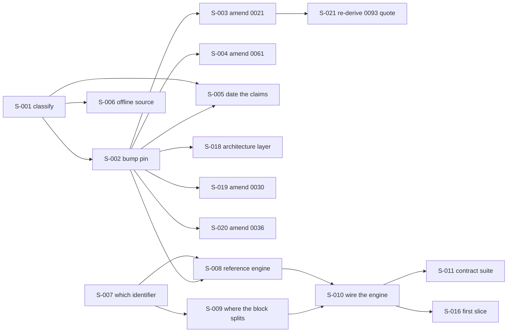

# Seed issue tracker

Scheduled work, decomposed. [`../.claude/rules/seeds.md`](../.claude/rules/seeds.md) is the
authority on what a seed is, what fields it carries, and why. This file is the tracker and does not
restate that rule.

**This file may be cited.** That is the difference between it and
[`BUILD-PLAN.md`](BUILD-PLAN.md), which is temporary, will be deleted, and may never be pointed at.
An item moves from that queue into this file when it becomes actionable, and its queue row is
deleted in the same change.

**This file decides nothing.** Every seed points at the ADR, design, or source file that owns its
subject. Where a seed and its owner disagree, the seed is the bug.

## How to read the chain

A seed with `Blocked by: none` is actionable today. Start there. When a seed is done, read its
`Unblocks` line and mark those seeds `open`.



## Status board

| ID | Title | Status | Blocked by |
|---|---|---|---|
| S-001 | Classify every `7.5.0` reference before changing any | done | none |
| S-002 | Bump the manifest to `[7.6.0]` and re-read the nine licences | open | S-001 done |
| S-003 | Amend ADR-0021 for the new pin and the half-run playbook | blocked | S-002 |
| S-004 | Amend the ADR-0061 stack row to the new pin | blocked | S-002 |
| S-005 | Date or re-point every source-read claim the bump invalidates | blocked | S-001, S-002 |
| S-006 | Decide what replaces the offline 7.5.0 source tree | open | S-001 done |
| S-007 | Resolve umbrella versus granular for `Core`'s engine reference | open | none |
| S-008 | Reference the engine from `Core` and enumerate the restore graph | blocked | S-002, S-007 |
| S-009 | Decide where the `AddOpenIddict` block splits at the persistence boundary | blocked | S-007 |
| S-010 | Wire the engine inside `AddNamiIdentity` | blocked | S-008, S-009 |
| S-011 | Stand up the contract-regression suite ADR-0021 part C requires | blocked | S-010 |
| S-012 | Reconcile design 01's context count against its own table | open | none |
| S-013 | Give the provider-selector key the decided form and an owner | open | none |
| S-014 | Place the three builder calls that exist in no document here | open | none |
| S-015 | Re-own design 04's boot-validation citation | open | none |
| S-016 | Define what the first slice is | blocked | S-010 |
| S-017 | Assign a configuration key to the nine options that have none | open | none |
| S-018 | Move the architecture layer's four engine-version statements to the new pin | blocked | S-002 |
| S-019 | Amend ADR-0030's stack sentence to the new pin | blocked | S-002 |
| S-020 | Amend ADR-0036's live-pin clause to the new pin | blocked | S-002 |
| S-021 | Re-derive ADR-0093's verbatim quotation of ADR-0021 | blocked | S-003 |

---

## S-001. Classify every `7.5.0` reference before changing any

**Status:** done · **Blocked by:** none · **Unblocks:** S-002, S-005, S-006

**Why this is a seed and not the first step of the bump.** Counted 2026-08-08, `7.5.0` appears on
**73 lines across 24 files**, excluding `BUILD-PLAN.md`. They are not the same kind of sentence, and
a bulk find-and-replace would corrupt two of the three kinds. Two of the hits are the name of a
rejected option in ADR-0021's own Considered Options list, and rewriting those would delete the
record of a decision. Many others are dated source reads, which `docs/CLAUDE.md` says must stay in
the past tense, because "a dated measurement edited to match today stops being evidence".

**End state.** A classification exists, in this seed, assigning every one of the
73 lines to exactly one of three buckets. It was written for a pull request body, and the
maintainer works directly on `main`, so it lands here instead, which is also what
`.claude/rules/seeds.md` asks for when prose has no other owner:

- **A, the live pin.** Sentences asserting what Nami pins today. These change.
- **B, the historical record.** Rejected options, amendment histories, and anything already written
  in the past tense with a date. These do not change.
- **C, the dated source read.** Claims of the form "read at the pinned version". These keep their
  date and their tense and gain a note that the pin has moved past them.

The count per bucket is stated, and the three counts sum to 73.

**Verification.** Two searches, not one, because one spelling is not the whole set. This
requirement is a correction the seed's own work produced, and finding 1 below is why.

```bash
git grep -n "7\.5\.0"      -- . ':!docs/BUILD-PLAN.md' ':!docs/SEEDS.md' ':!.claude/rules/seeds.md'
git grep -nP "7\.5(?!\.0)" -- . ':!docs/BUILD-PLAN.md' ':!docs/SEEDS.md' ':!.claude/rules/seeds.md'
```

Re-run both on the day of the work, because a total is a measurement and this one is dated
2026-08-08. Every line in the combined output appears in exactly one bucket, and the check runs in
both directions: no line in the output is unclassified, and no classified line is absent from the
output. The second search uses `-P` and not `-E`, because `docs/CLAUDE.md` records that `git grep
-E` does not honour `\b` in this clone.

The three exclusions each have a reason. `BUILD-PLAN.md` may never be cited. `SEEDS.md` and
`.claude/rules/seeds.md` hold this seed's own prose, so counting them counts the words describing
the work as if they were the work.

**Sources.** `docs/CLAUDE.md`, the section on a pointer at a file you are deleting from;
`docs/adr/0021-openiddict-version-adaptation.md:14`, `:32`, `:39`, `:71`;
`docs/adr/0061-technology-stack-of-record.md:49`.

**Out of scope.** Editing any of the 99 lines. This seed produces a classification, and the only
file it changes is this one.

### Result, measured 2026-08-08

**The test that assigns the bucket.** The seed named three buckets and gave no test, so this is the
test used: **when the pin becomes 7.6.0, what must happen to this line?** Bucket A means the digits
change. Bucket B means nothing happens. Bucket C means the digits stay and the line gains a note
that the pin has moved past them. The boundary between B and C is whether the line is a closed
record or a fact the repository still rests on. A closed record is B, and a fact still relied on is
C.

| Spelling searched | Lines | Files | A | B | C |
|---|---|---|---|---|---|
| `7.5.0` | 73 | 24 | 14 | 4 | 55 |
| `7.5` with no patch number | 26 | 18 | 8 | 3 | 15 |
| **Combined** | **99** | **36** | **22** | **7** | **70** |

**The seed's own figure is confirmed.** Re-running the seed's command today returned 88 lines across
26 files, against the 73 across 24 it was written with. The whole difference is the tracker carrying
the seed: `SEEDS.md` held 14 and `.claude/rules/seeds.md` held 1, and both were written after the
measurement. Excluding those two files reproduces 73 across 24 exactly.

Seven findings follow. The first three change what the bump has to touch.

**1. The seed's own verification command was too narrow, and it hid eight bucket-A lines.** The
`7.5.0` search cannot see a line writing `OpenIddict 7.5` with no patch number, and 26 such lines
exist. Twelve of the 36 files carry only that shorter spelling, so the seed's command returned no
line at all from any of them. Eight of the 26 are bucket A. A bump run against the seed's command as
written would leave eight live-pin statements reading 7.5.

**2. Four bucket-A lines sit in `docs/architecture/`, and no seed owned them.**
`01-introduction-scope.md:14`, `03-drivers-and-constraints.md:114`, `04-system-context.md:21`, and
`README.md:10` each state the engine version. S-003 owns ADR-0021, S-004 owns ADR-0061, and S-005
owns bucket C, so all four fell outside every existing seed. S-018 now owns them.

**3. The bump amends four ADRs rather than two.** Besides ADR-0021 (S-003) and ADR-0061 (S-004),
`docs/adr/0030-dotnet-version-upgrade.md:14` names `OpenIddict 7.5` inside its sentence about the
stack .NET 10 underpins, and `docs/adr/0036-database-key-strategy-uuidv7.md:40` writes "the pin is
7.5.0 (ADR-0061)" in the present tense. S-019 and S-020 now own them, one seed each, because one ADR
per commit is the rule.

**4. ADR-0093 quotes a bucket-A line of ADR-0021 word for word.**
`docs/adr/0093-warnings-as-errors.md:150` writes that the playbook "already instructs the project to
`clear obsolete warnings on 7.5 now`" and cites `0021:44`. That string is `0021:44` itself, which is
bucket A. Editing the source falsifies the quotation, and a style pass may not simplify a quotation,
so the two edits have to land together as two commits. S-021 owns the second one.

**5. Bucket C is not uniform, and S-005 needs the split.** A bucket-C line naming 7.5.0 explicitly
inside a record that already carries a date needs no edit at all, only confirming, which is what
S-005 already says of `design/04-core-protocol.md:55`. Six such lines are ADR `consulted:` entries,
dated by their own frontmatter `date:` field. The lines that do need the note are the ones coupling
the read to the word **pinned**, because that coupling is what breaks.

**6. Two bucket-B lines are rejected options, and rewriting them would delete a decision.**
`0021:32` and `0021:71` are both the option "Pin 7.5.0 forever and never upgrade". Three more
bucket-B lines are illustrations of a bump sequence, `7.5` to `7.6` to `8.0`, at `0011:56`,
`0021:43`, and `design/12-key-management.md:64`. An illustration of a sequence stays true after the
pin moves along it.

**7. One false positive, named so a later searcher does not count it again.**
`docs/DEPENDENCY-LICENSES.md:132` matches a bare `7.5` search and has nothing to do with the engine:
it is `jcharts:jcharts:0.7.5` in the licence-bucket table.

**Per-file counts.** These sum to the combined row above, and they are what makes the classification
re-derivable without a 99-row table.

| File | A | B | C |
|---|---|---|---|
| `Directory.Packages.props` | 10 | 0 | 0 |
| `docs/CLAUDE.md` | 0 | 1 | 1 |
| `docs/DEPENDENCY-LICENSES.md` | 1 | 0 | 9 |
| `docs/adr/0004-refresh-token-posture.md` | 0 | 0 | 4 |
| `docs/adr/0011-no-restart-key-rotation.md` | 0 | 1 | 2 |
| `docs/adr/0014-advanced-protocol-scope.md` | 0 | 0 | 8 |
| `docs/adr/0018-dbcontext-pooling-for-pool-mode.md` | 0 | 0 | 1 |
| `docs/adr/0019-single-logout-strategy.md` | 0 | 0 | 1 |
| `docs/adr/0020-admin-architecture.md` | 0 | 1 | 0 |
| `docs/adr/0021-openiddict-version-adaptation.md` | 3 | 3 | 1 |
| `docs/adr/0030-dotnet-version-upgrade.md` | 1 | 0 | 0 |
| `docs/adr/0033-key-scope-isolation-model.md` | 0 | 0 | 5 |
| `docs/adr/0035-self-service-client-registration.md` | 0 | 0 | 7 |
| `docs/adr/0036-database-key-strategy-uuidv7.md` | 1 | 0 | 0 |
| `docs/adr/0039-revocation-propagation-and-cache-coherence.md` | 0 | 0 | 3 |
| `docs/adr/0043-security-hardening-invariants-startup-check.md` | 0 | 0 | 1 |
| `docs/adr/0048-introspection-revocation-endpoint-isolation.md` | 0 | 0 | 2 |
| `docs/adr/0061-technology-stack-of-record.md` | 1 | 0 | 0 |
| `docs/adr/0091-browser-facing-response-headers.md` | 0 | 0 | 2 |
| `docs/adr/0093-warnings-as-errors.md` | 1 | 0 | 0 |
| `docs/architecture/01-introduction-scope.md` | 1 | 0 | 0 |
| `docs/architecture/03-drivers-and-constraints.md` | 1 | 0 | 0 |
| `docs/architecture/04-system-context.md` | 1 | 0 | 0 |
| `docs/architecture/09-runtime-flow-views.md` | 0 | 0 | 1 |
| `docs/architecture/README.md` | 1 | 0 | 0 |
| `docs/design/02-data.md` | 0 | 0 | 3 |
| `docs/design/04-core-protocol.md` | 0 | 0 | 4 |
| `docs/design/05-resource-server-validation.md` | 0 | 0 | 3 |
| `docs/design/06-sender-constrained-tokens.md` | 0 | 0 | 2 |
| `docs/design/08-user-management.md` | 0 | 0 | 1 |
| `docs/design/09-federation-and-claims-profile.md` | 0 | 0 | 1 |
| `docs/design/12-key-management.md` | 0 | 1 | 2 |
| `docs/design/22-openiddict-seam-catalogue.md` | 0 | 0 | 3 |
| `docs/design/23-configuration-and-client-declaration.md` | 0 | 0 | 1 |
| `src/CLAUDE.md` | 0 | 0 | 1 |
| `src/Nami.Identity.Core/Nami.Identity.Core.csproj` | 0 | 0 | 1 |

**The 22 bucket-A lines in full**, because this is the list S-002 and the four new seeds act on and
it is short enough to write out. `Directory.Packages.props:122`, `:123`, and `:164` through `:171`;
`docs/DEPENDENCY-LICENSES.md:183`; `docs/adr/0021-openiddict-version-adaptation.md:14`, `:39`, and
`:44`; `docs/adr/0030-dotnet-version-upgrade.md:14`;
`docs/adr/0036-database-key-strategy-uuidv7.md:40`;
`docs/adr/0061-technology-stack-of-record.md:49`; `docs/adr/0093-warnings-as-errors.md:150`;
`docs/architecture/01-introduction-scope.md:14`;
`docs/architecture/03-drivers-and-constraints.md:114`; `docs/architecture/04-system-context.md:21`;
and `docs/architecture/README.md:10`.

**The 7 bucket-B lines in full**, because leaving a line alone is a decision that a later reader
will want to check. `docs/CLAUDE.md:182`; `docs/adr/0011-no-restart-key-rotation.md:56`;
`docs/adr/0020-admin-architecture.md:85`; `docs/adr/0021-openiddict-version-adaptation.md:32`,
`:43`, and `:71`; `docs/design/12-key-management.md:64`.

Bucket C is the remaining 70 lines, and S-005 owns them. It is not written out here because the two
searches plus the two lists above produce it by subtraction.

---

## S-002. Bump the manifest to `[7.6.0]` and re-read the nine licences

**Status:** open · **Blocked by:** S-001, which is done · **Unblocks:** S-003, S-004, S-005, S-008,
S-018, S-019, S-020

**What 7.6.0 actually contains**, read at the release page on 2026-08-08. It is a maintenance
release with three changes and no breaking change. The Entity Framework 6.x and EF Core stores
"have been updated to automatically restore the `EntityState` of token entities after failed
application deletion". `OpenIddict.Client.WebIntegration` "now supports Vercel and ID Austria". And
"all the .NET and third-party dependencies have been updated to their latest version". Published
2026-07-15.

**Only one of the three reaches Nami.** The first touches `OpenIddict.EntityFrameworkCore`, which
the persistence adapter will take. The second is in a package S-007 exists to keep out of the graph.
The third moves the transitive closure, which reaches the ADR-0026 licence scan rather than the pin.

**End state.**

- All eight `PackageVersion` rows in `Directory.Packages.props` read `[7.6.0]`, and
  `git grep "\[7\.5\.0\]"` returns nothing.
- `DEPENDENCY-LICENSES.md` section 3.3 records nine licence reads at 7.6.0, each with the read
  location and the date, and carries the new upstream commit,
  `5ce649a5bbbf1340c9be9c4f264197af563ab473`. Read on 2026-08-08 for
  `OpenIddict.Server.AspNetCore` 7.6.0, which declares
  `<license type="expression">Apache-2.0</license>`; the other eight are re-read by this seed rather
  than carried forward from the 7.5.0 reading.
- The 7.5.0 reading is **past-tensed and kept**, not deleted, so the pin's history stays checkable.
- The manifest comment states that the playbook of ADR-0021 parameter D ran in part: the release
  notes were read, and the contract-regression suite it also requires does not exist. S-011 is named
  as the seed that closes that half.

**Verification.** `dotnet build`, `dotnet test`, `dotnet format --verify-no-changes`, the four
self-tests, the guardrail, the decisions index, and `markdownlint-cli2` with its file count
cross-checked against `git ls-files '*.md'`. No `PackageReference` exists yet, so the restore graph
does not move and the build is expected to be unchanged; if it is not, that is a finding and this
seed stops.

**Sources.** `docs/adr/0021-openiddict-version-adaptation.md:39` for the bracket form and `:44` for
the playbook; `docs/adr/0026-dependency-license-policy.md` section A for the permissive list;
`docs/DEPENDENCY-LICENSES.md` section 7 for the read-at-source rule.

**Out of scope.** Amending ADR-0021 or ADR-0061, which are S-003 and S-004, because one ADR per
commit. Adding a `PackageReference`, which is S-008.

---

## S-003. Amend ADR-0021 for the new pin and the half-run playbook

**Status:** blocked · **Blocked by:** S-002 · **Unblocks:** S-021

**The honest difficulty.** This ADR's parameter D requires, for each release, that the
contract-regression suite runs. Searched 2026-08-08, `tests/` holds only
`Nami.Identity.ArchitectureTests` and `Nami.Identity.UnitTests`, and `contract-regression` returns
zero hits across `tests/` and `src/`. So the first bump this repository performs runs half of its
own playbook. The amendment records that as an accepted gap with a named closing seed, rather than
letting a green build imply the playbook ran.

**End state.** ADR-0021 says the pin is 7.6.0. Line 14's "Nami pins OpenIddict 7.5.0" is updated
and the change is recorded in More Information in this ADR's existing amendment style. Parameter
A's bracket example reads `[7.6.0]`. The two Considered Options mentions of 7.5.0 are **unchanged**,
because they name a rejected option. A new More Information entry records the 2026-08-08 bump, what
the release contained, which half of parameter D ran, and that S-011 owes the other half.

**Three lines here, not two, and the third is quoted elsewhere.** S-001 classified `:14`, `:39`, and
`:44` as bucket A, and `:32`, `:43`, and `:71` as bucket B. Line `:44` reads "clear obsolete warnings
on 7.5 now", and `docs/adr/0093-warnings-as-errors.md:150` quotes that string word for word while
citing `0021:44`. So editing `:44` falsifies a quotation in another ADR. S-021 re-derives it, and the
two commits land together.

**Verification.** `bash scripts/check-adrs.sh` after `git add`, and
`python3 scripts/check-decisions-index.py`. Check 3 requires the index row status to equal the
frontmatter status, so confirm neither moved.

**Sources.** `docs/adr/0021-openiddict-version-adaptation.md:14`, `:32`, `:39`, `:43`, `:44`, `:71`.

**Out of scope.** ADR-0061's row, which is S-004. Building the suite, which is S-011.

---

## S-004. Amend the ADR-0061 stack row to the new pin

**Status:** blocked · **Blocked by:** S-002 · **Unblocks:** nothing yet

**End state.** `docs/adr/0061-technology-stack-of-record.md:49` reads 7.6 rather than 7.5 in its
`Protocol engine` row, with the change recorded in that ADR's own maintenance style.

**Why it is a separate seed.** Two reasons, and the second is the real one. One ADR per commit is
the repository's rule. And ADR-0061 is guardrail-enforced from two directions by Check 4, so a
change to it is a different risk from a change to ADR-0021, which Check 4 does not read.

**Verification.** `bash scripts/check-adrs.sh` and `bash scripts/test-check-adrs.sh`. Check 4
compares two lists both derived from this repository's own markup, so a green result proves they
agree and proves nothing about a shared omission; read the row rather than the exit code.

**Sources.** `docs/adr/0061-technology-stack-of-record.md:49`, and `:84` for the limit of Check 4.

**Out of scope.** Every other row in that table.

---

## S-005. Date or re-point every source-read claim the bump invalidates

**Status:** blocked · **Blocked by:** S-001, S-002 · **Unblocks:** nothing yet

**The problem in one sentence.** At least a dozen documents state a fact about the engine and
attribute it to "the pinned version", and after S-002 the pinned version is not the one that was
read.

**End state.** Every bucket-C line from S-001 either names 7.5.0 explicitly with its original date,
or is rewritten to name the version actually read. No line says "the pinned version" while meaning
a version that is no longer pinned. `design/04-core-protocol.md:55`, which reads "Every API name in
this block was read at OpenIddict release tag 7.5.0", is already in the correct shape and is
confirmed rather than edited.

**The set is 70 lines, and S-001 says which.** Subtract S-001's 22 bucket-A lines and its 7 bucket-B
lines from the 99 its two searches returned. Two facts from that classification change this seed's
shape. A bucket-C line that already names 7.5.0 inside a record carrying its own date needs
confirming and no edit, and six of them are ADR `consulted:` entries dated by their frontmatter
`date:` field. The lines that do need the note are the ones coupling a read to the word **pinned**.

**Verification.** `git grep -n "at the pinned version"` returns only lines whose surrounding text
names 7.6.0, or names 7.5.0 with a date. **That pattern alone is too narrow to close this seed.**
Measured 2026-08-08, it matched 7 lines across 5 files outside `SEEDS.md`, while the wider phrase
`the pinned` matched 34 files. So run the wider phrase as well and read every hit that also names a
version. Re-run `/refresh-citations` afterwards, because this seed edits many files and will age
pointers into them.

**Sources.** `docs/design/04-core-protocol.md:55` and `:1054`;
`docs/design/22-openiddict-seam-catalogue.md:250` and `:606`;
`docs/design/23-configuration-and-client-declaration.md:486`;
`docs/adr/0091-browser-facing-response-headers.md:30` and `:438`;
`docs/design/05-resource-server-validation.md:597`;
`docs/design/06-sender-constrained-tokens.md:121`.

**Out of scope.** Re-verifying any of the claims against 7.6.0 source. This seed fixes what the
claims say about their own provenance. Whether each claim is still true at 7.6.0 is S-011's
subject, and S-006 is what makes checking it possible at all.

---

## S-006. Decide what replaces the offline 7.5.0 source tree

**Status:** blocked · **Blocked by:** S-001 · **Unblocks:** nothing yet

**Why this is a decision and not a chore.** `docs/CLAUDE.md` records that the external design
corpus carries a checked-in OpenIddict source tree, that it sits at commit
`aa7fac0996cb1c86c4310a005bdc66077eb53ba8`, and that "the local NuGet cache carries only 7.4.0, so
that tree is the only offline way to verify a 7.5.0 default". 7.6.0 declares a different upstream
commit, `5ce649a5bbbf1340c9be9c4f264197af563ab473`, read 2026-08-08. So after S-002 there is no
offline way to read the pinned engine's source, and this repository's evidence rule leans on exactly
that ability.

**End state.** A decision exists, recorded as an ADR because it changes how every future engine
claim is verified. It picks one of: read the shipped assemblies from the restored package, which is
what ADR-0091 already did once; obtain the 7.6.0 source for offline reading; or accept that engine
claims are verified online and say so. Whatever is chosen, `docs/CLAUDE.md`'s paragraph about the
reference tree is corrected in the same change, because it currently describes a tree that matches
the pin and will not.

**Verification.** The ADR lands with rows in both indexes and passes Check 3 and Check 7.
`docs/CLAUDE.md` no longer claims the checked-in tree matches the pin.

**Sources.** `docs/CLAUDE.md`, the "Reading the external design corpus" section;
`docs/adr/0091-browser-facing-response-headers.md:5`, which read a shipped assembly rather than
source and is the precedent for one of the options.

**Out of scope.** Re-verifying any specific claim. This seed decides the method.

---

## S-007. Resolve umbrella versus granular for `Core`'s engine reference

**Status:** open · **Blocked by:** none · **Unblocks:** S-008, S-009

**The disagreement, quoted from both sides.**
`docs/design/01-foundations.md:430` lists the engine as `OpenIddict (AspNetCore,
EntityFrameworkCore, Quartz)` in its key-libraries table. `docs/design/04-core-protocol.md:827`
lists `OpenIddict.Server (.AspNetCore)` and `:828` lists `OpenIddict.Validation (.AspNetCore,
.ServerIntegration)`, and that document never names the umbrella package at all.

**Why it matters, measured 2026-08-08 at the nuget.org flat container.**
`OpenIddict.AspNetCore` declares **seven** net10.0 dependencies, being the whole client stack plus
the `OpenIddict` meta-package, and the meta-package reaches
`OpenIddict.Client.WebIntegration`, whose nupkg is **2 864 477 bytes**, for a server that is not an
OAuth client. `OpenIddict.Server.AspNetCore` declares **one**, `OpenIddict.Server`. Every extra node
is a licence read owed under ADR-0026.

**End state.** One of the two documents is corrected, and the correction says which was the bug and
why. Design 01 is the implementer source of record for the package graph, and design 04 for
everything inside the protocol host, so the resolution has to say which question each table was
answering before deciding which one is wrong.

**Verification.** `git grep -n "OpenIddict.AspNetCore"` returns no line that presents the umbrella
as what `Core` references, or design 04 is corrected instead and the same check passes in reverse.
`bash scripts/check-adrs.sh` and `markdownlint-cli2`.

**Sources.** `docs/design/01-foundations.md:98-99` and `:430`;
`docs/design/04-core-protocol.md:827-829` and `:1024-1029`.

**Out of scope.** Adding the reference, which is S-008.

---

## S-008. Reference the engine from `Core` and enumerate the restore graph

**Status:** blocked · **Blocked by:** S-002, S-007 · **Unblocks:** S-010

**End state.**

- `src/Nami.Identity.Core/Nami.Identity.Core.csproj` carries the `PackageReference` items S-007
  settled, with no `Version` attribute, because Central Package Management is on and a version there
  is `NU1008`.
- `DEPENDENCY-LICENSES.md` gains a restore-graph enumeration in the style of its section 3.1, read
  from `src/Nami.Identity.Core/obj/project.assets.json` after restore, with every node's licence
  read at its own nuspec and the date recorded.
- **The two inert architecture facts become live**, and the seed proves it rather than asserting it.
  Measured 2026-08-08, `Nami.Identity.Core.dll`'s reference table held only `System.*` and
  `Microsoft.Extensions.*`, so `CoreReferencesNoAdapterOrDatabaseProviderOrCloudSdk` and
  `CoreReferencesNoSiblingNamiPackageExceptAbstractions` were both asserting an empty set that was
  empty for a reason other than the rule. After this seed, at least one engine assembly appears in
  that table, and the class remarks recording the inert state are updated to say so.

**Verification.** All nine gates. Then plant a forbidden reference and watch
`CoreReferencesNoAdapterOrDatabaseProviderOrCloudSdk` fail, which is the check that could not be run
before this seed.

**Sources.** `src/CLAUDE.md`, the section on versions living in `Directory.Packages.props`;
`tests/Nami.Identity.ArchitectureTests/CoreDependencyRuleTests.cs`, the class remarks recording the
elision measurement; `docs/DEPENDENCY-LICENSES.md` section 3.1 for the enumeration shape.

**Out of scope.** Calling `AddOpenIddict`, which is S-010.

---

## S-009. Decide where the `AddOpenIddict` block splits at the persistence boundary

**Status:** blocked · **Blocked by:** S-007 · **Unblocks:** S-010

**The contradiction, quoted from both sides.**
`docs/design/01-foundations.md:98-99` says `Core` "depends only on `Abstractions` plus the protocol
engine" and "must not reference any adapter, database provider, or cloud SDK".
`docs/design/04-core-protocol.md:66-68` writes the wiring as
`.AddCore(o => o.UseEntityFrameworkCore().UseDbContext<OpenIddictDbContext>().UseQuartz())`.
`UseEntityFrameworkCore` is persistence and `UseQuartz` is scheduling, so the block cannot live
whole inside `Core`.

**What is already settled and must not be re-litigated.** ADR-0096 decision 4 of the 2026-08-08
session established that `Core` ships `AddNamiIdentity()`, which calls `AddOpenIddict()` inside
itself, and that the host calls only `AddNamiIdentity()`. So the question is not whether `Core`
calls the engine. It is which fluent segments belong to `Core` and which to the persistence adapter.

**End state.** A statement exists, in the layer entitled to make it, of which segments of the block
belong to which assembly. If the answer turns out to be a decision rather than a realization, it is
an ADR; if it is a realization of ADR-0024 and ADR-0027, it is a design correction. The seed says
which it concluded and why.

**Verification.** `bash scripts/check-adrs.sh`, and the claim is checkable by reading: no document
asks `Core` to call a persistence-configuring method.

**Sources.** `docs/design/01-foundations.md:98-99`; `docs/design/04-core-protocol.md:66-68`;
`docs/adr/0024-architecture-style.md:47`; `docs/adr/0027-packaging-and-distribution.md:35`.

**Out of scope.** Writing the wiring, which is S-010.

---

## S-010. Wire the engine inside `AddNamiIdentity`

**Status:** blocked · **Blocked by:** S-008, S-009 · **Unblocks:** S-011, S-016

**End state.** `AddNamiIdentity` calls `AddOpenIddict()` and configures the segments S-009 assigned
to `Core`. Every API name written is read at 7.6.0 rather than carried from a document that read
7.5.0, and the seed says where each was read. The options this repository already fixed are applied:
the endpoint URIs, the flows, and the token formats named in design 04 section 3.

**Verification.** All nine gates. Plus a unit fact per configured value that a later edit could
change silently, on the same reasoning that made the options defaults worth pinning: measured
2026-08-08, a changed default produced a green build, a green format run, and a byte-identical
public API file.

**Sources.** `docs/design/04-core-protocol.md` section 3, the implementer source of record for the
block; `docs/adr/0021-openiddict-version-adaptation.md:46` for the handler-order rules.

**Out of scope.** Any slice, which is S-016. The contract-regression suite, which is S-011.

---

## S-011. Stand up the contract-regression suite ADR-0021 part C requires

**Status:** blocked · **Blocked by:** S-010 · **Unblocks:** nothing yet

**Why it is blocked rather than first.** The suite asserts seam behaviour on the pinned engine, and
most seams need the engine wired before there is behaviour to assert. That is also why the 7.6.0
bump proceeds without it, and why S-003 records the gap instead of hiding it.

**End state.** A test project exists that asserts at least the seams reachable from what S-010
wired, it runs in CI as its own job, and ADR-0021's Confirmation is updated to say which part of its
build-time item is now closed and which is not. Each assertion is watched to fail against a planted
break before it is believed, per the rule this repository reached three times by three mechanisms.

**Verification.** The suite runs in CI. Every assertion has a recorded planted break and the run log
line showing it failed.

**Sources.** `docs/adr/0021-openiddict-version-adaptation.md:43` for what the suite must cover, and
`:62` for the build-time item; `docs/design/22-openiddict-seam-catalogue.md` for the seam registry;
`tests/CLAUDE.md`, the section on a rule you have not failed on purpose.

**Out of scope.** Conformance testing, which part D names separately and which needs a running host.

---

## S-012. Reconcile design 01's context count against its own table

**Status:** open · **Blocked by:** none · **Unblocks:** nothing yet

**The defect, counted 2026-08-08.** `docs/design/01-foundations.md` section 2 says "the **four**
database contexts" once. Six other places say "the **five** contexts": the package table in section
3.1, section 4's own opening sentence, the composition-root paragraph in section 5.1, the first-run
diagram in section 5.2, the patterns note in section 6, and the integration-test bullet in section
9. Section 4's table then lists **four** rows.

**The fifth is real, not a miscount.** `ControlPlaneTenantDbContext` appears in
`docs/adr/0001-multi-tenant-isolation-model.md`,
`docs/adr/0018-dbcontext-pooling-for-pool-mode.md`, `docs/design/02-data.md` five times,
`docs/design/10-email-notification.md`, and
`docs/design/17-erasure-and-data-subject-rights.md`.

**End state.** Section 4's table lists five contexts with their scope and pooling posture, matching
`design/02-data.md`, and section 2's "four" is corrected. The seed says which of the two numbers was
the transcription and which was derived, because a count and a list disagreeing means one of them was
copied.

**Verification.** `git grep -c "five contexts" docs/design/01-foundations.md` and a read of section
4's table row count agree. `markdownlint-cli2` and the guardrail.

**Sources.** As enumerated above.

**Out of scope.** The schema of the fifth context, which `design/02-data.md` owns.

---

## S-013. Give the provider-selector key the decided form and an owner

**Status:** open · **Blocked by:** none · **Unblocks:** nothing yet

**Two defects in one place.** `docs/adr/0065-coding-and-naming-conventions.md:78` fixes
configuration keys as `Nami:Section:Key` and makes them a public contract under ADR-0044 parameter
I. `Cloud:Provider` has no `Nami:` prefix. And
`docs/design/10-email-notification.md:168` calls it "the `Cloud:Provider` selector shape whose SSOT
is the foundations config" while `docs/design/12-key-management.md:683` names a shared
`CloudProviderSelector`, yet `docs/design/01-foundations.md` section 5.1 says only "A provider
selector reads one configuration value" and names neither the key nor the type. Two citations
resolve to a document that does not hold the claim.

**End state.** Design 01 section 5.1 names the key and the type, in the ADR-0065 form, or the two
citing documents are corrected to point at whatever does own them. Either way, no document attributes
a fact to design 01 that design 01 does not carry.

**Verification.** `git grep -n "Cloud:Provider"` returns only the decided spelling.
`bash scripts/check-adrs.sh` and `markdownlint-cli2`.

**Sources.** As quoted above.

**Out of scope.** Implementing the selector.

---

## S-014. Place the three builder calls that exist in no document here

**Status:** open · **Blocked by:** none · **Unblocks:** nothing yet

**The absence, with its search.** Counted 2026-08-08 over `docs/` excluding `BUILD-PLAN.md`, three
fluent calls the module set will need appear in **zero files**: an external-provider registration,
a scope-seeding call, and a client-seeding call. For the external-provider call five spellings were
tried and all five returned zero: `AddExternalProvider`, `AddExternalIdentityProvider`,
`AddFederation`, `AddExternalIdP`, `AddOidcProvider`. The **concept** does resolve, in
`docs/adr/0002-federation-external-idp-integration.md` and four other files, and naming that stops a
later reader re-finding it as coverage.

**End state.** Each of the three has a name and an owning design: the external-provider call in
`design/09-federation-and-claims-profile.md`, and the two seeding calls in
`design/23-configuration-and-client-declaration.md`. Design 01 section 3.4's sample is extended so
it stops showing four of the module calls and hiding the rest.

**Verification.** Each name resolves to exactly one owning design. `bash scripts/check-adrs.sh`.

**Sources.** `docs/design/01-foundations.md` section 3.4;
`docs/adr/0028-user-management.md:38` for the shape an existing module call takes;
`docs/adr/0096-fluent-builder-api-surface.md` parameter G for why they are extension methods.

**Out of scope.** Implementing any of them.

---

## S-015. Re-own design 04's boot-validation citation

**Status:** open · **Blocked by:** none · **Unblocks:** nothing yet

**The defect.** `docs/design/04-core-protocol.md:811` says the `Nami:Protocol:*` keys "are validated
at boot (ADR-0052)". ADR-0052's five parameters A through E are entirely about client and scope
declaration, and its subject is `ClientDefinition` and `ScopeDefinition`. It carries no clause about
protocol configuration keys.

**What is not the answer.** `docs/adr/0043-security-hardening-invariants-startup-check.md` is the
nearest live mechanism and is a different thing: it asserts a fixed list of named security
invariants, not the presence of a configuration value. Searched 2026-08-08 across `docs/adr/`, nine
spellings for an options-validation mechanism returned zero files each: `IValidateOptions`,
`ValidateOnStart`, `ValidateDataAnnotations`, `AddOptions`, `missing value`, `required value`,
`fail at start`, `fails at start`. A tenth, `OptionsBuilder`, returned one file, and the hit is
`DbContextOptionsBuilder` at `docs/adr/0036-database-key-strategy-uuidv7.md:40`, an EF Core type.

**End state.** The citation names an owner that carries the claim, or the claim is marked not
verified with its search. ADR-0096 parameter C decided the mechanism for `NamiIdentityOptions` only
and says so, so it is a precedent and not an answer for the protocol keys.

**Verification.** `bash scripts/check-adrs.sh`, and a read of the cited ADR confirming it holds the
claim.

**Sources.** `docs/design/04-core-protocol.md:811`; `docs/adr/0052-ergonomic-config-layer.md`
parameters A through E; `docs/adr/0096-fluent-builder-api-surface.md` parameter C.

**Out of scope.** Deciding the mechanism for the protocol keys, which is design 04's own change and
may need an ADR.

---

## S-016. Define what the first slice is

**Status:** blocked · **Blocked by:** S-010 · **Unblocks:** nothing yet

**The absence, with its search.** Counted 2026-08-08 with `git grep -i` over every tracked file
except `BUILD-PLAN.md`, `first slice` returned **zero**. `docs/adr/0024-architecture-style.md:47`
says the IdP-core "slice" is "the handler pipeline plus a few domain services (claims, consent,
keys)", which describes the layer rather than naming a first unit of work.

**The adjacent question, partly answered.** `docs/adr/0027-packaging-and-distribution.md:85` asks
which assembly carries the five pass-through controllers. `ADR-0024:47` places "the authorization
controller, endpoints, and `AddOpenIddict()` wiring in the server host", which answers one of the
five; `0024:51` names all five endpoints and no assembly.

**End state.** One slice is named, with its owning design, and it is small enough to be a seed of its
own. The naming says whether it was decided or transcribed.

**Verification.** The named slice resolves to a design that describes its request, handler, and
response, per `docs/adr/0024-architecture-style.md:44`.

**Sources.** As quoted above.

**Out of scope.** Writing the slice. That is the seed this one creates.

---

## S-017. Assign a configuration key to the nine options that have none

**Status:** open · **Blocked by:** none · **Unblocks:** nothing yet

**Not a defect, a consequence that was chosen.**
`docs/adr/0096-fluent-builder-api-surface.md` parameter F declined to mint eleven public
configuration contracts in one change, and left each key to the design owning its member's subject.
`docs/design/04-core-protocol.md` section 6 has assigned three. Nine members are therefore settable
in code only, and an operator cannot change them without recompiling.

**End state.** Each of the nine either has a key in the `Nami:Section:Key` form, assigned by the
design owning its subject, or is recorded as deliberately code-only with the reason. The seed does
not have to close all nine; it may split into one seed per owning design, and doing so is the
expected outcome rather than a failure to finish.

**Verification.** Every member of `NamiIdentityOptions` either appears in a configuration-key table
or is named in a list of code-only options.

**Sources.** `docs/adr/0096-fluent-builder-api-surface.md` parameter F;
`docs/adr/0065-coding-and-naming-conventions.md:78`;
`docs/adr/0044-public-api-stability-and-semver.md` parameter I.

**Out of scope.** Changing any default.

---

## S-018. Move the architecture layer's four engine-version statements to the new pin

**Status:** blocked · **Blocked by:** S-002 · **Unblocks:** nothing yet

**Why this seed exists at all.** S-001 found four bucket-A lines that no seed owned. The reason they
were missed is the finding worth keeping: S-001's own search spelling was `7.5.0`, and all four write
`OpenIddict 7.5` with no patch number, so the search that was supposed to find every live-pin
statement returned none of them.

**End state.** All four lines name the pin S-002 landed:

| Line | What it says today |
|---|---|
| `docs/architecture/01-introduction-scope.md:14` | "built on OpenIddict 7.5" |
| `docs/architecture/03-drivers-and-constraints.md:114` | a table row, "OpenIddict 7.5, version-pinned and seam-isolated" |
| `docs/architecture/04-system-context.md:21` | a mermaid node label, "on OpenIddict 7.5 and .NET 10" |
| `docs/architecture/README.md:10` | "built on OpenIddict 7.5 and .NET 10" |

**This layer may not decide, so it may not disagree either.** `docs/architecture/README.md:32-33`
says this layer "points into them as the authoritative source, and where it disagrees with one of
them, this layer is the bug". A version statement here that outlives the pin is exactly that
disagreement, so the fix is a transcription from ADR-0061 and not a judgement.

**Verification.** `git grep -nP "OpenIddict 7\.5(?!\.0)" -- docs/architecture/` returns only
`09-runtime-flow-views.md:296`, which is bucket C and belongs to S-005. `bash scripts/check-adrs.sh`
after `git add`, `python3 scripts/check-decisions-index.py`, and `markdownlint-cli2` with its file
count cross-checked against `git ls-files '*.md'`. The mermaid label at `04:21` is inside a fenced
block, so read it rather than trusting a link checker, which is the trap `docs/design/CLAUDE.md`
records for pointers inside fences.

**Sources.** The four lines above, each read 2026-08-08; `docs/architecture/README.md:31-35` for why
this layer may not hold a version the ADR does not;
`docs/adr/0061-technology-stack-of-record.md:49` for the row that is authoritative once S-004 lands.

**Out of scope.** `09-runtime-flow-views.md:296`, which is a source-read claim rather than a pin
statement. Every other version in these four files, including .NET 10.

---

## S-019. Amend ADR-0030's stack sentence to the new pin

**Status:** blocked · **Blocked by:** S-002 · **Unblocks:** nothing yet

**End state.** `docs/adr/0030-dotnet-version-upgrade.md:14` names the engine version S-002 landed.
The line reads "Nami pins .NET 10 (LTS), the runtime foundation of the entire stack (ASP.NET Core, EF
Core 10, OpenIddict 7.5, Npgsql, ASP.NET Core Identity, Finbuckle)", so the edit is one item inside a
list. The change is recorded in this ADR's own maintenance style.

**Why it is its own seed.** One ADR per commit. And this ADR's subject is the .NET pin, not the
engine pin, so a reader looking for engine-version work would not open it. That is precisely why it
was missed until S-001 searched the shorter spelling.

**Verification.** `bash scripts/check-adrs.sh` after `git add`, and
`python3 scripts/check-decisions-index.py`. Check 3 compares the index row status against the
frontmatter status, so confirm neither moved. Read the line rather than the exit code, because no
gate here reads a version.

**Sources.** `docs/adr/0030-dotnet-version-upgrade.md:14`, read 2026-08-08.

**Out of scope.** Every other technology in that sentence. The .NET pin itself, which this ADR
decides and this seed does not touch.

---

## S-020. Amend ADR-0036's live-pin clause to the new pin

**Status:** blocked · **Blocked by:** S-002 · **Unblocks:** nothing yet

**One line carrying two claims, and only one of them moves.**
`docs/adr/0036-database-key-strategy-uuidv7.md:40` says the key-type mapping was "**Read at
`OpenIddict.EntityFrameworkCore` 7.4.0**, the only version in the local package cache; the pin is
7.5.0 (ADR-0061), so re-confirm on the pinned package at M1". The dated read at 7.4.0 is a
measurement and stays. The clause "the pin is 7.5.0" is present tense about the pin and moves.

**End state.** The clause names the pin S-002 landed. The 7.4.0 read keeps its version, its wording,
and its "re-confirm at M1" instruction, because that instruction is now more owed rather than less:
the pin has moved twice past the version actually read.

**Verification.** `bash scripts/check-adrs.sh` after `git add`, and
`python3 scripts/check-decisions-index.py`. Then read the line and confirm that the sentence still
distinguishes the version read from the version pinned. A single edit collapsing the two into one
version is the failure mode here, and it would delete a measurement.

**Sources.** `docs/adr/0036-database-key-strategy-uuidv7.md:40`, read 2026-08-08;
`docs/CLAUDE.md`, the section on a pointer at a file you are deleting from, for why the 7.4.0 read
stays in the past tense.

**Out of scope.** Re-confirming the key-type mapping against the new pin. That is the M1 item the
line already names, and it needs a restored package rather than a document edit.

---

## S-021. Re-derive ADR-0093's verbatim quotation of ADR-0021

**Status:** blocked · **Blocked by:** S-003 · **Unblocks:** nothing yet

**Blocked by S-003 and not by S-002, and the distinction is the whole seed.** The quotation only
breaks if S-003 actually edits the line it quotes. So this seed cannot be written until S-003 has
landed, and it must read the final text rather than predict it.

**The coupling, quoted from both sides.**
`docs/adr/0093-warnings-as-errors.md:150` writes that ADR-0021's playbook "already instructs the
project to `clear obsolete warnings on 7.5 now`" and cites `0021:44`.
`docs/adr/0021-openiddict-version-adaptation.md:44` is the source of that string and is bucket A in
S-001's classification.

**End state.** ADR-0093's quotation matches ADR-0021:44 word for word after S-003 landed, and the
`0021:44` pointer is re-derived against the final tree rather than assumed. If S-003 moved lines
above `:44`, the pointer changes even when the quoted words do not.

**Which rule owns this, stated exactly, because the near-miss answer is wrong.**
`.claude/rules/writing-style.md` rule 2 of its "Nami only" section says "Quoted **outside** text
stays word for word". ADR-0021 is not outside text, so that rule is a precedent here and not the
owner. What owns it is the root `CLAUDE.md` evidence rule: "Quote before you assert. Citing
`ADR-NNNN` means the fact is *in* that ADR". A quotation that no longer matches its source is that
rule's failure, not a style defect. So the only correct repair is to re-read the source and copy it,
never to paraphrase the quotation into agreement.

**Verification.** `bash scripts/check-adrs.sh` after `git add`, and
`python3 scripts/check-decisions-index.py`. Then open `0021:44` and compare the quoted substring
character by character. `/refresh-citations` covers the pointer, and the `checking-a-citation` skill
owns what the pointer must satisfy.

**Sources.** `docs/adr/0093-warnings-as-errors.md:150` and
`docs/adr/0021-openiddict-version-adaptation.md:44`, both read 2026-08-08; the root
[`../CLAUDE.md`](../CLAUDE.md) evidence rule, its "Quote before you assert" bullet;
`.claude/rules/writing-style.md`, the "Nami only" section, rule 2, as the precedent it is.

**Out of scope.** Every other citation in ADR-0093, and ADR-0021 itself, which S-003 owns.

---

## Maintenance

- A seed is added here **in the same change** that establishes the work, with its end state, its
  verification, its chain edges, and its sources.
- A seed is marked `done` when its verification has been run and its pull request has landed. The
  seed stays in the file, because the chain has to stay readable after the fact.
- Seed IDs are never reused and never renumbered. A seed that turns out to be wrong is marked and
  explained, not deleted.
- When a seed splits, the original stays and names the seeds it split into. Splitting is the normal
  outcome of finding that a seed was not single-agent-sized.
- An item arriving from [`BUILD-PLAN.md`](BUILD-PLAN.md) has its queue row deleted in the same
  change that creates its seed.
