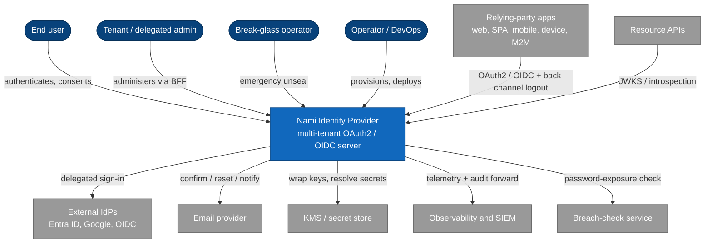

# Context view (C4 Level 1)

Who and what sits around Nami. Nami is one system; everything else is an actor
who uses it or an external system it talks to across the boundary.

## Actors

| Actor | Role at the boundary |
|---|---|
| End user | Browser-based sign-in, consent, passkey/MFA, tenant switch |
| Tenant / delegated admin | Manages tenant resources through the admin BFF, under RBAC and delegated-admin grants (ADR-0010) |
| Break-glass operator | Emergency, dual-control access that works even when the IdP cannot issue tokens (ADR-0007, ADR-0015) |
| Operator / DevOps | Tenant onboarding, deployment under dual control, DR drills |

## External systems

| System | Relationship |
|---|---|
| Relying-party apps | OAuth2/OIDC clients (web, SPA, mobile, device, M2M); receive tokens and back-channel `logout_token` |
| Resource APIs | Validate tokens locally by JWKS or by introspection, per-tenant issuer (ADR-0048, ADR-0049) |
| External IdPs | Federated sign-in; static and global in v1, per-tenant dynamic in v2 (ADR-0002, ADR-0034) |
| Email provider | Confirmation, reset, and notification mail through a cloud-agnostic port (ADR-0038) |
| KMS / secret store | Optional envelope encryption and secret resolution; database-backed default when absent (ADR-0006, ADR-0009) |
| Observability and SIEM | OTLP telemetry sink and write-once audit anchoring (ADR-0022, ADR-0008) |
| Breach-check service | Password-exposure check with k-anonymity, fail-open (ADR-0028) |

---

[← Index](README.md) · Next: [Domain →](02-domain.md)
