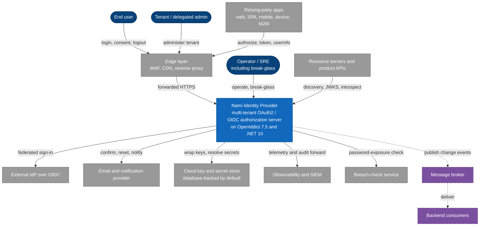

# Context view (C4 Level 1)

> **Part of:** the [Software Architecture Document](README.md), structural views. C4 Level 1.

Nami as a single box: the people who use it and the external systems it depends on or
serves, with no internal structure. Internal decomposition starts in
[03-containers](03-containers.md).

```mermaid
graph TB
  enduser([End user]):::person
  admin([Tenant / delegated admin]):::person
  ops([Operator / SRE<br/>including break-glass]):::person

  nami["Nami Identity Provider<br/>multi-tenant OAuth2 / OIDC authorization server<br/>on OpenIddict 7.5 and .NET 10"]:::host

  edge[Edge layer<br/>WAF, CDN, reverse proxy]:::ext
  rp[Relying-party apps<br/>web, SPA, mobile, device, M2M]:::ext
  rs[Resource servers and product APIs]:::ext
  extidp[External IdP over OIDC]:::ext
  email[Email and notification provider]:::ext
  kms[Cloud key and secret store<br/>database-backed by default]:::ext
  obs[Observability and SIEM]:::ext
  hibp[Breach-check service]:::ext
  broker[Message broker]:::v2
  backend[Backend consumers]:::v2

  enduser -->|login, consent, logout| edge
  admin -->|administer tenant| edge
  rp -->|authorize, token, userinfo| edge
  edge -->|forwarded HTTPS| nami
  ops -->|operate, break-glass| nami
  rs -->|discovery, JWKS, introspect| nami
  nami -->|federated sign-in| extidp
  nami -->|confirm, reset, notify| email
  nami -->|wrap keys, resolve secrets| kms
  nami -->|telemetry and audit forward| obs
  nami -->|password-exposure check| hibp
  nami -.->|publish change events| broker
  broker -.->|deliver| backend

  classDef person fill:#08427b,stroke:#052e56,color:#ffffff
  classDef host fill:#1168bd,stroke:#0b4884,color:#ffffff
  classDef store fill:#438dd5,stroke:#2e6295,color:#ffffff
  classDef ext fill:#999999,stroke:#6b6b6b,color:#ffffff
  classDef v2 fill:#7b4fa0,stroke:#54356f,color:#ffffff,stroke-dasharray:5 4
```

Browser and client traffic reaches Nami **through the edge layer**, which is an assumed
part of the reference deployment rather than a component Nami ships (ADR-0073). The
purple dashed elements are the additive change-event path, designed and kill-switched
off in v1 (ADR-0071).

## Actors

| Actor | Role at the boundary |
|---|---|
| End user | Resource owner: signs in with a password or passkey, completes MFA and step-up, grants or denies consent, initiates logout, switches tenant |
| Tenant / delegated admin | Manages the tenant's clients, scopes, users, roles, memberships, and delegated admins through the admin app, scoped to their tenants with no cross-tenant reach. Grants are capability-scoped and time-bound, and there is no super-admin (ADR-0010) |
| Operator / SRE | Deploys and upgrades, watches the SLO and alerts, runs the runbooks (key rotation, DR restore, tenant onboarding), and exercises break-glass |

**Break-glass is a capability, not a separate person.** It is drawn inside the operator
role rather than as its own actor because that is what it is: an emergency, audited path
the operator exercises, which must keep working even when the provider cannot issue
tokens. Two distinct break-glass paths exist and their control requirements differ, so
they are not interchangeable:

* **Key-compromise break-glass** (ADR-0007) ejects a compromised key from the JWKS.
  Its mass-revocation and session-purge trigger **requires dual control** with proposer
  and approver distinct, which is an accepted decision, as is the drill cadence.
* **Admin break-glass** (ADR-0015) is emergency administrative access when normal
  sign-in is unavailable. Whether unsealing it requires a second approver is **not yet
  ratified** and is a pre-GA Security item, so this view does not describe it as
  dual-controlled.

## External systems

| System | Direction | Relationship |
|---|---|---|
| Edge layer | Inbound front | Assumed L7 protection: TLS termination policy, IP reputation and bot filtering, geographic and per-IP velocity rules, request and header size caps, L7 denial-of-service absorption. With no edge, those responsibilities fall to Kestrel hardening plus the in-application limits of ADR-0040 and ADR-0042, at a lower ceiling (ADR-0073) |
| Relying-party apps | Inbound | OAuth2 / OIDC clients (web, SPA, mobile, device, M2M). Authorization code with PKCE for interactive clients, client credentials with `private_key_jwt` for machine-to-machine (ADR-0009), device code for input-constrained devices; they also receive the back-channel `logout_token` (ADR-0019) |
| Resource servers and product APIs | Inbound (validation) | Default path is local JWT validation against cached JWKS, with no per-call round trip; reference tokens use introspection with client authentication and audience confinement (ADR-0048). A resource server must bind on issuer and audience, and on the `tenant` claim where it is shared-host (ADR-0049) |
| External IdP over OIDC | Outbound | Upstream federated sign-in, static and configured out of band in v1 (ADR-0002), with per-tenant self-service federation as an additive v2 feature (ADR-0034). Both verify the authorization-response issuer (RFC 9207) and bind correlation state to the initiating scheme, against IdP mix-up |
| Email and notification provider | Outbound | Confirmation, reset, and notification mail behind a cloud-agnostic port, with a transactional outbox, retry, idempotency, and anti-enumeration (ADR-0038) |
| Cloud key and secret store | Outbound | Optional envelope encryption and secret resolution behind ports; the **database-backed adapter is the default** so the product runs with no cloud at all, and the Data Protection keyring is deliberately independent of Redis (ADR-0006, ADR-0009) |
| Observability and SIEM | Outbound | Two separate lanes: OTLP for logs, traces, and metrics (ADR-0022), and a distinct tamper-evident security-event stream forwarded to a write-once destination (ADR-0008). They are joined only by a correlation identifier |
| Breach-check service | Outbound | Password-exposure check using a k-anonymity hash prefix, fail-open, with the outward data flow itself a pre-GA data-protection sign-off (ADR-0028) |
| Message broker and backend consumers | Outbound (v2) | Transactional-outbox delivery of CloudEvents 1.0 through an `IMessageTransporter` port, with one reference adapter and other brokers as extension points. Nami is a **producer only**, with no inbound dependency on any consumer. Note a backend consumer is usually **also a resource server**, so it appears twice in this table under two different relationships: it validates tokens inbound and receives events outbound. Not present in v1 (ADR-0071) |

## Responsibilities and boundaries

Nami **owns**: token issuance and validation policy, user authentication and MFA,
consent, session lifecycle, tenant resolution and isolation, the signing-key lifecycle,
administration and delegated administration, the audit trail, and, in v2, publishing its
own change facts.

Nami does **not** own: the upstream identity of a federated user, which stays with the
external provider; the business meaning of downstream data, which the resource servers
own; key material at the hardware level, which is delegated to a cloud store when one is
configured; the edge protections above; or any compliance verdict, which belongs to Legal
and the data-protection owner.

Two boundary rules are load-bearing and reappear in every later view.

* **The tenant boundary is issuer and claim, never signature.** Because Pool tenants
  share one signing keyset per pool group (ADR-0033), two tokens from two different
  tenants verify against the same key, so **signature validity is not a tenant-isolation
  boundary**. A resource server must validate signature **and** issuer **and** audience,
  plus the `tenant` claim where it serves several tenants on one host. This is stated as
  an invariant precisely so it cannot be quietly dropped, since dropping it re-opens
  cross-tenant token acceptance (ADR-0049). It was proven rather than assumed: spike A-7
  (verification record V27, run 2026-07-09, 4 of 4) showed the signature failing to
  isolate under the shared key, and issuer binding plus the `tenant` claim plus row-level
  security succeeding.
* **Integration is producer-only.** Nami publishes change events outward and takes no
  inbound dependency on any consumer, so it stays independently deployable and a consumer
  outage cannot affect authentication (ADR-0071).

One consequence of the global scope catalog is visible at this level: scopes are defined
by the product's APIs and shared by every tenant, never forked per tenant (ADR-0001), so a
product API is typically shared-host and isolates by the `tenant` claim plus row-level
security rather than by having its own per-tenant deployment.

## Sources

* ADR-0073 (the edge layer and the forwarded-header requirement behind it), ADR-0040 and
  ADR-0042 (the in-application limits that complement it).
* ADR-0010 (delegated administration, capability-scoped and with no super-admin),
  ADR-0007 and ADR-0015 (the two break-glass paths and their differing control status).
* ADR-0009 (machine-to-machine `private_key_jwt`), ADR-0019 (back-channel logout),
  ADR-0048 (introspection and audience confinement), ADR-0049 and ADR-0033 (the tenant
  boundary invariant, the shared pool-group keyset, and spike A-7 / V27).
* ADR-0002 and ADR-0034 (static and dynamic external federation, RFC 9207),
  ADR-0038 (email behind a port with an outbox), ADR-0006 and ADR-0009 (the key and
  secret ports and the database-backed default), ADR-0022 and ADR-0008 (the two
  observability lanes), ADR-0028 (the breach-check call).
* ADR-0071 (the v2 change-event path, producer-only), ADR-0001 (the global scope catalog).
* Reconciled against the design corpus's system-context view on 2026-07-25. Three things
  were taken from it: the edge layer as a first-class boundary element, the owns and does
  not own statement, and the two load-bearing boundary rules. Two were corrected rather
  than copied: break-glass is modelled as a capability of the operator instead of a
  separate actor, but without the corpus's unqualified "plus a second approver", since
  that is accepted for the ADR-0007 mass-revocation trigger and still unratified for the
  ADR-0015 admin unseal; and the breach-check service, which the corpus view omits, is
  retained because ADR-0028 makes it a real outward call.

---

[Index](README.md) · Next: [Domain](02-domain.md)
