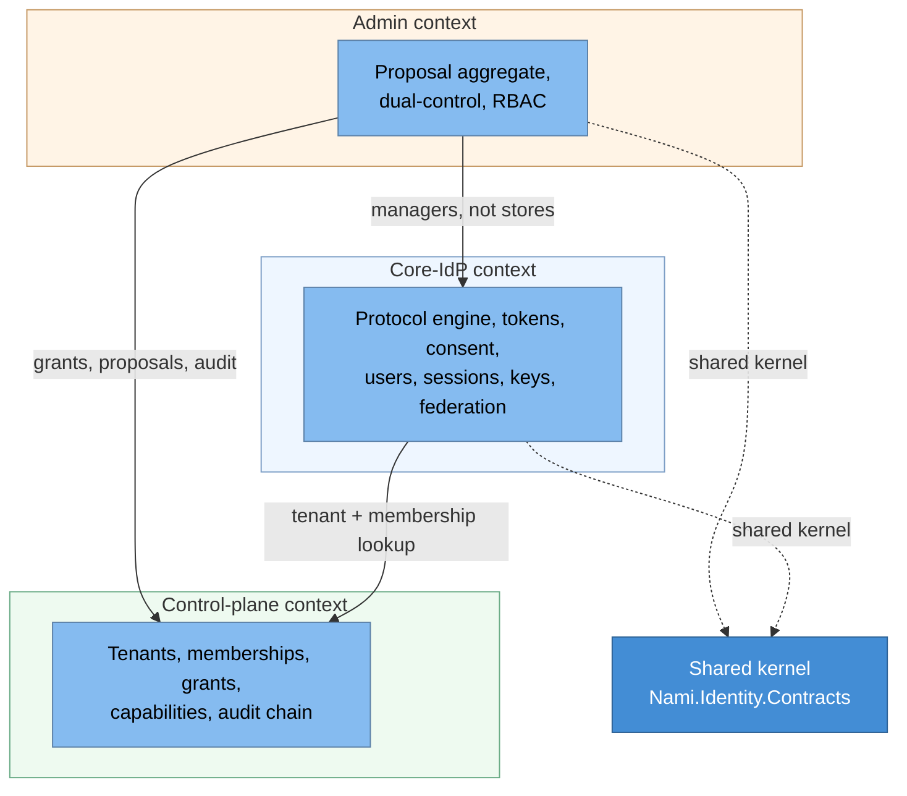

# Domain view (bounded contexts)

Nami's strategic Domain-Driven Design: three bounded contexts with a minimal
shared contract kernel, and a ubiquitous language used consistently across the
ADRs, the code, and this document (ADR-0058, ADR-0020, ADR-0059).

## Bounded contexts

| Context | Owns | Notes |
|---|---|---|
| Core-IdP | The OAuth/OIDC protocol, token issuance and validation, consent, user management, sessions, keys, and federation | Follows the OpenIddict pipeline plus ports/adapters style (ADR-0024) |
| Admin | Administrative use cases and the dual-control workflow | The only context with a rich tactical-DDD aggregate (Proposal); the rest is CRUD over managers (ADR-0020) |
| Control-plane | Tenants and their closure, memberships, delegated-admin grants, the capability catalog, and the audit hash-chain | Global and tenant-tagged; the backbone of multi-tenancy and delegated administration (ADR-0001, ADR-0010) |

The contexts talk through minimal shared contracts (`Nami.Identity.Contracts`);
the core IdP never depends on admin contracts, a boundary the compiler enforces
(ADR-0020). Event-driven messaging is used only at the edges (the audit outbox and
back-channel logout fan-out); dual-control execution is synchronous and
transactional, never eventual (ADR-0020).

## Ubiquitous language

| Term | Meaning |
|---|---|
| Tenant | An isolated customer boundary; Pool (shared DB) or Silo (own DB) (ADR-0001) |
| Membership | A user's belonging and roles within a tenant; identity itself is global (ADR-0001) |
| Delegated-admin grant | A scoped, time-bound capability to administer a tenant subtree (ADR-0010) |
| Capability | A named, auditable permission in the catalog, some inheritable down the tenant tree (ADR-0010) |
| Proposal | The dual-control aggregate: a destructive action awaiting a second approver, TOCTOU-safe (ADR-0020) |
| Client / Scope | An OAuth application and a permission it may request; the scope catalog is global |
| Session | A server-side session keyed by `sid`, the unit of force-logout (ADR-0003) |
| Key scope | Whether a key set is per-Silo-tenant or shared by a Pool group (ADR-0033) |

---

[← Prev: Context](01-context.md) · [Index](README.md) · Next: [Containers (C4 L2) →](03-containers.md)
