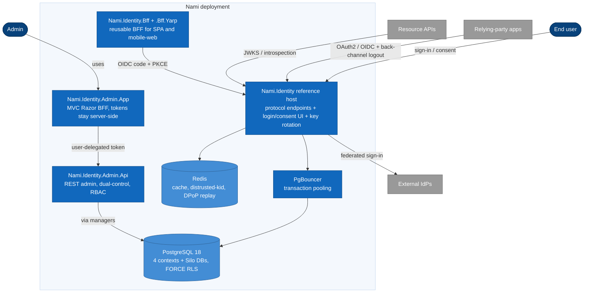

# Container view (C4 Level 2)

Nami ships as a graph of `Nami.Identity.*` packages (ADR-0065) that compose into
three host processes, backed by PostgreSQL and Redis.

## Host processes

| Host | Responsibility | Owning ADRs |
|---|---|---|
| `Nami.Identity` (reference host) | The authorization server: protocol endpoints, login/consent/logout UI, key rotation, external login, composition root | 0021, 0024, 0025, 0027 |
| `Nami.Identity.Admin.Api` | Admin REST API: managers-not-stores, dual-control, RBAC, delegated admin; rejects app-only tokens | 0020, 0047 |
| `Nami.Identity.Admin.App` | Admin MVC Razor BFF: OIDC client of the IdP, holds tokens server-side | 0020, 0029 |

`Nami.Identity` is both the NuGet meta-package (ADR-0027) and the runnable
reference host (ADR-0025); there is no separate `.Server` project.

## Package graph

The ratified package set (ADR-0065):

| Package | Responsibility |
|---|---|
| `Nami.Identity` | Meta-package re-exporting the default stack, and the reference host ("one line to run") |
| `Nami.Identity.Core` | OpenIddict server wiring, claims/consent/profile/token, the `AddNamiIdentity()` builder |
| `Nami.Identity.Abstractions` | Ports (the DIP center); depends on nothing |
| `Nami.Identity.Users` | ASP.NET Core Identity, passkeys, MFA, user lifecycle; the `.AddUsers()` builder (ADR-0028) |
| `Nami.Identity.Bff` (+ `.Bff.Yarp`) | Reusable BFF for browser clients; the `AddNamiBff()` builder (ADR-0029) |
| `Nami.Identity.Admin.Api` / `Nami.Identity.Admin.App` | The two admin host projects (ADR-0020) |
| `Nami.Identity.Contracts` | Minimal common DTOs shared with the core IdP; zero-dependency |
| `Nami.Identity.Admin.Contracts` | Admin request/response DTOs and problem codes; referenced only by the two admin projects |

The finer granular sub-packages (persistence, key management, and per-cloud
adapters) are split at M1 per ADR-0027; their exact names are a build-time detail
and are shown here as components in [04-components](04-components.md), not as
ratified package names. The compile boundary is enforced: the core IdP references
`Nami.Identity.Contracts` only, never `Nami.Identity.Admin.Contracts` (ADR-0020).

## Datastores and infrastructure

* **PostgreSQL 18** (ADR-0037) is the sole engine, using `uuidv7()` clustered keys
  (ADR-0036), `xmin` optimistic concurrency, and FORCE row-level security. Four
  logical contexts share one physical database initially: OpenIddict
  (tenant-scoped), Identity (global), Data Protection (global), and the control
  plane (global). A Silo tenant gets its own database and its own key set.
* **Redis** (ADR-0039, ADR-0040) is an accelerator: distributed cache and
  FusionCache backplane, the distrusted-kid set (fail-closed on read), and the
  DPoP jti replay cache. It is never the sole source of truth; the data protection
  keyring and session store remain independent of Redis so a Redis outage does not
  break authentication.
* **PgBouncer** brokers connections, mandatory in transaction mode for Silo.

---

[← Prev: Domain](02-domain.md) · [Index](README.md) · Next: [Components (C4 L3) →](04-components.md)
