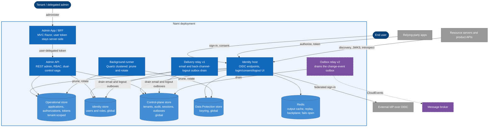

# Container view (C4 Level 2)

> **Part of:** the [Software Architecture Document](README.md), structural views. C4 Level 2.

This view opens the system box from [01-context](01-context.md) into the units that
**run**, and how they communicate. Internal decomposition of the important containers is
in [04-components](04-components.md); the logical data model is in [05-data](05-data.md).

A note on vocabulary: Nami ships as a **NuGet package graph** (ADR-0027), so most
projects are libraries rather than deployables. Only things that run appear as containers
here; the package-to-container mapping is in section 3.

```mermaid
graph TB
  enduser([End user]):::person
  admin([Tenant / delegated admin]):::person
  rp[Relying-party apps]:::ext
  rs[Resource servers and product APIs]:::ext
  extidp[External IdP over OIDC]:::ext

  subgraph SYS[Nami deployment]
    direction TB
    idp[Identity host<br/>OIDC endpoints, login/consent/logout UI]:::host
    aapi[Admin API<br/>REST admin, RBAC, dual-control saga]:::host
    aapp[Admin App / BFF<br/>MVC Razor, user token stays server-side]:::host
    run[Background runner<br/>Quartz clustered: prune and rotate]:::host
    dr[Delivery relay v1<br/>email and back-channel-logout outbox drain]:::host
    relay[Outbox relay v2<br/>drains the change-event outbox]:::v2
    opdb[(Operational store<br/>applications, authorizations, tokens<br/>tenant-scoped)]:::store
    iddb[(Identity store<br/>users and roles, global)]:::store
    cpdb[(Control-plane store<br/>tenants, audit, sessions, outboxes<br/>global)]:::store
    dpdb[(Data Protection store<br/>keyring, global)]:::store
    redis[(Redis<br/>output cache, replay, backplane; fails open)]:::store
  end

  broker[Message broker]:::v2

  enduser -->|sign-in, consent| idp
  rp -->|authorize, token| idp
  rs -->|discovery, JWKS, introspect| idp
  admin -->|administer| aapp
  aapp -->|user-delegated token| aapi
  idp -->|federated sign-in| extidp
  idp --> opdb & iddb & cpdb & dpdb & redis
  aapi --> opdb & iddb & cpdb
  run -->|prune, rotate| opdb & dpdb
  dr -->|drain email and logout outboxes| cpdb & iddb
  relay -->|drain| cpdb
  relay -.->|CloudEvents| broker

  classDef person fill:#08427b,stroke:#052e56,color:#ffffff
  classDef host fill:#1168bd,stroke:#0b4884,color:#ffffff
  classDef store fill:#438dd5,stroke:#2e6295,color:#ffffff
  classDef ext fill:#999999,stroke:#6b6b6b,color:#ffffff
  classDef v2 fill:#7b4fa0,stroke:#54356f,color:#ffffff,stroke-dasharray:5 4
  style SYS fill:#eef4fb,stroke:#1168bd,stroke-width:2px
```

The **resource-server validation edge** runs inside each consumer's own process, so it is
not one of Nami's deployables and is described in section 4 rather than drawn inside the
boundary. The consumer-side **BFF** is likewise the consumer's deployment, not Nami's
(ADR-0029).

## Runnable hosts

| Container | Runtime | Responsibility | Key traits |
|---|---|---|---|
| **Identity host** (`Nami.Identity.Host`) | ASP.NET Core, flat host (ADR-0024) | The authorization server: every OAuth2 and OIDC endpoint plus the Razor Pages login, consent, and logout UI (ADR-0072) | Stateless, no sticky session, multi-instance and multi-zone. Readiness gated on keys-loaded. The access token is a plain signed JWT (`at+jwt`, ADR-0005) |
| **Admin API** (`Nami.Identity.Admin.Api`) | ASP.NET Core REST | Administration over the managers: clients, scopes, users, roles, tenants, memberships, delegated admins | Requires an actor and rejects app-only tokens; the dual-control saga is enforced server-side; capability policies plus step-up (RFC 9470); `ProblemDetails` errors. The application layer is a folder inside, not a separate project (ADR-0020) |
| **Admin App / BFF** (`Nami.Identity.Admin.App`) | MVC Razor plus `Duende.AccessTokenManagement.OpenIdConnect` (Apache-2.0) | The admin front end | The user-delegated access token is held server-side and never reaches the browser; approval inbox and audit viewer; step-up carried end to end (ADR-0020, ADR-0029) |
| **Background runner** | Quartz.NET, clustered | Token and authorization pruning, and the key-rotation trigger | **Exactly one** clustered runner, so nothing double-runs; it iterates tenants (a Pool filter, or a per-Silo connection) because tenant-partitioned data cannot be pruned in one global pass; emits a last-successful-run heartbeat for alerting (ADR-0011, ADR-0031) |
| **Delivery relay (v1)** | .NET `BackgroundService` | Drains the **v1** delivery outboxes: email, and back-channel logout | At-least-once with retry, backoff, and a dead-letter path; `FOR UPDATE SKIP LOCKED` for multi-node drains; per-recipient throttle degrades to an in-process bucket rather than switching off. One relay polls both outboxes, and it may co-host with the identity host or run standalone (ADR-0038, ADR-0019) |
| **Outbox relay (v2)** | .NET worker | Drains the change-event outbox to the broker | v2 only, kill-switched off in v1. At-least-once with consumer-side idempotency; ordered by an IDENTITY `seq` column and **not** by the UUIDv7 key, which is not monotonic within a millisecond; `FOR UPDATE SKIP LOCKED` for multi-node (ADR-0071, ADR-0036) |

**`Nami.Identity` and `Nami.Identity.Host` are deliberately different things**, and the
distinction is what makes both consumption stories work (ADR-0027, ADR-0065):

* `Nami.Identity` is the **meta-package**: what a consumer adds to their own application to
  get the default stack in one reference, the way one adds a protocol library. By
  construction it is an empty project carrying only package references, so it cannot also
  be a host.
* `Nami.Identity.Host` is the **runnable reference host**: an application project with an
  entry point, configuration, a Dockerfile, and health endpoints. It is **not published to
  NuGet** (`IsPackable=false`); it is distributed as a container image and as a
  `dotnet new` template, which is also what makes turnkey "run the container and log in"
  possible (ADR-0025, ADR-0027).

That split is why the end-to-end tests are meaningful: they exercise **the host that ships**
rather than one a test project assembled for itself (ADR-0060). The same `IsPackable=false`
rule applies to `Nami.Identity.Admin.Api` and `Nami.Identity.Admin.App`, which are
applications too.

## Stores

Four EF Core DbContexts on PostgreSQL 18 (ADR-0037, indexed in the ADR-0061 stack of
record), separated by **tenant scope** rather
than merely by concern. This topology is fixed and changing it requires a superseding ADR
(ADR-0001). They may share one cluster or be split onto separate tiers, since the
operational store wants a high-write tier; placement and HA are in
[08-deployment](08-deployment.md).

| Store (DbContext) | Scope | Contents | Why separate |
|---|---|---|---|
| **Operational** (`OpenIddictDbContext`) | Tenant-scoped | Applications, authorizations, tokens | The hot write path, one row per issuance. Pool tenants use a `TenantId` column plus a query filter; a Silo tenant uses its own connection |
| **Identity** (`IdentityDbContext`) | Global | Users, roles, claims, passkeys | One human is one user who may sign in to many tenants, so identity is global and tenant belonging is a membership |
| **Control-plane** (`ControlPlaneDbContext`) | Global | Tenant registry, memberships, delegated admin, audit log, server-side sessions, the outboxes | Must not depend on any one tenant, since it is what anchors tenant resolution and cross-tenant administration |
| **Data Protection** (`DataProtectionDbContext`) | Global | The Data Protection keyring | A root of trust for authentication, kept on a durable store **independent of Redis** so a Redis outage never breaks auth (ADR-0006) |

**Redis** is an accelerator container, not a source of truth (ADR-0040): output cache for
discovery and JWKS, the configuration-cache backplane, and the DPoP replay cache. On Redis
failure the ordinary cache **fails open** and sessions stay durable in PostgreSQL. Two
deliberate carve-outs **fail closed** instead, choosing security over availability: the
distrusted-key set (ADR-0039) and the DPoP proof-replay cache (ADR-0014). Note that the
protocol engine's own entity cache is **per-request**, so it needs no cross-node backplane
at all (ADR-0039).

### DbContext pooling is per context, and the hot path is not pooled

This is the single most counter-intuitive thing in this view, so it is stated explicitly
(ADR-0018):

* Global contexts (Identity, Data Protection, control plane) **are** pooled, because their
  connection is fixed and reuse is safe.
* **Silo** contexts are **not** pooled, because their connection string varies per tenant,
  which `AddDbContextPool` cannot express.
* The **Pool-mode operational context is not pooled in v1** either. This was a gate
  decision, not a preference: spike A-4's test T7 ran on 2026-07-06 (verification records
  V17 and V24) and the pooled-plus-mutable pattern **failed** it, because an instance
  returned to the pool and then serving tenant B still carried tenant A's `TenantId`. EF
  Core resets the change tracker it owns but not a custom field. So the safe non-pooled
  scoped registration, with the tenant captured immutably at construction, is the active
  v1 decision, and the pooled variant is deferred behind a fresh spike.

Separately, the **Npgsql connection pool** (a different thing from DbContext pooling) is
keyed per connection string, so every Silo tenant gets its own pool. At the default
maximum of 100 per pool, `pool size x instances x tenants` exceeds the server's connection
ceiling once there are many Silo tenants, so the per-tenant maximum is lowered to roughly
5 to 10 with a minimum of 0, and the acquisition timeout is bounded so exhaustion
fails fast into a load-shed 503 rather than hanging threads (ADR-0018, ADR-0040).

**PgBouncer** is conditional, not mandatory: transaction-mode pooling is used **where Silo
scale requires it**. Where it is used it must itself be highly available, at least two
instances with failover, because it then sits on the hot path, and the per-request tenant
variable must be `SET LOCAL` **inside** the request transaction so it cannot leak across a
multiplexed connection (ADR-0018, ADR-0037).

## Package-to-container mapping

Because the product ships as libraries, most packages compose into the hosts above rather
than running on their own. The ratified set (ADR-0065):

**Libraries**, published to NuGet:

| Package | Responsibility |
|---|---|
| `Nami.Identity` | Meta-package: the default stack in one reference, the consumer entry point |
| `Nami.Identity.Abstractions` | The ports, and the dependency-inversion centre; depends on nothing |
| `Nami.Identity.Core` | Protocol-server wiring, claims, consent, profile, and tokens; the `AddNamiIdentity()` builder |
| `Nami.Identity.Users` | ASP.NET Core Identity, passkeys, MFA, and user lifecycle (ADR-0028) |
| `Nami.Identity.EntityFrameworkCore` (+ `.PostgreSQL`) | Persistence, and the PostgreSQL provider (ADR-0037) |
| `Nami.Identity.MultiTenant` | Tenant resolution and per-tier store routing (ADR-0001) |
| `Nami.Identity.Keys` (+ `.Keys.Azure`, `.Keys.Aws`, `.Keys.Gcp`, `.Keys.Vault`) | Key store and rotation, with optional cloud adapters (ADR-0011, ADR-0006) |
| `Nami.Identity.OpenTelemetry` | Telemetry wiring (ADR-0022) |
| `Nami.Identity.Validation` | The resource-server validation edge, embedded in the **consumer's** API process (ADR-0049) |
| `Nami.Identity.Bff` (+ `.Bff.Yarp`) | Backend-for-frontend, with the remote proxy as its own package (ADR-0029) |
| `Nami.Identity.Contracts` | DTOs shared with the core IdP; zero dependencies |
| `Nami.Identity.Admin.Contracts` | Admin request and response DTOs plus problem codes; referenced only by the two admin projects |

**Applications**, `IsPackable=false`, distributed as images:

| Application | Responsibility |
|---|---|
| `Nami.Identity.Host` | The runnable reference identity host, plus a `dotnet new` template (ADR-0027) |
| `Nami.Identity.Admin.Api`, `Nami.Identity.Admin.App` | The two admin projects (ADR-0020) |

The cloud adapters are named after the **port they adapt**, not after one vendor's product:
only one of those providers has an offering called Key Vault, so naming the family after it
would be wrong for the other three (ADR-0065).

Two boundaries are enforced rather than conventional:

* The core IdP references `Nami.Identity.Contracts` only and is **compiler-blocked** from
  referencing `Nami.Identity.Admin.Contracts`, and an architecture test asserts the BFF
  does not reference the admin assemblies (ADR-0020, ADR-0024).
* The **resource-server validation edge is not one of our hosts.** It is a library the
  consumer embeds in its own API process, which is why per-tenant validation is a contract
  Nami documents rather than a service it runs (ADR-0049).

The cloud adapter is selected at runtime by configuration and defaults to the
database-backed store, so the product runs with no cloud dependency at all (ADR-0006).

## Communication and protocols

* **Browser to identity host:** HTTPS front channel (authorize, login, consent, logout)
  through the edge. Forwarded headers must be processed early so the scheme, host, and
  therefore the issuer are correct behind the proxy (ADR-0073).
* **Client to identity host:** the OAuth2 and OIDC back channel (token, introspection,
  revocation, pushed authorization, device). Machine-to-machine uses `private_key_jwt`
  rather than a shared secret (ADR-0009).
* **Resource server to identity host:** anonymous cached reads of discovery and JWKS for
  local JWT validation; authenticated introspection for reference tokens, with client
  authentication and audience confinement (ADR-0048).
* **Admin App to Admin API:** HTTPS carrying a user-delegated token managed server-side,
  never an app-only token (ADR-0020).
* **Hosts to stores:** EF Core over Npgsql; the delivery relay uses raw Npgsql for the
  outbox drain so it can take row locks directly.
* **Outbox relay to broker (v2):** CloudEvents 1.0 through the `IMessageTransporter` port,
  with one reference adapter shipped and other brokers as extension points (ADR-0071).
* **All hosts to observability:** OTLP for telemetry, while security events take the
  separate tamper-evident sink (ADR-0022, ADR-0008).

## Sources

* ADR-0001 (the fixed four-context topology and tenant scoping), ADR-0037 (PostgreSQL 18,
  forced row-level security, `SET LOCAL`), ADR-0018 (the per-context DbContext pooling
  matrix, the A-4 / T7 outcome, connection-pool sizing, and the PgBouncer condition),
  ADR-0006 (the keyring's independence from Redis).
* ADR-0024 (the flat host and ports at infrastructure edges), ADR-0027 and ADR-0025 (the
  meta-package plus reference host), ADR-0065 (the ratified assembly set), ADR-0020 (the
  two admin projects, the actor requirement, and the compile boundary), ADR-0029 (the BFF
  package and its unsettled proxy split), ADR-0072 (Razor Pages for the login surface, MVC
  Razor for admin).
* ADR-0005 (the plain signed JWT access token), ADR-0009 (`private_key_jwt`), ADR-0048
  (introspection isolation), ADR-0049 (the consumer-side validation edge), ADR-0014 (the
  DPoP replay cache that fails closed), ADR-0039 (the per-request entity cache, the
  distrusted-key set, and the backplane placement), ADR-0040 (Redis as accelerator and the
  load-shed 503), ADR-0073 (the edge and forwarded headers).
* ADR-0008 and ADR-0022 (the two observability lanes the hosts emit to, tamper-evident
  security events kept apart from OTLP telemetry), ADR-0060 (the testing strategy whose
  end-to-end suites exercise the shipped host rather than a test-assembled one).
* ADR-0011 and ADR-0031 (the single clustered runner and the rotation trigger), ADR-0038
  and ADR-0019 (the email and back-channel-logout outboxes the v1 relay drains), ADR-0071
  and ADR-0036 (the v2 relay and why ordering uses a `seq` column, not the UUIDv7 key),
  ADR-0028 (user management).
* Reconciled against the design corpus's container view on 2026-07-25. The corpus supplied
  three real gaps this view had: the **background runner** and the **v1 delivery relay** as
  first-class runnable hosts rather than invisible in-process work, and the four stores
  drawn separately instead of as one database box. Three things were corrected rather than
  imported: the corpus names the host assembly `Nami.Identity.Host`, which is not in the
  ADR-0065 ratified set and is not adopted; the corpus's sub-package names are not ratified
  here, so only the axes of the split are described; and this repository's own earlier
  statement that PgBouncer is "mandatory in transaction mode for Silo" **overstated
  ADR-0018 and ADR-0037**, which make it conditional on Silo scale and add a
  high-availability requirement where it is used. The DbContext pooling section was added
  because both this view and the ADR-0061 stack table had been describing the stack as
  "pooled DbContext" when the ADR that owns the decision is titled for the opposite.

---

[Prev: Domain](02-domain.md) · [Index](README.md) · Next: [Components (C4 L3)](04-components.md)
