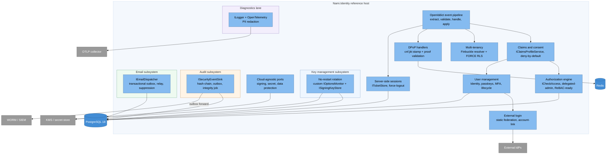

# Component view: IdP core (C4 Level 3)

The internals of the `Nami.Identity` reference host that carry the most
architectural weight. Everything hangs off the OpenIddict event pipeline, and the
operational subsystems (key management, audit, and email) are first-class peers,
each with its own store interaction and delivery guarantees.

## The protocol core

* **OpenIddict event pipeline** is the one place protocol behaviour is extended.
  Handlers are anchored to a named built-in position, never a hardcoded order
  number, and pinned by a pipeline-snapshot test, so a version bump that reorders
  the pipeline fails CI rather than production (ADR-0021).
* **Claims and consent** centre on `IClaimsProfileService`, the single claims
  choke-point with deny-by-default destinations, so a stray claim can never leak
  into an access token (ADR-0005). Consent is persisted through the authorization
  manager to support `prompt=none` silent renew.
* **Multi-tenancy** turns a host or path into an ambient tenant, sets the
  per-request PostgreSQL GUC, and relies on an EF query filter (layer 1) plus FORCE
  RLS (layer 2) as a two-layer isolation control (ADR-0001, ADR-0049).
* **DPoP handlers** stamp `cnf.jkt` at issuance and validate the proof with a
  cross-node jti replay guard at the resource server (ADR-0014).
* **User management** builds on ASP.NET Core Identity with native passkeys and a
  lifecycle layer (ADR-0028); identity is global, and tenant belonging is a
  membership.

## Authorization, sessions, and federation

* **Authorization engine** is a DB-first `ICheckAccess` behind a
  consistency-carrying port, swappable to a ReBAC engine (OpenFGA/SpiceDB) without
  changing call sites (ADR-0047). It backs delegated administration: scoped,
  time-bound capability grants checked with a forbidden-cascade over the tenant
  tree and anti-confused-deputy resolution (ADR-0010).
* **Server-side sessions** are core, not optional (ADR-0003). An `ITicketStore`
  keyed by `sid` enables force-logout, inactivity and absolute expiry, and
  back-channel logout, and is the seam the OpenIddict 8.0 native back-channel
  logout will plug into.
* **External login** provisions federated sign-in into the global identity, with
  account-linking on `(provider, sub)` (never email) and SSRF-hardened authority
  validation (ADR-0002). Static and global in v1; per-tenant dynamic federation is
  v2 (ADR-0034).

## The operational subsystems (first-class peers)

* **Key management subsystem** (ADR-0011, ADR-0012, ADR-0033) swaps signing
  credentials through a custom `IOptionsMonitor` and a change token, with a custom
  non-static configuration manager so the local server self-validates freshly
  rotated keys without a restart. Encryption credentials have a separate lifecycle
  from signing (ADR-0005).
* **Audit subsystem** (ADR-0008) is `ISecurityEventSink` plus a typed event
  catalog covering success, failure, denial, and error. Storage is append-only
  (INSERT-only, no UPDATE/DELETE) with a hash-chain (`record_hash = H(prev_hash ||
  payload)`), an outbox forwarder to a WORM/SIEM destination, and a periodic
  integrity-check job. Security-critical events commit synchronously in the same
  transaction as the action; the rest go through the outbox but are never lost.
* **Email subsystem** (ADR-0038) is `IEmailDispatcher` plus provider adapters, a
  transactional outbox with an at-least-once relay, anti-enumeration, and a
  suppression store. The outbox row is written in the same transaction as the user
  mutation so a rolled-back registration sends nothing and a committed one is
  guaranteed delivered.

## The two lanes never cross

The **audit lane** (`ISecurityEventSink`, tamper-evident, delivery-guaranteed) and
the **diagnostics lane** (`ILogger` plus OpenTelemetry, PII-redacted) are separate
by decision (ADR-0022, ADR-0008). Audit never routes through the telemetry
pipeline, which lacks tamper-evidence and a delivery guarantee; the two lanes are
joined only by a correlation/trace id. This is why audit and diagnostics appear as
distinct boxes above rather than as one logging component.

## Ports and adapters

The cloud-agnostic ports (`ISigningCredentialSource`, `IEncryptionCredentialSource`,
`ISecretResolver`, `IDataProtectionKeyStore`, the email dispatcher, and the audit
sink) default to database-backed adapters and swap to a cloud KMS or secret store
by configuration alone (ADR-0006, ADR-0009). They are also the documented
extension points for consumers (ADR-0027).

---

[← Prev: Containers](03-containers.md) · [Index](README.md) · Next: [Data →](05-data.md)
