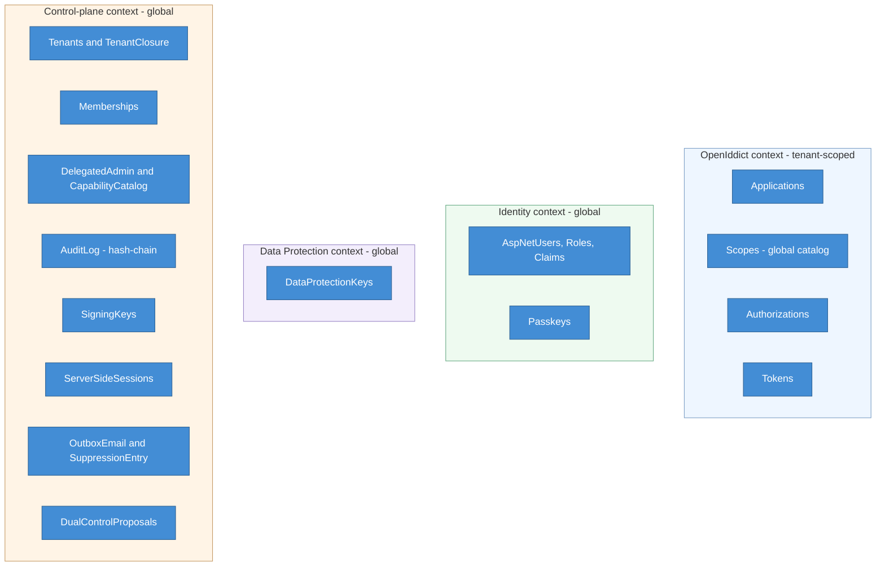

# Data view (logical)

The logical data model: four EF Core DbContexts on PostgreSQL 18, with the
tenancy, keying, and concurrency conventions that apply across them. This is a
high-level map, not the physical schema; the detailed DDL lives in the data-tier
design.

## Contexts

| Context | Scope | Key entities | Notes |
|---|---|---|---|
| OpenIddict | Tenant-scoped | Applications, Scopes, Authorizations, Tokens | The four native entities share one context (cross-FKs); Pool adds a `TenantId` column and query filter; the Scope catalog is global (ADR-0018, ADR-0037) |
| Identity | Global | AspNetUsers, Roles, Claims, Passkeys | One human is one user; tenant belonging is a Membership (ADR-0001, ADR-0028) |
| Data Protection | Global | DataProtectionKeys | The keyring, on a store independent of Redis (ADR-0006) |
| Control-plane | Global, tenant-tagged | Tenants, TenantClosure, Memberships, DelegatedAdmin, CapabilityCatalog, AuditLog, SigningKeys, ServerSideSessions, OutboxEmail, SuppressionEntry, DualControlProposals | The multi-tenancy, delegated-admin, audit, key, session, email, and dual-control backbone |

## Conventions across all contexts

* **Keys**: UUIDv7 clustered primary keys, with one deliberate bigint exception for
  the session row (ADR-0036).
* **Concurrency**: `xmin` optimistic concurrency, surfaced as an ETag on admin
  mutations (ADR-0018, ADR-0020).
* **Tenancy isolation**: Pool tenants use a `TenantId` column plus an EF query
  filter (layer 1) and PostgreSQL FORCE row-level security (layer 2); Silo tenants
  get a dedicated database and key set (ADR-0001, ADR-0049, ADR-0033).
* **Audit**: `AuditLog` is append-only (INSERT-only) with a hash-chain over
  `prev_hash` and the payload, and per-subject ciphertext for erasure-relevant
  identifiers (ADR-0008, ADR-0016).
* **Outbox**: `OutboxEmail` has a home in both the Identity and control-plane
  contexts, so it can be enqueued in the same transaction as the mutation that
  triggers it (ADR-0038).

---

[← Prev: Components](04-components.md) · [Index](README.md) · Next: [Runtime views →](06-runtime-views.md)
