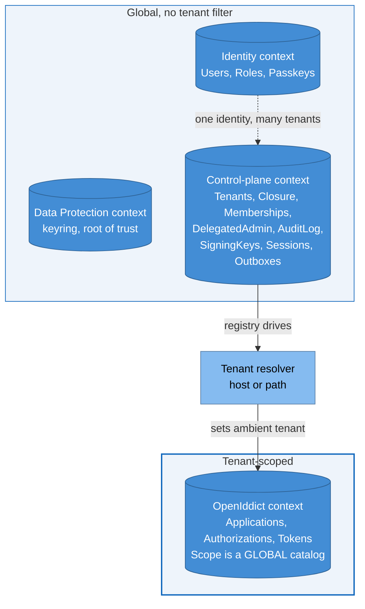
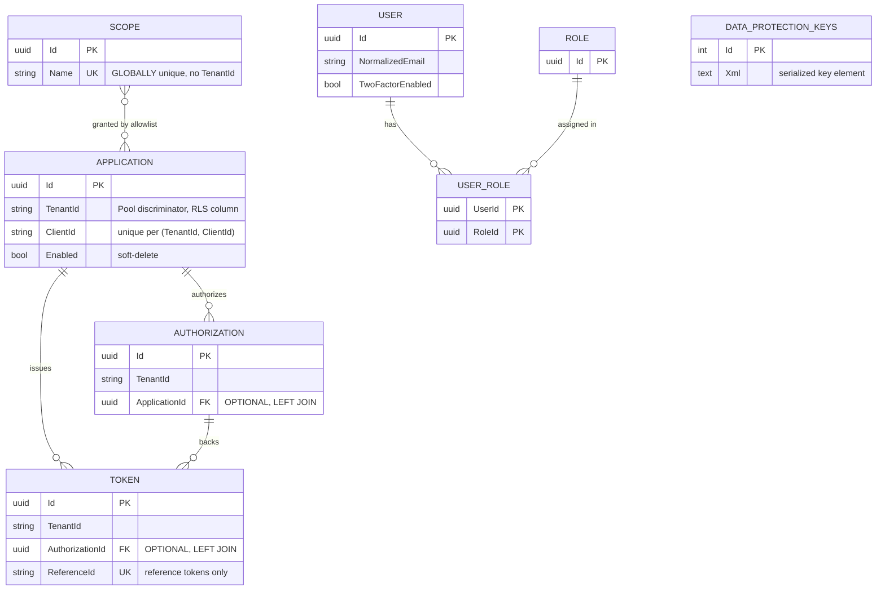
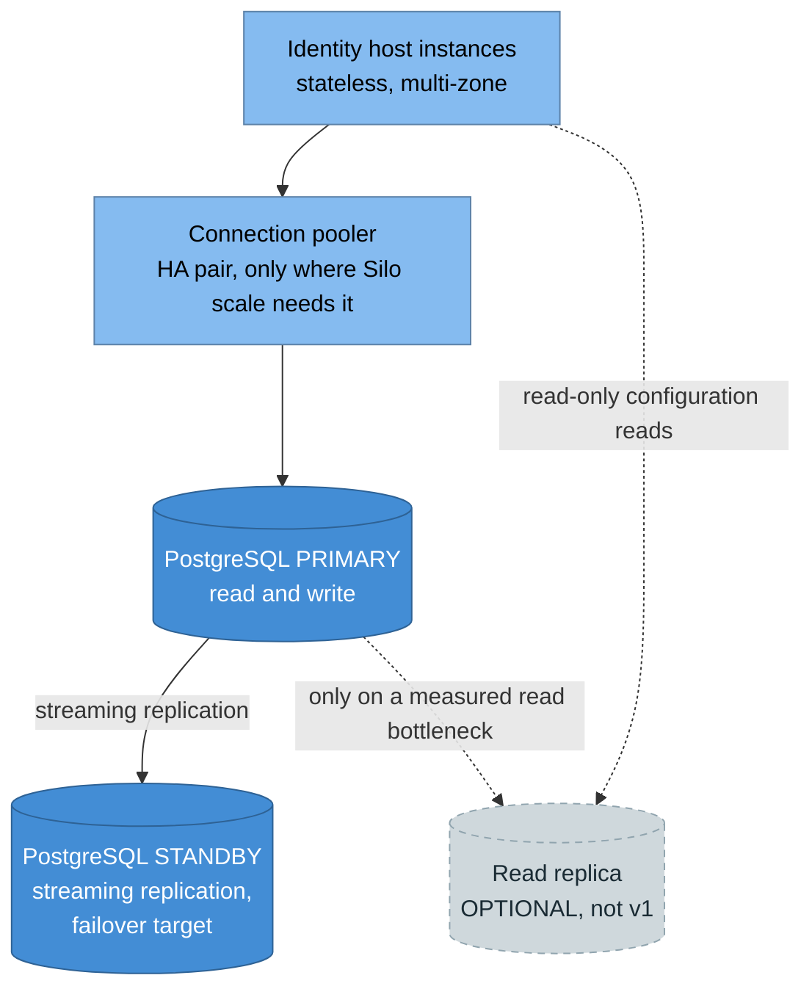

# Data view

> **Part of:** the [Software Architecture Document](README.md), structural views.

The architecture-level data view: where the four context boundaries are drawn and why, the
entity relationships that carry an architectural decision, the multi-tenancy data model, and
the physical database topology.

**Scope boundary.** This view gives the tables, keys, relationships, and only those fields
that carry an architectural decision. The exhaustive column contract, with full type
precision, nullability, defaults, check constraints, and the complete index set, belongs to
the [data-tier detailed design](../design/02-data.md), which is the authority for anything
at column level.

## 1. The four-context boundary map

The load-bearing data decision is that boundaries follow **tenant scope**, not merely
concern: a user is global, but a tenant's tokens are the tenant's. This topology is fixed and
changing it requires a superseding ADR (ADR-0001).

```mermaid
graph TB
  res[Tenant resolver<br/>host or path]:::comp

  subgraph TS[Tenant-scoped]
    oi[(OpenIddict context<br/>Applications, Authorizations, Tokens<br/>Scope is a GLOBAL catalog)]:::store
  end
  subgraph GL[Global, no tenant filter]
    direction LR
    id[(Identity context<br/>Users, Roles, Passkeys)]:::store
    dp[(Data Protection context<br/>keyring, root of trust)]:::store
    cp[(Control-plane context<br/>Tenants, Closure, Memberships,<br/>DelegatedAdmin, AuditLog,<br/>SigningKeys, Sessions, Outboxes)]:::store
  end

  res -->|sets ambient tenant| oi
  cp -->|registry drives| res
  id -.->|one identity, many tenants| cp

  classDef comp fill:#85bbf0,stroke:#5d82a8,color:#000000
  classDef store fill:#438dd5,stroke:#2e6295,color:#ffffff
  style TS fill:#eef4fb,stroke:#1168bd,stroke-width:2px
  style GL fill:#eef4fb,stroke:#1168bd,stroke-width:1px
```

| Context | Scope | Why the boundary is here |
|---|---|---|
| **OpenIddict** | Tenant-scoped | Applications, authorizations, and tokens belong to one tenant. Pool shares a database and discriminates by `TenantId` plus a query filter plus row-level security; Silo gets its own database. **Scope is the deliberate exception**: a global product catalog shared by every tenant, so it carries no `TenantId` at all (ADR-0001) |
| **Identity** | Global | One human identity signs in to many tenants, so users and roles must not be partitioned by tenant. A user reaches tenants through a membership |
| **Data Protection** | Global | The keyring is a root of trust for authentication, kept independent of Redis so a cache outage never breaks auth (ADR-0006) |
| **Control-plane** | Global | Anchors everything that must not depend on any one tenant: the tenant registry and hierarchy, cross-tenant memberships and delegated admin, the audit chain, signing keys, sessions, and the delivery outboxes |

Each context keeps its **own migrations-history table in a separate schema**, so the four can
share one physical database without colliding, or be split apart later without a rewrite
(recorded in the [data design](../design/02-data.md)). For a Silo tenant the fan-out view is
different: the per-tenant schema version is the fleet-level indicator, while the
per-database history table is the truth (ADR-0017).

## 2. Control-plane relationships

```mermaid
erDiagram
    TENANTS ||--o{ TENANT_CLOSURE : "closure of"
    TENANTS ||--o{ MEMBERSHIPS : "has members"
    TENANTS ||--o{ DELEGATED_ADMIN : "rooted at"
    DELEGATED_ADMIN ||--o{ DELEGATED_ADMIN_CAPABILITIES : "grants"
    CAPABILITY_CATALOG ||--o{ DELEGATED_ADMIN_CAPABILITIES : "typed by"
    TENANTS ||--o| TENANT_BRANDING : "themed by"
    TENANTS ||--o{ DUAL_CONTROL_PROPOSALS : "dual-control saga"
    TENANTS ||--o{ AUDIT_LOG : "audit trail"
    DUAL_CONTROL_PROPOSALS ||--o{ AUDIT_LOG : "approval recorded"
    TENANTS ||--o{ SIGNING_KEYS : "Silo key set"
    TENANTS ||--o{ LOGOUT_DELIVERY_OUTBOX : "logout delivery"
    TENANTS ||--o{ OUTBOX_EMAIL : "tenant-scoped mail"
    TENANTS ||--o{ SUPPRESSION_ENTRY : "suppression list"
    SERVER_SIDE_SESSIONS ||--o{ SESSION_PARTICIPATING_CLIENTS : "includes RP"

    TENANTS {
        uuid TenantId PK
        uuid ParentTenantId FK "adjacency, source of truth"
        string Identifier "unique, IMMUTABLE after provisioning"
        string IsolationMode "Pool or Silo"
        string ConnectionString "Silo only"
        string KeyScope
    }
    TENANT_CLOSURE {
        uuid AncestorId PK
        uuid DescendantId PK
        int Depth "drives the forbidden cascade"
    }
    CAPABILITY_CATALOG {
        string Capability PK "lowercase snake_case"
        bool IsInheritable "false blocks the cascade"
    }
    DELEGATED_ADMIN {
        uuid GrantId PK
        uuid RootTenantId FK
        timestamptz ExpiresAt "time-bound"
        timestamptz RevokedAt "filtered covering index"
    }
    DUAL_CONTROL_PROPOSALS {
        uuid ProposalId PK
        string ActionType "kebab-case wire contract"
        string TargetETag "TOCTOU guard"
        uuid ProposedBy
        uuid ApprovedBy "must differ from ProposedBy"
        string Status
        timestamptz ExpiresAt "bounded approval window"
    }
    AUDIT_LOG {
        uuid EntryId PK
        json ActorChain_JSON "delegation chain"
        string DecisionPath "why the decision went this way"
        bool StepupSatisfied
        text Payload_Canonical "canonicalized before hashing"
        bytea PrevHash
        bytea RecordHash "keyed chain link"
    }
    SIGNING_KEYS {
        uuid Id PK "kid"
        string Use
        string State "exactly one active per Use"
        timestamptz RetiresAt
        timestamptz DeletesAt
        string KeyScope
    }
    SERVER_SIDE_SESSIONS {
        bigint Id PK "the one bigint exception"
        string Key UK "sid, what clients reference"
        timestamptz Renewed "inactivity window"
        timestamptz Expires "absolute ceiling"
    }
    SUPPRESSION_ENTRY {
        bytea RecipientHash "hash only, never a raw address"
    }
```

Facts that matter at this altitude:

* **Tenant hierarchy is adjacency plus a derived closure table.** `ParentTenantId` is the
  source of truth; the closure table exists so an ancestor or descendant question is one
  seek on the hot authorization path. Closure is maintained **in application code inside a
  transaction, not by database triggers**, because tree invariants are domain logic; cycle
  rejection and serialized tree mutation live there too (ADR-0010, ADR-0024).
* **`Tenants.Identifier` is immutable after provisioning.** It drives the per-tenant issuer,
  so renaming it would invalidate every issued token, every relying-party configuration, and
  every logout registration. A rename is provision-new, migrate, deprovision-old (ADR-0017).
* **`ServerSideSessions` deliberately has no edge to `Tenants`.** It is global and keyed by
  `sid`, so one login session can span a tenant switch. This is a design decision, not an
  omission (ADR-0003). Its child table maps a session to the relying parties present in it and
  is what back-channel logout reads to know whom to notify (ADR-0019).
* **`DataProtectionKeys` is not a control-plane table.** It lives alone in its own context.
  The keyring it holds **wraps the signing-key material**, which is why disaster recovery has
  to restore both together, plus the root certificate (ADR-0006, ADR-0012).
* **The audit chain is keyed**: `RecordHash = HMAC_k(PrevHash || canonical(fields))` with an
  application-held key, prev-first operands, and the record canonicalized to text before
  hashing because `jsonb` does not preserve input byte order. The genesis previous-hash is 32
  zero bytes. Append-only, with an insert-only grant (ADR-0008).
* **Two identifier namespaces meet in this diagram and must not be unified.** A capability is
  lowercase `snake_case` (`delete_tenant`), while a proposal's action type is `kebab-case`
  (`delete-tenant`) because it is a published wire contract. The overlap is deliberate
  (ADR-0065).
* `OutboxEmail` exists in **two** contexts, one global and one tenant-scoped, so an enqueue
  can always join the transaction that triggered it (ADR-0038).

## 3. Operational, identity, and data-protection relationships

```mermaid
erDiagram
    APPLICATION ||--o{ AUTHORIZATION : "authorizes"
    APPLICATION ||--o{ TOKEN : "issues"
    AUTHORIZATION ||--o{ TOKEN : "backs"
    SCOPE }o--o{ APPLICATION : "granted by allowlist"
    USER ||--o{ USER_ROLE : "has"
    ROLE ||--o{ USER_ROLE : "assigned in"

    APPLICATION {
        uuid Id PK
        string TenantId "Pool discriminator, RLS column"
        string ClientId "unique per (TenantId, ClientId)"
        bool Enabled "soft-delete"
    }
    AUTHORIZATION {
        uuid Id PK
        string TenantId
        uuid ApplicationId FK "OPTIONAL, LEFT JOIN"
    }
    TOKEN {
        uuid Id PK
        string TenantId
        uuid AuthorizationId FK "OPTIONAL, LEFT JOIN"
        string ReferenceId UK "reference tokens only"
    }
    SCOPE {
        uuid Id PK
        string Name UK "GLOBALLY unique, no TenantId"
    }
    USER {
        uuid Id PK
        string NormalizedEmail
        bool TwoFactorEnabled
    }
    ROLE {
        uuid Id PK
    }
    USER_ROLE {
        uuid UserId PK
        uuid RoleId PK
    }
    DATA_PROTECTION_KEYS {
        int Id PK
        text Xml "serialized key element"
    }
```

There is **no user-to-tenant edge here**, and that is the point: a user reaches tenants
through a membership in the control plane, which is what keeps identity global.

Three rules in this area are rules rather than preferences:

* **Navigations to a filtered entity must be optional.** The token-to-authorization and
  authorization-to-application navigations are optional, producing a LEFT JOIN. Marking one
  as required would produce an INNER JOIN and **silently drop token rows** whenever the
  principal is filtered out or soft-deleted. Proven by a spike test rather than reasoned
  about (ADR-0018, and the [data design](../design/02-data.md)).
* **Client-id uniqueness is composite.** The engine's global unique index on the client
  identifier is dropped and replaced with `(TenantId, ClientId)`, so the same client id can
  exist in different Pool tenants. `Scope.Name` stays globally unique, because the catalog is
  global (ADR-0001).
* **Row-level security is a manual raw-SQL migration step.** It is not in the EF model, so
  neither the tooling nor a create-from-model call will generate it. Forgetting the step
  produces a database that looks correct and has no backstop (ADR-0017, ADR-0037).

Keys and concurrency across every context: **UUIDv7** primary keys for time-ordered index
locality on the hot write path, with **one** deliberate exception, the server-side session's
`bigint` surrogate. Anything needing a strict order carries its **own** sequence column,
because UUIDv7 is not monotonic within a millisecond. Concurrency is PostgreSQL `xmin`,
surfaced as an ETag on admin mutations (ADR-0036, ADR-0018, ADR-0020).

## 4. The multi-tenancy data model

Isolation is defense in depth, two layers, and both were proven necessary by spike A-4.

```mermaid
graph LR
  req[Request, tenant resolved]:::comp

  subgraph L1[Layer 1, EF change tracker]
    direction TB
    stamp[auto-stamp TenantId on insert]:::comp
    filter[named query filter on read]:::comp
    throw[throw on mismatch or unset]:::comp
  end
  subgraph L2[Layer 2, PostgreSQL backstop]
    direction TB
    force[FORCE ROW LEVEL SECURITY]:::store
    policy[policy reads the request-scoped setting]:::store
    role[de-privileged role, no BYPASSRLS]:::store
  end
  data[(Tenant-confined rows)]:::store

  req --> L1 --> L2 --> data

  classDef comp fill:#85bbf0,stroke:#5d82a8,color:#000000
  classDef store fill:#438dd5,stroke:#2e6295,color:#ffffff
  style L1 fill:#eef4fb,stroke:#1168bd,stroke-width:1px
  style L2 fill:#eef4fb,stroke:#1168bd,stroke-width:1px
```

Layer 1 covers the change-tracker path and **fails closed** on an unset or mismatched
tenant. Layer 2 exists because layer 1 is bypassed by the bulk, raw, and
`ExecuteUpdate`/`ExecuteDelete` paths, including the engine's own pruning; it needs a
de-privileged role because a superuser bypasses row-level security, and the tenant setting is
applied with `SET LOCAL` inside the request transaction so it is pooling-safe. The `NULLIF`
cast rule for `uuid`-typed tenant columns is in
[04-components section 2](04-components.md).

**Pool versus Silo** is recorded per tenant in the registry. Pool shares one database and
discriminates by `TenantId` plus row-level security, keeping the connection count low, and is
the default. Silo gives a tenant its own database for hard isolation, whether for residency
or regulatory reasons, at the cost of a per-tenant connection pool and a per-tenant migration
fan-out (ADR-0001, ADR-0018, ADR-0054).

## 5. Physical topology

The four contexts are logical. Physically they may share one cluster or be split, and two
placement facts are architectural:

* The **operational store is the hot write path**, one row per token issued, so it wants a
  high-write tier and may be separated from the read-heavy configuration data.
* The **keyring has the strictest recovery-point objective**, because losing it means current
  tokens and cookies cannot be decrypted (ADR-0006).

```mermaid
graph TB
  app[Identity host instances<br/>stateless, multi-zone]:::comp
  pgb[Connection pooler<br/>HA pair, only where Silo scale needs it]:::comp
  primary[(PostgreSQL PRIMARY<br/>read and write)]:::store
  standby[(PostgreSQL STANDBY<br/>streaming replication,<br/>failover target)]:::store
  replica[(Read replica<br/>OPTIONAL, not v1)]:::optional

  app --> pgb --> primary
  primary -->|streaming replication| standby
  primary -.->|only on a measured read bottleneck| replica
  app -.->|read-only configuration reads| replica

  classDef comp fill:#85bbf0,stroke:#5d82a8,color:#000000
  classDef store fill:#438dd5,stroke:#2e6295,color:#ffffff
  classDef optional fill:#cfd8dc,stroke:#90a4ae,color:#1a2b34,stroke-dasharray:5 4
```

Two things here are deliberately **not** the same, and collapsing them would misrepresent the
design:

* **High availability (in scope).** A primary handling reads and writes, a
  streaming-replication standby, automatic failover, and point-in-time recovery through
  write-ahead-log archiving. **The standby exists for failover, not for read scaling**, and
  the application talks to the primary.
* **A read/write split onto read replicas (optional, explicitly not v1).** Routing read-heavy
  configuration and discovery reads to a read-only replica is a **scale lever** to apply only
  when a measured read-throughput bottleneck appears, and it carries a replication-lag caveat:
  a configuration change made through the Admin API lags on the replica. It is not a default
  and not part of the v1 topology.

Failover behaviour, per-store recovery objectives, backup, and replication-lag monitoring are
deployment concerns in [08-deployment](08-deployment.md).

**Open item.** The high-availability topology above is stated in this repository's
architecture layer but is **owned by no ADR**: no accepted decision records the
primary-standby-failover choice, the point-in-time-recovery approach, or the read-replica
lever's status. ADR-0006 fixes per-store recovery objectives for **key material** and
ADR-0037 fixes the engine, but neither decides the database HA topology. This is flagged here
rather than left implicit, in the same way the edge posture was before ADR-0073 was written.

## Sources

* ADR-0001 (the fixed four-context topology, tenant scoping, and the global scope catalog
  with its globally unique name), ADR-0037 (PostgreSQL 18, forced row-level security, and
  row-level security as a raw-SQL migration step), ADR-0018 (the change-tracker paths,
  optional navigations, composite client-id uniqueness, pooling, and the ETag), ADR-0017
  (per-context migration history, the immutable tenant identifier, and the migration model).
* ADR-0036 (UUIDv7 keys, the single `bigint` exception, and why strict ordering needs its own
  sequence column), ADR-0020 (the ETag on admin mutations and the dual-control proposal
  record), ADR-0065 (the two identifier namespaces that meet in the control-plane diagram).
* ADR-0010 and ADR-0024 (the closure table, the inheritability flag behind the forbidden
  cascade, and tree invariants as domain logic rather than triggers), ADR-0003 (the session
  store and why it has no tenant edge), ADR-0019 (the client registry back-channel logout
  reads), ADR-0008 (the keyed audit chain), ADR-0038 (the two outbox homes and the hashed
  suppression store).
* ADR-0006 and ADR-0012 (the keyring as root of trust, its recovery objective, and the joint
  restore with signing keys and the root certificate), ADR-0054 (residency as a driver for
  Silo placement), ADR-0073 (the precedent for flagging an architecture-level topology claim
  that no ADR yet owns).
* [`docs/design/02-data.md`](../design/02-data.md) is the authority for column-level detail;
  this view deliberately stops above it.
* Reconciled against the design corpus's data-architecture view on 2026-07-25. The corpus
  supplied a great deal this view lacked: the entity relationships at all, the closure-plus-
  adjacency split, the immutable-identifier consequence, the sessions-not-tenant-linked
  decision, the optional-navigation and composite-uniqueness rules, row-level security as a
  raw-SQL step, and the physical topology with its standby-versus-read-replica distinction.
  Two things were handled differently. The corpus reproduces full column lists for every
  table, deferring only exhaustive type and index detail; here that would duplicate
  `docs/design/02-data.md`, which was checked and already carries all of it, including the
  composite index, the LEFT JOIN rule, the raw-SQL row-level-security step, and the `NULLIF`
  cast, so this view keeps only the architecturally significant fields and points there. And
  the corpus's audit note writes the chain as `H(PrevHash || canonical(fields))` while calling
  it HMAC-keyed in the same sentence, an internal inconsistency; ADR-0008's keyed form is used.
  This view's own earlier mis-citation of the global scope catalog to ADR-0018 and ADR-0037
  was corrected to ADR-0001, which is where that decision actually lives.

---

[Prev: Components](04-components.md) · [Index](README.md) · Next: [Runtime views](06-runtime-views.md)
