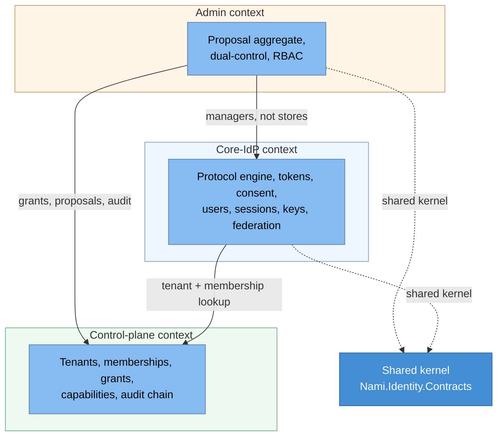

# Domain view (bounded contexts)

Nami's strategic Domain-Driven Design: three bounded contexts with a minimal
shared contract kernel, and a ubiquitous language used consistently across the
ADRs, the code, and this document (ADR-0058, ADR-0020, ADR-0059).

## Bounded contexts

| Context | Owns | Notes |
|---|---|---|
| Core-IdP | The OAuth/OIDC protocol, token issuance and validation, consent, user management, sessions, keys, and federation | Follows the OpenIddict pipeline plus ports/adapters style (ADR-0024) |
| Admin | Administrative use cases and the dual-control workflow | The only context with a rich tactical-DDD aggregate (Proposal); the rest is CRUD over managers (ADR-0020) |
| Control-plane | Tenants and their closure, memberships, delegated-admin grants, the capability catalog, and the audit hash-chain | Global and tenant-tagged; the backbone of multi-tenancy and delegated administration (ADR-0001, ADR-0010) |

The contexts talk through minimal shared contracts (`Nami.Identity.Contracts`);
the core IdP never depends on admin contracts, a boundary the compiler enforces
(ADR-0020). Event-driven messaging is used only at the edges (the audit outbox and
back-channel logout fan-out); dual-control execution is synchronous and
transactional, never eventual (ADR-0020).

## Ubiquitous language

| Term | Meaning |
|---|---|
| Tenant | An isolated customer boundary; Pool (shared DB) or Silo (own DB) (ADR-0001) |
| Membership | A user's belonging and roles within a tenant; identity itself is global (ADR-0001). **Independent of the delegated-admin grant below, which is the part that surprises**: the authorization decision query never joins memberships, so ending a membership leaves every capability the person held alive, and the coarse role also rides an already-issued access token. Removal is therefore immediate on the Admin API, which re-reads live, and delayed on a resource server until the token expires (ADR-0084) |
| Delegated-admin grant | A scoped, time-bound capability to administer a tenant subtree (ADR-0010) |
| Capability | A named, auditable permission in the catalog, some inheritable down the tenant tree (ADR-0010) |
| Proposal | The dual-control aggregate: a destructive action awaiting a second approver, TOCTOU-safe (ADR-0020) |
| Client / Scope | An OAuth application and a permission it may request; the scope catalog is global |
| Session | A server-side session keyed by `sid`, the unit of force-logout (ADR-0003) |
| Key scope | Whether a key set is per-Silo-tenant or shared by a Pool group (ADR-0033) |

## Sources

**This view had no `Sources` section until 2026-08-02 while citing nine ADRs inline**, which
was left open rather than filled in because the useful question is not which decisions a view
names but which it *rests on*, and separating those needs reading rather than a regex. The
reading was done, decision by decision, with the test the
[decisions index](18-decisions-index.md) uses: if this decision changed, would this view
become wrong? **All nine passed.** That is worth saying out loud, because a list that happens
to equal the inline citations looks like it was copied from them.

* **ADR-0001** (tiered isolation) and **ADR-0010** (tenant hierarchy and delegated admin) are
  the Control-plane context and four of the eight language entries between them. Reverse
  either and the table is wrong in its own terms.
* **ADR-0020** (admin architecture) owns the Admin context, the Proposal aggregate, and the
  compile-enforced contract boundary stated above the language table, including the clause
  that dual-control execution is synchronous rather than eventual.
* **ADR-0024** (architecture style) is what "follows the OpenIddict pipeline plus
  ports/adapters" means for the Core-IdP row.
* **ADR-0058** (Separation of Concerns) is the reason there are three contexts rather than
  one, so it is load-bearing on the diagram itself and not merely on its rationale.
* **ADR-0059** (value objects as complex types, aggregates gated on a transactional
  invariant) is the one worth attributing carefully. The Core-IdP row says Admin is the only
  context with a rich tactical-DDD aggregate and cites ADR-0020, which is right about *what*
  the Proposal is. **Why it is the only one** is ADR-0059's gate, and that half had no owner
  named here.
* **ADR-0003** (server-side sessions are core) defines the Session entry, which would be
  wrong rather than merely stale if sessions became optional.
* **ADR-0033** (key-scope isolation) is the Key scope entry in full.
* **ADR-0084** (what removing a person from a tenant guarantees) is the Membership entry's
  independence clause, and this view is its **only** citing view, so the entry is the whole
  architectural statement of that decision rather than a summary of one made elsewhere.

---

[Prev: Solution strategy](05-solution-strategy.md) · [Index](README.md) · Next: [Container view](07-container-view.md)
