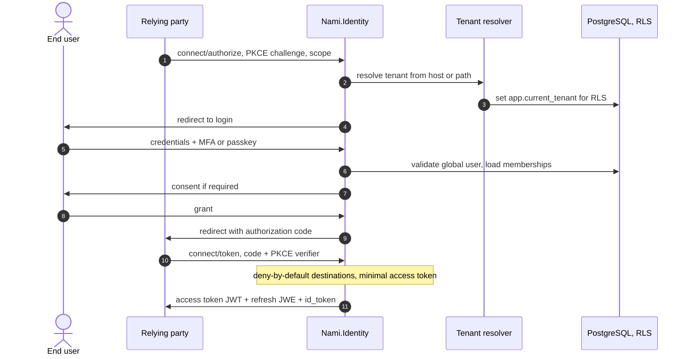
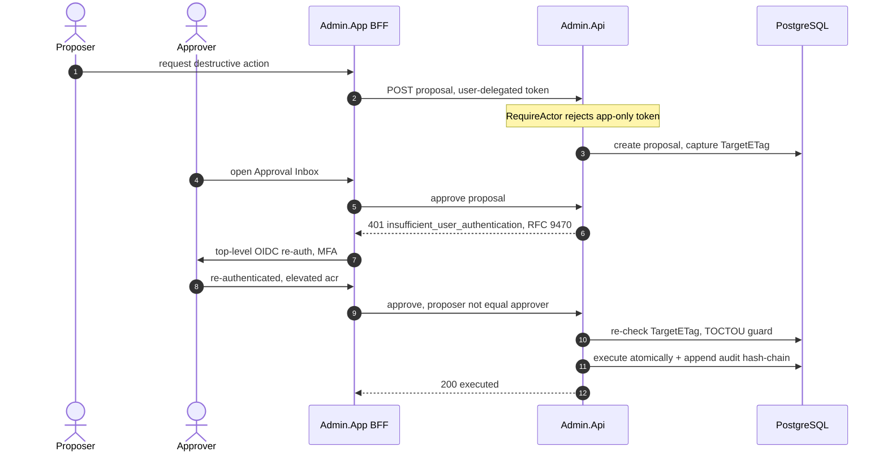
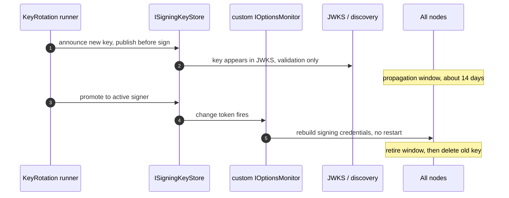
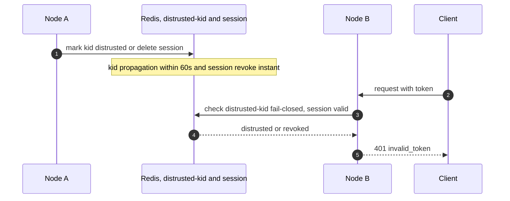
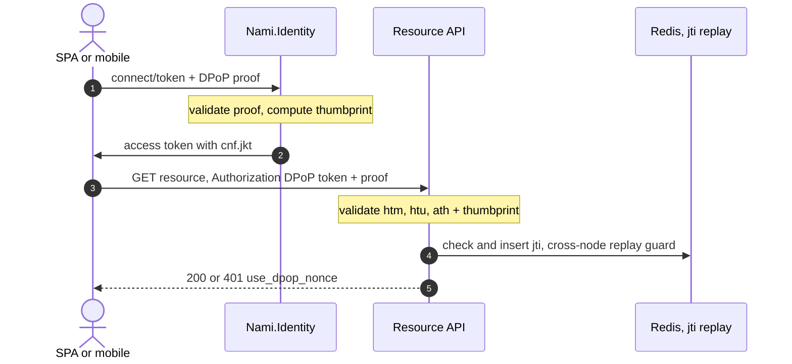
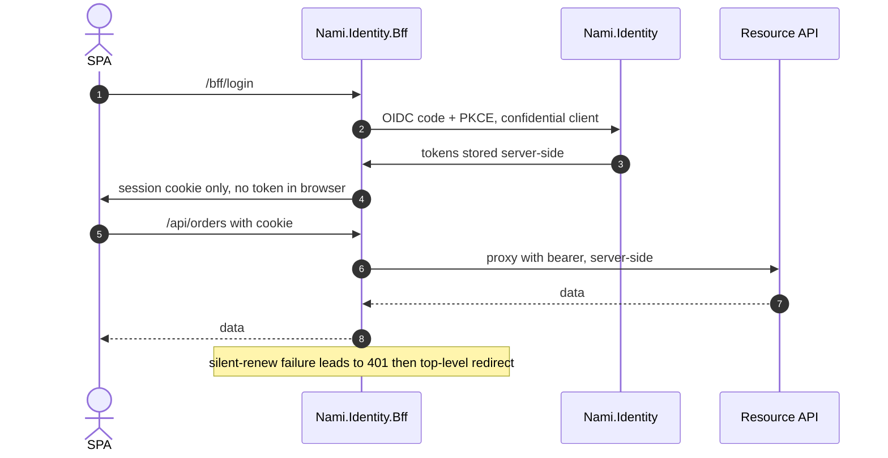
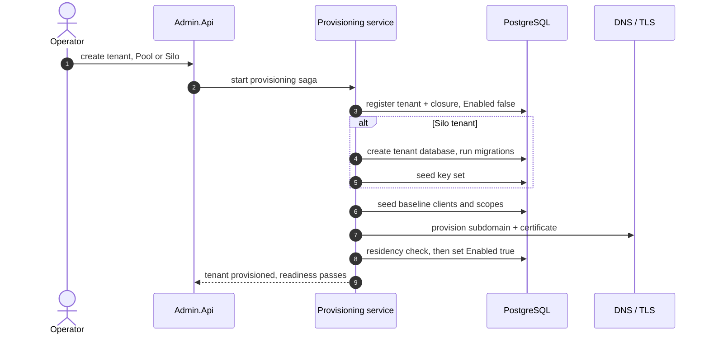
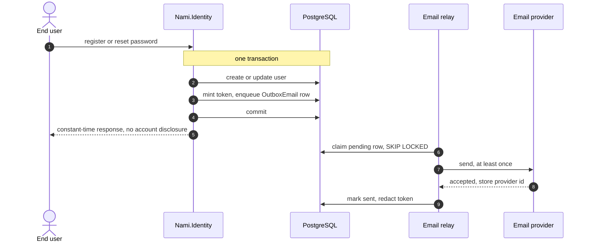
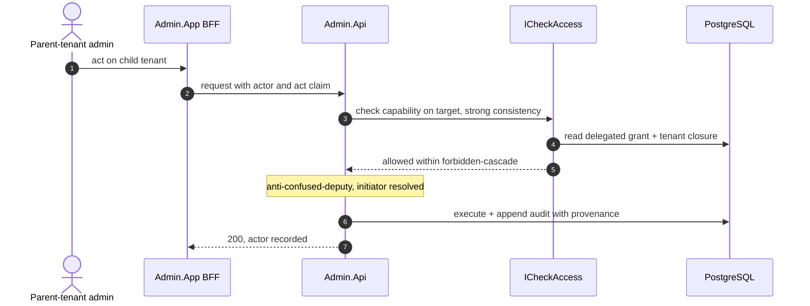
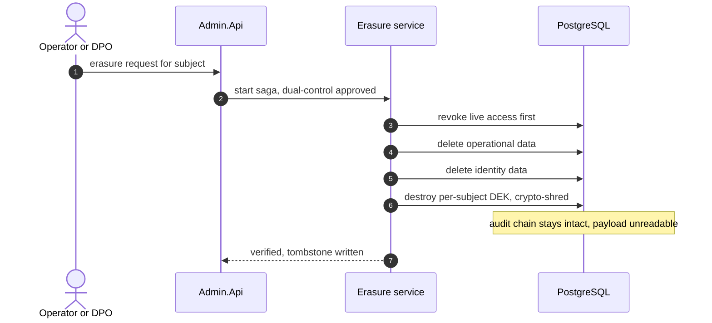

# Runtime views (key sequences)

Ten end-to-end flows that show how the containers and components collaborate at
runtime, grouped as protocol and security flows (1 to 6) and operational flows
(7 to 10). Host names follow ADR-0065.

## 1. Authorization code with PKCE and tenant resolution

The spine flow: sign-in, tenant resolution, and minimal-claim token issuance.

## 2. Admin dual-control with step-up

Propose, step-up, approve by a different person, TOCTOU re-check, execute, audit.

## 3. No-restart key rotation

Announce, publish-before-sign, promote, rebuild credentials with no restart.

Break-glass compromise is the same machinery run fast: mark the key revoked, push
it to the distrusted-kid set, and evict JWKS caches so the compromised key is out
of rotation in under five minutes (ADR-0007).

## 4. Cross-node revocation (break-glass and force-logout)

A revocation on one node is enforced on every other node.

## 5. DPoP issuance and resource validation

Sender-constrained tokens for public SPA and mobile clients (ADR-0014).

## 6. BFF token custody for a first-party SPA

The token never reaches the browser, which is the real XSS mitigation (ADR-0029).

## 7. Tenant provisioning saga

Onboarding a tenant as a single orchestrated saga (ADR-0017).

## 8. Transactional email outbox

Confirm and reset mail that is neither lost nor sent before commit (ADR-0038).

## 9. Delegated cross-tenant admin action

An administrator acting on a child tenant under a delegated grant (ADR-0010).

## 10. GDPR erasure saga

Right-to-erasure reconciled with the tamper-evident audit chain (ADR-0016).

---

[← Prev: Data](05-data.md) · [Index](README.md) · Next: [Cross-cutting →](07-cross-cutting.md)
