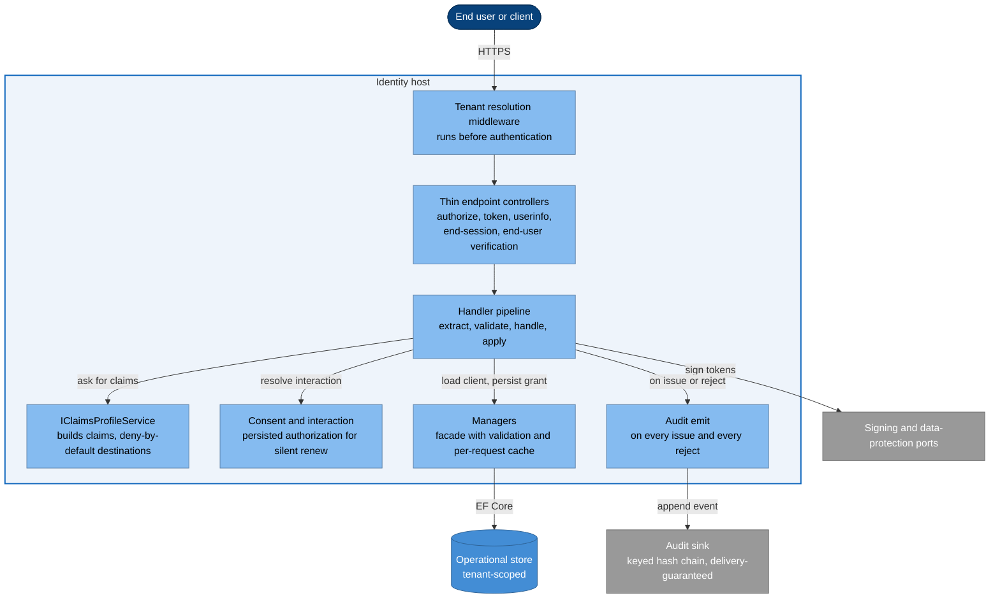
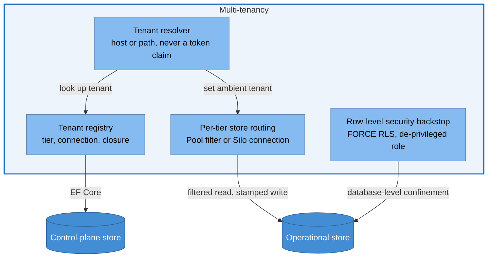
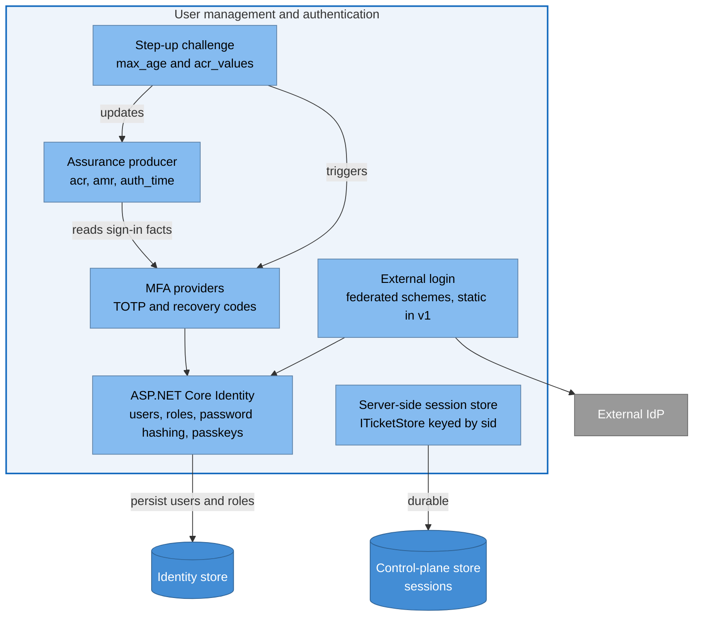
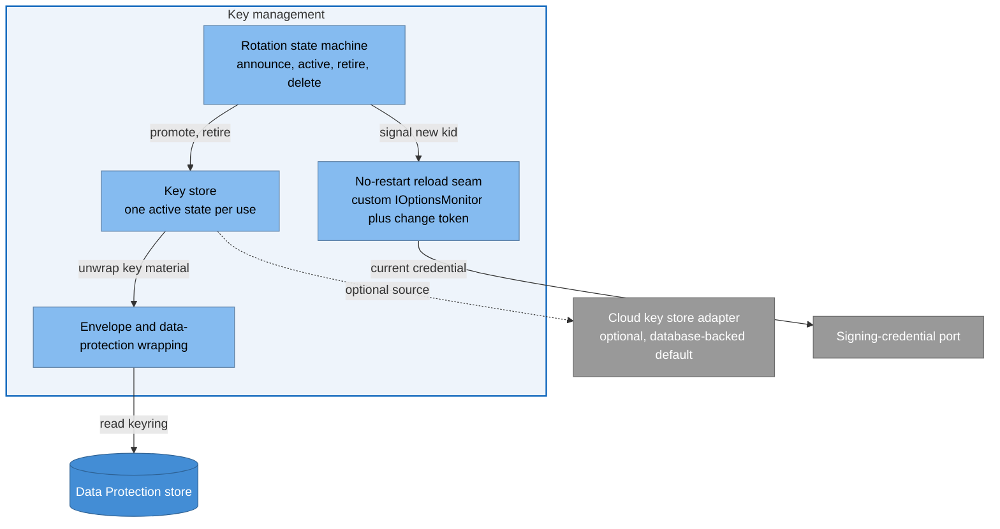
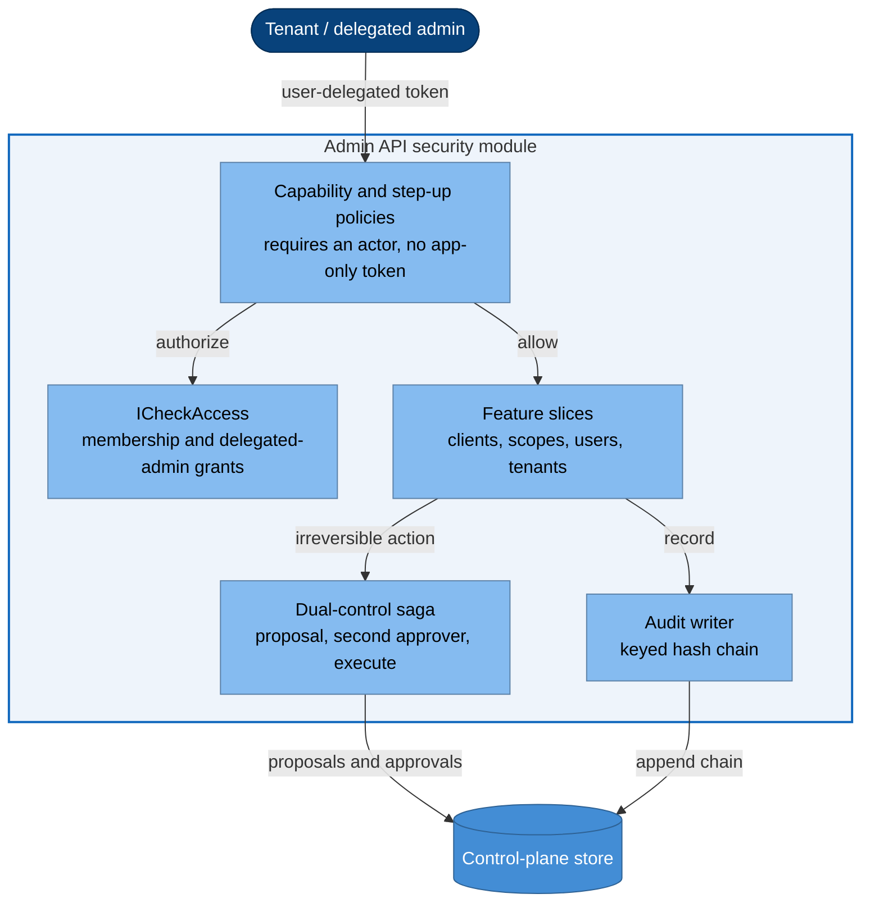
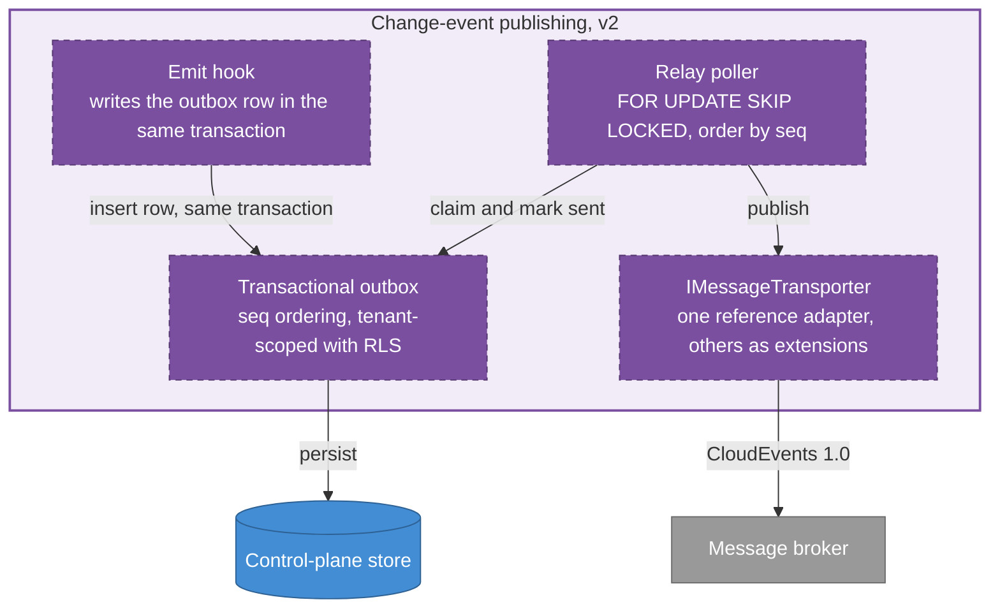

# Component view (C4 Level 3)

> **Part of:** the [Software Architecture Document](README.md), structural views. C4 Level 3.

This view opens the containers from [07-container-view](07-container-view.md) into their major
internal components. It stops **above code**: no class shapes, method signatures, or field
types, which belong to the [detailed designs](../design/README.md).

Two style facts from ADR-0024 shape every diagram here:

* The protocol host is **flat**. Its components are the engine's handler **pipeline** plus a
  few domain services and the ports at the infrastructure edge. There is no
  domain/application/infrastructure tower for protocol flow.
* **Ports exist only at real infrastructure seams** (persistence, key, secret, and data
  protection, the audit sink, the tenant store, and the `ICheckAccess` authorization port).
  Anything the application reaches through the protocol engine goes through the **manager**
  facade, never the store directly.

## 1. The protocol pipeline

* **Pass-through and fully-handled endpoints are not the same thing, and confusing them is
  the most common error in this codebase.** Only `authorize`, `token`, `userinfo`,
  `end-session`, and `end-user verification` are **pass-through**: the engine hands control to
  a controller which supplies the principal. Discovery, JWKS, introspection, revocation, and
  the `device authorization` endpoint are **fully handled** by the engine: no controller, no
  hand-rolled owner check, nothing to implement. The two halves of the device flow therefore
  sit on opposite sides of the split, which is where this distinction is easiest to get wrong. Writing a
  controller for a fully-handled endpoint duplicates or subverts logic the engine already
  owns correctly. The endpoint-by-endpoint table is in the
  [core-protocol design](../design/04-core-protocol.md), and the split is pinned by a
  contract-regression test so a version bump that moves an endpoint between the two
  categories fails CI (ADR-0021, ADR-0024).
* **Extend by inserting a handler, never by forking the engine.** A custom handler is
  anchored **relative to a named built-in descriptor's order** rather than to a hardcoded
  number, so the offset survives the engine renumbering its own handlers, and a
  pipeline-snapshot test pins the resulting order so a bump that reorders handlers fails CI
  instead of production (ADR-0021).
* **Claims are deny-by-default.** `IClaimsProfileService` is the single choke-point, and
  nothing reaches a token unless explicitly declared for a destination, so a stray claim
  cannot leak into an access token (ADR-0005 for which claims exist, ADR-0075 for the
  destination rule). Because the port is replaceable, that rule is a **binding invariant on
  any adapter**, not a property of this implementation, and it carries a contract test a
  consumer runs against their own (ADR-0075). Consent is persisted through the
  authorization manager, which is what makes silent renew with `prompt=none` possible.
* **Degraded mode is forbidden** in any token-issuing environment, enforced as a fail-fast
  startup invariant that also emits a security event (ADR-0043).

## 2. Multi-tenancy subsystem

Isolation is **two layers, and both are needed** (ADR-0001, ADR-0037, ADR-0049), and the
change-tracker path carries a registration constraint of its own (ADR-0018, see
[07-container-view](07-container-view.md)):

* **Layer 1** covers the change-tracker path: it auto-stamps `TenantId` on insert, applies a
  named query filter on read, and **throws on a mismatch or an unset tenant**, so no ambient
  tenant fails closed rather than reading everything.
* **Layer 2** is row-level security, which exists because layer 1 is bypassed by the bulk,
  raw-SQL, and `ExecuteUpdate`/`ExecuteDelete` paths that never touch the change tracker.
  The engine's own token-pruning call is exactly such a path. It requires a de-privileged
  role, because a superuser bypasses row-level security entirely, and the per-request tenant
  variable is set with `SET LOCAL` **inside** the request transaction so it is pooling-safe
  and never session-scoped.
* **Tenant is resolved from host or path and never from a token claim**, and resolution runs
  **before** authentication so the issuer and the stores are already tenant-correct when the
  pipeline starts.
* One type caveat is load-bearing rather than cosmetic: where `TenantId` is text an unset
  variable simply matches nothing, which fails closed, but where a control-plane table stores
  it as a `uuid` the policy must wrap the read in `NULLIF(..., '')` before casting, or an
  unset variable raises a cast error instead of failing closed. The rule is that casting to
  `uuid` implies a mandatory `NULLIF`. The column-level detail is in the
  [data design](../design/02-data.md).

## 3. User management, sessions, and authentication

* **Identity is global, tenant belonging is a membership.** One human is one user who may
  sign in to many tenants (ADR-0001, ADR-0028), including one arriving through an external
  provider: federated sign-in provisions and links into that same global identity, static in
  v1 (ADR-0002) and per-tenant dynamic in v2 (ADR-0034), with linking bound to the provider
  and subject pair rather than to an email address. Passkeys are native to the platform, and the
  endpoints are mapped by hand because they are not auto-mapped outside the Blazor template
  Nami does not use (ADR-0028, ADR-0072).
* **Server-side sessions are core, not optional** (ADR-0003). They are durable in
  PostgreSQL, not in Redis, keyed by the `sid` clients reference, which is what enables
  force-logout, an inactivity window, an absolute ceiling, and back-channel logout. A child
  table maps a session to the client IDs present in it and is the registry back-channel
  logout reads to know which relying parties to notify (ADR-0019). **Revocation is a row
  delete, not a status flag.**
* Two distinct session-integrity controls, which are easy to conflate: the `sid` is
  **rotated on step-up**, and a separate **session-fixation guard** mints a fresh `sid` on
  the anonymous-to-authenticated transition, enforced in the protocol pipeline rather than
  in the store. A **concurrent-session cap** counts a user's sessions and evicts the oldest.
* **MFA is the producer of assurance**, not merely a gate: it emits `acr`, `amr`, and
  `auth_time`, stamped at sign-in, which the session, logout, and authorization layers then
  consume. `acr` is **recomputed per token request** from the sign-in facts plus session
  age, so an aged session drops out of a higher assurance level even though `amr` still
  records that MFA happened. Step-up is enforced on `max_age` and `acr_values` (ADR-0013).

## 4. Key-management subsystem

* Rotation is a **90/14/14 state machine** (announce, active, retire, delete). Signing uses
  the credential with the furthest expiry, and a credential whose validity has not started
  does not sign; the JWKS publishes every asymmetric key so validation can accept any of
  them by `kid`, which is what makes the overlap window work (ADR-0011).
* Rotation happens with **no process restart**, through a custom options monitor and a
  change token. This is a **maintainer-endorsed but undocumented seam** (the upstream issue
  that established it is catalogued in ADR-0021), which is why it carries a contract-regression
  test that re-runs on every engine bump rather than being trusted to keep working. One sharp caveat is designed around rather than assumed: when the
  application validates its own tokens in-process, the framework snapshots signing keys into
  an immutable configuration manager at startup, and tripping the change token does not
  refresh it, so a freshly rotated key would fail self-validation until restart. The fix,
  proven by spike A-2, is a **custom non-static configuration manager** that reads the live
  key store and returns a key **set**, so both the old and the new token validate during the
  overlap (ADR-0011).
* Encryption credentials have a **separate lifecycle** from signing credentials (ADR-0005),
  and the encryption credential cannot be disabled.
* Readiness gates on keys-loaded, and the data-protection probe asserts that the **active
  key identifier matches the expected persisted one**. A bare protect-then-unprotect round
  trip would pass against a silently regenerated keyring and hide the loss, which is why the
  probe compares identity rather than exercising the round trip (ADR-0031).
* Disaster recovery must restore the signing keys **and** the data-protection keyring **and**
  the root certificate together, because the keyring wraps the signing key material
  (ADR-0006, ADR-0012).

## 5. Authorization and the admin security module

* **`ICheckAccess` is a database-first authorization port** behind a consistency-carrying
  interface, swappable to a relationship-based engine without changing call sites
  (ADR-0047). It backs delegated administration: capability-scoped, time-bound, revocable
  grants with **no super-admin** (ADR-0010).
* The mechanism that makes "no super-admin" real is the **forbidden cascade**: capabilities
  carry an inheritability flag, and the dangerous ones do not cascade down the tenant tree
  even from an ancestor grant, so they require a direct grant on the exact tenant. Note the
  v1 grant model is purely **additive**: there is no scoped deny row and no enforced
  "a child cannot exceed its parent" ceiling, so nothing may be designed as if one existed
  (ADR-0010).
* The **dual-control saga** is the architectural response to "never autonomous on an
  irreversible action": a proposal is recorded, a **different** person approves it, and only
  then does it execute. Enforcement is server-side in the API, never in the UI, which is the
  specific bypass this design exists to avoid (ADR-0020).
* Application logic is a **folder inside** the Admin API, not a separate project, and the
  no-HTTP and no-EF boundaries are asserted by the architecture-test suite rather than left
  to review (ADR-0020, ADR-0024).

## 6. The audit subsystem

The audit sink is a typed event catalog covering success, failure, denial, and error, with
three load-bearing tamper-evidence properties (ADR-0008):

* Storage is **append-only**, an insert-only grant with no update or delete.
* The chain is **keyed**: `RecordHash = HMAC_k(PrevHash || canonical(fields))`, with an
  application-held key rather than a bare digest, so an attacker who can write rows still
  cannot recompute a valid chain. An append-only grant does not stop a superuser, which is
  exactly why the chain exists. Operands are **prev-first**, the standard convention, so an
  independent verifier can reproduce it, and the record is canonicalized to **text** before
  hashing because `jsonb` does not preserve input byte order. The genesis previous-hash is
  32 zero bytes, not a string.
* Delivery is **guaranteed**: security-critical events commit synchronously in the same
  transaction as the action, and the rest go through an outbox to a write-once destination,
  so a sink being down degrades latency rather than creating a blind spot.

The application-side chain is a consequence of the engine choice: PostgreSQL is the sole
database (ADR-0037), so there is no engine-native ledger table to lean on.

## 7. The email subsystem

An email dispatcher port with provider adapters, a transactional outbox drained
at-least-once, anti-enumeration on every user-facing response, and a suppression store that
holds only a **hash** of the recipient rather than the address (ADR-0038). The outbox row is
written in the **same transaction** as the user mutation, so a rolled-back registration sends
nothing and a committed one is guaranteed to be delivered. There are two outbox homes, one
global and one tenant-scoped, precisely so the enqueue can always join the transaction that
triggered it.

## 8. Change-event publishing (v2)

Kill-switched off in v1 (ADR-0071). Three spike findings shape the design rather than being
discovered later: ordering uses an IDENTITY `seq` column and **not** the UUIDv7 key, because
UUIDv7 is not monotonic within a millisecond; consumers must deduplicate through an inbox,
because at-least-once delivery plus a broker without native deduplication means a duplicate
is expected rather than exceptional; and the tenant-scoped outbox needs the `NULLIF` cast
rule from section 2 (ADR-0071, ADR-0036).

## 9. The two lanes never cross

The **audit lane** (tamper-evident, delivery-guaranteed) and the **diagnostics lane**
(`ILogger` plus OpenTelemetry, PII-redacted) are separate by decision (ADR-0008, ADR-0022).
Audit never routes through the telemetry pipeline, which has neither tamper-evidence nor a
delivery guarantee, and the two are joined only by a correlation identifier. This is why
audit and diagnostics appear as distinct components rather than as one logging concern.

## 10. Ports and adapters

The cloud-agnostic ports (signing credentials, encryption credentials, secret resolution,
the data-protection key store, email dispatch, and the audit sink) default to
database-backed adapters and swap to a cloud key or secret store by configuration alone
(ADR-0006, ADR-0009). They are also the documented extension points for consumers
(ADR-0027). Per ADR-0024 they exist **only** at real infrastructure seams; the
backend-for-frontend is the one acknowledged infrastructure edge with no port, because it is
a composition boundary whose seam is configuration (ADR-0029).

## Sources

* ADR-0021 and ADR-0024 (the handler pipeline, order anchoring, the pass-through versus
  fully-handled endpoint set as a pinned contract, the flat host, and ports only at real
  seams), ADR-0005 (the minimal claim set and the separate encryption-credential
  lifecycle), ADR-0043 (the degraded-mode startup invariant).
* ADR-0001, ADR-0037, and ADR-0049 (two-layer tenant isolation, the row-level-security
  backstop and its de-privileged role, `SET LOCAL` inside the transaction, and the
  resource-server side of the boundary), ADR-0018 (the change-tracker paths and pooling
  constraints), ADR-0071 (the `NULLIF` cast rule the tenant-scoped outbox needs).
* ADR-0028 and ADR-0072 (identity, passkeys, and the hand-mapped endpoints), ADR-0003 (the
  durable session store, its child client registry, delete-not-flag revocation, the
  fixation guard, and the concurrent-session cap), ADR-0013 (the assurance producer and
  step-up), ADR-0002 and ADR-0034 (static and dynamic external login), ADR-0019 (the
  back-channel logout registry).
* ADR-0011 (the 90/14/14 rotation state machine, the no-restart seam, and the
  self-validation configuration-manager fix from spike A-2), ADR-0006 and ADR-0012 (the
  provider-agnostic key store and the joint restore of keys, keyring, and root
  certificate), ADR-0031 (the data-protection probe comparing key identity rather than
  round-tripping).
* ADR-0047 and ADR-0010 (the authorization port, delegated-admin grants, the forbidden
  cascade, and the additive-only v1 grant model), ADR-0020 (the dual-control saga enforced
  server-side, and the folder-not-project boundary).
* ADR-0008 (the keyed hash chain and the synchronous-versus-outbox delivery split),
  ADR-0022 (the diagnostics lane), ADR-0037 (PostgreSQL as the reason the chain is
  application-side), ADR-0038 (the email subsystem and the hashed suppression store),
  ADR-0009 and ADR-0027 (the ports and their role as consumer extension points), ADR-0029
  (the one acknowledged port exception), ADR-0036 (why ordering uses a sequence column).
* [`docs/design/04-core-protocol.md`](../design/04-core-protocol.md) for the
  endpoint-by-endpoint pass-through table, and
  [`docs/design/02-data.md`](../design/02-data.md) for column-level detail.
* Reconciled against the design corpus's component view on 2026-07-25. The corpus supplied
  the six-subsystem decomposition adopted here in place of a single diagram, and three facts
  this view lacked entirely: the **pass-through versus fully-handled** distinction, which
  both the corpus and this repository call the most common error in the codebase; the
  rotation **state machine** as named states; and the row-level-security type caveat. One
  correction ran the other way: this view had carried the audit chain as a bare
  `H(prev_hash || payload)`, which batch 1d had already upgraded in ADR-0008 to the keyed
  `HMAC_k` form, and the corpus's own data view is internally inconsistent on the same point,
  writing `H(...)` in the formula while calling it HMAC-keyed in prose. ADR-0008 is followed.

---

[Prev: Container view](07-container-view.md) · [Index](README.md) · Next: [Runtime flow views](09-runtime-flow-views.md)
