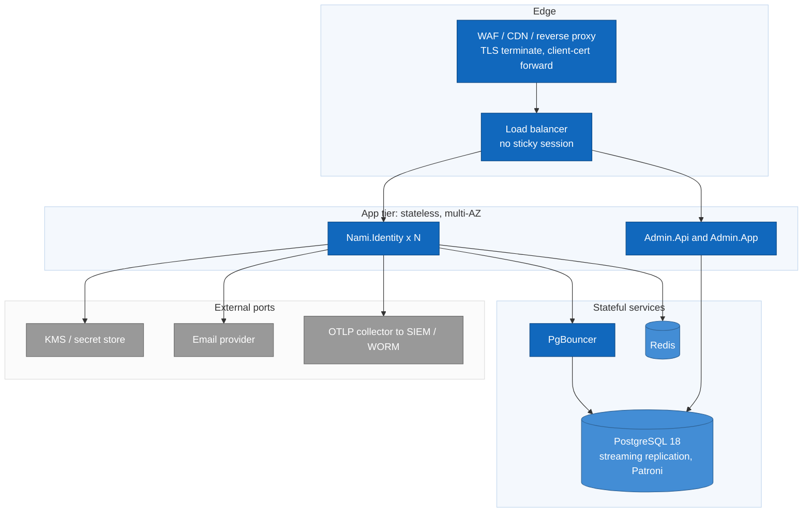

# Deployment view

Stateless horizontal scale behind an edge layer, with all shared state
externalized to PostgreSQL and Redis.

## Facts that shape the topology

* Stateless nodes, no sticky sessions, at least two availability zones. An edge
  layer (WAF/CDN/reverse proxy) terminates TLS and, for mTLS, forwards the client
  certificate under a `KnownProxies` allow-list (ADR-0014, ADR-0025). Local
  development uses a locally-trusted cert behind a terminating proxy, trusted on
  both the browser and back-channel sides (ADR-0070).
* The data protection keyring and signing keys are shared across nodes with a fixed
  application name, and live on a store independent of Redis, so a Redis outage
  does not break authentication.
* Containers are chiseled, non-root, digest-pinned, and signed. Production uses
  OpenTofu plus Helm, never docker-compose (ADR-0023, ADR-0025, ADR-0051).
* No migrate-on-startup in production; Pool schema changes are additive
  expand/contract within a release; deploys are zero-downtime with dual control
  (ADR-0017, ADR-0031, ADR-0046).
* PostgreSQL runs with streaming replication and managed or Patroni failover, WAL
  archiving for PITR, and a per-store RTO/RPO with the keyring the strictest
  (ADR-0006, ADR-0011).
* Configuration is 12-factor: `Nami:Section:Key` keys (env `Nami__Section__Key`,
  alias `NAMI_X`), no secrets baked into images (ADR-0031, ADR-0032, ADR-0052).
* All nodes are NTP-synchronised; a 60-second clock-skew tolerance bridges only
  small drift, and clock drift is alerted (ADR-0041).

---

[← Prev: Cross-cutting](07-cross-cutting.md) · [Index](README.md)
