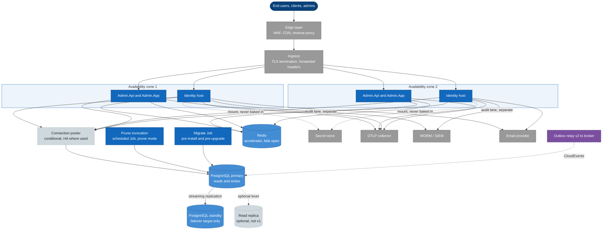
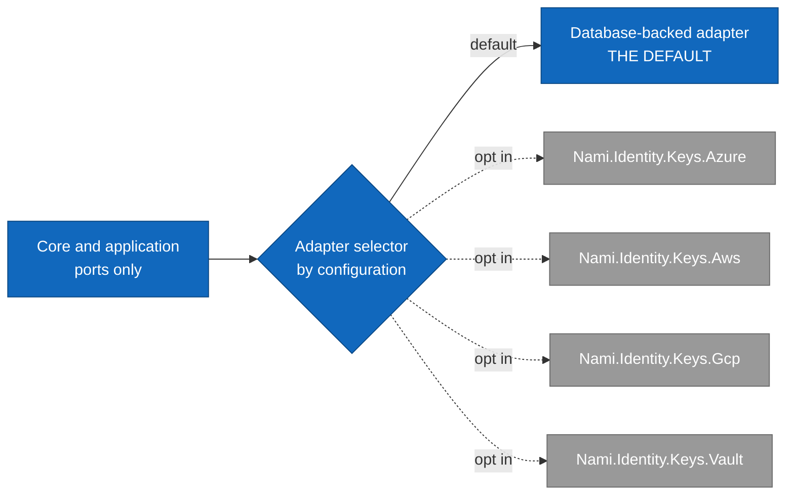

# Deployment view

> **Part of:** the [Software Architecture Document](README.md), structural views.

Where the containers of [03-containers](03-containers.md) actually run: the reference
topology, the cloud-agnostic adapter model, the image and its run modes, the
infrastructure-versus-application split, and the knobs without which "multi-zone" is a
claim rather than a property. Behaviour **under failure** (failover, recovery objectives,
backup) is [13-reliability-backup-and-dr](13-reliability-backup-and-dr.md); running it day
to day is [16-operations-and-maintenance](16-operations-and-maintenance.md).

## 1. Reference topology

Kubernetes is drawn because it is the reference target, not because it is required: the
same shape holds on virtual machines or a managed container service.

```mermaid
graph TB
  users([End users, clients, admins]):::person
  edge[Edge layer<br/>WAF, CDN, reverse proxy]:::ext
  ing[Ingress<br/>TLS termination, forwarded headers]:::ext

  subgraph AZ1["Availability zone 1"]
    direction TB
    idp1[Identity host]:::host
    adm1[Admin.Api and Admin.App]:::host
  end
  subgraph AZ2["Availability zone 2"]
    direction TB
    idp2[Identity host]:::host
    adm2[Admin.Api and Admin.App]:::host
  end

  prune[Prune invocation<br/>scheduled Job, prune mode]:::host
  mig[Migrate Job<br/>pre-install and pre-upgrade]:::host

  bouncer[Connection pooler<br/>conditional, HA where used]:::optional
  primary[(PostgreSQL primary<br/>reads and writes)]:::store
  standby[(PostgreSQL standby<br/>failover target only)]:::store
  replica[(Read replica<br/>optional, not v1)]:::optional
  redis[(Redis<br/>accelerator, fails open)]:::store

  secrets[Secret store]:::ext
  otel[OTLP collector]:::ext
  siem[WORM / SIEM]:::ext
  mail[Email provider]:::ext
  relay[Outbox relay v2 to broker]:::v2

  users --> edge --> ing
  ing --> idp1 & idp2 & adm1 & adm2
  idp1 & idp2 & adm1 & adm2 --> redis
  idp1 & idp2 & adm1 & adm2 --> bouncer
  bouncer --> primary
  prune --> primary
  mig --> primary
  primary -->|streaming replication| standby
  primary -.->|optional lever| replica
  idp1 & idp2 -.->|mount, never baked in| secrets
  idp1 & idp2 & adm1 & adm2 --> otel
  idp1 & idp2 -->|audit lane, separate| siem
  idp1 & idp2 --> mail
  relay -.->|CloudEvents| primary

  classDef person fill:#08427b,stroke:#052e56,color:#ffffff
  classDef host fill:#1168bd,stroke:#0b4884,color:#ffffff
  classDef store fill:#438dd5,stroke:#2e6295,color:#ffffff
  classDef ext fill:#999999,stroke:#6b6b6b,color:#ffffff
  classDef optional fill:#cfd8dc,stroke:#90a4ae,color:#1a2b34,stroke-dasharray:5 4
  classDef v2 fill:#7b4fa0,stroke:#54356f,color:#ffffff,stroke-dasharray:5 4
  style AZ1 fill:#eef4fb,stroke:#1168bd
  style AZ2 fill:#eef4fb,stroke:#1168bd
```

Three things in that picture are deliberate and easy to get wrong.

* **The application tier is identical in every zone.** Background work is not a separate
  pod: key rotation and the delivery relays run **in-process on every replica**, made safe
  by clustered scheduling and by `SKIP LOCKED` respectively (ADR-0031, and
  [03-containers](03-containers.md) for which pattern applies to which job). The one
  exception is the prune invocation, drawn as its own Job. This matters here because a
  reader who deploys "a background runner pod" from an older reading would create a
  process that the scheduler does not expect and that no readiness probe covers.
* **The standby is a failover target, not a read replica** (ADR-0074). It is drawn
  receiving replication and serving nothing.
* **The connection pooler is conditional.** ADR-0018 and ADR-0037 make transaction-mode
  pooling a response to Silo scale, not a default. Where it is deployed it sits **on the
  hot path**, so a single instance is a single point of failure and it needs at least two
  instances with failover (ADR-0074 parameter D). Drawn dashed for that reason.

## 2. Cloud-agnostic adapters, with the no-cloud path as the default

Every infrastructure dependency that differs by provider is reached through a port in
`Nami.Identity.Abstractions`, and the adapter is selected by configuration. The core never
references a provider SDK type (ADR-0024, ADR-0006, ADR-0009).

```mermaid
graph LR
  core[Core and application<br/>ports only]:::host
  sel{Adapter selector<br/>by configuration}:::host
  db[Database-backed adapter<br/>THE DEFAULT]:::host
  az[Nami.Identity.Keys.Azure]:::ext
  aws[Nami.Identity.Keys.Aws]:::ext
  gcp[Nami.Identity.Keys.Gcp]:::ext
  vault[Nami.Identity.Keys.Vault]:::ext

  core --> sel
  sel -->|default| db
  sel -.->|opt in| az
  sel -.->|opt in| aws
  sel -.->|opt in| gcp
  sel -.->|opt in| vault

  classDef host fill:#1168bd,stroke:#0b4884,color:#ffffff
  classDef ext fill:#999999,stroke:#6b6b6b,color:#ffffff
```

The ports are `ISigningCredentialSource`, `IEncryptionCredentialSource`, `ISecretResolver`,
`IDataProtectionKeyStore`, and `ISecurityEventSink`. **The database-backed adapter is the
default**, which is the deployment-time expression of the cloud-agnostic driver: the
reference host runs with no cloud account at all, on a laptop or on-premises, and cloud
adapters are opt-in packages. Adapters are named after the **port they adapt** rather than
after one provider's product, because only one provider has a product called Key Vault
(ADR-0065).

## 3. One image, four run modes

The image is chiseled, non-root, and **digest-pinned** rather than tracking a mutable tag,
and it is rebuilt, rescanned, and resigned on the base-image CVE cadence (ADR-0025,
ADR-0051). Four entrypoint modes ship in that one image (ADR-0027):

| Mode | What it does | Deployment shape |
|---|---|---|
| `serve` | Runs the host. Auto-seeds the first signing key at cold start (data, not schema) and readiness-gates until keys load | Deployment, at least two replicas, spread across zones |
| `migrate` | Runs the migration bundle or idempotent SQL and exits | A pre-install and pre-upgrade Job, or an init container. **Never on startup in production** |
| `export` | Dumps the current declarative configuration, never secrets or keys | An operator-run Job, for GitOps and backup |
| `prune` | Bulk-deletes expired tokens and authorizations, iterating tenants | A scheduled Job, kept off the request path (ADR-0031) |

Four invariants sit on top. **No secret is ever baked into the image**: connection strings
and the root certificate arrive by environment, mounted file, or secret store, with
precedence environment over secret store over `appsettings.{Environment}` over
`appsettings` (ADR-0031, ADR-0009). **Configuration keys follow one shape** so an operator
can predict them: `Nami:Section:Key` in configuration, `Nami__Section__Key` as the
environment form, and a short `NAMI_X` alias for common toggles (ADR-0065, ADR-0052,
ADR-0032). **A deploy is zero-downtime and dual-controlled**: a production release is itself
one of the actions that passes through the dual-control gate rather than being a
single-operator act (ADR-0046), and the schema side of that is expand-and-contract so old
code and new schema coexist within a release, which is what makes a rollout reversible
(ADR-0017; the mechanics are in the schema-evolution view). And **production logs go to stdout and OTLP only**,
with no file sink inside the container, because log collection is the platform's job
(ADR-0022). The audit stream is drawn as its own arrow to a write-once destination on
purpose: it is a separate lane from diagnostics, joined only by a correlation identifier,
and it must not be collapsed into the OTLP path (ADR-0008).

A first-start-only bootstrap admin applies once when no admin exists, forces a password
change, and fails fast on a weak password in production. It is tied to the first-admin
bootstrap of ADR-0015 and to **nothing** in ADR-0007, which is break-glass for a
compromised *key* and a different concern entirely.

## 4. Infrastructure versus application

The split is deliberate and the chart does not blur it (ADR-0023, ADR-0027):

* **Infrastructure** (databases, Redis, key and secret stores, network, node pools) is
  provisioned with OpenTofu. The consumer owns this.
* **Helm deploys the application only**: a `serve` Deployment, a `migrate` Job, a Service,
  and an optional Ingress. The chart provisions no infrastructure.
* **Three onboarding paths** exist and are meant to stay distinguishable: `docker compose
  up` for a zero-code demo, `dotnet new nami-identity` to scaffold a host, or referencing
  the `Nami.Identity` meta-package into an existing host. Production uses OpenTofu plus
  Helm and never docker-compose (ADR-0025).

## 5. The knobs that make multi-zone real

Multi-zone is only a property if the chart pins these. Without them it is an aspiration,
and the failure shows up during a node drain rather than in a review (ADR-0031, finding
F53).

| Knob | Why it is load-bearing |
|---|---|
| `PodDisruptionBudget` with `minAvailable >= 1` | A voluntary disruption (node drain, cluster upgrade) must not take every replica down at once |
| `topologySpreadConstraints` or anti-affinity | Replicas spread across at least two zones, so losing one zone leaves the service up |
| `rollingUpdate` (`maxUnavailable`, `maxSurge`) | Zero-downtime deploys, timed against graceful shutdown |
| Resource requests and limits | Stable scheduling and no OOM-kill. Size them from the measured profile, **not** from a signing budget: signing CPU is explicitly **not** the binding constraint, at roughly 0.07 of a core for the 10k-concurrent-user goal (ADR-0041 and the capacity model) |
| `preStop` sleep, plus readiness flip, plus graceful shutdown | On SIGTERM readiness flips to NotReady and the `preStop` sleep lets the load balancer drain **before** Kestrel stops accepting, with `terminationGracePeriodSeconds` greater than the `preStop` sleep plus the shutdown timeout |
| **Liveness never probes `/health/ready`** | A draining pod reports NotReady on purpose. If liveness watched readiness, the platform would kill the pod mid-drain and turn a clean rollout into dropped requests |

Readiness gates on three conditions, all of them: at least one active signing key, at least
one encryption key, and a successful data-protection unprotect whose check compares the
active `kid` to the expected **persisted** `kid`. A bare protect-and-unprotect round trip
would pass against a silently regenerated keyring and hide the loss, so the comparison is
the point rather than the round trip (ADR-0012, ADR-0031).

**Time synchronisation is a platform requirement, not a recommendation.** Every node,
application and database alike, runs NTP or chrony, and a clock-drift alert fires when a
node's offset exceeds roughly **30 seconds, half of the 60-second token skew tolerance**,
so the alert arrives *before* drift consumes the whole margin and `max_age`, `auth_time`,
and the eight-hour refresh ceiling begin accepting or rejecting wrongly (ADR-0031; the
alert rides the shared alerting pipeline of ADR-0041). The tolerance absorbs small residual
drift and is not a substitute for synchronisation.

## 6. Data and cache placement

* **PostgreSQL** is a primary serving reads and writes, a streaming-replication standby,
  automatic failover, and write-ahead-log archiving for point-in-time recovery. **No
  failover product is mandated**: a self-managed cluster manager and a managed
  high-availability offering both satisfy the decision, and which one is an Ops choice
  (ADR-0074). The operational store carries the hot write path, because every issuance
  writes a row.
* **A read-only replica for configuration and discovery reads is an optional lever and
  explicitly not v1.** Adopting it means accepting a replication-lag caveat on
  configuration reads and deciding how that interacts with the 30-second
  configuration-propagation bound, which is a decision to make then (ADR-0074, ADR-0039).
* **The keyring is shared across nodes under a fixed application name.** Every replica must
  resolve the same keyring, so the application name is fixed rather than defaulted: renaming
  it isolates the keyring and silently loses access to everything the old keys protect
  (ADR-0011, ADR-0012). This is a deploy-time invariant, not a code detail, because the
  rename that breaks it usually arrives through configuration.
* **Redis is an accelerator that fails open.** Sessions stay durable in PostgreSQL and the
  data-protection keyring is deliberately independent of Redis, so a Redis outage degrades
  latency without breaking authentication. Its durability is an operator option the
  application never depends on, and the per-cache consequences of losing it differ, which
  is why they are enumerated per cache rather than globally (ADR-0074 parameter E,
  ADR-0040).

## 7. The edge assumption, stated because it changes the ceiling

The reference deployment assumes an L7 edge in front: TLS termination policy, IP reputation
and bot filtering, geographic and velocity rules, request and header size caps, and L7
denial-of-service absorption. Deployed direct to the internet, those responsibilities fall
to Kestrel hardening plus the in-application limits of ADR-0040 and ADR-0042, at a lower
ceiling. Forwarded headers are processed **only** from trusted proxies, because a wrong
scheme defeats cookie invariants, a wrong client address collapses per-IP limiting into one
global bucket, and an unvalidated forwarded host reaches host-based tenant resolution
(ADR-0073). For mTLS, the edge forwards the client certificate under a `KnownProxies`
allow-list (ADR-0014). Local development serves HTTPS with a locally-trusted certificate
behind a terminating proxy, trusted on both the browser and back-channel sides (ADR-0070).

## Sources

* ADR-0074 (the database topology, the standby-is-not-a-replica invariant, the optional
  read-replica lever, pooler high availability, and Redis durability as an operator
  option), ADR-0018 and ADR-0037 (why the pooler is conditional rather than default),
  ADR-0039 (the configuration-propagation bound a read replica would have to respect).
* ADR-0031 (the multi-zone knobs from finding F53, graceful shutdown and the readiness
  flip, the configuration-precedence chain, stdout-only logging, and the time-sync
  requirement with its 30-second alert threshold), ADR-0041 (the alerting pipeline the
  drift alert rides), ADR-0012 (the persisted-`kid` readiness comparison and why a round
  trip is not enough).
* ADR-0011 and ADR-0012 (the keyring shared under a fixed application name, and what a
  rename costs), ADR-0046 (a production deploy passes the dual-control gate), ADR-0017
  (expand-and-contract, so old code and new schema coexist within a release), ADR-0065 with
  ADR-0052 and ADR-0032 (the configuration-key shape and its environment form).
* ADR-0027 (the four entrypoint modes and the three onboarding paths), ADR-0025 (the
  chiseled digest-pinned image, no migrate-on-startup, docker-compose for development
  only), ADR-0051 (signing and attestation of the image), ADR-0023 (OpenTofu for
  infrastructure).
* ADR-0006, ADR-0009, and ADR-0024 (the ports, the secret-resolution discipline, and the
  dependency rule that keeps provider SDKs out of the core), ADR-0065 (adapters named after
  the port, not one vendor's product).
* ADR-0073 (the edge assumption and the trusted-proxy rule), ADR-0014 (client-certificate
  forwarding and `KnownProxies`), ADR-0040 and ADR-0042 (the in-application limits that
  substitute at a lower ceiling), ADR-0070 (local development TLS), ADR-0022 (the
  diagnostics lane), ADR-0008 (the separate audit lane), ADR-0015 and ADR-0007 (the
  bootstrap admin, and the ADR it is deliberately **not** tied to).
* Reconciled against the design corpus's deployment view on 2026-07-25. Taken from it: the
  zone-partitioned topology drawing, the adapter-selector diagram with the database adapter
  as default, the run-mode table, the multi-zone knob table including the
  liveness-must-not-probe-readiness invariant, and the explicit edge assumption. Corrected
  rather than imported: the corpus draws a "background runner, single clustered" pod, which
  misdescribes clustered scheduling (every replica has a scheduler and exactly one trigger
  fires) and is not adopted; the corpus names a specific failover product, which ADR-0074
  deliberately does not mandate; and the corpus lists three run modes where this repository
  now has four. Two defects on this side were found in the same pass and fixed here: this
  view had named that same failover product in its own diagram, contradicting ADR-0074, and
  it drew the connection pooler as an unconditional hop on the hot path, which repeats an
  over-claim already corrected in the container view (ADR-0018 and ADR-0037 make it
  conditional on Silo scale). A third was a mis-citation: the clock-drift alert was
  attributed to ADR-0041, but ADR-0031 owns the requirement and the 30-second threshold
  while ADR-0041 owns only the alerting pipeline it rides.

---

[Prev: Cross-cutting](07-cross-cutting.md) · [Index](README.md) · Next: [Stakeholders and concerns](09-stakeholders-and-concerns.md)
