# Runtime views (key sequences)

> **Part of:** the [Software Architecture Document](README.md), structural views.

Sixteen end-to-end flows showing how the containers of
[07-container-view](07-container-view.md) and the components of
[08-component-view](08-component-view.md) collaborate at runtime. Each flow is chosen because
it exercises a decision that shapes the architecture, and each is followed by an
**Invariants** paragraph: the properties the flow must preserve, which is the part a
diagram cannot carry. Where an invariant is stated here, it is because dropping it
silently breaks something, not because it is a convention.

Host and assembly names follow ADR-0065. Flow numbers are **stable identifiers**:
other documents cite them by number, so numbering follows the order flows were added
rather than theme. Read by theme using this map.

| Theme | Flows |
|---|---|
| Protocol and issuance | [1](#1-authorization-code-with-pkce-and-tenant-resolution) authorization code, [11](#11-refresh-token-rotation-with-reuse-detection) refresh rotation, [12](#12-consent-persistence-and-silent-reuse) consent, [15](#15-token-exchange-delegation-rfc-8693) token exchange |
| Sender constraint and token custody | [5](#5-dpop-issuance-and-resource-validation) DPoP, [6](#6-bff-token-custody-for-a-first-party-spa) BFF |
| Session, logout, and revocation | [4](#4-cross-node-revocation-per-path) cross-node revocation, [14](#14-back-channel-single-logout-fan-out) single logout |
| Key lifecycle | [3](#3-no-restart-key-rotation) no-restart rotation |
| Tenancy | [13](#13-per-request-tenant-resolution-and-isolation) per-request isolation, [7](#7-tenant-provisioning-saga) provisioning |
| Administration and governance | [2](#2-admin-dual-control-with-step-up) dual control, [9](#9-delegated-cross-tenant-admin-action) delegated admin |
| Data lifecycle and integration | [8](#8-transactional-email-outbox) email outbox, [10](#10-gdpr-erasure-saga) erasure, [16](#16-identity-change-event-publishing-v2-outbox) change events |

Flows deliberately **not** drawn here are listed in
[section 17](#17-flows-deliberately-not-drawn-at-this-altitude), so an omission is
explicit rather than accidental.

## 1. Authorization code with PKCE and tenant resolution

The spine flow: sign-in, tenant resolution, and minimal-claim token issuance.

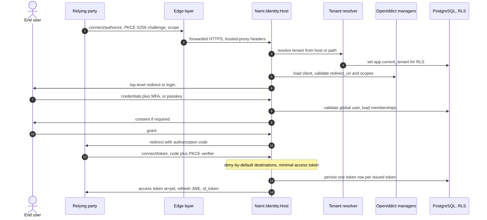

**Invariants.** The tenant is resolved **before** authentication and before any
DbContext use, so the issuer and every store are tenant-correct for the whole request
(ADR-0001, flow 13). PKCE is **`S256` only**: OpenIddict defaults
`code_challenge_methods_supported` to `{Plain, Sha256}` and unions it into discovery,
so removing `plain` is an **active step**, not a default, and omitting that step
re-opens a downgrade. The authorization code is single-use. The access token is a
**plain signed JWT** (`at+jwt`, `DisableAccessTokenEncryption`, ADR-0005), which is why
the minimal claim set is mandatory rather than a preference: anyone holding the token
can read it. Claims are deny-by-default by destination, and because the port enforcing it is
replaceable, that is a binding invariant on any adapter rather than a property of the shipped
one (ADR-0075). Every issuance writes one
operational-store row, which makes this the hot **write** path, not just the hot read
path. The edge hop is assumed rather than shipped, and forwarded headers are honoured
only from trusted proxies (ADR-0073).

## 2. Admin dual-control with step-up

Propose, step-up, approve by a different person, TOCTOU re-check, execute, audit.

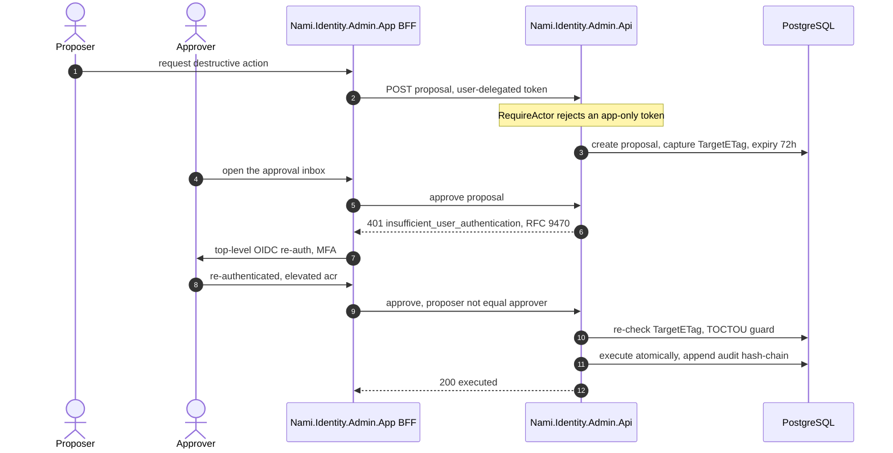

**Invariants.** `RequireActor` is a **precondition to any capability check**: the
request must carry a real user (a `sub` plus `amr` or `auth_time` on the `admin-api`
audience), and an app-only or client-credentials token is rejected with 403
`admin_requires_actor`. It is paired with an **issuance-time** invariant that no
client-credentials client is ever granted the `admin-api` scope, so an app-only token
for the admin API cannot exist in the first place; the runtime check alone would be one
misconfiguration away from being the only line of defence. The approval is bound to
`request_hash = H(capability + target + params)`, single-use and time-boxed against
that hash, and is itself step-up-gated. Proposer must not equal approver. Required
assurance is `max(client default, scope, runtime)`, challenged per RFC 9470 with
`acr_values` and `max_age`. `TargetETag` is re-checked at execution because approval
and execution are separated in time. Execution and its audit append are one atomic
step. A client-supplied acting-for or subject is always discarded.

## 3. No-restart key rotation

Announce, publish-before-sign, promote, rebuild credentials with no restart
(ADR-0011).

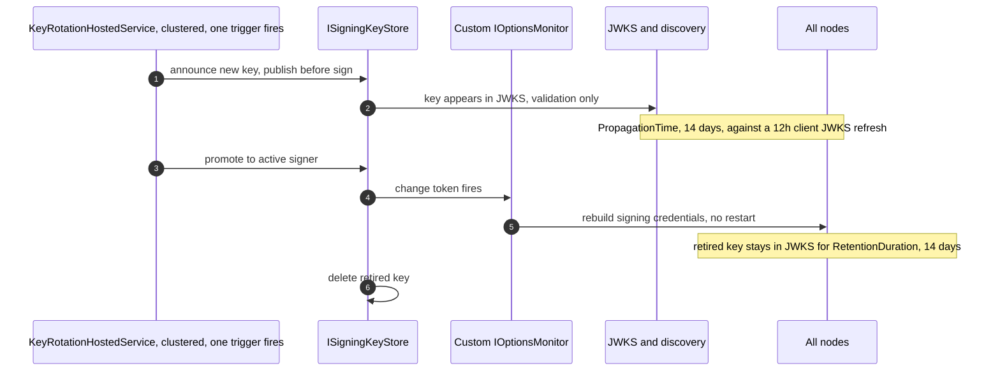

**Invariants.** Defaults are **90/14/14**: `RotationInterval` 90 days,
`PropagationTime` 14 days, `RetentionDuration` 14 days. Propagation exists because
clients cache JWKS (12-hour default refresh, 5-minute floor, out-of-band refresh on an
unknown `kid`), so 14 days is a large safety margin rather than a tight fit. A key is
**published before it signs**, and a retired key **stays in the JWKS** for its
retention window, so in-flight tokens never fail validation. Rotation runs **in-process on
every replica**, and clustering is what makes that safe: every replica has a scheduler and
**exactly one replica's trigger fires**, which is not the same as there being one runner
process. Rotation additionally takes a database advisory lock as an **independent** barrier,
because two simultaneously active signing keys is a corruption rather than a hiccup and that
guarantee must not rest on the scheduler's correctness alone (ADR-0031).

Publish-before-sign has **one deliberate exception, key #1**. At genesis there is no
active key and nothing cached to protect, so the propagation window is vacuous and the
first key activates immediately; announce-before-sign applies from key #2 onward. Stating
the rule without the exception would make the cold-start path look like a violation of it
(ADR-0012).

Promotion is also not instantaneous at the `NotBefore` second. It takes effect on the next
options re-resolve through the custom monitor, which is why the rotation runner **trips a
refresh** around the window rather than relying on wall-clock arrival.

Readiness gates cold start on three conditions, all of them, and fails closed until they
hold: at least one active signing key, at least one encryption key, and a successful
data-protection unprotect. The third is an **assertion, not a smoke test**: the probe
asserts the active `kid` **matches the expected persisted `kid`**, because a bare
protect-and-unprotect round trip would pass on a freshly regenerated key and mask the loss.
That matters because if the Data Protection keyring is lost while the key store survives,
the framework **silently regenerates** a new key on keyring load and skips the
undecryptable one instead of throwing, so every previously issued token and cookie breaks
with no error anywhere (ADR-0012).

Two traps are load-bearing. **Every rotation signing key must be an `X509SecurityKey`**,
because OpenIddict's comparator demotes not-yet-valid keys and prefers the furthest
`NotAfter` only for X509 keys: two bare `RsaSecurityKey` instances compare equal, so
`.First()` could pick the wrong signer. And **in-process self-validation is frozen by
default**: `UseLocalServer` snapshots signing keys into an immutable
`StaticConfigurationManager` at startup and `RequestRefresh()` is a no-op on it, so a
token signed with a freshly promoted key fails self-validation with `ID2090` until
restart. Spike A-2 (verification record V19, 2026-07-07) observed both the server and
validation change-tokens firing while the static manager stayed put; the proven fix
(test T3c) is a custom non-static `IConfigurationManager<OpenIddictConfiguration>`
reading the live key store, and test T3d confirmed old and new tokens both validate
during the overlap. The seam itself is maintainer-endorsed but **not in the official
documentation** (issue #1434), which is why a contract-regression test (9.K6) gates
every OpenIddict bump (ADR-0021).

Break-glass compromise is the same machinery run fast: mark the key revoked, push it to
the distrusted-kid set, and evict JWKS caches so the compromised key is out of rotation
in under five minutes (ADR-0007, and flow 4 path **e** for the enforcement side).

## 4. Cross-node revocation, per path

Revocation freshness is **per path**, not one global number, and the paths differ by an
order of magnitude. Drawing them as one flow would hide exactly what ADR-0039 decides.

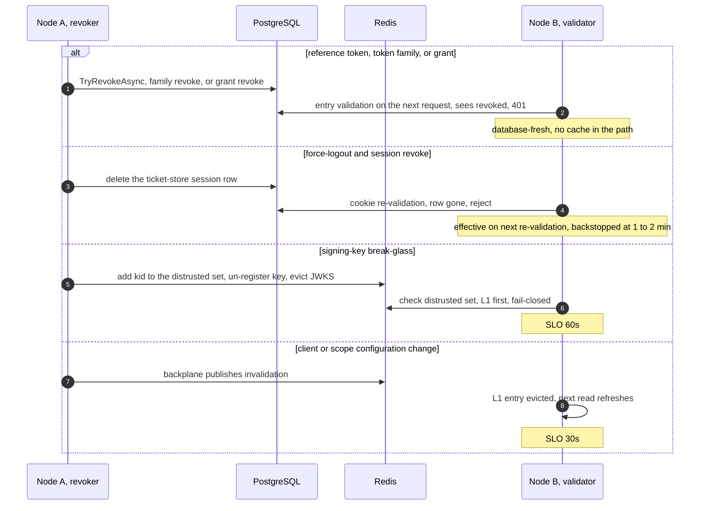

**Invariants.** A self-contained JWT is valid **until expiry** (15 minutes): a client
that needs instant access revocation must be issued a **reference token**, which is a
built per-client property (`AccessTokenType`) and not the native global
`UseReferenceAccessTokens` flag, and that choice forces the client's resource server
onto introspection. **Force-logout is near-immediate, not instant.** It takes effect on the
next request on any node because cookie validation reads the store, backstopped by a
1-to-2-minute validation interval, giving a kill-propagation bound under two minutes;
treating it as immediate would overstate the guarantee by up to that interval at exactly
the moment an operator is relying on it. Revocation there is a **row delete, and there is
no `revoked` flag**, so "still present" is the only meaning of "still valid" and no second
state can drift out of agreement with the first. The distrusted-kid check is
**fail-closed** (an unreachable Redis means treat the `kid` as distrusted) and is served
from an L1 cache so the happy path takes no per-request Redis hit. The 60-second bound also
depends on a **pinned dependency floor**: the resource server's automatic-refresh interval
has a framework-enforced 5-minute minimum, so the identity-model protocols package is
pinned rather than floated, otherwise that floor and its defaults could drift silently
across an upgrade and change the bound with no code change (ADR-0021). The configuration cache needs a
cross-node backplane because the plain hybrid cache has **no** built-in cross-node L1
invalidation (dotnet/runtime #125602), so without one a change on one node would not
reach the others inside the 30-second bound.

One further invariant comes from ADR-0074 and is not visible in the diagram: **an empty
distrusted-key set is never evidence that nothing is revoked.** The set is rebuilt from
`SigningKeys.RevokedAt` on startup and on a miss. ADR-0039 covers Redis being
*unreachable*; this covers Redis being reachable and having *forgotten*, which
otherwise silently re-trusts a key that break-glass had ejected.

## 5. DPoP issuance and resource validation

Sender-constrained tokens for public SPA and mobile clients (ADR-0014).

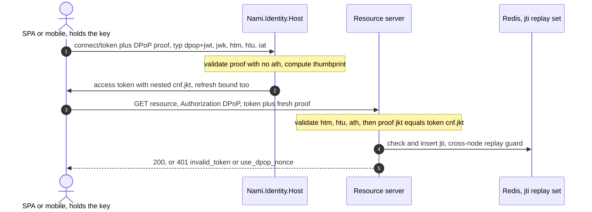

**Invariants.** DPoP is a **build**, not a configuration: OpenIddict 7.5 has neither
issuance nor validation. The confirmation is a **nested** `cnf.jkt` (spike A-1), and
introspection responses must surface `cnf.jkt` for DPoP-bound tokens or a resource
server using introspection cannot enforce proof-of-possession at all (V14-3,
ADR-0048). The proof
presented at the token endpoint carries **no `ath`**; the proof presented at the
resource does. The refresh token is bound as well as the access token. A DPoP-bound
token presented as a bare **Bearer** must be rejected (spike A-3), otherwise the binding
is advisory. The `jti` replay set is Redis-only, non-persistent, and fail-closed, and it
is **authoritative with no durable source to read through to**, which is why losing it
is a bounded replay window rather than a cache miss (ADR-0074 parameter E). DPoP
composes **after** per-tenant validation, never instead of it: a shared Pool signature is
not a tenant boundary (ADR-0033, ADR-0049), and this flow was proven to compose with
per-tenant validation by spike A-7 / T4.

## 6. BFF token custody for a first-party SPA

The token never reaches the browser, which is the real XSS mitigation (ADR-0029).

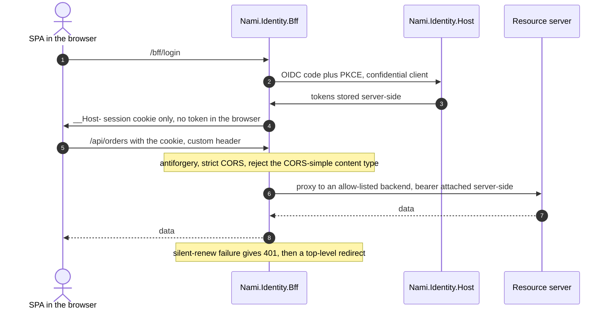

**Invariants.** The access and refresh tokens stay server-side; the browser holds only
a `__Host-` HttpOnly, Secure, SameSite cookie. A non-extractable key does not stop XSS,
so the BFF is the mitigation rather than an ergonomic wrapper. Anti-forgery is
**mandatory on every state-changing call**, in two profiles: a server-rendered admin
form uses an antiforgery token, and a JS or SPA proxy needs a custom header **plus**
strict CORS **plus** rejection of the CORS-simple content type, because a custom header
alone is bypassable by a simple-content-type cross-site form POST. The proxy forwards
only to an **allow-listed** backend and attaches the bearer itself. One package serves
two consumers, the admin app and consumer SPAs, so there is no second implementation to
drift (ADR-0020, ADR-0029). Immediate single logout reaches BFF-fronted and
back-channel-registered relying parties only; a non-BFF SPA is bounded at the
access-token TTL, which is a stated parity boundary (flow 14).

## 7. Tenant provisioning saga

Onboarding a tenant as a single orchestrated, resumable saga (ADR-0017).

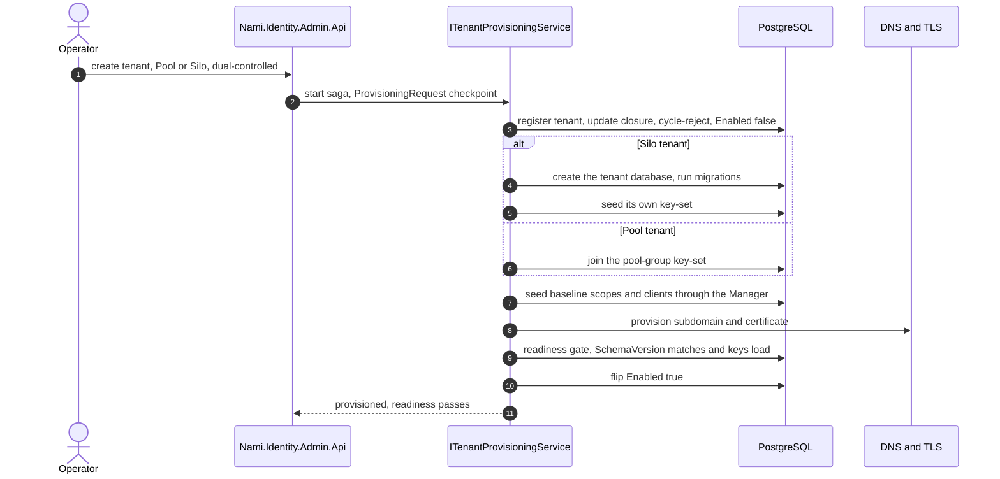

**Invariants.** The saga is idempotent and resumable against a `ProvisioningRequest`
checkpoint, and `Enabled=true` flips **only after** the readiness gate
(`SchemaVersion == AppExpectedVersion` and keys load). A partial failure leaves
`Enabled=false` for retry and **never half-live**, which is the property that makes the
saga safe to re-run. Scopes and clients are seeded through the Manager, never raw SQL,
so OpenIddict's own invariants apply. A Silo tenant gets its own key-set while a Pool
tenant joins the group (ADR-0012, ADR-0033). The tenant `Identifier` is **immutable
after provisioning** because it drives the per-tenant issuer, so a rename is
provision-new plus migrate plus deprovision, and the Admin API rejects the change rather
than mutating it. Suspension (`Enabled=false` on a live tenant) is a distinct,
non-destructive state from deprovision: discovery returns 503 with `Retry-After` rather
than 404, so relying parties do not purge metadata. The Pool-versus-Silo classification
criteria at onboarding, including residency, remain a Security and DPO ratification item
(ADR-0017, ADR-0054).

## 8. Transactional email outbox

Confirm and reset mail that is neither lost nor sent before commit (ADR-0038).

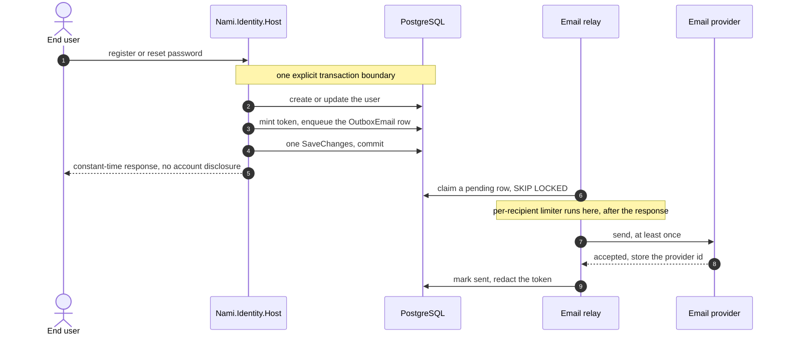

**Invariants.** The outbox row is enqueued in the **same transaction** as the user
mutation, which is why the flow controls the transaction boundary explicitly and must
**not** rely on Identity's `IEmailSender<TUser>` callback: `UserManager` calls
`SaveChangesAsync` internally and the framework invokes the sender only after the method
returns, which would place the outbox row in a later transaction and reintroduce the
lost-after-commit failure this design exists to remove. Because same-transaction enqueue
only works inside the context that owns the row, `OutboxEmail` has a home in **both**
`IdentityDbContext` and `ControlPlaneDbContext`, and one relay polls both. Delivery is
at-least-once with an idempotency-key unique index plus a claim step, so two relays never
double-send. The per-recipient anti-abuse limiter runs **inside the relay, after the
constant-time response has already been returned**, never synchronously before enqueue,
so it cannot become a timing oracle that discloses whether an account exists. The
break-glass alert uses a priority lane so it cannot queue behind a confirmation backlog.
Dead-letter emits a security event on the ADR-0008 lane and pages. Tokens, links, and bodies are never logged
and are redacted from the row once sent.

## 9. Delegated cross-tenant admin action

An administrator acting on a child tenant under a delegated grant (ADR-0010).

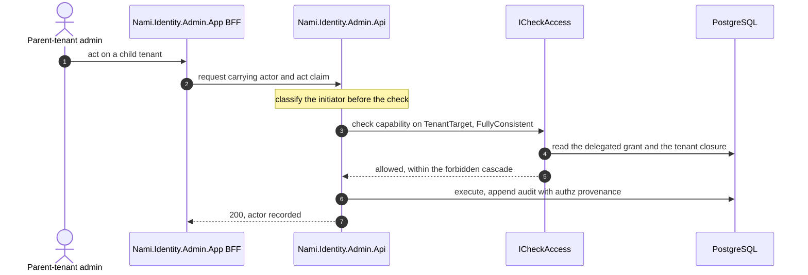

**Invariants.** Authority is a **server-side, deny-by-default grant check on the real
initiator**, never a service identity (CWE-441). The `act` claim is an identity and
audit carrier, **not authority**. Forbidden-cascade is carried by the `IsInheritable`
flag, and inheritance narrows **in effect, not by a DENY rule**: the v1 grant model is
purely **additive**, with no scoped deny row and no parent ceiling, so nothing in v1 may
be designed as if a ceiling were enforced. Issuing or revoking a delegated-admin grant
is itself gated: `re_delegate` must be held **directly** on the root tenant, plus
dual-control, which closes chain re-delegation escalation. The decision is
`FullyConsistent` and is carried by the `ICheckAccess` port (ADR-0047) in a **scoped**
handler, so the framework's per-policy-name cache never caches an access decision. `TenantTarget` comes from the route or body and
must be passed explicitly, never taken from the ambient caller tenant. The
delegated-admin capability check runs **live at the Admin API** and is never baked into
a token, because grants are revocable and subtree-scoped and a baked claim would be
stale and un-revocable.

## 10. GDPR erasure saga

Right-to-erasure reconciled with the tamper-evident audit chain (ADR-0016 over the
ADR-0008 chain, reusing the ADR-0053 data-subject-rights mechanisms).

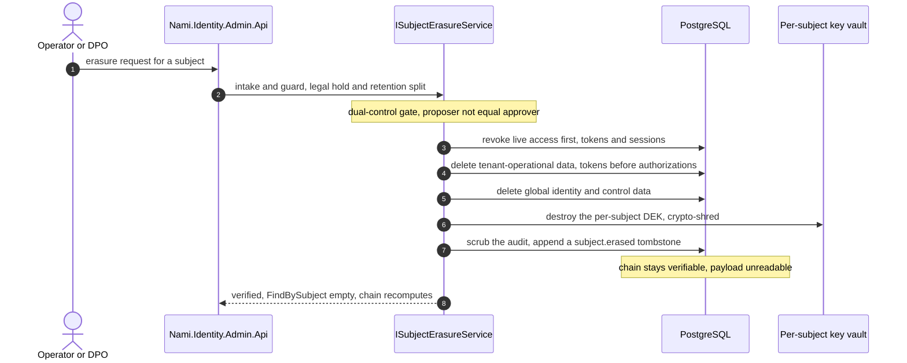

**Invariants.** The **order is legally load-bearing**, not stylistic: live access is
revoked first, then operational data in a foreign-key-safe order (tokens before
authorizations), then global identity and control data, then the crypto-shred, then the
audit scrub and tombstone, then verification. The record hash covers the **ciphertext**,
so destroying the per-subject data-encryption key erases the payload **without changing
the hash**, which is what keeps the chain verifiable. That key vault is keyed by
`SubjectRef`, holds the DEK wrapped by the master key, and lives in a keystore
**separate from the audit store**, so it is absent from audit backups and from any SIEM
copy; co-locating it would make the shred cosmetic. The saga is idempotent and
resumable, and verification is an explicit final step (`FindBySubject` returns empty and
a chain recompute still validates), not an assumption. The mechanism is
jurisdiction-agnostic; the deletion right and retention basis are per-jurisdiction
policy ratified by DPO and Legal, and this flow asserts no compliance verdict.

## 11. Refresh-token rotation with reuse detection

Rolling refresh, theft response, and the absolute ceiling that bounds the chain.

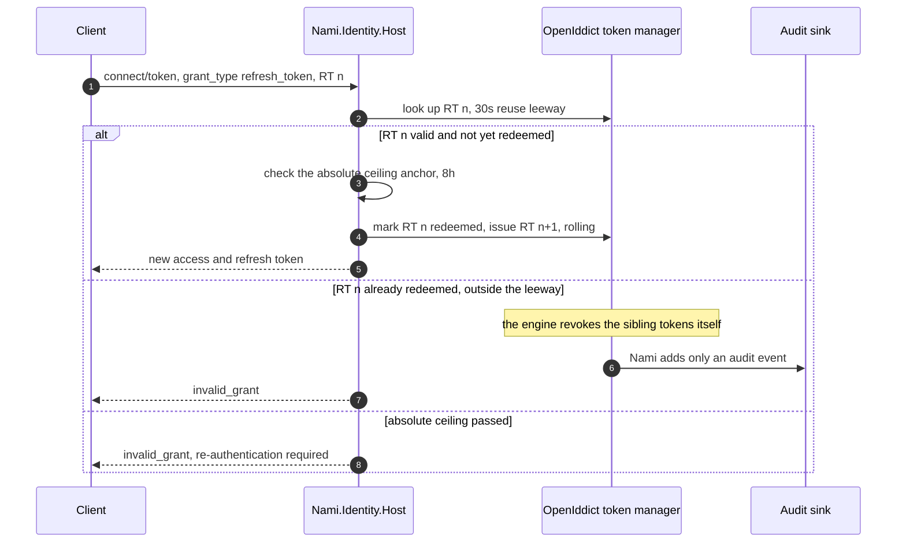

**Invariants.** Rolling refresh, one-time use, reuse detection, and chain revocation are
**default-on in the engine**, so the risk here is accidentally disabling a default, not
missing functionality: `DisableRollingRefreshTokens()`, `DisableAuthorizationStorage()`,
and `DisableTokenStorage()` are never called, and a startup invariant check guards that.
On reuse detection the **engine itself** revokes the **sibling tokens** of the
authorization inside its own validation path, and Nami's only addition is an audit
emission; calling the revoke again ourselves would double-revoke. The engine
deliberately does **not** revoke the `Authorization` object, so a legitimate client can
start a fresh flow, and a test must not assert otherwise. The reuse leeway is **30
seconds**, corrected upward from an earlier 15 seconds on 2026-07-01 because 15 seconds
sits *below* typical network timeouts: a client would time out, retry outside the leeway,
trigger family-revoke, and log the user out spuriously. Rolling gives a sliding lifetime
only, so a hard **8-hour absolute ceiling** is stamped as an anchor on
`Authorization.Properties` and enforced in the token-request handler, matching the
ADR-0003 absolute session limit. Access-token TTL is 15 minutes, which is also the
residual window for a disabled user's already-issued JWT. Machine-to-machine clients are
issued no refresh token. The prune job's `MinimumTokenLifespan` must exceed the longest
refresh lifetime or entries still needed for reuse detection are pruned early, and
because the job runs outside a request it **iterates per tenant** and sets the tenant
context manually.

## 12. Consent persistence and silent reuse

Consent stored as an engine authorization, not a hand-rolled table.

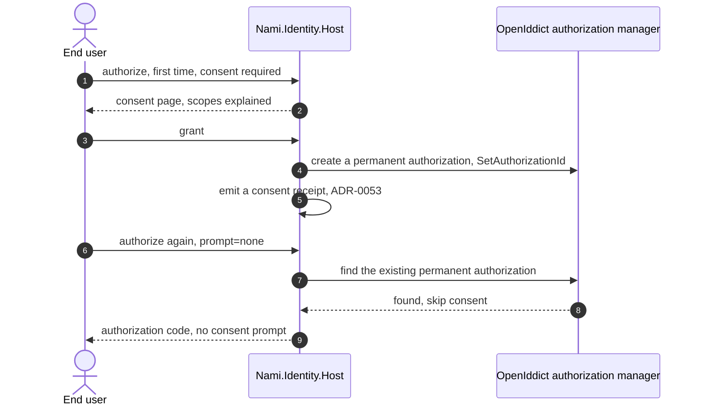

**Invariants.** Consent is a **permanent OpenIddict authorization** created via
`SetAuthorizationId`, not a bespoke consent table, so revoking the authorization is what
forces re-consent. The lookup filters on **scopes**, and that filter **is** the re-consent
mechanism: a request whose scopes widen finds no matching authorization and therefore
prompts, with no separate scope-comparison logic to keep correct. `SetAuthorizationId` is
load-bearing for a second reason beyond storage, since it is what couples this
authorization to family-revoke (flow 11) and to entry validation (flow 4). **Consent lifetime is deliberately unbounded, and that is a recorded
decision rather than an unexamined default** (ADR-0004): a granted consent persists until
the user revokes it on the grants page, and per-client consent expiry is revisited only
if a security or data-protection policy later requires periodic re-consent, at which
point the mechanism is an expiry stamped on `Authorization.Properties` plus a prune. This
is the same property that makes flow 11's theft response coherent: family-revoke removes
sibling tokens and deliberately leaves the `Authorization`, so a token theft does not
silently discard the user's consent. `prompt=none` reuses the authorization silently, and
the tenant-switch variant is a **top-level redirect** rather than an iframe, because the
iframe form is dead under third-party-cookie blocking (ADR-0019).

## 13. Per-request tenant resolution and isolation

The two-layer isolation that every other flow runs inside.

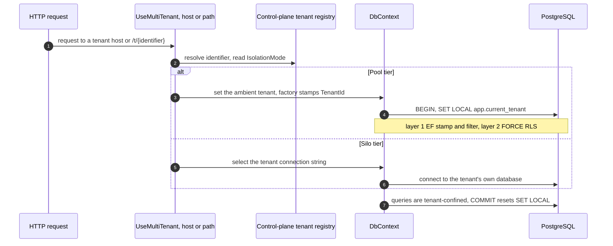

**Invariants.** Two EF filter mechanisms coexist here and are not the same thing: the
**tenant** discriminator is a mandatory global query filter, while soft-delete is a
separate **named** filter registered per entity, and the two are ANDed. Conflating them
matters, because an admin viewing disabled rows ignores the soft-delete filter and must
not thereby ignore the tenant one. The tenant is resolved from **host or path, never from
a token claim**,
and `UseMultiTenant()` runs **before** authentication and authorization so the OpenIddict
middleware and the DbContext both see the same tenant. Pool isolation is **two layers**:
the EF stamp and global query filter, and a `FORCE` row-level-security policy under a
**de-privileged, non-`BYPASSRLS`** role (ADR-0037). That role is not a detail: a
privileged connection silently disables layer 2, leaving a forgotten filter as a
cross-tenant leak with no backstop. `SET LOCAL` / `set_config(..., true)` inside a
per-request transaction is pooling-safe; the session-scoped form is forbidden because it
would outlive the request on a pooled connection (ADR-0018). **No ambient tenant fails closed** (throw or zero rows),
never an unfiltered read, proven by spike A-4 (verification record V25, 17 of 17 against
real PostgreSQL) with tests T13 and T14 covering exactly that. Identity and
control-plane data are **global and deliberately not filtered**. Two consequences bite in
practice: compiled models do not support global query filters, so `dbcontext optimize` is
not used on the tenant context; and without the `(TenantId, ClientId)` composite index a
second tenant reusing a `client_id` fails with `23505`.

## 14. Back-channel single logout fan-out

Real logout-everywhere for browser relying parties, durable through third-party-cookie
deprecation (ADR-0019).

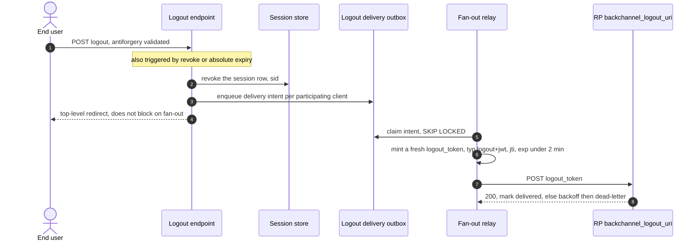

**Invariants.** The outbox stores **delivery intent** (`sid`, `sub`, `client_id`,
`backchannel_logout_uri`) and the relay mints a **fresh** `logout_token` on each send.
That ordering matters: a minted token queued at enqueue time would be a bearer credential
sitting at rest, and it would already be near expiry by the time a retry ran. The trigger
is **session end by any cause**, active logout, revoke, or absolute expiry, not only an
end-session call. Interactive logout **never blocks** on the fan-out. The token carries
`typ=logout+jwt`, the `backchannel-logout` events member, `iat`, a `jti` replay guard, no
`nonce`, and an `exp` under about two minutes; the spec permits `sub` and/or `sid`, and
Nami uses **`sid`**, so a logout ends exactly the one session that ended rather than every
session of that subject. It is **signed and not encrypted** (ADR-0005), because a relying
party must be able to validate it with the published JWKS alone. The
`backchannel_logout_uri` is validated against SSRF. Retry is bounded (about five attempts
over about ten minutes) and then dead-letters, and the retry classification is not uniform:
a **4xx is non-retryable** and dead-letters immediately, since a relying party rejecting
the token will reject it identically on every attempt, while transient errors retry. On
exhaustion the flow emits a security event and **falls back to bounded logout**, so that
relying party is bounded at the access-token TTL rather than silently left signed in. `sid` is in `claims_supported`, and
`backchannel_logout_supported` and `backchannel_logout_session_supported` are advertised
so relying parties can correlate. Front-channel logout and `check_session_iframe` are
**dropped as dead** under third-party-cookie blocking (verification V11), with end-session
and tenant-switch both top-level redirects. A legacy front-channel-only relying party
falls back to bounded logout at the access-token TTL, which is a **stated parity
boundary, not a defect**. "Log out everywhere" maps to the built `RevokeBySubjectAsync`
plus session revocation, never the single-token revocation endpoint. This is a build
interim carrying a decommission marker for OpenIddict 8.0's native implementation
(ADR-0021, issue #2175).

## 15. Token-exchange delegation, RFC 8693

Delegation where the authority decision, not the wire grant, is the hard part.

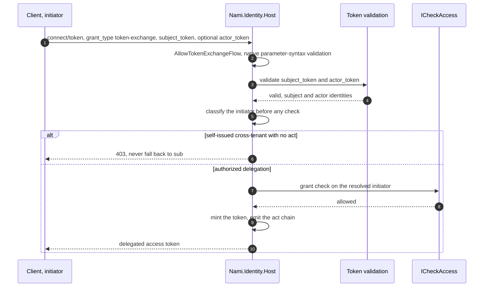

**Invariants.** `AllowTokenExchangeFlow()` gives the **native wire grant and parameter
syntax only** (`subject_token` required, `actor_token` paired, token types in the allowed
set); the authority logic, `act` emission, subject-versus-actor resolution,
delegation-versus-impersonation, the confused-deputy rejection, and the Entra
on-behalf-of exemption are **Nami's own code**, because the engine's exchange handler has
no `act` logic. **`may_act` is deliberately not issued**: RFC 8693 puts `act` in section
4.1 as the carrier expressing that delegation occurred and identifying the acting party,
and defines `may_act` in section 4.4 in permissive terms, with **no RFC 2119 requirement
keyword in the section at all**, so nothing in the specification requires an authorization
server to issue or consult it. The specification does not say other means are permitted
either, so the choice rests on Nami's own model rather than on spec permission: a live,
time-bound, revocable server-side grant. `may_act` is therefore neither emitted, stored,
nor validated, because baking delegation authority into a token is precisely the stale,
un-revocable authority this model rejects (ADR-0014). The emitted chain is `act` alone, nested to carry the chain from the current
actor to the prior one. Initiator classification runs **first**, so a delegation token whose `sub` is the
*target* is never mistaken for the actor: same-tenant non-delegation takes `sub`;
Entra on-behalf-of (RFC 7523, which never carries `act`) resolves the initiator from
`oid` or `sub` and **runs the grant check rather than returning 403**; self-issued
cross-tenant takes the **innermost `act.sub`**, and a missing `act` there is anomalous
and rejected with 403, never fallen back to `sub`. Every exchange runs inside the
resolved tenant scope, and `subject_token` lookups are tenant-bound, so cross-tenant
exchange is rejected. This is a build-interim seam with a decommission marker (ADR-0021).

## 16. Identity change-event publishing, v2 outbox

Outward-only change events for backend consumers that are not OIDC relying parties.
Designed and **kill-switched off in v1** (ADR-0071).

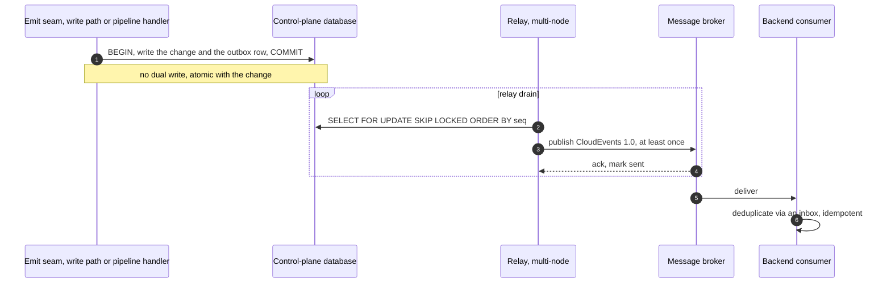

**Invariants.** The outbox row is written in the **same local transaction** as the state
change, so a message is published if and only if the transaction commits and there is no
dual-write window. Ordering is by an explicit **`seq bigint GENERATED ALWAYS AS
IDENTITY`** column, **not** the UUIDv7 primary key, because `Guid.CreateVersion7()` is
not monotonic *within* a millisecond (ADR-0036); both columns are needed and neither
substitutes for the other, since the UUIDv7 id doubles as the CloudEvents id and
idempotency key. Multi-node drains use PostgreSQL's `FOR UPDATE SKIP LOCKED`
(ADR-0037). Delivery is
**at-least-once**, so **consumer-side inbox deduplication is mandatory regardless of
broker**: one candidate broker has native duplicate detection keyed on message id and
another has none, so relying on the broker would make the consumer contract change when
the broker does. Topology is a **single stream plus `TenantId` plus a
row-level-security-guarded outbox**, deliberately with no per-tenant topic. That policy
compares a **uuid** tenant column and must therefore use
`NULLIF(current_setting(...), '')::uuid`, because a **pooled** connection returns an
empty string rather than NULL once the transaction ends and casting an empty string to
`uuid` **throws** instead of failing closed. The trap is scoped by **column type, not by
release**: it does not reach the OpenIddict tenant tables, whose discriminator is `text`
and therefore fails closed on an unset variable, but it reaches every guarded
`uuid`-tenant table, and **v1 already has four** (`LogoutDeliveryOutbox`, `OutboxEmail`,
`SuppressionEntry`, `ProcessingRestriction`), so this outbox follows an existing rule
rather than introducing one. Nami is a **producer only** and takes no inbound dependency on any
consumer. The kill
switch is simply not calling the registration extension, so nothing is added to the hot
issuance path in v1. Proven by spike A-9 (2026-07-21, 10 of 10), which changed the design
rather than confirming it: the row-level-security cast, the `seq` column, and the
broker-deduplication asymmetry were all spike findings.

## 17. Flows deliberately not drawn at this altitude

These carry real build detail but are single-host request-response variants whose
sequence adds little above the component view. They are listed so the omission is
**explicit, not accidental**, and each names where it is drawn instead.

| Flow | Why not here | Where it lives |
|---|---|---|
| End-user step-up authentication | `max_age` / `prompt` / `acr_values` to an MFA challenge, then updated `acr` / `amr`. Its architectural content is the assurance model, not the sequence | ADR-0013 for the model, [05-authorization](../design/07-authorization.md) for the gate, [08-login-consent-ui](../design/11-login-consent-ui.md) for the sequence. Flow 2 shows the admin-side challenge |
| Device authorization | Server-enforced `interval` and `slow_down` polling backoff with a 429 ceiling. Native grant, no distributed interaction | [11-advanced-flows](../design/14-advanced-flows.md), ADR-0014 |
| Pushed authorization request | Native, enabled per client. The architectural content is the `request_uri` lifetime (shortened to 5 to 600 seconds) and the per-client anti-flood cap | [11-advanced-flows](../design/14-advanced-flows.md), ADR-0014 |
| mTLS sender constraint | The native counterpart to flow 5. Its risk is the certificate-forwarding order and the trusted-proxy allow-list, which is edge posture rather than a sequence | [04-core-protocol](../design/04-core-protocol.md), ADR-0014, ADR-0073 |
| Silo migration fan-out | Ordered ring rollout with a per-tenant 503 traffic gate. An operational rollout, drawn where the schema lives | [02-data](../design/02-data.md), [13-tenant-lifecycle](../design/18-tenant-lifecycle.md), ADR-0017 |
| Tenant deprovision and re-home | The ordered inverse of flow 7, plus key escrow-then-destroy and old-scope invisibility checks | ADR-0017, [13-tenant-lifecycle](../design/18-tenant-lifecycle.md) |

## Sources

* Flow 1: ADR-0001 (tenant resolution before authentication), ADR-0005 (plain signed
  `at+jwt` and the mandatory minimal claim set), ADR-0073 (the edge hop and forwarded
  headers), and [04-core-protocol](../design/04-core-protocol.md) for the `S256`-only
  discovery override.
* Flow 2: ADR-0020 (dual control enforced server-side, app-only tokens rejected),
  ADR-0013 (the assurance producer), [05-authorization](../design/07-authorization.md)
  (`RequireActor`, the `request_hash` binding, the `max(client, scope, runtime)` rule),
  and [12-admin-api](../design/15-admin-api.md) (the 72-hour proposal expiry and the
  `TargetETag` guard).
* Flow 3: ADR-0011 (the custom options monitor, the 90/14/14 shape, the local-validation
  fix, spike A-2 / V19 / T3c / T3d), ADR-0007 (five-minute break-glass ejection),
  ADR-0021 (the 9.K6 contract-regression gate), ADR-0031 (exactly one clustered runner),
  ADR-0012 (the readiness `kid` assertion and the silent-keyring-regeneration failure it
  guards), and [09-key-management](../design/12-key-management.md) (the default values,
  the 12-hour client JWKS refresh, the `X509SecurityKey` ordering invariant, and the
  `KeyRotationHostedService` name).
* Flow 4: ADR-0039 (the per-path freshness model and each bound), ADR-0003 (the
  validation-interval backstop), ADR-0074 (the distrusted-key rebuild invariant), ADR-0021
  (the pinned dependency floor under the refresh interval), and
  [10-revocation-caching](../design/13-revocation-caching.md) (the per-path sequence this
  view adopts).
* Flow 5: ADR-0014 (DPoP as a build, spikes A-1 and A-3), ADR-0048 (introspection
  surfacing `cnf.jkt`, V14-3), ADR-0049 and ADR-0033 (per-tenant validation first),
  ADR-0074 (the replay set as authoritative with no durable source), and
  [11-advanced-flows](../design/14-advanced-flows.md) (the `ath` asymmetry and refresh
  binding).
* Flow 6: ADR-0029 (the composed BFF, the two anti-forgery profiles, the allow-listed
  proxy), ADR-0020 (the admin app as the second consumer), ADR-0003 (the session cookie
  and store).
* Flow 7: ADR-0017 (the saga, the readiness gate, identifier immutability, suspension
  versus deprovision), ADR-0012 and ADR-0033 (key-set establishment per tier), ADR-0054
  (residency), ADR-0010 (the dual-control class).
* Flow 8: ADR-0038 (the explicit transaction boundary, the dual context homes, the
  claim-and-idempotency shape, the limiter placement, the priority lane, redaction),
  ADR-0008 (the dead-letter security event).
* Flow 9: ADR-0010 (initiator-based authority, `IsInheritable`, the additive v1 grant
  model, the `re_delegate` gate), ADR-0047 (the `ICheckAccess` consistency-carrying
  port), [05-authorization](../design/07-authorization.md) (the scoped handler, the
  `TenantTarget` source, the live-check rule).
* Flow 10: ADR-0016 (the ordered saga, chain-over-commitments, the separate key vault,
  the verification step), ADR-0008 (the chain), ADR-0053 and ADR-0054 (the wider
  data-subject-rights suite and residency).
* Flow 11: ADR-0004 (defaults not to disable, the engine's sibling revoke, the 30-second
  leeway and its 2026-07-01 correction, the 8-hour anchor, the per-client refresh policy,
  the prune reconciliation), ADR-0003 (the matching absolute session limit).
* Flow 12: ADR-0004 (`SetAuthorizationId`, the deliberately unbounded consent lifetime),
  ADR-0019 (tenant-switch as a top-level redirect), ADR-0053 (the consent receipt),
  [08-login-consent-ui](../design/11-login-consent-ui.md) (the consent page and receipt
  emission).
* Flow 13: ADR-0001 (two-layer isolation, spike A-4 / V25 / T13 / T14), ADR-0037 (the
  `FORCE` policy and the de-privileged role), ADR-0018 (pooling and the `SET LOCAL`
  discipline), [02-data](../design/02-data.md) (the compiled-model and composite-index
  consequences).
* Flow 14: ADR-0019 (the mechanism, the trigger set, the dropped front channel, V11, the
  bounded-logout fallback), ADR-0003 (the participating-clients registry and the
  `logout_token` hygiene notes), ADR-0005 (signed and not encrypted),
  ADR-0021 (the decommission marker),
  [08-login-consent-ui](../design/11-login-consent-ui.md) (intent storage, fresh minting,
  the retry envelope), [04-core-protocol](../design/04-core-protocol.md) (the advertised
  metadata and `sid` in `claims_supported`).
* Flow 15: ADR-0014 (the native grant with Nami-owned `act` resolution), ADR-0010
  (delegation carried by `act`, not impersonation),
  [05-authorization](../design/07-authorization.md) (the three-way initiator
  classification and the `may_act` exclusion),
  [11-advanced-flows](../design/14-advanced-flows.md) (the grant wiring boundary).
* Naming: ADR-0065 (the host and assembly names used as participant labels throughout).
* Flow 16: ADR-0071 (the outbox, the `seq` column, `SKIP LOCKED`, CloudEvents, the
  single-stream topology, the kill switch, spike A-9 and its three findings), ADR-0036
  (the UUIDv7 intra-millisecond caveat), ADR-0037 (`FOR UPDATE SKIP LOCKED`).
* Reconciled against the design corpus's runtime and flow view on 2026-07-25. Six flows
  were **added** from it: refresh rotation, consent persistence, per-request tenant
  resolution, back-channel logout, token exchange, and the v2 outbox. Its per-flow
  invariants paragraph was adopted for **all** sixteen flows, including the ten that
  predate this reconciliation. Its explicit not-drawn section was adopted and extended
  from three entries to six. Five of its claims were **corrected rather than copied**,
  each against the owning decision: consent having "no expiry" is described there as a
  non-ADR decision when ADR-0004 records it; reuse detection is shown there as Nami
  revoking the family when the engine does it and revokes **siblings** while
  deliberately keeping the `Authorization`; the logout outbox is shown there enqueuing a
  minted `logout_token` when the design stores delivery **intent** and mints fresh at
  send; token exchange is shown there emitting `may_act` when
  [05-authorization](../design/07-authorization.md) excludes it deliberately; and its key
  rotation collapses announce and promote into one step, eliding the propagation window
  that makes the overlap safe. One defect on **our** side was found the same way and
  fixed here: flow 4 previously described session revocation as instant, when ADR-0039
  bounds it at the next cookie re-validation with a 1-to-2-minute backstop.

---

[Prev: Component view](08-component-view.md) · [Index](README.md) · Next: [Deployment and infrastructure](10-deployment-infrastructure.md)
