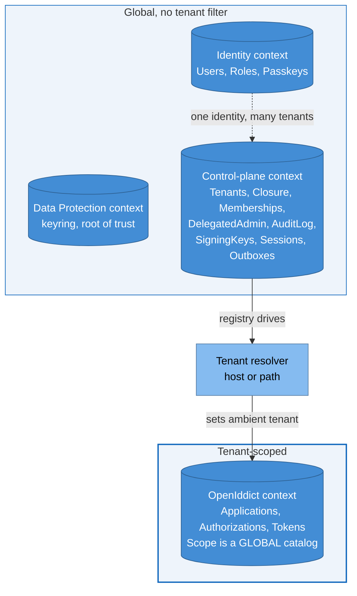
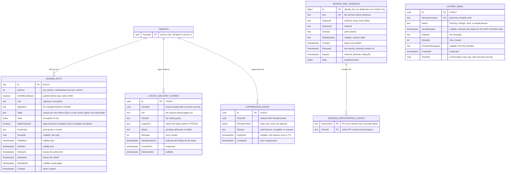
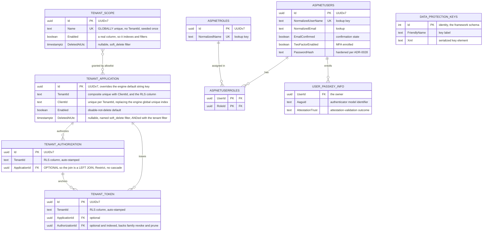
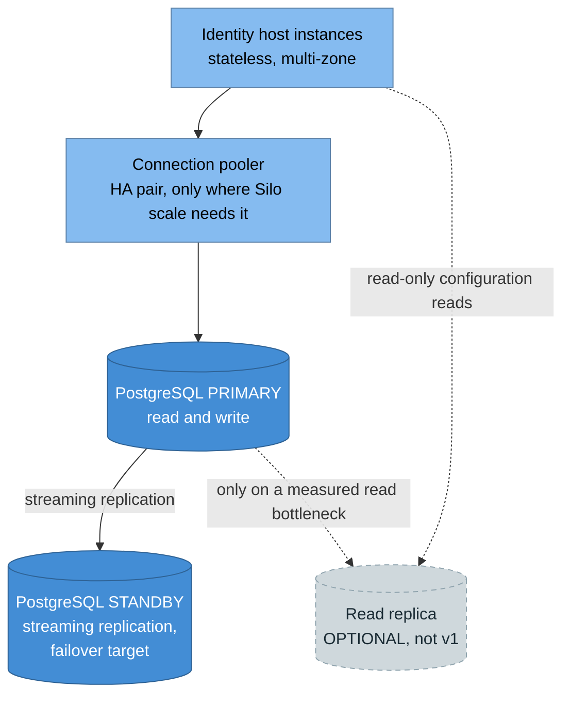

# Data view

> **Part of:** the [Software Architecture Document](README.md), structural views.

The architecture-level data view: where the four context boundaries are drawn and why, the
entity relationships that carry an architectural decision, the multi-tenancy data model, and
the physical database topology.

**Where this stops.** The tables and fields below are the design-fidelity model. The exact DDL
(column defaults, constraint names, the raw-SQL row-level-security and role step, index storage)
lives in the implementation plan, and the
[data-tier detailed design](../design/02-data.md) remains the **schema single source of truth**:
the fields here are taken from it, and if the two ever disagree that design wins and this page is
the bug.

Conventions across every table (ADR-0036, ADR-0037): primary keys are UUIDv7 `uuid` except the
one `bigint` session surrogate and the `text` signing-key `kid`; the optimistic-concurrency token
is the `xmin` system column, surfaced as the admin ETag and as the dual-control
time-of-check guard (ADR-0020); `jsonb` is an extension bag and never the only home for data that must be
queried; timestamps are `timestamptz`; encrypted blobs are `bytea`; enums are stored as `text`.

## 1. The four-context boundary map

The load-bearing data decision is that boundaries follow **tenant scope**, not merely
concern: a user is global, but a tenant's tokens are the tenant's. This topology is fixed and
changing it requires a superseding ADR (ADR-0001).

| Context | Scope | Why the boundary is here |
|---|---|---|
| **OpenIddict** | Tenant-scoped | Applications, authorizations, and tokens belong to one tenant. Pool shares a database and discriminates by `TenantId` plus a query filter plus row-level security; Silo gets its own database. **Scope is the deliberate exception**: a global product catalog shared by every tenant, so it carries no `TenantId` at all (ADR-0001) |
| **Identity** | Global | One human identity signs in to many tenants, so users and roles must not be partitioned by tenant. A user reaches tenants through a membership |
| **Data Protection** | Global | The keyring is a root of trust for authentication, kept independent of Redis so a cache outage never breaks auth (ADR-0006) |
| **Control-plane** | Global | Anchors everything that must not depend on any one tenant: the tenant registry and hierarchy, cross-tenant memberships and delegated admin, the audit chain, signing keys, sessions, and the delivery outboxes |

Each context keeps its **own migrations-history table in a separate schema**, so the four can
share one physical database without colliding, or be split apart later without a rewrite
(recorded in the [data design](../design/02-data.md)). For a Silo tenant the fan-out view is
different: the per-tenant schema version is the fleet-level indicator, while the
per-database history table is the truth (ADR-0017).

## 2. Control-plane: tenancy, authorization, and audit

```mermaid
erDiagram
    TENANTS ||--o{ TENANT_CLOSURE : "closure of"
    TENANTS ||--o{ MEMBERSHIPS : "has members"
    TENANTS ||--o{ DELEGATED_ADMIN : "rooted at"
    DELEGATED_ADMIN ||--o{ DELEGATED_ADMIN_CAPABILITIES : "grants"
    CAPABILITY_CATALOG ||--o{ DELEGATED_ADMIN_CAPABILITIES : "typed by"
    TENANTS ||--|| TENANT_BRANDING : "themed by"
    TENANTS ||--o{ DUAL_CONTROL_PROPOSALS : "dual-control saga"
    TENANTS ||--o{ AUDIT_LOG : "audit trail"
    DUAL_CONTROL_PROPOSALS ||--o{ AUDIT_LOG : "approval recorded"
    SUBJECT_DEK ||--o{ AUDIT_LOG : "decrypts subjects in"

    TENANTS {
        uuid TenantId PK "UUIDv7"
        uuid ParentTenantId FK "nullable, adjacency, source of truth for the tree"
        text Identifier "unique, IMMUTABLE post-provision, drives the per-tenant issuer"
        text Name "display"
        text IsolationMode "Pool or Silo"
        text ConnectionString "nullable, Silo only"
        text KeyScope "pool-group or own"
        boolean Enabled "not-yet-live at provisioning versus suspending a live tenant"
        text SchemaVersion "migration traffic-gate"
        boolean RequireInviteApproval "per-tenant invite-approval gate"
    }
    TENANT_CLOSURE {
        uuid AncestorId PK "FK to Tenants"
        uuid DescendantId PK "FK, reverse index includes Depth"
        int Depth "self-row is depth 0, drives the forbidden cascade"
    }
    MEMBERSHIPS {
        uuid UserId PK "FK into the Identity context"
        uuid TenantId PK "FK to Tenants"
        jsonb Roles_JSON "roles within this tenant, source of truth for belonging"
    }
    DELEGATED_ADMIN {
        uuid GrantId PK "UUIDv7"
        uuid GranteeUserId "partial covering index where RevokedAt is null"
        uuid RootTenantId FK "the subtree the grant covers"
        timestamptz ValidFrom "window start"
        timestamptz ExpiresAt "nullable, time-bound"
        timestamptz RevokedAt "nullable, revocable"
        uuid GrantedByUserId "provenance"
        timestamptz CreatedAt "when granted"
    }
    DELEGATED_ADMIN_CAPABILITIES {
        uuid GrantId PK "FK"
        text Capability PK "FK to the catalog"
    }
    CAPABILITY_CATALOG {
        text Capability PK "lowercase snake_case"
        boolean IsInheritable "false blocks the cascade down the tree"
    }
    TENANT_BRANDING {
        uuid TenantId PK "FK, one row per tenant"
        text LogoUri "nullable, https-only and SSRF-safe"
        jsonb ThemeJson "nullable, design tokens, never raw CSS"
        text DisplayName "nullable"
        uuid UpdatedByMembershipId "who changed it"
        timestamptz UpdatedAtUtc "when"
    }
    DUAL_CONTROL_PROPOSALS {
        uuid ProposalId PK "UUIDv7"
        text ActionType "kebab-case wire contract, routes to a keyed executor"
        text TargetType "what class of thing is targeted"
        uuid TargetId "which one"
        uuid TenantId "nullable, FK"
        jsonb PayloadJson "the proposed change"
        text TargetETag "TOCTOU guard, the xmin-derived ETag, re-checked at execute"
        text Status "state machine"
        uuid ProposedBy "the proposer"
        uuid ApprovedBy "nullable, MUST differ from ProposedBy"
        timestamptz ProposedAt "created"
        timestamptz DecidedAt "nullable"
        timestamptz ExecutedAt "nullable"
        text FailReason "nullable, for example target_changed"
        jsonb FailDetail "nullable, holds expected versus observed ETag"
        uuid PriorProposalId "nullable, links a re-propose after a terminal failure"
        timestamptz ExpiresAt "single-use and expiring, 72h window"
        text CorrelationId "ties the saga together"
    }
    AUDIT_LOG {
        uuid EntryId PK "UUIDv7"
        timestamptz Timestamp "when the event occurred"
        bytea PrevHash "previous link, genesis is 32 zero bytes"
        bytea RecordHash "keyed chain link"
        text Payload_Canonical "the canonical form that is hashed"
        text ActorSub "per-subject ciphertext, crypto-shreddable"
        text OnBehalfOfSubject "per-subject ciphertext"
        text ApproverSub "per-subject ciphertext"
        jsonb ActorChain_JSON "delegation chain, per-subject ciphertext"
        text EventType "classification"
        uuid TargetTenantId "which tenant"
        text Result "outcome"
        text CorrelationId "correlation"
        text Acr "assurance at decision time"
        timestamptz AuthTime "when the user authenticated"
        text DecisionPath "why the authorization decision went this way"
        text AuthzDecision "the decision itself"
        text Capability "which capability was exercised"
        uuid GrantId "nullable, which grant authorized it"
        boolean StepupSatisfied "whether step-up was met"
        uuid ApprovalRequestId "nullable, FK to a proposal"
        bytea RequestHash "binds the audited request"
    }
    SUBJECT_DEK {
        text SubjectRef PK "one data-encryption key per subject, created lazily"
        bytea WrappedDek "per-subject key wrapped by the keyring master key"
        timestamptz CreatedAt "when created"
        timestamptz DestroyedAt "nullable, erasure sets this and every ciphertext copy becomes unreadable"
    }
```

Facts that matter at this altitude:

* **Tenant hierarchy is adjacency plus a derived closure table.** `ParentTenantId` is the
  source of truth; the closure exists so an ancestor or descendant question is one seek on the
  hot authorization path. It is maintained **in application code inside one transaction, not by
  a database trigger**, because tree invariants are domain logic, with cycle rejection on a
  move, serialized tree mutation, and a periodic job that re-derives closure from adjacency to
  verify integrity (ADR-0010, ADR-0024).
* **`Tenants.Identifier` is immutable after provisioning.** It drives the per-tenant issuer, so
  renaming it would invalidate every issued token, every relying-party configuration, and every
  logout registration. A rename is provision-new, migrate, deprovision-old (ADR-0017).
* **The audit chain is keyed**: `RecordHash = HMAC_k(PrevHash || canonical(fields))` with an
  application-held key, prev-first operands, and the record canonicalized to text before
  hashing because `jsonb` does not preserve input byte order. The table is append-only, an
  insert grant only, with update, delete, and truncate revoked plus a block trigger (ADR-0008).
* **Every subject-bearing audit field is per-subject ciphertext**, and `SubjectDek` holds the
  wrapping keys. Erasure destroys a subject's key rather than deleting audit rows, which is what
  lets an immutable chain coexist with a right to erasure: rows survive for chain verification
  while their subject content becomes permanently unreadable, including in backups and in any
  write-once copy (ADR-0016, ADR-0008).
* **The delegated-admin hot lookup uses a partial covering index**, and its
  `WHERE RevokedAt IS NULL` predicate must be a **hard-coded literal, never a bind parameter**:
  the planner only uses a partial index when it can prove at plan time that the query implies
  the index predicate, which it cannot do against a parameter.
* **Two identifier namespaces meet in this diagram and must not be unified.** A capability is
  lowercase `snake_case` (`delete_tenant`); a proposal action type is `kebab-case`
  (`delete-tenant`) because it is a published wire contract. The overlap is deliberate
  (ADR-0065).

## 3. Control-plane: keys, sessions, and delivery outboxes

* **`ServerSideSessions` deliberately has no edge to `Tenants`.** It is global and keyed by
  `sid`, so one login session can span a tenant switch: a design decision, not an omission
  (ADR-0003). Its child table is what back-channel logout reads to know which relying parties
  to notify (ADR-0019), and revocation is a **row delete**, not a status flag.
* **`OutboxEmail` exists in two contexts**, one global in the Identity context for confirm and
  reset mail and one tenant-scoped in the control plane, so an enqueue can always join the
  transaction that triggered it (ADR-0038).
* **`SigningKeys` uses a `text` primary key**, the `kid` itself, rather than a UUIDv7. It is the
  one table whose key is an externally meaningful protocol identifier instead of a surrogate.
* The key store enforces a **mandatory scope predicate centralized in one adapter**, and where a
  single store serves several scopes it additionally carries row-level security on the scope and
  tenant columns, giving the key store the same defense in depth as the token store (ADR-0033).
* One vocabulary caveat worth knowing before reading code: `SigningKeys.KeyScope` uses
  `pool-group` and `tenant`, while `Tenants.KeyScope` uses `pool-group` and `own`. The columns
  are parallel but not identical, and the key-management design reconciles them.

## 4. Operational, identity, and data-protection contexts

The Identity context also holds the remaining standard framework tables (user claims, user
logins, user tokens, role claims) and one copy of the email outbox. **There is no
user-to-tenant edge here**, and that is the point: a user reaches tenants through a membership
in the control plane, which is what keeps identity global (ADR-0001).

`DataProtectionKeys` is the single table of its own context. The keyring it holds **wraps
`SigningKeys.Data`**, which is why disaster recovery must restore the signing keys, the keyring,
and the root certificate **together**, keeping the same application name: restoring signing keys
alone leaves them undecryptable (ADR-0006, ADR-0012).

Three rules in this area are rules rather than preferences:

* **A navigation to a filtered entity must be optional.** The token-to-authorization and
  authorization-to-application navigations are optional, producing a LEFT JOIN. Marking one
  required would produce an INNER JOIN and **silently drop token rows** whenever the principal
  is filtered out or soft-deleted. Proven by a spike test, not reasoned about (ADR-0018).
* **Client-id uniqueness is composite.** The engine's global unique index on the client
  identifier is dropped and replaced with `(TenantId, ClientId)`, so the same client id can
  exist in different Pool tenants, while `TenantScope.Name` stays globally unique because the
  catalog is global (ADR-0001).
* **Soft-delete flags are real columns, not extension-bag JSON**, so they index and filter, and
  the named soft-delete filter coexists with the tenant filter by being ANDed with it.

## 5. The multi-tenancy data model

Isolation is defense in depth, two layers, and both were proven necessary by spike A-4.

```mermaid
graph LR
  req[Request, tenant resolved]:::comp

  subgraph L1[Layer 1, EF change tracker]
    direction TB
    stamp[auto-stamp TenantId on insert]:::comp
    filter[named query filter on read]:::comp
    throw[throw on mismatch or unset]:::comp
  end
  subgraph L2[Layer 2, PostgreSQL backstop]
    direction TB
    force[FORCE ROW LEVEL SECURITY]:::store
    policy[policy reads the request-scoped setting]:::store
    role[de-privileged role, no BYPASSRLS]:::store
  end
  data[(Tenant-confined rows)]:::store

  req --> L1 --> L2 --> data

  classDef comp fill:#85bbf0,stroke:#5d82a8,color:#000000
  classDef store fill:#438dd5,stroke:#2e6295,color:#ffffff
  style L1 fill:#eef4fb,stroke:#1168bd,stroke-width:1px
  style L2 fill:#eef4fb,stroke:#1168bd,stroke-width:1px
```

Layer 1 covers the change-tracker path and **fails closed** on an unset or mismatched
tenant. Layer 2 exists because layer 1 is bypassed by the bulk, raw, and
`ExecuteUpdate`/`ExecuteDelete` paths, including the engine's own pruning; it needs a
de-privileged role because a superuser bypasses row-level security, and the tenant setting is
applied with `SET LOCAL` inside the request transaction so it is pooling-safe. The `NULLIF`
cast rule for `uuid`-typed tenant columns is in
[08-component-view section 2](08-component-view.md).

**Pool versus Silo** is recorded per tenant in the registry. Pool shares one database and
discriminates by `TenantId` plus row-level security, keeping the connection count low, and is
the default. Silo gives a tenant its own database for hard isolation, whether for residency
or regulatory reasons, at the cost of a per-tenant connection pool and a per-tenant migration
fan-out (ADR-0001, ADR-0018, ADR-0054).

## 6. Physical topology

The four contexts are logical. Physically they may share one cluster or be split, and two
placement facts are architectural:

* The **operational store is the hot write path**, one row per token issued, so it wants a
  high-write tier and may be separated from the read-heavy configuration data.
* The **keyring has the strictest recovery-point objective**, because losing it means current
  tokens and cookies cannot be decrypted (ADR-0006).

The topology is fixed by **ADR-0074**, and two things in it are deliberately **not** the same,
because collapsing them would change the consistency contract without anyone deciding to:

* **High availability (in scope).** A primary handling reads and writes, a
  streaming-replication standby, **automatic failover**, and point-in-time recovery through
  write-ahead-log archiving. No failover product is mandated, so a managed offering and a
  self-managed cluster manager both satisfy it. **The standby exists for failover, not for read
  scaling**, and the application talks to the primary. This is an invariant rather than a
  convention, because violating it fails **silently**: a read served from a lagging standby
  returns stale data with no error, so an administrative change would appear not to have taken
  effect.
* **A read/write split onto read replicas (optional, explicitly not v1).** A **scale lever** to
  apply only when a measured read-throughput bottleneck exists, carrying a replication-lag
  caveat on configuration reads that would interact with the 30-second propagation bound of
  ADR-0039. Adopting it is a decision to be made then, not an assumption now.

Where a **connection pooler** is used it sits on the hot path, so ADR-0074 requires it to be
highly available in its own right and its failover to be drilled rather than assumed. ADR-0074
also settles what happens when Redis restarts: durability is an operator option the application
never depends on, the distrusted-key set is rebuilt from the key store rather than trusted when
empty, and the proof-replay set has no durable source, so losing it opens a bounded replay
window. Per-store recovery objectives, backup, and continuous monitoring stay with ADR-0006;
failover behaviour and deployment topology are elaborated in
[10-deployment-infrastructure](10-deployment-infrastructure.md).

## Sources

* ADR-0001 (the fixed four-context topology, tenant scoping, and the global scope catalog
  with its globally unique name), ADR-0037 (PostgreSQL 18, forced row-level security, and
  row-level security as a raw-SQL migration step), ADR-0018 (the change-tracker paths,
  optional navigations, composite client-id uniqueness, pooling, and the ETag), ADR-0017
  (per-context migration history, the immutable tenant identifier, and the migration model).
* ADR-0036 (UUIDv7 keys, the single `bigint` exception, and why strict ordering needs its own
  sequence column), ADR-0020 (the ETag on admin mutations and the dual-control proposal
  record), ADR-0065 (the two identifier namespaces that meet in the control-plane diagram).
* ADR-0010 and ADR-0024 (the closure table, the inheritability flag behind the forbidden
  cascade, and tree invariants as domain logic rather than triggers), ADR-0003 (the session
  store and why it has no tenant edge), ADR-0019 (the client registry back-channel logout
  reads), ADR-0008 (the keyed audit chain), ADR-0038 (the two outbox homes and the hashed
  suppression store).
* ADR-0074 (the physical topology, the standby-is-not-a-replica invariant, the read-replica
  lever's status, the pooler high-availability requirement, and the Redis-durability posture),
  ADR-0006 and ADR-0012 (the keyring as root of trust, its recovery objective, and the joint
  restore with signing keys and the root certificate), ADR-0039 (the propagation bound a read
  replica would interact with), ADR-0054 (residency as a driver for Silo placement).
* ADR-0016 (the crypto-shred vault and the per-subject ciphertext that let an immutable audit
  chain coexist with a right to erasure), ADR-0033 (the key-store scope predicate and its
  row-level security), ADR-0028 (passkey storage and password hardening).
* [`docs/design/02-data.md`](../design/02-data.md) is the authority for column-level detail;
  this view deliberately stops above it.
* Reconciled against the design corpus's data-architecture view on 2026-07-25. The corpus
  supplied a great deal this view lacked: the entity relationships at all, the closure-plus-
  adjacency split, the immutable-identifier consequence, the sessions-not-tenant-linked
  decision, the optional-navigation and composite-uniqueness rules, row-level security as a
  raw-SQL step, and the physical topology with its standby-versus-read-replica distinction.
  Field lists were then rebuilt from **this repository's** data design rather than transcribed
  from the corpus, and that changed several things. The entity names are `TenantApplication`,
  `TenantAuthorization`, `TenantToken`, and `TenantScope`, not the corpus's unprefixed names.
  `SigningKeys.Id` is a `text` `kid`, where the corpus has `uuid`. `Tenants` carries
  `SchemaVersion` and `RequireInviteApproval`, which the corpus omits. `SubjectDek` exists at
  all, which the corpus has no equivalent for, and the audit table's subject-bearing fields are
  per-subject ciphertext, which the corpus does not record. Several load-bearing details are
  ours only: the hard-coded-literal requirement on the partial index predicate, soft-delete
  flags as real columns rather than extension-bag JSON, and the `KeyScope` vocabulary mismatch
  between two tables. The corpus's audit note also writes the chain as
  `H(PrevHash || canonical(fields))` while calling it HMAC-keyed in the same sentence, an
  internal inconsistency; ADR-0008's keyed form is used. This view's own earlier mis-citation of
  the global scope catalog to ADR-0018 and ADR-0037 was corrected to ADR-0001.

---

[Prev: Cross-cutting concepts](11-cross-cutting-concepts.md) · [Index](README.md) · Next: [Security architecture](13-security-architecture.md)
