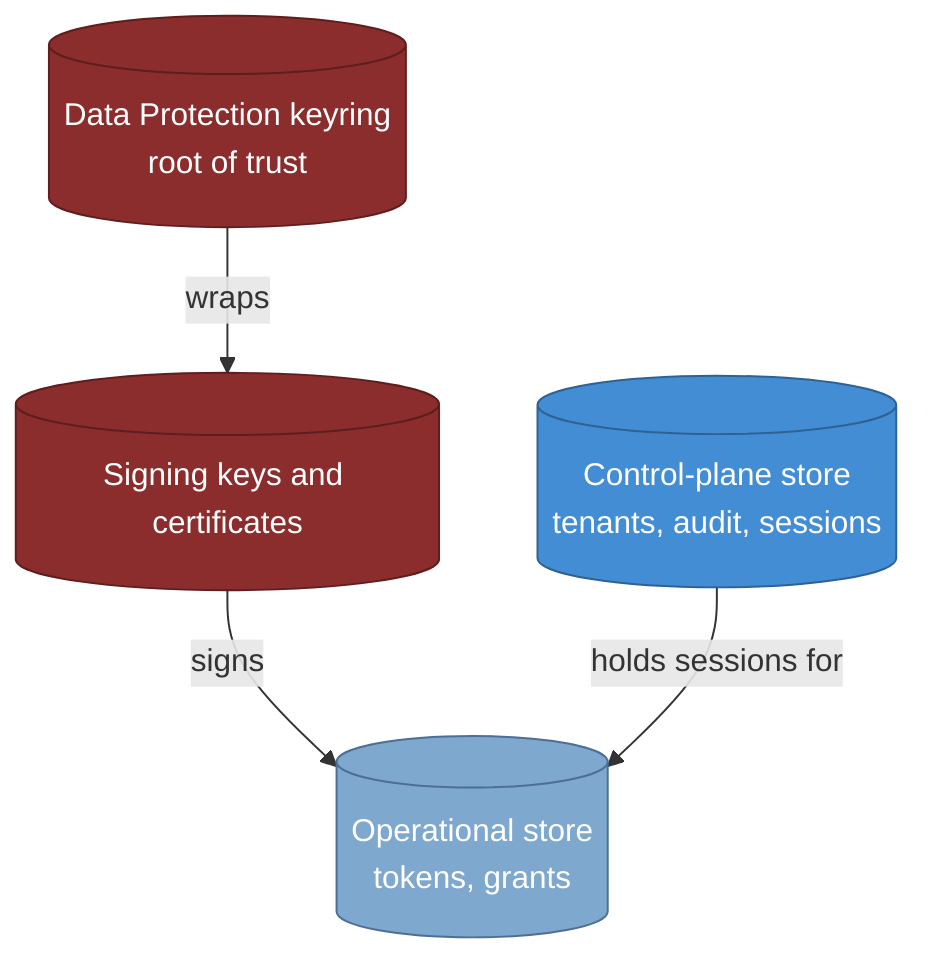

# Reliability, backup, and disaster recovery

> **Part of:** the [Software Architecture Document](README.md), quality and operational
> views.

How the architecture behaves when something breaks, and what it costs to get back. The
topology this operates on is [08-deployment](08-deployment.md); what is watched and alerted
is the observability view; the day-to-day procedures are
[16-operations-and-maintenance](16-operations-and-maintenance.md).

Two framing points shape everything below. Identity is a **hard dependency of every
application that trusts it**, so its availability target is higher than that of the services
it serves (ADR-0041). And recovery objectives are bound **per store**, not once globally,
because the stores fail differently: losing the keyring is not a slower version of losing
the token table, it is a different event.

## 1. High availability

| # | Measure | Detail |
|---|---|---|
| HA1 | Multi-instance, multi-zone | At least two replicas spread across at least two zones, stateless with no sticky session, so losing a zone leaves the service up (ADR-0031, ADR-0072) |
| HA2 | Keys-loaded readiness | `/health/ready` gates on an active signing key, an encryption key, and a data-protection unprotect that compares the active `kid` to the expected **persisted** `kid`. A pod takes traffic only once it can sign correctly. The gate and the comparison are ADR-0031; ADR-0012 owns the silent-regeneration failure that makes a bare round trip insufficient |
| HA3 | Graceful shutdown with a readiness flip | On SIGTERM readiness flips NotReady, a `preStop` sleep lets the load balancer drain, and only then does Kestrel stop accepting. Liveness never probes readiness, or the platform would kill a pod mid-drain (ADR-0031) |
| HA4 | Database high availability | Primary plus streaming-replication standby plus automatic failover plus write-ahead-log archiving, with **no failover product mandated**. The standby is a failover target, not a read replica (ADR-0074) |
| HA5 | Pooler high availability where used | A transaction-mode pooler is conditional on Silo scale, but where deployed it is on the hot path, so at least two instances with failover, and its failover is drilled rather than assumed (ADR-0074 parameter D, ADR-0018) |
| HA6 | No-restart key rotation | Rotation swaps the signing credential in process, so the key lifecycle never costs a rolling restart and never appears as an availability event (ADR-0011) |
| HA7 | Time synchronisation | Every application and database node is NTP-synchronised, with a drift alert at roughly 30 seconds, half the 60-second skew tolerance (ADR-0031) |

## 2. Resiliency under load and under dependency failure

* **Outbound**: exactly one standard resilience handler per client, with timeouts on every
  external call and no retry on non-idempotent methods. The one carve-out is a dependency
  that implements a protocol step as a retry, which must not have the standard handler
  layered on top of it (ADR-0040 rule A1).
* **Inbound**: rate limiting and load shedding are **different controls for different
  situations** and are not interchangeable. Rate limiting answers "this caller is asking too
  often" with 429; load shedding answers "the service is past its capacity" with 503 and a
  `Retry-After` (ADR-0040).
* **Connection-pool saturation surfaces as a bounded acquisition timeout leading to 503,
  not as a hang.** A hang is worse than a rejection here, because it consumes a request slot
  while helping nobody (ADR-0018, ADR-0040).
* **Redis degrades rather than breaks.** Redis is an accelerator, not a root of trust: an
  ordinary cache miss reads through to the store, sessions stay durable in PostgreSQL, and
  the data-protection keyring is independent of Redis, so the signing and authentication
  path keeps working through a Redis outage (ADR-0040).
* **Database connection resiliency** uses the provider's retry-on-failure together with an
  execution strategy around explicit transactions, since a retrying strategy and a manual
  transaction otherwise conflict.

### Fail-open is the rule and there is exactly one carve-out

This is worth stating precisely, because the natural summary of it is wrong. **Ordinary
performance caches fail open. Security checks fail closed. Those are both the rule.** The
single deliberate **carve-out** is the per-recipient email anti-abuse throttle: it is an
abuse control that would ordinarily follow the fail-open cache rule, and instead it degrades
to a per-instance in-process bucket rather than switching off, accepting per-instance
approximation over an unlimited cap (ADR-0040 parameter D).

The distrusted-key set and the DPoP proof-replay set are therefore **not** carve-outs. They
are fail-closed **by the general rule**, being security checks rather than performance
caches (ADR-0039, ADR-0014). Calling them exceptions inverts the distinction and makes the
policy look like a list of special cases instead of a rule with one exception.

One consequence is not visible from the fail-open or fail-closed labels at all: a Redis that
is **reachable but has forgotten** answers "not distrusted" and silently re-trusts a key that
break-glass had ejected. Fail-closed covers unreachable, not amnesiac, so the distrusted-key
set is rebuilt from the key store on startup and on a miss, and an empty set is **never**
evidence that nothing is revoked (ADR-0074 parameter E).

## 3. Recovery objectives, bound per store

| Store | Role | Strictness | What losing it actually means |
|---|---|---|---|
| **Data Protection keyring** | Root of trust; unwraps key material and protects cookies | **Strictest, recovery-point objective near zero** | Every current token and cookie becomes undecryptable. This is not degraded service, it is a global invalidation |
| **Signing keys and certificates** | Sign tokens, publish the JWKS | Near zero, with the rotation overlap already covering in-flight tokens | Issued tokens stop verifying once the key cannot be republished |
| **Control-plane store** | Tenants, audit chain, sessions, delivery outboxes | Short | Sessions are gone, so users sign in again; audit gaps are a compliance event, not a service one |
| **Operational store** | Tokens and grants, the hot write path | Short, minutes | Users re-authenticate. Deliberately the most tolerable of the four |

**The numbers are interim and not ratified.** A recovery-time objective under 15 minutes and
a recovery-point objective under 5 minutes are the working figures, bound per store with the
keyring tightest, and they await Ops and data-protection-owner ratification (ADR-0006,
ADR-0074). They are recorded here as an interim so that a drill has something to measure
against, not as a commitment.

## 4. Backup, and the ordering that makes a restore work

* **Backup** is write-ahead-log archiving and point-in-time recovery for PostgreSQL, with
  the keyring and signing keys backed up to their own durable store.
* **Restore-both is mandatory, and it is the failure mode most likely to be discovered at
  the worst moment.** The keyring **wraps** the signing key material, so a restore must
  bring back the signing keys **and** the keyring **and** the root certificate, under an
  identical application name. Restoring signing keys without the keyring leaves them
  present and undecryptable, which looks like a successful restore right up to the first
  token request (ADR-0012, ADR-0006).
* **Crypto-shred interacts with backup by design, and that is the point.** Per-subject
  data-encryption keys live only in their own vault, never in database backups, never in the
  write-once destination, never in a SIEM copy, all of which hold ciphertext only. Destroying
  a key therefore renders every copy unintelligible **without deleting rows anywhere**, which
  is what lets erasure coexist with an append-only audit chain and with immutable backups
  (ADR-0016, ADR-0008). The residual posture is a data-protection-owner ratification item.

## 5. Disaster recovery needs a drill **and** continuous monitoring

These prove different things and neither substitutes for the other:

> A quarterly drill proves the system is **restorable**. It does not prove that
> **yesterday's backup ran**. A silent backup failure is invisible to a drill that restores
> from a good backup taken weeks ago.

* **The drill** restores each store against its own objective, includes a **restore-both**
  keyring-plus-signing-key exercise, promotes the standby, and where a connection pooler is
  deployed drills its failover too (ADR-0074 Confirmation).
* **Continuous monitoring** covers the gap the drill cannot see, and feeds the same alert
  pipeline as everything else:

| Metric | Alerts when |
|---|---|
| Write-ahead-log archiving lag | Lag exceeds the operational store's recovery-point objective |
| Backup age, per store | Age exceeds the backup interval plus a margin. This is the silent-failure detector |
| Replication lag | Lag exceeds the objective, **or the standby is disconnected**, since a failover would then lose data |

The disconnected-standby condition is called out separately because it is the one where the
dashboard looks healthy: the primary is fine, latency is fine, and the only thing that has
changed is that the safety net is gone (ADR-0074 parameter F).

## 6. Failover behaviour

On primary failure, automatic failover promotes the standby within the operational store's
recovery-time objective and the service resumes with no manual application change. On zone
loss, the multi-zone spread keeps the service serving from the remaining zone.

The invariant that costs the most if dropped: **the standby exists for failover, not for read
scaling.** Reading from a lagging standby returns stale data with **no error**, so an
administrative change would appear not to have taken effect and nothing would report a
fault. Read replicas remain available as a separate, deliberate, non-v1 lever (ADR-0074
parameters B and C). A test asserts the application's connection configuration targets the
primary, so a replica endpoint cannot be introduced for ordinary reads without failing it.

Chaos-failover and mixed-version behaviour are measured rather than assumed: the chaos
scenarios (zone loss, database and pooler failover, a Redis outage exercising fail-open, a
pod killed mid-issuance) and a mixed-version rolling-deploy compatibility test are gates in
the observability and delivery designs, and their pass criterion is SLO impact under fault
(ADR-0041, ADR-0060).

## Sources

* ADR-0074 (the topology, the standby-is-not-a-replica invariant, pooler high availability,
  the per-cache Redis durability table, the distrusted-key rebuild invariant, the monitoring
  additions including the disconnected standby, and the drill contents), ADR-0006 (per-store
  recovery objectives, their unratified status, and the provider-agnostic backup posture).
* ADR-0040 (one outbound handler and its protocol-retry carve-out, rate limiting versus load
  shedding, the fail-open cache rule and its **single** fail-closed carve-out), ADR-0039 and
  ADR-0014 (the two security checks that are fail-closed by the general rule rather than as
  exceptions), ADR-0018 (pool saturation surfacing as a bounded timeout).
* ADR-0031 (multi-zone knobs, graceful shutdown with the readiness flip, liveness not
  probing readiness, time synchronisation), ADR-0012 (the persisted-`kid` readiness
  comparison and the restore-both requirement), ADR-0011 (no-restart rotation and the
  overlap window that covers in-flight tokens), ADR-0072 (the no-session-affinity invariant
  the stateless tier depends on).
* ADR-0016 and ADR-0008 (crypto-shred against an append-only chain and immutable backups),
  ADR-0041 (the availability target that motivates the topology, the alert pipeline, and the
  SLO-impact-under-fault criterion the chaos and mixed-version gates are measured against),
  ADR-0060 (the test strategy those gates live in).
* **One corpus item deliberately not carried:** the corpus monitoring table includes a
  weekly restore-verify probe. It is a sound control, but ADR-0074 parameter F defines the
  monitoring set as archiving lag, backup age, replication lag, and a disconnected standby,
  and this layer never adds to a decision. Recorded as a candidate for ADR-0074 or ADR-0006
  rather than asserted here.
* Reconciled against the design corpus's reliability view on 2026-07-25. Taken from it: the
  high-availability measure table, the per-store recovery table with its reasoning about what
  each loss actually means, the restore-both requirement, the crypto-shred-versus-backup
  interaction, the four continuous-monitoring metrics, and the drill-proves-restorability
  distinction, which is the sharpest idea in the corpus view and had no counterpart here.
  Corrected rather than imported: the corpus lists "two deliberate fail-closed carve-outs"
  plus a third, where ADR-0040 records **one** carve-out and states explicitly that security
  checks such as the distrusted-key set are fail-closed by the general rule and "not
  exceptions to it"; the corpus names a specific failover product, which ADR-0074
  deliberately does not mandate; the corpus says "Redis with persistence", which ADR-0074
  makes an operator option the application never depends on; and the corpus's per-store table
  is split by a paragraph mid-table, so the session-store row is orphaned from it. The
  reachable-but-amnesiac Redis case and the disconnected-standby alert are additions this
  repository made in ADR-0074 and have no corpus counterpart.

---

[Prev: Performance and scalability](12-performance-and-scalability.md) · [Index](README.md) · Next: [Schema migration and evolution](14-schema-migration-and-evolution.md)
