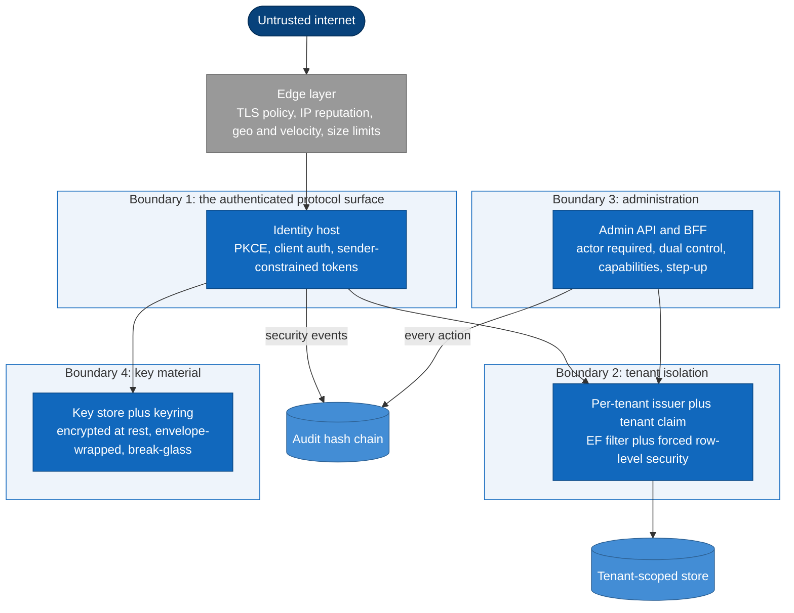

# Security architecture

> **Part of:** the [Software Architecture Document](README.md), quality and operational
> views.

Security is the primary quality attribute of an identity provider, so it gets a view of its
own rather than a section inside another. This states the trust boundaries, the isolation and
token protections, the administration controls, and the audit posture.

**It asserts no compliance conclusion.** What is here is the **mechanism**; whether a
mechanism satisfies a given regulation is reserved to Legal and the data-protection owner
(ADR-0016, ADR-0053, ADR-0054). The full threat model is a separate view; section 8 here is a
selected list, not that model.

## 1. Trust boundaries

Note that **administration crosses boundary 2 rather than bypassing it**: an admin action
lands inside tenant isolation like any other, which is why a delegated grant cannot become a
way around row-level security.

## 2. Tenant isolation, the worst failure mode

A cross-tenant leak is the highest-severity failure this system can have, so isolation is
layered and, critically, **does not rest on the signature**.

* **Data layer, two independent layers.** The tenant stamp and global query filter on the
  ORM path, plus PostgreSQL **forced** row-level security under a de-privileged,
  non-bypassing role as the backstop for the bulk and raw-SQL paths the filter cannot see.
  The tenant variable is set with `SET LOCAL` inside a per-request transaction so it is
  pooling-safe. **No ambient tenant fails closed**, proven by spike A-4 (ADR-0001, ADR-0037,
  and [12-data-architecture](12-data-architecture.md)).
* **Token layer, and this is the one that surprises people.** Because Pool tenants share a
  pool-group signing key, **a valid signature does not prove the tenant** (ADR-0033). A
  resource server must therefore bind on issuer and audience, and on the `tenant` claim where
  it serves several tenants on one host. Proven by spike A-7, which showed the signature
  failing to isolate under the shared key while issuer binding plus the claim plus row-level
  security succeeded (ADR-0049).
* **Key layer.** A Silo tenant gets its own keyset; Pool tenants share a pool-group keyset.
  That sharing is an **accepted risk with a named compensating control**, and the control is
  exactly the token-layer binding above. A tenant needing crypto isolation chooses Silo
  (ADR-0033).

The three layers are not redundant restatements: each covers a path the others do not.

## 3. Token security

* **The access token is a plain signed JWT** typed `at+jwt`, with encryption deliberately
  off, and resource servers pin the accepted type to block JWT confusion. Refresh,
  authorization-code, and device-code artifacts keep encryption, because those are sensitive
  in a way an access token given to a resource server is not (ADR-0005).
* **Because the access token is readable by anyone holding it, the minimal claim set is
  mandatory rather than a preference** (ADR-0005). Which token each claim rides in is a
  separate control: a single choke-point emits a claim only where explicitly declared,
  **deny-by-default**. That rule is fixed in the core-protocol design and **no ADR owns it**,
  which is recorded here rather than attributed upward.
* **PKCE is `S256` only.** `plain` is actively removed from the advertised methods rather than
  left at the engine default, because leaving it advertised re-opens a downgrade (ADR-0043).
* **Sender-constrained tokens** are mTLS natively and DPoP as a build, with a nested `cnf.jkt`
  confirmation, a cross-node replay set, and the confirmation surfaced in introspection so a
  resource server using introspection can actually enforce proof-of-possession. A DPoP-bound
  token presented as a bare Bearer is rejected (ADR-0014, runtime view 5).
* **The DPoP replay set fails closed.** Unlike an ordinary cache, if the check-then-add on the
  replay set is not confirmed the proof is **rejected**, not accepted: security over
  availability. It is fail-closed by the general rule for security checks rather than as an
  exception to the fail-open cache policy (ADR-0040), and the set is **authoritative with no
  durable source to read through to**, which is why losing it is a bounded replay window
  rather than a cache miss (ADR-0074; the check-then-add behaviour is fixed in the
  sender-constrained-tokens design rather than in ADR-0014, which scopes DPoP as a build).
* **A short access lifetime bounds what revocation cannot reach.** Fifteen minutes is the
  window a revoked-but-unexpired JWT survives, and a client needing instant revocation is
  issued a reference token instead, which forces its resource server onto introspection
  (ADR-0039).
* **Introspection and revocation are native, fully-handled endpoints** with client
  authentication and native presenter confinement. Adding a controller to re-implement the
  owner check is the most common wrong turn here, and it reinvents a check that is already
  correct while probably weakening it (ADR-0048).
* **Machine-to-machine clients authenticate with `private_key_jwt`**, not a shared secret
  (ADR-0009).
* **Refresh posture** is rolling rotation with reuse detection, where the engine revokes the
  sibling tokens itself and deliberately keeps the authorization, a 30-second leeway sized
  above realistic network timeouts, and an 8-hour absolute ceiling (ADR-0004, runtime view 11).

## 4. Key and secret protection

* Signing key material is stored **encrypted at rest**, wrapped by the data-protection
  keyring, and a uniqueness constraint on the active state per use makes **two simultaneous
  active signers impossible at the schema level** rather than by convention, which is also why
  cold-start seeding needs no distributed lock (ADR-0012, and [12-data-architecture](12-data-architecture.md)).
* **Rotation bounds the cryptoperiod without an availability cost**, which is what makes a
  short cryptoperiod affordable: keys rotate in process with a publish-before-sign window and
  an overlap during which the retired key still validates, so rotating more often never costs
  a restart and is never traded away for uptime (ADR-0011).
* **Signing keys must be asymmetric.** A startup guard fails fast if a symmetric key is
  present, because a symmetric signing key would let any holder of the verification key mint
  tokens (ADR-0043, ADR-0005).
* **The encryption credential has its own lifecycle**, and a hard guard blocks un-registering
  one while any live artifact still needs it. The retention floor is the longest-lived
  encrypted artifact, which works out to roughly the 8-hour refresh ceiling plus a margin.
  Without that guard a token could become permanently undecryptable, which is a data-loss
  event dressed as a configuration change (ADR-0005).
* **Runtime key rights are least-privilege and deliberately incomplete**: get, unwrap, wrap,
  and sign where the store performs signing. **No purge, no delete, no set at runtime.**
  Destruction is a separate two-approver path, and every key and secret access is audited
  (ADR-0009, ADR-0006).
* Secrets arrive by environment, mounted file, or secret store and are **never** baked into an
  image; cloud access uses workload identity with no static secret (ADR-0009).
* The keyring lives on a durable store **independent of Redis**, and disaster recovery
  restores the signing keys, the keyring, **and** the root certificate together (ADR-0006,
  ADR-0012, and [22-reliability-backup-dr](22-reliability-backup-dr.md)).
* **Degraded mode is forbidden in any token-issuing environment**, enforced by the startup
  self-check rather than left to deployment discipline (ADR-0043).

## 5. Administration and authorization

* **Never autonomous on irreversible or outward-facing actions.** A server-side dual-control
  saga gates them: proposer distinct from approver, bound to a request hash, single-use,
  time-boxed at 72 hours, with an ETag re-check at execution because approval and execution
  are separated in time (ADR-0020, runtime view 2).
* **The Admin API requires a real actor and rejects an app-only token**, and that runtime
  check is paired with an issuance-time invariant that no client-credentials client is ever
  granted the admin scope. Two controls for one property, because the runtime check alone
  would be one misconfiguration from being the only one (ADR-0020).
* **The admin front end holds the user-delegated token server-side**; it never reaches the
  browser, which is the actual mitigation for cross-site scripting rather than a convenience
  (ADR-0020, ADR-0029).
* **Delegated administration is capability-scoped, time-bound, revocable, and there is no
  super-admin.** The control that makes "no super-admin" real is the **forbidden cascade**:
  dangerous capabilities carry a flag that stops them inheriting down the tenant tree even
  from an ancestor grant, so they require a direct grant on the exact tenant. Inheritance only
  ever narrows (ADR-0010, runtime view 9).
* **The v1 grant model is purely additive**: no deny row, no parent ceiling, and nothing in v1
  may be designed as if a ceiling were enforced (ADR-0010).
* **Two break-glass paths exist and are not interchangeable**, including in their control
  status: the key-compromise trigger is dual-controlled by an accepted decision, while whether
  unsealing admin break-glass needs a second approver is unratified and only **split custody**
  of the credential is fixed. See
  [17-operations-maintenance](17-operations-maintenance.md) (ADR-0007, ADR-0015).

## 6. Audit, tamper-evidence, and data-protection mechanisms

The audit lane is the tamper-evident one and never travels through diagnostics
(see [16-observability-monitoring](16-observability-monitoring.md)).

**Its first property is coverage, not cryptography: the audit trail records the negative
paths, failures, denials, and errors.** That is the property ordinary logging tends to miss,
and missing it is what makes a trail useless for an incident: a record of everything that
succeeded answers no question anyone asks after a breach. The tamper-evidence below matters
only because the coverage is there first (ADR-0008).

The remaining properties (ADR-0008):

* **Keyed hash chain**: each record's hash is an HMAC over the previous hash and the
  canonicalized fields, prev-first. The key matters: an unkeyed hash would let anyone who can
  write rows recompute a consistent chain, so the chain would prove ordering without proving
  authorship.
* **Append-only at the database level**, with update and delete revoked rather than merely
  not used by the application.
* **Delivery-guaranteed**, with critical events committing inside the transaction and the rest
  going through a retrying outbox. Never fire-and-forget.
* A periodic job recomputes the chain, because tamper-evidence that is never verified detects
  nothing.

**Erasure against an append-only chain is reconciled by chain-over-commitments**: a
per-subject key is destroyed, and because the record hash covers the **ciphertext** the chain
still verifies while the payload becomes unreadable. That key vault sits in a keystore
separate from the audit store, so it is absent from audit backups and any downstream copy;
co-locating it would make the shred cosmetic (ADR-0016, runtime view 10).

Consent receipts and breach-scope assembly build on the same chain, since both need an
immutable and demonstrable record (ADR-0053). Residency and cross-border transfer are
jurisdiction-profiled controls (ADR-0054). **The legality of residual ciphertext, retention
periods, and any compliance verdict are reserved to Legal and the data-protection owner**, and
this view deliberately stops at the mechanism.

## 7. Perimeter, abuse resistance, and hardening

* **An L7 edge is assumed**, and deploying direct to the internet moves those
  responsibilities to Kestrel hardening plus the in-application controls at a lower ceiling.
  Forwarded headers are honoured only from trusted proxies, because a wrong scheme defeats
  cookie invariants, a wrong client address collapses per-IP limiting into one global bucket,
  and an unvalidated forwarded host reaches host-based tenant resolution (ADR-0073).
* **Forwarded-header processing runs early, and specifically before strict transport
  security**, because everything downstream that reads the scheme or the client address reads
  it after this point. Put it after HSTS and the request still looks like plain HTTP when the
  transport-security decision is made, so the protection is applied against the wrong facts.
  The forwarded host is validated against known-good values rather than trusted as received
  (ADR-0073).
* **Rate limiting and load shedding coexist and are not the same control** (ADR-0040).
* **IP rate limiting plus per-account lockout are explicitly not enough** for an
  internet-facing provider, and the reasoning is why the extra controls exist: a botnet stuffs
  credentials from thousands of addresses, so per-IP limits miss it; and **per-account lockout
  is itself a denial-of-service weapon** an attacker can aim at a chosen victim. So two
  controls are added: a pluggable risk-triggered challenge, off in development, on the login,
  reset, device-verification, and signup paths; and **per-source-address failure scoping
  alongside per-account lockout** so fail-spam from one address cannot lock a victim out, with
  a distinct alert for many lockouts on one account (ADR-0042), produced by the built-in
  detector over the audit lane rather than by a metric rule, because a per-account
  dimension is forbidden on the metric lane (ADR-0082, ADR-0083).
* **Anti-enumeration covers latency, not just the response body.** The account-recovery
  endpoints return the same response **and the same latency** whether or not the account
  exists, with no HTTP or timing branch, and a latency-invariance test is a permanent
  acceptance criterion. The per-recipient email throttle therefore runs **inside the relay
  after** the constant-time response, never synchronously before enqueue, or it would become
  the timing oracle the uniform response was meant to close (ADR-0038).
* **Session fixation is defended by never upgrading a pre-login handle in place**: a new
  session identifier is minted at primary authentication and the pre-login handle is
  discarded, and the identifier rotates again on step-up (ADR-0003).
* CORS is **per-client through a policy provider**, not one static global policy (ADR-0050).
  A TLS floor applies both at the edge and in the application (ADR-0073, ADR-0076), and the
  edge additionally carries the five other controls ADR-0073 parameter A lists, of which the
  only response header is strict transport security. The browser-facing headers are a separate
  axis, and both halves of it now have an owner: the **strictness** of the Content Security
  Policy is ADR-0072 parameter C, a rendering-stack decision rather than an edge one, and the
  concrete directive values, the anti-framing posture, and the rest of the browser-facing set
  are ADR-0091, which fixes them as three profiles selected by response class and lands **three**
  invariants in ADR-0043. That count read two until 2026-08-02, when ADR-0091 parameter K made the
  profile set total: the header middleware writes a profile on **every** response and endpoint
  metadata only selects which one, so a page nobody anticipated is served under the strictest
  profile rather than under none. The third invariant follows from it, and it is the only row in
  that table asserting **reachability alone**, since it has no value to read and asks only whether
  the middleware is registered at all.
  The application emits its own strict-transport-security header
  rather than relying on the edge to, with a one-year `max-age` and with `includeSubDomains` and
  `preload` left **off and owned by the operator**, because both reach domains Nami does not own.
  Where the application terminates TLS itself, a startup assertion rejects any explicitly
  configured protocol below TLS 1.2 rather than pinning a protocol list that a future version
  would break. Disabling OpenIddict's transport-security requirement is forbidden outside
  Development.
* **Supply chain**: release artifacts are signed with keyless provenance attestation, and
  dependencies are permissive-OSS only enforced by a CI license scan (ADR-0051, ADR-0026).
* **The verification baseline is OWASP ASVS**, self-verified and mapped to tests, with L2 as
  the floor and L3 on the key, token, dual-control, and tenant-isolation paths. Buying that
  assurance instead, as a paid assessment or a certification, is deferred as premature for a
  pre-alpha project and can be added later without changing the baseline. **An independent
  penetration test is a separate matter and is a pre-GA gate**, owned by Security, scoped to
  the protocol endpoints, the admin surface, tenant isolation including the Pool shared-keyset
  case, and the break-glass paths, run on pre-production against synthetic data. Self-assessment
  being weaker than an external assessment is an accepted, recorded trade-off, and the
  penetration test is what bounds it (ADR-0062).

### The two kinds of hardening invariant, which is worth separating

ADR-0043's startup self-check contains two different things, and conflating them loses
information. Some invariants are the **executable enforcement of a decision owned elsewhere**:
PKCE mandatory, no implicit flow, rolling refresh on, asymmetric-only signing. The rest are
**hardening parameters that had no prior ADR home and are fixed by ADR-0043 itself**: `S256`
only, the content-encryption pinning with RSA1_5 forbidden, the cookie attribute set, and the
no-degraded-mode guard. The first kind fails if a decision drifts; the second kind **is** the
decision.

## 8. Selected threats designed against

A short list, not the threat model. Each row names the control rather than the intention.

| Threat | Control |
|---|---|
| Cross-tenant token acceptance | Issuer and tenant binding, **never** signature alone (ADR-0033, ADR-0049, spike A-7) |
| Cross-tenant read via bulk or raw SQL | Forced row-level security under a de-privileged role (ADR-0037, spike A-4) |
| Refresh-token theft and replay | Rolling rotation, reuse detection, sibling revoke (ADR-0004) |
| Proof replay on a sender-constrained token | Nested confirmation plus a cross-node replay set; reject DPoP presented as Bearer (ADR-0014) |
| JWT confusion | Pinned accepted token type (ADR-0005) |
| PKCE downgrade | `S256` only, `plain` removed from discovery (ADR-0043) |
| Confused deputy on token exchange | Initiator classification before the check; a self-issued cross-tenant call missing `act` is rejected rather than falling back (ADR-0010, runtime view 15) |
| Autonomous destructive administration | Dual-control saga, and no app-only token can reach the admin API (ADR-0020) |
| Signing-key compromise | Break-glass distrust fail-closed plus rotation inside five minutes (ADR-0007) |
| Session fixation | A new session identifier at primary authentication, rotating on step-up (ADR-0003) |
| Claim leakage | Deny-by-default claim destinations, plus the minimal claim set (ADR-0005 for minimisation, ADR-0075 for the destination rule and for its being non-weakenable by a replacement adapter) |
| Account enumeration | Uniform response **and** uniform latency, with the throttle after the response (ADR-0038) |
| Lockout used as denial of service | Per-source failure scoping beside per-account lockout, plus a distinct alert (ADR-0042) |

## Sources

* ADR-0001, ADR-0037, ADR-0033, and ADR-0049 (the three isolation layers, the shared
  pool-group keyset as an accepted risk, and the token-layer binding that compensates for it,
  with spikes A-4 and A-7 as the evidence).
* ADR-0005 (the plain signed access token, the mandatory minimal claim set, the
  asymmetric-signing rule, and the encryption retention floor of roughly
  the 8-hour ceiling plus margin), ADR-0004 (refresh posture and the engine's sibling
  revoke), ADR-0014 (sender-constrained tokens as a build, with the replay set's check-then-add behaviour owned by the sender-constrained-tokens design and its no-durable-source property by ADR-0074), ADR-0039 (the
  15-minute residual and the reference-token alternative), ADR-0048 (native introspection and
  revocation, and the controller not to write), ADR-0009 (machine-to-machine authentication,
  least-privilege key rights with no purge at runtime, and secrets never in an image).
* ADR-0011 and ADR-0012 (encrypted key material, the schema-level single-active-signer
  constraint that ADR-0012 owns, and the joint restore), ADR-0006 (the provider-agnostic store and the keyring's
  independence from Redis), ADR-0043 (the startup self-check, and the distinction between
  enforcing a decision owned elsewhere and fixing a parameter that had no home).
* ADR-0020, ADR-0010, ADR-0029, ADR-0007, and ADR-0015 (the dual-control saga, actor
  requirement paired with the issuance-time invariant, the token kept off the browser, the
  forbidden cascade and additive-only grants, and the two break-glass paths with their
  differing control status).
* ADR-0008, ADR-0016, ADR-0053, and ADR-0054 (the keyed chain and why the key matters,
  database-level append-only, guaranteed delivery, the verification job,
  chain-over-commitments, and the reserved compliance verdict).
* ADR-0073, ADR-0040, ADR-0042, ADR-0038, ADR-0003, and ADR-0050 (the edge assumption and
  trusted proxies, overload versus abuse, why IP limits and lockout are insufficient and what
  is added, latency-uniform anti-enumeration, session-fixation defence, per-client CORS),
  ADR-0051 and ADR-0026 (supply-chain integrity and the license gate), ADR-0062 (the ASVS
  baseline), ADR-0072 parameter C (the Content Security Policy's strictness, which is a
  rendering-stack decision and not an edge or transport one), and ADR-0091 (the browser-facing
  response-header baseline: the directive values ADR-0072 left open, the three response
  profiles, and the outright denial of framing).
* Reconciled against the design corpus's security view on 2026-07-25. Taken from it: the
  four-boundary trust diagram, the three-layer isolation framing with the signature caveat as
  its centrepiece, the token and key protection inventories, the administration controls, the
  audit posture, the abuse-resistance reasoning, and the selected-threat table. **One claim
  was rejected on 2026-07-25 and then reinstated on 2026-07-26, and the reversal is the point:**
  the corpus lists "an independent security review before production" alongside the conformance
  suite. That was first dropped as a gate no decision imposed, reading ADR-0062's deferral of a
  paid assessment as covering a penetration test too. It did not; ADR-0062 had bundled two
  questions and answered only one. The corpus was right, ADR-0062 was corrected, and the gate is
  now stated above. The lesson recorded with it is that a corpus claim contradicting an ADR is
  evidence the ADR may be wrong, not only evidence the corpus is. Two claims were made more precise from our own records
  rather than copied: the corpus gives runtime key rights as get, unwrap, and wrap, where
  ADR-0009 also permits sign where the store signs and additionally forbids set; and the
  corpus says the session is regenerated on privilege change, where the design is more
  specific and stronger, that a pre-login handle is **never upgraded in place**.
* **One of this view's own claims was corrected on 2026-08-01, and its shape is the reason it
  is recorded rather than quietly fixed.** The hardening bullet in section 7 read "Security
  headers, a content-security policy, and a TLS floor apply at the edge (ADR-0073) and in the
  application (ADR-0076)". Three items sat behind two citations and the middle one was in
  neither: ADR-0073 parameter A names strict transport security and no other header, and
  ADR-0076 decides strict transport security, the TLS floor, and the transport-security
  requirement while never mentioning a content-security policy. That is the compound-sentence
  shape the repository conventions name as the first place to look, where a pointer at the end
  attaches to the wrong clause, and this layer is the one that may not introduce a claim. The
  policy's real owner for **strictness** is ADR-0072 parameter C; its **values** had no owner at
  that point, which the [testing design](../design/20-testing.md) section 10 recorded and
  ADR-0091 closed later the same day. Neither the count of items nor the count of citations was
  wrong, which is why nothing flagged it.
* **The replacement written on 2026-08-01 was itself wrong, in the same shape, and this is the
  second correction to one bullet in one day.** It read that the edge "carries the controls
  ADR-0073 parameter A lists, which are transport and volumetric rather than browser-facing".
  Parameter A's list contains **strict transport security**, which is a browser-facing response
  header, so the characterisation was false about one of its six items and false in the direction
  that mattered, since the sentence existed to separate the two axes. It was found while writing
  ADR-0091, whose parameter A needed the same distinction and states it as what it is: the only
  response header on the edge's list is strict transport security, and ADR-0076 parameter A
  already places that one in the application's own pipeline. The lesson is not about this
  sentence. **A summarising adjective over an enumerated list is a claim about every member of
  it**, so it has to be checked member by member, and a correction is exactly where that check
  gets skipped because the attention is on the thing being fixed.

---

[Prev: Data architecture](12-data-architecture.md) · [Index](README.md) · Next: [Threat model](14-threat-model.md)
