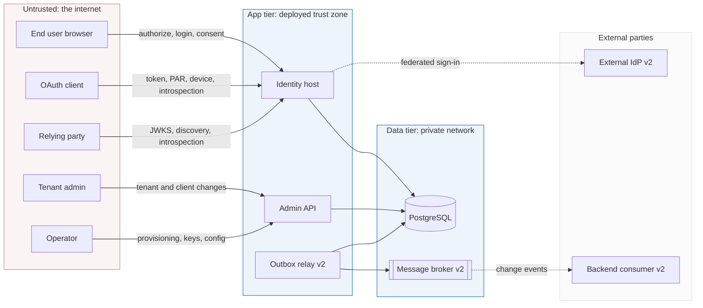

# Threat model

> **Part of:** the [Software Architecture Document](README.md), supporting views.

[13-security-architecture](13-security-architecture.md) states the controls Nami **chose**.
This view enumerates the **threats those controls answer**, element by element, and names the
residual where a control is a deployment or ratification act rather than code.

**This is an engineering threat model, not a compliance verdict.** Every mitigation traces to
an existing decision or design; where a row has no mitigation, that is an explicit open item
rather than an omission.

**Method.** STRIDE (spoofing, tampering, repudiation, information disclosure, denial of
service, elevation of privilege) applied to each element and each flow that crosses a trust
boundary. Exposure is a qualitative judgement of impact on the assets in section 3 and of
reachability, not a numeric score.

**Scope.** The v1 authorization server (host, admin, database, keys, audit) plus the v2
additions. **Out of scope**, and deliberately so: the operator's network and host hardening,
each relying party's own security, and backend consumers beyond the boundary. Their threat
models are theirs, and claiming them here would be claiming assurance we cannot give.

## 1. Trust boundaries

| # | Boundary | Why crossing it requires validation |
|---|---|---|
| B1 | Internet to app tier | Every request into the host or admin surface. All input is hostile until validated |
| B2 | App tier to data tier | The application runs under a **de-privileged** role and row-level security is enforced at this crossing, not above it |
| B3 | **Tenant to tenant** | The sharpest one, because it is **logical rather than physical**: in Pool mode one database and one host serve many tenants, so the boundary exists only as the tenant claim, the per-tenant issuer, the query filter, and row-level security. Nothing physical will catch a mistake here |
| B4 | Control plane to data plane | Privileged mutation through the admin surface versus the token and authorize hot path |
| B5 | To external parties | Outbound federation and outbound events, where trust ends. **Federation crosses it in v1**, because the static host-level external-IdP set ships in v1 (ADR-0002); what is v2 is per-tenant self-service federation (ADR-0034) and outbound identity events |

## 2. Assets

| # | Asset | Objective |
|---|---|---|
| A1 | Private signing keys | Confidentiality, integrity, controlled rotation. Keys never leave the store |
| A2 | Issued tokens | Integrity, sender constraint, timely revocation |
| A3 | Credentials and personal data | Confidentiality and minimisation |
| A4 | **Tenant isolation** | No cross-tenant read or write. **The crown jewel** |
| A5 | Audit trail | Integrity and non-repudiation |
| A6 | Client secrets | Confidentiality, one-way at rest |
| A7 | Availability of the token and authorize path | Uptime under load and under abuse |

## 3. Spoofing

| ID | Threat | Asset | Designed mitigation | Exposure and residual |
|---|---|---|---|---|
| S1 | A forged token accepted by a resource server | A2 | Signature verification against the per-tenant JWKS, with issuer, audience, and expiry validation and per-tenant issuer binding (ADR-0049, spike A-7) | High. **Residual sits in someone else's code**: the resource server must validate correctly, which is why it is an integration obligation and not an assumption |
| S2 | Client impersonation with a stolen identifier | A2, A6 | Confidential clients authenticate; public clients require PKCE; sender-constrained tokens bind to a key or certificate (ADR-0009, ADR-0014) | High. Residual is secret hygiene at the client |
| S3 | Replay of a captured proof or token | A2 | Proof replay set, checked and inserted cross-node, fail-closed; a bound token presented as a bare Bearer is rejected (ADR-0014) | High. Residual is a bounded window if the replay set is lost without durability (ADR-0074) |
| S4 | A token minted for one tenant accepted as another | A4, A2 | **Issuer and tenant binding, never the signature**, because a Pool keyset is shared (ADR-0033, ADR-0049) | **Critical.** Proven rather than argued by spike A-7 |
| S5 | Account takeover through external-IdP linking | A3 | Linking keyed on `(provider, subject)` with an unverified email never a join key, plus issuer verification on the authorization response and correlation state bound to the initiating scheme (ADR-0002 in v1, tightened for per-tenant providers by ADR-0034) | Medium. **This is a v1 threat**: ADR-0002 ships the linking rule as a binding v1 requirement with a v1 test obligation. Linking policy is a Security ratification item |

## 4. Tampering

| ID | Threat | Asset | Designed mitigation | Exposure and residual |
|---|---|---|---|---|
| T1 | Altering an issued token | A2 | Asymmetric signature; a symmetric signing key is rejected at startup, because it would let any verifier mint (ADR-0043, ADR-0005) | High |
| T2 | Altering data directly in the database | A4, A5 | Row-level security under a de-privileged role bounds what the application can reach; the audit chain detects alteration after the fact (ADR-0037, ADR-0008) | High. Residual is direct operator access, which is an operational control |
| T3 | Rewriting audit history | A5 | Keyed hash chain, previous-first, with update and delete **revoked at the database level** rather than merely unused, plus a periodic recompute. The key is what makes it prove authorship and not only ordering (ADR-0008) | High. Residual is chain-key custody, a Security ratification item |
| T4 | Configuration drift that weakens the posture | A2, A3 | A fail-fast startup self-check on the hardening invariants, so a weakened configuration does not start rather than serving quietly (ADR-0043) | Medium |

## 5. Repudiation

| ID | Threat | Asset | Designed mitigation | Exposure and residual |
|---|---|---|---|---|
| R1 | An administrator denies a destructive action | A5 | Dual control with proposer distinct from approver, bound to a request hash, executed and audited atomically with the actor recorded (ADR-0020, ADR-0010) | Medium |
| R2 | A failure or denial leaves no trace | A5 | **The audit trail covers the negative paths**, failures, denials, and errors, which is the coverage ordinary logging misses and the reason the subsystem exists (ADR-0008) | High |
| R3 | Emergency access used without a record | A5 | **Audit before action**: the record is written before sign-in and a sink failure is fail-closed, so an unrecorded emergency login cannot happen (ADR-0015) | Medium |

## 6. Information disclosure

| ID | Threat | Asset | Designed mitigation | Exposure and residual |
|---|---|---|---|---|
| I1 | Cross-tenant read through query, include, bulk, or raw SQL | A4 | Two layers: the tenant stamp and query filter, then **forced** row-level security, which is the only guard on the bulk and raw paths. The engine's tenant column is **text**, so an unset variable fails closed by non-match; `uuid` tenant columns instead cast with `NULLIF` so an unset variable fails closed rather than **throwing** (ADR-0001, ADR-0037, ADR-0071) | **Critical.** Core is spike-proven. Residual: **every new `uuid`-tenant table must join the cast list**, which is why that list is a single authority in the data design |
| I2 | Cross-tenant write or mis-stamp | A4 | A write-side check on the policy; a mismatched write raises; no ambient tenant fails closed (ADR-0001) | **Critical** |
| I3 | Row-level security silently disabled | A4 | The application role must be non-superuser and non-bypassing, **because a superuser bypasses the policy entirely** | **Critical**, and it is a **deployment** control rather than a code one, so it is an Ops ratification item |
| I4 | Personal data leaked into a token | A3 | The minimal claim set (ADR-0005), and **deny-by-default claim destinations** so a claim is emitted only where declared, binding on any replacement adapter and carrying a contract test (ADR-0075) | Medium. The residual moved from "no decision owns this control" to "the consumer must choose to run the test", because Nami cannot execute a check inside someone else's build |
| I5 | Personal data leaked into telemetry | A3 | Framework-level redaction on the diagnostics lane (ADR-0022), plus an **allow-listed metric tag set** with exemplars as the sanctioned drill-down and a test proving the per-metric cap is attached (ADR-0077) | Medium. The remaining exposure is a dimension added outside the allow-list, which is a reviewable act rather than an unowned rule. **Why this row is High-impact if it fires:** a metric backend sits outside the audit retention, crypto-shred, and erasure paths, so an identifier that reaches it escapes every data-protection mechanism at once |
| I6 | Personal data on the event bus (v2) | A3 | Thin events by default; a richer payload is opt-in and ratified; a single stream with a tenant identifier and consumer-side filtering (ADR-0071) | Medium. Data-protection ratification item |
| I7 | Signing-key material exfiltrated | A1 | Keys never leave the store into logs, chat, or configuration; encrypted at rest; rotation exposes no bytes; runtime rights exclude purge, delete, and set (ADR-0009, ADR-0011) | **Critical.** Residual is store custody, a Security ratification item |
| I8 | Over-exposure through discovery or JWKS | A1 | Public keys only, on fully-handled endpoints with no custom controller, and key scope fixed per deployment (ADR-0033, ADR-0048) | Low |

## 7. Denial of service

| ID | Threat | Asset | Designed mitigation | Exposure and residual |
|---|---|---|---|---|
| D1 | Flooding the token or authorize path | A7 | **Both controls exist and are distinct**: partitioned rate limiting returning 429, and a concurrency limiter on the token endpoint that sheds with 503. One subtlety is designed in: **partitioning on raw unauthenticated input is itself a denial-of-service vector** and is avoided, because an attacker who controls the partition key can exhaust the limiter's own state (ADR-0040) | High. Concrete thresholds are an Ops ratification item |
| D2 | Growth abuse on short-lived request tables | A7 | Short lifetimes, per-client anti-flood with a bounded outstanding count, and batched pruning off the request path (ADR-0014, ADR-0031) | Medium |
| D3 | Account lockout weaponised against a victim | A3 | **Per-source failure scoping alongside per-account lockout**, so fail-spam from one source cannot lock a chosen account, with a distinct alert for many lockouts on one account (ADR-0042) | Medium |
| D4 | Outbox backlog stalling issuance (v2) | A7 | The outbox insert is one row in the transaction that was already happening; the relay drains asynchronously with `SKIP LOCKED`; backlog is alerted (ADR-0071) | Medium |
| D5 | Rotation or restart pressure | A1, A7 | Rotation needs no restart and the overlap window means no in-flight failure (ADR-0011) | Low |

## 8. Elevation of privilege

| ID | Threat | Asset | Designed mitigation | Exposure and residual |
|---|---|---|---|---|
| E1 | Delegated administrator acting beyond their grant | A4 | Capability-scoped, tenant-scoped, time-bound grants with the **forbidden cascade** stopping dangerous capabilities inheriting, checked live rather than baked into a token, with an ETag re-check at execution (ADR-0010, ADR-0047) | High |
| E2 | An application-only token performing administration | A4 | The actor requirement rejects it at runtime, **and** no client-credentials client is ever granted the admin scope at issuance. Two controls, because one is a misconfiguration away from being the only one (ADR-0020) | High |
| E3 | Self-approval defeating dual control | A2 | Proposer must differ from approver, single-use and bound to a request hash, itself step-up gated (ADR-0020) | Medium |
| E4 | Step-up bypassed | A3 | Assurance is **recomputed per token request** from the methods used and session age rather than stored, so an aged session drops out of the higher level even when the method history still shows it (ADR-0013) | Medium |
| E5 | Confused deputy on token exchange | A4 | Authority is the server-side grant on the resolved initiator, never a service identity, and the actor claim carries identity rather than authority (ADR-0010); the exchange grant is native while the resolution logic is ours (ADR-0014). Classification runs **before** the check, and a self-issued cross-tenant call missing the actor claim is rejected rather than falling back to the subject. **`may_act` is never issued** (ADR-0014), because delegation authority baked into a token would be stale and un-revocable, which is the property the whole model rejects | High |
| E6 | A bypass-capable database role granted too widely (v2) | A4 | Granted only to the relay and never to the request path; isolation still holds because every event carries a tenant identifier (ADR-0071) | High. Role-grant scope is an Ops ratification item |

## 9. Two attack trees worth walking

**Reading tenant B's data while authenticated as tenant A** (A4). Through the ORM: blocked by
the filter, then by row-level security. Through bulk or raw SQL bypassing the filter: **only**
row-level security remains, which is why I3 is critical. Through an unset tenant variable on a
pooled connection: fails closed by non-match, since every discriminator is a text column
holding `Tenants.Identifier`; the `NULLIF` cast that a `uuid` column would need is a rule with
no current instances. Through the application running as a superuser: **the policy is bypassed entirely**,
so the de-privileged role is not hardening but load-bearing. Through a forged token carrying
another tenant's issuer: blocked at the resource server by issuer binding, not by the signature.

**Obtaining a private signing key** (A1). At rest: encrypted, with de-privileged access. From
logs, chat, or configuration: prohibited by the never-leave-the-store rule, which is a policy
because it is the only control that covers exfiltration paths no code sees. During rotation:
the overlap window exposes no bytes. And the blast radius is the honest part: a Silo tenant is
isolated, while **a Pool keyset compromise reaches every tenant in that pool group**, which is
the accepted risk of [23-risks-and-technical-debt](23-risks-and-technical-debt.md) R1.

## 10. Where the residual actually lives

The pattern across the tables is worth naming, because it decides where review effort belongs:
**the critical residuals are almost all deployment or custody acts, not code**. Row-level
security is bypassed by a superuser role (I3). Key confidentiality rests on store custody (I7).
Chain integrity rests on chain-key custody (T3). Rate limits need real thresholds (D1). The
bypass role must stay narrow (E6). Correct validation happens in someone else's code (S1).

Code review cannot close any of those. They are consolidated in the
[Pre-GA Ratification Checklist](../PRE-GA-RATIFICATION-CHECKLIST.md), and this section is the
argument for why that checklist is a release gate rather than paperwork.

## Sources

* ADR-0001, ADR-0033, ADR-0037, ADR-0049, and ADR-0071 (the isolation layers, the shared-keyset
  consequence, the forced policy and de-privileged role, the binding that isolates instead of
  the signature, and the `uuid` cast rule).
* ADR-0005, ADR-0009, ADR-0011, ADR-0014, ADR-0043, ADR-0048, and ADR-0074 (token shape and
  claim minimisation, client and key-access authentication, rotation, sender constraint and
  replay, the startup self-check, endpoint confinement, and the replay set's durability
  consequence).
* ADR-0008, ADR-0015, ADR-0020, ADR-0010, ADR-0047, and ADR-0013 (audit coverage of the negative
  paths and the keyed chain, audit-before-action, dual control and the actor requirement, the
  forbidden cascade and the consistency-carrying check, and recomputed assurance).
* ADR-0022, ADR-0040, ADR-0042, ADR-0031, ADR-0002, and ADR-0034 (telemetry cardinality as a
  privacy rule, the two distinct overload controls and the partition-key caveat, lockout
  weaponisation, pruning off the request path, and federated linking).
* **Two controls in these tables were design-owned with no ADR when this view was written.**
  The telemetry cardinality rule behind I5 became **ADR-0077** on 2026-07-26, framed there as a
  data-protection rule rather than a capacity one, which is the framing this row had argued for.
  The exclusion of `may_act` behind E5 became part of **ADR-0014** on the same day, added to
  its de-scope list with the note that this one is a security decision rather than a scope one:
  unlike the other de-scopes there, demand would not reopen it, only a change to the
  authorization model would.
* [13-security-architecture](13-security-architecture.md) states the controls; this view states
  the threats and the residual. [23-risks-and-technical-debt](23-risks-and-technical-debt.md)
  carries the accepted risks these rows feed.
* Reconciled against the design corpus's threat model on 2026-07-26. Taken from it: the STRIDE
  structure, the boundary decomposition, the asset list, most threat rows, both attack trees,
  and the practice of naming a residual per row rather than declaring a threat closed. Two
  substantive differences. **One gap the corpus carries does not apply here**: it records that a
  general limiter on the token and authorize path is an open item rather than a designed
  control, whereas ADR-0040 decides both a partitioned rate limiter and a token-endpoint
  concurrency limiter, and additionally warns that partitioning on unauthenticated input is
  itself an attack surface. **One reading is added**: section 10, that the critical residuals
  are overwhelmingly deployment and custody acts rather than code, which follows from the
  corpus's own rows but is not drawn out there, and which is the strongest available argument
  for the ratification checklist being a gate. The corpus threat model also independently
  attributed the deny-by-default destination rule to a design document rather than a decision.
  That corroboration is what drove the rule to a decision of its own on 2026-07-26: ADR-0075
  now owns it, and row I4 records the smaller residual that remains.

---

[Prev: Security architecture](13-security-architecture.md) · [Index](README.md) · Next: [Schema migration and evolution](15-schema-migration-evolution.md)
