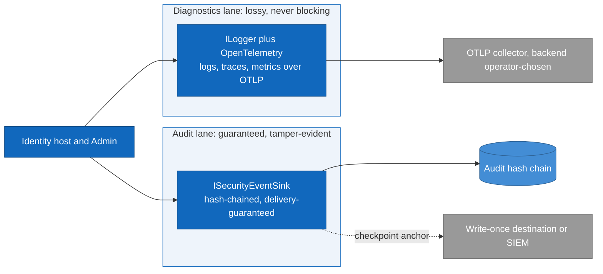

# Observability and monitoring

> **Part of:** the [Software Architecture Document](README.md), quality and operational
> views.

How the running system is observed, and how the objectives of
[10-nfr-catalogue](10-nfr-catalogue.md) become alerts and release gates. The operational
response to what is seen here is [16-operations-and-maintenance](16-operations-and-maintenance.md).

## 1. Two lanes that never mix

**The two lanes have opposite failure requirements, which is why they are two lanes and not
one pipeline with a severity field.**

* **Diagnostics** is `ILogger` plus OpenTelemetry over OTLP for all three signals, with
  Serilog deliberately dropped, and PII redacted at the framework level. It is **lossy and
  must never block** (ADR-0022).
* **Audit** is the security-event sink: append-only, hash-chained, delivery-guaranteed. It
  **never** travels through the diagnostics pipeline and is **never** dropped (ADR-0008).

They are joined only by a correlation identifier. Routing an audit event through the
diagnostics lane would make a tamper-evident record droppable under load, which is the one
thing it cannot be.

## 2. Metrics

The protocol engine emits **no** telemetry of its own (no activity source, no meter; the
upstream request is open), so the shape is built-in meters where they exist plus a custom
meter that gap-fills inside our own handlers. That custom meter carries a **decommission
marker**: it retires if the engine ships native instrumentation (ADR-0021, ADR-0022).

* **Built-in**: HTTP server request duration and active requests for the rate-errors-duration
  view, the framework's authentication, authorization, and **rate-limiting** meters (ADR-0040, which is
  how load shedding is observed rather than inferred), Kestrel TLS-handshake duration and
  rejected connections, plus the HTTP client, database, and runtime meters.
* **Custom**: tokens issued and issue duration, validation latency, revocations, login
  outcomes, consent, client-secret validation, logout, key rotations, and two that exist
  specifically to make operational failure visible, **`keys_loaded`** and
  **`signing_key_days_to_expiry`** as an observable gauge.
* **Operational signals** that no protocol meter would produce: load-shed 503 count,
  connection-pool saturation, Redis fail-open count, the **scheduler last-successful-run
  heartbeat**, node clock offset, and the continuous recovery-point metrics (archiving lag,
  backup age, replication lag).

### High-cardinality control is mandatory, not advisory

**A tenant identifier, subject, session identifier, proof identifier, raw token, or IP
address is never a metric tag.** That rule exists for two reasons at once, and either alone
would justify it: it is a **PII leak** into a store that is not designed to hold PII, and it
is a **cardinality explosion** that can take down the metrics backend. Allowed tags are
bounded ones: grant type, token type, scheme, result, error type, policy.

Per-tenant or per-user investigation therefore goes through **exemplars** and the traces and
logs they point at, never through a tag. The SDK's default per-metric cardinality limit is
2000, and individual metrics are tightened further with a view whose instrument-name selector
must match the emitted name **exactly**, because a mismatched selector silently matches
nothing and turns the cap into a no-op. A test asserts the view is actually attached, which is
the only way to tell a live cap from a no-op one (ADR-0022).

## 3. Burn-rate alerting, and why not latency alerting

**Alert on the rate of error-budget burn, not on instantaneous latency or error rate.**
Instantaneous alerting is noisy and, more importantly, is not anchored to anything a decision
can be made against. Each tier requires a short-window confirm to prevent flapping
(ADR-0041):

| Tier | Burn rate | Long window / confirm | Action |
|---|---|---|---|
| Fast | at least 14.4x | 1 h / 5 m | Page, and tighten the freeze to P0 and security only |
| Mid | at least 6x | 6 h / 30 m | Page |
| Slow | at least 1x | 24 h to 3 d / 6 h | Ticket, and freeze feature releases |

**The freeze is an automatic consequence of the burn tier, not a manual decision.** Burn rate
is computed from existing counters and adds no new metric.

Rule to severity to runbook, with the linkage enforced: **a page-severity alert with no
runbook is a defect blocked in CI** (ADR-0041).

| Rule | Severity | Runbook |
|---|---|---|
| Fast or mid burn on token latency or availability | Page | Burn-rate response |
| JWKS availability burn | Page | JWKS unavailable |
| `keys_loaded` false, or readiness failing | Page | Keys not loaded |
| `signing_key_days_to_expiry` low | Ticket | Key rotation overdue |
| Stale scheduler heartbeat | Ticket | Scheduler stale |
| Slow burn on any SLI | Ticket, plus feature freeze | Burn-rate response |
| Sustained rate-limit or load-shed 503 pattern | Ticket, escalating to page | Load shed sustained |

Alerts deduplicate by `(rule, deployment, tenant scope)`, so many pods with one symptom become
one incident rather than one page per pod.

### The abuse and recovery alert family

A second family feeds the same pipeline but belongs to the security and recovery postures
rather than to the SLO. It is listed here because it shares the infrastructure, and separated
because its owner is different (ADR-0042, ADR-0007, ADR-0074).

| Rule | Severity | Why it is distinct |
|---|---|---|
| Login-failure or credential-stuffing spike | Ticket, escalating | Brute force |
| MFA-failure spike | Ticket | An attack on the second factor specifically, not on the password |
| `invalid_grant` or `invalid_client` spike | Ticket | Either a client fault or an attack, and the response differs |
| **Refresh-token reuse detected** | **Page** | Reuse outside the leeway is a **theft signal**, not a client bug (ADR-0004) |
| **Key rotation event plus keyring access from an unknown source** | **Page** | The key-compromise signal (ADR-0007) |
| Token-issuance spike from one client or tenant | Ticket | Quota abuse |
| Lockout denial-of-service on one account | Ticket | Deliberately distinct from brute force, because the attacker's goal is the lockout itself |
| Clock drift past the threshold | Ticket | Fires **before** drift consumes the skew tolerance (ADR-0031) |
| Recovery-point breach | Page or ticket | Archiving lag, backup age, or replication lag (ADR-0074) |

Two of those rows are the reason this family is worth writing down rather than leaving to a
generic anomaly rule: **refresh reuse** and **unknown keyring access** are the only alerts in
the system whose first interpretation should be a compromise rather than a bug.

## 4. The canary, and backpressure

**An external synthetic canary runs the full chain** (authorization code with PKCE, then
token, then userinfo, then JWKS) through the public path on a schedule, and alerts
**independently of pod readiness**. That independence is the point: readiness cannot see a
certificate, DNS, JWKS-publication, or keyring fault that only manifests from outside the
cluster. Its end-to-end latency feeds the SLO gate, and it complements rather than replaces
the internal readiness probe (ADR-0041).

**OTLP backpressure is lossy, not blocking, and this is an invariant rather than a tuning
choice.** A slow or absent collector must never add latency to a token request. The exporter
uses a bounded queue that **drops when full** instead of blocking or growing, the export has a
bounded timeout, failures are swallowed off the request thread, and logging falls back to
stdout. **A collector-outage load test proves p99 on the token endpoint is unchanged while the
collector is blocked**, which is what turns the invariant from an intention into a tested
property. The audit lane is the exact opposite and does not drop (ADR-0022, ADR-0008).

## 5. Health endpoints

Readiness is tagged and gates on the database plus keys loaded, where the keys check compares
the active key identifier to the expected **persisted** one rather than performing a bare
round trip. Liveness **never** touches readiness, or the platform would kill a pod that is
deliberately reporting NotReady while draining (ADR-0031, ADR-0012).

## 6. The backend is the operator's choice

Nami emits OTLP and **mandates no backend**, bundling none in the reference host or the Helm
chart. It ships the export configuration and documents the collector topology. Local
development runs an opt-in stack so a developer gets all three signals with one command, and
that stack's licensing is acceptable **only** because those are unmodified upstream images run
as separate services reached over OTLP, making them development tooling rather than a shipped
dependency: nothing Nami ships carries them (ADR-0063, ADR-0026).

## Sources

* ADR-0022 (the two-lane split, `ILogger` plus OpenTelemetry with Serilog dropped, framework
  redaction, the built-in and custom meter inventory, the high-cardinality rule with exemplars
  as the alternative, and lossy-not-blocking export), ADR-0008 (the audit lane that never
  drops and never travels through diagnostics), ADR-0021 (the decommission marker on the
  custom meter).
* ADR-0041 (burn-rate tiers and windows, the automatic freeze, the runbook-per-page-alert CI
  gate, the deduplication key, the external canary, and the SLO as a release gate), ADR-0040
  (the rate-limiting meter as the way load shedding is observed).
* ADR-0042, ADR-0004, ADR-0007, ADR-0031, and ADR-0074 (the abuse and recovery alert family:
  brute force and lockout denial-of-service, refresh reuse as a theft signal, keyring access
  as a compromise signal, clock drift, and the recovery-point metrics).
* ADR-0031 and ADR-0012 (readiness gating, the persisted-key-identifier comparison, and the
  liveness rule), ADR-0063 and ADR-0026 (the operator-chosen backend, the development-only
  stack, and why its licensing does not reach shipped artifacts).
* Reconciled against the design corpus's observability view on 2026-07-25. Taken from it: the
  two-lane diagram, the built-in-versus-custom meter split with the engine's telemetry gap as
  the reason, the mandatory high-cardinality rule and its exemplar alternative, the burn tier
  table, the rule-severity-runbook mapping, the abuse-alert family, the canary's independence
  from readiness, and the backpressure invariant with its collector-outage proof. Nothing in
  the corpus view needed correcting against an owning decision, which is the first view in this
  migration where that is true; where this repository's own design goes further, it is on the
  cardinality mechanics (the exact-match view selector, the no-op failure mode it prevents, and
  the test that the view is attached), which are carried here because the failure they prevent
  is silent.

---

[Prev: Reliability, backup, and DR](13-reliability-backup-and-dr.md) · [Index](README.md) · Next: [Operations and maintenance](16-operations-and-maintenance.md)
