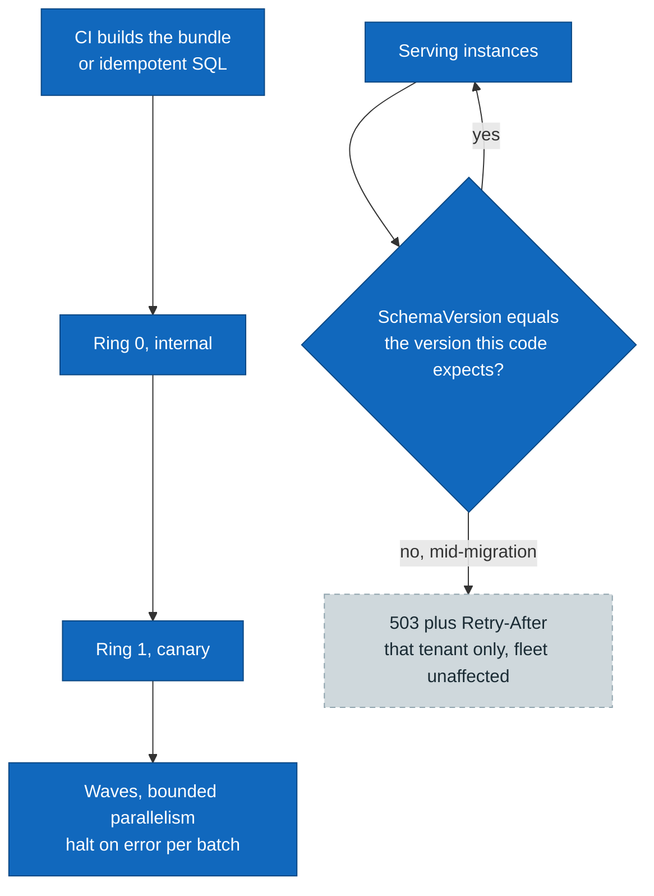

# Schema migration and data evolution

> **Part of:** the [Software Architecture Document](README.md), quality and operational
> views.

How the schema evolves across a multi-context, multi-tenant fleet without downtime and
without two versions of the code meeting a schema neither expects. This is the evolvability
attribute of [20-nfr-catalogue](20-nfr-catalogue.md). It also covers the **tenant data
lifecycle**, because provisioning, suspension, renaming, and deprovisioning are schema and
data operations rather than administrative metadata changes.

## 1. Three principles that shape everything else

* **A migration is a build artifact, never startup code in production.** A startup migrate has
  three separate problems: concurrency between replicas, the elevated permissions it needs at
  runtime, and no rollback. So CI produces a migration bundle or idempotent SQL, the runtime
  application holds a **least-privilege connection with no DDL rights**, and the migration runs
  under a separate role. The permission split is what makes the rule enforceable rather than a
  convention (ADR-0025, ADR-0017).
* **Four contexts, four histories.** Each DbContext keeps its own migrations-history table in
  its own schema, so the four can share one database without colliding
  ([12-data-architecture](12-data-architecture.md), ADR-0001).
* **A Silo fleet is an operational fan-out, not an ORM feature.** The ORM migrates one context
  against one connection string; there is no "migrate every tenant database". An orchestrator
  applies migrations per Silo tenant, which is why rollout order, halt-on-error, and per-tenant
  state exist at all (ADR-0017).

## 2. Fleet rollout, and the gate that makes it safe

* **Two sources of truth, deliberately.** The per-tenant `SchemaVersion` in the tenant registry
  is the **fleet** view; each tenant database's own migrations-history table is the **per-database
  truth**. The registry is what a resolver can consult cheaply on every request; the history
  table is what is actually so.
* **The traffic gate returns 503 with `Retry-After`, and returning 404 would be a real bug.**
  When a tenant's schema version does not match what the running code expects, the resolver
  refuses to route to it. 503 says "come back", so a relying party retains its cached discovery
  metadata; 404 would say "this tenant does not exist" and invite relying parties to **purge**
  that metadata over what is a transient state (ADR-0017).
* **The gate isolates the tenant, not the fleet.** One tenant mid-migration does not fail the
  others, which is the property that makes a wave rollout tolerable at all.
* **Ordered rings**: internal, then canary, then waves with bounded parallelism and halt-on-error
  per batch. Per-tenant state is pending, in progress, done, or failed with its last error; a
  failure is gated, logged, and retried or rolled forward, never left silent.

## 3. Expand and contract is the reversibility model, not down-scripts

**Reversibility at fleet scale comes from backward-compatible migrations, not from rollback.**
The rule is that a migration ships so old code and the new schema coexist for the rollout
window, and **a destructive change never ships in the same release as the code that needs it**.
Roll-forward is the default recovery.

The ORM can emit down-SQL, and that is not the mechanism relied on: a down-script assumes a
single database returning to a known state, which is exactly what a partially rolled-out fleet
is not (ADR-0017).

## 4. Version-pinned hazards, and why they are contract-regression items

These are not general advice. Each is a specific, version-observed behaviour, which is why
they are re-verified on every bump rather than learned once (ADR-0021):

| Hazard | Discipline |
|---|---|
| The ORM takes an exclusive lock on its history table during migrate | A useful backstop against a concurrent migrate, but it means **not** wrapping the migrate call in an external transaction, since the lock would then not be acquired |
| An out-of-order regression in the current major: a migration inserted mid-history makes a runtime migrate attempt a `Down` and throw | Reinforces no-runtime-migrate in production, plus **linear history discipline**: re-scaffold onto the tip when a feature branch merges rather than inserting mid-history |
| A driver CLI defect in the current patch line | Use the bundle rather than the CLI update command in production |
| Model drift against the migration set | A CI check for pending model changes, preferred in unit-test form over the CLI, since the ORM already throws on drift |

**Row-level-security policies and the de-privileged role are not in the ORM model**, so they are
added by an explicit raw-SQL migration step after table creation. That is a consequence of the
model, not a workaround: the ORM has no concept of a policy (ADR-0037, ADR-0017).

One correctness caveat rides with that step. A policy that casts the tenant setting to `uuid`
must use `NULLIF(current_setting(...), '')::uuid`, because a **pooled** connection returns an
empty string rather than NULL once the transaction ends, and casting an empty string to `uuid`
**throws** instead of failing closed. The scope is the column **type**, not the release:
text-typed tenant comparisons are safe as they are, and five v1 control-plane tables carry a
`uuid` tenant column and therefore need the cast (ADR-0071, and the data design carries the
authoritative list).

## 5. The tenant data lifecycle has four states that are easy to confuse

| State | What it is | Data and keys |
|---|---|---|
| **Provisioning** | Being set up. `Enabled` flips true **only after** the readiness gate: schema version matches, keys load, and the certificate is ready. A partial failure leaves it disabled for retry and **never half-live** | Being created |
| **Suspension** | A temporary, resumable hold on a **live** tenant. Token and authorize requests are rejected, discovery returns **503 rather than 404**, sessions are force-revoked, and outstanding JWTs remain valid until expiry, bounded by the 15-minute access lifetime (ADR-0039). Dual-controlled in both directions and audited | **Kept, untouched** |
| **Deprovision** | End of life: an ordered destructive saga | Escrow, then destroy |
| **Erasure** | Removal of a subject's personal data on request, which is **per subject rather than per tenant** | See [13-security-architecture](13-security-architecture.md) |

Suspension and deprovision both set the same flag, which is exactly why they are named
separately: one is reversible and keeps everything, the other destroys. Treating them as one
state is how a hold becomes an erasure.

**Deprovision is ordered, dual-controlled, and resumable, and the order is a data-safety
invariant rather than a preference** (ADR-0017): disable and gate traffic, revoke every token
and kill every session, erase or archive subject data through the erasure saga, **escrow the
keyset for the retention window and only then destroy it**, retire the keys from the JWKS, drop
or purge the data, remove the tenant from the registry and closure, release the secrets, and
emit a hash-chained deletion event (ADR-0008). A partial failure checkpoints and stops, **never
half-erased**.

Two orderings in that list carry the weight. **Sessions are revoked before the data is
dropped**, so nobody holds a live session against a vanishing tenant. And **keys are escrowed
before destruction rather than destroyed immediately**, because an immediate destroy makes any
later lawful retrieval impossible; the retention window itself is a data-protection-owner
decision (ADR-0016, ADR-0006).

**Tenant move** comes in two forms (ADR-0017). Re-parenting recomputes and re-audits inherited
delegated-admin grants, revoking those inherited from the old branch, with cycles rejected. A
Pool-to-Silo re-home moves data and keyset and, before enabling the new scope, **verifies
old-scope invisibility with a negative test**: a cross-scope read, decrypt, or JWKS lookup must
**fail**. A positive test that the new scope works would not detect a leak from the old one.

**A rename is not in place.** The tenant identifier is immutable because it drives the
per-tenant issuer, so a rename is provision-new, migrate data, deprovision-old, with a
coordinated relying-party cutover. The Admin API rejects the change rather than mutating it
(ADR-0017).

Provisioning and migration are dual-controlled, and a runtime residency hook asserts that the
database, key store, and audit destination regions match the declared residency before the
tenant is enabled (ADR-0054, ADR-0017).

## Sources

* ADR-0017 (migration as a build artifact under a separate role, the Silo fan-out orchestrator,
  per-tenant schema version with the traffic gate, ring rollout with halt-on-error,
  expand-and-contract as the reversibility model, the ordered provisioning and deprovisioning
  sagas with their checkpoints, suspension as distinct from deprovision, tenant move and
  old-scope invisibility, and identifier immutability), ADR-0025 (no migrate on startup and the
  migration run mode).
* ADR-0021 (the version-pinned hazards as contract-regression items re-verified per bump),
  ADR-0037 and ADR-0001 (four contexts with four histories, and row-level security as a raw-SQL
  step because the model has no concept of a policy), ADR-0071 (the `uuid` cast caveat and its
  scope by column type rather than by release).
* ADR-0016 and ADR-0006 (the erasure saga the deprovision path reuses, and why the keyset is
  escrowed before destruction), ADR-0054 (the residency assertion before enablement),
  ADR-0008 (the hash-chained deletion event), ADR-0039 (the 15-minute residual that bounds a
  suspended tenant's outstanding tokens).
* Reconciled against the design corpus's schema-migration view on 2026-07-25. Taken from it:
  the three principles, the rollout diagram with the traffic gate, the two-sources-of-truth
  distinction, expand-and-contract as the reversibility model with down-scripts explicitly not
  relied on, the version-pinned hazard table, the four-state lifecycle table, the ordered
  deprovision saga, tenant move with its negative test, and the rename-is-not-in-place rule.
  Nothing needed correcting against an owning decision, and the corpus view is notably precise
  here: its statement that text-typed tenant comparisons are safe while `uuid` ones need the
  cast is the same scoping this repository had to **correct in ADR-0071**, so on this specific
  point the corpus was right and our own ADR was wrong. Version-specific issue numbers and
  package versions in the hazard table are described by behaviour rather than transcribed,
  since they are re-verified per bump and a stale number would read as current.

---

[Prev: Threat model](14-threat-model.md) · [Index](README.md) · Next: [Observability and monitoring](16-observability-monitoring.md)
