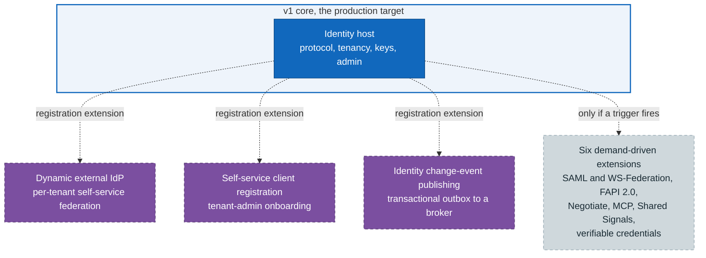

# Evolution beyond v1

> **Part of:** the [Software Architecture Document](README.md), decisions and evolution.

Where the architecture goes after v1, and, just as importantly, **what v1 costs today for
each of those futures**. The answer is meant to be "almost nothing", and this view exists to
make that checkable rather than asserted.

There are **two tiers**, and confusing them is the main risk this view guards against.

| Tier | What it means | Count | Status |
|---|---|---|---|
| **Accepted, design-complete, not built** | The decision is binding, the mechanism is designed, the hard part is spike-proven, and no production code exists | 3 | `accepted` |
| **Proposed, demand-driven** | The shape is recorded so it is not rediscovered, with an explicit revisit trigger. **No commitment to build** | 6 | `proposed` |

A tier-one feature will be built; the question is when. A tier-two feature will be built **if
its trigger fires**, and recording it is how a future "should we support X" conversation
starts from evidence rather than from scratch.

## 1. How anything attaches without touching v1

**Every dashed edge is a kill switch, and the kill switch is composition rather than
configuration.** A feature is present only if its registration extension is called. Not calling
it means the module is never registered, so v1 is exactly what the preceding views describe,
with nothing to disable and no flag to get wrong. A configuration flag would leave the code
path present and one mistake away from live; not registering leaves nothing to be mistaken
about (ADR-0071).

## 2. Tier one: accepted, designed, not built

### Dynamic per-tenant external federation (ADR-0034)

**What.** A tenant administrator registers an upstream OIDC provider for their own tenant at
runtime, with no redeploy. v1 federation is static and configured out of band (ADR-0002); this
makes it dynamic and per-tenant.

**Shape.** A dynamic authentication-scheme provider materialises handler options per tenant
from a control-plane table under row-level security. It deliberately does **not** register one
framework scheme per tenant, which would neither scale nor survive without a restart.

**Evidence.** Gate spike A-8 ran on 2026-07-10 and passed 8 of 8 (verification record V28), and
four findings were folded back into the design rather than merely confirming it, which is why
the spike ran first. One of the four is worth singling out: **F-A8-4 was surfaced not by the
spike but by an adversarial review of it**, which then tightened three of the tests. A spike
proves what it was asked; reviewing the spike is what finds what it was not asked (ADR-0034).

**Cost to v1: awareness pointers only.**

### Self-service client registration (ADR-0035)

**What.** A tenant administrator onboards their own applications, capability-gated, audited,
and dual-controlled where the action is sensitive. Scoped as v2.1, after the federation work.

**Shape, and the distinction that matters.** This is **not** an interim implementation of the
standard dynamic-registration endpoint. It is a **different mechanism chosen deliberately**:
registration through the authenticated Admin API, building on the delegated-admin model. The
standard endpoint separately waits on the protocol engine (ADR-0014). So if a native endpoint
ever ships, it **retires nothing**; it becomes a new option to evaluate. Treating this as a
placeholder would put a decision on the retirement list, which is a mistake worth naming
because the two shapes look alike from a distance.

**Cost to v1: none beyond the decision.**

### Identity change-event publishing (ADR-0071)

**What.** Nami publishes its own change facts outward to backend consumers that are **not** OIDC
relying parties. Producer only, with no inbound dependency on any consumer, so a consumer
outage can never affect authentication.

**Shape, in two tracks.** Security signals for relying parties **reuse** v1's back-channel
logout and revocation and are not rebuilt (ADR-0019, ADR-0039); the new build is a
transactional outbox drained by a relay through a thin transport port, carrying CloudEvents
1.0 on a single stream with a tenant identifier and row-level security.

**Evidence.** Gate spike A-9 passed 10 of 10, and **three of its findings reached back into
v1** rather than staying in the v2 design: the `uuid` tenant-column cast, the non-monotonic
UUIDv7 needing a separate sequence column, and broker deduplication differing enough that
consumer-side deduplication is mandatory regardless of broker. A v2 spike correcting v1 is the
clearest argument for spiking before committing (ADR-0071, ADR-0036).

**Cost to v1: one emit at seams that already fire**, and nothing on the hot issuance path.

## 3. Tier two: proposed, demand-driven

Six extensions are recorded with their intended approach and an explicit revisit trigger, and
**none is a commitment**. The value of writing them down is that the analysis is not repeated
and that a request for one can be answered with a position rather than a shrug.

**All six share a shape, and two parts of it matter more than the list itself.** First, a
trigger firing does **not** open a shortcut into the codebase: the recorded wording is that the
item then earns a **full ADR and design, and a spike where the security surface warrants one**,
before any build, at which point the proposed record is superseded or promoted. Second, and
less obvious, **the recorded analysis is treated as having a shelf life**: several of these
triggers require re-reading the then-current specification and re-checking the ecosystem
"rather than assuming it improved". So what is captured here is a starting position, not a
conclusion to be executed later.

| Extension | Recorded trigger |
|---|---|
| SAML 2.0 and WS-Federation (ADR-0055) | Enterprise, public-sector, and health customers that still require it. The ADR states plainly that its absence is **the single largest gap** against mainstream commercial identity servers, which is why it is recorded rather than left implicit |
| FAPI 2.0 high-assurance profiles (ADR-0056) | Entering a regulated open-banking or open-finance context. This is also what reopens the message-signing tier (JARM, RAR, JAR) that v1 de-scoped for want of a use case (ADR-0014) |
| Windows integrated authentication (ADR-0057) | On-premises Active Directory environments where a domain-joined user expects to reach the application without a separate login. Left out of v1 as an on-premises rather than general need |
| Authorization server for MCP servers (ADR-0064) | Real demand rather than speculation, then re-reading the then-current authorization revision for new required endpoints, client-registration changes, and tightened audience rules. Separately, rich authorization requests are the trigger recorded against this ADR in the advanced-flows design |
| Continuous access evaluation via Shared Signals (ADR-0068) | Nami actively developing continuous access evaluation, **or** the ecosystem gap closing: a maintained .NET library appearing, or real receivers existing among consumers. Deferred on **evidence**, not preference: the specifications reached Final in September 2025, there is no widely adopted .NET transmitter or receiver, and vendor support is uneven |
| Verifiable credentials via OpenID4VC (ADR-0069) | Nami actively developing credential issuance, then confirming the then-current issuance and presentation profiles and the applicable regulatory requirements, deciding build-versus-adopt for a permissive library, and settling the format set |

**ADR-0068 is the pair most easily confused with tier one.** Change-event publishing (ADR-0071)
is a Nami-shaped CloudEvents stream to backend microservices, accepted and spike-proven; Shared
Signals is a **standards-based transmitter** emitting security-event tokens to external
receivers, and stays proposed. They are complementary rather than overlapping, and the
ecosystem evidence gathered for the first is precisely why the second is not yet accepted.

## 4. The principles that make this safe

* **Additive, never breaking.** A future feature adds modules and awareness pointers and
  changes no v1 logic. If none is ever built, v1 is complete on its own.
* **Gate-spiked before commitment, not after.** Each tier-one feature has a passed spike
  proving the hard part is real. Both spikes produced findings that **changed** the design,
  which is what a spike is for; a spike that only confirms was not testing the risky part.
* **Kill switch by composition**, per section 1.
* **A port where the thing is swappable, an extension where it is not.** The event transport is
  a port with one reference adapter and named extension points; dynamic federation is a scheme
  provider rather than a fork of the pipeline.
* **A proposed decision is not a stack entry.** It carries no stack-of-record marker and adds
  no dependency, so recording an option costs nothing at build time (ADR-0061).

## Sources

* ADR-0034 (dynamic per-tenant federation, the scheme-provider shape, and spike A-8 with V28),
  ADR-0035 (self-service registration as a chosen mechanism rather than an interim, and its
  v2.1 scope), ADR-0071 (the outbox, the two tracks, the reuse of ADR-0019 and ADR-0039, and
  spike A-9 with V29 and its three findings that reached back into v1), ADR-0036 (the UUIDv7
  caveat one of those findings confirmed), ADR-0014 (the standard registration endpoint that
  waits on the engine, which is what ADR-0035 is deliberately not an interim for), ADR-0002
  (the static v1 federation this evolves from).
* ADR-0055, ADR-0056, ADR-0057, ADR-0064, ADR-0068, and ADR-0069 (the six proposed extensions
  and their revisit triggers), ADR-0061 (why a proposed ADR is not a stack entry).
* Reconciled against the design corpus's evolution view on 2026-07-26. Taken from it: the
  attach-by-kill-switch diagram, the per-feature what-shape-evidence-cost structure, the spike
  findings, and the evolution principles. **Extended rather than copied in one structural way:**
  the corpus view describes three v2 features, which is its whole evolution story, while this
  repository additionally carries six `proposed` demand-driven extensions that the corpus does
  not have. Presenting only the three would have implied the roadmap is closed, so the view is
  organised into two tiers with the difference between them stated, since "accepted but not
  built" and "recorded but not committed" answer very different questions. Also stated more
  sharply than the corpus does: that the self-service registration feature is a chosen
  alternative rather than an interim, because the corpus's own framing invites the opposite
  reading.

---

[Prev: Decisions index](17-decisions-index.md) · [Index](README.md)
