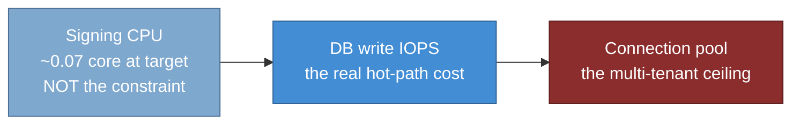

# Performance and scalability

> **Part of:** the [Software Architecture Document](README.md), quality and operational
> views.

How the architecture meets the throughput, latency, and scalability attributes of
[20-nfr-catalogue](20-nfr-catalogue.md). The standing caveat carries over: the
10k-concurrent-user goal is an architecture target proven by our own load test, and the
enforced gate is the SLO rather than any throughput figure (ADR-0041).

## 1. Size by request rate, not by concurrent users

Concurrent users are people with think time, not requests in flight. Modelling all traffic as
one 30-second-think-time tuple is wrong for a machine-driven endpoint: it **overstates by
tens of times** and, worse, it hides which workload actually drives load. So the workload is
decomposed. These figures are interim and load-test-derived, with the mix awaiting Product
ratification.

| Workload | Parameters | Interim request rate |
|---|---|---|
| Interactive login | 10k users, 3 logins per user per day | ~1 to 3 per second |
| **Silent refresh, the dominant steady driver** | Access-token TTL 900 s, 10k users | ~11 per second steady, 30 to 55 at peak |
| Machine-to-machine client credentials | A separate, bursty ceiling | ~200 per second, or zero if unused |

**The counter-intuitive result is the useful one: interactive login is not the driver, silent
refresh is.** Each silent refresh is a **double write** (insert the new refresh token, revoke
the old) because rolling rotation is retained (ADR-0004), whereas validating the
self-contained JWT access token is a **zero-write** operation. So the load a deployment feels
scales with token lifetime and population, not with how often people log in.

## 2. Bottlenecks, in the order they actually bind

**Signing CPU is not the binding constraint, and assuming it is misdirects both sizing and
algorithm choice.** At the 10k-user target, signing costs roughly **0.07 of a core**. Measured
on .NET 10, RS256 signs at about 1,000 to 1,570 per second per core and ES256 at about 4,300
to 4,800, so ES256 is about **3 to 4 times** faster to sign, not the folklore 20 times. And
RS256 **verifies** about 6 to 9 times faster than ES256, so defaulting to ES256 would move
cost onto **every resource server** to save a resource that was never scarce. RS256 stays the
baseline and ES256 remains config-selectable through the signing-credential source, which is
the right shape for a deployment with an unusually high machine-to-machine mint rate
(ADR-0005).

**Database write IOPS is the real hot-path cost.** The design response is structural rather
than tuning: issue a self-contained JWT access token so the access path writes **nothing**,
and persist only the refresh token. Silent refresh still double-writes and therefore remains
the dominant write driver. UUIDv7 primary keys reduce B-tree fragmentation on exactly this
path, which is one of the reasons that key strategy was chosen rather than a side effect
(ADR-0036, ADR-0037).

**The connection pool is the multi-tenant ceiling, and the arithmetic is what makes it
obvious.** Total connections are `tenants x pool size x instances`. A Silo fleet at the
default per-connection-string pool size of 100 blows past a typical PostgreSQL ceiling by
**two orders of magnitude**, because the driver's pool is keyed **per connection string** and
each Silo tenant has its own. The rule is therefore to keep that product under the server
ceiling: a per-tenant maximum pool size of about **5 to 10** with a minimum of 0, and a
**bounded acquisition timeout** so exhaustion fails fast to a load-shed 503 rather than
hanging a thread. Transaction-mode pooling in front of PostgreSQL is used **where Silo scale
requires it** rather than by default, and where used it must itself be highly available and
must set the tenant variable with `SET LOCAL` inside the request transaction so it cannot leak
across a multiplexed connection (ADR-0018, ADR-0037, ADR-0074).

For the Pool-mode operational context, **v1 registers the DbContext non-pooled**, because a
naively pooled context leaked the previous tenant in spike A-4 test T7. Pooled-plus-mutable
tenant identity is a deferred, spike-gated optimisation, not a tuning knob to reach for
(ADR-0018).

## 3. Sizing

Every figure is load-test-bound rather than asserted.

| Dimension | Pool deployment | Silo deployment |
|---|---|---|
| Signing | RS256 baseline, ES256 config-selectable | RS256 |
| Access token | Self-contained JWT, zero write | Same |
| Instances | Start around 3, scale on CPU and active-request count | 3 or more |
| Driver maximum pool size | 50 to 100 | **5 to 10 per tenant** |
| Connection broker | Direct, or a pooler if measured need appears | A pooler where scale requires it, highly available |
| Server connection ceiling | Sized so `tenants x pool x instances` stays under it | Same rule, fronted by the pooler where present |

## 4. Scalability

The hosts are **stateless with no server affinity**, which is what makes scale-out horizontal
and rolling deploys safe (ADR-0031, ADR-0072). All shared state is externalised:

* The data-protection keyring and signing keys are shared across nodes under the **same fixed
  application name**, on a durable store independent of Redis (ADR-0011, ADR-0006).
* Tokens, authorizations, and sessions live in PostgreSQL; the distributed cache and the DPoP
  replay set live in Redis (ADR-0003, ADR-0014).
* Forwarded headers are processed early in the pipeline so scheme, host, and therefore the
  per-tenant issuer are correct behind a proxy, and only from trusted proxies (ADR-0073).
* **The engine's own entity cache is per-request, so it needs no cross-node backplane at
  all.** Any configuration cache added on top does need one, which is why the configuration
  cache uses a backplane while the entity cache does not (ADR-0039).

**A read replica for read-heavy configuration and discovery is an optional lever and
explicitly not v1.** Adopting it means accepting a replication-lag caveat on configuration
reads and deciding how that interacts with the 30-second propagation bound. The v1 topology
talks to the primary, and the standby is a failover target rather than a read replica
(ADR-0074, ADR-0039).

## 5. Overload controls, caching, and the release gate

**Rate limiting and load shedding are different controls and are not interchangeable.** Rate
limiting answers "this caller is asking too often" with 429 and is about quota and fairness.
Load shedding answers "the service is past its instantaneous capacity" with 503 and a
`Retry-After`. Pool saturation surfaces through the bounded acquisition timeout as a 503,
never as a hung thread (ADR-0040, ADR-0018).

Caching on the read side: an output cache for the anonymous discovery and JWKS documents,
shared through Redis and **tag-evicted after key rotation** so a rotation cannot leave a stale
JWKS published; and a bounded introspection-result cache of about five minutes for reference
tokens, which is an explicit trade against revocation staleness rather than a free win
(ADR-0039, ADR-0048).

**Load-test methodology** is part of the architecture because the wrong method produces
confidently wrong numbers:

* An **open model** (constant or ramping arrival rate) rather than a closed one, because a
  closed model produces **coordinated omission** and hides exactly the tail the SLO is about.
* Warm-up discarded, steady state measured.
* **p50, p95, and p99 reported, never the average.**

**The gate**: the load test enforces the latency threshold in CI so a breach **fails the
build** rather than producing advice, and widening a target requires re-ratifying at the
single source of truth rather than loosening one file (ADR-0041).

## Sources

* ADR-0041 (the self-load-tested posture, the percentile discipline, the SLO as a CI gate, and
  the re-ratification rule), ADR-0005 (the plain signed JWT access token, the RS256 baseline,
  and the measured signing numbers behind the algorithm choice), ADR-0004 (rolling rotation,
  which is why silent refresh double-writes).
* ADR-0018 (the pool arithmetic and its rule, the bounded acquisition timeout, the non-pooled
  Pool context and spike A-4 test T7, and the deferred pooled-plus-mutable option), ADR-0037
  (transaction-mode pooling **where Silo scale requires it**, and the `SET LOCAL` requirement
  under it), ADR-0074 (pooler high availability where used, and the read replica as an
  optional non-v1 lever), ADR-0036 (UUIDv7 and its index-locality effect on the write path).
* ADR-0031 and ADR-0072 (statelessness and no session affinity), ADR-0011 and ADR-0006 (keys
  shared under a fixed application name on a store independent of Redis), ADR-0003 and
  ADR-0014 (what lives in PostgreSQL versus Redis), ADR-0073 (forwarded headers early and only
  from trusted proxies), ADR-0039 (the per-request entity cache needing no backplane, the
  configuration cache that does, the propagation bound, and the JWKS output cache),
  ADR-0048 (the introspection-result cache traded against revocation staleness), ADR-0040
  (rate limiting versus load shedding).
* Reconciled against the design corpus's performance view on 2026-07-25. Taken from it: the
  size-by-request-rate framing with its overstatement warning, the workload decomposition, the
  bottleneck ordering with the finding that signing CPU is not the constraint, the sizing
  table, the scalability inventory, and the load-test methodology including the
  coordinated-omission reason for an open model. Corrected rather than imported: the corpus
  calls transaction-mode pooling **mandatory for Silo**, where ADR-0037 says "where Silo scale
  requires it" and ADR-0018 makes the per-tenant pool-size cap the primary rule with the
  pooler as one response; this is the same over-claim already corrected in the container and
  deployment views, and the corpus is its origin.
* **One corpus item deliberately not carried:** the corpus specifies a **second** CI gate, a
  crypto-path throughput floor on the signing and encryption path alongside the latency gate.
  It is a reasonable regression detector, but ADR-0041 defines the gate and this layer never
  adds to a decision. Recorded as a candidate for ADR-0041 rather than asserted here. Its
  stated rationale ("crypto is the hotspot") also needs reconciling with this view's own
  finding that signing CPU is not the binding constraint, which is a further reason it belongs
  in a decision rather than in a diagram.

---

[Prev: Quality attributes](20-nfr-catalogue.md) · [Index](README.md) · Next: [Reliability, backup, and DR](22-reliability-backup-dr.md)
