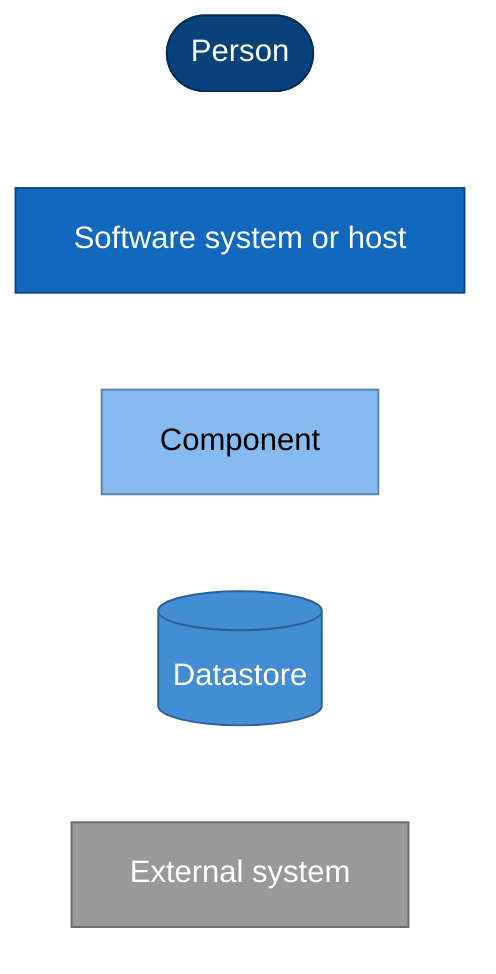

# Nami Software Architecture Overview

A high-level, diagram-first view of what Nami is and how it is built, meant to be
understood quickly by an architect, a CTO, or a new contributor. It synthesizes
the decisions recorded in the [ADR corpus](../adr/README.md); the ADRs remain the
authority. Where this overview and an accepted ADR ever disagree, the ADR wins and
this page is the bug.

> Status: reviewed. A living overview kept in sync with the ADR corpus, which
> remains the authority. The C4 model is used at Level 1 (context), Level 2
> (containers), and Level 3 (the IdP core). Diagrams are Mermaid and render on
> GitHub. Assembly and package names follow ADR-0065.

## How this document is organized

| View | Page | Contents |
|---|---|---|
| Context (C4 L1) | [01-context](01-context.md) | Actors and external systems around Nami |
| Domain | [02-domain](02-domain.md) | Bounded contexts and the ubiquitous language |
| Containers (C4 L2) | [03-containers](03-containers.md) | The host processes, package graph, and datastores |
| Components (C4 L3) | [04-components](04-components.md) | The IdP core internals and its subsystems |
| Data | [05-data](05-data.md) | The logical data model across the four contexts |
| Runtime views | [06-runtime-views](06-runtime-views.md) | Key end-to-end sequences |
| Cross-cutting | [07-cross-cutting](07-cross-cutting.md) | Concerns that span every container |
| Deployment | [08-deployment](08-deployment.md) | Topology, HA, and the edge |

## 1. Purpose and positioning

Nami is an open-source, multi-tenant OAuth 2.0 and OpenID Connect identity
provider for .NET, built on OpenIddict, and released under Apache-2.0. It is a
permissive alternative to the commercial identity servers. The protocol engine is
OpenIddict, which Nami never hand-rolls; Nami's value is the opinionated,
batteries-included layer on top: multi-tenancy, delegated administration,
no-restart key rotation, administration, cloud-agnostic adapters, observability,
and configuration developer-experience (ADR-0027).

The architecture matches commercial-grade coverage on the common surface
(authorization code with PKCE, client credentials, refresh, device flow, PAR,
introspection, revocation, mTLS and DPoP sender-constrained tokens, passkeys,
server-side sessions, back-channel logout) and leads on three things that are
first-class here by design:

* **Native multi-tenancy**: tiered Pool and Silo isolation with a delegated
  administration model (ADR-0001, ADR-0010, ADR-0033).
* **No-restart key rotation**: signing and encryption keys rotate without a
  process restart, with provider-agnostic disaster recovery (ADR-0011, ADR-0012,
  ADR-0006).
* **Cloud-agnostic ports**: key store, secret store, data protection, email, and
  observability sit behind ports whose default runs offline on PostgreSQL with no
  cloud dependency (ADR-0006, ADR-0009, ADR-0038, ADR-0022).

## 2. Non-goals for v1

Deliberately out of scope for the first release, each with an owning decision:
SAML 2.0 and WS-Federation (proposed, ADR-0055), FAPI 2.0 high-assurance profiles
(proposed, ADR-0056), Windows integrated authentication (proposed, ADR-0057),
CIBA (skipped, ADR-0014), the standards DCR endpoint (waits for the OpenIddict 8.0
native implementation), front-channel logout and `check_session_iframe` (dropped,
ADR-0019), and JARM, RAR, and EdDSA (de-scoped, ADR-0014). Dynamic per-tenant
federation (ADR-0034) and self-service client registration (ADR-0035) are planned
additive features for v2 and v2.1.

## 3. Architecture principles

The structure follows a small set of binding principles (ADR-0058, ADR-0024):

* **Hexagonal shell, vertical slices inside.** A dependency rule with ports and
  adapters only at the infrastructure edge; feature logic is organized as vertical
  slices, not technical-layer folders.
* **One extension mechanism for the protocol.** Custom protocol behavior is an
  inserted OpenIddict event handler at a named, order-anchored position, never a
  fork of the engine (ADR-0021, ADR-0024).
* **Managers, not stores.** Application code depends on `IOpenIddict*Manager`
  facades, never on the underlying stores or `DbContext` directly.
* **Deny by default on claims.** A single claims choke-point emits nothing to a
  token unless explicitly declared for a destination (ADR-0005).
* **Isolate tenants in two layers.** An EF query filter is the primary control;
  PostgreSQL FORCE row-level security is the backstop (ADR-0001, ADR-0049).
* **Audit is a separate lane.** A tamper-evident hash-chain audit trail is kept
  strictly apart from operational logging and telemetry (ADR-0008, ADR-0022).
* **Version-adaptation is first-class.** Every dependency on OpenIddict, EF Core,
  Npgsql, and Finbuckle internals is a catalogued seam with a contract-regression
  test, re-verified on every bump (ADR-0021).
* **Permissive dependencies only.** MIT, Apache-2.0, or BSD-class, enforced by a
  license-scan gate (ADR-0026). The committed stack of record is ADR-0061.

## 4. Diagram conventions

Every diagram uses the same C4-semantic colour key:

## 5. Decision references

This overview is a synthesis. The authority for every choice is the
[ADR corpus](../adr/README.md); the committed technology stack with its selection
rules is [ADR-0061](../adr/0061-technology-stack-of-record.md); the naming and
package conventions are [ADR-0065](../adr/0065-coding-and-naming-conventions.md);
and deferred policy and sign-off items are consolidated in the
[Pre-GA Ratification Checklist](../PRE-GA-RATIFICATION-CHECKLIST.md).

Detailed per-feature designs and the phased implementation roadmap will be added
alongside these pages as separate deliverables.

---

Next: [Context (C4 L1) →](01-context.md)
