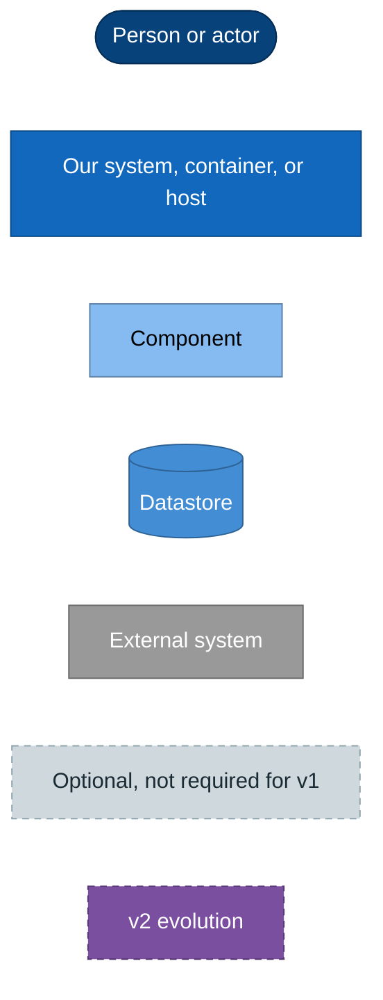

# Nami Software Architecture Document (SAD)

**System:** Nami, an open-source multi-tenant OAuth 2.0 / OpenID Connect identity
provider for .NET, built on OpenIddict 7.5 and .NET 10, released under Apache-2.0.

**Notation:** the [C4 model](https://c4model.com) at Levels 1 to 3, plus supporting
sequence, ER, and deployment diagrams, all rendered as Mermaid.

**Structure:** an arc42-flavored, ISO/IEC/IEEE 42010-conformant architecture
description: structural views (C4), quality and operational views, a decisions
index, and supporting views (stakeholders and concerns, risks and technical debt,
threat model, glossary).

This folder is the **architecture layer** of the repository. It gives the decisions
in [`docs/adr/`](../adr/README.md) and the detail in [`docs/design/`](../design/README.md)
a single coherent picture. It does not replace either: it points into them as the
authoritative source, and where it disagrees with one of them, this layer is the bug.

## 1. How to read this SAD

Read top to bottom for the full picture, or jump to the view that answers your
question. Each topic is one file.

### Structural views (what the system is)

| File | Topic | C4 / diagram |
|---|---|---|
| [00a-introduction-and-scope](00a-introduction-and-scope.md) | Introduction, scope, and what is deliberately out of it | - |
| [00b-drivers-and-constraints](00b-drivers-and-constraints.md) | Architecture drivers, quality targets, and hard constraints | - |
| [01-context](01-context.md) | System context: actors and external systems | C4 L1 |
| [02-domain](02-domain.md) | Bounded contexts and the ubiquitous language | - |
| [03-containers](03-containers.md) | Host processes, package graph, and datastores | C4 L2 |
| [04-components](04-components.md) | The IdP core internals and its subsystems | C4 L3 |
| [05-data](05-data.md) | Logical data model and database topology | ER + flow |
| [06-runtime-views](06-runtime-views.md) | Sixteen key end-to-end sequences, each with the invariants it must preserve | Sequence |
| [08-deployment](08-deployment.md) | Topology, HA, and the edge | Deployment |

### Quality and operational views (how the system behaves)

| File | Topic | Covers |
|---|---|---|
| [07-cross-cutting](07-cross-cutting.md) | Concerns that span every container | Tenancy, security, observability, configuration |
| [10-nfr-catalogue](10-nfr-catalogue.md) | What must be true, with a way to measure it | Quality-attribute targets, the SLO and error budget, ratification status |
| [11-security-architecture](11-security-architecture.md) | The primary quality attribute, given its own view | Trust boundaries, the three isolation layers, token and key protection, administration controls, audit, abuse resistance |
| [12-performance-and-scalability](12-performance-and-scalability.md) | How the throughput and latency attributes are met | Capacity model, bottleneck ordering, sizing, overload controls, the load-test gate |
| [13-reliability-backup-and-dr](13-reliability-backup-and-dr.md) | Behaviour under failure, and the cost of getting back | High availability, resiliency, per-store recovery objectives, backup, DR drills |
| [14-schema-migration-and-evolution](14-schema-migration-and-evolution.md) | How the schema and the tenant fleet change safely | Migration as a build artifact, the traffic gate, expand-and-contract, the tenant lifecycle |
| [15-observability-and-monitoring](15-observability-and-monitoring.md) | How it is seen, and how objectives become alerts | The two lanes, metrics and cardinality control, burn-rate alerting, the canary |
| [16-operations-and-maintenance](16-operations-and-maintenance.md) | Running it and keeping it healthy | Runbooks, background jobs, key operations, the two break-glass paths, upgrade cadence |

### Decisions and evolution

| File | Topic | Covers |
|---|---|---|
| [`../adr/README.md`](../adr/README.md) | The ADR corpus | Every decision of record, with context and rationale |
| [17-decisions-index](17-decisions-index.md) | The **reverse** index: which views cite each decision | Generated ADR-to-view map, the measured cross-cutting set, and the one decision no view cites |
| [18-v2-evolution](18-v2-evolution.md) | Where the architecture goes after v1, and what v1 pays for it | Three accepted-but-unbuilt features, six proposed demand-driven extensions, kill-switch by composition |

> The supporting views
> (stakeholders and concerns, risks and technical debt, threat model, glossary)
> are being added in sequence. This index gains a row in the same change that adds
> the file, so what is listed here always exists.

Numbering is stable: a file keeps its number once other documents link to it, so
the reading order above is set by this index rather than by the filenames.

## 2. C4 legend

The SAD uses four abstraction levels of the C4 model and stops at Level 3:

- **Level 1, System Context** ([01-context](01-context.md)): Nami as one box, with
  the people and external systems it interacts with. Audience: everyone.
- **Level 2, Container** ([03-containers](03-containers.md)): the separately
  deployable or runnable units (the IdP host, Admin API, Admin App and BFF,
  databases, cache, message broker) and how they communicate. Audience: architects
  and operators.
- **Level 3, Component** ([04-components](04-components.md)): the major building
  blocks inside the important containers (protocol pipeline, tenant resolution,
  key-rotation service, admin security module, outbox relay). Audience: developers.
- **Level 4, Code** is deliberately **out of scope** for this layer. Class-level and
  field-level detail belongs to the detailed designs in
  [`docs/design/`](../design/README.md).

Structural views are drawn as **styled Mermaid flowcharts that follow C4 levels and
semantics**, rather than the C4-specific Mermaid diagram type, which renders cramped
and cannot be coloured consistently. Every diagram shares one colour system, the
classic C4 blue palette, so a reader never has to ask what a box is.

**Visual conventions, consistent across every diagram here:**

- A solid arrow is a synchronous call. A dashed arrow is an asynchronous or event
  flow, or an optional or v2 relationship. The arrow label states the protocol or
  the intent.
- Shape and colour carry fixed meaning:


```mermaid
graph LR
  P([Person or actor]):::person
  H[Our system, container, or host]:::host
  C[Component]:::comp
  D[(Datastore)]:::store
  X[External system]:::ext
  O[Optional, not required for v1]:::optional
  V[v2 evolution]:::v2

  classDef person fill:#08427b,stroke:#052e56,color:#ffffff
  classDef host fill:#1168bd,stroke:#0b4884,color:#ffffff
  classDef comp fill:#85bbf0,stroke:#5d82a8,color:#000000
  classDef store fill:#438dd5,stroke:#2e6295,color:#ffffff
  classDef ext fill:#999999,stroke:#6b6b6b,color:#ffffff
  classDef v2 fill:#7b4fa0,stroke:#54356f,color:#ffffff,stroke-dasharray:5 4
  classDef optional fill:#cfd8dc,stroke:#90a4ae,color:#1a2b34,stroke-dasharray:5 4
```

| Class | Colour and shape | Meaning |
|---|---|---|
| `person` | Dark blue stadium | Person, actor, or role |
| `host` | Medium blue rectangle | Our system, container, or host |
| `comp` | Light blue rectangle | A component inside a container (C4 L3) |
| `store` | Blue cylinder | Datastore (database or cache) |
| `ext` | Grey rectangle | External system (not ours) |
| `v2` | Purple dashed | v2 evolution, kill-switched off in v1 |
| `optional` | Slate dashed | Optional, not required for v1 |

Subgraphs mark a system boundary or the container being decomposed. Node labels stay
short so nothing overlaps; the detail lives in the table beneath each diagram.

## 3. Where this layer sits (authority order)

```text
docs/adr/                            decisions and why      (authority for a decision)
        |
docs/design/                         per-feature detail     (authority for how it is built)
        |
docs/architecture/  <- THIS LAYER    the coherent picture across all views
        |
docs/kb/                             evidence and lessons   (how we know)
docs/PRE-GA-RATIFICATION-CHECKLIST.md  the deferred human sign-offs
```

Authority runs upward, not downward:

- For a **decision**, an accepted ADR is the authority and is binding until
  superseded. If this layer contradicts one, this layer is corrected.
- For **implementation detail**, the detailed design is the authority. If this layer
  contradicts one, this layer is corrected.
- This layer **never introduces a decision** that is not already recorded in an ADR.
  Where a topic it must cover is genuinely undecided, it is labelled an open item
  and, if a human owner must settle it, mirrored into the
  [pre-GA ratification checklist](../PRE-GA-RATIFICATION-CHECKLIST.md).

## 4. Verification discipline

Every file here follows the repository conventions in
[`CLAUDE.md`](../../CLAUDE.md), in particular:

1. **Read the whole relevant set first.** For each topic, the ADR of record, the
   detailed design, and the supporting evidence are enumerated and read in full, not
   sampled.
2. **Verify before asserting, and cite or research.** A claim is reconciled against
   the ADR of record and, where it is externally checkable (an RFC, a package
   version, a database behaviour), against the primary source. No claim is written
   here without a source, and where two sources disagree the disagreement is
   resolved at the primary source rather than by preferring one document.
3. **Flag what is not settled.** An optional lever, an unratified number, or a
   compliance question is labelled as such rather than presented as decided. A
   read-replica read/write split, for example, is an optional scale lever and not a
   v1 requirement.
4. **Every file ends with a `Sources` section** naming the exact documents it
   derives from. ADR cross-references are machine-checked by
   [`scripts/check-adrs.sh`](../../scripts/check-adrs.sh), so an `ADR-NNNN` written
   here must resolve to a real ADR.

## 5. Scope of claims

This is a **technical architecture description**. It asserts no legal or regulatory
compliance: no statement here is a verdict on GDPR, on a data-residency regime, or
on any other legal obligation. Those verdicts belong to the Legal and
data-protection owners of whoever deploys Nami, and the sign-offs this project
defers to a human owner are consolidated in the
[pre-GA ratification checklist](../PRE-GA-RATIFICATION-CHECKLIST.md).

Nami is an independent open-source project. Names of third-party projects,
standards bodies, and packages appear only for factual identification.

---

Next: [Introduction and scope](00a-introduction-and-scope.md)
