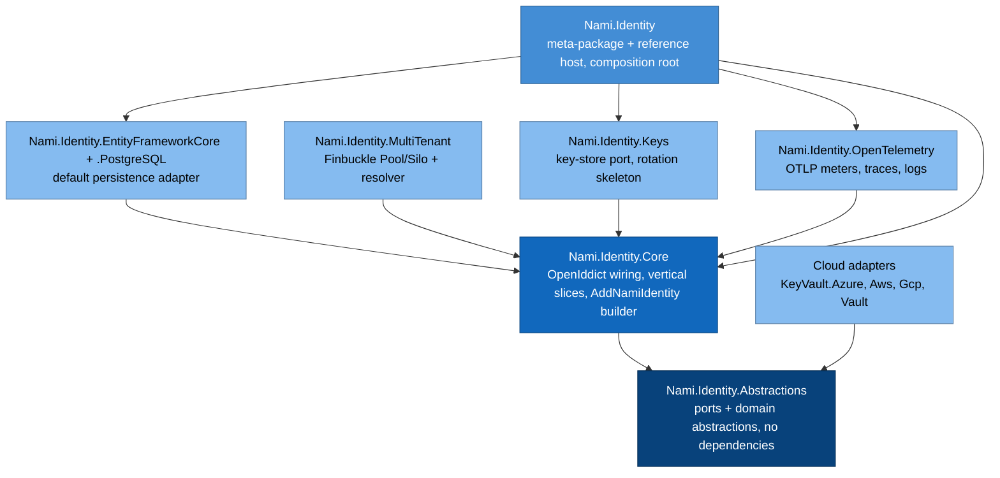
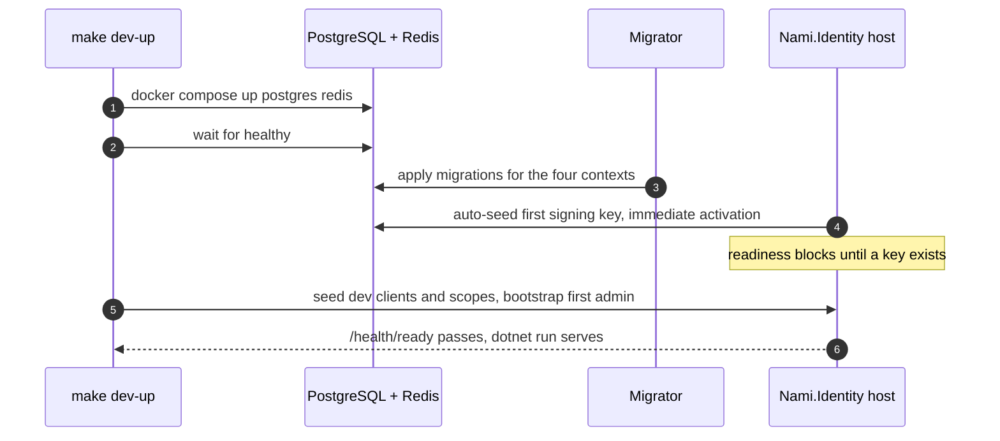

# Foundations and solution structure (detailed design)

## Purpose and scope

The buildable skeleton that every later phase plugs into: the solution laid out
as a shippable NuGet package graph, the hexagonal dependency rule enforced, the
four DbContexts and the cloud-agnostic ports declared, the ergonomic fail-closed
configuration layer, central package management with a pinned OpenIddict, and the
CI gates. It is Phase 01 of the roadmap and unlocks the data tier (02, planned).

In scope: project graph and references, the ports catalog, composition and the
fluent builder, the configuration layer, versioning and package management, health
and first-run, and the CI gate set. Out of scope (owned by later designs): the
concrete schema and tenancy internals (02), the protocol wiring (04), and key
rotation internals (09); this doc creates their homes and seams.

## Decisions realized

| Decision | What this design applies |
|---|---|
| ADR-0024 | Hexagonal shell (dependency rule, ports/adapters at the edge) with vertical slices inside; ArchUnitNET enforcement |
| ADR-0027 | Ship as a NuGet meta-package plus a reference host; granular sub-packages; `AddNamiIdentity()` builder; MinVer lock-step versioning |
| ADR-0065 | The `Nami.Identity.*` assembly and namespace roots; `.editorconfig` + analyzers; `Features/<Area>/<UseCase>/` slice folders |
| ADR-0052 | The ergonomic, fail-closed client/scope declaration layer |
| ADR-0044 | Public API as a versioned seam (PublicApiAnalyzers at error severity) |
| ADR-0026 | Permissive-OSS-only dependencies, CI license-scan gate |
| ADR-0030 | .NET LTS-to-LTS cadence; single target-framework knob; multi-target libraries |
| ADR-0031 / ADR-0032 | 12-factor config: `Nami:Section:Key` keys, no baked secrets, stdout/OTLP logs |
| ADR-0006 / ADR-0009 | Cloud-agnostic ports with a database-backed default adapter |
| ADR-0025 | docker-compose dev dependencies, first-run order, health/readiness |

## Component and interface design

### Package graph

The solution is laid out as the package graph it ships as, so productization is
packaging, not a refactor (ADR-0027). Arrows mean "depends on".

The **dependency rule** (ArchUnitNET-enforced, ADR-0024): `Abstractions` depends
on nothing; `Core` depends only on `Abstractions` plus OpenIddict; adapters depend
on `Core`/`Abstractions` plus their own SDK; the host composes everything. `Core`
must not reference any adapter, EF provider, or cloud SDK.

Ratified names (ADR-0065): `Nami.Identity` (meta-package and reference host),
`Core`, `Abstractions`, `Users`, `Bff` (+`.Bff.Yarp`), `Admin.Api`, `Admin.App`,
`Contracts`, `Admin.Contracts`. The finer split shown above (`EntityFrameworkCore`,
`MultiTenant`, `Keys`, `OpenTelemetry`, `Validation`, and the cloud adapters) is
the granular sub-package split ADR-0027 sanctions; the exact boundaries and names
are finalized at M1. The corpus name `Nami.Identity.Server` for the host is
superseded by `Nami.Identity` (ADR-0025/0027); there is no `.Server` project.
Phase-later packages (`Users`, `DPoP`, `Bff`, `Validation`, `Admin.*`) are
scaffolded when their phase arrives.

### Ports catalog (in `Nami.Identity.Abstractions`)

Declared here in Phase 01; the database-backed default adapters and later
implementations land in their owning phases.

| Port | Purpose | Default adapter | Owning ADR |
|---|---|---|---|
| `ISigningCredentialSource` | Supply the signing credential | Database (`SigningKeys`) | 0006, 0011 |
| `IEncryptionCredentialSource` | Supply the encryption credential | Database | 0005, 0006 |
| `ISecretResolver` | Resolve secrets/connection strings | Environment / database | 0009 |
| `IDataProtectionKeyStore` | Back the Data Protection keyring | Database | 0006 |
| `ISecurityEventSink` | The tamper-evident audit lane | EF hash-chain sink | 0008 |
| `ITenantStore` | Tenant registry and tier routing | Control-plane EF store | 0001 |
| `IClaimsProfileService` | Deny-by-default claim destinations | Core (Phase 03) | 0005 |
| `ICheckAccess` | Authorization decision port | DB-first (Phase 05) | 0047, 0010 |

Ports are the strictest public surface (ADR-0044): a shipped port is extended only
by a default interface method or an `IXxxV2`, never a bare added member.

### Composition and the fluent builder

The host `Program.cs` is the composition root. `services.AddNamiIdentity(cfg)`
wires OpenIddict, the four DbContexts, Finbuckle resolution, health, and the
default (database) adapters, with the minimal config being a connection string
and an issuer (ADR-0027). A `CloudProviderSelector` reads `Cloud:Provider`
(default `Database`, plus Azure/AWS/GCP/Vault) and registers the matching adapter,
so changing provider is configuration, not code.

### Configuration layer (ADR-0052)

Clients and scopes are declared through `ClientDefinition` / `ScopeDefinition`
POCOs with safe defaults, mapped by `ToDescriptor()` to OpenIddict descriptors and
applied by an idempotent, tenant-aware seeder. The mapper is **fail-closed by
construction**: a public or code client is forced to PKCE (throws if absent), a
confidential client without a credential throws, wildcard redirect URIs are
rejected, and a native app sets `ApplicationType = Native`. Config keys follow
`Nami:Section:Key` with env form `Nami__Section__Key` (ADR-0032); precedence is
env then secret-store then `appsettings.{Env}` then `appsettings` (ADR-0031).

### Versioning and package management

Central Package Management (`Directory.Packages.props`) pins every dependency;
OpenIddict is pinned lock-step at one version. `Directory.Build.props` sets
nullable, implicit usings, `TreatWarningsAsErrors`, `LangVersion latest`, and one
central target-framework knob (host single-target `net10.0`, libraries
multi-target, ADR-0030). MinVer derives one lock-step package version from a single
git tag (ADR-0027); ADR-0044 governs what may change under it.

### Key libraries and licenses

Every dependency is MIT, Apache-2.0, or BSD-class, enforced by the CI license-scan
gate (ADR-0026). The libraries wired in Phase 01:

| Library | Purpose | License | ADR |
|---|---|---|---|
| .NET 10 / ASP.NET Core | Runtime and web host | MIT | 0030 |
| OpenIddict 7.5 (AspNetCore, EntityFrameworkCore, Quartz) | OAuth/OIDC protocol engine | Apache-2.0 | 0021, 0014 |
| EF Core 10 | ORM | MIT | 0037 |
| Npgsql (+ EF Core provider) | PostgreSQL driver | PostgreSQL (BSD-like) | 0037 |
| ASP.NET Core Identity | User store | MIT | 0028 |
| Finbuckle.MultiTenant | Tenant resolution and per-tier stores | Apache-2.0 | 0001 |
| Quartz.NET | Background jobs (pruning, rotation) | Apache-2.0 | 0025 |
| OpenTelemetry .NET + `Microsoft.Extensions.Logging`/`.Telemetry` | Telemetry and PII-redacted diagnostics | Apache-2.0 / MIT | 0022 |
| MinVer | Git-tag-driven lock-step versioning | MIT | 0027 |
| TngTech.ArchUnitNET | Architecture tests | Apache-2.0 | 0024, 0060 |
| xUnit | Test framework | Apache-2.0 | 0060 |
| Testcontainers for .NET | Real-PostgreSQL integration tests | MIT | 0025, 0060 |

Phase-later designs add their own libraries (for example YARP for the BFF,
FusionCache and Polly for resiliency, Playwright for UI tests, MailKit for email),
each named with its license in its own doc. Exact version pins live in
`Directory.Packages.props` (the implementation plan), not here.

## Data model

Phase 01 only creates the four DbContexts with the correct scope; the schema and
tenancy internals are the data-tier design (02, planned).

| DbContext | Scope | Holds |
|---|---|---|
| `OpenIddictDbContext` | Tenant-scoped (non-pooled in v1) | Applications, Scopes, Authorizations, Tokens |
| `IdentityDbContext` | Global | AspNetUsers, Roles, Claims |
| `DataProtectionDbContext` | Global | DataProtectionKeys |
| `ControlPlaneDbContext` | Global | Tenants, Memberships, DelegatedAdmin, AuditLog, ServerSideSessions |

The OpenIddict context is a non-pooled `AddDbContext` in v1: spike A-4 showed a
pooled context reuses a stamped `TenantId` across tenants and leaks; the
pooled-plus-mutable variant is a post-v1 optimization (ADR-0018).

## Runtime flows

### First-run order (ADR-0025, ADR-0012)

Migrations run as a one-shot migrator (never migrate-on-startup in production,
ADR-0017); development may enable migrate-on-startup for convenience.

## Edge cases and failure modes

* **OpenIddict version drift** across sub-packages causes obscure failures; CPM
  pins one version and a contract-regression test guards bumps (ADR-0021).
* **Pooled tenant leak**: a pooled OpenIddict context leaks `TenantId`; v1 uses a
  non-pooled context (ADR-0018).
* **Degraded mode** disables validation; a startup guard forbids it in a
  token-issuing environment and emits a security event (ADR-0043).
* **Native AOT** is not enabled for the host: the OpenIddict EF stores have rough
  AOT edges.
* **Missing key at cold start**: readiness fails until the auto-seed completes, so
  no node serves without a signing key (ADR-0012).

## Security considerations

* The fail-closed mapper makes an insecure client impossible to construct, backed
  by the startup self-check re-verifying the same invariants (ADR-0052, ADR-0043).
* No secrets are baked into images; all secrets resolve through `ISecretResolver`
  (ADR-0009, ADR-0031).
* The hexagonal boundary is a security boundary too: no cloud SDK or engine type
  leaks above the adapter edge, keeping the trusted surface small (ADR-0024).
* Production logs go to stdout/OTLP only, with PII redaction on the diagnostics
  lane; audit is the separate `ISecurityEventSink` lane (ADR-0022, ADR-0008).

## Testing strategy

* **Architecture tests** (`Nami.Identity.ArchitectureTests`, TngTech.ArchUnitNET):
  Domain references no OpenIddict/EF/cloud SDK; Core references no adapter/engine;
  a slice does not reference another slice; cloud adapters stay in Infrastructure;
  the BFF does not reference `Admin.*` (ADR-0024).
* **Unit tests** for the mapper's fail-closed invariants (public-without-PKCE
  throws, confidential-without-credential throws, wildcard rejected).
* **Integration tests** on Testcontainers PostgreSQL 18 proving the four contexts
  migrate and that two tenants resolve to two `TenantInfo`s (ADR-0025, ADR-0060).
* **CI gates**: build, test, license-scan (ADR-0026), PublicApiAnalyzers at error
  (ADR-0044), ArchUnitNET, `dotnet format --verify-no-changes` (ADR-0065), and the
  docs guardrail. `/health` returns 200; changing `Cloud:Provider` swaps the
  adapter with no core change.

## Open and build-time items

* The exact granular sub-package boundaries and names beyond the ADR-0065 set
  (`EntityFrameworkCore`, `MultiTenant`, `Keys`, `OpenTelemetry`, `Validation`,
  cloud adapters) are finalized at M1 per ADR-0027; this doc treats them as the
  planned split, not ratified names. No new ADR is required unless the split
  diverges from ADR-0027's intent.
* MinVer versus an alternative version tool is a build-time pick (ADR-0027).
* The test assertion library must be permissive (ADR-0026): FluentAssertions moved
  to a commercial license at v8, so it is out. Pick an MIT/BSD alternative (an MIT
  assertions fork, or Shouldly) at M1, the same license caution ADR-0020 raised for
  the mediator library.
* The default CI provider is GitHub Actions for the OSS reference; consumers may
  swap it (ADR-0027).
* Whether to stand up a public reference host for OpenID certification is an Ops
  ratification item (ADR-0027, Pre-GA checklist).

## References

* Architecture overview: [containers](../architecture/03-containers.md),
  [components](../architecture/04-components.md).
* ADRs: 0024 (style), 0027 (packaging), 0065 (naming), 0052 (config), 0044 (API),
  0026 (licenses), 0030 (.NET cadence), 0031/0032 (12-factor/config keys),
  0006/0009 (ports), 0025 (dev/first-run), 0018 (pooling), 0021 (version seam).

---

[Index](README.md) · Next: [Data tier and multi-tenancy →](02-data.md)
