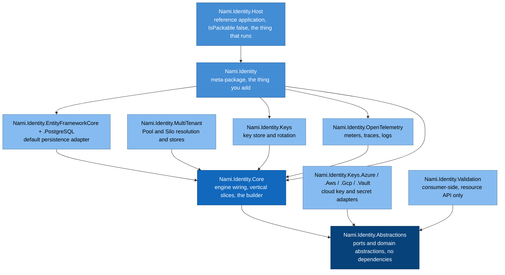
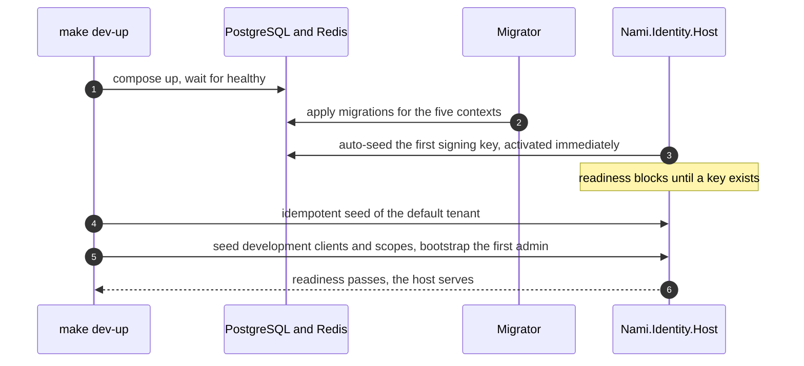

# Foundations and solution structure (detailed design)

> **Sits under:** [architecture: container view](../architecture/07-container-view.md) and
> [component view](../architecture/08-component-view.md).
> **Implementer source of record:** this document, for the solution and package structure,
> the port catalogue, the two extension axes, the composition root, and the first-run
> order. Client and scope declaration is [23](23-configuration-and-client-declaration.md);
> the seam registry and version-adaptation discipline are
> [22](22-openiddict-seam-catalogue.md); the release gates, image, and operational baseline
> are [21](21-cicd-and-deployment.md); the schema is [02](02-data.md).

The buildable skeleton every later phase plugs into, and the shape the product ships as.
The organising idea is that **productization is packaging, not a later refactor**: the
solution is laid out from day one as the package graph it will ship as, so there is no point
at which someone has to take a monolith apart.

The second idea does the same job for extensibility. A consumer must be able to change
behaviour without forking, so there are exactly **two** ways in and no third. Everything
else in this document follows from those two.

## 1. Decisions realized

| Decision | What this design applies |
|---|---|
| ADR-0024 | The hexagonal shell with vertical slices inside, and the dependency rule enforced by architecture tests |
| ADR-0027 | The meta-package plus reference-host split, the granular sub-packages, the fluent builder, and MinVer lock-step versioning |
| ADR-0065 | The ratified assembly names, the package-versus-application split, and the configuration-key shape |
| ADR-0052 | That the declaration layer exists and is fail-closed; its field model is [23](23-configuration-and-client-declaration.md) |
| ADR-0075 | The closed register of security-sensitive ports whose invariant survives an adapter swap |
| ADR-0044 | Ports and the public surface as a versioned seam |
| ADR-0026 | Permissive-only dependencies, enforced by the license-scan gate |
| ADR-0030 | The LTS-to-LTS cadence, the single target-framework knob, and multi-targeted libraries |
| ADR-0031 | Configuration from the environment, and the operational baseline detailed in [21](21-cicd-and-deployment.md) |
| ADR-0006 / ADR-0009 | Cloud-agnostic ports with a database-backed default adapter |
| ADR-0025 | Development dependencies, the ordered first run, and health and readiness |
| ADR-0021 | The engine as a pinned, seam-isolated dependency, registered in [22](22-openiddict-seam-catalogue.md) |

## 2. Purpose and scope

In scope: the project and package graph, the dependency rule, the port catalogue and the
two extension axes, the composition root and the builder surface, the four database
contexts at the level of scope rather than schema, health and readiness, the first-run
order, and the architecture and CI gates that keep the structure true.

Out of scope, owned elsewhere: the schema and tenancy internals ([02](02-data.md)), the
protocol wiring ([04](04-core-protocol.md)), key rotation internals
([12](12-key-management.md)), client and scope declaration
([23](23-configuration-and-client-declaration.md)), the seam registry
([22](22-openiddict-seam-catalogue.md)), and everything from the image outwards
([21](21-cicd-and-deployment.md)). This document creates their homes and seams.

## 3. Interfaces and contract

### 3.1 The package graph

The solution is laid out as the package graph it ships as (ADR-0027). Arrows mean "depends
on".


```mermaid
graph TB
  abs[Nami.Identity.Abstractions<br/>ports and domain abstractions, no dependencies]:::center
  core[Nami.Identity.Core<br/>engine wiring, vertical slices, the builder]:::core
  ef[Nami.Identity.EntityFrameworkCore + .PostgreSQL<br/>default persistence adapter]:::adapter
  mt[Nami.Identity.MultiTenant<br/>Pool and Silo resolution and stores]:::adapter
  keys[Nami.Identity.Keys<br/>key store and rotation]:::adapter
  otel[Nami.Identity.OpenTelemetry<br/>meters, traces, logs]:::adapter
  cloud[Nami.Identity.Keys.Azure / .Aws / .Gcp / .Vault<br/>cloud key and secret adapters]:::adapter
  val[Nami.Identity.Validation<br/>consumer-side, resource API only]:::adapter
  meta[Nami.Identity<br/>meta-package, the thing you add]:::host
  host[Nami.Identity.Host<br/>reference application, IsPackable false, the thing that runs]:::host

  core --> abs
  ef --> core
  mt --> core
  keys --> core
  otel --> core
  cloud --> abs
  val --> abs
  meta --> core
  meta --> ef
  meta --> keys
  meta --> otel
  host --> meta

  classDef center fill:#08427b,stroke:#052e56,color:#ffffff
  classDef core fill:#1168bd,stroke:#0b4884,color:#ffffff
  classDef adapter fill:#85bbf0,stroke:#5d82a8,color:#000000
  classDef host fill:#438dd5,stroke:#2e6295,color:#ffffff
```

The **dependency rule** (ADR-0024, enforced by architecture tests): `Abstractions` depends
on nothing; `Core` depends only on `Abstractions` plus the protocol engine; an adapter
depends on `Core` or `Abstractions` plus its own SDK; the host composes. `Core` must not
reference any adapter, database provider, or cloud SDK. `Validation` is the one arrow that
looks odd and is deliberate: it depends on `Abstractions` only, because it runs in **the
consumer's** API process and must not drag the server in.

**Packages and applications are different things, and ADR-0065 splits them on purpose.**

| Package | Role | Key public surface | Required |
|---|---|---|---|
| `Nami.Identity` | the meta-package: one reference, opinionated defaults | re-exports the builder | the default entry point |
| `Nami.Identity.Abstractions` | the ports, the dependency-inversion centre, plus the definition model | every `I…` port, `ClientDefinition`, `ScopeDefinition` | transitively |
| `Nami.Identity.Core` | engine wiring, slices, the builder | `AddNamiIdentity()`, `INamiIdentityBuilder`, `NamiIdentityOptions` | yes |
| `Nami.Identity.Keys` | key store and rotation | `.UseKeyStore(...)` | in the meta |
| `Nami.Identity.EntityFrameworkCore` (+ `.PostgreSQL`) | the persistence adapter and the five contexts | `AddEntityFrameworkStores()`, `.UsePostgreSQL(...)` | the default |
| `Nami.Identity.MultiTenant` | tenant resolution and per-tier stores | `.AddMultiTenant(...)` | optional |
| `Nami.Identity.OpenTelemetry` | telemetry | `.AddObservability()` | in the meta |
| `Nami.Identity.Validation` | **consumer-side** resource-API validation | the validation registration | optional, and only for an API |
| `.Keys.Azure` / `.Aws` / `.Gcp` / `.Vault` | cloud key and secret adapters | `.UseAzureKeyVault()` and siblings | optional |
| `Nami.Identity.Contracts`, `.Admin.Contracts` | shared and admin DTOs, zero dependencies | DTOs and problem codes | by the admin surfaces |

| Application, not on NuGet | Role |
|---|---|
| **`Nami.Identity.Host`** | the runnable reference identity host (ADR-0027) |
| `Nami.Identity.Admin.Api` | the admin REST API (ADR-0020) |
| `Nami.Identity.Admin.App` | the admin front end (ADR-0020) |

That split is the point, not bookkeeping: `Nami.Identity` is **the thing you add** and
`Nami.Identity.Host` is **the thing that runs** (ADR-0065). Conflating them makes both
stories ambiguous, because a meta-package is by construction an empty project carrying only
references while a host carries an entry point, configuration, a Dockerfile, and health
endpoints. It also makes the end-to-end suites meaningful, since they exercise the host that
actually ships (ADR-0060) rather than one a test project assembled for itself. An
application sets `IsPackable=false`. The host's entrypoint has four modes, `serve`,
`migrate`, `export`, and `prune`, detailed in [21](21-cicd-and-deployment.md).

The cloud adapters are named after **the port they adapt**, `.Keys.Azure` and its siblings,
not after one vendor's product: only one of those providers has a product called Key Vault,
so naming the family after it would be wrong for three of the four and redundant for the
fourth (ADR-0065). The corpus uses the vendor-product form, and that form is rejected here.
The corpus name `Nami.Identity.Server` for the host is superseded by `Nami.Identity.Host`.

Four consumer shapes follow from the split, and they are the reason it is worth the extra
projects:

* **Minimum**: reference the meta-package only. A single-tenant identity provider runs.
* **Multi-tenant, admin, or sender-constrained**: add the package and call its `.Add…`.
* **Custom persistence**: reference `Core` plus `EntityFrameworkCore` without the database
  adapter, or implement the store ports from `Abstractions` directly.
* **A resource API**, which is a different process entirely: reference **`Validation` only**.
  It must not pull the server in, which is why that package's dependencies stop at
  `Abstractions`.

### 3.2 The two extension axes

Behaviour changes in two ways here and deliberately no third, and neither is a fork of the
engine or of Nami. **The two axes do not have the same audience, corrected 2026-08-02.** Axis
one is the consumer extension point, and it is the one ADR-0027 parameter E documents as such.
Axis two is **Nami's own mechanism**, decided in ADR-0021 parameter F and not offered to a
consumer, because the position a handler anchors to is a public type of OpenIddict rather than
of Nami, so ADR-0044 parameter E's promise to absorb an upstream break behind Nami's surface
has nothing to absorb behind. Until that date this paragraph read "a consumer never forks the
engine and never forks Nami, there are two ways to change behaviour", which offered both axes
to consumers and made ADR-0027 parameter E look incomplete for listing only the ports. What
would make axis two consumer-facing is named in ADR-0021 parameter F, and it is a Nami-owned
constants surface rather than a change of mind.

**Axis one, swap an adapter behind a port.** Implement the port from `Abstractions` and
register it; last registration wins. Infrastructure and business capability change without
any call site moving.

| Port | Default adapter | Swap it for | Registered by |
|---|---|---|---|
| `ISigningKeyStore` | database, auto-seeded | a custom key registry | `.UseKeyStore(k => k.Use<T>())` |
| `ISigningCredentialSource` | derived from the key store | **a hardware or cloud key manager** | `.UseKeyStore(k => k.UseAzureKeyVault())` |
| `IEncryptionCredentialSource` | database | the same | as above |
| `ISecretResolver` | environment and database | a cloud secret manager | `.UseSecretResolver(...)` |
| `IDataProtectionKeyStore` | database | blob, cache, or a key vault | `.UseDataProtectionKeyStore(...)` |
| `ITenantStore` | the control-plane store | a custom registry | `.AddMultiTenant(t => t.TenantStore.Use<T>())` |
| `IAuditSink` / `ISecurityEventSink` | database hash-chain | a SIEM or write-once store | `.UseAuditSink(...)` |
| `IClaimsProfileService` | the built-in choke point | custom claim shaping | `.UseClaimsProfile<T>()` |
| `ICheckAccess` | database, membership plus delegation | an external relationship engine | `.UseAccessControl(...)` |
| `IEmailDispatcher` | SMTP or file | a mail provider | `.AddEmail(m => m.Use<T>())` |

**The signing ports are two, and must not be merged.** `ISigningKeyStore` is the
**lifecycle** store, loading and persisting key material and moving it through its states.
`ISigningCredentialSource` is **credential provision**, handing a credential to the issuance
pipeline. A hardware or cloud key manager implements **only the credential source**: it
signs in place and never exports the key, so the lifecycle stays with the database store.
Collapsing the two into one port would make a key manager impossible to adapt without
exporting key material, which is the one thing it exists to prevent.

**Four of these ports carry a security invariant a replacement may not weaken**, and that
register is **closed** and lives in ADR-0075: `IClaimsProfileService`, the audit pair,
`ICheckAccess`, and `ISigningKeyStore`. Adding a port to it is an amendment to that ADR, so
it is not extended here. A consumer's replacement is checked against a contract test they
run against their own implementation, because none of Nami's own tests, the compiler, or the
start-up self-check can see a consumer's adapter. The other ports carry ordinary operational
expectations rather than register invariants: a secret is not cached past a safe interval or
written to a log, a data-protection keyring is shared across nodes under one application
name, a tenant store resolves without a chicken-and-egg dependency on the token endpoint,
and a mail dispatcher is idempotent per message key.

**A port needs at least two real reasons to exist**, drawn from swapping, testing, and a
genuine boundary (ADR-0024). A single-implementation interface added only to satisfy
layering is noise, and the catalogue above is short on purpose rather than by omission.

The rule has an **acknowledged exception, and it is instructive rather than embarrassing**:
`Nami.Identity.Bff` is a real infrastructure edge and has **no port**. It composes a reverse
proxy and a token-management library, and the seam that a consumer actually changes is
**configuration**, the routes, clusters, and token-management options, with those libraries
themselves as the adapter. It fails the two-reasons bar, since there is no engine to swap
and no need for an in-process fake when the thing is tested over HTTP. Wrapping it in a port
would be applying the ports doctrine against its own purpose, so the doctrine is honoured by
declining (ADR-0024, ADR-0029).

**Axis two, insert an event handler at a named pipeline position.** Custom protocol
behaviour is a handler registered into the engine's pipeline, anchored to a **named
built-in descriptor** plus an offset, never to a literal order number, with every custom
position declared as a constant in one file so the set is reviewable. A pipeline-order
snapshot test pins the resolved order and fails on a bump that moves it
([22](22-openiddict-seam-catalogue.md), seam S33).

**And a rule that is neither axis: data access goes through the manager, never the store.**
The engine's managers are facades that add validation, caching, and normalization over the
stores; the stores are swappable repositories underneath. Application code depends on the
manager. Reaching past it to a store or a database context bypasses all three, and an
architecture test enforces this.

### 3.3 The port catalogue

Declared in `Nami.Identity.Abstractions` at this phase; the default adapters and later
implementations land with their owning designs.

> **None of the ten can be written from this repository as it stands on 2026-08-02, and
> the table below is a catalogue of names rather than of contracts.** Found by trying: the
> `Abstractions` project landed that day and the port intended to be its first type could
> not be compiled. The counts are enumerated, not estimated, over every occurrence of each
> name in `docs/` outside `kb/.scratch/`.
>
> **Four have no members stated anywhere**: `ISigningCredentialSource`,
> `IEncryptionCredentialSource`, `IDataProtectionKeyStore`, and `ITenantStore`.
> [ADR-0006](../adr/0006-disaster-recovery-key-material.md) section on ports constrains all
> four in prose, and usefully, since it fixes that the two credential sources are **not**
> scope-aware while the storage port is. That is enough to check a signature against and not
> enough to write one from.
>
> **Three of the six that do have members elide the task type on an `Async` member**:
> `ISecretResolver` ([09](09-federation-and-claims-profile.md) section 3),
> `IClaimsProfileService` ([04](04-core-protocol.md) section 3), and `ICheckAccess`
> ([07](07-authorization.md) section 3) all give the parameter list and then a bare result
> type. **That is an omission and not a convention**, because the same layer writes
> `ValueTask~AuditChainEntry~` and `ValueTask` explicitly at
> [03](03-audit.md) section 3 when it means them. The remaining three
> (`ISigningKeyStore`, `IAuditSink`, `ISecurityEventSink`) each need a DTO that is specified
> in its own design and not here.
>
> **One is a naming question rather than a gap, and it is the sharpest of the set.**
> `ITenantStore` may be Nami's own port or may be naming the type that the multi-tenancy
> library of [ADR-0001](../adr/0001-multi-tenancy-model.md) already ships under that name
> (**not verified**: no package is available in this repository to read it at source). If it
> is the library's, it must not be declared here at all, because that would put a
> third-party dependency inside the assembly section 3.1 requires to depend on nothing. The
> question is answerable only against a restored package graph.
>
> Closing this is per-port work owned by each port's design, not an edit to this table.

| Port | Purpose | Default adapter | Owning ADR |
|---|---|---|---|
| `ISigningCredentialSource` | Supply the signing credential to the pipeline | Database | 0006, 0011 |
| `ISigningKeyStore` | The rotation lifecycle store, distinct from the source above | Database | 0011, 0006, **0075** |
| `IEncryptionCredentialSource` | Supply the encryption credential | Database | 0005, 0006 |
| `ISecretResolver` | Resolve secrets and connection strings | Environment, database | 0009 |
| `IDataProtectionKeyStore` | Back the data-protection keyring | Database | 0006 |
| `IAuditSink` | The business audit trail | Hash-chained store | 0008, **0075** |
| `ISecurityEventSink` | Security events, a separate lane from diagnostics | Hash-chained store | 0008, **0075** |
| `ITenantStore` | Tenant registry and tier routing | Control-plane store | 0001 |
| `IClaimsProfileService` | Deny-by-default claim destinations | Core | **0075**, 0005 |
| `ICheckAccess` | The authorization decision | Database-first | 0047, 0010, **0075** |

The audit and security-event split is interface segregation with a purpose: it is the
tamper-evident lane, hash-chained and delivery-guaranteed, and it **never** routes through
the diagnostics pipeline ([03](03-audit.md), ADR-0008 and ADR-0022).

Ports are the strictest part of the public surface (ADR-0044). A shipped port is extended
only by a default interface method or an `IXxxV2`, never a bare added member, because adding
a member to an interface a consumer implements is a breaking change even though adding one
to a class is not. Ports whose subsystem arrives later, such as the mail dispatcher for
[10](10-email-notification.md), the replay cache for
[06](06-sender-constrained-tokens.md), and the attestation validator for
[08](08-user-management.md), ship with those packages rather than in this set.

### 3.4 The builder surface

`AddNamiIdentity(Action<NamiIdentityOptions>)` returns an `INamiIdentityBuilder` for
opt-in modules. Two options are required and the rest have defaults, so the minimum is a
connection string and an issuer.

| Option | Default | Fixed by |
|---|---|---|
| `ConnectionString` | **required** | ADR-0001 |
| `Issuer` | **required**, the base; per-tenant issuers derive from it | ADR-0049 |
| `SigningAlgorithm` | `RS256`, with `ES256` selectable | ADR-0005 |
| `AccessTokenLifetime` | 15 minutes | ADR-0004 |
| `RefreshTokenLifetime` | 8 hours absolute | ADR-0004 |
| `SessionInactivity` / `SessionAbsolute` | 1 hour / 8 hours | ADR-0003 |
| `AccessTokenEncryption` | disabled, so the access token is a plain signed JWT | ADR-0005 |
| `RequireHttps` | `true`, relaxed only in development | ADR-0076 |
| `AutoSeedFirstKey` | `true` | ADR-0012 |
| `MigrateOnStartup` | **`false`**, development only | ADR-0017, ADR-0025 |

Every default is the safe value, and the two that would be dangerous if defaulted the other
way are the last two: a host that migrated on start-up would race its own replicas, and a
host that did not auto-seed would come up unable to sign.

```csharp
builder.Services.AddNamiIdentity(o =>
    {
        o.ConnectionString = cfg.GetConnectionString("Identity");
        o.Issuer = "https://id.example.com";
    })
    .AddMultiTenant(t => { t.DefaultIsolation = IsolationMode.Pool; t.Resolve.ByHost().ByPath(); })
    .AddAdmin(a => { a.RequireActor(); a.DualControl.ExpiryHours = 72; })
    .AddDPoP(d => d.ReplayCache.UseRedis(cfg["Redis"]))
    .AddEmail(m => m.UseSmtp(cfg.GetSection("Smtp")));
```

## 4. Data and structure

This phase creates the five contexts with the correct scope. The schema is
[02](02-data.md).

| Context | Scope | Holds |
|---|---|---|
| `OpenIddictDbContext` | tenant-scoped, **not pooled in v1** | applications, scopes, authorizations, tokens |
| `IdentityDbContext` | global | users, roles, claims |
| `DataProtectionDbContext` | global | data-protection keys |
| `ControlPlaneDbContext` | global | tenants, memberships, delegated admin, audit, sessions |

The protocol context is registered non-pooled in v1 because spike A-4 test T7 showed a
pooled instance carrying a stamped tenant identifier into the next tenant's request, through
the engine's own save path. Pooled-plus-mutable is a post-v1 optimization (ADR-0018).
Pooling is decided **per context**, and it is the tenant-scoped hot path that is excluded,
not pooling in general.

## 5. Behaviour

### 5.1 Composition and pipeline order

The host's entry point is the composition root. `AddNamiIdentity(cfg)` wires the engine,
the five contexts, tenant resolution, health, and the database adapters. A provider selector
reads one configuration value and registers the matching key and secret adapters, so
changing provider is configuration rather than code.

The order-sensitive middleware pipeline runs forwarded headers, then tenant resolution,
**before** authentication, authorization, and the protocol middleware, so the tenant is
resolved before any protocol handling occurs. Registration order matters too: identity is
registered before the protocol server, because the server reads the identity cookie session.

Health is two endpoints and they are not interchangeable. Readiness is gated on the signing
and data-protection keys being loaded, and flips to not-ready on shutdown drain. Liveness
uses an always-false predicate so it **never** touches readiness: a liveness probe that
consulted readiness would kill a pod that is draining correctly.

### 5.2 The ordered first run


```mermaid
sequenceDiagram
  autonumber
  participant Dev as make dev-up
  participant PG as PostgreSQL and Redis
  participant Mig as Migrator
  participant App as Nami.Identity.Host
  Dev->>PG: compose up, wait for healthy
  Mig->>PG: apply migrations for the five contexts
  App->>PG: auto-seed the first signing key, activated immediately
  Note over App: readiness blocks until a key exists
  Dev->>App: idempotent seed of the default tenant
  Dev->>App: seed development clients and scopes, bootstrap the first admin
  App-->>Dev: readiness passes, the host serves
```

Migrations run as a one-shot migrator, never on start-up in production (ADR-0017).
Development may enable start-up migration for convenience, which is what the option default
in section 3.4 encodes. The client and scope seed is
[23](23-configuration-and-client-declaration.md); the first admin is ADR-0015 and
[15](15-admin-api.md).

### 5.3 Configuration

Per-deploy values come from the environment or the secret store, never the image.
Precedence, highest first: environment variables, then the secret-store configuration
source, then the environment-specific settings file, then the base file (ADR-0031). The
secret-store source is registered **after** the file sources because the configuration
system is last-added-wins, and it is distinct from the runtime `ISecretResolver` port, which
answers per request rather than at boot.

What must be externalized per deploy is the four connection strings, the issuer base, the
key-manager endpoint, the telemetry and cache endpoints, the tenant-resolution mode, and
feature flags. What must **not** be environment-driven, because it belongs to the release,
is the route map, the deny-by-default policy, and the pipeline order.

Required values bind with validation on start, so a missing value crashes the host at boot
rather than surfacing lazily on the first request that needs it.

## 6. Dependencies and wiring

Central package management pins every dependency, with the protocol engine pinned in
lock-step at one version. The build properties set nullable, implicit usings,
warnings-as-errors, the language version, and **one** target-framework knob: the host
single-targets the current long-term-support runtime while libraries multi-target it plus
the next (ADR-0030). MinVer derives one lock-step version for the whole graph from a single
git tag; ADR-0044 governs what may change under it. The SDK is pinned.

### Key libraries and licenses

| Library | Purpose | License | ADR |
|---|---|---|---|
| .NET and ASP.NET Core | Runtime and web host | MIT | 0030 |
| OpenIddict (`AspNetCore`, `EntityFrameworkCore`, `Quartz`) | Protocol engine | Apache-2.0 | 0021, 0014 |
| EF Core | ORM | MIT | 0037 |
| Npgsql and its EF provider | PostgreSQL driver | PostgreSQL, a BSD-class licence | 0037 |
| ASP.NET Core Identity | User store | MIT | 0028 |
| `Microsoft.AspNetCore.DataProtection.EntityFrameworkCore` | Keyring persistence | MIT | 0006 |
| `AspNetCore.HealthChecks.*` | Readiness and liveness probes | MIT | 0025 |
| Finbuckle.MultiTenant | Tenant resolution and per-tier stores | Apache-2.0 | 0001 |
| Quartz.NET | Clustered background jobs | Apache-2.0 | 0025, 0031 |
| OpenTelemetry .NET, `Microsoft.Extensions.Logging` | Telemetry and redacted diagnostics | Apache-2.0, MIT | 0022 |
| MinVer | Git-tag-driven lock-step versioning | Apache-2.0 | 0027 |
| `Microsoft.CodeAnalysis.PublicApiAnalyzers` | The public-surface gate | MIT | 0044 |
| TngTech.ArchUnitNET | Architecture tests | Apache-2.0 | 0024, 0060 |
| xUnit | Test framework | Apache-2.0 | 0060 |
| Testcontainers for .NET | Real-database integration tests | MIT | 0025, 0060 |

Later designs add their own libraries, each named with its licence in its own document.
Exact version pins live in the central package file, not here.

> **Patterns applied** (ADR-0066). **Ports and Adapters** for the cloud-agnostic seams,
> which is axis one and the reason a key manager is a configuration change. **Chain of
> Responsibility** for the engine pipeline, which is axis two and is the framework's own
> pattern rather than one this design introduces. **Facade** for the managers, which is why
> reaching past them to a store loses validation, caching, and normalization at once.
> **Fluent Builder** for composition. No pattern is applied for its own sake, and there is
> deliberately no abstraction over the five contexts, because they differ in scope rather
> than in behaviour.

## 7. Error handling, edge cases, invariants

* **The dependency rule is a test, not a convention.** `Core` referencing an adapter, or a
  slice referencing another slice, fails the build.
* **Data access goes through a manager**, never a store or a context directly.
* **A shipped port is never extended by a bare added member** (ADR-0044).
* **The four security-sensitive ports keep their invariants across a swap**, and that
  register is closed (ADR-0075).
* **Engine version drift across sub-packages** produces obscure failures; one pinned version
  plus the contract-regression suite guards a bump ([22](22-openiddict-seam-catalogue.md)).
* **The tenant-scoped context is not pooled in v1**, because a pooled instance leaked a
  stamped tenant identifier in spike A-4 (ADR-0018).
* **Degraded mode is forbidden where real tokens are issued**, enforced fail-fast at start-up
  with a security event emitted (ADR-0043, seam S34).
* **No key means no traffic**: readiness fails until the auto-seed completes, so no node
  serves without a signing key (ADR-0012).
* **Ahead-of-time compilation is not enabled for the host**, because the engine's persistence
  stores have rough edges under it.
* **Liveness never consults readiness**, or a draining pod is killed mid-request.

## 8. Security and multi-tenancy notes

The hexagonal boundary is a security boundary as well as a structural one: no cloud SDK and
no engine type leaks above the adapter edge, which keeps the trusted surface small
(ADR-0024). No secret is baked into an image; secrets resolve through the port (ADR-0009,
ADR-0031).

The fail-closed declaration layer makes an insecure client impossible to construct
([23](23-configuration-and-client-declaration.md)), and the start-up self-check re-verifies
the same invariants so a configuration that drifted after construction still cannot serve
(ADR-0043). Those two are deliberately redundant, and the redundancy is the design: one
stops a bad configuration being built, the other stops a bad one from running.

Production diagnostics go to standard output and the telemetry exporter only, with redaction
on that lane; audit is the separate sink (ADR-0022, ADR-0008). Logging providers are
registered **in code**, gated by environment, and never bound from a settings file, so a
configuration edit cannot introduce a file sink into production. Full operational detail is
[21](21-cicd-and-deployment.md).

Multi-tenancy enters this document only as **ordering**: tenant resolution runs before any
protocol handling, and the tenant-scoped context is excluded from pooling. The isolation
mechanics themselves are [02](02-data.md).

## 9. Testing

* **Architecture tests**: the domain references no engine, persistence, or cloud type; `Core`
  references no adapter; a slice does not reference another slice; cloud adapters stay in
  infrastructure; options wiring stays in its one module; a stateful job registers through
  the clustered scheduler; the front end does not reference the admin projects.
* **Unit tests** for the composition root: the provider selector registers the adapter the
  configuration names, and an unknown provider fails at start-up rather than silently
  falling back.
* **Integration tests** on a real database container: the five contexts migrate, and two
  tenants resolve to two distinct tenant contexts.
* **Health**: readiness is false before keys load and true after; readiness flips to false
  on shutdown while liveness stays true.
* **CI gates**: build, test, licence scan (ADR-0026), the public-surface analyzers at error
  severity (ADR-0044), architecture tests, format verification (ADR-0065), and the docs
  guardrail. The gate list itself is [21](21-cicd-and-deployment.md).

## 10. Open and build-time items

* **The granular sub-package boundaries beyond the ADR-0065 set** are finalized at M1 per
  ADR-0027. The names in section 3.1 that are not in the ADR's table are the planned split,
  not ratified names, and no new ADR is needed unless the split diverges from ADR-0027's
  intent.
* **The version tool is settled**, not open: ADR-0027 fixes package versions as generated
  from a single git tag by MinVer. What remains is wiring it, not choosing it.
* **There is no assertion library, settled 2026-08-02** (ADR-0060). This bullet used to say
  one was "picked at M1" from ADR-0026 section A's permissive set, with two candidates already
  verified. The pick was closed by reading the framework instead of the candidates: xUnit v3's
  own assertions carry both capabilities the pick existed for, so Nami takes none. The two
  verified rows stay in [`DEPENDENCY-LICENSES.md`](../DEPENDENCY-LICENSES.md) section 5 as
  evidence for a cheap reversal, not as a pending choice. The licence history that produced the
  question is still worth carrying: a widely used assertion package moved to a commercial
  licence at its version 8 and is on ADR-0026's deny-list, the same caution ADR-0020 raised for
  a mediator library. This bullet also once said "an MIT or BSD alternative", narrower than the
  policy it cites.
* **The default continuous-integration provider** is the hosted one for the open-source
  reference; consumers may swap it (ADR-0027).
* **Standing up a public reference host for certification** is an operations ratification
  item (ADR-0027, and the pre-GA checklist).

## 11. Sources

* **ADRs:** 0024 (style and the dependency rule), 0027 (packaging, the builder, the
  host-versus-meta split, MinVer), 0065 (the ratified names and the package-versus-application
  rule), 0075 (the closed port-invariant register), 0044 (ports as a versioned seam), 0052
  (the declaration layer), 0026 (licences), 0030 (runtime cadence and multi-targeting),
  0031 (configuration and the operational baseline), 0006 and 0009 (the ports), 0025
  (development and first run), 0018 (pooling), 0021 (the pinned engine), 0012 (auto-seed),
  0043 (the start-up self-check), 0060 (what the end-to-end suites exercise).
* **Architecture:** [container view](../architecture/07-container-view.md) (where the
  meta-package and the host are distinguished at length),
  [component view](../architecture/08-component-view.md).
* **Design:** [02](02-data.md), [04](04-core-protocol.md), [12](12-key-management.md),
  [21](21-cicd-and-deployment.md), [22](22-openiddict-seam-catalogue.md),
  [23](23-configuration-and-client-declaration.md), [15](15-admin-api.md).
* **Records:** spike A-4 test T7 (the pooled-context tenant leak, verification records V17
  and V24).
* Reconciled against the design corpus's architecture-and-seams and productization documents
  on 2026-07-27, through the corpus's five-part bundle. Divergences are stated where they
  occur: the corpus's extensibility table is expressed as parity with a commercial product's
  interfaces and is restated here as Nami's own two axes with no such column; the corpus
  names the cloud adapters after a vendor product and ADR-0065 rejects that form; and two
  placeholder identifiers left unreplaced in the corpus are not imported.

---

[Index](README.md) · Next: [Data tier](02-data.md)
