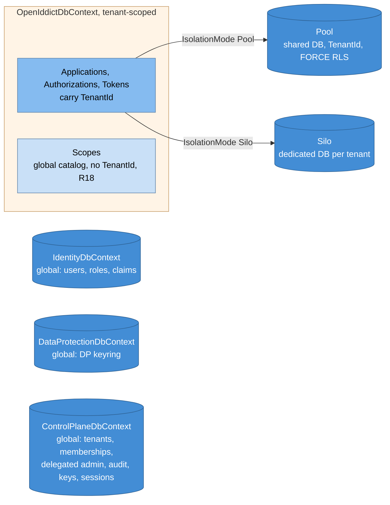
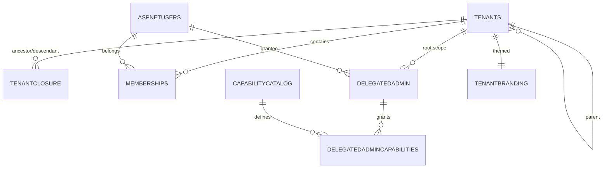
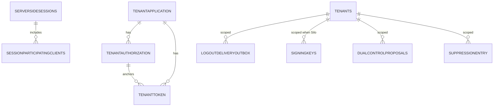
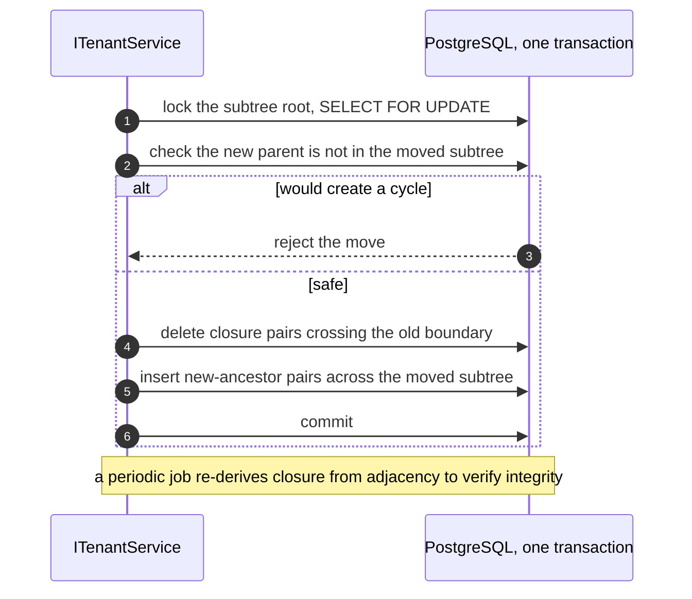
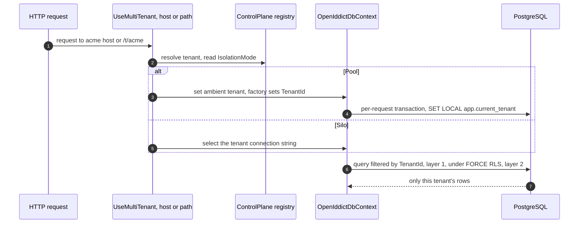
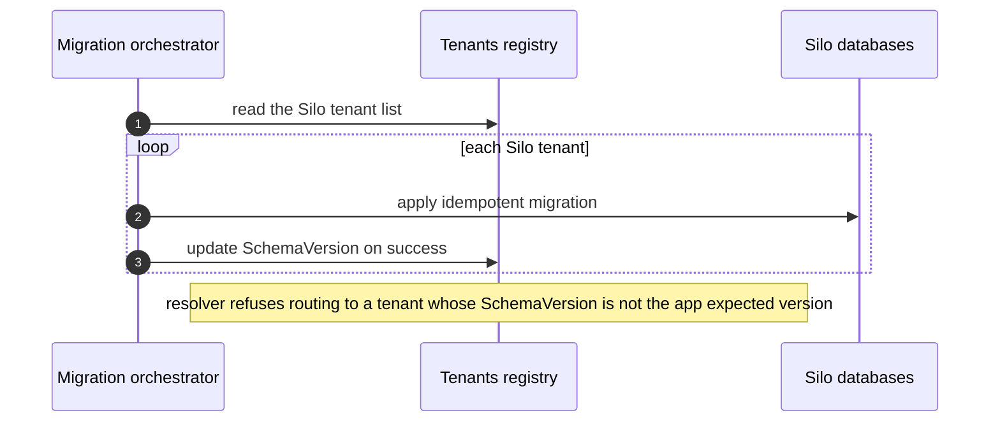
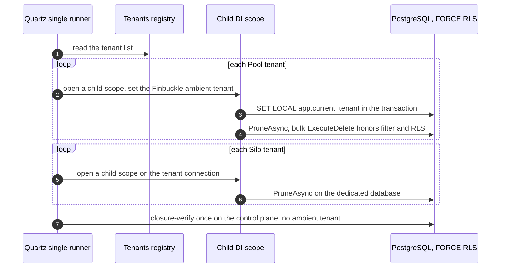

# Data tier and multi-tenancy (detailed design)

## Purpose and scope

The persistence tier and the isolation model that every other subsystem depends
on: the four DbContexts, tiered Pool/Silo multi-tenancy with a two-layer isolation
control (an EF query filter plus PostgreSQL FORCE row-level security), the
control-plane schema, the UUIDv7 key and `xmin` concurrency conventions, and the
migration model. It is Phase 02 and rests on the foundations (01).

In scope: the DbContext topology and tenancy composition, the control-plane
tables at schema level, keying/concurrency, isolation mechanics, and migrations.
Out of scope (owned by later designs): the audit hash-chain mechanism (03), the
authorization logic over the delegated-admin tables (05), key rotation internals
(09), and the protocol wiring that reads these stores (04). This doc creates the
tables and the isolation guarantees; those docs use them.

## Decisions realized

| Decision | What this design applies |
|---|---|
| ADR-0001 | Global identity/membership/registry; tenant-scoped OpenIddict data; Pool by default, Silo on demand; global scope catalog; four DbContexts (topology fixed) |
| ADR-0037 | PostgreSQL 18 sole engine; FORCE RLS backstop; `xmin` concurrency; `pg_advisory_lock`; `jsonb`; efbundle migrations plus a raw-SQL RLS step |
| ADR-0036 | UUIDv7 clustered keys everywhere, one bigint exception (the session surrogate) |
| ADR-0018 | DbContext pooling: non-pooled Pool context in v1 (A-4/T7), pooled-plus-mutable as a post-v1 option; per-context pooling matrix; connection-pool sizing |
| ADR-0049 | Resource-server isolation by issuer and tenant binding (a shared Pool keyset means the signature is not the boundary) |
| ADR-0008 / ADR-0003 / ADR-0010 | The audit, session, and delegated-admin tables live in the control plane (mechanisms detailed in 03, 05, 06) |

## Component and interface design

### The four DbContexts

| DbContext | Scope | Tables | Pooling |
|---|---|---|---|
| `OpenIddictDbContext` | Tenant-scoped | Applications, Authorizations, Tokens (carry `TenantId`); Scopes (global catalog) | Non-pooled `AddDbContext` in v1; Silo never pooled |
| `IdentityDbContext` | Global | AspNetUsers, Roles, Claims, UserRoles | Pooled |
| `DataProtectionDbContext` | Global | DataProtectionKeys | Pooled |
| `ControlPlaneDbContext` | Global | Tenants, TenantClosure, Memberships, DelegatedAdmin, CapabilityCatalog, AuditLog, SigningKeys, ServerSideSessions, and the outbox tables | Pooled |

The topology is fixed by ADR-0001; changing it requires a superseding ADR.

### Pool composition (the A-4-proven pattern)

`OpenIddictDbContext` derives Finbuckle's `MultiTenantDbContext` and marks the
three tenant-scoped entities `.IsMultiTenant()` (Applications, Authorizations,
Tokens), deliberately **not** Scope. This gives auto-stamp of `TenantId` on insert,
a named tenant query filter, and throw-on-mismatch/unset, which closes the
footgun that OpenIddict's stores do not know about `TenantId`. Three details are
load-bearing and spike-proven (A-4, 17/17, kept as regression):

* `EnforceMultiTenantOnTracking()` is called in the constructor so that entities
  OpenIddict's stores create internally (redeem/revoke) are stamped with the
  ambient tenant when tracked; deriving `MultiTenantDbContext` alone does not stamp
  externally-created entities.
* The global unique index on `ClientId` is replaced with a composite unique index
  on `(TenantId, ClientId)`, so the same `client_id` can exist per tenant in Pool
  mode. Without the override a second tenant reusing a `client_id` fails with a
  PostgreSQL unique violation (23505).
* A named soft-delete filter (`"soft_delete"`) coexists with the tenant filter (EF
  Core 10 named filters, ANDed), so an admin can view disabled rows by ignoring
  only `soft_delete` without leaking across tenants.

The A-4 harness is the reference implementation; the composition of Finbuckle +
OpenIddict + EF Core is a version-pinned seam re-verified on each bump (ADR-0021).

### Silo composition and the global scope catalog

A Silo tenant gets its own database (a per-tenant connection string via
`OnConfiguring`), no discriminator column, and its own key set; Silo contexts are
never pooled because the connection string varies. The **scope catalog is global**
(R18): Scopes carry no `TenantId`, `Name` stays globally unique, and per-tenant
differences are expressed as scope allowlists on the client grant, never by
forking the catalog.

### Two-layer tenant isolation

* **Layer 1, the EF query filter** (Finbuckle): keeps cross-tenant rows off the
  wire on the normal read/write path.
* **Layer 2, PostgreSQL FORCE row-level security**: a policy comparing the row's
  tenant to `current_setting('app.current_tenant', true)` under a **de-privileged
  role** (`NOSUPERUSER`, no `BYPASSRLS`), set per request with `SET LOCAL` inside
  the request transaction. This is the backstop for the bulk and raw-SQL paths that
  bypass the EF filter (`ExecuteDelete`/`ExecuteUpdate` honor the filter but bypass
  the change-tracker stamp, so RLS is the only write-side guard for a background
  job running without an ambient tenant). A superuser bypasses RLS, so the
  de-privileged role is mandatory or the second layer is silently off.

The RLS objects (ENABLE/FORCE, the policy, the role and grants) are not in the EF
model and are added as an explicit `migrationBuilder.Sql(...)` step after table
creation (ADR-0037, ADR-0017). The policy expression must match the tenant-column
type: `TenantId = current_setting('app.current_tenant', true)` for the `text`
OpenIddict discriminator, but for a `uuid` tenant column (the control-plane
`LogoutDeliveryOutbox` and `SuppressionEntry`) it must be
`TenantId = NULLIF(current_setting('app.current_tenant', true), '')::uuid`, because an
unset GUC returns an empty string and `''::uuid` raises `22P02` (a crash, not the
intended fail-closed zero rows).

### Key libraries and licenses

| Library | Purpose | License | ADR |
|---|---|---|---|
| Npgsql (+ EF Core provider) | PostgreSQL 18 provider: `uuidv7()`, `xmin`, RLS SQL | PostgreSQL (BSD-like) | 0037 |
| Finbuckle.MultiTenant (+ AspNetCore, EntityFrameworkCore) | Tenant resolution, Pool/Silo stores, auto-stamp | Apache-2.0 | 0001 |
| EF Core 10 | ORM, named query filters, migrations | MIT | 0037 |
| `Microsoft.AspNetCore.DataProtection.EntityFrameworkCore` | DP keyring backing store | MIT | 0006 |

The Finbuckle + OpenIddict + EF Core version triple is a pinned composition seam;
the exact pins live in `Directory.Packages.props` (the implementation plan).

### Patterns applied

Named per ADR-0066 (a vocabulary, applied where it clarifies intent):

* **Closure Table** over an adjacency list for the tenant hierarchy (read-heavy
  authz in one seek).
* **Strategy** for tenant resolution (host/path) and Pool-versus-Silo store routing
  (Finbuckle).
* **Repository** via the EF and OpenIddict stores, always behind managers, never a
  `DbContext` touched directly.

## Data model

This design is the **schema single source of truth**. Every persistent table's
fields, keys, and load-bearing indexes are defined here at design fidelity;
feature designs (03 audit, 06 admin, 07 email, 09 keys) reference these tables and
own the behavior over them. The exact DDL (column defaults, constraint names, the
raw-SQL RLS/role step, index storage) lives in the implementation plan.

Conventions across all tables (ADR-0036/0037): primary keys are UUIDv7 `uuid`
except the one `bigint` session surrogate; the optimistic-concurrency token is the
`xmin` system column (surfaced as the admin ETag and the dual-control TOCTOU
check); JSON is `jsonb` used as an extension bag, never the only home for data that
must be queried; timestamps are `timestamptz`; encrypted blobs are `bytea`; enums
are stored as `text`.

### Relationships

Multi-tenancy and authorization core:

OpenIddict and operational:

`TenantScope` is a global catalog with no relationship to a tenant; `OutboxEmail`
and `DataProtectionKeys` are standalone.

### OpenIddictDbContext (tenant-scoped)

Custom entities extend the OpenIddict EF base types with the key type overridden to
`Guid` via `ReplaceDefaultEntities`. Only the Nami-added columns and the
isolation-critical index are listed; the remaining columns are OpenIddict's
standard entity schema.

`TenantApplication` (adds to OpenIddict Application):

| Field | Type | Key / index | Notes |
|---|---|---|---|
| Id | uuid | PK | UUIDv7; overrides OpenIddict's default string key |
| TenantId | text | composite unique with ClientId; RLS column | `.IsMultiTenant()`; auto-stamped, throw on unset/mismatch |
| ClientId | text | unique (TenantId, ClientId) | replaces OpenIddict's global-unique ClientId index |
| Enabled | boolean | | disable-not-delete default |
| DeletedAtUtc | timestamptz null | named `soft_delete` filter | coexists with the tenant filter (ANDed) |

`TenantAuthorization` and `TenantToken` (add to OpenIddict Authorization/Token):

| Field | Type | Key / index | Notes |
|---|---|---|---|
| Id | uuid | PK | UUIDv7 |
| TenantId | text | RLS column | `.IsMultiTenant()`, auto-stamped |
| ApplicationId | uuid | FK to TenantApplication, optional | LEFT JOIN; `DeleteBehavior.Restrict`, no cascade |
| AuthorizationId (Token) | uuid | FK to TenantAuthorization, FK-indexed | optional; backs family revoke and prune |

`TenantScope` (global catalog, R18):

| Field | Type | Key / index | Notes |
|---|---|---|---|
| Id | uuid | PK | UUIDv7 |
| Name | text | globally unique | no `TenantId`, not `.IsMultiTenant()`; seeded once |

### IdentityDbContext (global)

The standard ASP.NET Core Identity schema (`AspNetUsers`, `AspNetRoles`,
`AspNetUserRoles`, `AspNetUserClaims`, `AspNetUserLogins`, `AspNetUserTokens`,
`AspNetRoleClaims`), with `ApplicationUser : IdentityUser<Guid>` (UUIDv7 PK). Nami
adds passkey storage (`UserPasskeyInfo` with `Aaguid` and `AttestationTrust`,
detailed in 06) and hosts one copy of `OutboxEmail` (see below) for the
confirm/reset flows. No tenant filter: identity is global (ADR-0001).

### DataProtectionDbContext (global)

`DataProtectionKeys` (the ASP.NET Data Protection keyring): `Id` (`int` identity),
`FriendlyName` (`text`), `Xml` (`text`). Standard schema; the context implements
`IDataProtectionKeyContext`. This keyring wraps `SigningKeys.Data`, so DR restores
both together (09).

### ControlPlaneDbContext (global)

`Tenants` (adjacency):

| Field | Type | Key / index | Notes |
|---|---|---|---|
| TenantId | uuid | PK | UUIDv7 |
| ParentTenantId | uuid null | FK to Tenants | adjacency; source of truth for the tree |
| Identifier | text | unique | immutable post-provision; drives the per-tenant issuer |
| Name | text | | display |
| IsolationMode | text | | Pool or Silo |
| ConnectionString | text null | | set for Silo only |
| KeyScope | text | | pool-group or own (ADR-0033) |
| Enabled | boolean | | not-yet-live at provisioning vs suspension of a live tenant |
| SchemaVersion | text | | migration traffic-gate |
| RequireInviteApproval | boolean | | per-tenant invite-approval gate (06) |

`TenantClosure`:

| Field | Type | Key / index | Notes |
|---|---|---|---|
| AncestorId | uuid | PK part 1, FK to Tenants | |
| DescendantId | uuid | PK part 2, FK to Tenants | reverse index (DescendantId, AncestorId) include Depth |
| Depth | int | | self-row is depth 0 |

`Memberships`:

| Field | Type | Key / index | Notes |
|---|---|---|---|
| UserId | uuid | PK part 1, FK to AspNetUsers | |
| TenantId | uuid | PK part 2, FK to Tenants | |
| Roles_JSON | jsonb | | roles within this tenant; source of truth for belonging |

`DelegatedAdmin` (+ `DelegatedAdminCapabilities`, `CapabilityCatalog`):

| Field | Type | Key / index | Notes |
|---|---|---|---|
| GrantId | uuid | PK | UUIDv7 |
| GranteeUserId | uuid | partial covering index | index (GranteeUserId, ExpiresAt) include (RootTenantId, ValidFrom) where RevokedAt is null |
| RootTenantId | uuid | FK to Tenants | subtree the grant covers |
| ValidFrom / ExpiresAt / RevokedAt / CreatedAt | timestamptz (ExpiresAt, RevokedAt null) | | time-bounded and revocable |
| GrantedByUserId | uuid | | provenance |
| (cap) GrantId + Capability | uuid + text | PK, FK to catalog | `DelegatedAdminCapabilities` |
| (cat) Capability + IsInheritable | text + boolean | Capability PK | `CapabilityCatalog` |

`AuditLog` (mechanism in 03):

| Field | Type | Key / index | Notes |
|---|---|---|---|
| EntryId | uuid | PK | UUIDv7 |
| Timestamp | timestamptz | | when the event occurred |
| PrevHash / RecordHash | bytea | | hash-chain; `RecordHash` = HMAC over canonical(fields) then `PrevHash` |
| Payload_Canonical | text | | canonical form hashed (jsonb does not preserve bytes) |
| ActorSub / OnBehalfOfSubject / ApproverSub / ActorChain_JSON | text / jsonb | | all subject-bearing identifiers stored as per-subject ciphertext (crypto-shreddable) |
| EventType / TargetTenantId / Result / CorrelationId | text | | event classification and correlation |
| Acr / AuthTime / DecisionPath / AuthzDecision / Capability / GrantId / StepupSatisfied / ApprovalRequestId / RequestHash | mixed | | authz-decision and dual-control provenance (produced by 05) |

Append-only: INSERT grant only, `REVOKE UPDATE/DELETE/TRUNCATE` plus a block trigger (ADR-0008).

`SigningKeys` (detailed in 09):

| Field | Type | Key / index | Notes |
|---|---|---|---|
| Id | text | PK (kid) | |
| Version / IsX509Certificate | int / boolean | | key version; whether `Data` is an X.509 cert (publish-before-sign needs X509) |
| Use / Algorithm / State | text | index (Use, State); unique (Use, State) where State is active | prevents two active signers |
| Data / DataProtected | bytea / boolean | | encrypted at rest; `DataProtected` records DP-wrapped versus KMS-enveloped |
| KeyScope / TenantId | text / uuid null | | pool-group or per-Silo-tenant (ADR-0033) |
| NotBefore / NotAfter / RetiresAt / DeletesAt / RevokedAt / Created | timestamptz | | rotation lifecycle |

`ServerSideSessions` (+ `SessionParticipatingClients`; detailed in 06/08):

| Field | Type | Key / index | Notes |
|---|---|---|---|
| Id | bigint | PK identity | the one deliberate non-UUIDv7 key (internal surrogate) |
| Key | text | unique | the `sid` clients reference |
| SubjectId / SessionId / Scheme | text | index (SubjectId), (SessionId) | evict-oldest on concurrent-session cap |
| DisplayName | text null | | optional session label |
| Created / Renewed / Expires | timestamptz | index (Expires) | `Created` backs evict-oldest; inactivity 1h / absolute 8h |
| Data | bytea | | serialized ticket |
| (participants) SessionKey + ClientId | text | PK, FK to Key cascade | which RPs to back-channel-logout |

`LogoutDeliveryOutbox` (tenant-scoped, RLS):

| Field | Type | Key / index | Notes |
|---|---|---|---|
| Id | uuid | PK | UUIDv7 |
| TenantId | uuid | `.IsMultiTenant()` + RLS | |
| Status / NextAttemptUtc | text / timestamptz | index (Status, NextAttemptUtc) | at-least-once delivery |
| Sid / ClientId / LogoutUri / Attempts | text / int | | |
| CreatedUtc / DeliveredUtc | timestamptz (DeliveredUtc null) | | enqueue and delivery timestamps |

`OutboxEmail` (two homes: Identity and control-plane; detailed in 07):

| Field | Type | Key / index | Notes |
|---|---|---|---|
| Id | uuid | PK | UUIDv7 |
| IdempotencyKey | text | unique | prevents double-send |
| Status / NextAttemptAt | text / timestamptz null | index (Status, NextAttemptAt) | relay claim via SKIP LOCKED |
| Payload / Attempts / ProviderMessageId / CreatedAt | text / int / text null / timestamptz | | control-plane copy adds `TenantId` (RLS) |

`SuppressionEntry` (tenant-scoped):

| Field | Type | Key / index | Notes |
|---|---|---|---|
| Id | uuid | PK | UUIDv7 |
| TenantId + RecipientHash | uuid + bytea | index (TenantId, RecipientHash) | hash only, never the address (DP.01) |
| Reason / ExpiresAt / CreatedAt | text / timestamptz (ExpiresAt null) / timestamptz | | hard-bounce and complaint persist; soft carries a TTL |

`TenantBranding`:

| Field | Type | Key / index | Notes |
|---|---|---|---|
| TenantId | uuid | PK, FK to Tenants | one row per tenant |
| LogoUri | text null | | https-only, SSRF-safe |
| ThemeJson | jsonb null | | design tokens, not raw CSS |
| DisplayName / UpdatedByMembershipId / UpdatedAtUtc | text / uuid / timestamptz | | |

`DualControlProposals` (detailed in 06):

| Field | Type | Key / index | Notes |
|---|---|---|---|
| ProposalId | uuid | PK | UUIDv7 |
| TargetETag | text | | TOCTOU guard, re-checked at execute |
| Status / ProposedBy / ApprovedBy | text (last null) | | proposer not equal approver |
| ActionType / TargetType / TargetId / TenantId | text / uuid | | routes to a keyed executor |
| PayloadJson / PriorProposalId / ExpiresAt / CorrelationId | jsonb / uuid null / timestamptz / text | | single-use, expiring |

### The tenant tree

The tree is an adjacency (`ParentTenantId`) with a derived `TenantClosure`,
maintained in application code inside `ITenantService` (one transactional path,
not a database trigger, per ADR-0024), with cycle rejection on MOVE (the new parent
must not be in the moved subtree), serialized tree mutation
(`SELECT ... FOR UPDATE` or SERIALIZABLE with retry), and a periodic
closure-integrity verify job.

### Migrations

Each context has its own `__EFMigrationsHistory` in a separate schema
(`openiddict`/`identity`/`dataprotection`/`controlplane`) so a shared database has no
collision. Migrations apply through an EF Core bundle (`efbundle`), with the RLS
objects added as a raw-SQL step after table creation; production never
migrates-on-startup (ADR-0017). Silo tenants are migrated by fan-out with a per-tenant
`SchemaVersion` and the resolver traffic-gate. Migration history must stay linear (EF
Core 10 rejects out-of-order at runtime; a CI `HasPendingModelChanges` check enforces
it), and EF Core 9+ takes an exclusive `__EFMigrationsHistory` lock as a
concurrent-migrate backstop under the single-runner orchestrator.

## Runtime flows

### Per-request tenant resolution and isolation

`app.UseMultiTenant()` runs before authentication/authorization so the OpenIddict
middleware and the DbContext both see the tenant.

### Silo migration fan-out with a traffic gate

Background jobs (prune, closure-verify) run without an ambient tenant, so they
iterate tenants explicitly: a child DI scope sets the Finbuckle ambient tenant and
`set_config('app.current_tenant', tid)` per iteration for Pool tenants, and uses
the dedicated connection for Silo tenants.

### Background-job tenant iteration

## Edge cases and failure modes

* **Pooled context tenant leak**: a naive pooled context reuses a stamped
  `TenantId` across tenants (A-4/T7); v1 uses a non-pooled context, with
  pooled-plus-mutable as a post-v1 option (ADR-0018).
* **Required-navigation Include INNER JOIN row loss**: a required nav to a filtered
  entity turns into an INNER JOIN and drops rows; OpenIddict navigations are kept
  optional (LEFT JOIN) so a filtered principal does not lose the token row (A-4/T16).
* **Bulk/raw-SQL bypass**: `ExecuteDelete`/`ExecuteUpdate` honor the query filter
  but bypass the stamp; non-composable raw SQL bypasses the filter entirely; RLS is
  the backstop.
* **Superuser bypasses RLS**: the app role must be `NOSUPERUSER`/no `BYPASSRLS`, or
  layer 2 is silently disabled (a deployment check asserts this).
* **Compiled models** do not support global query filters, so `dbcontext optimize`
  is not used on the tenant context.
* **Missing composite index**: without the `(TenantId, ClientId)` override, a
  second tenant reusing a `client_id` fails with 23505.
* **Migration partial failure / version skew**: a fan-out can leave two schema
  versions live; per-tenant `SchemaVersion` plus the resolver traffic-gate prevents
  new code from running on an old schema.
* **No ambient tenant on the EF path**: fail-closed (throw / zero rows), never
  fail-open (A-4/T13).

## Security considerations

* Two-layer isolation is the top security control of the product; a forgotten
  filter would be a cross-tenant leak, which is why RLS backstops it and
  cross-tenant negative tests are a permanent acceptance criterion (ADR-0001).
* Because Pool tenants share a pool-group signing key (ADR-0033), the signature is
  not a tenant boundary at the resource server; isolation there is by issuer and
  `tenant`-claim binding plus RLS (ADR-0049, detailed in 04).
* At rest: full-volume/managed-disk encryption plus per-column Data Protection for
  sensitive payloads (for example reference-token payloads); PostgreSQL has no
  native TDE (ADR-0005, ADR-0037).
* The audit table is append-only and tamper-evident at the schema level (INSERT
  grant only, `REVOKE UPDATE/DELETE/TRUNCATE` plus a block trigger); the mechanism is
  in 03.

## Testing strategy

* The **A-4 harness** is kept as the regression suite (17/17 against Testcontainers
  PostgreSQL 18), covering stamp, cross-tenant read isolation, internal-write stamp,
  bulk honor-filter/bypass-stamp, the composite index, soft-delete coexistence,
  RLS confinement, mismatch throw, no-ambient fail-closed, the global scope catalog,
  and Include row-loss (ADR-0001).
* **Cross-tenant negative tests** (Pool filter and Silo connection) are a permanent
  acceptance criterion; RLS confines reads and bulk `DELETE` under the de-privileged
  role with a no-tenant context yielding zero rows.
* Insert with a missing or wrong `TenantId` throws; prune touches only expired/
  invalid tokens and never a valid token of any tenant; a migration version
  mismatch is refused by the traffic gate.

## Open and build-time items

* **A-4b** (pooled-plus-mutable `TenantId`) is a post-v1 performance optimization
  needing its own spike (ADR-0018).
* Silo connection-pool sizing (`Maximum Pool Size` per tenant, PgBouncer
  transaction-mode) is order-of-magnitude and must be benchmarked on the target
  infrastructure (ADR-0018).
* An extra prune index is optional micro-tuning, not needed for v1 (A-6 proved the
  default PK/FK indexes suffice).
* The Silo classification criteria (which tenants qualify for a dedicated database)
  are ratified with Security/DPO at onboarding (ADR-0001, Pre-GA checklist).
* The Finbuckle/OpenIddict/EF/Npgsql composition is a contract-regression seam
  re-verified on each bump (ADR-0021).

## References

* Architecture overview: [components](../architecture/04-components.md),
  [data view](../architecture/05-data.md), [cross-cutting](../architecture/07-cross-cutting.md).
* Design: [01-foundations](01-foundations.md).
* ADRs: 0001 (tenancy), 0037 (engine), 0036 (keys), 0018 (pooling), 0049 (RS
  validation), 0008 (audit), 0003 (sessions), 0010 (delegated admin), 0017
  (migrations), 0033 (key scope), 0021 (version seam).

---

[← Prev: Foundations](01-foundations.md) · [Index](README.md) · Next: [Audit subsystem →](03-audit.md)
