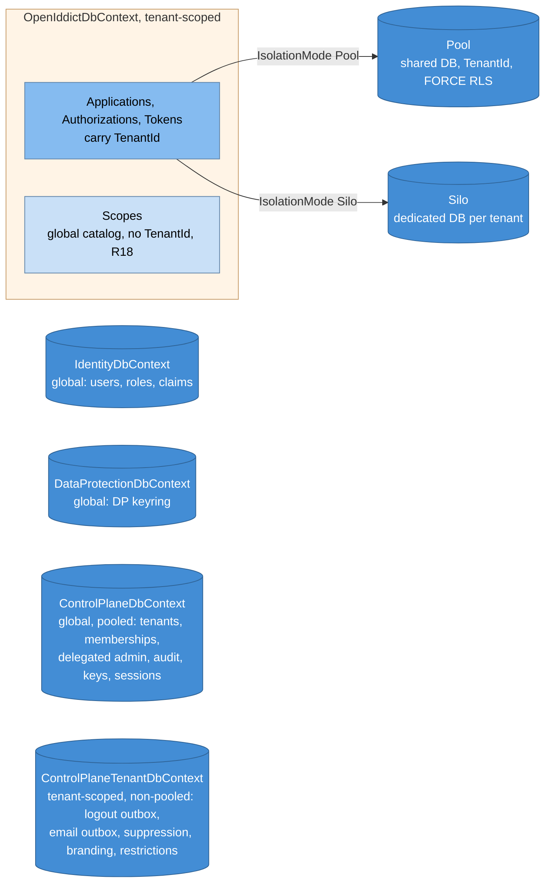
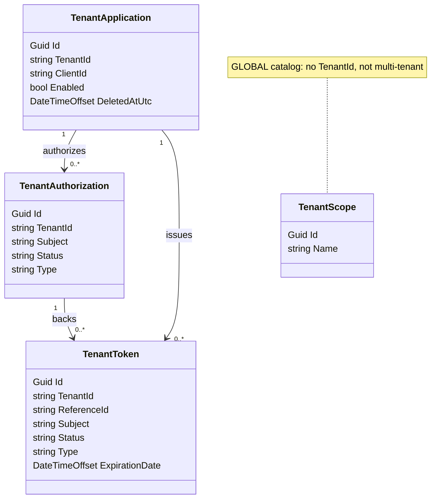
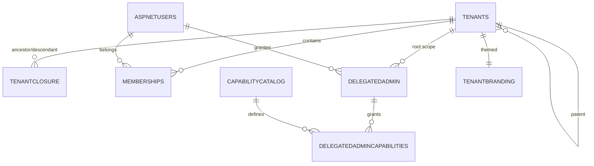
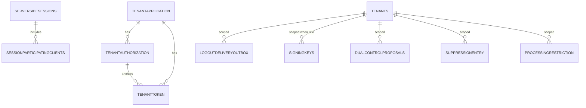
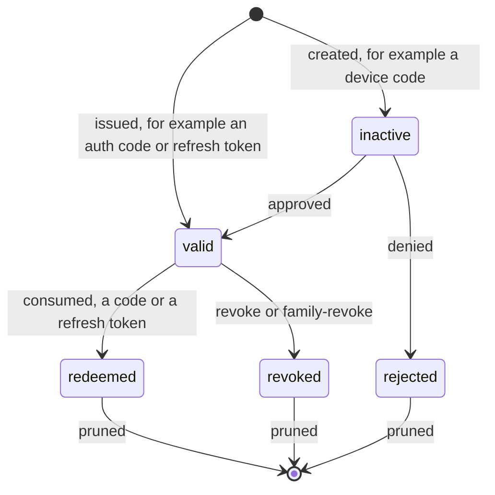
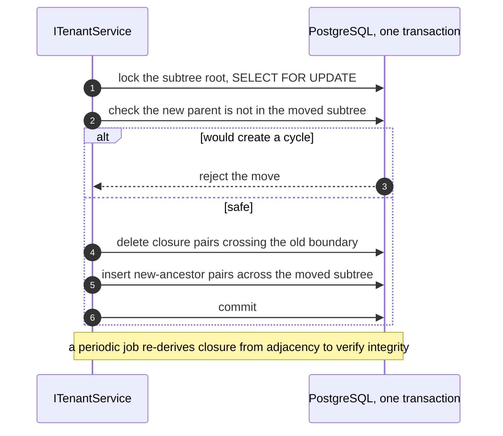
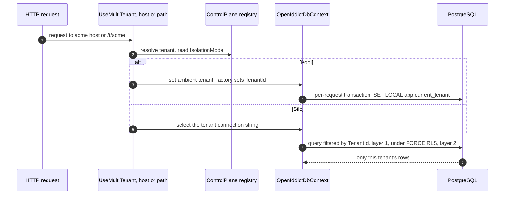
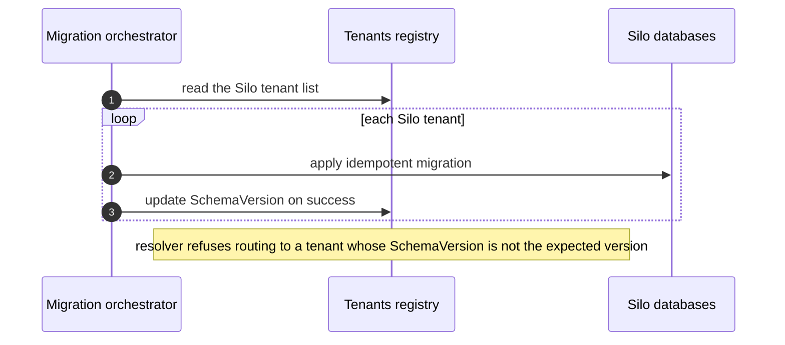
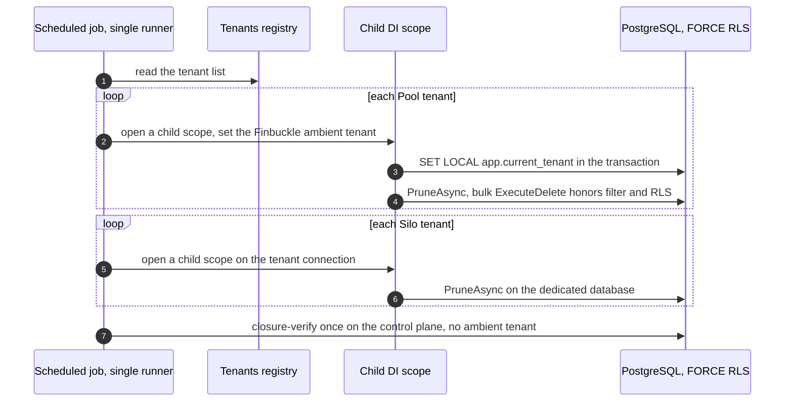

# Data tier and multi-tenancy (detailed design)

> **Sits under:** [architecture: data architecture](../architecture/12-data-architecture.md),
> which gives the shape (contexts, relationships, topology). This design gives the
> columns: types, keys, indexes, constraints, and the isolation SQL.
> **Implementer source of record for the schema:** this document. Every persistent
> table's fields, keys, and load-bearing indexes are defined here; a feature design
> references these tables and owns the behaviour over them.

DDL below is PostgreSQL-flavoured because the engine is fixed (ADR-0037): `text`,
`boolean`, `bytea`, `timestamptz`, `jsonb`, UUIDv7 primary keys, and `xmin` for
optimistic concurrency. The types are the design intent; exact lengths, collations,
constraint names, and index storage parameters are set at implementation.

## 1. Decisions realized

| Decision | What this design applies |
|---|---|
| ADR-0001 | Global identity/membership/registry; tenant-scoped OpenIddict data; Pool by default, Silo on demand; global scope catalog; five DbContexts (topology fixed) |
| ADR-0037 | PostgreSQL 18 sole engine; FORCE RLS backstop; `xmin` concurrency; `pg_advisory_lock`; `jsonb`; efbundle migrations plus a raw-SQL RLS step |
| ADR-0036 | UUIDv7 clustered keys everywhere, with two declared surrogate exceptions |
| ADR-0018 | DbContext pooling: non-pooled Pool context in v1 (A-4/T7), pooled-plus-mutable as a post-v1 option; per-context pooling matrix; connection-pool sizing |
| ADR-0049 | Resource-server isolation by issuer and tenant binding (a shared Pool keyset means the signature is not the boundary) |
| ADR-0065 | Database identifier casing: PascalCase tables and columns, `IX_<Table>_<detail>` indexes, snake_case for objects EF never maps, specification names verbatim |
| ADR-0008 / ADR-0003 / ADR-0010 | The audit, session, and delegated-admin tables live in the control plane (mechanisms detailed in 03, 08, 07) |
| ADR-0016 / ADR-0053 / ADR-0017 | The erasure, data-subject-rights, and provisioning tables live here; their sagas are owned by 17 and 18 |

## 2. Purpose and scope

The persistence tier and the isolation model that every other subsystem depends on:
the five DbContexts, tiered Pool/Silo multi-tenancy with a two-layer isolation
control (an EF query filter plus PostgreSQL FORCE row-level security), the
control-plane schema, the UUIDv7 key and `xmin` concurrency conventions, and the
migration model. It is Phase 02 and rests on the foundations (01).

In scope: the DbContext topology and tenancy composition, every control-plane table
at field level, keying and concurrency, isolation mechanics, and migrations. Out of
scope, owned by later designs: the audit hash-chain mechanism (03), the authorization
logic over the delegated-admin tables (07), key rotation internals (12), the erasure
and provisioning sagas (17, 18), and the protocol wiring that reads these stores (04).
This doc creates the tables and the isolation guarantees; those docs use them.

## 3. Interfaces and contract

### The five DbContexts

| DbContext | Scope | Base type | Pooling |
|---|---|---|---|
| `OpenIddictDbContext` | Tenant-scoped | Finbuckle `MultiTenantDbContext` | **Non-pooled** `AddDbContext` in v1; Silo never pooled |
| `IdentityDbContext` | Global | ASP.NET Core Identity context with a `Guid` key | Pooled |
| `DataProtectionDbContext` | Global | `DbContext`, implements `IDataProtectionKeyContext` | Pooled |
| `ControlPlaneDbContext` | Global | `DbContext` | Pooled |
| `ControlPlaneTenantDbContext` | Tenant-scoped | Finbuckle `MultiTenantDbContext` | **Non-pooled** `AddDbContext` |

The topology is fixed by ADR-0001; changing it requires a superseding ADR. Each
context owns its own `__EFMigrationsHistory` in its own schema (`openiddict`,
`identity`, `dataprotection`, `controlplane`, `controlplane_tenant`) so a shared
database has no collision. Data tables are all in `public`: v1 uses no schema
separation for data.

**Why the control plane is two contexts and not one.** Pooling is decided **per
context**, and the hazard is not the connection string but the fact that a pooled
`DbContext` instance captures the ambient tenant once, at construction, and cannot carry
per-request state (`OnConfiguring` runs once per pooled instance). That is exactly the
topology spike A-4's test T7 proved leaks. The control plane holds both kinds of table:
global rows keyed by `TenantId` as ordinary data, and genuinely tenant-scoped rows that
are `.IsMultiTenant()` and RLS-isolated. Keeping both in one pooled context would put
the tenant-scoped ones on the leaking topology and leave RLS as the only layer, which is
the single-layer posture ADR-0018 exists to avoid. Making the whole context non-pooled
would fix that but would also drop pooling for `ServerSideSessions`, which every
authenticated request touches, and `AuditLog`, which is write-heavy. So the five
tenant-scoped tables move to their own non-pooled `MultiTenantDbContext` and the hot
global tables keep the pool.

**Two candidate keys on `Tenants`, deliberately.** `TenantId` (`uuid`) is the foreign key
for **global** tables that reference a tenant as data (`Memberships`,
`DelegatedAdmin.RootTenantId`, `ProvisioningRequest`). `Identifier` (`varchar(64)`) is the
**discriminator** for tenant-scoped, Finbuckle-managed tables, and it is what
`ITenantInfo.Id` carries. Both are in use on purpose; do not "unify" them.

### Three classes of control-plane table

**A table's class decides four things at once: its tenant column, whether it is
`.IsMultiTenant()`, whether it takes row-level security, and which context owns it.**
Getting the class wrong is the isolation bug this whole design guards against, so it is
stated here rather than left to be inferred from a DDL comment, an RLS list, and a context
table in three different places.

| Class | Context | Tenant column | Finbuckle | RLS | Tables |
|---|---|---|---|---|---|
| **A. Tenant-scoped** | `ControlPlaneTenantDbContext` (non-pooled) | `varchar(64)` = `Tenants.Identifier` | `.IsMultiTenant()` | ENABLE + FORCE | `OutboxEmail` (control-plane variant), `SuppressionEntry`, `ProcessingRestriction`, `TenantBranding` (as its PK), and the v2 change-event outbox (ADR-0071) |
| **B. Tenant-as-data** | `ControlPlaneDbContext` (pooled) | `uuid` referencing `Tenants(TenantId)` | **no**, deliberately visible to authorization queries | **no** | `Memberships`, `DelegatedAdmin.RootTenantId`, `TenantClosure`, `DualControlProposals.TenantId`, `SigningKeys.TenantId`, `AuditLog.TargetTenantId`, `LogoutDeliveryOutbox.TenantId` |
| **C. Pre-tenant lifecycle** | `ControlPlaneDbContext` (pooled) | `uuid` referencing `Tenants(TenantId)` | **no**, because it runs before the tenant is usable so there may be no ambient tenant to filter on | optional, per its own threat analysis | `ProvisioningRequest`, and any deprovisioning counterpart |

Class A is `varchar(64)` for the mechanical reason in section 4: `.IsMultiTenant()` composes
only against a string column. Class B is **not** an oversight and must not be "fixed" into
class A: those columns are query data that authorization reads directly, and hiding them
behind an ambient-tenant filter would break the queries. `LogoutDeliveryOutbox` is the
subtle member of class B and the reason is worth stating, because its name suggests
otherwise: a session is global and keyed by `sid`, one `sid` legitimately spans a tenant
switch, and at logout there is exactly one ambient tenant, so a tenant filter here would
silently drop the deliveries for the session's other tenants and those relying parties would
never receive a `logout_token`. That is a failed logout, not a bookkeeping detail.

Both control-plane contexts share one physical database, so the class-A foreign keys to
`Tenants` still resolve.

> **Open item, recorded rather than closed.** The outbox-for-every-logout mechanism itself
> has never been justified in this repository: ADR-0019 lists "at-least-once delivery with
> retry" as a cost without arguing why at-least-once needs a durable queue in front of
> **every** logout rather than in front of failures only. The class-B correction above fixes
> the isolation defect and deliberately leaves the mechanism unchanged. Revisiting it is a
> decision for ADR-0019, not for this design.


```mermaid
graph LR
  subgraph oi[OpenIddictDbContext, tenant-scoped]
    ent[Applications, Authorizations, Tokens<br/>carry TenantId]:::ctx
    scp[Scopes<br/>global catalog, no TenantId, R18]:::global2
  end
  pool[(Pool<br/>shared DB, TenantId, FORCE RLS)]:::store
  silo[(Silo<br/>dedicated DB per tenant)]:::store
  id[(IdentityDbContext<br/>global: users, roles, claims)]:::store
  dp[(DataProtectionDbContext<br/>global: DP keyring)]:::store
  cp[(ControlPlaneDbContext<br/>global, pooled: tenants, memberships,<br/>delegated admin, audit, keys, sessions)]:::store
  cpt[(ControlPlaneTenantDbContext<br/>tenant-scoped, non-pooled: logout outbox,<br/>email outbox, suppression, branding, restrictions)]:::store

  ent -->|IsolationMode Pool| pool
  ent -->|IsolationMode Silo| silo

  classDef ctx fill:#85bbf0,stroke:#5d82a8,color:#000000
  classDef global2 fill:#c9e0f7,stroke:#5d82a8,color:#000000
  classDef store fill:#438dd5,stroke:#2e6295,color:#ffffff
  style oi fill:#fff4e6,stroke:#c69a66
```

### The custom OpenIddict entity types

OpenIddict's EF Core entities are generic in the key type and in each other. Nami
replaces the defaults so the key type is `Guid` and the three tenant-scoped entities
carry `TenantId`:

```csharp
public class TenantApplication
    : OpenIddictEntityFrameworkCoreApplication<Guid, TenantAuthorization, TenantToken>
{
    public string? TenantId { get; set; }
    public bool Enabled { get; set; } = true;            // soft-delete: indexable, filterable
    public DateTimeOffset? DeletedAtUtc { get; set; }
}

public class TenantAuthorization
    : OpenIddictEntityFrameworkCoreAuthorization<Guid, TenantApplication, TenantToken>
{
    public string? TenantId { get; set; }
}

public class TenantToken
    : OpenIddictEntityFrameworkCoreToken<Guid, TenantApplication, TenantAuthorization>
{
    public string? TenantId { get; set; }
}

// GLOBAL catalog (R18): no TenantId, never .IsMultiTenant()
public class TenantScope : OpenIddictEntityFrameworkCoreScope<Guid>
{
    public bool Enabled { get; set; } = true;
    public DateTimeOffset? DeletedAtUtc { get; set; }
}
```

They are registered with `ReplaceDefaultEntities` and the context is declared with the
five-argument `UseOpenIddict` overload so the stores resolve the custom types.


```mermaid
classDiagram
  class TenantApplication {
    Guid Id
    string TenantId
    string ClientId
    bool Enabled
    DateTimeOffset DeletedAtUtc
  }
  class TenantAuthorization {
    Guid Id
    string TenantId
    string Subject
    string Status
    string Type
  }
  class TenantToken {
    Guid Id
    string TenantId
    string ReferenceId
    string Subject
    string Status
    string Type
    DateTimeOffset ExpirationDate
  }
  class TenantScope {
    Guid Id
    string Name
  }
  TenantApplication "1" --> "0..*" TenantAuthorization : authorizes
  TenantApplication "1" --> "0..*" TenantToken : issues
  TenantAuthorization "1" --> "0..*" TenantToken : backs
  note for TenantScope "GLOBAL catalog: no TenantId, not multi-tenant"
```

`ITenantService` owns every mutation of the tenant tree (create, move, closure
maintenance) in one transactional path rather than a database trigger. This is **this
design's choice, not a decision imported from an ADR**: ADR-0010 names `TenantClosure` as a
table and makes ancestor lookup a recursive query, but no ADR rules on where the
maintenance runs. Keeping it in application code keeps the write path testable and inside
the ports-and-adapters boundary, and it keeps closure maintenance visible to the same
tenant-scoped context as every other write. The tree algorithm is in section 5.

## 4. Data and structure

### Identifier conventions

ADR-0065 is the authority; the rules that bite in this document are: tables and
columns are **PascalCase**, so PostgreSQL folding means EF emits them quoted and
**every hand-written statement must quote them too** (`"TenantId"`), which covers the
RLS policies, the outbox drain, DBA sessions, and dashboards. Indexes are
`IX_<Table>_<detail>`, unique indexes `UX_<Table>_<detail>`. Objects EF never maps,
meaning RLS policies and database roles, are snake_case. Wire and specification names
stay verbatim in their own case (`client_id`, the `Properties` dictionary keys).

Conventions across all tables (ADR-0036, ADR-0037): primary keys are UUIDv7 `uuid`
except the two declared surrogate exceptions; the optimistic-concurrency token is the
`xmin` system column, surfaced as the admin ETag and the dual-control TOCTOU check;
JSON is `jsonb`, used as an extension bag and never as the only home for data that must
be queried; timestamps are `timestamptz`; encrypted blobs are `bytea`; enums are stored
as `text`.

**UUIDv7** is chosen for the write path: time-ordered keys fragment a B-tree far less
than random UUIDv4, they stay globally unique for a Silo merge or move, and they are not
enumerable. They are generated by PostgreSQL 18's native `uuidv7()` or by .NET's
`Guid.CreateVersion7()`. The two exceptions are deliberate, and both are internal
high-churn surrogates never referenced from outside: `ServerSideSessions.Id` (`bigint`
identity) and `DataProtectionKeys.Id` (`int` identity, the framework's own schema).

### Relationships

Multi-tenancy and authorization core:


```mermaid
erDiagram
  TENANTS ||--o{ TENANTS : parent
  TENANTS ||--o{ TENANTCLOSURE : "ancestor/descendant"
  TENANTS ||--o{ MEMBERSHIPS : contains
  ASPNETUSERS ||--o{ MEMBERSHIPS : belongs
  TENANTS ||--o{ DELEGATEDADMIN : "root scope"
  ASPNETUSERS ||--o{ DELEGATEDADMIN : grantee
  DELEGATEDADMIN ||--o{ DELEGATEDADMINCAPABILITIES : grants
  CAPABILITYCATALOG ||--o{ DELEGATEDADMINCAPABILITIES : defines
  TENANTS ||--|| TENANTBRANDING : themed
```

OpenIddict and operational:


```mermaid
erDiagram
  TENANTAPPLICATION ||--o{ TENANTAUTHORIZATION : has
  TENANTAPPLICATION ||--o{ TENANTTOKEN : has
  TENANTAUTHORIZATION ||--o{ TENANTTOKEN : anchors
  SERVERSIDESESSIONS ||--o{ SESSIONPARTICIPATINGCLIENTS : includes
  TENANTS ||--o{ LOGOUTDELIVERYOUTBOX : scoped
  TENANTS ||--o{ SIGNINGKEYS : "scoped when Silo"
  TENANTS ||--o{ DUALCONTROLPROPOSALS : scoped
  TENANTS ||--o{ SUPPRESSIONENTRY : scoped
  TENANTS ||--o{ PROCESSINGRESTRICTION : scoped
```

`TenantScope` is a global catalog with no relationship to a tenant; `OutboxEmail`,
`DataProtectionKeys`, `ErasureRequest`, and `SubjectDek` are standalone.

### OpenIddictDbContext: the Nami-added columns

Only the added columns and the isolation-critical index are listed; the rest is
OpenIddict's own entity schema, summarized under "native columns and indexes" below.

`TenantApplication`:

| Field | Type | Key / index | Notes |
|---|---|---|---|
| Id | uuid | PK | UUIDv7; overrides OpenIddict's default string key |
| TenantId | text | composite unique with ClientId; RLS column | `.IsMultiTenant()`; auto-stamped, throw on unset/mismatch |
| ClientId | text | `UX_Application_tenant_client (TenantId, ClientId)` | replaces OpenIddict's global-unique `ClientId` index |
| Enabled | boolean | | disable-not-delete default |
| DeletedAtUtc | timestamptz null | named `soft_delete` filter | coexists with the tenant filter (ANDed) |

`TenantAuthorization` and `TenantToken`:

| Field | Type | Key / index | Notes |
|---|---|---|---|
| Id | uuid | PK | UUIDv7 |
| TenantId | text | RLS column | `.IsMultiTenant()`, auto-stamped |
| ApplicationId | uuid null | FK to TenantApplication, optional | LEFT JOIN; `DeleteBehavior.Restrict`, no cascade |
| AuthorizationId (Token) | uuid null | FK to TenantAuthorization, FK-indexed | optional; backs family revoke and prune |

`TenantScope` (global catalog, R18):

| Field | Type | Key / index | Notes |
|---|---|---|---|
| Id | uuid | PK | UUIDv7 |
| Name | text | globally unique | no `TenantId`, not `.IsMultiTenant()`; seeded once |
| Enabled / DeletedAtUtc | boolean / timestamptz null | named `soft_delete` filter | real columns, not `Properties` JSON, so they index and filter |

### Native columns and indexes (verified at the OpenIddict source)

The engine's own schema is not restated here in full, but three facts about it are
load-bearing, for capacity planning and for the migration that overrides part of it.
All three were read in the OpenIddict source at release tag **7.5.0**, the version
ADR-0061 pins:

* **The default index set is small.** Every entity declares `HasKey(Id)`. Beyond that:
  Application has one unique index on `ClientId`; Scope one unique index on `Name`;
  Authorization one **composite, non-unique** index on `(ApplicationId, Status,
  Subject, Type)`; Token the same composite plus a unique index on `ReferenceId`. That
  is the whole set.
* **Neither `ExpirationDate` nor `CreationDate` is indexed.** Prune needs no extra index
  because `PruneAsync` is a primary-key-ordered batched walk, which A-6/V26 measured. A
  query filtering on `Subject` alone cannot seek the composite either, since `Subject`
  is its third key; add a dedicated index only if a hot Subject-only path actually
  appears, not speculatively.
* **An application has three separate type-like columns, not one.** The descriptor
  exposes `ApplicationType`, `ClientType`, and `ConsentType`, and there is no single
  `Type` property. Code or DDL that assumes one `Type` column on an application is
  wrong.

**The Pool composite-uniqueness override** (spike A-4/T8-T9, V21): the global unique
index on `ClientId` is dropped and replaced with a unique index on
`(TenantId, ClientId)`, so the same `client_id` can exist once per tenant. Without the
override, the second tenant to reuse a `client_id` fails with PostgreSQL `23505`.
`Scope.Name` stays globally unique because the catalog is global. A Silo tenant keeps
the engine's global unique index, since it has its own database.

### ControlPlaneDbContext DDL

```sql
-- Tenancy and hierarchy ------------------------------------------------------
CREATE TABLE "Tenants" (
  "TenantId"              uuid PRIMARY KEY,                 -- UUIDv7
  "ParentTenantId"        uuid NULL REFERENCES "Tenants"("TenantId"),
  "Identifier"            varchar(64) NOT NULL UNIQUE,      -- IMMUTABLE post-provision; drives the per-tenant issuer AND is the tenant discriminator
  "Name"                  text NOT NULL,
  "IsolationMode"         text NOT NULL,                    -- 'Pool' | 'Silo'
  "ConnectionString"      text NULL,                        -- Silo only
  "KeyScope"              text NOT NULL,                    -- 'pool-group' | 'own': the tenant's isolation choice
  "Enabled"               boolean NOT NULL DEFAULT false,   -- provisioned-but-not-live, and suspension of a live tenant
  "RequireInviteApproval" boolean NOT NULL DEFAULT false,   -- per-tenant invite-approval gate (08)
  "SchemaVersion"         text NULL                         -- migration traffic gate
  -- xmin: PostgreSQL system column, optimistic concurrency via Npgsql
);

CREATE TABLE "TenantClosure" (
  "AncestorId"   uuid NOT NULL REFERENCES "Tenants"("TenantId"),
  "DescendantId" uuid NOT NULL REFERENCES "Tenants"("TenantId"),
  "Depth"        int  NOT NULL,                             -- the self row is depth 0
  PRIMARY KEY ("AncestorId", "DescendantId")
);
CREATE INDEX "IX_TenantClosure_reverse"
  ON "TenantClosure" ("DescendantId", "AncestorId") INCLUDE ("Depth");

-- Membership and delegated administration ------------------------------------
CREATE TABLE "Memberships" (
  "UserId"    uuid  NOT NULL,
  "TenantId"  uuid  NOT NULL REFERENCES "Tenants"("TenantId"),
  "RolesJson" jsonb NOT NULL,                               -- roles within this tenant
  "Status"    text  NOT NULL DEFAULT 'active',              -- 'active' | 'pending-approval': gates sign-in (08)
  PRIMARY KEY ("UserId", "TenantId")
);

CREATE TABLE "CapabilityCatalog" (
  "Capability"    text PRIMARY KEY,                         -- lowercase snake_case (ADR-0065)
  "IsInheritable" boolean NOT NULL                          -- forbidden-cascade: dangerous capabilities are false
);

CREATE TABLE "DelegatedAdmin" (
  "GrantId"         uuid PRIMARY KEY,
  "GranteeUserId"   uuid NOT NULL,
  "RootTenantId"    uuid NOT NULL REFERENCES "Tenants"("TenantId"),
  "ValidFrom"       timestamptz NOT NULL,
  "ExpiresAt"       timestamptz NULL,
  "RevokedAt"       timestamptz NULL,
  "GrantedByUserId" uuid NOT NULL,
  "CreatedAt"       timestamptz NOT NULL
);
-- hot-path filtered covering index: equality first, revoked rows excluded
CREATE INDEX "IX_DelegatedAdmin_active"
  ON "DelegatedAdmin" ("GranteeUserId", "ExpiresAt")
  INCLUDE ("RootTenantId", "ValidFrom")
  WHERE "RevokedAt" IS NULL;

CREATE TABLE "DelegatedAdminCapabilities" (
  "GrantId"    uuid NOT NULL REFERENCES "DelegatedAdmin"("GrantId"),
  "Capability" text NOT NULL REFERENCES "CapabilityCatalog"("Capability"),
  PRIMARY KEY ("GrantId", "Capability")
);

-- Dual-control saga (mechanism in 15) ----------------------------------------
CREATE TABLE "DualControlProposals" (
  "ProposalId"      uuid PRIMARY KEY,
  "ActionType"      text NOT NULL,                          -- kebab-case wire contract (ADR-0065)
  "TargetType"      text NOT NULL,
  "TargetId"        text NOT NULL,
  "TenantId"        uuid NULL,
  "PayloadJson"     jsonb NOT NULL,
  "TargetClass"     text NOT NULL,                          -- 'mutate' | 'create' | 'query' (ADR-0081)
  "TargetETag"      text NULL,                              -- guard, re-checked at execute; required for 'mutate'
  "Justification"   text NOT NULL,
  "ProposedBy"      uuid NOT NULL,
  "ProposedAt"      timestamptz NOT NULL,
  "Status"          text NOT NULL,
  "ApprovedBy"      uuid NULL,                              -- must differ from ProposedBy
  "DecidedAt"       timestamptz NULL,
  "ExecutedAt"      timestamptz NULL,
  "FailReason"      text NULL,                              -- for example 'target_changed'
  "FailDetail"      jsonb NULL,                             -- the expected and the observed ETag
  "PriorProposalId" uuid NULL,                              -- lineage: replaces a failed proposal
  "ExpiresAt"       timestamptz NOT NULL,                   -- 72h
  "CorrelationId"   uuid NOT NULL,
  -- xmin: optimistic concurrency
  CONSTRAINT "CK_DualControlProposals_class"
    CHECK ("TargetClass" IN ('mutate','create','query')),
  CONSTRAINT "CK_DualControlProposals_mutate_needs_etag"
    CHECK ("TargetClass" <> 'mutate' OR "TargetETag" IS NOT NULL)
);
CREATE INDEX "IX_DualControlProposals_status"   ON "DualControlProposals" ("Status", "ExpiresAt");
CREATE INDEX "IX_DualControlProposals_proposer" ON "DualControlProposals" ("ProposedBy");
CREATE INDEX "IX_DualControlProposals_tenant"   ON "DualControlProposals" ("TenantId");
-- Open item (ADR-0081, 2026-08-01): `TargetId text NOT NULL` carries the same shape of
-- problem the `TargetETag` change just fixed. For class 'create' the column reads naturally
-- as the identifier of the thing to be created (the proposed tenant `Identifier`, the
-- grantee). For class 'query' there is no row to name at all, and neither ADR-0081 nor the
-- corpus decision it came from rules on it. Left NOT NULL and flagged rather than given an
-- invented semantic; decide it when the `audit-export` executor is written.

-- Audit (mechanism in 03) -----------------------------------------------------
CREATE TABLE "AuditLog" (
  "EntryId"           uuid PRIMARY KEY,
  "Timestamp"         timestamptz NOT NULL,
  "EventType"         text NOT NULL,
  "ActorSub"          text NULL,                            -- ciphertext at write (crypto-shreddable)
  "SubjectRef"        uuid NULL,                            -- deterministic subject surrogate: the groupable key
                                                            --   for per-user abuse rules. Same surrogate as
                                                            --   ProcessingRestriction and SubjectDek (ADR-0016),
                                                            --   so erasure destroys ONE mapping. ActorSub cannot
                                                            --   serve: it is per-subject ciphertext (ADR-0082)
  "SourceIpHash"      bytea NULL,                            -- keyed HMAC-SHA256, NOT truncated (a collision in an
                                                            --   abuse rule is false attribution). A pseudonym, not
                                                            --   anonymisation. Nullable + emission-configurable:
                                                            --   its DP basis is a pre-GA ratify item (ADR-0082)
  "ClientId"          text NULL,                            -- registered application id, not PII; never a metric tag
  "ActorChainJson"    jsonb NULL,                           -- ciphertext at write
  "OnBehalfOfSubject" text NULL,                            -- ciphertext at write
  "ApproverSub"       text NULL,                            -- ciphertext at write
  "TargetTenantId"    uuid NULL,
  "GrantId"           uuid NULL,
  "Capability"        text NULL,
  "DecisionPath"      text NULL,
  "AuthzDecision"     text NULL,
  "Acr"               text NULL,
  "AuthTime"          timestamptz NULL,
  "StepupSatisfied"   boolean NULL,
  "ApprovalRequestId" uuid NULL REFERENCES "DualControlProposals"("ProposalId"),
  "RequestHash"       bytea NULL,
  "Result"            text NULL,
  "PayloadCanonical"  text NOT NULL,                        -- canonical TEXT; jsonb does not preserve bytes
  "PrevHash"          bytea NOT NULL,                       -- genesis is 32 zero bytes, not a string
  "RecordHash"        bytea NOT NULL,                       -- HMAC_k(PrevHash || canonical(fields)), prev-first
  "CorrelationId"     uuid NULL
);
-- append-only: INSERT grant only, plus REVOKE UPDATE, DELETE, TRUNCATE and a block trigger

-- Signing keys (rotation state machine in 12) ---------------------------------
CREATE TABLE "SigningKeys" (
  "Id"                text PRIMARY KEY,                     -- the JWK kid; RFC 7517 defines it as a string
  "Version"           int  NOT NULL,
  "Use"               text NOT NULL,                        -- 'sig' | 'enc'
  "Algorithm"         text NOT NULL,
  "IsX509Certificate" boolean NOT NULL,                     -- publish-before-sign needs X509
  "Data"              bytea NOT NULL,                       -- authoritative key material, encrypted at rest
  "DataProtected"     boolean NOT NULL,                     -- DP-wrapped versus KMS-enveloped
  "State"             text NOT NULL,                        -- 'announced' | 'active' | 'retired' | 'deleted'
  "NotBefore"         timestamptz NOT NULL,
  "NotAfter"          timestamptz NOT NULL,
  "RetiresAt"         timestamptz NOT NULL,
  "DeletesAt"         timestamptz NOT NULL,
  "RevokedAt"         timestamptz NULL,                     -- break-glass, orthogonal to State
  "KeyScope"          text NOT NULL,                        -- 'pool-group' | 'tenant'
  "TenantId"          uuid NULL,                            -- set for a Silo per-tenant key set
  "Created"           timestamptz NOT NULL
);
CREATE UNIQUE INDEX "UX_SigningKeys_active"
  ON "SigningKeys" ("Use") WHERE "State" = 'active';        -- blocks two active signers per use
CREATE INDEX "IX_SigningKeys_lookup" ON "SigningKeys" ("Use", "State");

-- Sessions (ITicketStore backing, ADR-0003): global, not tenant-linked --------
CREATE TABLE "ServerSideSessions" (
  "Id"          bigint GENERATED ALWAYS AS IDENTITY PRIMARY KEY,  -- declared UUIDv7 exception
  "Key"         text NOT NULL UNIQUE,                       -- the sid clients reference
  "Scheme"      text NOT NULL,
  "SubjectId"   text NOT NULL,
  "SessionId"   text NULL,
  "DisplayName" text NULL,
  "Created"     timestamptz NOT NULL,                       -- backs evict-oldest
  "Renewed"     timestamptz NOT NULL,                       -- last activity; inactivity window 1h
  "Expires"     timestamptz NOT NULL,                       -- absolute 8h
  "Data"        bytea NOT NULL                              -- serialized ticket
);
CREATE INDEX "IX_ServerSideSessions_Expires"   ON "ServerSideSessions" ("Expires");
CREATE INDEX "IX_ServerSideSessions_SubjectId" ON "ServerSideSessions" ("SubjectId");
CREATE INDEX "IX_ServerSideSessions_SessionId" ON "ServerSideSessions" ("SessionId");

CREATE TABLE "SessionParticipatingClients" (
  "SessionKey" text NOT NULL
    REFERENCES "ServerSideSessions"("Key") ON DELETE CASCADE,
  "ClientId"   text NOT NULL,
  PRIMARY KEY ("SessionKey", "ClientId")
);

-- Back-channel logout delivery outbox (class B: GLOBAL, tenant-as-data) -------
-- A session is global and keyed by sid, and one sid legitimately spans a tenant
-- switch (see the ServerSideSessions note in the architecture data view). At logout
-- there is exactly one ambient tenant, so filtering this table by it would drop the
-- rows for RPs in the session's OTHER tenants and those RPs would never receive a
-- logout_token. So this table is deliberately NOT tenant-scoped.
CREATE TABLE "LogoutDeliveryOutbox" (
  "Id"             uuid PRIMARY KEY,
  "TenantId"       uuid NULL REFERENCES "Tenants"("TenantId"),  -- DATA only (audit, per-tenant reporting): no .IsMultiTenant(), no RLS. Nullable, because an RP's tenant may not be resolvable at enqueue time
  "Sid"            text NOT NULL,                           -- the GLOBAL session id
  "ClientId"       text NOT NULL,
  "LogoutUri"      text NOT NULL,
  "Status"         text NOT NULL,                           -- 'pending' | 'delivered' | 'failed'
  "Attempts"       int  NOT NULL,
  "NextAttemptUtc" timestamptz NULL,
  "CreatedUtc"     timestamptz NOT NULL,
  "DeliveredUtc"   timestamptz NULL
);
CREATE INDEX "IX_LogoutDeliveryOutbox_claim"
  ON "LogoutDeliveryOutbox" ("Status", "NextAttemptUtc");

-- Email outbox and suppression (mechanism in 10) ------------------------------
-- The control-plane variant carries TenantId + RLS; a global variant with no
-- TenantId lives in IdentityDbContext for the confirm and reset mail.
CREATE TABLE "OutboxEmail" (
  "Id"                uuid PRIMARY KEY,
  "TenantId"          varchar(64) NOT NULL,                 -- Tenants.Identifier discriminator
  "Payload"           text NOT NULL,
  "IdempotencyKey"    text NOT NULL UNIQUE,                 -- prevents double-send
  "Status"            text NOT NULL,                        -- 'Pending' | 'InFlight' | 'Sent' | 'DeadLettered'
  "Attempts"          int  NOT NULL,
  "NextAttemptAt"     timestamptz NULL,
  "ProviderMessageId" text NULL,
  "CreatedAt"         timestamptz NOT NULL
);
CREATE INDEX "IX_OutboxEmail_claim" ON "OutboxEmail" ("Status", "NextAttemptAt");

CREATE TABLE "SuppressionEntry" (
  "Id"            uuid PRIMARY KEY,
  "TenantId"      varchar(64) NOT NULL,                       -- Tenants.Identifier discriminator
  "RecipientHash" bytea NOT NULL,                           -- hash only, never the address
  "Reason"        text NOT NULL,                            -- 'hard-bounce' | 'complaint' | 'manual'
  "ExpiresAt"     timestamptz NULL,                         -- hard-bounce and complaint persist; soft carries a TTL
  "CreatedAt"     timestamptz NOT NULL
);
CREATE INDEX "IX_SuppressionEntry_lookup"
  ON "SuppressionEntry" ("TenantId", "RecipientHash");

-- Tenant branding (per-tenant theming; RLS-isolated) --------------------------
CREATE TABLE "TenantBranding" (
  "TenantId"              varchar(64) PRIMARY KEY REFERENCES "Tenants"("Identifier"),
  "LogoUri"               text NULL,                        -- https only, SSRF-safe
  "ThemeJson"             jsonb NULL,                       -- design tokens only, never raw CSS
  "DisplayName"           text NULL,
  "UpdatedByMembershipId" uuid NOT NULL,
  "UpdatedAtUtc"          timestamptz NOT NULL
);

-- Erasure, provisioning, and data-subject rights (sagas in 17 and 18) ---------
CREATE TABLE "ErasureRequest" (
  "RequestId"      uuid PRIMARY KEY,
  "SubjectId"      uuid NOT NULL,
  "RequestedAtUtc" timestamptz NOT NULL,
  "Status"         text NOT NULL,                           -- 'pending' | 'in-progress' | 'completed' | 'failed'
  "CheckpointJson" jsonb NOT NULL                           -- per-plane idempotent checkpoint
  -- xmin
);

CREATE TABLE "ProvisioningRequest" (
  "RequestId"      uuid PRIMARY KEY,
  "TenantId"       uuid NOT NULL REFERENCES "Tenants"("TenantId"),
  "Kind"           text NOT NULL,                           -- 'provision' | 'deprovision' | 'rehome'
  "Status"         text NOT NULL,                           -- 'pending' | 'in-progress' | 'done' | 'failed'
  "CheckpointJson" jsonb NOT NULL,                          -- per-step saga checkpoint
  "LastError"      text NULL
  -- xmin
);

CREATE TABLE "ProcessingRestriction" (                      -- GDPR Art.18 (tenant-scoped, RLS)
  "SubjectRef" uuid NOT NULL,
  "TenantId"   varchar(64) NOT NULL REFERENCES "Tenants"("Identifier"),
  "Reason"     text NOT NULL,   -- 'accuracy-contested' | 'erasure-alt' | 'legal-claim' | 'objection-pending'
  "Scope"      text NOT NULL,
  "StartedAt"  timestamptz NOT NULL,
  "LiftedAt"   timestamptz NULL,
  PRIMARY KEY ("SubjectRef", "TenantId")
);
```

**`SubjectDek`, the crypto-shred key vault** (mechanism in 03, saga in 17), lives in a
keystore **separate from the audit store**. Not co-locating it is the whole point:
destroying a DEK renders every copy of the ciphertext unintelligible, including copies
in backups, the SIEM, and WORM storage, without touching those rows (ADR-0016).

```sql
CREATE TABLE "SubjectDek" (
  "SubjectRef"  uuid PRIMARY KEY,                           -- one DEK per subject, created lazily
  "WrappedDek"  bytea NOT NULL,                             -- AES-256-GCM DEK wrapped by the ADR-0006 master key
  "CreatedAt"   timestamptz NOT NULL,
  "DestroyedAt" timestamptz NULL                            -- set on erasure: this is the crypto-shred
);
```

The wrapped DEK is never written to `AuditLog`, its backup, the SIEM, or WORM storage.

Two notes on columns above whose failure mode is subtle:

* **The partial index predicate must be a literal, never a bind parameter.**
  PostgreSQL's planner uses a partial index only when it can prove at plan time that the
  query implies the index predicate, and it cannot prove that against a parameter. So
  `WHERE "RevokedAt" IS NULL` stays hard-coded in the DDL. Equality and range keys as
  binds (`"GranteeUserId" = $1`, `@now BETWEEN "ValidFrom" AND "ExpiresAt"`) are fine and
  do not defeat the index.
* **`KeyScope` is two different vocabularies in two tables.** `Tenants.KeyScope` is
  `pool-group` or `own` and records the tenant's isolation *choice*;
  `SigningKeys.KeyScope` is `pool-group` or `tenant` and records which key set a row
  belongs to. The columns are parallel, not the same domain; 12 owns the reconciliation
  (ADR-0033).

### IdentityDbContext and DataProtectionDbContext (global)

**Identity** uses the standard ASP.NET Core Identity schema (`AspNetUsers`,
`AspNetRoles`, `AspNetUserRoles`, `AspNetUserClaims`, `AspNetUserLogins`,
`AspNetUserTokens`, `AspNetRoleClaims`) with `ApplicationUser : IdentityUser<Guid>` and
UUIDv7 keys. Passkeys use the **native .NET 10 passkey store**, whose `UserPasskeyInfo`
carries `CredentialId`, `PublicKey`, `Aaguid`, `IsBackupEligible`, `IsBackedUp`, and the
signature counter; Nami adds exactly **one** column, `AttestationTrust`, which is the
seam the authenticator-assurance policy reads (ADR-0028, detailed in 08). There is no
tenant filter: identity is global (ADR-0001). A global `OutboxEmail` variant without
`TenantId` also lives here, for confirm and reset mail.

**DataProtection** has one table, the framework's own:

```sql
CREATE TABLE "DataProtectionKeys" (                          -- IDataProtectionKeyContext
  "Id"           int GENERATED ALWAYS AS IDENTITY PRIMARY KEY,
  "FriendlyName" text NULL,
  "Xml"          text NOT NULL                               -- serialized key element
);
```

This keyring **wraps** `SigningKeys.Data`, which is why disaster recovery must restore
both together and why restoring one alone leaves unreadable key material (12).

### Row-level security (the Pool backstop)

RLS is **not in the EF model**. It is a raw-SQL migration step applied after
`CREATE TABLE` (spike A-4/T17), covering the three tenant-scoped OpenIddict tables and the
four class-A control-plane tables (`OutboxEmail`, `SuppressionEntry`, `ProcessingRestriction`,
`TenantBranding`). **`LogoutDeliveryOutbox` is deliberately not in that list**, because it is
class B: see the class table in section 1.

```sql
ALTER TABLE "OpenIddictApplications" ENABLE ROW LEVEL SECURITY;
ALTER TABLE "OpenIddictApplications" FORCE  ROW LEVEL SECURITY;  -- applies to the table owner too
CREATE POLICY tenant_isolation ON "OpenIddictApplications"
  USING      ("TenantId" = current_setting('app.current_tenant', true))
  WITH CHECK ("TenantId" = current_setting('app.current_tenant', true));

-- the de-privileged application role: a superuser BYPASSES RLS
CREATE ROLE nami_identity_app LOGIN NOSUPERUSER;
GRANT SELECT, INSERT, UPDATE, DELETE ON "OpenIddictApplications" TO nami_identity_app;
```

Per request, inside the request transaction:
`SELECT set_config('app.current_tenant', $1, true);`. The third argument `true` means
`SET LOCAL`, which is what makes it pooling-safe; passing `false` would leak the setting
to the next request on that connection and must never be used.

**Every tenant discriminator column is `varchar(64)`, holding the `Tenants.Identifier`
string, so the policy expression above is a plain text comparison and an unset GUC simply
fails to match and returns zero rows.** That is fail-closed by construction, and it is the
main reason the type is text rather than `uuid`.

The type is not a style choice. **`.IsMultiTenant()` composes only against a string
column**, because Finbuckle's tenant identity is a string (`ITenantInfo.Id` and
`.Identifier` are both `String`). A `Guid` tenant property throws at model build, so the
application does not start:

```text
InvalidOperationException: The property 'TenantId' cannot be added to the type
'<Entity>' because the type of the corresponding CLR property or field 'Guid' does not
match the specified type 'string'.
```

Probe-verified 2026-08-01 against `Finbuckle.MultiTenant.EntityFrameworkCore` 10.1.2, the
version ADR-0061 pins: the `Guid` shape throws as above and the `string` shape builds. So
the auto-stamp, the query filter, and the throw-on-mismatch that spike A-4 proved 17/17
are only available on a text column.

**The `uuid` form and its `NULLIF` cast are kept as a rule with zero current instances.**
No v1 table uses a `uuid` tenant column, and the v2 change-event outbox does not either
(ADR-0071). If a future table ever does, its policy **must** cast:

```sql
USING ("TenantId" = NULLIF(current_setting('app.current_tenant', true), '')::uuid)
```

because a pooled connection with no setting returns the empty string, and `''::uuid`
raises `22P02`, which crashes instead of failing closed. The rule stays because it is
cheap to keep and expensive to rediscover, and such a table could not be
`.IsMultiTenant()` at all, so it would have to hand-roll the isolation layer and should be
argued for in an ADR first.

**Keep the discriminator on a deterministic collation** (the default, or `COLLATE "C"`).
PostgreSQL permits non-deterministic ICU collations under which `=` has surprising
semantics, and a tenant isolation key must never be ambiguous.

`TenantBranding` is RLS-isolated and `.IsMultiTenant()` like every other per-tenant
control-plane table, and its tenant column **is** its primary key, one row per tenant. It
is a deliberate, documented third exception to the UUIDv7 primary-key rule, beside
`ServerSideSessions.Id` and `DataProtectionKeys.Id`, and none of that rule's three reasons
reaches it: it is not a hot write path (one row per tenant, written when an admin edits
branding), `Identifier` is already globally `UNIQUE` so there is no collision on a Silo
move, and non-enumerability is meaningless for a value that appears in the hostname and the
URL path. The upside that decided it is the read path: the login surface reads branding for
the tenant being signed into, the resolver already holds the identifier, and a `uuid`
primary key would force an identifier-to-uuid lookup on the first page a user ever sees.
The implementer consequence still holds, and now fails closed by non-match rather than by
a cast: **the tenant resolver must set `app.current_tenant` before that read**, or no
branding is returned. That is a benign degrade to the default theme rather than a security
failure, but it looks like a bug to anyone who has not been told.

RLS is layer 2; the EF named filter plus auto-stamp is layer 1. Both are required,
because the bulk, `ExecuteUpdate`/`ExecuteDelete`, and raw paths bypass layer 1, which
leaves layer 2 as the only guard there. `PruneAsync` is exactly such a path.

## 5. Behaviour

### Token and authorization status lifecycle

Status drives prune and revocation. OpenIddict defines exactly five statuses, and the
**stored values are lowercase** (`inactive`, `valid`, `redeemed`, `revoked`,
`rejected`), not the C# constant names; read in `OpenIddictConstants.Statuses` at
release 7.5.0.


```mermaid
stateDiagram-v2
  [*] --> inactive : created, for example a device code
  [*] --> valid : issued, for example an auth code or refresh token
  inactive --> valid : approved
  inactive --> rejected : denied
  valid --> redeemed : consumed, a code or a refresh token
  valid --> revoked : revoke or family-revoke
  redeemed --> [*] : pruned
  revoked --> [*] : pruned
  rejected --> [*] : pruned
```

**Expiry does not change the status.** An expired token stays `valid` in the column and
is evaluated from `ExpirationDate` at read time. Prune removes rows by age plus expiry,
consumption, or revocation; there is no "expired" status to query for, and code that
looks for one will find nothing.

### Pool composition, the A-4-proven pattern

`OpenIddictDbContext` derives Finbuckle's `MultiTenantDbContext` and marks the three
tenant-scoped entities `.IsMultiTenant()`, deliberately not `Scope`. That gives
auto-stamp of `TenantId` on insert, a named tenant query filter, and
throw-on-mismatch/unset, which closes the footgun that OpenIddict's own stores know
nothing about `TenantId`. Three details are load-bearing and spike-proven (A-4, 17/17,
kept as regression):

* **`EnforceMultiTenantOnTracking()` is called in the constructor**, so entities that
  OpenIddict's stores create internally (redeem, revoke) are stamped with the ambient
  tenant when they are tracked. Deriving `MultiTenantDbContext` alone does not stamp
  externally-created entities.
* **`TenantMismatchMode` and `TenantNotSetMode` are both already `Throw` by default**, and
  they govern narrower cases than their names suggest. Read at Finbuckle v10.1.2:
  `MultiTenantDbContext` initializes both properties to `Throw`, so the strict posture is
  the library's default rather than something Nami switches on. `TenantMismatchMode`
  covers an entity whose `TenantId` is set to a **different** tenant, on both inserts and
  updates. `TenantNotSetMode` covers an **unset** `TenantId` on an **update only**: for an
  insert, an unset `TenantId` is *always* overwritten with the ambient tenant regardless
  of the mode. And the case that matters most is governed by neither: if any tracked
  multi-tenant entity changed while there is **no ambient tenant at all**, the library
  throws unconditionally. So "no ambient tenant fails closed" (A-4/T13) is a property of
  the library, not of Nami's configuration.

  Both are nonetheless asserted at startup and pinned as a version seam (ADR-0043,
  ADR-0021), precisely **because** they are defaults: a default is the easiest thing for
  a dependency to change in a minor release, and the failure would be silent
  cross-tenant writes rather than an error.
* **A named soft-delete filter** (`"soft_delete"`, EF Core 10 named filters) coexists
  with the tenant filter, ANDed, so an admin can view disabled rows by ignoring only
  `soft_delete` without ignoring tenancy and leaking across tenants.

The A-4 harness is the reference implementation, and the Finbuckle plus OpenIddict plus
EF Core triple is a version-pinned composition seam re-verified on every bump
(ADR-0021).

### Silo composition and the global scope catalog

A Silo tenant gets its own database through a per-tenant connection string resolved in
`OnConfiguring`, no discriminator column, and its own key set. Silo contexts are never
pooled, because the connection string varies per tenant. The **scope catalog stays
global** (R18): scopes carry no `TenantId`, `Name` is globally unique, and per-tenant
differences are expressed as scope allowlists on the client grant, never by forking the
catalog.

### The tenant tree

The tree is an adjacency (`ParentTenantId`) with a derived `TenantClosure`, maintained
in application code inside `ITenantService` as one transactional path rather than a
database trigger (ADR-0024), with cycle rejection on MOVE, serialized tree mutation
(`SELECT ... FOR UPDATE`, or SERIALIZABLE with retry), and a periodic closure-integrity
verify job.


```mermaid
sequenceDiagram
  autonumber
  participant TS as ITenantService
  participant PG as PostgreSQL, one transaction
  TS->>PG: lock the subtree root, SELECT FOR UPDATE
  TS->>PG: check the new parent is not in the moved subtree
  alt would create a cycle
    PG-->>TS: reject the move
  else safe
    TS->>PG: delete closure pairs crossing the old boundary
    TS->>PG: insert new-ancestor pairs across the moved subtree
    TS->>PG: commit
  end
  Note over TS,PG: a periodic job re-derives closure from adjacency to verify integrity
```

### Per-request tenant resolution and isolation


```mermaid
sequenceDiagram
  autonumber
  participant Req as HTTP request
  participant MT as UseMultiTenant, host or path
  participant Reg as ControlPlane registry
  participant Ctx as OpenIddictDbContext
  participant PG as PostgreSQL
  Req->>MT: request to acme host or /t/acme
  MT->>Reg: resolve tenant, read IsolationMode
  alt Pool
    MT->>Ctx: set ambient tenant, factory sets TenantId
    Ctx->>PG: per-request transaction, SET LOCAL app.current_tenant
  else Silo
    MT->>Ctx: select the tenant connection string
  end
  Ctx->>PG: query filtered by TenantId, layer 1, under FORCE RLS, layer 2
  PG-->>Ctx: only this tenant's rows
```

`app.UseMultiTenant()` runs before authentication and authorization, so the OpenIddict
middleware and the DbContext both see the tenant.

### Migrations and the Silo fan-out

Migrations apply through an EF Core bundle (`efbundle`), with the RLS objects added as a
raw-SQL step after table creation; production never migrates on startup (ADR-0017).
Migration history must stay linear, because EF Core 10 rejects an out-of-order history
at runtime, and a CI `HasPendingModelChanges` check enforces it. EF Core 9 and later
take an exclusive lock on `__EFMigrationsHistory`, which is a concurrent-migrate
backstop underneath the single-runner orchestrator rather than a replacement for it.

Two roles, not one: the runtime application connects under a least-privilege **no-DDL**
role, and migrations run under a **separate migration role** (Npgsql supports splitting
them). This is distinct from, and complementary to, the de-privileged `NOSUPERUSER`
runtime role that makes FORCE RLS effective at all.


```mermaid
sequenceDiagram
  autonumber
  participant Orch as Migration orchestrator
  participant Reg as Tenants registry
  participant DB as Silo databases
  Orch->>Reg: read the Silo tenant list
  loop each Silo tenant
    Orch->>DB: apply idempotent migration
    Orch->>Reg: update SchemaVersion on success
  end
  Note over Reg: resolver refuses routing to a tenant whose SchemaVersion is not the expected version
```

The `SchemaVersionGate` middleware refuses a version-mismatched tenant with **HTTP 503
plus `Retry-After`**, a resumable signal, and never a 404: a 404 would imply the tenant
does not exist and would make relying parties drop cached discovery metadata.

### Background jobs iterate tenants explicitly

Background jobs run with no ambient tenant, so they set one per iteration rather than
relying on request state.


```mermaid
sequenceDiagram
  autonumber
  participant Q as Scheduled job, single runner
  participant Reg as Tenants registry
  participant Scope as Child DI scope
  participant PG as PostgreSQL, FORCE RLS
  Q->>Reg: read the tenant list
  loop each Pool tenant
    Q->>Scope: open a child scope, set the Finbuckle ambient tenant
    Scope->>PG: SET LOCAL app.current_tenant in the transaction
    Scope->>PG: PruneAsync, bulk ExecuteDelete honors filter and RLS
  end
  loop each Silo tenant
    Q->>Scope: open a child scope on the tenant connection
    Scope->>PG: PruneAsync on the dedicated database
  end
  Q->>PG: closure-verify once on the control plane, no ambient tenant
```

## 6. Dependencies and wiring

### Registration

The pooling decision is per context, and the tenant-scoped context is the one that must
not be pooled in v1:

```csharp
// Tenant-scoped: NON-pooled. A pooled instance carries a stale TenantId into the
// next tenant's request (spike A-4/T7). ADR-0018.
services.AddDbContext<OpenIddictDbContext>(o => o.UseNpgsql(poolConnectionString));

// Tenant-scoped control-plane tables: non-pooled for the same T7 reason as above.
services.AddDbContext<ControlPlaneTenantDbContext>(o => o.UseNpgsql(controlPlaneConnection));

// Global contexts: pooled.
services.AddDbContextPool<ControlPlaneDbContext>(o => o.UseNpgsql(controlPlaneConnection));
services.AddDbContextPool<IdentityDbContext>(o => o.UseNpgsql(identityConnection));
services.AddDbContextPool<DataProtectionDbContext>(o => o.UseNpgsql(dataProtectionConnection));

services.AddMultiTenant<NamiTenantInfo>()
        .WithHostStrategy()          // acme.id.example.com
        .WithBasePathStrategy()      // /t/acme
        .WithStore<TenantStore>();
```

`AddDbContextPool` is deliberately not used for `OpenIddictDbContext` or for
`ControlPlaneTenantDbContext`, and a comment saying why belongs at each call site: this is
the single most consequential line in the tier, and to anyone who does not know about T7 it
looks like a missed optimization.

**`TenantStore` must map `ITenantInfo.Id` to `Tenants.Identifier`, not to
`Tenants.TenantId`.** This is the load-bearing line of the whole isolation model and it is
easy to leave to inference, so it is stated here: Finbuckle stamps `ITenantInfo.Id` into
the discriminator column, so this mapping decides what every tenant-scoped row holds, what
the RLS GUC carries, and what leaves the system on the wire. Setting `Id` to the identifier
gives one representation end to end and no conversion step anywhere, because it is already
the value the `tenant` claim carries (design [09](09-federation-and-claims-profile.md)), the
value the change-event envelope carries (ADR-0071), and the value the Admin API already
uses on the branding, membership, and delegated-admin routes (design
[15](15-admin-api.md)). Mapping `Id` to `TenantId.ToString()` instead would buy the storage
cost of text, the opacity of a uuid, and a still-required uuid-to-identifier conversion
before anything is published.

This mapping is safe **only because `Tenants.Identifier` is immutable post-provision**, as
its column comment states. If that invariant is ever relaxed, this whole shape has to be
revisited, because a tenant rename would mean rewriting every tenant-scoped row.

### Configuration keys

Keys follow the `Nami:Section:Key` shape with the `Nami__Section__Key` environment form
(ADR-0065 states the shape; ADR-0032 is where the pattern was first used), validated fail-fast at boot through
`AddOptions<T>().BindConfiguration(...).ValidateDataAnnotations().ValidateOnStart()`
(ADR-0052). **The key names below are set by this design**, not inherited from a
decision, so this section is their origin:

| Key | Purpose |
|---|---|
| `Nami:Database:ConnectionString` | The Pool and control-plane connection, under the runtime no-DDL role |
| `Nami:Database:MigrationConnectionString` | The separate migration role; used only by the migration bundle |
| `Nami:Database:MaxPoolSize` | Npgsql `Maximum Pool Size`; order-of-magnitude only until benchmarked |
| `Nami:Database:CommandTimeoutSeconds` | Statement timeout for the application role |
| `Nami:Tenancy:DefaultIsolationMode` | `Pool` or `Silo` for newly provisioned tenants |
| `Nami:Tenancy:ResolutionStrategy` | `Host`, `BasePath`, or both, in resolution order |

Connection strings are secrets and are never baked into an image; they load through the
configuration precedence in 01 (ADR-0031).

### Key libraries and licenses

| Library | Purpose | License | ADR |
|---|---|---|---|
| Npgsql (and the EF Core provider) | PostgreSQL 18 provider: `uuidv7()`, `xmin`, RLS SQL, role splitting | PostgreSQL (BSD-like) | 0037 |
| Finbuckle.MultiTenant (`.AspNetCore`, `.EntityFrameworkCore`) | Tenant resolution, Pool/Silo stores, auto-stamp, named filter | Apache-2.0 | 0001 |
| Microsoft.EntityFrameworkCore 10 | ORM, named query filters, migrations | MIT | 0037 |
| Microsoft.AspNetCore.DataProtection.EntityFrameworkCore | DP keyring backing store | MIT | 0006 |
| OpenIddict.EntityFrameworkCore | The entity base types and stores this schema customizes | Apache-2.0 | 0021 |

The Finbuckle plus OpenIddict plus EF Core plus Npgsql version quadruple is a pinned
composition seam; the exact pins live in `Directory.Packages.props` (the implementation
plan), and the versions of record are in ADR-0061.

### Patterns applied

Named per ADR-0066, a vocabulary applied where it clarifies intent:

* **Closure Table** rather than an adjacency list alone for the tenant hierarchy, so
  read-heavy authorization resolves a subtree in one seek.
* **Strategy** for tenant resolution (host or base path) and for Pool-versus-Silo store
  routing, both supplied by Finbuckle.
* **Repository** through the EF and OpenIddict stores, always reached through a manager,
  never a `DbContext` touched directly from a feature.

## 7. Error handling, edge cases, invariants

### Query-filter pitfalls, all five

1. **A pooled context must read a mutable per-request property**, not a value captured
   in the constructor. v1 avoids the problem entirely by not pooling the tenant context.
2. **A required navigation plus `Include` becomes an INNER JOIN**, which silently drops
   rows whose principal is filtered or soft-deleted. OpenIddict's `Token` navigations to
   `Application` and `Authorization` are optional, so `Include` is row-loss-safe
   (A-4/T16). Never mark such a navigation required.
3. **Raw SQL and `ExecuteUpdate`/`ExecuteDelete` honour the query filter but bypass the
   `SaveChanges` auto-stamp**, so RLS is the only write-side guard on those paths, and
   background jobs must set the tenant explicitly per iteration.
4. **Compiled models do not support global query filters**, so `dbcontext optimize` is
   never run against the tenant context.
5. **No ambient tenant must fail closed** (A-4/T13): zero rows or a throw, never
   fail-open, and production adds an explicit fail-fast rather than relying on a null
   reference somewhere downstream.

### Other failure modes

* **A superuser bypasses RLS.** The application role must be `NOSUPERUSER` with no
  `BYPASSRLS`, or layer 2 is silently off while looking configured (ADR-0037). Note what
  does **not** guard this: it is a property of the deployed database role, not of the
  application's configuration, so the startup self-check cannot see it and ADR-0043 does not
  cover it. The threat model classes it as a deployment control and an Ops ratification
  item, which is where it is tracked.
* **Missing composite index.** Without the `(TenantId, ClientId)` override, the second
  tenant to reuse a `client_id` fails with `23505`.
* **A `uuid` tenant column, which no v1 table has and none should acquire.** Two failures
  ride on it. It cannot be `.IsMultiTenant()` at all, since Finbuckle's tenant identity is a
  string and a `Guid` property throws at model build, so the auto-stamp and query filter are
  simply unavailable. And its RLS policy needs a `NULLIF` cast, because an unset
  `app.current_tenant` on a pooled connection raises `22P02`, a crash rather than a
  fail-closed. Both are why section 4 keeps the rule with zero instances.
* **Migration partial failure or version skew.** A fan-out can leave two schema versions
  live; the per-tenant `SchemaVersion` plus the resolver traffic gate stops new code from
  running against an old schema.
* **Branding read before tenant resolution** returns no branding rather than another
  tenant's branding: a degrade, not a leak (section 4).

## 8. Security and multi-tenancy notes

* Two-layer isolation is the top security control of the product. A forgotten filter
  would be a cross-tenant leak, which is why RLS backstops it and why cross-tenant
  negative tests are a permanent acceptance criterion (ADR-0001).
* Because Pool tenants share a pool-group signing key (ADR-0033), **the signature is not
  a tenant boundary** at the resource server. Isolation there is by issuer plus
  `tenant`-claim binding plus RLS (ADR-0049, detailed in 04 and 05).
* At rest: full-volume or managed-disk encryption plus per-column Data Protection for
  sensitive payloads such as reference-token payloads. PostgreSQL has no native
  transparent encryption (ADR-0005, ADR-0037).
* The audit table is append-only and tamper-evident at the schema level (INSERT grant
  only, `REVOKE UPDATE/DELETE/TRUNCATE`, plus a block trigger); the chain mechanism is
  in 03.
* Every subject-bearing audit column is written as ciphertext, and the DEK that decrypts
  it lives in a different store, so erasure is a key destruction rather than a row
  rewrite. The hash chain therefore still verifies after erasure, because it was computed
  over the ciphertext.

## 9. Testing

* The **A-4 harness** is kept as the regression suite (17/17 against Testcontainers
  PostgreSQL 18): stamp, cross-tenant read isolation, internal-write stamp, bulk
  honour-filter and bypass-stamp, the composite index, soft-delete coexistence, RLS
  confinement, mismatch throw, no-ambient fail-closed, the global scope catalog, and
  Include row-loss.
* **Cross-tenant negative tests** in both modes (Pool filter and Silo connection) are a
  permanent acceptance criterion: tenant B cannot read or stamp tenant A rows.
* **RLS backstop:** a de-privileged `NOSUPERUSER` role confines both reads and a bulk
  `DELETE` at the database level, independently of the EF filter (T14); a superuser
  bypasses RLS and therefore must not be the application role; the `NULLIF` cast on a
  `uuid` GUC does not crash on a pooled connection whose setting is the empty string.
* **Composite `(TenantId, ClientId)`:** the same `client_id` works in two tenants (T8),
  and without the override the second tenant fails `23505` (T9). The test needs a
  flag-aware model cache key factory, or the EF model cache reports the wrong shape.
* **Global scope catalog:** a scope created in tenant A is visible in B, and `Name` is
  globally unique (T15).
* **Prune:** touches only expired, redeemed, or revoked rows, never a `valid` token of
  any tenant, on the default schema with no extra index (A-6/V26).
* **Migration DDL:** the composite unique index is present, the single-column `ClientId`
  unique index is gone, Scope is global, and RLS is absent from the EF model because it
  is a raw-SQL step (T17).
* **Version gate:** a `SchemaVersion` mismatch is refused with 503 and `Retry-After`,
  not 404.
* Tests run on **Testcontainers PostgreSQL 18**, not SQLite: FORCE RLS, `xmin`, and
  `uuidv7()` are all engine-specific.

## 10. Open and build-time items

* **A-4b**, the pooled-plus-mutable `TenantId` variant, is a post-v1 performance
  optimization needing its own spike (ADR-0018).
* **Silo connection-pool sizing** (`Maximum Pool Size` per tenant, PgBouncer transaction
  mode) is order-of-magnitude only and must be benchmarked on the target infrastructure
  (ADR-0018).
* An extra prune index is optional micro-tuning, not needed for v1: A-6 showed the
  default primary-key and foreign-key indexes suffice.
* **The Silo classification criteria**, meaning which tenants qualify for a dedicated
  database, are ratified with Security and the DPO at onboarding (ADR-0001, Pre-GA
  checklist).
* **Retention specifics for the audit-adjacent columns** remain a Security and DPO
  ratification item (ADR-0008, and 03).
* The Finbuckle, OpenIddict, EF Core, and Npgsql composition is a contract-regression
  seam re-verified on every bump (ADR-0021).

## 11. Sources

* Architecture: [data architecture](../architecture/12-data-architecture.md),
  [components](../architecture/08-component-view.md),
  [cross-cutting concepts](../architecture/11-cross-cutting-concepts.md),
  [schema migration and evolution](../architecture/15-schema-migration-evolution.md).
* Design: [01-foundations](01-foundations.md) for the configuration layer and the package
  graph; 03, 07, 08, 10, 12, 15, 17, and 18 own the behaviour over the tables defined
  here.
* ADRs: 0001 (tenancy), 0037 (engine), 0036 (keys), 0018 (pooling), 0049 (resource-server
  validation), 0008 (audit), 0003 (sessions), 0010 (delegated admin), 0017 (migrations),
  0033 (key scope), 0065 (identifier casing), 0021 (version seam), 0016 and 0053 (erasure
  and data-subject rights), 0043 (the startup assertion of the RLS role).
* **External verification, 2026-07-26, OpenIddict at release tag 7.5.0**, the version
  ADR-0061 pins. Read in `src/OpenIddict.EntityFrameworkCore/Configurations/`: every
  entity declares `HasKey(Id)`; Application has one unique index on `ClientId`; Scope one
  unique index on `Name`; Authorization one non-unique composite on `(ApplicationId,
  Status, Subject, Type)`; Token the same composite plus a unique index on `ReferenceId`;
  and neither `ExpirationDate` nor `CreationDate` is indexed. Read in
  `src/OpenIddict.Abstractions/Descriptors/OpenIddictApplicationDescriptor.cs`: the
  descriptor exposes `ApplicationType`, `ClientType`, and `ConsentType`, and no single
  `Type` property. Read in `src/OpenIddict.Abstractions/OpenIddictConstants.cs`: the
  `Statuses` class defines exactly five values, whose stored forms are the lowercase
  strings `inactive`, `redeemed`, `rejected`, `revoked`, and `valid`.
* **External verification, 2026-07-26, Finbuckle.MultiTenant at release tag v10.1.2.**
  Read in `src/Finbuckle.MultiTenant.EntityFrameworkCore/MultiTenantDbContext.cs`: both
  `TenantMismatchMode` and `TenantNotSetMode` are settable properties **initialized to
  `Throw`**. Read in `Extensions/MultiTenantDbContextExtensions.cs`, in
  `EnforceMultiTenant`: a null `TenantInfo` with any changed multi-tenant entity throws
  **unconditionally**, before either mode is consulted; `TenantMismatchMode` is consulted
  for a `TenantId` set to a different tenant on inserts and on updates; `TenantNotSetMode`
  is consulted only for an unset `TenantId` on an **update**, because for an insert the
  code overwrites an unset `TenantId` with the ambient tenant unconditionally, under the
  comment "for added entities TenantNotSetMode is always Overwrite". `EnforceMultiTenant`
  and `EnforceMultiTenantOnTracking` both exist, and the base context calls the former
  itself. An earlier revision of this section said the two modes are "set explicitly
  rather than left at their defaults", which was **wrong in the opposite direction**: the
  defaults already are what Nami wants. That claim was this repository's own inference
  from a corpus line that recorded only the values, and it is corrected above along with
  the two semantics the corpus also stated loosely.
* Reconciled against the design corpus's data model on 2026-07-26. Taken from it: the DDL
  at field level, the custom entity declarations with their generic arguments, the
  Finbuckle mode settings, the native index shape and the "expiry does not change status"
  rule, the identifier-casing convention (now ADR-0065), the native passkey column set,
  the `TenantBranding` isolation resolution with its read-path caveat, and the
  `Memberships.Status` gate column. Two divergences were resolved in the corpus's favour:
  `SubjectDek.SubjectRef` is `uuid`, matching every other subject reference in the control
  plane, and `Memberships.Status` was missing here while `Tenants.RequireInviteApproval`
  was already present, so the gate could not have worked. One divergence was resolved
  **against** the corpus: it types `SigningKeys.Id` as `uuid` in its data model while its
  own key-management design types the same column as a string, and RFC 7517 defines `kid`
  as a string, so `text` is kept. Content this repository carries beyond the corpus: the
  partial-index bind-parameter rule, the `SchemaVersionGate` 503-not-404 rule, the
  migration-role split, the EF Core 9 history lock, and the `KeyScope` vocabulary
  reconciliation.

---

[Prev: Foundations](01-foundations.md) · [Index](README.md) · Next: [Audit subsystem](03-audit.md)
