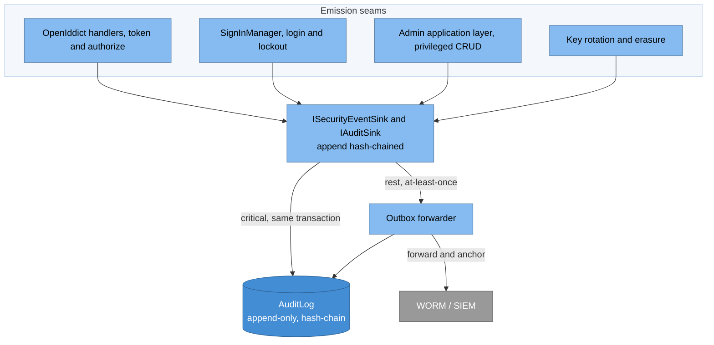
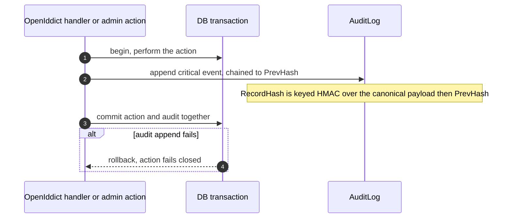
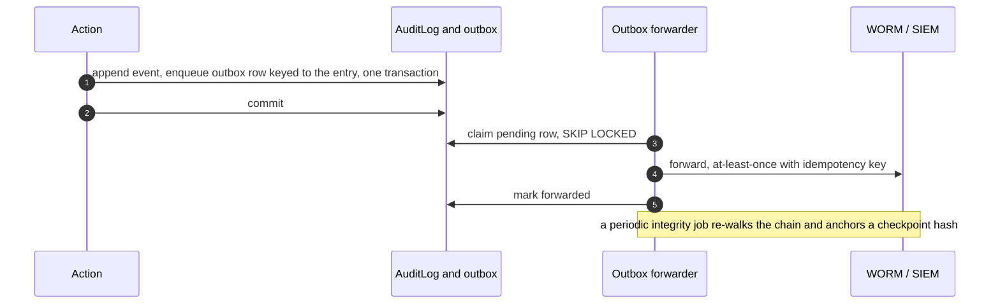

# Audit subsystem (detailed design)

## Purpose and scope

The tamper-evident, delivery-guaranteed audit trail: the ports, the typed event
catalog covering the negative paths, the hash-chain, the delivery model (critical
events synchronous in-transaction, the rest through a durable outbox), forwarding
to a write-once/SIEM destination, the periodic integrity job, and the strict
separation from diagnostic logging. It is a cross-cutting subsystem that emits from
Phase 03 onward.

In scope: the audit ports and their contract, hash-chain computation, the delivery
guarantee, the outbox forwarder, the integrity job, PII/erasure reconciliation, and
the two-lane invariant. Out of scope: the `AuditLog` and outbox **schema** (owned
by [02-data](02-data.md)), the diagnostics lane (14, observability), the erasure
saga itself (13), and the concrete SIEM product.

## Decisions realized

| Decision | What this design applies |
|---|---|
| ADR-0008 | First-class `ISecurityEventSink`/`IAuditSink`; typed catalog with failure/denial/error; append-only hash-chain; delivery guarantee; WORM/SIEM via outbox; integrity job |
| ADR-0022 | Two lanes: audit is separate from `ILogger`/OpenTelemetry and never routes through it; joined only by a correlation id |
| ADR-0016 | Reconcile the immutable chain with right-to-erasure via per-subject crypto-shred |
| ADR-0006 | The audit destination is a cloud-agnostic port with per-target adapters |
| ADR-0001 | Every event carries tenant context; the store is global and tenant-tagged |

## Component and interface design

### Ports (in `Nami.Identity.Abstractions`)

OpenIddict ships no native security-event or audit sink, so this is a first-class
build rather than a mapping onto `ILogger`. Two ports split by responsibility (ISP),
both hash-chained and delivery-guaranteed:

* **`IAuditSink`** records business audit (client provisioned, consent granted,
  role assigned, key rotated). `AppendAsync(AuditEvent) -> AuditChainEntry` returns
  the new chain entry and never swallows an exception.
* **`ISecurityEventSink`** records security events (login failure, token reject,
  replay detected, degraded-mode enabled, break-glass). It may forward to SIEM/SOC.

Both are cloud-agnostic ports (ADR-0006): the default adapter writes to `AuditLog`
plus the outbox forwarder; per-target adapters cover an immutable log store or SIEM
(Azure Log Analytics immutable, S3 Object Lock, Elastic, Splunk, or an OSS target).

### Emission seams

Events are emitted from OpenIddict event handlers (token/authorize, at an
order-anchored position so every issue-token branch passes through), from
`SignInManager` (login success/failure, lockout), from the admin Application layer
(privileged CRUD and dual-control transitions), and from key rotation and erasure.
The typed catalog covers success **and** the negative paths: `login_success`,
`login_failure`, `lockout`, `token_issued`, `token_revoked`, `consent_grant`,
`consent_revoke`, `refresh_reuse_detected`, `admin_config_change`, `key_rotation`,
`force_logout`, `mass_revoke`, `key_purge`, `erasure`, `degraded_mode_enabled`,
`break_glass`, `client_auth_failure`, and
`unhandled_exception`.

### Hash-chain

Each record carries `RecordHash`, an HMAC/SHA-256 over a canonical TEXT
serialization of the payload followed by the previous record's hash, that is
`HMAC/SHA-256(canonical(fields) || PrevHash)`, with the genesis `PrevHash` a
32-byte zero; the concatenation order matches the schema definition in
[02-data](02-data.md) so the writer and verifier agree byte-for-byte. The canonical form is hashed separately
because `jsonb` does not preserve input bytes. The HMAC key is resolved through
`ISecretResolver` (ADR-0009) so the application, not a table editor, holds it.
Storage is append-only: INSERT grant only, with `REVOKE UPDATE/DELETE/TRUNCATE` plus a block trigger;
because a superuser can still tamper with storage, the hash-chain plus an external
WORM anchor is what actually provides tamper-evidence, not the grants alone.

### Delivery guarantee, performance, and no duplication

Audit must be trustworthy without dragging the hot path. The synchronous portion is
kept minimal and everything I/O-heavy runs in the background:

* **Critical events** (a small, Security-ratified set: `token_issued`/`token_revoked`,
  `admin_config_change`, `key_rotation`) are appended by a **single local INSERT
  inside the action's already-open transaction**, so if the append fails the action
  rolls back (fail-closed). The only hot-path cost is that one INSERT; there is
  **never an external SIEM/WORM call on the request path**, and the critical set is
  bounded and measured against the SLO (ADR-0041). Everything else carries no
  synchronous audit cost.
* **The rest** are enqueued in the action's transaction and relayed by a background
  forwarder: at-least-once with **retry** (exponential backoff plus jitter, a bounded
  attempt cap) and a **dead-letter** state that raises a security event and pages, so
  a transient sink outage never loses an event and never creates a blind spot.
  Fire-and-forget is forbidden.
* **No duplicated delivery.** Each forwarded entry carries an idempotency key, so an
  at-least-once retry produces no duplicate record at the destination (an idempotent
  target makes delivery effectively-once), matching the shared outbox chassis (07),
  which dedupes on a unique idempotency key. The `AuditLog` row is the single durable
  record and the outbox is a transient forwarding queue keyed to the entry; whether
  that row copies the payload (as the shared chassis does) or references the
  `AuditLog` `EntryId` is an audit-specific build choice, not asserted here.
* **Correct tenant.** The tenant is captured **at emission** (the request's resolved
  tenant, or the target tenant of an admin action) and stored as `TargetTenantId`.
  The audit store is global and tenant-tagged, so the background forwarder reads
  globally and preserves each row's tag; it does **not** rely on an ambient tenant at
  forward time, unlike the tenant-scoped email/logout outbox. A missing tag fails the
  write rather than defaulting to a wrong tenant.

These are elaborations within ADR-0008 (synchronous-critical plus outbox-for-the-rest,
tenant-tagged), not a new decision; going fully asynchronous for the critical set
would drop the fail-closed guarantee and would be an ADR-0008 change.

### Integrity job and two-lane separation

A periodic integrity job re-walks the chain, asserts each `RecordHash`, and anchors
a checkpoint hash into the WORM/SIEM destination. The **audit lane is separate from
the diagnostics lane** (`ILogger` plus OpenTelemetry, doc 14): audit never routes
through the telemetry pipeline, which lacks tamper-evidence and a delivery
guarantee. The two are joined only by a correlation/trace id. An adapter that
silently drops (for example an in-memory sink that discards on overflow) violates
the delivery-guarantee contract and is a test failure, not an acceptable degrade.

### Libraries

No new third-party dependency: the chain uses the BCL
(`System.Security.Cryptography` HMAC/SHA-256), the store uses the EF/Npgsql stack
of [02-data](02-data.md), and the optional SIEM/WORM adapters are per-cloud
(permissive, selected by configuration like the other cloud ports, ADR-0006).

### Patterns applied

Named per ADR-0066 (a vocabulary, applied where it clarifies intent):

* **Transactional Outbox** for delivery-guaranteed, at-least-once forwarding with
  no blind spot.
* **Adapter** for the cloud-agnostic sink (database default, SIEM/WORM per target).
* **Append-only hash-chain** (ledger / Merkle-style) for tamper-evidence.

## Data model

No new tables. The subsystem writes `AuditLog` and uses the outbox chassis, both
defined in [02-data](02-data.md). The one schema constraint this design depends on:
the erasure-relevant identifier columns (`ActorSub`, `OnBehalfOfSubject`) are
ciphertext-at-write, so destroying a per-subject key removes the plaintext while
keeping `RecordHash` stable (ADR-0016).

## Runtime flows

### Critical event, synchronous in-transaction

### Non-critical event, outbox and forwarder

## Edge cases and failure modes

* **Sink or store down**: critical events fail the action (fail-closed); the rest
  stay durable in the outbox and are retried, so there is no blind spot.
* **`jsonb` byte non-determinism**: the hash is over a canonical TEXT form, not the
  stored `jsonb`.
* **Privileged tampering**: append-only grants do not stop a superuser; the
  hash-chain plus the external WORM anchor detect tampering after the fact.
* **Erasure versus immutability**: crypto-shred destroys the per-subject key so the
  identifiers become unreadable while `RecordHash` stays valid and the chain still
  verifies; because events are forwarded as ciphertext, key destruction also renders
  the immutable WORM/SIEM copy unreadable (WORM cannot be deleted from), and a
  redaction-assurance check covers the SIEM forward lane (ADR-0016).
* **Duplicate delivery**: the claim step (SKIP LOCKED) stops two forwarders sending
  the same row, and the idempotency key lets the destination dedupe, so at-least-once
  never yields a duplicate record.
* **Exhausted retries**: after the bounded attempt cap the entry moves to a
  dead-letter state that raises a security event and pages; it is never silently
  dropped.
* **Wrong tenant tag**: the tenant is captured at emission, not at forward time; a
  background emitter must set the target tenant explicitly, and a missing tag fails
  the write rather than defaulting.
* **Ordering**: the chain order is the insert order; cross-lane correlation is by
  the trace id, not by audit timestamps.

## Security considerations

* Tamper-evidence is the point: append-only plus hash-chain plus an external WORM
  anchor, with the HMAC key held outside the database (ADR-0009).
* PII discipline: redact non-essential PII and never log raw secrets or tokens;
  keep only the accountability identifiers, and store those as ciphertext so
  erasure can crypto-shred them (ADR-0008, ADR-0016).
* The two-lane invariant is a security control: routing audit through the
  diagnostics pipeline would lose tamper-evidence and delivery, so it is forbidden
  (ADR-0022).
* Emission covers denials and failures, not just successes, so the trail supports
  incident response and abuse detection.

## Testing strategy

* **Integrity test**: tampering with a stored row is detected by the chain walk.
* **Delivery tests**: a failed critical-event append rolls back its action;
  the outbox relays at-least-once with no duplicate under two concurrent forwarders.
* **LSP contract test**: an in-memory sink that silently drops fails the
  delivery-guarantee contract.
* **Negative-path coverage**: failure, denial, and error events are actually
  emitted from the handlers and `SignInManager`.
* **Erasure test**: after crypto-shred, the identifiers are unreadable and the
  chain still verifies (ADR-0016).
* **Two-lane independence**: with the telemetry collector blocked under load, the
  audit outbox retains and relays every event, proving a diagnostics-lane outage
  does not drop audit.
* **No-duplicate test**: a forced retry delivers at-least-once but the idempotent
  destination keeps a single record, and the outbox references the entry rather than
  copying the payload.
* **Dead-letter test**: exhausting the retry cap moves the entry to dead-letter and
  raises a security event.
* **Tenant-tag test**: an event is tagged with the acting/target tenant, and a
  background-emitted event forwards under the correct tenant.
* **Performance test**: the synchronous critical append adds one INSERT to the
  action transaction and no external call, measured against the SLO (ADR-0041).

## Open and build-time items

* DPO/Security ratify the minimum event catalog, the retention window, the
  PII-redaction policy, and the concrete WORM/SIEM destination (ADR-0008, Pre-GA
  checklist).
* The exact set of events that commit synchronously (the critical set) is a
  Security ratification item.
* Where the audit HMAC key lives and how it rotates is resolved through
  `ISecretResolver` and confirmed at build (ADR-0009).
* The SIEM/WORM adapter (and whether to ship more than one) is a build-time pick.

## References

* Architecture overview: [components](../architecture/04-components.md) (the audit
  subsystem and the two-lane split), [cross-cutting](../architecture/07-cross-cutting.md).
* Design: [02-data](02-data.md) (the `AuditLog` and outbox schema).
* ADRs: 0008 (audit subsystem), 0022 (two lanes), 0016 (erasure crypto-shred),
  0006/0009 (cloud-agnostic sink and secret resolution), 0001 (tenant-tagged),
  0041 (the SLO the synchronous critical append is measured against).

---

[← Prev: Data tier](02-data.md) · [Index](README.md) · Next: [Core protocol server →](04-core-protocol.md)
