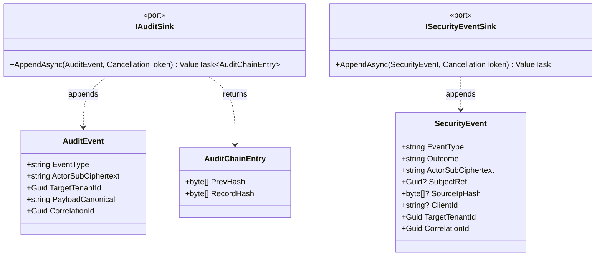
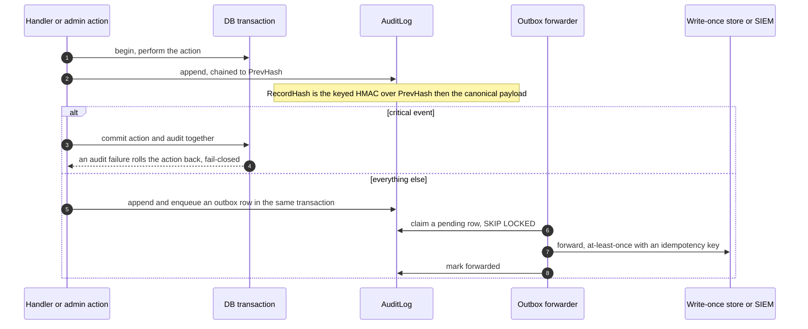
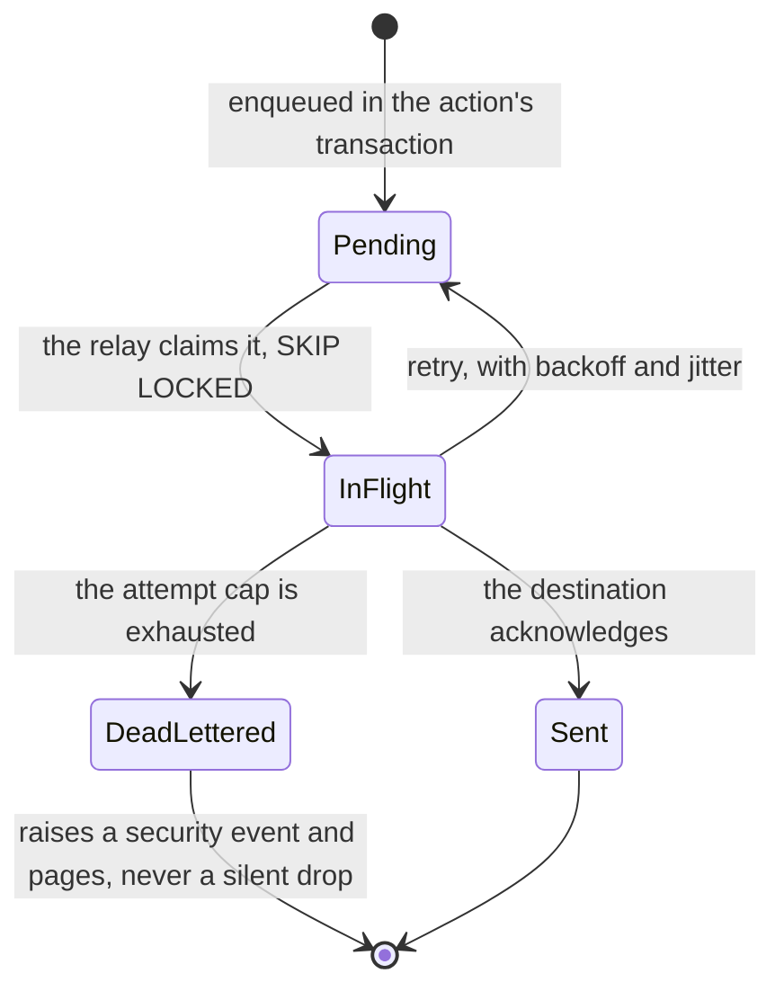
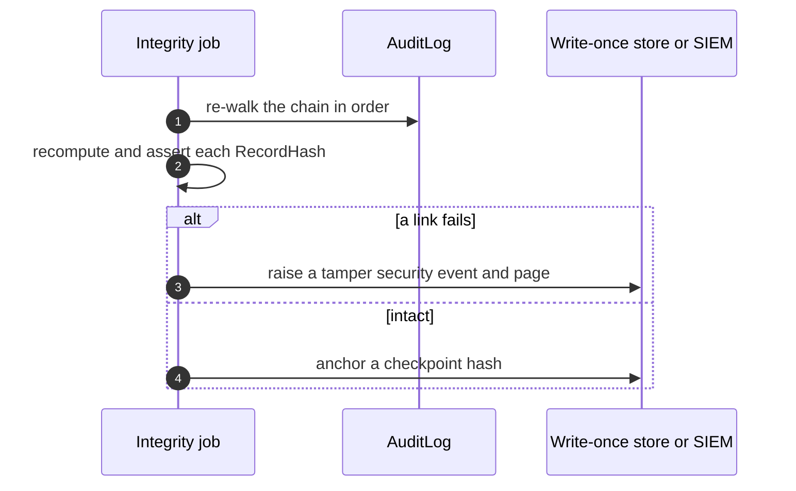

# Audit subsystem (detailed design)

> **Sits under:** [architecture: security architecture](../architecture/13-security-architecture.md)
> (audit as a security control) and
> [observability and monitoring](../architecture/16-observability-monitoring.md)
> (the two-lane split). Those state the invariants; this document gives the interfaces, the
> chain algorithm, the delivery mechanism, and the verify job.
> **Implementer source of record:** this document. The `AuditLog` and outbox **schema** are
> [02](02-data.md); the diagnostics lane is [19](19-observability-capacity-slo.md); the
> erasure saga that drives crypto-shred is [17](17-erasure-and-data-subject-rights.md).

Calling an audit trail "immutable" is an adjective, not a mechanism. This document is the
mechanism. The starting point is a rejection: **`ILogger` is not an audit trail.** It is
lossy by design, it is mutable, it has no delivery guarantee, and nobody writes a log line
for the path that was denied. Audit is a first-class port, not a log level.

## 1. Decisions realized

| Decision | What this design applies |
|---|---|
| ADR-0008 | First-class `IAuditSink` and `ISecurityEventSink`; the typed catalog covering failure, denial, and error; the append-only keyed hash-chain; the delivery guarantee; forwarding to write-once storage through an outbox; the integrity job |
| ADR-0022 | Two lanes: audit is separate from the diagnostics pipeline and never routes through it, joined only by a correlation id |
| ADR-0016 | Reconciling an immutable chain with the right to erasure, through per-subject crypto-shred |
| ADR-0006 | The audit destination is a cloud-agnostic port with per-target adapters |
| ADR-0009 | The chain's HMAC key is resolved through the secret port, so the application holds it and the database does not |
| ADR-0001 | Every event carries tenant context; the store is global and tenant-tagged |
| ADR-0053 | The consent receipt as an immutable historical record, distinct from mutable authorization state |
| ADR-0041 | The synchronous critical append is measured against the latency objective |

## 2. Purpose and scope

In scope: the audit ports and their contract, the typed event catalog including the negative
paths, hash-chain computation, the delivery model, the outbox forwarder, the integrity job,
the erasure reconciliation, and the two-lane invariant.

Out of scope: the `AuditLog` and outbox **schema**, owned by [02](02-data.md); the
diagnostics lane, owned by [19](19-observability-capacity-slo.md); the erasure saga itself,
owned by [17](17-erasure-and-data-subject-rights.md); and the choice of a concrete
write-once or SIEM product.

This subsystem is **a prerequisite of its own emitters**, which is why it is early rather
than late. The start-up hardening guard emits a security event when it refuses to serve a
degraded configuration (ADR-0043), and that happens before the application handles a single
request. The protocol path then emits token-reject and replay events. A sink that arrived
after them would be a sink that missed the first thing worth recording.

## 3. Interfaces and contract

Two ports, split by responsibility. Neither may swallow an exception.


```mermaid
classDiagram
  class IAuditSink {
    <<port>>
    +AppendAsync(AuditEvent, CancellationToken) ValueTask~AuditChainEntry~
  }
  class ISecurityEventSink {
    <<port>>
    +AppendAsync(SecurityEvent, CancellationToken) ValueTask
  }
  class AuditEvent {
    +string EventType
    +string ActorSubCiphertext
    +Guid TargetTenantId
    +string PayloadCanonical
    +Guid CorrelationId
  }
  class SecurityEvent {
    +string EventType
    +string Outcome
    +string ActorSubCiphertext
    +Guid? SubjectRef
    +byte[]? SourceIpHash
    +string? ClientId
    +Guid TargetTenantId
    +Guid CorrelationId
  }
  class AuditChainEntry {
    +byte[] PrevHash
    +byte[] RecordHash
  }
  IAuditSink ..> AuditEvent : appends
  IAuditSink ..> AuditChainEntry : returns
  ISecurityEventSink ..> SecurityEvent : appends
```

* **`IAuditSink`** records the business trail: a client provisioned, consent granted, a role
  assigned, a key rotated. It **returns the new chain entry**, which is what lets a caller
  assert the append actually happened rather than assuming it.
* **`ISecurityEventSink`** records security events: a login failure, a token reject, a replay,
  degraded mode enabled, break-glass. `Outcome` is a field rather than part of `EventType`,
  so a query for "every denial" does not depend on parsing names.

**The three grouping keys, and why the obvious field does not serve** (ADR-0082). Abuse
rules are per-user, per-client, or per-address, and none of those can be a metric tag under
ADR-0077, so they must be answerable here. They were not.

* **`SubjectRef`** is the groupable subject key. `ActorSubCiphertext` cannot serve: it is
  per-subject ciphertext under the crypto-shred default below, so two events for one person
  need not share a value, and making the encryption deterministic to allow grouping would
  weaken the shred. `SubjectRef` is the **same** surrogate the processing-restriction table
  and the `SubjectDek` vault already use (ADR-0016), deliberately, so erasure still has
  exactly one mapping to destroy. After that destruction the value is an opaque orphan:
  history still groups, nobody resolves it to a person.
* **`SourceIpHash`** is a keyed HMAC-SHA256 and is **not truncated**. Truncation buys no real
  privacy against an input space this small and creates collisions, and a collision in an
  abuse rule is false attribution, which is worse than none. It is a **pseudonym, not
  anonymisation**: anyone holding the key can brute-force the address space, so the
  protection is key custody plus access control, not the hash. Nullable and
  emission-configurable, because its data-protection basis is a pre-GA ratification item;
  per-address **detection** does not depend on it (ADR-0083 evaluates the address in a
  bounded in-memory window that stores nothing).
* **`ClientId`** is a registered application identifier, not personal data, so it is stored
  plainly. It stays off the metric lane regardless, because it is unbounded there.

All three are in the **canonical hashed field set from genesis**. Adding one later is a chain
schema version rather than an ordinary migration, which is the reason they are decided before
the first rule is written rather than when one is needed.

Both are cloud-agnostic ports (ADR-0006). The default adapter writes to `AuditLog` plus the
outbox; per-target adapters cover an immutable log store or a SIEM.

**Three anti-patterns are forbidden, and each has been seen in the wild:**

1. **Using the logger as the audit trail.** It is lossy, mutable, and undelivered.
2. **Fire-and-forget.** An append whose failure nobody observes is not a guarantee.
3. **Auditing after the business transaction commits, with no outbox and no retry.** This is
   the subtle one: it looks correct, it passes every happy-path test, and it loses exactly
   the records that matter, the ones written when something was already going wrong.

`PayloadCanonical` is the canonical **TEXT** rendering, not the stored `jsonb`, for the
reason in section 5.2.

## 4. Data and structure

No tables of its own beyond the `AuditLog` in [02](02-data.md). The audit forward-queue
table is a schema item to add there: ADR-0008 mandates the forwarder but the corpus does not
specify its DDL, so it is an open build-time item.

The schema constraint this design depends on: every subject-bearing column, `ActorSub`,
`OnBehalfOfSubject`, `ApproverSub`, and the `ActorChainJson` delegation chain, is
**ciphertext at write time**, so destroying a per-subject key removes the plaintext while
leaving `RecordHash` stable (ADR-0016).

That per-subject key is a data key held **only** in the separate `SubjectDek` vault ([02](02-data.md)):
AES-256-GCM, generated lazily on a subject's first audit record carrying personal data,
wrapped by the ADR-0006 keyring master key, and **never written to `AuditLog`, its backups,
the SIEM, or write-once storage**, which hold ciphertext only. That separation is exactly
what lets a crypto-shred reach the immutable copies: destroying the key renders every
ciphertext copy unreadable, including replicas and write-once storage, **without deleting an
append-only row** (Recital 66).

The mechanism is an `IAuditChainScrubber` with three ordered modes, and the order is the
design:

| Mode | Status | What it does |
|---|---|---|
| **PII outside the chain** | the schema design target | an opaque `SubjectRef` plus a separately deletable mapping, so the chain never hashes personal data and erasure is a row delete in the mapping table |
| **Crypto-shred** | the runtime default | the subject identifier is ciphertext; erasure destroys the key |
| Anonymise in place | deferred, an opt-in stub that throws | never the default, because rewriting a hashed row is the one operation the chain exists to make detectable |

The erasure saga that drives it is [17](17-erasure-and-data-subject-rights.md).

## 5. Behaviour

### 5.1 Emission seams and the catalog

Events are emitted from protocol event handlers (token and authorize, at an **order-anchored**
position so every issue-token branch passes through the sink), from the sign-in manager
(login success and failure, lockout), from the admin application layer (privileged writes and
dual-control transitions), and from key rotation and erasure. Emitting from a handler is what
keeps coverage uniform; scattering log calls as pseudo-audit is what does not.

The catalog covers success **and** the negative paths: `login_success`, `login_failure`,
`lockout`, `token_issued`, `token_revoked`, `consent_grant`, `consent_revoke`,
`refresh_reuse_detected`, `token_reject`, `admin_config_change`, `authz_decision`,
`dual_control_approval`, `key_rotation`, `force_logout`, `mass_revoke`, `key_purge`,
`erasure`, `degraded_mode_enabled`, `break_glass`, `client_auth_failure`, and
`unhandled_exception`. Each has a fixed payload schema and feeds the abuse-alert rules
([19](19-observability-capacity-slo.md)).

Two entries in that list are there for reasons worth stating. `client_auth_failure` at the
token endpoint is the credential-stuffing signal, and `unhandled_exception` covers the error
category rather than only operational failure, so a crash is auditable rather than merely
logged.

The consent receipt (`consent_grant`, with `consent_revoke` on revocation) carries a fixed
payload: subject, client, tenant, scope set, purpose, legal basis, policy version hash,
consent timestamp, interface locale, and method. It is the immutable historical record, and
it is deliberately distinct from the mutable authorization state (ADR-0053,
[13](13-revocation-propagation-and-caching.md)). On erasure the saga appends a `subject.erased` tombstone
carrying the subject reference, the erased fields, and the basis for anything retained, as
chained proof of erasure; the wider data-subject-rights event set is
[17](17-erasure-and-data-subject-rights.md).

### 5.2 The hash chain

```text
RecordHash = HMAC_k( PrevHash || canonical(fields) )
```

Genesis `PrevHash` is 32 zero **bytes**, not a string. Three properties are load-bearing and
each answers a different attack:

* **Keyed, not bare.** An HMAC with an application-held key, rather than a plain digest, so
  an attacker who can write to the database still cannot recompute a valid chain. The key is
  resolved through `ISecretResolver` (ADR-0009), so the application holds it and a table
  editor does not. ADR-0008 records this as an upgrade from an earlier bare form and calls
  that form a real weakness rather than a notation shorthand.
* **Prev-first operands.** `PrevHash`, then the canonical record. This is the standard
  convention, so an independent verifier can reproduce the chain, and it must match the
  schema definition in [02](02-data.md) byte for byte or the verify job reports false breaks.
* **Canonical TEXT.** PostgreSQL `jsonb` does not preserve input byte order, so hashing the
  stored column would produce a hash that depends on the database's internal representation.
  The same canonicalisation is reused if a field is later scrubbed.

**The field set is fixed from genesis, which is why the ADR-0082 grouping keys are added
now.** `canonical(fields)` covers a specific list, and changing that list changes every
subsequent record hash: a chain written under one field set cannot be verified under another,
so introducing a column later is a chain **schema version** with a migration of its own, not
an ordinary `ALTER TABLE`. `SubjectRef`, `SourceIpHash`, and `ClientId` are therefore in the
set from the start even though no rule reads them yet. A nullable column that is always null
costs a null marker in the canonical form; a column added after go-live costs a versioned
chain.

Storage is append-only: an insert grant only, with update, delete, and truncate revoked, plus
a blocking trigger as a backstop. **This does not stop a superuser, which is precisely why
the chain exists**: grants prevent tampering by the application, and the chain plus an
external anchor detect tampering by anyone else.

### 5.3 Delivery, and what it costs the hot path

Audit must be trustworthy without dragging the request path, so the synchronous portion is
kept minimal and everything expensive runs behind it.

* **Critical events**, a small Security-ratified set (`token_issued` and `token_revoked`,
  `admin_config_change`, `key_rotation`), are appended by **one local insert inside the
  action's already-open transaction**. If the append fails, the action rolls back: fail-closed.
  The only hot-path cost is that insert, and there is **never an external call on the request
  path**. The set is bounded and measured against the objective (ADR-0041).
* **Everything else** is enqueued in the action's transaction and relayed by a background
  forwarder: at-least-once with exponential backoff plus jitter, a bounded attempt cap, and a
  **dead-letter** state that raises a security event and pages. A transient sink outage must
  never become a blind spot.
* **No duplicate delivery.** Each forwarded entry carries an idempotency key, so an
  at-least-once retry produces no duplicate at the destination. The `AuditLog` row is the
  single durable record and the outbox is a transient forwarding queue keyed to it; whether
  that row copies the payload or references the entry identifier is an audit-specific build
  choice, not asserted here.
* **The tenant is captured at emission**, from the request's resolved tenant or the target
  tenant of an admin action, and stored as `TargetTenantId`. The store is global and
  tenant-tagged, so the forwarder reads globally and preserves each row's tag; it does **not**
  rely on an ambient tenant at forward time, unlike the tenant-scoped mail and logout outbox.
  A missing tag fails the write rather than defaulting to a wrong tenant.

These are elaborations within ADR-0008, not a new decision. Going fully asynchronous for the
critical set would drop the fail-closed guarantee and would require changing that ADR.


```mermaid
sequenceDiagram
  autonumber
  participant H as Handler or admin action
  participant Tx as DB transaction
  participant AL as AuditLog
  participant R as Outbox forwarder
  participant W as Write-once store or SIEM
  H->>Tx: begin, perform the action
  H->>AL: append, chained to PrevHash
  Note over AL: RecordHash is the keyed HMAC over PrevHash then the canonical payload
  alt critical event
    H->>Tx: commit action and audit together
    Tx-->>H: an audit failure rolls the action back, fail-closed
  else everything else
    H->>AL: append and enqueue an outbox row in the same transaction
    R->>AL: claim a pending row, SKIP LOCKED
    R->>W: forward, at-least-once with an idempotency key
    R->>AL: mark forwarded
  end
```

The outbox row's own lifecycle, which is where the delivery guarantee actually lives:


```mermaid
stateDiagram-v2
  [*] --> Pending : enqueued in the action's transaction
  Pending --> InFlight : the relay claims it, SKIP LOCKED
  InFlight --> Sent : the destination acknowledges
  InFlight --> Pending : retry, with backoff and jitter
  InFlight --> DeadLettered : the attempt cap is exhausted
  DeadLettered --> [*] : raises a security event and pages, never a silent drop
  Sent --> [*]
```

### 5.4 The integrity job and the two lanes

A periodic job re-walks the chain, asserts each `RecordHash`, and **anchors a checkpoint hash**
into the write-once destination, so external immutability backs the internal chain.


```mermaid
sequenceDiagram
  autonumber
  participant J as Integrity job
  participant AL as AuditLog
  participant W as Write-once store or SIEM
  J->>AL: re-walk the chain in order
  J->>J: recompute and assert each RecordHash
  alt a link fails
    J->>W: raise a tamper security event and page
  else intact
    J->>W: anchor a checkpoint hash
  end
```

**The audit lane is separate from the diagnostics lane** ([19](19-observability-capacity-slo.md)):
audit never routes through the telemetry pipeline, which has neither tamper-evidence nor a
delivery guarantee. The only link between them is a shared correlation and trace id. This is
a hard invariant, not a preference.

It carries an obligation on **every** adapter, including test doubles: an implementation that
silently drops, for instance an in-memory sink that discards on overflow, violates the
delivery-guarantee contract and is a **test failure**, not an acceptable degradation. A
substitute that weakens the contract is not a substitute.

## 6. Dependencies and wiring

No new third-party dependency. The chain uses the base class library's HMAC and SHA-256, the
store uses the persistence stack of [02](02-data.md), and the optional write-once and SIEM
adapters are per-target and selected by configuration like the other cloud ports (ADR-0006).

| Library | Purpose | License |
|---|---|---|
| `System.Security.Cryptography` (BCL) | The keyed hash chain | MIT, part of the runtime |
| EF Core and Npgsql | The append-only store and the outbox | MIT and a BSD-class licence |
| Per-target write-once or SIEM adapters | Forwarding, selected by configuration | permissive, per ADR-0026 |

> **Patterns applied** (ADR-0066). **Transactional Outbox** for delivery-guaranteed
> at-least-once forwarding with no blind spot, the same chassis as mail and logout
> ([10](10-email-notification.md)). **Adapter** for the cloud-agnostic sink. And an
> **append-only hash chain**, which is the ledger pattern and is the only one of the three
> that is load-bearing for security rather than for structure.

## 7. Error handling, edge cases, invariants

* **Sink or store down**: critical events fail their action, fail-closed; the rest stay
  durable in the outbox and retry, so there is no blind spot either way.
* **`jsonb` byte non-determinism**: the hash is over a canonical TEXT form, never the stored
  column.
* **Privileged tampering**: append-only grants do not stop a superuser; the chain plus the
  external anchor detect it after the fact.
* **Erasure versus immutability**: crypto-shred destroys the per-subject key, so identifiers
  become unreadable while `RecordHash` stays valid and the chain still verifies. Because
  events are forwarded as ciphertext, key destruction also renders the immutable copy
  unreadable, which matters because write-once storage cannot be deleted from. A
  redaction-assurance check covers the forward lane (ADR-0016).
* **Duplicate delivery**: the claim step stops two forwarders sending the same row, and the
  idempotency key lets the destination deduplicate, so at-least-once never yields a duplicate.
* **Exhausted retries**: the entry moves to dead-letter, raises a security event, and pages.
  It is never silently dropped.
* **Wrong tenant tag**: the tenant is captured at emission, not at forward time; a background
  emitter sets the target tenant explicitly, and a missing tag fails the write.
* **Ordering**: chain order is insert order. Cross-lane correlation is by trace id, never by
  audit timestamps.
* **Silo isolation**: a hard-isolated Silo tenant may use a separate audit store and a
  separate SIEM destination; global-plane events such as identity and membership are audited
  at the global tier (ADR-0008, ADR-0001).

## 8. Security and multi-tenancy notes

Tamper-evidence is the whole point, and it is three mechanisms rather than one: append-only
storage, the keyed chain, and an external anchor, with the chain key **application-held
rather than sitting in the database it protects** (ADR-0008, whose keyed `HMAC_k` form is
what requires it; its custody follows the store-access model of ADR-0009). Any two of the
three without the third leaves a gap.

Personal-data discipline: non-essential data is redacted rather than written, raw secrets and
tokens are never recorded, and the accountability identifiers that cannot be dropped are
stored as ciphertext so erasure can reach them (ADR-0008, ADR-0016).

The two-lane invariant is itself a security control. Routing audit through the diagnostics
pipeline would lose tamper-evidence and delivery in one move, which is why it is forbidden
rather than discouraged (ADR-0022).

Emission covers denials and failures, not only successes, because a trail that records only
what worked is useless for incident response and for abuse detection alike.

## 9. Testing

* **Integrity**: tampering with a stored row is detected by the chain walk.
* **Delivery**: a failed critical append rolls back its action; the outbox relays
  at-least-once with no duplicate under two concurrent forwarders.
* **Substitutability contract**: an in-memory sink that silently drops fails the
  delivery-guarantee contract.
* **Negative-path coverage**: failure, denial, and error events are actually emitted from the
  handlers and the sign-in manager.
* **Erasure**: after a crypto-shred the identifiers are unreadable and the chain still
  verifies.
* **Two-lane independence**: with the telemetry collector blocked under load, the audit
  outbox retains and relays every event, proving a diagnostics outage does not drop audit.
* **No duplicate**: a forced retry delivers at-least-once but the idempotent destination keeps
  one record.
* **Forward adapter**: the cloud-agnostic adapter delivers, and a redaction-assurance scan
  asserts no personal data of an erased subject remains on the forward lane.
* **Dead letter**: exhausting the attempt cap moves the entry to dead-letter and raises a
  security event.
* **Tenant tag**: an event is tagged with the acting or target tenant, and a
  background-emitted event forwards under the correct tenant.
* **Performance**: the synchronous critical append adds one insert to the action transaction
  and no external call, measured against the objective (ADR-0041).

## 10. Open and build-time items

* **DPO and Security ratify** the minimum event catalog, the retention window (obligation-bound
  under Article 17(3) and Recital 65, explicitly **not** "keep forever"), the redaction policy,
  and the concrete write-once or SIEM destination (ADR-0008, and the pre-GA checklist).
* **Data residency on the forward lane**: the adapter asserts that the destination region
  equals the tenant's declared residency, so personal data does not leave it. Recommended,
  pending DPO ratification (ADR-0054).
* **The exact critical set** that commits synchronously is a Security ratification item.
* **Where the audit HMAC key lives and how it rotates** resolves through `ISecretResolver`
  and is confirmed at build (ADR-0009).
* **The forward adapter**, and whether more than one ships, is a build-time pick.
* **The audit forward-queue table** is a schema item to add in [02](02-data.md); ADR-0008
  mandates the forwarder but not its DDL.

## 11. Sources

* **ADRs:** 0008 (the owning decision), 0022 (two lanes), 0016 (erasure and crypto-shred),
  0006 and 0009 (the cloud-agnostic sink and the key), 0001 (tenant tagging), 0053 (the
  consent receipt), 0041 (the objective the synchronous append is measured against), 0043
  (the start-up guard that is the first emitter), 0054 (residency on the forward lane).
* **Architecture:** [security architecture](../architecture/13-security-architecture.md),
  [observability and monitoring](../architecture/16-observability-monitoring.md),
  [component view](../architecture/08-component-view.md),
  [cross-cutting concepts](../architecture/11-cross-cutting-concepts.md).
* **Design:** [02](02-data.md) (the schema and the subject-key vault),
  [10](10-email-notification.md) (the outbox chassis this reuses),
  [13](13-revocation-propagation-and-caching.md) (the mutable authorization state the receipt is distinct
  from), [17](17-erasure-and-data-subject-rights.md) (the erasure saga),
  [19](19-observability-capacity-slo.md) (the diagnostics lane and the alert rules).
* Reconciled against the design corpus's audit subsystem design on 2026-07-27. That document
  is one of the corpus's **originally written** designs rather than a digest of a root
  document, so it was read as a primary source. The reconcile found **nothing to import**:
  every one of its eleven sections is already covered here, and this document is broader on
  the event catalog, the tenant-capture rule, the three-mode scrubber, the subject-key vault,
  and the test set. Three shapes were adopted from it: the event field contracts as a class
  diagram, the outbox row's state machine, and the third forbidden anti-pattern, auditing
  after the business transaction commits with no outbox. On the chain formula the corpus
  notes that its own decision record and one of its designs write a bare digest while another
  recommends keying; ADR-0008 here already records that reconcile and adopts the keyed form.

---

[Prev: Data tier](02-data.md) · [Index](README.md) · Next: [Core protocol server](04-core-protocol.md)
