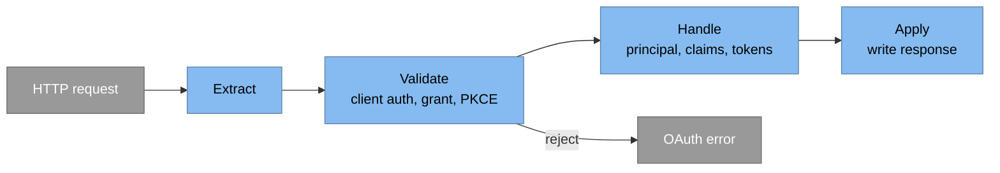
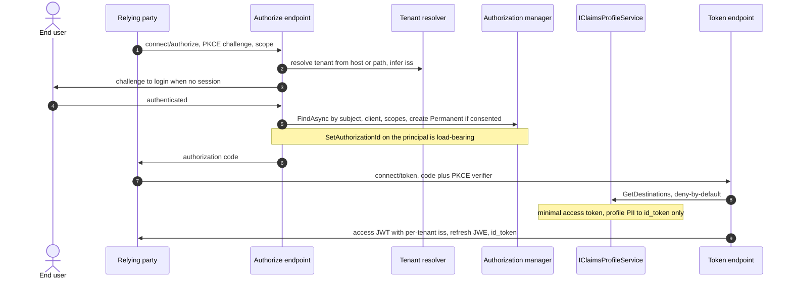
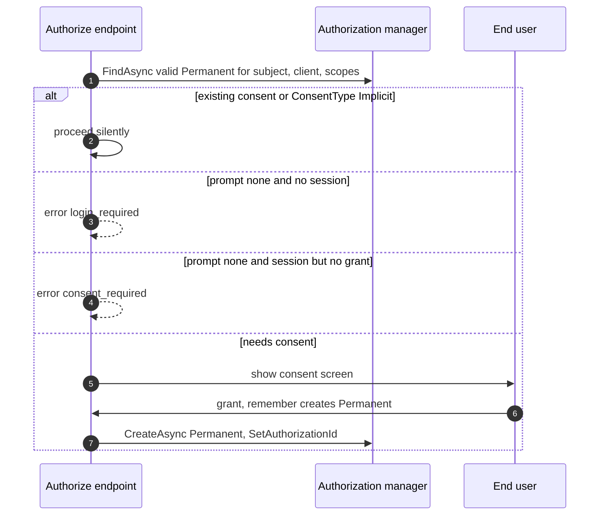
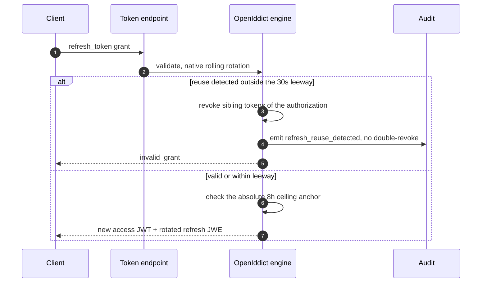
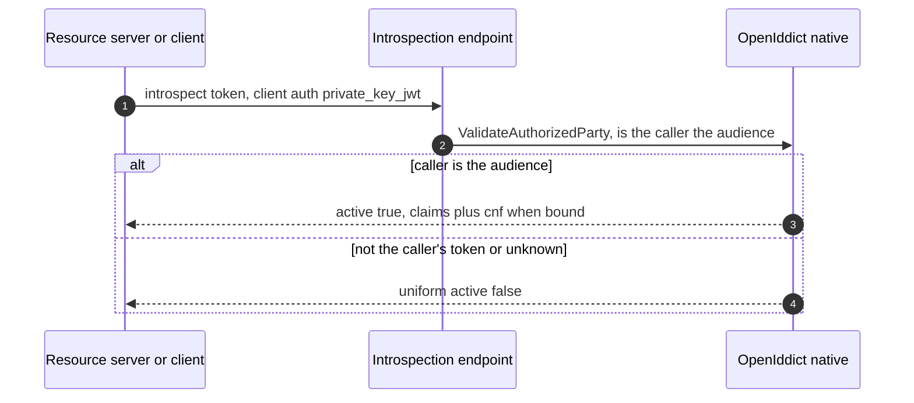

# Core protocol server (detailed design)

## Purpose and scope

The OAuth 2.0 / OIDC engine: the endpoint surface and discovery metadata, how
protocol behavior is extended (the OpenIddict event pipeline), the deny-by-default
claims choke-point, token formats, the refresh posture, consent persistence, tiered
revocation with isolated introspection/revocation, per-client CORS, and the
per-tenant issuer. It is Phase 03 and rests on the data tier (02).

In scope: the pipeline extension model, discovery metadata, `IClaimsProfileService`,
token format/lifetimes, refresh mechanics, consent, introspection/revocation
isolation, per-client CORS, and per-tenant issuer resolution. Out of scope: DPoP
handler internals (11), key rotation (09), user authentication/MFA/sessions and the
`acr`/`amr` producer and step-up (06), the login/consent UI (08), the resource-server
validation library (11), and the config layer (01).

## Decisions realized

| Decision | What this design applies |
|---|---|
| ADR-0004 | Keep native rolling refresh, reuse detection, family revoke; 30s leeway; 8h absolute ceiling; per-client `IssueRefreshToken`; disabled-user gate-at-issuance |
| ADR-0005 | Plain signed access-token JWT (`DisableAccessTokenEncryption`) with a minimal claim set; refresh/code/device stay JWE; RS256 baseline, ES256 configurable |
| ADR-0048 | Client-authenticated introspection/revocation, native `ValidateAuthorizedParty` confinement, uniform `active:false`, `cnf` in introspection |
| ADR-0039 | Tiered revocation: short-TTL JWT default, reference tokens + introspection where instant revoke is needed; per-client `AccessTokenType` |
| ADR-0050 | Per-client CORS via a custom `ICorsPolicyProvider`, applied only on the right endpoints |
| ADR-0049 | Per-tenant issuer; resource-server isolation by issuer + tenant binding (a shared Pool key is not the boundary) |
| ADR-0014 | mTLS native, DPoP built (11); JAR/JARM/RAR/EdDSA de-scoped; CIBA skipped |
| ADR-0021 | Native behaviors relied on are pinned seams: pipeline order, `ValidateAuthorizedParty`, PAR, the `Set*EndpointUris` method names, the `SetLogoutEndpointUris`->`SetEndSessionEndpointUris` rename, and auto-path-only-@7.5 |

## Component and interface design

### The extension model: one pipeline, order-anchored

Custom protocol behavior is an inserted OpenIddict event handler at a named,
order-anchored position, never a fork of the engine (ADR-0024/0021). The engine
runs four phases; handlers slot in and may short-circuit (`HandleRequest`,
`SkipRequest`, `Reject`).

Handler positions are anchored to named built-in descriptors (never hardcoded order
numbers) and pinned by a pipeline-snapshot test, so a version bump that reorders the
pipeline fails CI rather than production.

### Endpoint surface: pass-through versus fully-handled

The single most repeated wrong-API mistake in this domain is hand-rolling a
controller for an endpoint the engine already fully handles. The rule:

| Endpoint | Path (illustrative) | Mechanism |
|---|---|---|
| Discovery | `/.well-known/openid-configuration` | auto-pathed, per tenant issuer |
| JWKS | `/.well-known/jwks` | auto-pathed, per tenant issuer |
| Authorize | `connect/authorize` | pass-through controller (login/consent interaction) |
| Token | `connect/token` | pass-through controller (code+PKCE, client-credentials, refresh) |
| UserInfo | `connect/userinfo` | pass-through controller |
| End-session | `connect/endsession` | pass-through controller |
| Device / Verify | `connect/deviceauthorization`, `connect/enduserverification` | pass-through |
| PAR | `connect/par` | native, per-client requirement |
| Introspection | `connect/introspect` | **fully-handled native, no controller** |
| Revocation | `connect/revocation` | **fully-handled native, no controller** |

Only discovery and JWKS are auto-pathed; every other endpoint is enabled explicitly
via its `Set*EndpointUris` call. The path strings are configurable and non-normative
(the corpus itself varies, `connect/logout` versus `connect/endsession`); the fixed
seam is the method name, and `SetLogoutEndpointUris` was renamed
`SetEndSessionEndpointUris` in OpenIddict (a pinned ADR-0021 seam).

### Discovery metadata

The discovery document advertises the capability surface, and getting the flags
right is part of the protocol contract. Key advertised values:
`authorization_response_iss_parameter_supported=true` (RFC 9207),
`code_challenge_methods_supported=["S256"]` (plain removed),
`tls_client_certificate_bound_access_tokens=true`,
`token_endpoint_auth_methods_supported` covering `client_secret_basic`,
`client_secret_post`, `private_key_jwt`, and `tls_client_auth` /
`self_signed_tls_client_auth`, `dpop_signing_alg_values_supported` (once DPoP lands,
11), and `backchannel_logout_supported=true` with
`frontchannel_logout_supported=false`. Deliberately **not** advertised:
`check_session_iframe` (front-channel is dead) and the CIBA
`backchannel_authentication_endpoint` (skipped). Custom fields are emitted through a
`HandleConfigurationRequestContext` handler. Discovery and JWKS are served per tenant
issuer, matching the inferred issuer below.

### Claims: a single deny-by-default choke-point

All decisions about which claims reach the access token versus the id_token are
centralized in one `IClaimsProfileService` (the `IProfileService`-equivalent). Its
`GetDestinations` is **deny-by-default**: a claim is emitted only if explicitly
declared for a destination, so a stray or sensitive claim can never leak
(ADR-0005). The access token is minimal (`sub`, `scopes`, `tenant`, and the coarse
per-tenant role used for gateway/RS checks); profile PII (`name`, `email`,
`preferred_username`) goes only to the id_token/UserInfo. The id_token also carries
the `memberships` list, size-capped (~10) with a `memberships_truncated` flag and a
self-service full-list endpoint, and `sid` for back-channel-logout correlation. This
is a security invariant with a regression test, not a convention.

### Token formats and lifetimes

* **Access token = plain signed JWT** (`DisableAccessTokenEncryption`), validated by
  resource servers with `JwtBearer` + JWKS and `ValidTypes = ["at+jwt"]`. Because a
  plain JWT is readable by anyone holding it, the minimal claim set is mandatory
  (ADR-0005). Lifetime 15 minutes.
* **Refresh tokens, authorization codes, device codes stay JWE** (cannot be
  disabled), so the encryption credential is always required (its separate lifecycle
  is 09/ADR-0005).
* **JWE alg/enc are pinned** for those internal tokens: key-management `RSA-OAEP` (or
  `ECDH-ES` for an EC key), content encryption `A256CBC-HS512` (the corpus corrected
  an earlier `A256GCM`, which OpenIddict's standard API does not produce), and
  `RSA1_5` is forbidden. The startup self-check asserts this alongside the
  no-symmetric-signing-key invariant.
* **Signing baseline RS256**, ES256 selectable via the signing credential source
  (RS256 is the baseline because ES256's slower verify would land on every resource
  server).
* **Per-client `AccessTokenType`** (jwt or reference) is enforced by a custom
  `GenerateTokenContext` handler ordered **before** `GenerateIdentityModelToken` and
  the store-persist handler (pinned by the pipeline-snapshot test), stored in
  `Application.Properties`; the global `UseReferenceAccessTokens` is not used. A
  reference token is opaque and cannot be validated locally, so opting a client to
  reference forces that client's resource server onto introspection, a real
  per-client cost noted in the selection guide.

### Refresh posture (native, observation only)

Rolling refresh, one-time-use, reuse/replay detection, and family (chain) revocation
are default-on in OpenIddict and are **not disabled**. Nami adds only: a 30-second
reuse leeway (not 15s, which sits below network timeouts and causes spurious
logout); an **audit event on reuse detection** without calling
`RevokeByAuthorizationIdAsync` again (the engine already revokes siblings, and it
deliberately keeps the `Authorization` so a fresh flow can start); an absolute 8h
lifetime ceiling stamped on `Authorization.Properties` and enforced at the token
request; per-client `IssueRefreshToken` (M2M gets none); and disabled-user handling
by gate-at-issuance (`CanSignInAsync`) plus on-disable force-revoke, accepting a
15-minute residual for already-issued JWTs. Cross-node timestamp comparisons (the 8h
ceiling, and `max_age` versus `auth_time` for step-up in 06) add a central 60-second
`ClockSkewTolerance` on NTP-synced nodes; this is independent of the 30s reuse leeway
and the two compose rather than merge.

### Consent persistence

Consent is stored via `IOpenIddictAuthorizationManager` as a `Permanent`
authorization, found with `FindAsync(subject, client, status, type, scopes)`, where
the scope filter drives automatic re-consent on scope expansion. The decision
switches on the client `ConsentType` (Implicit/Explicit/External), not a raw count,
and `prompt=none` splits into two errors: `login_required` (no session) versus
`consent_required` (session but no grant). After find/create, calling
`SetAuthorizationId` is **load-bearing**: without it, family-revoke and
entry-validation have no authorization to key on. Consent has no expiry by decision
(ADR-0004).

### Introspection and revocation isolation

The introspection/revocation caller is a machine-to-machine party (a resource server
or client), so it authenticates with `private_key_jwt`, never a shared secret
(ADR-0048/0009); interactive clients may still use `client_secret` at the token
endpoint (advertised in discovery). Both endpoints are confined by OpenIddict's
**native `ValidateAuthorizedParty`** so a caller can only introspect/revoke a token
whose audience is itself; no custom owner-check controller is written (the wrong-API
trap). The confinement applies to tokens that carry an explicit audience/presenter; a
token without one is treated as not resource-specific. Introspection returns a
uniform `active:false` (no existence oracle), is rate-limited per client, and uses a
bounded (~5 min) result cache. Native introspection auto-surfaces the mTLS `cnf`
(`x5t#S256`); surfacing the DPoP `cnf.jkt` is a build item gated on A-1/A-3 (11).
**Revocation is single-token** (RFC 7009): the endpoint revokes only the presented
token and never cascades; "log out everywhere" is a separate built
`RevokeBySubjectAsync` (06), and family-revoke by `AuthorizationId` is native
(ADR-0004).

### Tiered revocation

Plain short-TTL JWTs validated locally are the default; reference tokens plus
introspection are reserved for the instant-revocation need (ADR-0039). On the
validation side, `EnableTokenEntryValidation`/`EnableAuthorizationEntryValidation`
give DB-anchored revocation for local resource servers. These two flags live on the
`.AddValidation` builder, not `.AddServer` (a common wrong-API slip).

### Per-client CORS

OpenIddict has no native per-client CORS (issue #28, wontfix) and no distinct-origins
query, so Nami builds a custom `ICorsPolicyProvider` that serves the policy per
request from a per-tenant cached origin-set (`Application.Properties['cors_origins']`,
shared with the config-change cache, ADR-0039/0050); a newly registered SPA works
with no redeploy and never hits the database on a preflight. The off-hot-path cache
refresh lists all applications per tenant under the Finbuckle ambient context and
extracts `cors_origins` in memory. `RequireCors` is applied only to discovery, JWKS,
token, userinfo, and revocation, never to authorize (a top-level navigation) or
introspection (server-to-server).

### Per-tenant issuer

The issuer is inferred per request from scheme + host + path base (no static
`SetIssuer`); path-based tenants use a `PathBase` middleware (or
`PostConfigurePerTenant<OpenIddictServerOptions>`); an unresolved tenant fails fast
with `tenant_not_resolved`. Discovery and JWKS are served per tenant issuer. Because
Pool tenants share a pool-group signing key, the signature is **not** a tenant
boundary at the resource server; isolation there is by issuer + `tenant`-claim
binding plus RLS (ADR-0049, resource side detailed in 11).

### Sender-constrained tokens (mTLS)

mTLS is native: the engine stamps `cnf.x5t#S256` at issuance and validates it, so no
`cnf` is hand-stamped. Behind a TLS-terminating proxy the client certificate is
forwarded and read via `AddCertificateForwarding` under a `KnownProxies`/`KnownNetworks`
allow-list that rejects a spoofed client-cert header from an untrusted source
(terminate-and-forward is the default; L4 pass-through is the alternative, ADR-0014/0025).
DPoP for public clients is built (11).

### Patterns applied

Named per ADR-0066 (a vocabulary, applied where it clarifies intent):

* **Chain of Responsibility** for the OpenIddict handler pipeline.
* **Strategy** for per-handler behavior and the secret/validation parsers.
* **Single choke-point** for `IClaimsProfileService` (`GetDestinations`).
* **Cache-aside** for the introspection-result and per-client CORS origin caches.

### Libraries

No new third-party dependency beyond the pinned stack: `OpenIddict.Server` and
`OpenIddict.Validation` (Apache-2.0) plus ASP.NET Core `JwtBearer` (MIT). All native
behaviors relied on are contract-regression seams (ADR-0021).

## Data model

No new tables; the engine uses the OpenIddict entities of [02-data](02-data.md).
This design writes property anchors: the absolute-refresh ceiling
(`refresh_anchor`) on `Authorization.Properties`, the per-client `access_token_type`,
and `cors_origins` on `Application.Properties`.

## Runtime flows

### Authorization code with PKCE issuance

The spine flow at design fidelity: this design's contributions are the tenant
resolution and inferred issuer, the deny-by-default claims choke-point, and the
load-bearing `SetAuthorizationId`.

### Consent and prompt=none

### Refresh rotation, reuse detection, family revoke

### Introspection with native audience confinement

The architecture overview's [runtime view 6.1](../architecture/06-runtime-views.md)
is the high-level version of the issuance flow above.

## Edge cases and failure modes

* **Wrong-API trap**: introspection/revocation are fully-handled native; adding a
  controller reinvents and likely weakens `ValidateAuthorizedParty`. The per-tenant
  issuer must be inferred, never a static `SetIssuer`. `EnableTokenEntryValidation`/
  `EnableAuthorizationEntryValidation` are on the `.AddValidation` builder, not
  `.AddServer`.
* **Reuse leeway**: 30s, not 15s; below the network-timeout band a legitimate retry
  triggers family-revoke and spurious logout.
* **No double-revoke**: the engine revokes siblings on reuse; calling
  `RevokeByAuthorizationIdAsync` again is the over-engineering ADR-0004 forbids, and
  a test must not assert the `Authorization` itself is revoked.
* **Single-token revocation**: the revocation endpoint never cascades; a client
  expecting "revoke one, kill all" is wrong, and that behavior is the separate
  `RevokeBySubjectAsync`.
* **Confinement scope**: `ValidateAuthorizedParty` only confines tokens with an
  explicit audience/presenter; do not assume it guards an unbound token.
* **Disabled-user residual**: an already-issued JWT stays valid up to 15 minutes
  unless force-revoked; deliberate, tied to tiered revocation.
* **Prune reconciliation**: the Quartz `MinimumTokenLifespan` must exceed the 8h
  ceiling plus the replay window (about 24h) so redeemed refresh entries needed for
  reuse detection are not pruned early (ADR-0004).
* **Degraded mode**: forbidden in a token-issuing environment; a startup guard fails
  fast and emits a security event.
* **Minimal access token**: a plain JWT is readable, so no PII beyond the minimal set.
* **Endpoints not auto-pathed**: forgetting a `Set*EndpointUris` call leaves an
  endpoint off; only discovery and JWKS are automatic.
* **Pipeline reorder on bump**: caught by the snapshot test, not in production.

## Security considerations

* Deny-by-default claims and a minimal access token close claim leakage and satisfy
  GDPR minimization (ADR-0005).
* Introspection/revocation confinement plus uniform `active:false` prevent
  cross-client inspection and token enumeration (ADR-0048).
* PKCE S256 is mandatory (plain removed) and advertised as S256-only; PAR is
  available per client; mTLS (native `cnf.x5t#S256`, with the `KnownProxies`
  anti-spoof guard behind a proxy) and DPoP give sender-constrained tokens
  (ADR-0014).
* CORS is applied only where it belongs and is per-client, so one client cannot use
  another's origin (ADR-0050).
* Per-tenant issuer plus tenant binding is the real resource-server isolation under
  a shared Pool keyset (ADR-0049).
* A startup invariant asserts rolling refresh, reuse detection, chain revocation,
  the JWE alg/enc pin, and S256-only, and forbids degraded mode (ADR-0004/0005).

## Testing strategy

* **Refresh**: replaying a redeemed token outside the leeway returns `invalid_grant`
  and revokes the authorization's siblings (not the `Authorization`); a within-leeway
  concurrent retry succeeds; multi-tab/mobile concurrency covered (ADR-0004).
* **Claims**: an undeclared claim (for example `SecurityStamp`) never reaches a
  token; the access token carries only the minimal set and no profile PII.
* **Introspection**: a cross-client introspect/revoke is refused; `active:false` is
  uniform for absent versus not-the-caller's; a bound token's response carries `cnf`
  (ADR-0048).
* **Discovery metadata**: advertises `S256`-only, `iss` support, mTLS-bound, and the
  expected auth methods, and omits `check_session_iframe` and CIBA.
* **Per-tenant issuer**: two tenants yield two `iss` values, discovery `issuer`
  equals the token `iss`, and an unresolved tenant fails fast.
* **Clock skew**: a timestamp within the 60s tolerance passes and beyond it is
  rejected, using the shared constant for both the 8h ceiling and `max_age`.
* **Pipeline + startup**: the snapshot test pins handler order (including the
  `AccessTokenType` handler before `GenerateIdentityModelToken`); the startup
  invariant confirms the refresh defaults, the JWE pin, and forbids degraded mode.
* **CORS**: a registered origin passes, an unknown origin gets no header, a runtime
  client registration takes effect with no redeploy, and headers appear only on the
  allowed endpoints (ADR-0050).

## Open and build-time items

* The per-client jwt-versus-reference criteria are an implementation-time policy
  (ADR-0039).
* The exact endpoint path strings are a build-time pick (the corpus varies,
  `connect/logout` versus `connect/endsession`); the fixed API is the method name.
* The introspection result-cache TTL is balanced against the revocation SLO
  (ADR-0048, ADR-0041).
* DPoP issuance/validation handlers are gated on spikes A-1/A-3 and detailed in 11
  (ADR-0014).
* The `acr`/`amr`/`auth_time` producer, step-up, and the session-fixation `sid`
  rotation at primary auth live in 06 (ADR-0013/0003).
* A future identity-change-event emit (the CAEP/Shared-Signals direction, ADR-0068
  proposed) would ride this same order-anchored pipeline-handler seam and must be
  accommodated by the snapshot test.

## References

* Architecture overview: [components](../architecture/04-components.md),
  [runtime views](../architecture/06-runtime-views.md).
* Design: [02-data](02-data.md) (OpenIddict entities and property anchors),
  [03-audit](03-audit.md) (the reuse-detection audit event).
* ADRs: 0004 (refresh), 0005 (encryption lifecycle and plain access token), 0048
  (introspection/revocation), 0039 (tiered revocation), 0050 (CORS), 0049 (RS
  validation), 0014 (mTLS/DPoP/de-scopes), 0009 (private_key_jwt), 0021 (seams),
  0068 (the proposed Shared-Signals direction a future change-event emit would use).

---

[← Prev: Audit subsystem](03-audit.md) · [Index](README.md) · Next: Authorization and delegated admin (05, planned)
