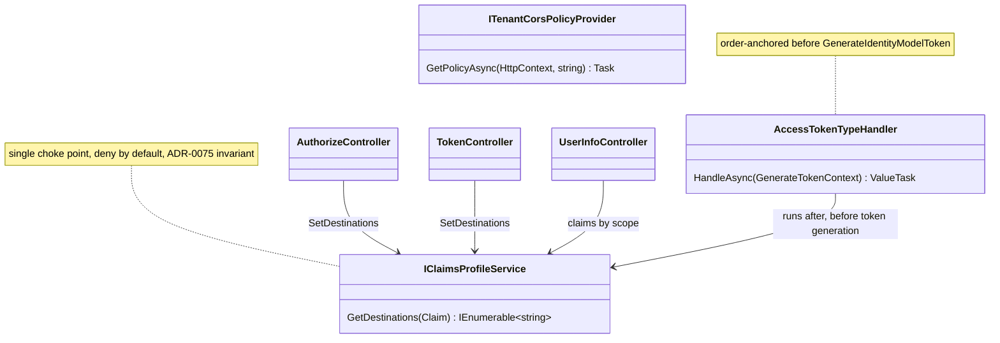
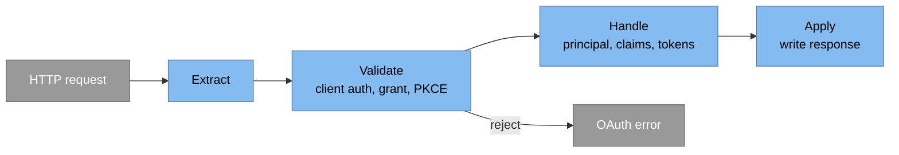
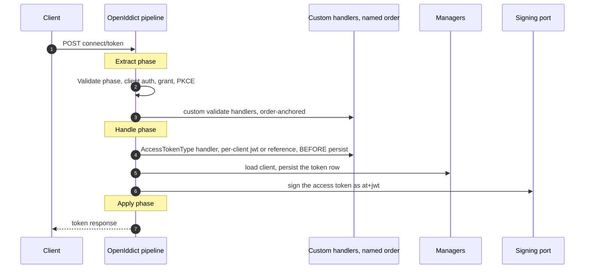
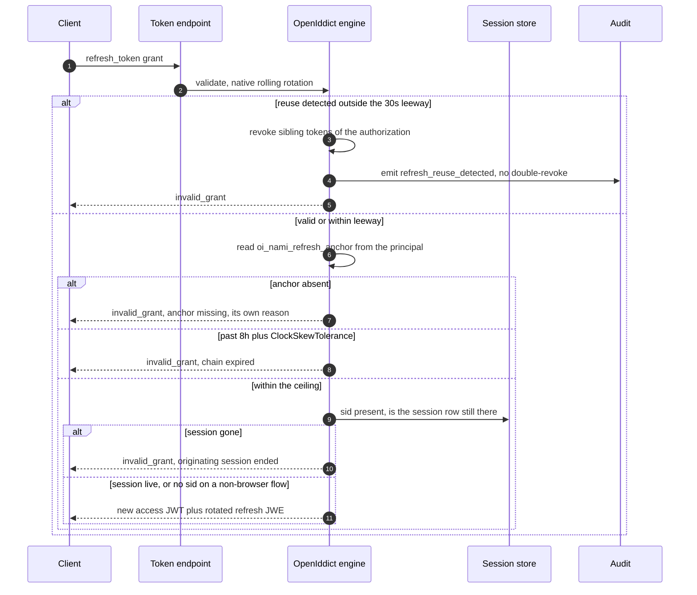
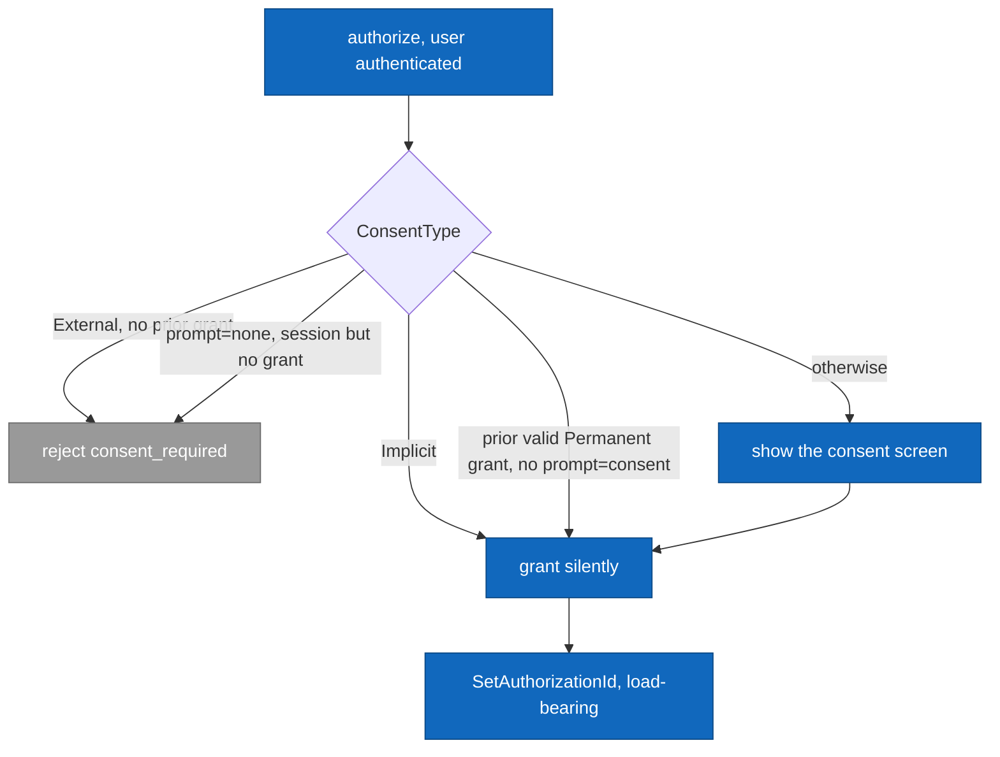
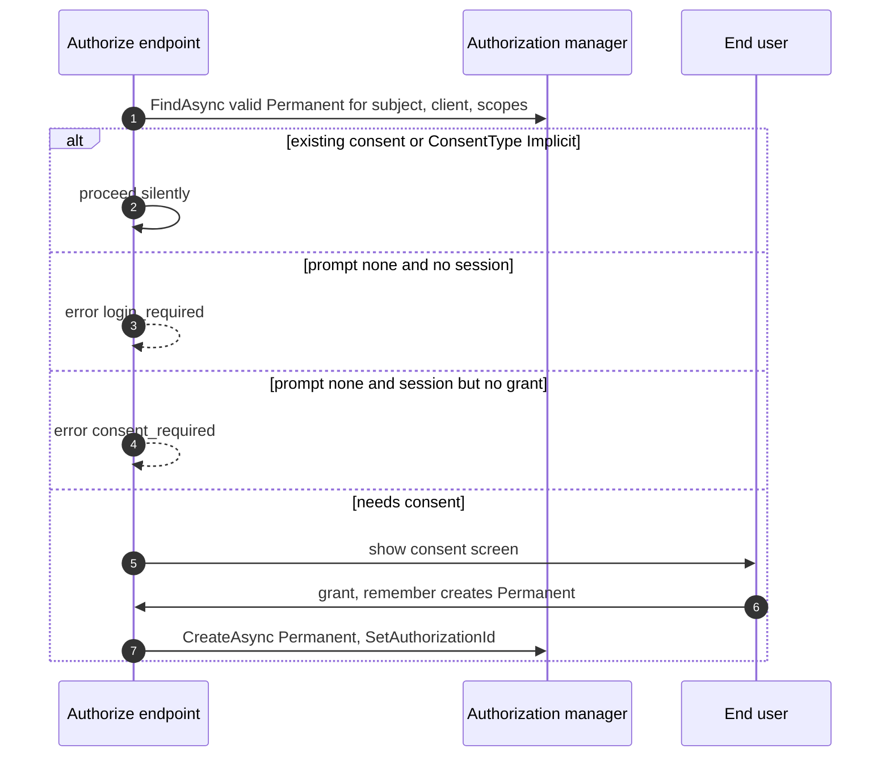
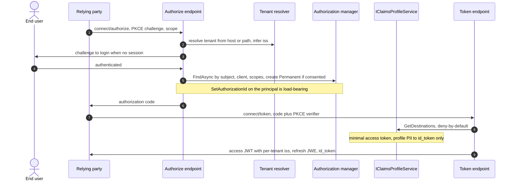
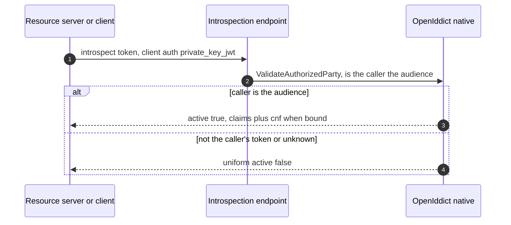
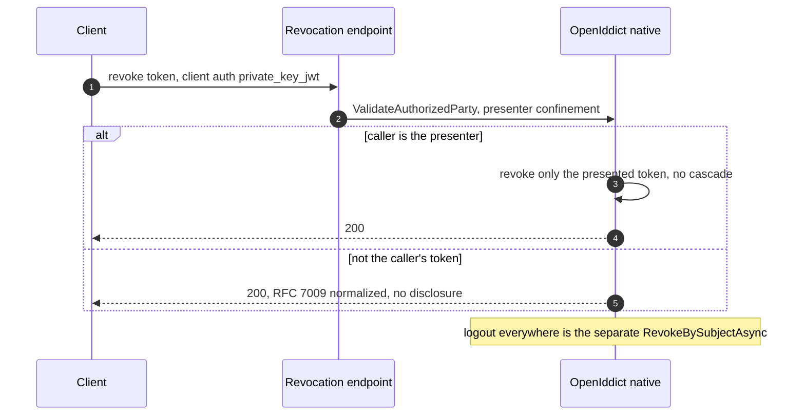
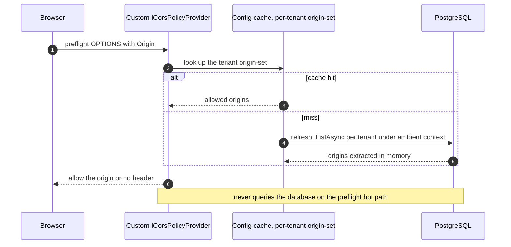

# Core protocol server (detailed design)

> **Sits under:** [architecture: component view](../architecture/08-component-view.md)
> (the protocol pipeline) and [runtime flow views](../architecture/09-runtime-flow-views.md).
> The architecture shows the pipeline and the flows; this design gives the OpenIddict
> wiring, the endpoint model, the controllers, and the handler seams.
> **Implementer source of record:** this document, for everything inside the protocol
> host. The entities it reads are defined in [02 data](02-data.md).

OpenIddict is a framework, not a turnkey server: it owns the protocol pipeline, but the
authorization, token, and userinfo controllers are yours to write. This design is the
not-turnkey part. All namespaces are `Nami.Identity.*` and the host is
`Nami.Identity.Host`.

## 1. Decisions realized

| Decision | What this design applies |
|---|---|
| ADR-0004 | Keep native rolling refresh, reuse detection, family revoke; 30s leeway; 8h absolute ceiling; per-client `IssueRefreshToken`; disabled-user gate-at-issuance |
| ADR-0005 | Plain signed access-token JWT (`DisableAccessTokenEncryption`) with a minimal claim set; refresh, code, and device tokens stay JWE; RS256 baseline, ES256 configurable |
| ADR-0048 | Client-authenticated introspection and revocation, native `ValidateAuthorizedParty` confinement, uniform `active:false`, `cnf` in introspection |
| ADR-0039 | Tiered revocation: short-TTL JWT default, reference tokens plus introspection where instant revoke is needed; per-client `AccessTokenType` |
| ADR-0050 | Per-client CORS through a custom `ICorsPolicyProvider`, applied only on the right endpoints |
| ADR-0049 | Per-tenant issuer; resource-server isolation by issuer plus tenant binding (a shared Pool key is not the boundary) |
| ADR-0014 | mTLS native, DPoP built (06); JAR, JARM, RAR, and EdDSA de-scoped; CIBA skipped |
| ADR-0021 | Native behaviours relied on are pinned seams: pipeline order, `ValidateAuthorizedParty`, PAR, the `Set*EndpointUris` method names, the `SetLogoutEndpointUris` to `SetEndSessionEndpointUris` rename, and auto-pathing being limited to discovery and JWKS |
| ADR-0052 / ADR-0043 | The fail-closed declaration layer this host consumes, and the startup invariant self-check that asserts the protocol posture |

## 2. Purpose and scope

The OAuth 2.0 and OpenID Connect engine: the endpoint surface and discovery metadata,
how protocol behaviour is extended (the OpenIddict event pipeline), the deny-by-default
claims choke-point, token formats, the refresh posture, consent persistence, tiered
revocation with isolated introspection and revocation, per-client CORS, and the
per-tenant issuer. It is Phase 03 and rests on the data tier (02).

In scope: the `AddOpenIddict` configuration, the pipeline extension model, the
controllers, discovery metadata, `IClaimsProfileService`, token format and lifetimes,
refresh mechanics, consent, introspection and revocation isolation, per-client CORS,
and per-tenant issuer resolution. Out of scope: DPoP handler internals (06) and the
resource-server validation library (05), both of which now have their own designs; key rotation
(12), user authentication, MFA, sessions, and the `acr`/`amr` producer (08), the login
and consent UI (11), and the configuration layer (01).

## 3. Interfaces and contract

### `AddOpenIddict()` configuration

Every API name in this block was read at OpenIddict release tag 7.5.0, and **all of them were
re-read at 7.6.0 on 2026-08-08** when the pin moved (seed S-028); see section 11. Thirty-three
names survived unchanged and **one call was found not to compile at all**, which is recorded there
rather than here.

**This block is written as one chain no single assembly can call, and the segments are owned
separately** (seed S-009, 2026-08-08). The dependency rule at
[`01-foundations.md`](01-foundations.md) section 3.1 says `Core` "must not reference any adapter,
database provider, or cloud SDK", so the three calls inside `.AddCore(...)` cannot live there. The
split is not a judgement: each segment extends a specific builder type that arrives in a specific
package, read at the upstream commit `5ce649a5bbbf1340c9be9c4f264197af563ab473` that OpenIddict
7.6.0 declares.

| Segment | Extends | Arrives in | Owned by |
|---|---|---|---|
| `services.AddOpenIddict()` | `IServiceCollection` | `OpenIddict.Abstractions` | anyone; it registers nothing |
| `.AddCore(o => ...)` | `OpenIddictBuilder` | `OpenIddict.Core` | the persistence adapter |
| `o.UseEntityFrameworkCore()` | `OpenIddictCoreBuilder` | `OpenIddict.EntityFrameworkCore` | the persistence adapter |
| `.UseDbContext<T>()` | `OpenIddictEntityFrameworkCoreBuilder` | `OpenIddict.EntityFrameworkCore` | the persistence adapter |
| `o.UseQuartz()` | `OpenIddictCoreBuilder` | `OpenIddict.Quartz` | the scheduling registration (ADR-0031) |
| `.AddServer(o => ...)` and its `o.UseAspNetCore()` | `OpenIddictBuilder` | `OpenIddict.Server`, `.Server.AspNetCore` | **`Nami.Identity.Core`** |
| `.AddValidation(o => ...)` and its `UseLocalServer()` and `o.UseAspNetCore()` | `OpenIddictBuilder` | `OpenIddict.Validation`, `.ServerIntegration`, `.AspNetCore` | **`Nami.Identity.Core`** |

**Splitting it costs nothing, and that was read rather than assumed.** `AddOpenIddict()` is declared
in `src/OpenIddict.Abstractions/OpenIddictExtensions.cs:20` and its whole body is
`return new OpenIddictBuilder(services)`: it is a stateless factory over the service collection, not
a registration, so calling it from two assemblies creates two builders over one collection and
double-registers nothing. `AddCore` registers exclusively through `TryAddScoped` and
`TryAddEnumerable`, whose own comment says the initializer is "registered only once". So the chain
below is one readable presentation of segments that compose as separate statements.

**Two sibling designs already write it split, which is why this is a correction here and not a new
pattern.** [`02-data.md`](02-data.md) section 8 writes the persistence segment as its own
`services.AddOpenIddict().AddCore(o => o.UseEntityFrameworkCore().UseDbContext<...>()...)` call, and
[`06-sender-constrained-tokens.md`](06-sender-constrained-tokens.md) section 6 writes
`services.AddOpenIddict().AddServer(...)` and `services.AddOpenIddict().AddValidation(...)` as
separate statements. This document was the only one presenting the block whole.

**What `Core` can call today is the last two rows.** It carries `OpenIddict.Server` and
`.Server.AspNetCore` (seed S-008), and `OpenIddict.Abstractions` arrives transitively, so
`services.AddOpenIddict().AddServer(...)` compiles there now. The three `.Validation` packages arrive
with the wiring, which is seed S-010.

```csharp
// Segment owned by the persistence adapter, NOT by Nami.Identity.Core.
// Shown here for completeness; design 02 section 8 is the source of record for it.
services.AddOpenIddict()
  .AddCore(o => o.UseEntityFrameworkCore()
                 .UseDbContext<OpenIddictDbContext>()
                 .UseQuartz());              // prune job, ADR-0031 sanctioned pattern
                                             // UseQuartz extends OpenIddictCoreBuilder too, so it
                                             // rides this segment rather than Core's

// Segments owned by Nami.Identity.Core, inside AddNamiIdentity (design 01 section 5.1).
services.AddOpenIddict()

  .AddServer(o =>
  {
    // Only discovery and JWKS are auto-pathed. Every other endpoint needs its
    // Set*EndpointUris call or it simply does not exist.
    o.SetAuthorizationEndpointUris("connect/authorize")
     .SetTokenEndpointUris("connect/token")
     .SetUserInfoEndpointUris("connect/userinfo")
     .SetIntrospectionEndpointUris("connect/introspect")
     .SetRevocationEndpointUris("connect/revoke")
     .SetEndSessionEndpointUris("connect/endsession")        // renamed from SetLogoutEndpointUris
     .SetDeviceAuthorizationEndpointUris("connect/device")            // device flow, 14
     .SetEndUserVerificationEndpointUris("connect/device/verify")     // device flow, 14
     .SetPushedAuthorizationEndpointUris("connect/par")
     .SetJsonWebKeySetEndpointUris(".well-known/jwks");

    o.AllowAuthorizationCodeFlow().RequireProofKeyForCodeExchange()   // PKCE mandatory
     .AllowClientCredentialsFlow()
     .AllowRefreshTokenFlow();                                        // device and token-exchange in 14

    o.RegisterScopes("openid", "profile", "email", "api");

    o.DisableAccessTokenEncryption();                                 // plain signed JWT, ADR-0005

    // S256 only, RFC 9700. There is NO builder method for this, so it goes through
    // the documented Configure escape hatch. Corrected 2026-08-08: this line read
    // `o.CodeChallengeMethods.Remove(...)`, and OpenIddictServerBuilder has no such
    // member, so it did not compile. See section 11.
    o.Configure(options => options.CodeChallengeMethods.Remove(
        OpenIddictConstants.CodeChallengeMethods.Plain));

    o.SetAccessTokenLifetime(TimeSpan.FromMinutes(15));
    o.SetRefreshTokenLifetime(TimeSpan.FromHours(8));                 // matches the session, ADR-0003
    o.SetRefreshTokenReuseLeeway(options.RefreshTokenReuseLeeway);    // network-retry race,
                                                                     // 30s default, ADR-0004:34
    // Rolling refresh and reuse detection are on by default.
    // Do NOT call DisableRollingRefreshTokens.

    o.UseAspNetCore()
     .EnableAuthorizationEndpointPassthrough()
     .EnableTokenEndpointPassthrough()
     .EnableUserInfoEndpointPassthrough()
     .EnableEndSessionEndpointPassthrough()
     .EnableEndUserVerificationEndpointPassthrough()                  // or the device approval page never runs
     .EnableStatusCodePagesIntegration();
  })

  .AddValidation(o =>
  {
    o.UseLocalServer();
    o.UseAspNetCore();
    o.EnableTokenEntryValidation();          // DB-anchored revocation. On the VALIDATION
    o.EnableAuthorizationEntryValidation();  // builder, not AddServer. Common wrong-API slip.
  });
```

Signing and encryption credentials are supplied by the key-management subsystem rather
than in this block: development uses `AddDevelopmentSigningCertificate()` and
`AddDevelopmentEncryptionCertificate()`, and production uses the database key store with
no-restart rotation (12). RS256 is the baseline with ES256 config-selectable (ADR-0005).

### Endpoint surface: pass-through versus fully-handled

The single most repeated wrong-API mistake in this domain is writing a controller for
an endpoint the engine already handles end to end. The distinction is not a convention,
it is enforced by which options exist: **there are exactly six pass-through options in
7.5.0**, and an endpoint with no pass-through option cannot be intercepted by a
controller at all.

| Endpoint | Path (illustrative) | Mechanism |
|---|---|---|
| Discovery | `/.well-known/openid-configuration` **and** `/.well-known/oauth-authorization-server` | auto-pathed, both, per tenant issuer |
| JWKS | `/.well-known/jwks` | auto-pathed, per tenant issuer |
| Authorize | `connect/authorize` | pass-through controller (login and consent interaction) |
| Token | `connect/token` | pass-through controller (code plus PKCE, client-credentials, refresh) |
| UserInfo | `connect/userinfo` | pass-through controller |
| End-session | `connect/endsession` | pass-through controller |
| End-user verification | `connect/device/verify` | pass-through controller (the human types the code) |
| Device authorization | `connect/device` | **fully-handled native, no controller** |
| PAR | `connect/par` | **fully-handled native**, per-client requirement |
| Introspection | `connect/introspect` | **fully-handled native, no controller** |
| Revocation | `connect/revoke` | **fully-handled native, no controller** |

The two halves of the device flow sit on **opposite sides of this table**, which is easy
to get wrong and both this repository and the design corpus previously did: the device
authorization endpoint, where the device asks for a code, is fully handled, while the
end-user verification endpoint, where a human approves it, needs both
`SetEndUserVerificationEndpointUris` and `EnableEndUserVerificationEndpointPassthrough`.

Path strings are configurable and non-normative, and carry no leading `/` since
OpenIddict 4.0; the fixed seam is the **method name**. The pinned set (ADR-0021,
re-verified on each bump) is the eleven `Set*` methods in section 11, and the six
pass-through options are `EnableAuthorizationEndpointPassthrough`,
`EnableTokenEndpointPassthrough`, `EnableUserInfoEndpointPassthrough`,
`EnableEndSessionEndpointPassthrough`, `EnableEndUserVerificationEndpointPassthrough`,
and `EnableErrorPassthrough`.

### Controllers: thin, orchestrate only

A pass-through controller supplies the principal and nothing else. Protocol validation
has already happened by the time it runs.

* **Authorize** (`connect/authorize`, GET and POST). Read the OpenIddict request; if the
  user is not authenticated, `Challenge` to the login page; resolve consent (section 5);
  build a `ClaimsIdentity`; call `SetScopes`, `SetResources`, and
  `SetDestinations(claim => claimsProfile.GetDestinations(claim))`; then `SignIn` with
  the OpenIddict scheme.
* **Token** (`connect/token`, POST). For the authorization-code and refresh grants,
  authenticate the OpenIddict scheme and `SignIn` the resulting principal, optionally
  refreshing claims and re-checking that the user is still active. For
  client-credentials, build the application identity plus scopes and sign in.
* **UserInfo** (`connect/userinfo`). `[Authorize]` against the validation scheme, and
  return claims by granted scope.

### The claims choke-point

Every decision about which claim reaches which token is centralized in one
`IClaimsProfileService`, and its `GetDestinations` is **deny-by-default**: the fallback
arm returns nothing, so a claim is emitted only where explicitly declared. This is a
security invariant with a regression test, not a convention (ADR-0005), and the port
carries a non-weakenable invariant binding on any replacement adapter (ADR-0075).

```csharp
private static IEnumerable<string> GetDestinations(Claim claim) => claim.Type switch
{
  Claims.Subject       => [Destinations.AccessToken, Destinations.IdentityToken],
  "tenant"             => [Destinations.AccessToken],           // single-tenant token binding
  Claims.Role          => claim.Subject!.HasScope(Scopes.Roles)
                            ? [Destinations.AccessToken, Destinations.IdentityToken]
                            : [Destinations.AccessToken],       // role is authorization, not PII
  Claims.Name or Claims.PreferredUsername
                       => claim.Subject!.HasScope(Scopes.Profile) ? [Destinations.IdentityToken] : [],
  Claims.Email         => claim.Subject!.HasScope(Scopes.Email)   ? [Destinations.IdentityToken] : [],
  "sid"                => [Destinations.IdentityToken],          // back-channel logout correlation
  "acr" or "auth_time" => [Destinations.AccessToken, Destinations.IdentityToken],   // step-up, ADR-0013
  "amr"                => [Destinations.IdentityToken],                             // ADR-0013
  "idp"                => [Destinations.IdentityToken],                             // federation source
  "memberships" or "memberships_truncated"
                       => [Destinations.IdentityToken],          // tenant switcher
  _                    => []                                    // DENY unknown claims
};
```

The access token is deliberately minimal: `sub`, the granted scopes, `tenant`, and the
coarse per-tenant role used for gateway and resource-server checks. Profile personal
data (`name`, `email`, `preferred_username`) reaches the id_token and UserInfo only, and
each is gated by its scope. The id_token also carries the `memberships` list, size-capped
at about ten entries with a `memberships_truncated` flag and a self-service full-list
endpoint, and `sid` for back-channel-logout correlation.

Adding a first-party claim means editing **both** this switch and the canonical claims
contract that the federation design ([09](09-federation-and-claims-profile.md)) owns, in
the same change. The regression test asserts an
undeclared claim never reaches any token, so a claim added in only one place fails the
build rather than leaking.


```mermaid
classDiagram
  class IClaimsProfileService {
    GetDestinations(Claim) IEnumerable~string~
  }
  class AccessTokenTypeHandler {
    HandleAsync(GenerateTokenContext) ValueTask
  }
  class ITenantCorsPolicyProvider {
    GetPolicyAsync(HttpContext, string) Task
  }
  class AuthorizeController
  class TokenController
  class UserInfoController
  AuthorizeController --> IClaimsProfileService : SetDestinations
  TokenController --> IClaimsProfileService : SetDestinations
  UserInfoController --> IClaimsProfileService : claims by scope
  AccessTokenTypeHandler --> IClaimsProfileService : runs after, before token generation
  note for IClaimsProfileService "single choke point, deny by default, ADR-0075 invariant"
  note for AccessTokenTypeHandler "order-anchored before GenerateIdentityModelToken"
```

### Discovery metadata

The discovery document advertises the capability surface, and the flags are part of the
protocol contract. Advertised: `authorization_response_iss_parameter_supported=true`
(RFC 9207); `code_challenge_methods_supported=["S256"]`;
`tls_client_certificate_bound_access_tokens=true`;
`token_endpoint_auth_methods_supported` covering `client_secret_basic`,
`client_secret_post`, `private_key_jwt`, `tls_client_auth`, and
`self_signed_tls_client_auth`; `dpop_signing_alg_values_supported` (the nine-algorithm
RS, PS, and ES cross 256, 384, 512 set, once DPoP lands, 06);
`backchannel_logout_supported=true` with `backchannel_logout_session_supported=true`
and `frontchannel_logout_supported=false`; `request_parameter_supported=false` (JAR
de-scoped); and `claims_supported` including `sid`. Deliberately **not** advertised:
`check_session_iframe`, because front-channel session management is dead, and the CIBA
`backchannel_authentication_endpoint`, which is skipped.

The S256-only advertisement takes work rather than being the default.
`OpenIddictServerOptions.CodeChallengeMethods` is a set initialized to
`{ Plain, Sha256 }`, and the discovery handler unions it into the advertised list, so
`plain` must be actively removed and the removal is asserted at the startup self-check
(ADR-0043). Custom fields are emitted through a `HandleConfigurationRequestContext`
handler. Discovery and JWKS are served per tenant issuer.

## 4. Data and structure

No new tables: the engine uses the OpenIddict entities defined in [02 data](02-data.md).
This design writes two property anchors plus one private claim, and every placement here is
load-bearing:

| Anchor | Where | Why there |
|---|---|---|
| `oi_nami_refresh_anchor` | a **private claim** on the principal, not on any entity | The absolute 8h ceiling timestamp. Scoped to the **login chain**, which is what the ceiling bounds. See the correction below: an entity property is the wrong scope here |
| `access_token_type` | `Application.Properties` | Per-client `jwt` or `reference` selection, read by the generate-token handler |
| `cors_origins` | `Application.Properties` | The per-client allowed origin set, and the system of record for the origin cache |
| `backchannel_logout_uri` | `Application.Properties` | Where ADR-0019 pushes a relying party's `logout_token`. It is in the property bag because the engine has no native field for it: `OpenIddictApplicationDescriptor` exposes `PostLogoutRedirectUris` plus the `Properties` dictionary and nothing back-channel, so this needs **no migration**. https-only and SSRF-validated. An empty value is meaningful and means "this relying party accepts bounded logout" (ADR-0019) |

> **Corrected 2026-08-01. This anchor was specified on `Authorization.Properties`, and both
> the placement and the reason given for it were wrong.** The reason first, because it is the
> part that would otherwise defeat the fix: this table said the anchor must **never** be a
> claim, "which would leak the anchor into the access token". That is true of an **ordinary**
> claim and false of a **private** one. The private prefix is `oi_`
> (`OpenIddictConstants.cs:121`), and both `PrepareAccessTokenPrincipal`
> (`OpenIddictServerHandlers.cs:3571`) and `PrepareIdentityTokenPrincipal` (`:4557`) drop
> private claims with a bare `return false` that sits **above, and independent of**, the
> `HasDestination` check in the same filter. Leaking is therefore not merely unlikely, it is
> unreachable, and it stays unreachable even if the `GetDestinations` switch in section 3 is
> later edited wrongly. Left standing, that sentence was an argument in this repository's own
> voice against the correct placement.
>
> The placement second. An `Authorization` here is **`Permanent` and reused across logins**
> (section 5 finds it with `FindAsync` and states that it does not expire), so it outlives the
> refresh chain the ceiling is supposed to bound. An anchor stamped on that row makes the
> ceiling "8h per consent, forever" rather than "8h per login chain": once 8h had passed since
> a consent's first refresh token, every later login on that consent would be rejected at its
> first refresh, and re-consenting would not help because the same row is reused. That is the
> opposite of ADR-0004's "the hard 8-hour ceiling forces re-authentication". A fresh principal
> per login gives a fresh anchor per chain with no re-stamp logic and no bookkeeping about
> whether an authorization was reused.
>
> Imported from the design corpus (its core-protocol document, section 6, review finding
> B-02). **Only one of that finding's two defects existed here:** the corpus also had a read
> side that read a claim the write side never wrote, which rejected every refresh; this
> document never had a read side, so it carried the scoping defect alone.

## 5. Behaviour

### The extension model: one pipeline, order-anchored

Custom protocol behaviour is an inserted OpenIddict event handler at a named,
order-anchored position, never a fork of the engine (ADR-0021 parameter F, which owns the
anchoring rule and reserves the axis to Nami's own code; this cited ADR-0024 as a joint owner
until 2026-08-02, and that ADR does not rule on this pipeline). The engine
runs four phases; handlers slot in and may short-circuit with `HandleRequest`,
`SkipRequest`, or `Reject`.


```mermaid
graph LR
  req[HTTP request]:::ext
  ex[Extract]:::comp
  val[Validate<br/>client auth, grant, PKCE]:::comp
  hnd[Handle<br/>principal, claims, tokens]:::comp
  ap[Apply<br/>write response]:::comp
  err[OAuth error]:::ext
  req --> ex
  ex --> val
  val --> hnd
  hnd --> ap
  val -->|reject| err
  classDef comp fill:#85bbf0,stroke:#5d82a8,color:#000000
  classDef ext fill:#999999,stroke:#6b6b6b,color:#ffffff
```

Positions are anchored to named built-in descriptors, using
`SetOrder(SomeBuiltInDescriptor.Order + 1_000)` rather than a hardcoded number, and are
pinned by a pipeline-snapshot test so a version bump that reorders the pipeline fails CI
instead of production. Always go through an `IOpenIddict*Manager` facade, never a store
directly.

The two custom insertion points on the token path:


```mermaid
sequenceDiagram
  autonumber
  participant C as Client
  participant P as OpenIddict pipeline
  participant H as Custom handlers, named order
  participant M as Managers
  participant K as Signing port
  C->>P: POST connect/token
  Note over P: Extract phase
  P->>P: Validate phase, client auth, grant, PKCE
  P->>H: custom validate handlers, order-anchored
  Note over P: Handle phase
  P->>H: AccessTokenType handler, per-client jwt or reference, BEFORE persist
  P->>M: load client, persist the token row
  P->>K: sign the access token as at+jwt
  Note over P: Apply phase
  P-->>C: token response
```

### Token formats and lifetimes

* **Access token is a plain signed JWT** (`DisableAccessTokenEncryption`), validated by
  resource servers with `JwtBearer` plus JWKS and `ValidTypes = ["at+jwt"]`. Because a
  plain JWT is readable by anyone holding it, the minimal claim set is mandatory, not
  advisory (ADR-0005). Lifetime 15 minutes.
* **Refresh tokens, authorization codes, and device codes stay JWE**, which cannot be
  disabled, so the encryption credential is always required and has its own lifecycle
  (12, ADR-0005).
* **JWE algorithms are pinned** for those internal tokens: key management `RSA-OAEP`, or
  `ECDH-ES` for an EC key, and content encryption `A256CBC-HS512`. `RSA1_5` is
  forbidden. An earlier `A256GCM` was corrected because OpenIddict's standard API does
  not produce it. The startup self-check asserts this alongside the
  no-symmetric-signing-key invariant (ADR-0043).
* **Signing baseline is RS256**, with ES256 selectable. RS256 is the baseline because
  ES256's slower verification lands on **every** resource server on every request:
  measured, ES256 signs roughly 3 to 4 times faster and verifies roughly 6 to 9 times
  slower, not the folklore twenty. ES256-as-default is an accepted interim position with
  an explicit revisit trigger, namely an M2M client-credentials mint rate above the low
  thousands of requests per second.
* **Per-client `AccessTokenType`** (`jwt` by default, or `reference`) is enforced by a
  custom `IOpenIddictServerHandler<GenerateTokenContext>` that reads the client's
  `access_token_type` property and flips `context.IsReferenceToken` and
  `context.PersistTokenPayload`, after which OpenIddict mints the reference token
  natively. It is registered `UseScopedHandler` so it can inject the tenant-scoped
  `IOpenIddictApplicationManager` directly, with no `IServiceScopeFactory` dance, unlike
  the singleton CORS provider. It is ordered **before** `GenerateIdentityModelToken` and
  the store-persist handler, pinned by the snapshot test. The global
  `UseReferenceAccessTokens` is deliberately not used, because it would remove JWT
  statelessness for every client at once. A reference token is opaque and cannot be
  validated locally, so opting one client into it forces that client's resource server
  onto introspection: a real per-client cost that belongs in the selection guide.

### Refresh posture: native, observation only

Rolling refresh, one-time use, reuse and replay detection, and family or chain
revocation are default-on in OpenIddict and are **not disabled**. Nami adds six things,
two of which (3 and 6) are checks in the same `HandleTokenRequest` refresh-grant block:

1. A **30-second reuse leeway**, not 15, because 15 sits below the network-timeout band
   and a legitimate retry would trigger family revoke and a spurious logout.
2. An **audit event on reuse detection**. A replay outside the leeway surfaces
   `invalid_grant` or `invalid_token`, error ID2012, and Nami records a high-severity
   audit event. It does **not** call `RevokeByAuthorizationIdAsync` again: the engine has
   already revoked the siblings, and it deliberately keeps the `Authorization` so a fresh
   flow can start.
3. An **absolute 8h ceiling**, stamped **at sign-in, once per login chain**, as the private
   claim `oi_nami_refresh_anchor` (section 4), and enforced in the refresh grant against
   `UtcNow - anchor > 8h + ClockSkewTolerance`. **An absent anchor is rejected with its own
   distinct reason**, never defaulted: see the fail-closed rule below.
4. **Per-client `IssueRefreshToken`**, so an M2M client gets none.
5. **Disabled-user handling** by gate-at-issuance (Nami's `CanSignInAsync` **override**; the
   native call knows no disabled state, [08](08-user-management.md) section 7) plus force-revoke on
   disable, accepting a 15-minute residual for an already-issued JWT.
6. A **session-liveness gate**: the refresh grant reads the `sid` claim and rejects with
   `invalid_grant` when no live `ServerSideSessions` row matches. This is not a new control.
   ADR-0003 already requires that "authorization and refresh requests are denied once the
   session row is gone"; until now no design carried it, and the paragraph below is where it
   is executed.

Cross-node timestamp comparisons use one named constant,
`ProtocolConstants.ClockSkewTolerance`, at 60 seconds, on NTP-synced nodes. It covers
both the 8h ceiling and `max_age` versus `auth_time` for step-up (08). It is independent
of the 30-second reuse leeway, and the two **compose** rather than merge. The anchor's claim
name is likewise a single constant, `ProtocolConstants.RefreshAnchorClaim`, so the literal
appears once.

**The fail-closed rule, and why it is a decision rather than a detail.** Reading the anchor
as `long.Parse(claim ?? "0")` turns a missing anchor into a 1970 timestamp, which makes the
ceiling comparison unconditionally true and rejects **every** refresh, while building cleanly
and throwing nothing. The only symptom is "every user is signed out after fifteen minutes",
with nothing in the logs distinguishing it from a chain that legitimately expired. So a
missing anchor rejects on its own branch with its own reason, and `?? "0"` is forbidden here.
This also buys something at the seam: if a future engine version stopped carrying the claim
across rotation, the failure would be loud and correctly named instead of silent (S35).

**Why the session gate needs no new claim, which is the non-obvious part.** `sid` is already
on the refresh token. The `GetDestinations` switch in section 3 sends `sid` to the id token
only, and that is correct and must not be changed, because
`PrepareRefreshTokenPrincipal` (`OpenIddictServerHandlers.cs:4374-4384`) filters out exactly
six claims (`jti`, `oi_tkn_id`, `exp`, `iat`, `nbf`, `cnf`) and then returns true for
everything else, **without consulting destinations at all**: "other claims are always
included in the refresh token, even private claims" (`:4383`). Adding `sid` to a refresh
destination would be both unnecessary and meaningless. The lookup is one hit on the unique
`Key` column (ADR-0003). A principal with **no** `sid` is a non-browser flow such as
client-credentials, and skips the check rather than failing it.

**The consequence this gate carries, which is real and intended.** ADR-0003 revokes by
deleting the row and deliberately has no `revoked` column, so row-absence cannot distinguish
"revoked" from "expired". The effective refresh lifetime therefore becomes
**min(the 8h ceiling, the session still being alive)**, which means the **1-hour inactivity
window also ends the refresh chain**. That follows from ADR-0003's existing choice rather
than from this gate, and it matches the strictness ADR-0003 selected. Do **not** soften it by
adding a tombstone column: that would contradict ADR-0003's "no `revoked` column" clause
directly, and re-create the two-sources-of-truth problem that clause exists to prevent.


```mermaid
sequenceDiagram
  autonumber
  participant C as Client
  participant T as Token endpoint
  participant Eng as OpenIddict engine
  participant SS as Session store
  participant AL as Audit
  C->>T: refresh_token grant
  T->>Eng: validate, native rolling rotation
  alt reuse detected outside the 30s leeway
    Eng->>Eng: revoke sibling tokens of the authorization
    Eng->>AL: emit refresh_reuse_detected, no double-revoke
    Eng-->>C: invalid_grant
  else valid or within leeway
    Eng->>Eng: read oi_nami_refresh_anchor from the principal
    alt anchor absent
      Eng-->>C: invalid_grant, anchor missing, its own reason
    else past 8h plus ClockSkewTolerance
      Eng-->>C: invalid_grant, chain expired
    else within the ceiling
      Eng->>SS: sid present, is the session row still there
      alt session gone
        Eng-->>C: invalid_grant, originating session ended
      else session live, or no sid on a non-browser flow
        Eng-->>C: new access JWT plus rotated refresh JWE
      end
    end
  end
```

### Consent persistence and `prompt=none`

Consent is a `Permanent` OpenIddict authorization, found through
`IOpenIddictAuthorizationManager.FindAsync(subject, client, status, type, scopes)`, where
**the scope filter is the re-consent mechanism**: widen the requested scopes and the
lookup misses, so consent is asked again. The decision switches on the client's
`ConsentType` rather than on a raw count. After finding or creating the authorization,
calling **`SetAuthorizationId` on the principal is load-bearing**: without it,
family-revoke and entry validation have nothing to key on. Consent has no expiry, since
a `Permanent` authorization does not expire (ADR-0004).


```mermaid
flowchart TD
  A[authorize, user authenticated]:::host --> B{ConsentType}
  B -->|Implicit| G[grant silently]:::host
  B -->|External, no prior grant| E[reject consent_required]:::ext
  B -->|prior valid Permanent grant, no prompt=consent| G
  B -->|prompt=none, session but no grant| E
  B -->|otherwise| S[show the consent screen]:::host
  S --> G
  G --> H[SetAuthorizationId, load-bearing]:::host
  classDef host fill:#1168bd,stroke:#0b4884,color:#ffffff
  classDef ext fill:#999999,stroke:#6b6b6b,color:#ffffff
```

`prompt=none` splits into two distinct errors: no session gives `login_required`, and a
session with no matching grant gives `consent_required`.


```mermaid
sequenceDiagram
  autonumber
  participant A as Authorize endpoint
  participant Az as Authorization manager
  participant U as End user
  A->>Az: FindAsync valid Permanent for subject, client, scopes
  alt existing consent or ConsentType Implicit
    A->>A: proceed silently
  else prompt none and no session
    A-->>A: error login_required
  else prompt none and session but no grant
    A-->>A: error consent_required
  else needs consent
    A->>U: show consent screen
    U->>A: grant, remember creates Permanent
    A->>Az: CreateAsync Permanent, SetAuthorizationId
  end
```

### Authorization code with PKCE, end to end


```mermaid
sequenceDiagram
  autonumber
  actor U as End user
  participant RP as Relying party
  participant A as Authorize endpoint
  participant TR as Tenant resolver
  participant Az as Authorization manager
  participant CP as IClaimsProfileService
  participant Tk as Token endpoint
  RP->>A: connect/authorize, PKCE challenge, scope
  A->>TR: resolve tenant from host or path, infer iss
  A->>U: challenge to login when no session
  U->>A: authenticated
  A->>Az: FindAsync by subject, client, scopes, create Permanent if consented
  Note over A,Az: SetAuthorizationId on the principal is load-bearing
  A->>RP: authorization code
  RP->>Tk: connect/token, code plus PKCE verifier
  Tk->>CP: GetDestinations, deny-by-default
  Note over CP: minimal access token, profile PII to id_token only
  Tk->>RP: access JWT with per-tenant iss, refresh JWE, id_token
```

### Introspection and revocation isolation

The caller is a machine-to-machine party, a resource server or a client, so it
authenticates with `private_key_jwt` rather than a shared secret (ADR-0048, ADR-0009);
interactive clients may still use a client secret at the token endpoint, which discovery
advertises. Both endpoints are confined by OpenIddict's **native
`ValidateAuthorizedParty`**, so a caller can only introspect or revoke a token whose
audience is itself, and no custom owner-check controller is written. That confinement
applies to tokens carrying an explicit audience or presenter; a token without one is
treated as not resource-specific, so it must not be assumed guarded.

Introspection returns a uniform `active:false` so it is not an existence oracle, is
rate-limited per client, and uses a bounded result cache of about five minutes. Native
`AttachApplicationClaims` narrows the response further: sensitive application claims go
only to explicitly listed audiences, **public clients are blocked from them entirely**,
and introspecting a non-access token returns no application claims. The token-entry
lookup is **tenant-scoped**, riding the Pool filter, so a tenant-A caller cannot
introspect or revoke a tenant-B token, and a negative test asserts it.

**Native introspection auto-surfaces `cnf` whatever its binding form**, mTLS `x5t#S256` and
DPoP `jkt` alike: `OpenIddictServerHandlers.Introspection.cs:733-742` reads
`Claims.Confirmation` and parses the whole JSON object through, with no branch on the
binding method. So the only build item here is **stamping** `cnf` at issuance for DPoP
(spikes A-1 and A-3, [06](06-sender-constrained-tokens.md)); surfacing it is not one. The
invariant that remains ours is enrich-or-inactive: a DPoP-bound token either carries
`cnf.jkt` in the response or returns `active:false`, and never active-but-unbound. Note also
that a response carrying `cnf` omits `token_type` entirely rather than claiming `Bearer`
(`:762`).

**Revocation is single-token** (RFC 7009). The endpoint revokes only the presented token
and never cascades. "Log out everywhere" is the separate built `RevokeBySubjectAsync`
(08), and family revoke by `AuthorizationId` is native (ADR-0004).


```mermaid
sequenceDiagram
  autonumber
  participant RS as Resource server or client
  participant I as Introspection endpoint
  participant Eng as OpenIddict native
  RS->>I: introspect token, client auth private_key_jwt
  I->>Eng: ValidateAuthorizedParty, is the caller the audience
  alt caller is the audience
    Eng-->>RS: active true, claims plus cnf when bound
  else not the caller's token or unknown
    Eng-->>RS: uniform active false
  end
```


```mermaid
sequenceDiagram
  autonumber
  participant C as Client
  participant R as Revocation endpoint
  participant Eng as OpenIddict native
  C->>R: revoke token, client auth private_key_jwt
  R->>Eng: ValidateAuthorizedParty, presenter confinement
  alt caller is the presenter
    Eng->>Eng: revoke only the presented token, no cascade
    Eng-->>C: 200
  else not the caller's token
    Eng-->>C: 200, RFC 7009 normalized, no disclosure
  end
  Note over Eng: logout everywhere is the separate RevokeBySubjectAsync
```

### Tiered revocation

Plain short-TTL JWTs validated locally are the default; reference tokens plus
introspection are reserved for the instant-revocation need (ADR-0039). On the validation
side, `EnableTokenEntryValidation` and `EnableAuthorizationEntryValidation` give
database-anchored revocation for local resource servers, taking effect immediately.
Both live on the `.AddValidation` builder, not `.AddServer`.

### Per-client CORS

OpenIddict has no native per-client CORS and no distinct-origins query, so Nami builds a
custom `ICorsPolicyProvider` that serves the policy per request from a per-tenant cached
origin set, whose system of record is `Application.Properties['cors_origins']` and whose
cache is shared with the config-change cache (ADR-0039, ADR-0050). A newly registered
single-page app therefore works with no redeploy, and a preflight never touches the
database. The off-hot-path refresh lists applications per tenant under the Finbuckle
ambient context, respecting row-level security, and extracts the origins in memory.

`RequireCors` is applied only to discovery, JWKS, token, userinfo, and revocation. Never
to authorize, which is a top-level navigation, and never to introspection, which is
server to server. Middleware order is `UseRouting`, then `UseCors`, then
`UseAuthentication` and `UseAuthorization`, then OpenIddict. The provider returns `null`
on a non-match, meaning no `Access-Control-Allow-Origin` header at all, and an origin is
scheme plus host plus port with no path, validated separately from the client's redirect
URIs.


```mermaid
sequenceDiagram
  autonumber
  participant B as Browser
  participant P as Custom ICorsPolicyProvider
  participant C as Config cache, per-tenant origin-set
  participant DB as PostgreSQL
  B->>P: preflight OPTIONS with Origin
  P->>C: look up the tenant origin-set
  alt cache hit
    C-->>P: allowed origins
  else miss
    C->>DB: refresh, ListAsync per tenant under ambient context
    DB-->>C: origins extracted in memory
  end
  P-->>B: allow the origin or no header
  Note over P,DB: never queries the database on the preflight hot path
```

### Per-tenant issuer

The issuer is inferred per request from scheme plus host plus path base, with **no static
`SetIssuer`** (spike A-5, V20). Host-based tenancy infers `iss` automatically from the
request; path-based tenancy sets `Request.PathBase` to `/t/<tenant>` in the resolve
middleware, or configures options per tenant. **Only one mechanism may set it.**
Finbuckle's `WithBasePathStrategy()` resolves the tenant from the path but does not rebase
`PathBase` by itself, because `BasePathStrategyOptions.RebaseAspNetCorePathBase` defaults
to `false` ([02](02-data.md) records the read and its version caveat). Enabling that
option on top of this middleware prefixes `PathBase` twice, the issuer silently becomes
wrong, and local self-validation then rejects our own tokens. The two are alternatives,
never a pair. An unresolved tenant fails fast with
`tenant_not_resolved` at 400, rather than surfacing as a null reference later. Discovery
and JWKS are served per tenant issuer, and keys are per deployment (ADR-0033 option B)
while the issuer is per request.

Because Pool tenants share a pool-group signing key, **the signature is not a tenant
boundary** at the resource server; isolation there is by issuer plus `tenant`-claim
binding plus row-level security (ADR-0049; the resource-server side is 05 when written,
and 06 for the sender-constrained variants). A client is looked up and authenticated
**within the resolved tenant's store**, the Pool filter or the Silo connection, so a
tenant-A client cannot authenticate at tenant B.

#### Reference implementation, quoted from the A-5 harness

**Quoted from a run this repository did not perform.** From the design corpus's spike-A-5
harness (`IssuerHost.cs`, `IssuerTests.cs`; verdict in its verification record V20). Checked
line by line on 2026-08-01: **35 of the 36 quoted lines match the harness character for
character once the enclosing indentation is removed**, and the 36th is the `// ...` elision
marker in the pipeline snippet, which is editorial rather than harness code. It is evidence of
what executed, not code compiled here.

The server is configured with the issuer **deliberately absent**, and the comment saying so is
the point of the snippet:

```csharp
oi.AddServer(o =>
{
    o.SetTokenEndpointUris("connect/token");
    o.SetConfigurationEndpointUris(".well-known/openid-configuration");
    o.AllowClientCredentialsFlow();
    o.AddEphemeralEncryptionKey();
    o.DisableAccessTokenEncryption();
    // 🔴 NO o.SetIssuer(...) - issuer is inferred per-request from scheme+host+pathbase (V01-B5 WRONG-API avoided)
    o.UseAspNetCore().EnableTokenEndpointPassthrough().DisableTransportSecurityRequirement();
    if (!dynamicSigning) o.AddEphemeralSigningKey();
});
```

Path-based tenancy then needs one middleware, and this is the middleware the paragraph above
refers to. It rewrites `PathBase` and `Path` so the engine's inference picks the tenant up:

```csharp
// Path-based tenancy: /t/{tenant}/... -> PathBase=/t/{tenant} so OpenIddict infers issuer = scheme+host+pathbase.
public sealed class PathBaseTenantMiddleware(RequestDelegate next)
{
    public async Task Invoke(HttpContext ctx)
    {
        var path = ctx.Request.Path.Value ?? "";
        if (path.StartsWith("/t/", StringComparison.Ordinal))
        {
            var seg = path.Split('/', StringSplitOptions.RemoveEmptyEntries);   // ["t","{tenant}",...]
            if (seg.Length >= 2)
            {
                ctx.Request.PathBase = new PathString($"/t/{seg[1]}");
                ctx.Request.Path = new PathString("/" + string.Join('/', seg.Skip(2)));
            }
        }
        await next(ctx);
    }
}
```

**Its position in the pipeline is part of the contract**, not a detail: it must run before
routing and before authentication, because the engine hooks in at authentication and reads
`PathBase` as it finds it.

```csharp
.Configure(app =>
{
    app.UseMiddleware<PathBaseTenantMiddleware>();   // path-based tenancy (H2)
    app.UseRouting();
    app.UseAuthentication();   // OpenIddict server hooks in here (required before endpoints)
    // ...
});
```

**What the harness asserted.** Each host yields its own `iss` and the discovery document's
`issuer` equals the token's `iss`, which matters because a relying party rejects the token
otherwise. Path-based tenancy produces an issuer containing the tenant segment, again matching
discovery. Rotating the signing key mid-test changes the `kid` and leaves the per-tenant issuer
untouched, so this composes with the rotation seam in design [12](12-key-management.md) rather
than competing with it. And interleaving two tenants over one shared pipeline keeps each
issuer correct, which is the assertion that would catch a cross-tenant leak.

**Two things the snippets do not settle**, stated so their absence is not read as coverage.
`DisableTransportSecurityRequirement()` is a test-host and local-development setting and must
never reach production. And this proves only the issuing side: that a resource server rejects
a token whose `iss` belongs to another tenant is design
[05](05-resource-server-validation.md), proven separately.

The per-request row-level-security setting `app.current_tenant` is set here on the happy
path, not only in background jobs, through `set_config(..., true)` inside the request
transaction, which is PgBouncer transaction-mode safe and parameterized against
injection. The application connection must be a de-privileged `NOSUPERUSER` role or
FORCE RLS is void (02).

### Step-up and the session-fixation guard

One behaviour belongs here, and one is a dependency worth naming because the protocol
host is where its absence would be exploited.

* **Step-up (RFC 9470) is emitted here.** Read `acr_values`, `max_age`, and `prompt`;
  when the required assurance is missing, challenge with **`401` and
  `WWW-Authenticate: Bearer error="insufficient_user_authentication", acr_values=...`**.
  A **401, not a 403**: the client is being told to authenticate more strongly, not that
  it is forbidden. The `acr` value is recomputed per token request from `amr` plus
  session age, and that producer lives in 08 (ADR-0013).
* **The session-fixation guard is a dependency, not this design's mechanism.** The new
  `sid` and ticket-store row are minted by the login surface at the anonymous-to-
  authenticated transition, and an anonymous session is never upgraded in place (11, and
  08 for the store). It is recorded here because the value this host puts in the `sid`
  claim, and couples to back-channel logout, is only trustworthy if that mint happened:
  a protocol host that emits a pre-login `sid` hands an attacker a session it planted.

### Sender-constrained tokens (mTLS)

mTLS is native: the engine stamps `cnf.x5t#S256` at issuance and validates it, so `cnf`
is never hand-stamped. It is enabled with `EnableSelfSignedTlsClientAuthentication()` or
`EnablePublicKeyInfrastructureTlsClientAuthentication()` plus
`UseClientCertificateBoundAccessTokens()`.

Behind a TLS-terminating proxy, which is the default posture, the client certificate
arrives as a forwarded header and is read through `AddCertificateForwarding`, and
`app.UseCertificateForwarding()` must run **before** `UseAuthentication`. A
`KnownProxies` or `KnownNetworks` allow-list must reject a client-certificate header
that did not come from the trusted proxy, because otherwise header spoofing is
client-certificate impersonation. The trusted-proxy addresses are an Ops and Security
ratification item (ADR-0073). The alternative posture is L4 pass-through, with Kestrel
requiring the certificate directly, where the application sees the real certificate and
there is no header to spoof. DPoP for public clients is built (06).

## 6. Dependencies and wiring

### Configuration keys

Keys follow `Nami:Section:Key` with the `Nami__Section__Key` environment form (ADR-0065)
and are validated at boot (ADR-0052). **These names are set by this design**, so this
section is their origin:

| Key | Purpose |
|---|---|
| `Nami:Protocol:AccessTokenLifetime` | Default access-token lifetime; 15 minutes |
| `Nami:Protocol:RefreshTokenLifetime` | Refresh lifetime and the absolute ceiling; 8 hours |
| `Nami:Protocol:RefreshTokenReuseLeeway` | 30 seconds; must stay above the network-timeout band. **Renamed from `RefreshReuseLeewaySeconds` on 2026-08-08**, see section 11 |
| `Nami:Protocol:ClockSkewToleranceSeconds` | 60; the one constant for every cross-node timestamp comparison |
| `Nami:Protocol:SigningAlgorithm` | `RS256` baseline or `ES256` |
| `Nami:Protocol:EndpointPaths:*` | The configurable path strings; the method names are the fixed seam |

### Libraries and licenses

| Library | Purpose | License | ADR |
|---|---|---|---|
| OpenIddict.Server (`.AspNetCore`) | The protocol engine and its pass-through integration | Apache-2.0 | 0021 |
| OpenIddict.Validation (`.AspNetCore`, `.ServerIntegration`) | Local token validation and the entry-validation flags | Apache-2.0 | 0021, 0039 |
| OpenIddict.Core / `.EntityFrameworkCore` / `.Quartz` | Managers, stores, and the prune job | Apache-2.0 | 0021 |
| Microsoft.AspNetCore.Authentication.JwtBearer | The resource-server side of local JWT validation | MIT | 0049 |
| Microsoft.AspNetCore.Authentication.Certificate | mTLS client-certificate authentication | MIT | 0014 |

No new third-party dependency beyond the pinned stack. Every native behaviour relied on
is a contract-regression seam (ADR-0021).

### Patterns applied

Named per ADR-0066, a vocabulary applied where it clarifies intent:

* **Chain of Responsibility** for the OpenIddict handler pipeline.
* **Strategy** for per-handler behaviour and for the secret and validation parsers.
* **Single choke-point** for `IClaimsProfileService.GetDestinations`.
* **Cache-aside** for the introspection-result cache and the per-client CORS origin set.

## 7. Error handling, edge cases, invariants

* **The wrong-API trap.** Introspection, revocation, and device authorization are fully
  handled; adding a controller reinvents and probably weakens `ValidateAuthorizedParty`.
  The per-tenant issuer must be inferred, never a static `SetIssuer`. **Per-tenant server
  options were considered and rejected**: `PostConfigurePerTenant<OpenIddictServerOptions>`
  exists (verified in `Finbuckle.MultiTenant` 10.0.5, which carries both
  `ConfigurePerTenant` and `PostConfigurePerTenant`), but it is not needed here, because
  `PathBase` middleware already yields the right issuer for the path-addressed case and the
  engine infers the rest. Recording the rejection matters more than the mechanism: an
  implementer who reaches for per-tenant options is solving a problem the middleware
  already solved, and will pay for it with an options cache per tenant.
  `EnableTokenEntryValidation` and `EnableAuthorizationEntryValidation` are on the
  `.AddValidation` builder, not `.AddServer`.
* **Reuse leeway is 30 seconds, not 15.** Below the network-timeout band a legitimate
  retry triggers family revoke and a spurious logout.
* **No double revoke.** The engine revokes siblings on reuse; calling
  `RevokeByAuthorizationIdAsync` again is the over-engineering ADR-0004 forbids, and a
  test must not assert that the `Authorization` itself is revoked.
* **Single-token revocation.** The revocation endpoint never cascades; a client expecting
  "revoke one, kill all" is wrong, and that behaviour is `RevokeBySubjectAsync`.
* **Confinement scope.** `ValidateAuthorizedParty` confines only tokens with an explicit
  audience or presenter; do not assume it guards an unbound token.
* **Disabled-user residual.** An already-issued JWT stays valid for up to 15 minutes
  unless force-revoked. Deliberate, and tied to tiered revocation.
* **Prune reconciliation.** The Quartz `MinimumTokenLifespan` must exceed the 8h ceiling
  plus the replay window, about 24 hours, or redeemed refresh entries still needed for
  reuse detection are pruned early and replay stops being detectable (ADR-0004).
* **Degraded mode is forbidden** in a token-issuing environment; a startup guard fails
  fast and emits a security event (ADR-0043).
* **A plain JWT is readable**, so no personal data beyond the minimal set, ever.
* **Endpoints are not auto-pathed.** Forgetting a `Set*EndpointUris` call leaves the
  endpoint off entirely; only discovery and JWKS are automatic.
* **`plain` PKCE is a default, not an absence.** The options set ships with `Plain` in it,
  so failing to remove it silently advertises and accepts a downgraded challenge method.
* **Pipeline reorder on a version bump** is caught by the snapshot test, not in
  production.

## 8. Security and multi-tenancy notes

* Deny-by-default claims plus a minimal access token close claim leakage and satisfy data
  minimisation (ADR-0005), and the port's invariant is binding on any replacement adapter
  with a contract test the consumer runs (ADR-0075).
* Introspection and revocation confinement plus a uniform `active:false` prevent
  cross-client inspection and token enumeration (ADR-0048).
* PKCE S256 is mandatory, `plain` is removed, and S256-only is advertised; PAR is
  available per client; mTLS gives native `cnf.x5t#S256` with the `KnownProxies`
  anti-spoof guard behind a proxy, and DPoP follows (ADR-0014).
* CORS is applied only where it belongs and is per client, so one client cannot borrow
  another's origin (ADR-0050).
* Per-tenant issuer plus tenant binding is the real resource-server isolation under a
  shared Pool keyset (ADR-0049).
* A startup invariant asserts rolling refresh, reuse detection, chain revocation, the JWE
  algorithm pin, S256-only, and no symmetric signing key, and forbids degraded mode
  (ADR-0043, ADR-0004, ADR-0005).

## 9. Testing

* **Refresh.** Replaying a redeemed token outside the leeway returns `invalid_grant` and
  revokes the authorization's siblings but not the `Authorization`; a within-leeway
  concurrent retry succeeds; multi-tab and mobile concurrency are covered (ADR-0004).
* **The 8h ceiling and its anchor**, five cases, and the last two are the ones that would
  have failed before the 2026-08-01 correction. (a) A refresh immediately after login
  succeeds. (b) `oi_nami_refresh_anchor` appears in **neither** the access token nor the id
  token, and **does** survive at least two rotations. (c) An anchor at 8h minus one second
  passes and at 8h plus 61 seconds returns `invalid_grant`, which pins the
  `ClockSkewTolerance` boundary. (d) An **absent** anchor is rejected under its own distinct
  reason, asserted on the reason and not merely on the status, since the whole point is that
  it is not "chain expired". (e) A **second login reusing an authorization whose consent is
  older than 8h** refreshes successfully, which is the assertion that fails if the anchor
  ever moves back onto `Authorization.Properties`.
* **Session-liveness gate.** Deleting the `ServerSideSessions` row makes the next refresh
  return `invalid_grant`; a client-credentials token carrying no `sid` refreshes normally;
  and, because ADR-0003 has no `revoked` column, a session that lapsed through the 1-hour
  inactivity window ends the refresh chain too, which is asserted as **intended** behaviour
  rather than treated as a defect.
* **Claims.** An undeclared claim, for example `SecurityStamp`, never reaches any token;
  the access token carries only the minimal set and no profile personal data.
* **Introspection.** A cross-client introspect or revoke is refused; `active:false` is
  uniform for an absent token and for another caller's token; a bound token's response
  carries `cnf` (ADR-0048).
* **Cross-tenant.** A tenant-A caller cannot introspect or revoke a tenant-B token, and a
  tenant-A client cannot authenticate at tenant B.
* **Discovery metadata.** Advertises S256 only, `iss` support, mTLS-bound tokens, and the
  expected authentication methods, and omits `check_session_iframe` and CIBA.
* **Per-tenant issuer.** Two tenants yield two `iss` values, discovery `issuer` equals the
  token `iss`, host-based and path-based both work, rotation composes, and an unresolved
  tenant fails fast (A-5, V20).
* **Per-client token format.** A `reference` client gets an opaque persisted token, a
  `jwt` client gets a readable JWT, and the handler demonstrably runs before
  `GenerateIdentityModelToken`.
* **Database-local revocation.** With `EnableTokenEntryValidation`, revoking a token
  yields an immediate local 401.
* **Clock skew.** A timestamp within the 60-second tolerance passes and beyond it is
  rejected, using the shared constant for both the 8h ceiling and `max_age`.
* **Step-up.** Missing assurance returns `401 insufficient_user_authentication`, not 403.
* **Session fixation.** A planted pre-login `sid` differs after login.
* **mTLS.** A spoofed client-certificate header that did not come from a trusted proxy is
  rejected, and no `cnf` is stamped and no bound token issued.
* **Pipeline and startup.** The snapshot test pins handler order, including the
  `AccessTokenType` handler before `GenerateIdentityModelToken`; the startup invariant
  confirms the refresh defaults, the JWE pin, S256-only, and no degraded mode.
* **CORS.** A registered origin passes, an unknown origin gets no header, a runtime client
  registration takes effect with no redeploy, and headers appear only on the allowed
  endpoints (ADR-0050).

## 10. Open and build-time items

* The per-client jwt-versus-reference criteria are an implementation-time policy
  (ADR-0039).
* The exact endpoint path strings are a build-time pick; the fixed API is the method name.
* The introspection result-cache TTL is balanced against the revocation SLO (ADR-0048,
  ADR-0041).
* **Consent re-prompt cadence.** A `Permanent` authorization does not expire, so whether
  the data-protection officer requires periodic re-consent is a Legal and DPO
  ratification item and is not decided here.
* DPoP issuance and validation handlers are gated on spikes A-1 and A-3, detailed in 06
  (ADR-0014).
* The trusted-proxy address list behind the mTLS header-spoof guard is an Ops and
  Security ratification item (ADR-0073).
* The `acr`, `amr`, and `auth_time` producer lives in 08 (ADR-0013 owns the three claims; the session age they are recomputed against is ADR-0003's); this
  design owns only the challenge and the recompute point.
* A future identity-change-event emit (the shared-signals direction, ADR-0068 proposed)
  would ride this same order-anchored handler seam and must be accommodated by the
  snapshot test.

## 11. Sources

* Architecture: [component view](../architecture/08-component-view.md),
  [runtime flow views](../architecture/09-runtime-flow-views.md). Runtime view 1 is the
  high-level version of the issuance flow above, and views 11 and 12 are the high-level
  refresh-rotation and consent flows this design details.
* Design: [02 data](02-data.md) for the OpenIddict entities and the property anchors,
  [03 audit](03-audit.md) for the reuse-detection event, and 08, 11, 12, and 14 for the
  producers and surfaces this design points at.
* ADRs: 0004 (refresh), 0005 (encryption lifecycle and the plain access token), 0048
  (introspection and revocation), 0039 (tiered revocation), 0050 (CORS), 0049
  (resource-server validation), 0014 (mTLS, DPoP, de-scopes), 0009 (`private_key_jwt`),
  0013 (step-up), 0021 (seams), 0043 (the startup self-check), 0052 (the declaration
  layer), 0073 (edge posture behind a proxy), 0075 (the claims-port invariant), 0068 (the
  proposed shared-signals direction).
* **External verification, 2026-07-26, OpenIddict at release tag 7.5.0**, the version
  ADR-0061 pins. Read in `src/OpenIddict.Server/OpenIddictServerBuilder.cs`: the eleven
  `Set*EndpointUris` methods are `SetAuthorizationEndpointUris`,
  `SetConfigurationEndpointUris`, `SetDeviceAuthorizationEndpointUris`,
  `SetEndSessionEndpointUris`, `SetEndUserVerificationEndpointUris`,
  `SetIntrospectionEndpointUris`, `SetJsonWebKeySetEndpointUris`,
  `SetPushedAuthorizationEndpointUris`, `SetRevocationEndpointUris`,
  `SetTokenEndpointUris`, and `SetUserInfoEndpointUris`, with **no
  `SetLogoutEndpointUris`**, which confirms the rename; and
  `SetRefreshTokenReuseLeeway`, `DisableAccessTokenEncryption`,
  `UseReferenceAccessTokens`, `DisableRollingRefreshTokens`, `SetAccessTokenLifetime`,
  `SetRefreshTokenLifetime`, `RegisterScopes`, `AllowAuthorizationCodeFlow`,
  `RequireProofKeyForCodeExchange`, `AllowClientCredentialsFlow`,
  `AllowRefreshTokenFlow`, `EnableSelfSignedTlsClientAuthentication`,
  `EnablePublicKeyInfrastructureTlsClientAuthentication`,
  `UseClientCertificateBoundAccessTokens`, and `AddDevelopmentSigningCertificate` all
  exist as named. Read in `OpenIddictServerOptions.cs`: `CodeChallengeMethods` is a
  `HashSet<string>` **initialized to `{ Plain, Sha256 }`**, which is why `plain` must be
  actively removed rather than merely not added. The same file confirms the auto-pathing
  rule by construction: `ConfigurationEndpointUris` and `JsonWebKeySetEndpointUris` are the
  only endpoint collections with non-empty initializers, and discovery is auto-pathed at
  **two** URIs, `.well-known/openid-configuration` and
  `.well-known/oauth-authorization-server`, not one. Read in
  `src/OpenIddict.Server.AspNetCore/OpenIddictServerAspNetCoreOptions.cs`: there are
  **exactly six** pass-through options, `EnableAuthorizationEndpointPassthrough`,
  `EnableEndSessionEndpointPassthrough`, `EnableEndUserVerificationEndpointPassthrough`,
  `EnableErrorPassthrough`, `EnableTokenEndpointPassthrough`, and
  `EnableUserInfoEndpointPassthrough`, plus `EnableStatusCodePagesIntegration` on the
  builder. There is **no pass-through option for introspection, revocation, or device
  authorization**, which is the source-level proof that those endpoints cannot be
  intercepted by a controller. The handler and context names this design pins as seams
  were checked in the same tree: `ValidateAuthorizedParty` exists in **three** handler
  areas, `Exchange`, `Introspection`, and `Revocation`, so the confinement this design
  relies on at the introspection and revocation endpoints also runs at the token endpoint;
  `AttachApplicationClaims` is in `Introspection`; `GenerateIdentityModelToken` is in
  `Protection`; and `IsReferenceToken` and `PersistTokenPayload` are both settable members
  of the protection events, which is what makes the per-client format handler possible.
  Package identifiers were confirmed to resolve on nuget.org, which the ADR-0026
  license-scan gate needs: `OpenIddict.Core`, `OpenIddict.Server`,
  `OpenIddict.Server.AspNetCore`, `OpenIddict.Validation`,
  `OpenIddict.Validation.AspNetCore`, `OpenIddict.Validation.ServerIntegration`,
  `OpenIddict.EntityFrameworkCore`, `OpenIddict.Quartz`,
  `Microsoft.AspNetCore.Authentication.JwtBearer`, and
  `Microsoft.AspNetCore.Authentication.Certificate`.
* Reconciled against the design corpus's core-protocol design on 2026-07-26. Taken from
  it: the `AddOpenIddict` configuration block, the `GetDestinations` switch, the three
  controller responsibilities, the token-pipeline and consent diagrams, the named
  `ClockSkewTolerance` constant, the refresh-anchor placement with its "never as a
  claim" rule (**both since retracted, see the 2026-08-01 entry below**), and the step-up
  and session-fixation behaviours that this document had previously deferred entirely. **One claim was corrected against the source on both
  sides:** the corpus lists the device endpoint under pass-through, and this document's
  endpoint table put `connect/deviceauthorization` and the verification endpoint in one
  pass-through row; the source has a pass-through option for end-user verification only,
  so device authorization is fully handled and the two halves of the device flow are on
  opposite sides of the table. Content this repository carries beyond the corpus: the
  discovery-metadata flag list, the JWE algorithm pin with the corrected content
  encryption, the measured ES256 comparison and its revisit trigger, the
  `AttachApplicationClaims` narrowing, the enrich-or-inactive DPoP introspection
  invariant, the CORS middleware order and the null-on-non-match behaviour, the
  `UseScopedHandler` rationale, and the prune-versus-replay-window reconciliation.
* **2026-08-01, the refresh-grant block was corrected twice over, from two different
  findings that land in the same handler.** The **anchor** moved from
  `Authorization.Properties` to the private claim `oi_nami_refresh_anchor`, because an
  authorization here is `Permanent` and reused across logins and so outlives the chain the
  ceiling bounds (corpus core-protocol document section 6, finding B-02; the read-side half
  of that finding never existed here). The **session-liveness gate** was added, because
  ADR-0003 has required since it was accepted that refresh be denied once the session row is
  gone, and no design carried the requirement (corpus finding H-33). Both were verified
  against `reference/openiddict-source/` at the pinned 7.5.0 rather than taken on the
  corpus's word, and that verification corrected two of its line citations and changed one
  of its choices:
  * The corpus cites `:3675` and `:4333` for "other claims are always included ..., even
    private claims". Those lines are the **class declarations**; the sentences are at
    `:3725` and `:4383`. This document cites the latter.
  * The corpus names the claim `oi_refresh_anchor` and mitigates the risk of a future engine
    version shipping the same name with a re-check at every bump. This document uses
    `oi_nami_refresh_anchor` instead, which the corpus itself offers as the safer
    alternative. All thirty-seven `Claims.Private.*` constants are `oi_`-prefixed and
    abbreviated (`oi_au_id`, `oi_reft_lft`, `oi_cd_chlg_meth`), so the extra segment costs
    nothing and none of the three behaviours the design relies on changes: the prefix strip
    tests `StartsWith("oi_")`, the value-type switch returns `_ => true` for any name outside
    its well-known list, and the refresh-token filter excludes by exact name. The point of
    the change is to replace a control that must be **remembered on every bump** with one
    that **cannot fail**, which is a different class of guarantee. The engine-behaviour
    dependency underneath is still registered as a seam,
    [22](22-openiddict-seam-catalogue.md) S35, because that part is genuinely version-pinned.
* **Corrected 2026-08-08: one of section 6's keys had no member to bind to, and it is renamed**
  (seed S-029). The key read `Nami:Protocol:RefreshReuseLeewaySeconds` and
  `NamiIdentityOptions` carried nothing for it, so section 3's
  `SetRefreshTokenReuseLeeway(TimeSpan.FromSeconds(30))` had no configured value to read. The member
  now exists as `TimeSpan RefreshTokenReuseLeeway`, assigned by
  [`01-foundations.md`](01-foundations.md) section 3.4 which owns the roster, and the key is renamed
  to match it.
  * **Renaming was free today and would not be later.** ADR-0044 parameter I makes a configuration
    key part of the versioned surface: adding one with a default is MINOR and **renaming one is
    MAJOR**. Searched 2026-08-08, all three of this section's memberless keys occur in this file and
    nowhere else in `docs/`, and nothing ships, so the rename costs nothing now.
  * **The `Seconds` suffix was the reason to rename rather than to keep.** The two sibling lifetimes
    are `TimeSpan`, and the .NET configuration binder reads `"00:00:30"` into a `TimeSpan` and not
    `"30"`. Keeping the suffix would have forced an `int` member inconsistent with its two
    neighbours, so the key moved to match the type rather than the type to match the key.
  * **The value equals the engine's own default, and ADR-0004 already said so.** `ADR-0004:34` states
    both halves, "Reuse leeway: 30 seconds, set through `SetRefreshTokenReuseLeeway` (the OpenIddict
    default …)". Verified at 7.6.0: `OpenIddictServerOptions.RefreshTokenReuseLeeway` initialises to
    `TimeSpan.FromSeconds(30)` and its summary says "The default value is 30 seconds". Setting it
    explicitly is what that ADR asks for, and it means an upstream default change cannot move Nami's
    behaviour without the diff showing it.
  * **The other two memberless keys are untouched and each has a seed.**
    `Nami:Protocol:ClockSkewToleranceSeconds` is **seed S-030**: it configures
    `ProtocolConstants.ClockSkewTolerance`, which this document calls a constant, and OpenIddict has
    no clock-skew server option at all (searched `OpenIddictServerBuilder.cs` at 7.6.0, zero hits).
    `Nami:Protocol:EndpointPaths:*` is **seed S-031**: ten path strings with no member and no nested
    options type, while section 3 sets them as literals.
* **Re-read 2026-08-08 at 7.6.0, and one call in section 3 did not compile** (seed S-028). The pin
  moved from 7.5.0, at which every name in that block had been read, so every name was read again at
  the upstream commit `5ce649a5bbbf1340c9be9c4f264197af563ab473` that 7.6.0 declares. **Thirty-three
  names survived unchanged**, verified by matching each against a `public` declaration in
  `OpenIddictServerBuilder.cs`, `OpenIddictServerAspNetCoreBuilder.cs`,
  `OpenIddictValidationBuilder.cs`, and the four extension files beside them. No rename and no
  removal.
  * **Name-existence and call-validity are different claims, and the block had been checked only for
    the first.** `o.CodeChallengeMethods.Remove(CodeChallengeMethods.Plain)` named two real things:
    `OpenIddictServerOptions.CodeChallengeMethods` is a `HashSet<string>` initialised to
    `{ plain, S256 }`, and `OpenIddictConstants.CodeChallengeMethods.Plain` is `"plain"`. But `o` in
    that block is an `OpenIddictServerBuilder`, because `AddServer` takes
    `Action<OpenIddictServerBuilder>`, and **that type has no `CodeChallengeMethods` member at all**.
    So the line could not compile. Searched the builder for any `CodeChallenge`-named method and
    there is none.
  * **The corrected form is the builder's own documented route**, `Configure(Action<OpenIddictServerOptions>)`,
    whose remarks say it "can be safely called multiple times". It is how the builder implements its
    own setters: `RequireProofKeyForCodeExchange()` is literally
    `Configure(options => options.RequireProofKeyForCodeExchange = true)`.
  * **The lesson is narrower than "check the API".** The block's header sentence promised that every
    API *name* was read at source, and that promise was kept. A name can be real, spelled right, and
    still be called on the wrong receiver, and nothing in this repository checked receivers until
    something tried to compile the block. Seed S-010, which writes the wiring, is where the compiler
    becomes the check.
* **Corrected 2026-08-08: section 3's `AddOpenIddict()` block was written as one chain no single
  assembly can call** (seed S-009). Section 3 now carries an ownership table and presents the
  persistence segment separately. Four things were read at source to settle it, and the conclusion
  was that this is a **realization and not a decision**, so no ADR was raised.
  * **The rule already existed.** [`01-foundations.md`](01-foundations.md) section 3.1 states the
    ADR-0024 dependency rule and that `Core` "must not reference any adapter, database provider, or
    cloud SDK". Nothing new was decided; this document simply wrote a chain that rule forbids.
  * **The split is determined by the C# type system, not by preference.** Each segment extends one
    builder type that arrives in one package. Read at the upstream commit
    `5ce649a5bbbf1340c9be9c4f264197af563ab473` that OpenIddict 7.6.0 declares:
    `UseEntityFrameworkCore` and `UseQuartz` both extend `OpenIddictCoreBuilder`, and `UseDbContext`
    extends `OpenIddictEntityFrameworkCoreBuilder`.
  * **Splitting composes safely, which is the load-bearing mechanism.**
    `src/OpenIddict.Abstractions/OpenIddictExtensions.cs:20` declares `AddOpenIddict()` with the
    whole body `return new OpenIddictBuilder(services)`. It is a stateless factory, not a
    registration. `AddCore` registers only through `TryAddScoped` and `TryAddEnumerable`. So two
    assemblies may each call `AddOpenIddict()` and nothing is registered twice.
  * **Two sibling designs already wrote it split**, which is what makes this document the outlier
    rather than the pattern. [`02-data.md`](02-data.md) section 8 carries the persistence segment as
    its own call and [`06-sender-constrained-tokens.md`](06-sender-constrained-tokens.md) section 6
    carries the server and validation segments as separate statements.
  * **One citation this correction did not inherit, because it does not hold.** The seed that
    scheduled this work stated that "ADR-0096 decision 4" had established that `Core` ships
    `AddNamiIdentity()` which calls `AddOpenIddict()` inside itself. Searched 2026-08-08,
    `AddOpenIddict` returns **zero** hits in
    [`../adr/0096-fluent-builder-api-surface.md`](../adr/0096-fluent-builder-api-surface.md), and
    that ADR's parameters are lettered A through G with no numbered decisions at all. The claim is
    true and its owner is [`01-foundations.md`](01-foundations.md) section 5.1, which says
    "`AddNamiIdentity(cfg)` wires the engine". So the wrapping is a design realization as well, and
    the seed's own record is corrected rather than repeated.

---

[Prev: Audit subsystem](03-audit.md) · [Index](README.md) · Next: [Resource-server token validation](05-resource-server-validation.md)
