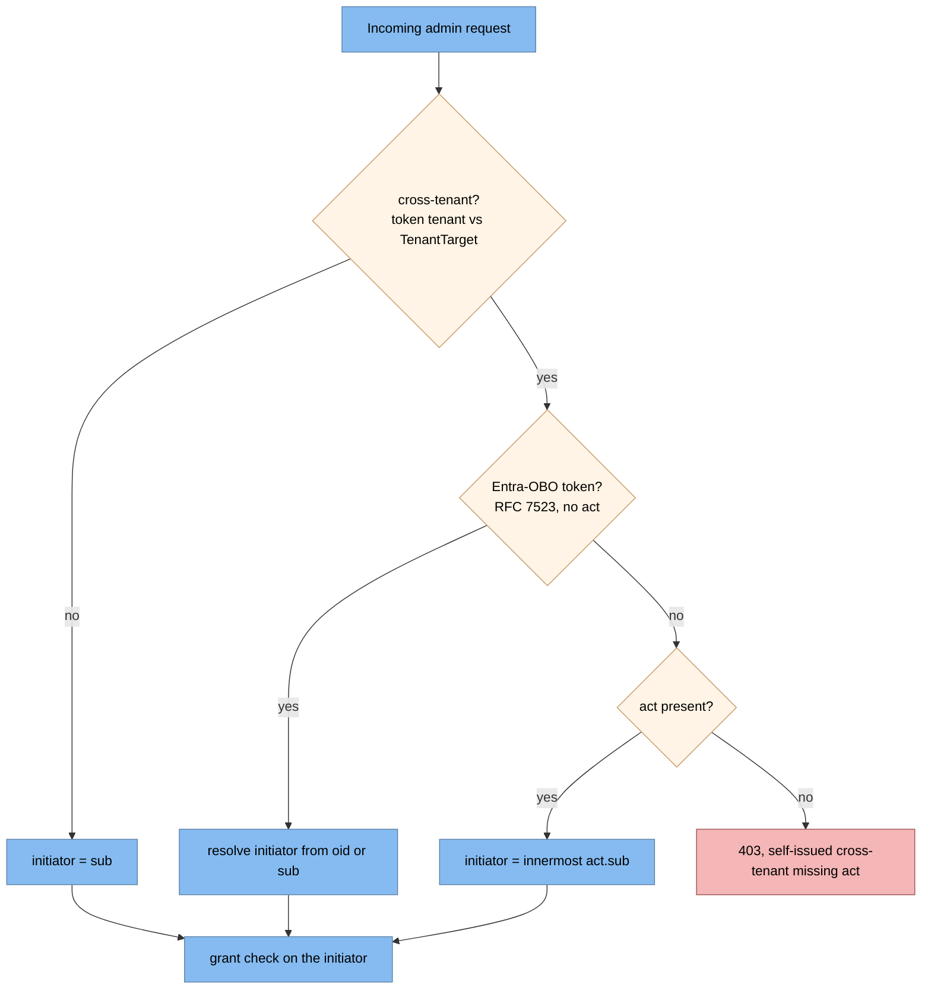
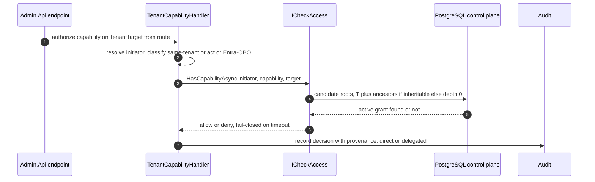
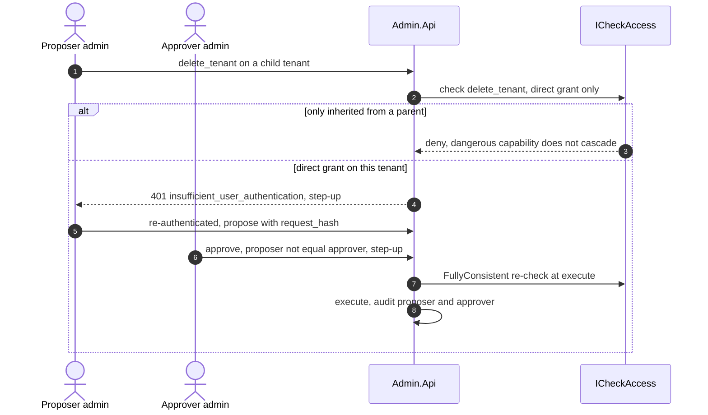
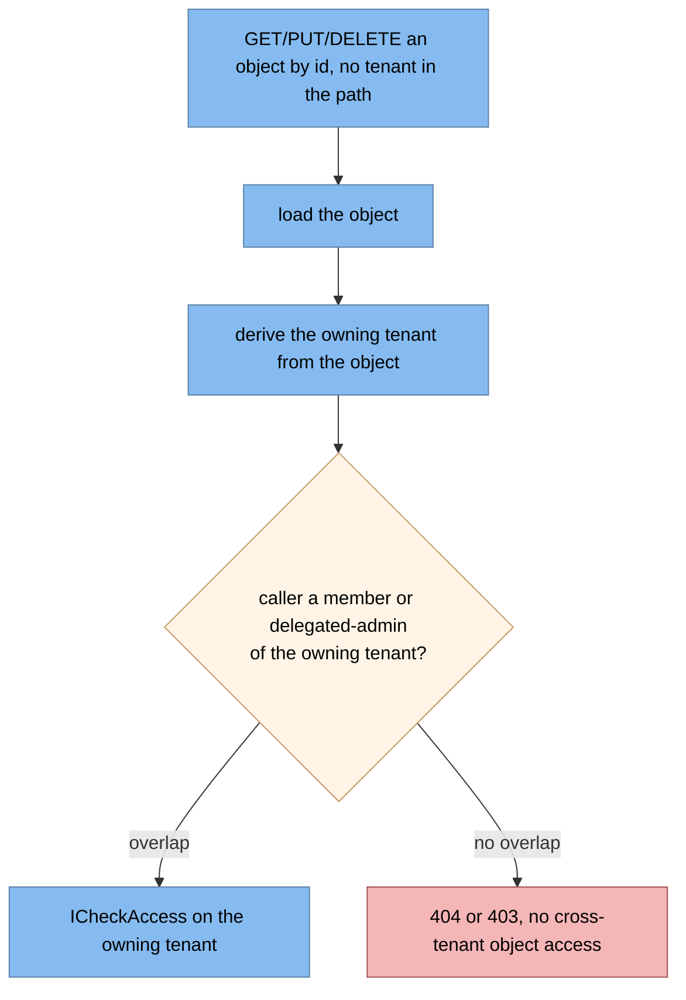

# Authorization and delegated admin (detailed design)

## Purpose and scope

How an access decision is computed and where it lives: the canonical `ICheckAccess`
port with consistency semantics, the DB-first decision query, the delegated-admin
policy model (capabilities, forbidden-cascade, time-bound revocable grants, no
global super-admin), the token-versus-decision-point split, delegation via the
`act` claim, anti-confused-deputy, step-up and dual-control gating, and audit
provenance. It feeds token issuance (04), user/membership (06), and the admin
surface (12).

In scope: the authorization engine and its port, the decision query and capability
catalog, delegation and initiator resolution, ASP.NET enforcement wiring, and the
step-up/dual-control gate. Out of scope: the `acr`/`amr`/`auth_time` **producer**
(06, which this consumes), the dual-control saga *workflow* and the admin API
surface (12), the audit *mechanism* (03), and the schema (02, the SSOT).

## Decisions realized

| Decision | What this design applies |
|---|---|
| ADR-0010 | The delegated-admin policy: explicit membership, scoped/capability-typed/time-bound/revocable grants, forbidden-cascade, no super-admin (the *what*) |
| ADR-0047 | The DB-first `ICheckAccess` engine with `ConsistencyRequirement`, fail-closed timeout, one canonical seam, ReBAC-swappable (the *how*) |
| ADR-0013 | Step-up (RFC 9470) enforcement, consuming the `acr`/`auth_time` produced in 06 |
| ADR-0005 | Deny-by-default, which forces the fail-closed decision |
| ADR-0008 | Audit provenance (direct versus delegated) on every cross-tenant decision |
| ADR-0024 / ADR-0001 / ADR-0021 | Hexagonal port; global control-plane data; ReBAC syntax/consistency as a version-dependent seam |

## Component and interface design

### The canonical port: `ICheckAccess`

There is exactly one authorization seam (not a second "relationship checker"): a
hexagonal port whose contract carries consistency, so a future DB-to-ReBAC swap
cannot silently break read-after-write on a revoke.

* `HasCapabilityAsync(subject, capability, TenantTarget, ConsistencyRequirement, freshnessToken?, ct)`
  and a `BatchAsync` to avoid N+1 on list screens.
* `ConsistencyRequirement`: `MinimizeLatency` (default, steady-state),
  `AtLeastAsFresh` (at least as fresh as a supplied token), `FullyConsistent`
  (bypass any cache, **mandatory on the check immediately after a revoke or grant
  write** — this closes the "new-enemy" problem on any engine swap).
* Adapters: `DbCheckAccess` now (PostgreSQL strong reads satisfy all three modes);
  `OpenFgaCheckAccess`/`SpiceDbCheckAccess` later, mapping to that engine's
  minimize-latency / at-least-as-fresh (with a freshness token) / fully-consistent
  modes, without changing any call site (ADR-0047).
* Fail-closed: an `AuthzCheckTimeout` (default 250ms, `IOptionsMonitor`-tunable)
  returns `Deny` on timeout, forced by deny-by-default (ADR-0005).
* Steady-state uses per-request scoped memoization of `(subject, capability, tenant)`;
  a cross-request decision cache is load-test-optional (not a v1 gate) and, if added,
  carries its own invalidation rather than reusing the revocation-propagation channel
  (revoke immediacy is a DB-direct `FullyConsistent` read, no backplane).

### The decision query (DB-first)

"Does user X hold capability C on tenant T?" walks the ancestor chain for an active
grant, honoring forbidden-cascade. Candidate roots are T plus its ancestors **only
when the capability is inheritable**; otherwise only T itself (depth 0). A grant
matches when it is rooted at a candidate root, carries the capability, and is active
(`RevokedAt IS NULL AND ValidFrom <= now AND (ExpiresAt IS NULL OR ExpiresAt > now)`).
The ancestor lookup uses the `TenantClosure` table (index-only reads) or a recursive
CTE. There is no global super-admin: every grant is anchored to a specific
`RootTenantId`.

### Capability catalog (ADR-0010, Security/DPO to ratify)

The forbidden-cascade is expressed by an `IsInheritable` flag in `CapabilityCatalog`:

| Capability | Inheritable | Meaning |
|---|---|---|
| `manage_users`, `manage_clients`, `manage_scopes`, `view_audit`, `view_config` | yes, cascade down the subtree | routine tenant administration |
| `delete_tenant`, `data_export`, `iam_change`, `re_delegate` | **no**, direct grant only | dangerous/irreversible; also gated by step-up + dual-control |

### Token versus decision point

Coarse per-tenant roles and the `tenant` claim ride in the 15-minute access token
(enough for a gateway/RS check, ADR-0004/0005); the **delegated-admin capability
check runs live at the Admin API**, never baked into the token, because grants are
revocable and subtree-scoped and a baked claim would be stale and un-revocable.

### Delegation and initiator resolution (anti-confused-deputy)

Authority is the **server-side grant check on the real initiator**, never a service
identity (CWE-441). The `act` claim (RFC 8693) is an identity/audit carrier, not
authority; `may_act` is deliberately **not** issued (it would be exactly the stale,
un-revocable authority the model rejects). Initiator resolution classifies first, so
a delegation token whose `sub` is the *target* is never mistaken for the actor:

* same-tenant, non-delegation: `sub` is the actor;
* Entra-OBO (RFC 7523, never carries `act`): resolve the initiator from `oid`/`sub`
  and run the grant check (do **not** 403);
* self-issued cross-tenant: the innermost `act.sub` is the actor; a missing `act`
  here is anomalous and is rejected (403), never fallen back to `sub`.

Emitting `act` is Nami's own code in the token-exchange handler (OpenIddict does not
do it natively), a build-interim seam with a decommission marker (ADR-0021).

### ASP.NET Core enforcement

`CapabilityRequirement` + a **scoped** `TenantCapabilityHandler` that authorizes the
original principal against `ICheckAccess`. A single **singleton**
`IAuthorizationPolicyProvider` parses a `Capability:` policy-name prefix and
validates it against the catalog (an unknown capability yields 403, closing an
injection hole), with `DefaultAuthorizationPolicyProvider` as the backup for the
fixed role/acr/actor policies. The deny-by-default, `FullyConsistent` decision stays
in the scoped handler, so the framework's per-name policy cache never caches an
access decision. The `TenantTarget` comes from the route/body, not the ambient
caller tenant, and must be passed explicitly.

A precondition to any capability check is **`RequireActor`**: the request must carry
a real user (a `sub` plus assurance claims, on the `admin-api` audience); an app-only
or client-credentials token is rejected (403), so an application permission can never
exercise admin authority (the anti-bypass lesson, policy detailed in 12). For
**root-level id-routes** that carry an object id but no `{tenantId}`
(`/applications/{id}`, `/users/{id}`, `/proposals/{id}`), the owning tenant is
derived from the loaded object before the check (an object-level filter that closes
BOLA/IDOR); because a user is global, such a route authorizes by the membership/grant
overlap between the user's tenant-set and the object's owning tenant. It is the same
`ICheckAccess` seam with a different `TenantTarget` source. `RequireActor` is paired
with an issuance-time invariant: no client-credentials client is ever granted the
`admin-api` scope, so an app-only token cannot exist for the admin API. A
client-supplied acting-for or subject is always discarded; authority is only the
server-side grant on the resolved initiator. The pipeline wires `UseMultiTenant()`
before authentication/authorization so the tenant is resolved before the check runs.

### Step-up and dual-control gate

Dangerous or high-assurance operations return `401` with
`WWW-Authenticate: ... error="insufficient_user_authentication", acr_values, max_age`
(RFC 9470); the required assurance is `max(client default, scope, runtime)` and is
consumed from the `acr`/`auth_time` produced in 06. Forbidden-cascade capabilities
that are also irreversible additionally require **dual-control**: a proposer creates
an approval bound to a `request_hash`, a different principal approves (proposer not
equal approver, single-use, itself step-up-gated), then execute. The saga aggregate
is `DualControlProposals` (schema in 02); its workflow lives in the admin design
(12). This design owns the authorization decision and the gating rule.

When the upstream is Entra, the equivalent challenge is `error="insufficient_claims"`
with a `claims` parameter and the auth-context `acrs`. Issuing or revoking a
delegated-admin grant is itself gated: it requires `re_delegate` held **directly** on
the root tenant plus dual-control, which closes chain re-delegation escalation. Each
cross-tenant decision produces the authz provenance this design owns for the audit
record (03): `grant_id`, `decision_path` (direct or delegated), `stepup_satisfied`,
`approval_request_id` with `approver_sub`, and `request_hash`.

### Patterns applied

Named per ADR-0066:

* **Ports and Adapters** for `ICheckAccess` (DB now, ReBAC later, call-site stable).
* **Strategy** for the `ConsistencyRequirement`-to-adapter mapping.
* **Policy/Specification** for `CapabilityRequirement` and the catalog check.
* **Closure Table** for ancestor lookup (defined in 02).

### Libraries

No new v1 third-party dependency: ASP.NET Core authorization plus the EF/Npgsql
stack of 02. The future ReBAC engines (OpenFGA, SpiceDB, both Apache-2.0) are a
swappable adapter, and their condition/caveat and consistency APIs are a
version-dependent seam re-verified per upgrade (ADR-0021).

## Data model

No new tables. This design reads and writes `Memberships`, `DelegatedAdmin`
(+`DelegatedAdminCapabilities`), `CapabilityCatalog`, `TenantClosure`, `AuditLog`,
and `DualControlProposals`, all defined in [02-data](02-data.md). The capability
taxonomy and `IsInheritable` flags are seeded from the catalog and are a
Security/DPO ratification item.

## Runtime flows

### Initiator classification (anti-confused-deputy)

Which principal the capability check authorizes, resolved before the check so a
delegation token whose `sub` is the target is never mistaken for the actor.

### Delegated capability check

### Dangerous capability: forbidden-cascade, step-up, dual-control

### Object-level authorization for id-routes (BOLA/IDOR)

A root-level id-route carries no `{tenantId}`, so the owning tenant is derived from
the loaded object, and a global user is authorized by membership overlap.

## Edge cases and failure modes

* **Confused deputy**: a self-issued cross-tenant token missing `act` is rejected
  (403), never fallen back to `sub` (which is the target); an Entra-OBO token
  legitimately has no `act` and is resolved via `oid`/`sub` (not 403).
* **Forbidden-cascade**: dangerous capabilities never inherit (`IsInheritable` false,
  matched only at depth 0), so a parent admin cannot delete or export a child tenant.
* **New-enemy / staleness**: a check immediately after a revoke or grant write must
  be `FullyConsistent`; otherwise a stale cache could still allow.
* **Fail-closed timeout**: an `ICheckAccess` call exceeding 250ms returns `Deny`.
* **Unknown capability**: a `Capability:` policy naming a capability not in the
  catalog yields 403, not a silent allow.
* **Wrong target**: `TenantTarget` is the route/body tenant, not the ambient caller
  tenant; assuming the ambient tenant would authorize against the wrong resource.
* **Registration mistakes**: the handler must be scoped (it depends on scoped
  `ICheckAccess`/tenant context); the policy provider must not cache decisions; and
  `Admin.TenantScope`'s set-tenant-context side effect must be rehomed before it is
  retired (12).

## Security considerations

* Deny-by-default, server-side, evaluated per request (OWASP); no global super-admin;
  grants are least-privilege, time-bound, and revocable (ADR-0010).
* Delegation is not impersonation: the real initiator is always distinguishable and
  recorded with provenance (direct versus delegated) in the audit hash-chain (03).
* Dangerous/irreversible capabilities require a direct grant plus dual-control plus
  step-up; approvals are single-use and bound to a `request_hash` so they cannot be
  replayed onto another action.
* Consistency is in the contract, so a DB-to-ReBAC swap cannot reintroduce
  stale-after-revoke authorization (ADR-0047).

## Testing strategy

Because there is no reference implementation to lean on, the negative tests are a
production gate:

* a cross-tenant check denies; forbidden-cascade holds (a parent admin cannot
  `delete_tenant` a child); an expired or revoked grant denies immediately;
* a check immediately after a revoke, run `FullyConsistent`, denies with no stale
  hit; a timed-out check denies (fail-closed);
* an unknown capability yields 403;
* confused-deputy: self-issued cross-tenant missing `act` → 403; Entra-OBO with no
  `act` and a valid grant → allow; same-tenant with no `act` → allow with
  `initiator = sub`;
* dual-control: a proposer cannot self-approve; step-up is enforced on dangerous
  capabilities;
* an app-only (client-credentials) token is rejected by `RequireActor` (403), and a
  root-level id-route authorizes against the loaded object's owning tenant so a caller
  cannot act on an object outside its tenant-set (BOLA/IDOR);
* a CI gate asserts the DB-tier SLO (p95 < 30ms, p99 < 80ms; the future ReBAC tier is
  p95 < 50ms, p99 < 150ms) and a timeout rate
  below 0.001; the single `ICheckAccess` seam is exercised by both the token and
  admin paths.

## Open and build-time items

* The final capability catalog, the `IsInheritable` flags, and the forbidden-cascade
  list are a Security/DPO ratification item (ADR-0010).
* The per-capability required assurance (`acr`) and the dual-control approver roles,
  plus audit retention and signing, are Security/DPO items.
* The authorization SLO numbers and the 250ms timeout are interim and await
  Ops/Security ratification (ADR-0047).
* ReBAC adoption timing is deferred; the condition/caveat and consistency APIs are a
  version-dependent seam (ADR-0021).
* Whether to use an `act` token versus OBO is IdP-dependent and a Security/DPO
  ratification item.
* Performance: a shallow tenant tree reduces ancestor hops, and the closure
  ancestor-set is cached and invalidated only on tenant reshape.
* `act` emission is a build-interim seam with a decommission marker if OpenIddict
  ships native token-exchange `act`.

## References

* Architecture overview: [components](../architecture/04-components.md) (the
  authorization engine), [runtime views](../architecture/06-runtime-views.md).
* Design: [02-data](02-data.md) (the membership/grant/closure schema),
  [04-core-protocol](04-core-protocol.md) (coarse roles and `act` in the token),
  [03-audit](03-audit.md) (provenance records).
* ADRs: 0010 (delegated-admin policy), 0047 (the engine and `ICheckAccess`), 0013
  (step-up), 0005 (deny-by-default), 0008 (audit provenance), 0024 (hexagonal port),
  0001 (tenancy), 0021 (ReBAC version seam).

---

[← Prev: Core protocol server](04-core-protocol.md) · [Index](README.md) · Next: [User management and authentication →](06-user-management.md)
