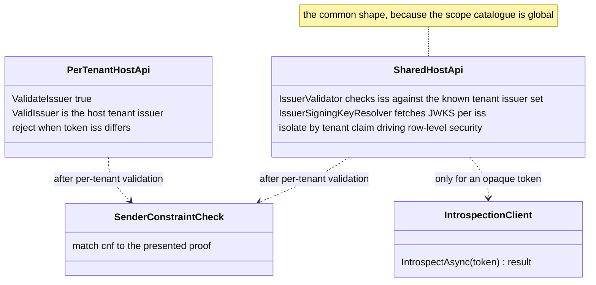
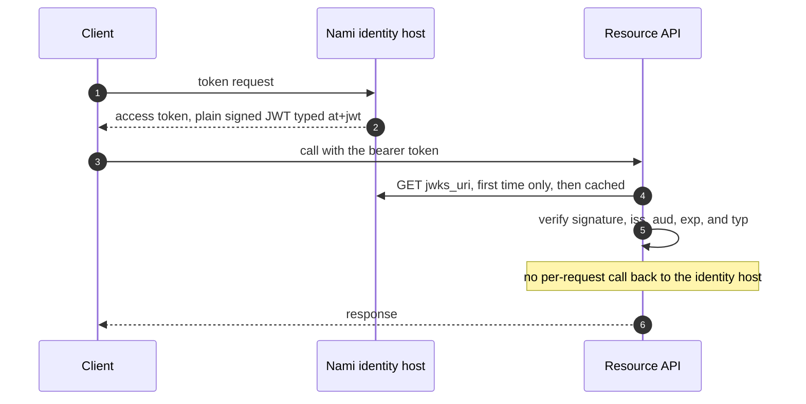
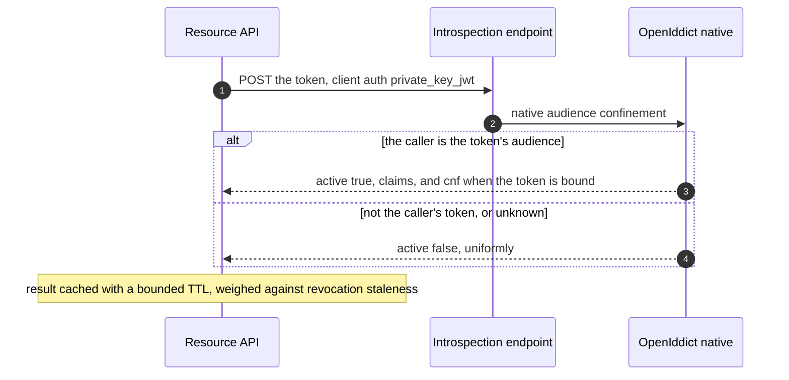
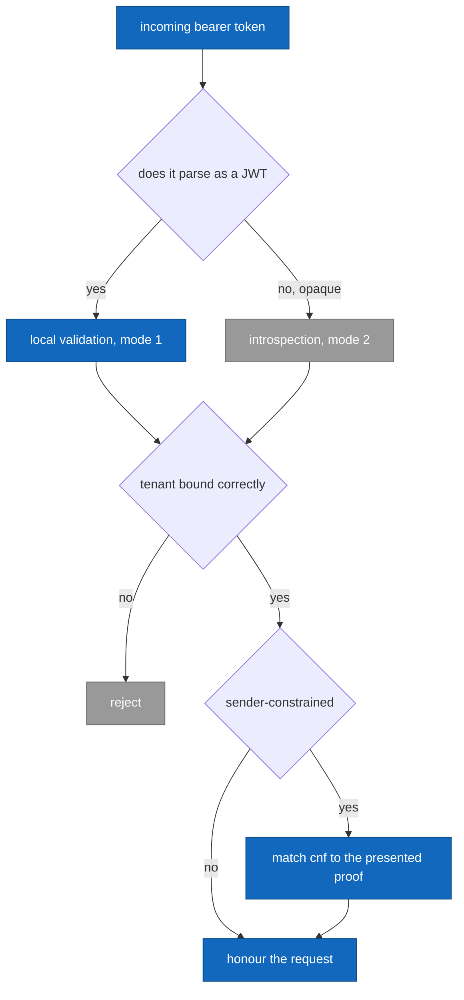

# Resource-server token validation (detailed design)

> **Sits under:** [architecture: security architecture](../architecture/13-security-architecture.md)
> (token validation and tenant isolation) and
> [runtime flow views](../architecture/09-runtime-flow-views.md) (token use).
> **Implementer source of record:** this document, for the **consumer** side of token
> validation. The issuing side, the endpoint model, and per-tenant issuer minting are
> [04](04-core-protocol.md); the entities and the row-level-security mechanism are
> [02](02-data.md).

This is the only design in the layer that describes code Nami does not run. A resource API
is the adopter's process, and `Nami.Identity.Validation` is shipped for it (ADR-0065), so
everything here is a contract offered outward rather than an internal arrangement. That is
also why the central invariant is stated as an invariant: Nami cannot enforce it inside
someone else's API.

## 1. Decisions realized

| Decision | What this design applies |
|---|---|
| ADR-0049 | The two resource-server shapes, issuer and tenant binding as the isolation boundary, enforcement at the shared `TokenValidationParameters` layer, DPoP composing on top |
| ADR-0033 | The reason the invariant exists: Pool tenants share a pool-group signing key, so a valid signature does not identify a tenant |
| ADR-0005 | The access token is a plain signed JWT typed `at+jwt`, minimal by necessity because it is readable |
| ADR-0004 | Tiered revocation and the 15-minute access-token TTL as the common backstop |
| ADR-0048 | Introspection for reference tokens: client authentication, native audience confinement, uniform `active:false` |
| ADR-0001 | Per-tenant issuer, tenant resolution by host or path, one tenant per token |
| ADR-0037 | Row-level security as the isolation mechanism the `tenant` claim drives |
| ADR-0009 | `private_key_jwt` for the machine-to-machine caller and for the introspection client |
| ADR-0014 | DPoP and mTLS sender-constraint, checked after per-tenant validation |
| ADR-0021 | The version-sensitive seams named in section 11, re-verified on each bump |

## 2. Purpose and scope

A resource API has to decide whether to honour a bearer token. The default is **local JWT
validation**: verify the signature against the issuing tenant's JWKS, the audience, the
expiry, and the token type, with no call back to the identity provider, so it scales.
A **reference token plus introspection** path exists only where a revocation has to take
effect immediately. On top of both, because the deployment is multi-tenant with a
per-tenant issuer and a shared Pool signing key, the resource server must bind each token
to the **correct tenant** rather than merely accept a valid signature.

In scope: the two validation modes, tiered revocation seen from the resource server, the
two multi-tenant resource-server shapes and the invariant they share, machine-to-machine
validation, and JWKS caching against the rotation window. Out of scope: the endpoint model
and discovery content, and the introspection and revocation **server** configuration (04);
the signing-key lifecycle and the rotation propagation window (12); the distrusted-key set
and the revocation propagation SLO (13); the row-level-security policy and role (02); DPoP
proof-of-possession internals, of which this design covers only the `cnf` check after
per-tenant validation (14, and 06 when written); and the `acr`, `amr`, and `auth_time`
producer, of which this design is only a consumer (08).

## 3. Interfaces and contract

This design owns **no Nami interface**. That is the point of ADR-0049 section D: the rules
live in `TokenValidationParameters`, the type both `OpenIddict.Validation` and
`JwtBearer` build on, so one set of rules covers the JWT and reference-token paths and the
sender-constraint check composes above them. The members this design uses are named in
section 11 with the source they were read in.

The contract is therefore a pair of **shapes**, chosen by where the API lives, not one
authentication scheme per tenant. A scheme per tenant grows with the tenant count and needs
a restart to register a newly provisioned tenant, which is why ADR-0049 rejected it.



| Shape | Where it applies | How the tenant is bound |
|---|---|---|
| **Per-tenant host** | An endpoint whose host or path already carries the tenant, including the identity provider's own userinfo, introspection, and revocation | One validation scheme, with the expected issuer set per request from the resolved tenant. A token whose `iss` is not that issuer is **rejected** |
| **Shared host** | A product API serving many tenants on one host, which is the common case because the scope catalogue is global | The issuer is resolved **from the token**, validated against the known tenant-issuer set, and the `tenant` claim then drives row-level security. Isolation is by claim, not by host |

## 4. Data and structure

This design owns no tables. It reads two things defined in [02](02-data.md):

| Read | From | Why |
|---|---|---|
| The tenant-to-issuer registry, and each issuer's `jwks_uri` | `Tenants` (`Identifier` drives the issuer) | To build the known tenant-issuer set and resolve a JWKS per issuer |
| The row-level-security policy on tenant-scoped tables | The raw-SQL migration step | After validation, the `tenant` claim sets `app.current_tenant` so the API returns only that tenant's rows |

The setting is applied as **`set_config($1, $2, true)`**, parameterized and with the third
argument `true` so it is `SET LOCAL`, inside the request transaction. Passing `false` leaks
the value to the next request on a pooled connection, and interpolating the tenant into the
statement is an injection. Both rules and the reason for each are in 02; they are repeated
here because this is the one place the code runs outside Nami's own process, where a reader
cannot be assumed to have read 02.

## 5. Behaviour

### Mode 1: local JWT validation, the default



Configured with an authority, an audience, and the token type restricted to `at+jwt`. The
JWKS is fetched once and cached, and refreshed when an unknown key identifier appears. The
type restriction is not decoration: without it, another JWT the same issuer signed, an
identity token for instance, is accepted as an access token. That is token confusion, and
the guard against it is one property.

Because the access token is a plain JWT and therefore readable by anyone holding it, its
claim set is minimal by necessity rather than by preference (ADR-0005). The claim set is
the issuer's concern (04) and this design only consumes it.

### Mode 2: reference token plus introspection

Used only where a revocation must take effect immediately. The API posts the token to the
introspection endpoint with `private_key_jwt` client authentication.



Three contract points, all of them the server's behaviour that this side depends on and
must not reimplement:

* **Audience confinement is native.** A caller may introspect only a token whose audience
  is itself. Writing an owner-check controller instead is the most repeated wrong-API error
  in this domain, and it reimplements a mechanism that is already correct (04, ADR-0048).
* **A sender-constrained token's `cnf` must appear in the response**, or the response must
  be `active:false`. A response that is active but carries no `cnf` for a bound token would
  let the API accept it as a plain bearer token, which is the whole property lost. The
  issuing side states this as enrich-or-inactive (04).
* **`active:false` is uniform** for an unknown token and for another caller's token, so
  introspection is not an existence oracle, and it is rate-limited per client.

### Tiered revocation, from this side

| API position | Mechanism | Revocation latency |
|---|---|---|
| Co-located with the identity database | The validation-side entry-validation flags, a database check per request | Immediate, with no HTTP call |
| External, holding a JWT | None mid-life | Bounded by the 15-minute TTL |
| External, holding a reference token | Introspection | Immediate on the next call, minus the result-cache TTL |

An API that supports both modes runs local JWT as the default and forwards to introspection
by token shape, since an opaque token has no JWT structure to parse.



### Multi-tenant validation, the part that carries the risk

**The invariant.** A token is honoured only when all three hold, and a token failing any
one is rejected:

1. the signature verifies against the JWKS of the issuer **named in the token**, and
2. the token is bound to the **correct tenant**, by `iss` equality for the per-tenant-host
   shape and by the `tenant` claim driving row-level security for the shared-host shape, and
3. the audience matches this API.

**Never the signature alone.** Under ADR-0033 two Pool tenants share a pool-group signing
key, so a token minted for tenant A verifies perfectly against the key tenant B's API
trusts. The signature proves the token came from Nami. It proves nothing about which tenant
it belongs to. Spike A-7 (verification record V27, 4 of 4) established this at the
`TokenValidationParameters` layer with two Pool tenants sharing one key and holding
distinct issuers:

| Test | What it established |
|---|---|
| T1 | A token carrying tenant A's `iss`, presented to a pipeline whose expected issuer is tenant B, is rejected with an invalid-issuer error |
| T2 | Signature-only validation accepts **both** tenants' tokens against the shared key. Only issuer binding rejects the cross-tenant one. This is the test that turns the invariant from advice into a requirement |
| T3 | One pipeline validates several issuers against the shared key, and the `tenant` claim then drives row-level security so each token reads only its own tenant's rows, holding **even though the signing key is shared** |
| T4 | A `cnf` sender-constraint checked after per-tenant validation composes: a matching proof passes, a mismatch is rejected |

The shape of T2 is worth keeping in view when reading any resource-server code: a test that
only asserts "a valid token is accepted" would pass on a build with no tenant isolation
whatsoever.

### Machine-to-machine validation

A service-to-service token is a single-tenant plain JWT obtained through client credentials
with `private_key_jwt` from the correct tenant's issuer, carrying one `tenant` claim. The
receiving service validates it exactly as mode 1 and applies the same tenant binding. A
token is never reused across tenants, which follows from one tenant per token (ADR-0001)
rather than being an extra rule.

### JWKS caching against the rotation window

A resource server caches the issuer's configuration and JWKS and refreshes on a schedule,
plus on demand when an unknown key identifier appears. That cache is what makes the
rotation window a correctness constraint rather than an operational preference: **the
propagation window has to exceed the longest resource-server cache lifetime**, so a key is
published in the JWKS before it signs anything and a retired key is kept while tokens it
signed are still in flight. The rotation mechanism is 12, and the compressed window used
for break-glass, together with the distrusted-key set, is 13.

The refresh interval and cache lifetimes are library defaults that a resource server can
change, so this design states the **constraint** rather than a number: whatever the
adopter's cache lifetime is, the publish-before-sign window must be longer. Pinning a
figure here would be a claim about someone else's configuration.

## 6. Dependencies and wiring

### Which package supplies what

Verified at OpenIddict 7.5.0; the extension methods are not all in one package, and picking
the wrong one is a compile error rather than a subtle bug, which is why they are listed:

| Need | Method | Package |
|---|---|---|
| The validation core, issuer, audiences, introspection | `SetIssuer`, `AddAudiences`, `UseIntrospection` | `OpenIddict.Validation` |
| Entry validation against the database | `EnableTokenEntryValidation`, `EnableAuthorizationEntryValidation` | `OpenIddict.Validation` |
| Co-located validation reading the local server's configuration | `UseLocalServer` | `OpenIddict.Validation.ServerIntegration` |
| The ASP.NET Core integration | `UseAspNetCore` | `OpenIddict.Validation.AspNetCore` |
| Outbound HTTP for remote introspection | `UseSystemNetHttp` | `OpenIddict.Validation.SystemNetHttp` |

An external API doing introspection therefore needs three packages, not one, and the HTTP
one is the easiest to omit because nothing about the call site suggests it.

### Registration

```csharp
// Mode 1, the ordinary external API. Any JWT-bearer stack works, because the rules
// live in TokenValidationParameters rather than in a Nami type.
services.AddAuthentication().AddJwtBearer(o =>
{
    o.Authority = "https://acme.id.example.com";     // discovers jwks_uri
    o.Audience  = "orders-api";
    o.TokenValidationParameters.ValidTypes = ["at+jwt"];   // anti token-confusion
});

// Shape a, per-tenant host: one scheme, expected issuer resolved per request.
// ConfigurePerTenant is an OptionsBuilder extension, so it hangs off AddOptions.
services.AddOptions<OpenIddictValidationOptions>()
        .ConfigurePerTenant<OpenIddictValidationOptions, NamiTenantInfo>(
            (options, tenant) => options.SetIssuer(tenant.IssuerUri));

// Shape b, shared host: resolve the issuer from the token, bind it to the known set.
services.Configure<JwtBearerOptions>(JwtBearerDefaults.AuthenticationScheme, o =>
{
    o.TokenValidationParameters.ValidTypes = ["at+jwt"];
    o.TokenValidationParameters.IssuerValidator = knownTenantIssuers.Validate;
    o.TokenValidationParameters.IssuerSigningKeyResolver = jwksPerIssuer.Resolve;
});
```

`NamiTenantInfo` is the concrete tenant-info type registered with
`AddMultiTenant<NamiTenantInfo>()` in 02. The type argument must be a concrete
`ITenantInfo` implementation.

### Configuration keys

**Set by this design**, following `Nami:Section:Key` with the `Nami__Section__Key`
environment form (ADR-0065):

| Key | Purpose |
|---|---|
| `Nami:Validation:Authority` | The issuer this API trusts, for the per-tenant-host shape |
| `Nami:Validation:Audience` | This API's audience value |
| `Nami:Validation:KnownTenantIssuers` | The issuer allow-list for the shared-host shape |
| `Nami:Validation:Mode` | `LocalJwt`, `Introspection`, or `Both` |
| `Nami:Validation:IntrospectionCacheSeconds` | Bounded result cache; traded against revocation staleness |

### Key libraries and licenses

| Library | Purpose | License |
|---|---|---|
| `OpenIddict.Validation` (`.AspNetCore`, `.ServerIntegration`, `.SystemNetHttp`) | The validation pipeline, entry validation, introspection, local-server integration | Apache-2.0 |
| `Microsoft.AspNetCore.Authentication.JwtBearer` | The JWT-bearer scheme for an API that does not take an OpenIddict dependency | MIT |
| `Microsoft.IdentityModel.Tokens` | `TokenValidationParameters`, the layer the rules live in | MIT |
| `Finbuckle.MultiTenant` | `ConfigurePerTenant` for the per-tenant-host shape | Apache-2.0 |

ADR-0061's stack-of-record table has **no row for the validation edge**, which is recorded
as an open item in section 10 rather than fixed here.

### Patterns applied

Named per ADR-0066:

* **Strategy** for the two resource-server shapes, selected by deployment rather than by
  configuration branching inside one code path.
* **Cache-aside** for the JWKS and for the introspection result.
* **Chain of Responsibility**, inherited: the sender-constraint check runs after
  per-tenant validation rather than inside it.

## 7. Error handling, edge cases, invariants

* **The three-part invariant** of section 5 is the one non-negotiable rule here. Dropping
  any part re-opens cross-tenant token acceptance, which is why ADR-0049 states it as an
  invariant rather than as guidance.
* **A valid signature is not a tenant boundary** (ADR-0033, and T2 proved it). This is the
  single most likely wrong assumption a reader arrives with.
* **Three parts, not four, and the difference is the shape.** ADR-0049 states the invariant
  as signature, issuer, and audience, with the `tenant` claim added for the shared-host
  shape, and [14](14-advanced-flows.md) summarizes it as four items because it is describing
  that shape. Both are the same rule: part 2 above **is** issuer equality for a per-tenant
  host and **is** the `tenant` claim for a shared host, because those are the same question
  asked of two different deployments. Counting to four for a per-tenant-host API would imply
  a tenant check the host has already made.
* **`ValidTypes` must be set on every JWT resource server.** Its default is `null`, meaning
  no type checking at all, so omitting it is not a mild oversight.
* **`set_config` must be `SET LOCAL` and parameterized.** `false` leaks the tenant to the
  next request on a pooled connection; interpolation is an injection.
* **A reference-token client forces its resource server onto introspection.** A reference
  token is opaque, so there is nothing to validate locally. That cost belongs in the
  decision to issue one.
* **An unknown key identifier must trigger a JWKS refresh**, not a rejection, or every
  rotation becomes an outage for the length of the cache lifetime.
* **`amr` may be absent** on a silently refreshed token, so a resource server gating a
  sensitive operation uses `acr` and `auth_time` and treats `amr` as informational (08).
* **Do not reimplement introspection audience confinement.** It is native, and a
  hand-rolled owner check is likely to be weaker.

## 8. Security and multi-tenancy notes

* Isolation is by issuer and `tenant`-claim binding, never by signature. The per-tenant-host
  shape isolates by rejecting an issuer mismatch; the shared-host shape isolates by the
  `tenant` claim driving row-level security under a **de-privileged** database role, since a
  superuser bypasses the policy entirely (02, ADR-0037).
* Sender-constraint (`cnf`) is checked **after** per-tenant validation, so a proof-of-
  possession match can never substitute for a tenant check (T4, ADR-0014).
* Introspection requires client authentication and audience confinement, so one client
  cannot inspect another's tokens (ADR-0048).
* A resource-server rejection worth recording goes to the security-event sink (03) rather
  than to the diagnostic log (19), because the diagnostics lane has neither the retention nor
  the tamper-evidence that a rejection record needs.
* The access token is readable. Anything sensitive in it is a leak by construction, which is
  why the minimal claim set (ADR-0005) is a precondition of this whole design rather than a
  separate nicety.

## 9. Testing

* **Spike A-7, verification record V27, 4 of 4**, is kept as the regression suite: T1 issuer
  mismatch rejected; T2 shared key does not isolate while issuer binding does; T3 shared-host
  multi-issuer validation plus `tenant`-claim row-level security isolates under a shared key;
  T4 sender-constraint composes. Proven at the `TokenValidationParameters` layer, which is
  what makes it cover both validator stacks.
* **The negative test that matters most** is T2's shape: assert that a token from another
  tenant, with a perfectly valid signature, is **rejected**. A suite that only proves valid
  tokens are accepted would pass with no isolation at all.
* Local JWT: a valid token passes; a wrong audience fails; a non-`at+jwt` type fails, which
  is the token-confusion case; an unknown key identifier triggers a refresh rather than a
  rejection.
* Introspection: `active:false` is uniform for absent and for not-the-caller's; a caller
  introspecting another's token is denied; a sender-constrained token's response carries
  `cnf`, or is inactive.
* End-to-end framework wiring is a separate gate from the invariant, and is not yet proven:
  see section 10.

## 10. Open and build-time items

* **The end-to-end framework wiring is not spike-proven.** A-7 exercised the
  `TokenValidationParameters` layer, not a real validation-scheme registration. Wiring the
  actual `OpenIddict.Validation` scheme together with `ConfigurePerTenant`, introspection for
  reference tokens, and the Silo per-tenant-key case is an integration gate (ADR-0049 records
  the same boundary). The security invariant is de-risked; the wiring is not.
* **ADR-0061 has no stack-of-record row for the validation edge**, so
  `Microsoft.AspNetCore.Authentication.JwtBearer` and `Microsoft.IdentityModel.Tokens` are
  not pinned anywhere despite being load-bearing here. Raised for the stack-of-record table
  rather than decided in a design document.
* **`TokenValidationParameters.ValidTypes` is a moving target.** It is present on the
  IdentityModel line versioned 9.0.0 and **absent from that repository's `main` branch**, so
  the property this design depends on may be superseded. This is an ADR-0021 seam and needs
  a contract-regression assertion rather than trust.
* **The introspection result-cache TTL** is tuned against the revocation service-level
  objective with operations input (ADR-0048, ADR-0041).
* **The known-tenant-issuer set has to stay current** as tenants are provisioned. Whether
  it is pushed, pulled, or discovered is a build-time choice; the requirement is that a newly
  provisioned tenant does not need a restart, which is the reason a scheme per tenant was
  rejected.

## 11. Sources

* Architecture: [security architecture](../architecture/13-security-architecture.md),
  [runtime flow views](../architecture/09-runtime-flow-views.md),
  [performance and scalability](../architecture/21-performance-scalability.md) for the
  local-validation-versus-introspection cost argument.
* Design: [02](02-data.md) for the tenant registry and the row-level-security mechanism,
  [04](04-core-protocol.md) for the issuing side and the introspection server,
  [12](12-key-management.md) for rotation, [13](13-revocation-propagation-and-caching.md) for propagation
  and the distrusted-key set, [06](06-sender-constrained-tokens.md) for sender-constraint
  internals,
  and [08](08-user-management.md) for the `acr` and `amr` producer.
* ADRs: 0049 (this design's owning decision), 0033 (the shared keyset it mitigates), 0005,
  0004, 0048, 0001, 0037, 0009, 0014, 0021, 0043, 0061, 0065, 0066.
* **External verification, 2026-07-26.** OpenIddict at release tag 7.5.0, the version
  ADR-0061 pins: `SetIssuer` (two overloads), `AddAudiences`, `UseIntrospection`,
  `EnableTokenEntryValidation`, and `EnableAuthorizationEntryValidation` are on
  `OpenIddictValidationBuilder` in `OpenIddict.Validation`; `UseLocalServer` is **not**, and
  lives in `OpenIddict.Validation.ServerIntegration`, with `UseAspNetCore` in
  `OpenIddict.Validation.AspNetCore` and `UseSystemNetHttp` in
  `OpenIddict.Validation.SystemNetHttp`. Finbuckle.MultiTenant at release tag v10.1.2:
  `ConfigurePerTenant<TOptions, TTenantInfo>` is an `OptionsBuilder<TOptions>` extension in
  `Finbuckle.MultiTenant/Extensions/OptionsBuilderExtensions.cs`, taking
  `Action<TOptions, TTenantInfo>` and constrained `where TTenantInfo : ITenantInfo`, with
  five arity overloads. The constraining interface is **`ITenantInfo`**, in
  `Finbuckle.MultiTenant.Abstractions`; there is no `IMultiTenantInfo`, and the design corpus
  names that non-existent type three times, so the type argument here is the concrete
  `NamiTenantInfo`. Microsoft.IdentityModel.Tokens: `TokenValidationParameters` carries
  `ValidateIssuer`, `ValidIssuer`, `ValidIssuers`, `ValidAudiences`, `IssuerValidator`, and
  `IssuerSigningKeyResolver`; `ValidTypes` is `public IEnumerable<string>` whose **default is
  `null`** and which, for a JWE, applies only to the inner token header. It is present on the
  branch whose version file reads 9.0.0 and absent on that repository's `main`, which is the
  seam recorded in section 10.
* Reconciled against the design corpus's resource-server-validation design on 2026-07-26.
  Taken from it: the two-mode split, the two resource-server shapes with the per-tenant-host
  and shared-host distinction, the three-part invariant, the A-7 test set with what each test
  establishes, the machine-to-machine case, and the JWKS-cache-versus-rotation-window
  constraint. **Corrected against the source:** the corpus wires
  `ConfigurePerTenant<OpenIddictValidationOptions, IMultiTenantInfo>`, and no such interface
  exists. **Added here:** which package supplies each extension method, the observation that
  an external introspecting API needs three packages rather than one, `ValidTypes` defaulting
  to `null` and what that means for omitting it, the forwarding-by-token-shape flowchart, the
  reason T2's shape matters when reading any test suite, the constraint-not-a-number framing
  of the rotation window, and the two open items about ADR-0061's missing row and the
  `ValidTypes` version seam.

---

[Prev: Core protocol server](04-core-protocol.md) · [Index](README.md) · Next: [Sender-constrained tokens](06-sender-constrained-tokens.md)
