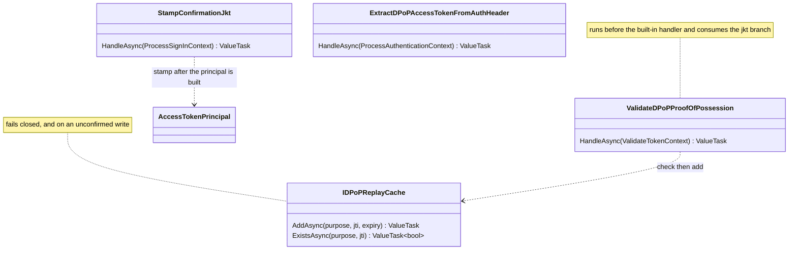
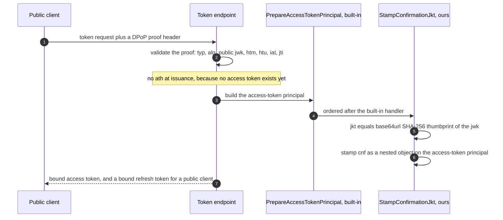
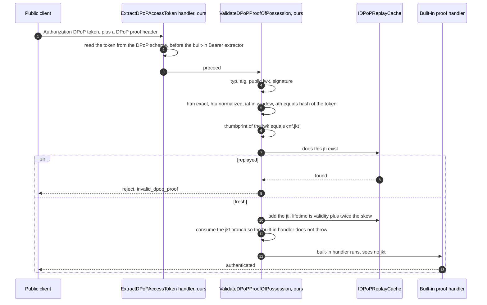
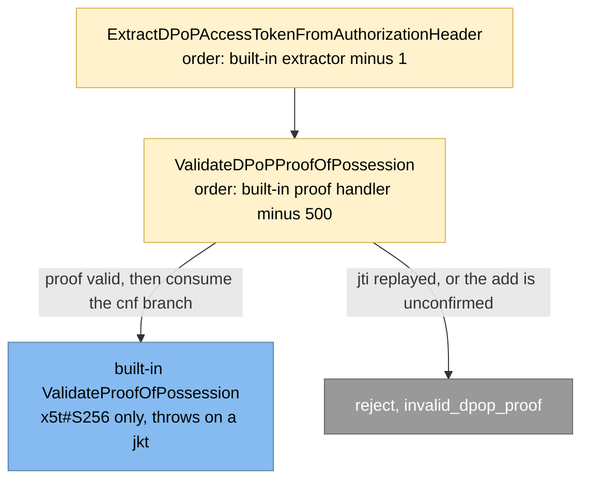

# Sender-constrained tokens: DPoP and mTLS (detailed design)

> **Sits under:** [architecture: security architecture](../architecture/13-security-architecture.md)
> (proof of possession) and [runtime flow views](../architecture/09-runtime-flow-views.md).
> **Implementer source of record:** this document, for both sender-constraint mechanisms.
> The issuance pipeline they hook into is [04](04-core-protocol.md); the per-tenant
> validation the `cnf` check composes on top of is [05](05-resource-server-validation.md);
> the cross-node cache the replay store uses is [13](13-revocation-propagation-and-caching.md).

A sender-constrained token is useless to a thief who does not also hold the
proof-of-possession key. Two mechanisms cover two client shapes, and the split is not a
preference: a browser cannot present a TLS client certificate, and a machine-to-machine
client has no reason to sign a proof per request when it already has a certificate.

## 1. Decisions realized

| Decision | What this design applies |
|---|---|
| ADR-0014 | mTLS as the native baseline for confidential and machine-to-machine clients, DPoP built for public clients; both in scope, neither optional |
| ADR-0005 | The access token is a plain signed JWT, which is why a resource server can read `cnf` from it without introspecting |
| ADR-0021 | The DPoP handlers are a version-pinned build-interim seam with a decommission marker: they retire if the engine ships native DPoP |
| ADR-0024 | The replay cache is a port at the application edge, not a direct Redis dependency |
| ADR-0049 | Sender-constraint is checked **after** per-tenant validation, never instead of it |
| ADR-0048 | The introspection response must carry `cnf.jkt` for a bound token, or be inactive |
| ADR-0029 | The backend-for-frontend, which is the actual mitigation for the browser threat DPoP does not solve |
| ADR-0073 | The proxy posture that forwards the client certificate, and the header-spoofing guard on it |

## 2. Purpose and scope

In scope: mTLS issuance and enforcement, DPoP issuance and validation, the proof contents
and their checks, replay protection, the validation modes and the nonce, the client-side
key contract, and the security boundary of each mechanism.

Out of scope: the token-issuance pipeline this hooks into and the introspection **server**
configuration (04); the per-tenant validation the `cnf` check runs after (05); the
cross-node cache infrastructure the replay store sits on (13); device, PAR, and
token-exchange wiring (14); and the backend-for-frontend host itself (16, ADR-0029).

## 3. Interfaces and contract

Four seams, three of them handlers Nami writes because the engine has nothing to configure.



| Seam | Pipeline and event | Why it exists |
|---|---|---|
| `StampConfirmationJkt` | Server, `ProcessSignInContext` | The engine stamps `cnf` only for a client certificate, so the `jkt` form has no code path |
| `ExtractDPoPAccessTokenFromAuthorizationHeader` | Validation, `ProcessAuthenticationContext` | The built-in extractor matches only the literal `Bearer` prefix, space included |
| `ValidateDPoPProofOfPossession` | Validation, `ValidateTokenContext` | The built-in proof handler understands only `x5t#S256` and **throws** on a `jkt` |
| `IDPoPReplayCache` | Port (ADR-0024) | Replay detection needs a cross-node store, and the store is an adapter concern |

The DPoP constants (`typ` value, claim names, error codes, header name) are also Nami's,
because the engine defines none of them. Section 11 records that as a source-verified fact
rather than an impression.

## 4. Data and structure

No relational table. The shape that matters is the `cnf` claim on the access token:

| Form | Value | Mechanism |
|---|---|---|
| `cnf.x5t#S256` | base64url SHA-256 of the client certificate's DER bytes | mTLS (RFC 8705) |
| `cnf.jkt` | base64url SHA-256 JWK thumbprint (RFC 7638) of the proof key | DPoP (RFC 9449) |

**`cnf` is a nested JSON object, and the claim must be set as one.** The engine's own
mTLS path builds a `JsonObject` and passes it to `SetClaim`, so the DPoP path does the
same and emits `"cnf":{"jkt":"..."}`. Setting a `string` instead produces a
double-serialized value that a resource server cannot read as an object, which is a real
reported failure mode and not a theoretical one.

Replay state is a key per proof identifier in the distributed cache, `DPoPReplay-jti-<jti>`,
with a lifetime of the proof validity window plus twice the applicable skew. The nonce,
when enabled, is a data-protected encrypted timestamp and is never persisted.

## 5. Behaviour

### mTLS: native, and the work is at the edge

For a confidential or machine-to-machine client with a certificate,
`UseClientCertificateBoundAccessTokens()` makes the token endpoint stamp `cnf.x5t#S256`,
and discovery advertises `tls_client_certificate_bound_access_tokens`. No handler is
written. The engine both stamps and validates the binding.

The work is therefore not in the application but at the edge and on the resource server.
The resource server must compare `cnf.x5t#S256` against the thumbprint of the certificate
on the actual connection; a mismatch is a rejection, and that comparison is the entire
value of the mechanism. Behind a TLS-terminating proxy, which is the default posture, the
certificate arrives as a forwarded header, so the trusted-proxy allow-list is
load-bearing: a client-certificate header accepted from an untrusted source **is**
client-certificate impersonation (04, ADR-0073). This path also requires internal
certificate authority infrastructure, which is an operational prerequisite rather than a
code one.

### DPoP: the engine has nothing, so both sides are built

The engine at the pinned version has no DPoP on either side. Not a partial
implementation, not a flag left off: no `jkt`, `ath`, `htm`, or `htu` constant, no
`dpop+jwt` type value, no nonce error code, and not even the string `DPoP` anywhere in
its constants, server options, or server handlers. The confirmation claim it builds
carries exactly one key, the certificate thumbprint. Section 11 gives the files and lines.

**What the spikes proved, stated narrowly.** A-1 and A-3 (record V18) established the
**shape**: which event and order the issuance handler must use, that the nested `cnf`
emits correctly, and that the built-in proof handler's throw can be neutralized by
inserting before it. They did **not** exercise the proof cryptography. A-1 stamped a
simulated thumbprint taken from a test header, and A-3 never ran signature, `htm`, `htu`,
`ath`, thumbprint, or replay checking. So the wiring is de-risked and the proof validator
is ordinary unproven code, which is exactly the distinction that matters when planning:
the risky part was the framework seam, and the remaining part is a test-covered
implementation.

#### Issuance



Two orderings are load-bearing and both were the point of spike A-1. The handler runs
**after** the built-in principal-preparation handler and stamps on the **access-token
principal**, not on the incoming principal. Stamping earlier is silently lost, because the
access-token principal is constructed by that handler and the earlier object is not what
gets serialized. The engine's own mTLS stamp happens in the same place, which is the
strongest available evidence that the place is right.

Two issuance invariants follow, and both exist to prevent a **half-bound token**, meaning
a token that carries a binding the system will not enforce:

* **Introspection is enrich-or-inactive, and only the policy half is ours.** A bound token
  either carries `cnf.jkt` in the introspection response or the response is `active:false`.
  Never active and missing its binding, because a resource server would then honour it as a
  plain bearer token (05, ADR-0048). What is **not** ours is surfacing the value:
  `OpenIddictServerHandlers.Introspection.cs:733-742` reads `Claims.Confirmation` off the
  token principal and parses **the whole JSON object** through, with no mTLS branch and no
  filter on the key name, and `:239-241` writes it to the response. So once issuance has
  stamped `cnf` (which is ours, and spike-proven), `cnf.jkt` comes back natively. The engine
  is mTLS-only at **issuance**, not at introspection, and conflating the two schedules a
  build for something that already works.
* **Refresh requires thumbprint continuity.** A refresh grant for a bound token needs a
  **new** proof whose thumbprint equals the stored `cnf.jkt`; a mismatch or a missing
  proof is rejected, and the new access token is re-stamped with the same value
  (RFC 9449 section 5).

#### Validation



Three mechanics are worth naming because each is a place the design could look right and
fail:

* **The extractor must run one order earlier than the built-in one**, which matches only the
  literal `Bearer` prefix, space included, and would otherwise leave the token unread.
* **The proof handler must consume the `jkt` branch**, that is strip the `cnf` claim,
  before the built-in proof handler runs. The built-in handler does not reject an
  unrecognised `cnf`; it **throws**, which surfaces as a 500 rather than a protocol error.
  That is the failure this ordering exists to prevent.
* **Anchor to the pipeline that actually runs.** There are **two** built-in proof
  handlers, and this is the trap: they share a class name **and** a context type, so the
  only thing that distinguishes them is the interface each implements and the descriptor a
  handler anchors to.

  | Pipeline | Declared at | Interface | Throws `ID2196` at |
  |---|---|---|---|
  | Validation (standalone resource server) | `OpenIddictValidationHandlers.Protection.cs:807` | `IOpenIddictValidationHandler<ValidateTokenContext>` | `:882` |
  | Server (co-hosted under `UseLocalServer`) | `Protection.cs:1119` | `IOpenIddictServerHandler<ValidateTokenContext>` | `:1194` |

  **The spike anchored to the Validation pipeline**, so that is the anchor with evidence
  behind it: `spike-harness/A-1-3-dpop/DpopSpike.cs:68` sets
  `OpenIddictValidationHandlers.Protection.ValidateProofOfPossession.Descriptor.Order - 500`.
  The co-hosted server anchor is the one the spike never exercised. Anchoring a handler on
  one pipeline to a descriptor from the other is the specific mistake this note exists to
  prevent, and because both statements are true of *a* `ValidateProofOfPossession`, the
  mistake reads as correct.

Both anchors are relative to a named built-in descriptor rather than absolute, and the
offsets spike A-3 settled are one order before the built-in extractor and five hundred
before the built-in proof handler:



A bound token presented over `Bearer` is rejected (RFC 9449 section 7.2). And because the
engine's `WWW-Authenticate` writer hardcodes the Bearer scheme, the DPoP challenge headers
are written directly and the built-in Bearer header is suppressed.

### Replay protection, and why the add fails closed

The proof identifier check is a check-then-add against the distributed cache. The lifetime
is the proof validity window plus **twice the applicable skew**, where "applicable" means
one skew and not a sum: the `iat` mode uses the client clock skew, the nonce mode uses the
server clock skew.

**The add is fail-closed: if the write is not confirmed, the proof is rejected.** An
ordinary cache outage only degrades performance (ADR-0040 parameter C); here a fail-open
add would open a replay window for exactly as long as the cache is down, which converts a
cache outage into a security hole.

This is not an exception to the caching policy but an instance of its general rule,
**security checks fail closed** (ADR-0040), and it is not the only one. Two siblings are
worth knowing so this path is not mistaken for unique: the **distrusted-kid set** is
fail-closed on an unconfirmable *read*, treating an unverifiable `kid` as distrusted
(ADR-0039, [13](13-revocation-propagation-and-caching.md)), and the **email anti-abuse
throttle** is the one deliberate *carve-out* from the fail-open cache rule, degrading to a
per-instance bucket rather than switching the cap off (ADR-0040 parameter D,
[10](10-email-notification.md)). What is particular to this path is the **direction**: it
is the one place where an inability to *record* state rejects the request, rather than an
inability to read it. The residual
is stated rather than hidden: in the default mode, replay defence is the `iat` window plus
this cache, so a cache outage reduces the availability of DPoP-protected APIs during it.
That is the trade being made, and the backend-for-frontend is what makes it acceptable.

A local in-process cache tier must not be authoritative for this check. The distributed
store is the source of truth, because the whole point is catching a proof replayed against
a different node.

### Validation modes and the nonce

The proof-freshness mode is one of `Iat`, `Nonce`, `IatAndNonce`, or `IatOrNonce`. v1 ships
`Iat`, which is RFC-compliant and the simplest thing that works. There are **two distinct
skews** and conflating them is a bug: a **client clock skew of 5 minutes** for the `iat`
window, and a **server clock skew of zero** for the nonce window.

The proof validity window is **not one number**. It is about **60 seconds at the token
endpoint** and **5 to 10 seconds at a resource API**, because the token endpoint is reached
once per exchange while an API is reached continuously, so the same window buys far more
replay opportunity there. A single global value is the easy mistake and it is wrong in
whichever direction it is set.

A server-issued nonce is a later addition that defends against proofs generated in advance.
The resource server answers `401` with a `use_dpop_nonce` error and a **`DPoP-Nonce`**
response header carrying an opaque value; the token endpoint answers `400` with the same
error in the body plus the same header; the client retries with the `nonce` claim, and the
server rotates the nonce through `DPoP-Nonce` on a `200`.

**Requiring DPoP is a per-client property, not a server-wide switch**, and it defaults to
**off**. A deployment turns the handlers on globally and then raises the requirement client
by client, because a tenant will have public clients that need DPoP alongside
machine-to-machine clients already bound by mTLS, and one global flag cannot express that.

The advertised algorithm set is the **nine asymmetric JOSE algorithms**, RS256/384/512,
PS256/384/512, and ES256/384/512, published in `dpop_signing_alg_values_supported` in
discovery. The set is asymmetric-only by construction: an HMAC proof would require the
resource to hold the client's key, which is the property DPoP exists to avoid.

The validator is staged so each stage can be overridden and tested alone: header, then
signature, then payload, then freshness, then replay.

### The client contract, and what DPoP does not do

A browser client generates a **non-extractable** key pair through the platform crypto API
and keeps the handle in local storage; the public JWK travels in the proof header. A mobile
client uses a hardware-backed key. Every request carries the token under the DPoP scheme
plus a fresh proof with a fresh identifier of at least 96 bits of entropy, the access-token
hash, and the method and URL.

**The caveat is load-bearing and is stated plainly rather than buried.** A non-extractable
key prevents the key from being *exfiltrated*. It does not prevent cross-site scripting
from *using* it: script running in the page can call the signing API and mint valid proofs
on demand, which makes the key a signing oracle. Browser DPoP stops a stolen token from
being replayed elsewhere; it does not stop an attacker who is already executing in the
page. **The backend-for-frontend is the real mitigation** for a browser client, keeping the
token server-side behind an HTTP-only cookie (ADR-0029, 16).

Recording this is not pessimism. A design that presents DPoP as an answer to cross-site
scripting would lead an adopter to skip the control that actually works.

### Reference implementation, quoted from the A-1 and A-3 harness

**Quoted from a run this repository did not perform.** From the design corpus's spike harness
for A-1 and A-3 (`DpopSpike.cs`, `DpopTests.cs`; verdict in its verification record V18,
OpenIddict 7.5.0, .NET 10). Checked line by line on 2026-08-01: every quoted line matches the
harness character for character once the enclosing indentation is removed. It is evidence of
what executed, not code compiled here.

**Read what this proves narrowly.** The harness proved the **framework shape**: where the
handlers anchor, that the confirmation claim survives as a nested object, and that the
built-in proof handler can be stepped around without a 500. It did **not** run the proof
cryptography, which is the boundary this design already records. The named handlers above are
the full design; these are the two mechanisms that were actually exercised on a real pipeline.

**Issuance.** The order and the target object are both load-bearing, and the comment records
why:

```csharp
public sealed class StampCnfJkt(IHttpContextAccessor accessor)
    : IOpenIddictServerHandler<OpenIddictServerEvents.ProcessSignInContext>
{
    public const string ThumbHeader = "X-Spike-Dpop-Jkt";  // simulates the jkt extracted from a validated proof

    public static OpenIddictServerHandlerDescriptor Descriptor { get; } =
        OpenIddictServerHandlerDescriptor.CreateBuilder<OpenIddictServerEvents.ProcessSignInContext>()
            .UseScopedHandler<StampCnfJkt>()
            // A-1 empirical (spike-run): must run AFTER PrepareAccessTokenPrincipal built the
            // access-token principal, and stamp on context.AccessTokenPrincipal directly. Stamping
            // on context.Principal before that handler is dropped (confirms doc 24 #2).
            .SetOrder(OpenIddictServerHandlers.PrepareAccessTokenPrincipal.Descriptor.Order + 1_000)
            .SetType(OpenIddictServerHandlerType.Custom)
            .Build();

    public ValueTask HandleAsync(OpenIddictServerEvents.ProcessSignInContext context)
    {
        var jkt = accessor.HttpContext?.Request.Headers[ThumbHeader].ToString();
        if (string.IsNullOrEmpty(jkt)) return default;         // A-1 T3: no DPoP -> no-op, plain token
        if (context.AccessTokenPrincipal is null) return default;

        // Set cnf as a nested JSON object via a JsonElement-valued claim (the mechanism under test),
        // directly on the access-token principal (no destination filtering needed here).
        var cnf = JsonSerializer.SerializeToElement(new Dictionary<string, string> { ["jkt"] = jkt });
        context.AccessTokenPrincipal.SetClaim(Claims.Confirmation, cnf);
        return default;
    }
}
```

**Validation.** The custom handler runs before the built-in one and **consumes** the branch,
removing the confirmation claim so the built-in handler never meets a `jkt`:

```csharp
public sealed class ConsumeJktPoP : IOpenIddictValidationHandler<OpenIddictValidationEvents.ValidateTokenContext>
{
    public static OpenIddictValidationHandlerDescriptor Descriptor { get; } =
        OpenIddictValidationHandlerDescriptor.CreateBuilder<OpenIddictValidationEvents.ValidateTokenContext>()
            .UseSingletonHandler<ConsumeJktPoP>()
            .SetOrder(OpenIddictValidationHandlers.Protection.ValidateProofOfPossession.Descriptor.Order - 500)
            .SetType(OpenIddictValidationHandlerType.Custom)
            .Build();

    public ValueTask HandleAsync(OpenIddictValidationEvents.ValidateTokenContext context)
    {
        var cnf = context.Principal?.GetClaim(Claims.Confirmation);
        if (!string.IsNullOrEmpty(cnf) && cnf.Contains("jkt"))
        {
            // (spike) real impl validates the DPoP proof here (htm/htu/ath/sig/thumbprint/jti).
            // Strip the confirmation claim so the built-in x5t#S256-only handler does not throw SR.ID2196.
            var id = (ClaimsIdentity)context.Principal!.Identity!;
            foreach (var c in id.FindAll(Claims.Confirmation).ToList()) id.RemoveClaim(c);
        }
        return default;
    }
}
```

Note which descriptor that order anchors to: `OpenIddictValidationHandlers.Protection`, the
**validation** pipeline. That is the anchor with evidence behind it, and the two-handler table
in section 5 is why the distinction has to be stated every time.

**What the harness asserted.** The confirmation claim is emitted as a **nested object** rather
than a double-serialised string or a flattened dotted key, which is the failure that a `string`
value produces. With no proof header the handler is a no-op and the token carries no
confirmation claim at all, so there is no half-bound token. Fed a `jkt`-bearing token with no
custom handler installed, the raw pipeline does **not** authenticate, which is the positive
proof that this is not native and must be built. With the handler installed, the resource
server authenticates and nothing throws, so inserting before the built-in works and the
heavier alternative of removing and replacing the built-in handler is unnecessary.

**One setting in the harness is test-only**, and mixing it up with the neighbouring one is
easy: `DisableTransportSecurityRequirement()` exists because the test host speaks plain HTTP
and must never reach production, while `DisableAccessTokenEncryption()` **is** the production
posture (ADR-0005) and is the reason a resource server can read the confirmation claim at all.

## 6. Dependencies and wiring

```csharp
// mTLS: native, nothing to write.
services.AddOpenIddict().AddServer(o => o.UseClientCertificateBoundAccessTokens());

// DPoP issuance: one server handler, ordered after the built-in principal preparation.
services.AddOpenIddict().AddServer(o => o.AddEventHandler(StampConfirmationJkt.Descriptor));

// DPoP validation: the extractor before the built-in Bearer one, the proof handler
// before the built-in proof handler.
services.AddOpenIddict().AddValidation(o =>
{
    o.AddEventHandler(ExtractDPoPAccessTokenFromAuthorizationHeader.Descriptor);
    o.AddEventHandler(ValidateDPoPProofOfPossession.Descriptor);
});

// The replay cache is a port; the Redis adapter is one implementation of it.
services.AddSingleton<IDPoPReplayCache, DistributedCacheDPoPReplayCache>();
```

Both handler orders are expressed relative to named built-in descriptors rather than as
numbers, and the resolved order is pinned by the pipeline-snapshot test (04, ADR-0021), so
a version bump that moves the built-in handlers fails the build rather than production.

### Configuration keys

**Set by this design**, following `Nami:Section:Key` with the `Nami__Section__Key`
environment form (ADR-0065):

| Key | Purpose | Default |
|---|---|---|
| `Nami:DPoP:Enabled` | Whether the DPoP handlers are registered at all | `false` |
| `Nami:DPoP:ValidationMode` | `Iat`, `Nonce`, `IatAndNonce`, or `IatOrNonce` | `Iat` |
| `Nami:DPoP:ClientClockSkewSeconds` | The `iat` acceptance window | `300` (5 minutes) |
| `Nami:DPoP:ServerClockSkewSeconds` | The nonce window, deliberately not the client skew | `0` |
| `Nami:DPoP:ProofValiditySeconds` | At the token endpoint | `60` |
| `Nami:DPoP:ResourceProofValiditySeconds` | At a resource API, an order of magnitude shorter | `10` |
| `Nami:DPoP:RequireNonce` | The later hardening step | `false` |
| `Nami:Mtls:Enabled` | Whether certificate-bound access tokens are issued | `false` |

Requiring DPoP of a **particular client** is not in this table on purpose: it is a property
of the client record, not of the host, for the reason given in section 5.

### Key libraries and licenses

| Library | Purpose | License |
|---|---|---|
| `OpenIddict.Server` / `OpenIddict.Validation` | The pipelines both mechanisms hook into; mTLS binding is native here | Apache-2.0 |
| `Microsoft.AspNetCore.Authentication.Certificate` | The mTLS client-certificate scheme | MIT |
| `Microsoft.IdentityModel.Tokens` | Proof-JWT parsing, thumbprint computation, signature validation | MIT |
| `Microsoft.Extensions.Caching.StackExchangeRedis` | The distributed-cache adapter behind the replay port | MIT |

No DPoP library is taken as a dependency: the engine has none to extend, and the proof
format is small enough that a dependency would add a supply-chain surface for less code
than it removes.

### Packaging

The server-side handlers ship in `Nami.Identity.DPoP` (`.AddDPoP(...)`, depending on the
core package); the resource-side validation ships in `Nami.Identity.Validation.DPoP`
(`.AddDPoPValidation(...)`, depending on `OpenIddict.Validation` and **not** on the core
package, so a resource API need not pull the server package to validate a bound token).
`IDPoPReplayCache` sits in `Nami.Identity.Abstractions` so both sides share one port. The
names are reserved in the foundations package graph (01); the exact boundaries land with the
first code (ADR-0027).

### Patterns applied

Named per ADR-0066:

* **Chain of Responsibility**, inherited: every seam here is an ordered handler.
* **Ports and adapters** for the replay cache, so the cross-node store is swappable.
* **Strategy** for the freshness mode, which is why the four modes are one option rather
  than four code paths.

## 7. Error handling, edge cases, invariants

* **No half-bound token.** A public client gets a fully bound token or no binding at all.
  If binding could not be emitted, the fallback is mTLS-only for confidential and
  machine-to-machine clients with DPoP deferred, contained to public clients. A partially
  bound token is never a state the system can be in.
* **Consume the `jkt` branch before the built-in proof handler**, or the request becomes a
  500. The built-in handler throws rather than rejecting.
* **Anchor to the pipeline that runs**, co-hosted server or standalone validation. The
  cross-pipeline anchor is a silent mis-order, not a compile error.
* **A bound token over `Bearer` is rejected** (RFC 9449 section 7.2).
* **The replay add is fail-closed** on an unconfirmed write, under ADR-0040's general
  security-check rule rather than as an exception to it.
* **Introspection is enrich-or-inactive** for a bound token. The `cnf` value itself is
  surfaced natively; only the inactive-on-missing-binding rule is ours.
* **Expect no `token_type` in the introspection response for a bound token.** The engine
  emits `"Bearer"` only when the confirmation is absent
  (`OpenIddictServerHandlers.Introspection.cs:762`), and its own comment cites RFC 7662
  section 2.2 to explain why omitting the node beats claiming `Bearer` for a token that is
  not a bearer token. A resource server that requires the node will break on exactly the
  tokens this design binds.
* **Refresh requires thumbprint continuity**, and re-stamps the same value.
* **`cnf` is a nested object**, never a string; a string double-serializes.
* **The two skews are distinct.** Using the client skew for the nonce window widens the
  nonce's acceptance window to no purpose.
* **These handlers are a version-pinned seam** with a decommission marker: re-verify the
  orders and the built-in behaviour on every bump, and retire them if the engine ships
  native DPoP (ADR-0021).

## 8. Security and multi-tenancy notes

* **Sender-constraint composes after per-tenant validation, never instead of it.**
  Authenticate, bind the tenant (05), then check the proof. A proof match says the
  presenter holds the key; it says nothing about which tenant the token belongs to, so
  reversing the order would let a valid proof carry a cross-tenant token (ADR-0049, and
  the fourth test of spike A-7).
* **Cross-node replay is caught** because the identifier store is shared, which is the
  reason a local cache tier cannot be authoritative for it.
* **The browser caveat is the security honesty of this design**: DPoP is not a cross-site
  scripting defence, and the backend-for-frontend is.
* **The mTLS header path is a spoofing surface**, not a detail: accepting a
  client-certificate header from anything but the trusted proxy is impersonation
  (ADR-0073).
* **The fallback is contained.** A DPoP problem never reaches confidential or
  machine-to-machine clients, whose binding is the engine's own and untouched.

## 9. Testing

Established by spikes A-1 and A-3 (record V18), and kept as regression:

| Test | What it establishes |
|---|---|
| A-1 T1 | The token emits a nested `cnf` object, not a double-serialized string and not a flattened dotted key |
| A-1 T3 | No proof header yields a plain token with no `cnf`, which is the no-half-bound-token property |
| A-3 T9 | A `jkt`-carrying token fed to the unmodified pipeline does **not** authenticate, which is what proves the gap is real rather than assumed |
| A-3 H2 | With the handler inserted before the built-in one, the resource server authenticates and does not throw |

To build, and the list is longer than the spike set because the spikes covered the wiring
rather than the cryptography: a bound token over the DPoP scheme passes; the same token
over `Bearer` is rejected; a tampered method, URL, or token hash yields
`invalid_dpop_proof`; a replayed identifier is rejected **across two nodes sharing the
store**, which is the only way to test the property that matters; an `iat` outside the skew
is rejected; a thumbprint mismatch against `cnf.jkt` is rejected; the nonce round trip goes
`401` then retry then success; mTLS still works, proving no regression of the built-in
handler; introspection is enrich-or-inactive; and refresh continuity rejects a mismatched
thumbprint while a matching one rotates and re-stamps.

## 10. Open and build-time items

* **The co-hosted server-pipeline anchor** is the integration verification, not the
  standalone one. This entry previously said the opposite, which pointed the open work at
  the anchor that already has a spike behind it (section 5 carries the correction and the
  evidence).
* **The nonce is phase two.** v1 is `iat`-only, which is RFC-compliant; the nonce is added
  if defence against pre-generated proofs is needed.
* **The certificate-authority infrastructure and the forwarding proxy** for mTLS are
  operational prerequisites, and the trusted-proxy address list is an Ops and Security
  ratification item (ADR-0073).
* **The fallback trigger** is recorded rather than left implicit: if a future version breaks
  the binding emission, the response is mTLS-only with DPoP deferred, not a partially bound
  token (ADR-0021).
* **The proof validator has no spike behind it.** Section 5 says so, and the integration
  test list in section 9 is what covers it. Anyone planning this work should read the
  spike boundary before assuming DPoP is de-risked end to end.

## 11. Sources

* Architecture: [security architecture](../architecture/13-security-architecture.md),
  [runtime flow views](../architecture/09-runtime-flow-views.md).
* Design: [04](04-core-protocol.md) for the issuance pipeline, the mTLS wiring, and the
  snapshot test; [05](05-resource-server-validation.md) for the per-tenant validation this
  composes after; [13](13-revocation-propagation-and-caching.md) for the cross-node cache;
  [14](14-advanced-flows.md) for device, PAR, and token exchange; [16](16-admin-app.md) and
  ADR-0029 for the backend-for-frontend.
* ADRs: 0014 (both mechanisms, and the build-versus-native split), 0005 (the readable
  token), 0021 (the pinned seam and its decommission marker), 0024 (the replay port),
  0049 (composition order), 0048 (introspection), 0029 (the backend-for-frontend), 0040
  (the caching policy, whose general security-check rule makes the replay add fail closed
  rather than this design carving an exception out of it), 0039 (the distrusted-kid set,
  the sibling fail-closed check), 0073 (the proxy posture), 0065, 0066.
* Architecture: the DPoP runtime view and the protocol-core component that carries these
  handlers.
* Records: R16 for the DPoP research that preceded the design, V18 for spikes A-1 and A-3, V27 for the fourth test of A-7 that showed
  sender-constraint composing after per-tenant validation. **V14 is cited as the origin of
  a claim this design now rejects**, not as support for it: V14 recorded that the engine's
  `cnf`-in-introspection covers only the certificate form, and the source read below shows
  it is claim-content-agnostic. The record is named so a later reader who finds V14 does not
  re-derive the wrong conclusion from it.
* **External verification, 2026-07-26, OpenIddict at release tag 7.5.0**, the version
  ADR-0061 pins. The claim that the engine has no DPoP was checked rather than assumed:
  `OpenIddictConstants.cs`, `OpenIddictServerOptions.cs`, and `OpenIddictServerHandlers.cs`
  contain **no occurrence** of `jkt`, `ath`, `htm`, `htu`, `dpop+jwt`, or `use_dpop_nonce`,
  and none of the string `DPoP` at all. In `OpenIddictServerHandlers.cs` the private
  `CreateConfirmationClaim` builds a `JsonObject` whose **only** key is the certificate
  thumbprint parameter name, and it is passed to `SetClaim(Claims.Confirmation, ...)` in the
  handler that also assigns `context.AccessTokenPrincipal`, which is the source-level basis
  for both the **issuance-side** "mTLS only" claim and the ordering rule in section 5. That
  claim does **not** extend to introspection, which copies whatever `cnf` the principal
  carries (section 4). The built-in `ValidateProofOfPossession` **throws**
  `InvalidOperationException` with resource string `ID2196`, which is why the custom handler
  must consume the branch rather than merely precede it, and it does so from **both**
  pipelines (`OpenIddictValidationHandlers.Protection.cs:882`, `Protection.cs:1194`); see
  the two-handler table in section 5. In `OpenIddictValidationAspNetCoreHandlers.cs` the
  built-in `ExtractAccessTokenFromAuthorizationHeader` is a handler on
  `ProcessAuthenticationContext` that tests the header with `StartsWith("Bearer ")` and
  slices by that literal's length, and `AttachWwwAuthenticateHeader` (same file, registered
  for both `ProcessChallengeContext` and `ProcessErrorContext`) builds its value starting
  from the Bearer scheme constant.
  **One corpus statement was corrected against this:** the corpus says the confirmation claim
  is set as a `JsonElement`, and the engine's own code uses `JsonNode` with a `JsonObject`
  instance, so this design says nested JSON object and names the type the engine uses.
* Reconciled against the design corpus's sender-constrained-tokens design on 2026-07-26.
  Taken from it: the two-mechanism split by client shape, the issuance event and order with
  the reason stamping earlier is lost, the extractor and proof-handler insertion points, the
  enrich-or-inactive and refresh-continuity invariants, the replay key shape and the
  fail-closed add with its two-skew rule, the four freshness modes and the nonce round
  trip, the client key contract, and the cross-site-scripting caveat. **Carried forward from
  this repository rather than from the corpus, and deliberately:** the corpus describes DPoP
  as spike-proven, while this repository had already recorded the sharper boundary that the
  spikes proved the framework **shape** and never ran the proof cryptography. That
  distinction is preserved here in sections 5, 9, and 10, because "spike-proven" would lead
  a planner to treat the validator as de-risked when only the seam is.

---

[Prev: Resource-server token validation](05-resource-server-validation.md) · [Index](README.md) · Next: [Authorization and delegated admin](07-authorization.md)
