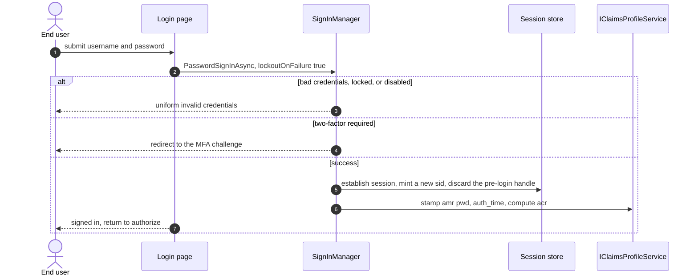
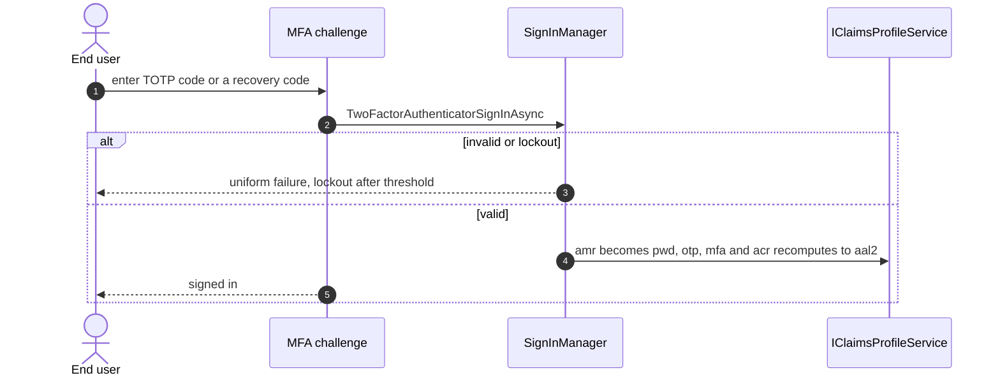
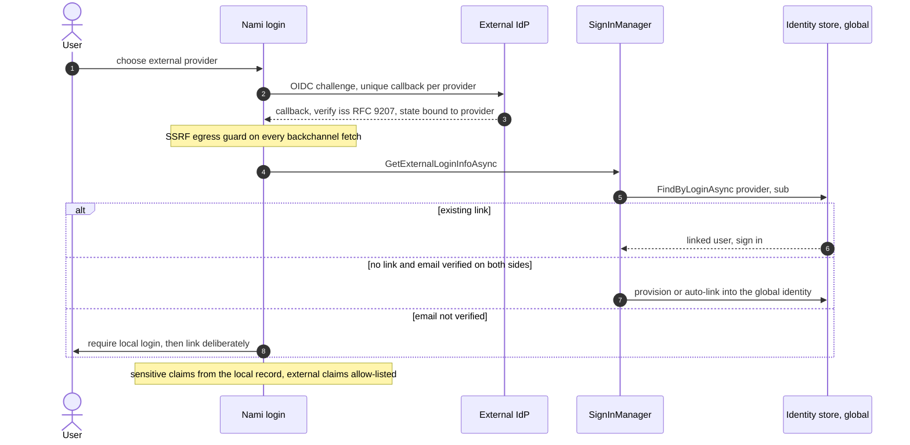
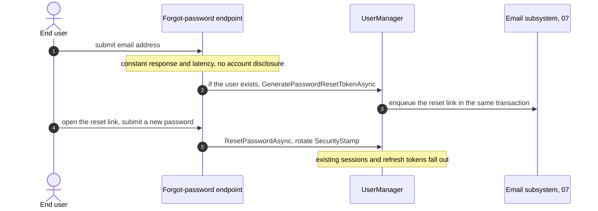
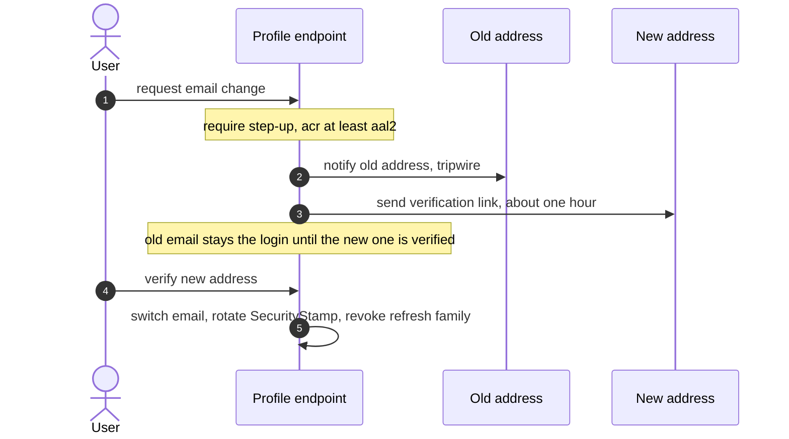
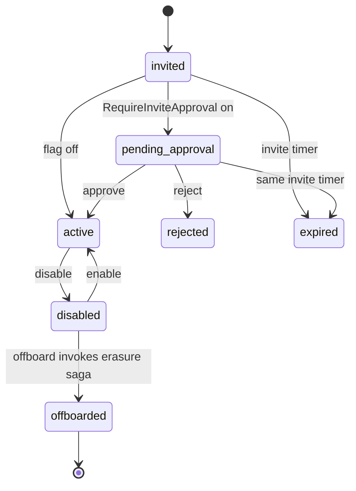

# User management and authentication (detailed design)

## Purpose and scope

The identity store and the human-authentication surface built on ASP.NET Core
Identity: the global user model, passkeys/WebAuthn and MFA, the assurance producer
(`acr`/`amr`/`auth_time`) and the canonical claims contract, server-side sessions,
handler-based external federation with anti-takeover linking, the credential
hardening baseline, self-service (including change-email hardening), and the user
lifecycle. It is Phase 04 and produces what the protocol engine (04) and
authorization (05) consume.

In scope: the Identity store, passkeys/MFA/assurance, sessions, federation, claims
production, credential hardening, self-service, and lifecycle. Out of scope: the
login/consent/logout UI pages (08), the step-up *enforcement* and dual-control (05),
the email subsystem mechanics (07), the erasure saga (13), and the schema (02, the
SSOT).

## Decisions realized

| Decision | What this design applies |
|---|---|
| ADR-0028 | Build on ASP.NET Core Identity; native passkeys with an attestation/AAL seam; lifecycle; credential-hardening baseline; `Nami.Identity.Users` |
| ADR-0013 | Produce `acr` (recomputed per token-request), `amr` (RFC 8176 array), `auth_time` (JSON number); step-up is enforced in 05 |
| ADR-0003 | Server-side session store (`ITicketStore`): `sid` lifecycle, inactivity 1h / absolute 8h, concurrent-session cap, revoke-denies-authorize/refresh |
| ADR-0002 | Handler-based external login into the global identity; `(provider, sub)` anti-takeover linking; external-claim allow-list; SSRF; RFC 9207 `iss` |
| ADR-0005 / ADR-0001 | One `IClaimsProfileService` choke-point (shared with 04); global identity, tenant via membership |
| ADR-0008 / ADR-0016 / ADR-0009 | Audit provenance on every lifecycle transition; offboard invokes the gated erasure saga; external secrets in the secret store |

## Component and interface design

### Store and model

`ApplicationUser : IdentityUser<Guid>` (UUIDv7 PK) is **global** (one human, one
identity); tenant belonging is a `Membership`, never a user-per-tenant (ADR-0001).
`AddIdentity<ApplicationUser, IdentityRole<Guid>>()` over the global
`IdentityDbContext` (02), with default token providers. OpenIddict owns the
protocol; Identity owns the user store entirely.

### The assurance producer and the claims contract

OpenIddict has no `IProfileService`, so a single `IClaimsProfileService` (the
choke-point shared with 04) is where session claims are produced: `acr` is
**recomputed per token-request** from `amr` plus session age, with the aal2 predicate
requiring `amr` to include `mfa`, `otp`, `hwk`, or `swk` (so a passkey-only login is
not mis-scored as aal1) and an aal2 freshness window of about 12 hours with 30-minute
inactivity (NIST), capped by the 8h absolute session ceiling (ADR-0013) so an aged
session downgrades; `amr` is stamped at sign-in, and `auth_time` is emitted as a JSON
number (the `long` overload, not a string). This is the canonical claims contract
(the SSOT other docs reference):

| Claim | Shape | Destination | Consumer |
|---|---|---|---|
| `memberships` | JSON array of `{tid, name?, roles?}`, capped ~10 with a `memberships_truncated` flag | id_token | tenant-switcher UI, integrators (full list via self-service when truncated) |
| `acr` | single string `urn:nami:aal1`/`aal2`/`aal3` (`0` = below-aal1, not for valuable resources) | id_token + access_token | step-up (05), Admin `AcrRequirement` |
| `amr` | JSON array (RFC 8176): `pwd`, `otp`, `mfa`, `hwk`, `swk` (never `passkey`; a federated login records the underlying factor) | id_token | informational (gate on `acr`+`auth_time`, not `amr`) |
| `auth_time` | JSON number | id_token + access_token | `max_age`/step-up freshness |
| `idp` | string: external scheme or `local` | id_token | RP and tenant/membership decisions |
| `sid` | string session id | id_token + `logout_token` | back-channel logout correlation |
| `tenant` | single string tenant id | access_token | resource-server tenant isolation |

`acr`/`auth_time` go to both tokens so a resource server can enforce RFC 9470;
`amr` can be absent on a silent refresh, so it is informational only. OpenIddict 7.5
does not emit `sid` natively, so `IClaimsProfileService` sets it explicitly to the
session `sid` (id_token destination); without it a relying party can only log out by
`sub`, killing all of the user's sessions.

### Passkeys and assurance level

Passkeys are native to .NET 10 (`SignInManager.MakePasskeyCreationOptionsAsync` /
`PerformPasskeyAttestationAsync` / `MakePasskeyRequestOptionsAsync` /
`PasskeySignInAsync`), but the endpoints are **not** auto-mapped and there is no
default attestation validation, and a passkey is a **primary** factor. Nami builds:
the passkey endpoints; an `IdentityPasskeyOptions` attestation policy; and an
**AAL seam** that persists `UserPasskeyInfo.Aaguid` and an `AttestationTrust` column,
with an `IAttestationValidator` port and an `AaguidAalPolicy` in `AssuranceOptions`.
**v1 ships attestation off, so every passkey is `aal2`** (the only honest tier when
attestation is unvalidated); the aal3 allow-list is empty, ready to enable
hardware-attested aal3 later as config plus an MDS adapter (`fido2-net-lib`, MIT). A
**backup-eligible (synced) credential is never aal3** (the rule keys off
`IsBackupEligible`, not `IsBackedUp`, so a credential that can sync is disqualified
before it has). Because a passkey is primary,
account recovery is designed in: before a user goes passkey-only there must be at
least one fallback (a second passkey, recovery codes, or a password); the last
recovery path cannot be removed; a lost-all-devices flow uses email-verified
recovery plus a forced step-up re-enroll and is never weaker than the factor it
replaces; every recovery step is rate-limited and audited, and admin-assisted
recovery is dual-control (05).

### MFA

TOTP plus 10 recovery codes are the baseline (native); passkeys ship in v1. `amr`
reflects the factors used; SMS/email OTP is roadmap (weakest factor).

### Server-side sessions (ADR-0003)

Sessions are core, not optional: an `ITicketStore` over PostgreSQL persists the
ticket and the cookie carries only a handle. Keyed by `sid`; inactivity 1h, absolute
8h; a re-validation interval of 1-2 minutes; a per-user `MaxConcurrentSessions` cap
(default ~5, per-tenant overridable) evicting the oldest on login; authorize and
refresh are denied when the session is revoked (revocation deletes the session row,
so row-absence is the revoked state the deny check tests). The interim
back-channel-logout emitter and the first-party-SPA BFF receiver (ADR-0019) build on
this store and consume the `sid`/`logout_token` contract, their fan-out owned by the
logout design (08). The `sid` is stable across passive
refresh and **rotated on step-up or re-authentication**. At primary auth
(anonymous to authenticated) a **new `sid` and a new ticket row are minted and the
pre-login session handle discarded** (session-fixation defense); an anonymous
session is never upgraded in place.

### Federation (external login, ADR-0002)

Handler-based ASP.NET Core external login (`AddMicrosoftAccount` /
`AddMicrosoftIdentityWebApp` / `AddOpenIdConnect`), provisioning or linking into the
**global** identity; the external IdP set is static and host-level in v1 (dynamic
per-tenant is v2, ADR-0034). Security requirements ship with the decision:
account-linking key is `(provider, sub)` and never an unverified email (auto-link
only when the email is verified on both sides); external claims pass an **allow-list**
and sensitive claims (`role`/`groups`/`email_verified`) always come from the local
record and membership; authority/discovery URLs and every backchannel fetch pass a
fail-closed **SSRF egress handler** (`SsrfEgressHandler` on `BackchannelHttpHandler`,
plus `PostConfigure` host allow-listing); each provider has a unique callback and the
authorization-response `iss` is verified (RFC 9207, which .NET 10 does not enforce
natively, so it is wired in `OnMessageReceived`) with the correlation state bound to
the provider scheme (mix-up defense); provider secrets live in the secret store
(ADR-0009), never plaintext.

### Credential hardening baseline (ADR-0028 §E)

The levers, in order of effect, are MFA/passkeys, a breached-password check, length
over complexity, strong hashing, then lockout — not complexity rules or rotation
(which NIST shows weaken passwords):

| Setting | Baseline | Why |
|---|---|---|
| `Password.RequiredLength` | 12 | length over complexity (NIST) |
| PBKDF2 `IterationCount` | >= 210000 | OWASP 2023 (Argon2id via a custom hasher optional) |
| `SecurityStampValidatorOptions.ValidationInterval` | 1-2 min | fast logout-everywhere (ADR-0003) |
| `SignIn.RequireConfirmedAccount` | true | anti-fake-account |
| `User.RequireUniqueEmail` | true | one email is one identity (ADR-0001) |
| Lockout | on-failure enabled, 5 attempts | the template defaults it off |
| Breached-password check | HIBP range API (k-anonymity), fail-open, prod-on | banned-password lever |
| Forced rotation | none | rotation weakens passwords (NIST) |

Complexity flags stay on as defense-in-depth backstop, not the primary lever. The
lockout-DoS mitigation and the risk-triggered challenge layer are ADR-0042.

### Self-service

Self-service (profile, email/phone, MFA/passkey/password, sessions, membership) uses
**custom endpoints, not `MapIdentityApi`**: `MapIdentityApi` exposes `/register`,
`/login`, and similar as a parallel JSON attack surface that bypasses the UI flow,
anti-enumeration, and the challenge layer. **Change-email is hardened** (the top
takeover surface): notify the old address (an informational tripwire with a support
CTA and no actionable token or link), require step-up (acr >= aal2)
before initiating, verify the new address before the switch takes effect (the old
email stays the login until then), and on completion rotate the `SecurityStamp` and
revoke the refresh-token family so existing sessions fall out.

### Lifecycle

`invited -> pending-approval -> active -> disabled -> offboarded`, with
disable-not-delete by default and offboard invokes the gated erasure saga (13,
dual-control and Art.17/DPO-gated, not automatic per offboard); every transition is
audited with provenance (ADR-0008). The `pending-approval` state is gated by
`CanSignInAsync` via a `Membership` status marker (approval is tenant-scoped even
though identity is global) and is enabled by a per-tenant `RequireInviteApproval`
flag; approval reuses the dual-control saga (05) as a constructive-action variant,
and the invite-expiry timer is reused (not a second clock).

### Patterns applied

Named per ADR-0066:

* **State machine** for the user lifecycle.
* **Strategy** for external auth handlers per provider and for `ComputeAcr`
  assurance tiers.
* **Single choke-point** for `IClaimsProfileService` (shared with 04).
* **Ports and Adapters** for `IAttestationValidator`, `IPasswordBreachCheck`,
  `IEmailDispatcher`, and `IAuditSink`.

### Libraries

ASP.NET Core Identity and native .NET 10 passkeys (MIT); the external-login handlers
(`Microsoft.Identity.Web` / `AddMicrosoftAccount` / `AddOpenIdConnect`, MIT); the
HIBP Pwned-Passwords range API (an external service, k-anonymity, fail-open); and, for
future hardware-attested aal3, `fido2-net-lib` (MIT) with the FIDO MDS. No commercial
dependency (ADR-0026).

## Data model

No new tables; this design uses `AspNetUsers`/roles/claims, `UserPasskeyInfo`
(`Aaguid`, `AttestationTrust`), `Memberships`, and `ServerSideSessions`, all in
[02-data](02-data.md). It adds one field to the tenant config in 02: a per-tenant
`RequireInviteApproval` boolean for the invite-approval gate.

## Runtime flows

### Interactive login

The backend authentication step (the protocol wrapper is 04's authorize flow): a
password sign-in, uniform failure, session establishment, and claim production.

### MFA (TOTP) sign-in

### External login with anti-takeover linking

### Password reset

The Identity side; the email delivery, anti-enumeration timing, and token lifespan
are the email subsystem (07).

### Change-email hardening

### Lifecycle states

## Edge cases and failure modes

* **Passkey lockout**: a passkey-only user who loses all devices is locked out
  unless a fallback exists; the last recovery path cannot be removed, and recovery is
  never weaker than the factor it replaces.
* **Account takeover via linking**: linking on an unverified email would allow
  takeover; the key is `(provider, sub)` and auto-link requires verified email on
  both sides.
* **`auth_time` serialization**: emitted as a JSON number (the `long` overload); a
  string violates OIDC.
* **`amr` on refresh**: may be absent on silent refresh, so resource servers gate on
  `acr`+`auth_time`, not `amr`.
* **Session fixation**: a pre-login session handle is never upgraded in place; a new
  `sid` is minted at primary auth.
* **`MapIdentityApi`**: not mapped, because it is a parallel attack surface bypassing
  anti-enumeration and the challenge layer.
* **HIBP outage**: the breach check is fail-open (a timeout or error allows the set),
  so a third-party outage never blocks sign-in.
* **Backup-eligible passkey**: a synced credential is never rated aal3.
* **Login-error uniformity**: lockout and disabled-account login failures return the
  same generic invalid-credentials response as a bad password (no locked/disabled
  oracle); the lockout notice is emailed, not shown (05).

## Security considerations

* MFA/passkeys are the top lever; the breached-password check and length beat
  complexity and rotation (ADR-0028).
* External trust is minimized: sensitive claims come from the local record, external
  claims are allow-listed, backchannel calls are SSRF-guarded, and `iss` is verified
  against mix-up (ADR-0002).
* Sessions are revocable server-side with enforced lifetimes; change-email rotates
  the security stamp and revokes refresh so a hijacked session cannot persist
  (ADR-0003, ADR-0028).
* Every lifecycle transition and recovery step is audited with provenance
  (ADR-0008); offboard invokes the gated erasure saga, which revokes live access
  first and preserves the audit hash-chain by crypto-shredding PII and appending a
  tombstone rather than deleting the row (13, ADR-0016).

## Testing strategy

* Passkey register/login end-to-end; removing the last fallback is blocked;
  lost-all-devices recovery forces re-enroll and is not weaker than the replaced
  factor.
* Anti-enumeration on `/forgotPassword` and resend (constant response and latency);
  no `MapIdentityApi` surface exists.
* External login: linking by `(provider, sub)`, rejection of unverified-email
  linking, external-claim allow-list, SSRF egress rejects private/link-local/metadata
  IPs, and `iss` mix-up rejection (the federation-security tests).
* Change-email: the four-branch test (notify-old, step-up-before-initiate,
  verify-new-before-switch, stamp-rotate-and-revoke).
* Assurance: `acr` recomputes and downgrades with session age; `amr` reflects the
  factors and never contains `passkey`; `auth_time` is a JSON number.
* Sessions: a revoked session is denied at authorize/refresh within one interval;
  session-fixation (the `sid` changes at primary auth); concurrent-session cap evicts
  the oldest.
* Lifecycle: invite/approve/disable/offboard transitions; offboard revokes sessions
  and tokens and invokes the gated erasure saga (dual-control, revoke-first, audit
  preserved).

## Open and build-time items

* The aal3 attestation thresholds and the AAGUID allow-list are a Security
  ratification item; v1 attestation is off (flat aal2).
* The credential-hardening thresholds (length 12, PBKDF2 >= 210000) and sending a
  hash prefix to HIBP are Security/DPO ratification items (ADR-0028).
* `RequireInviteApproval` is a v1, per-tenant decision; its field is threaded into
  the tenant config (02).
* The initial external-provider list is finalized during implementation (ADR-0002).
* The dynamic per-tenant external-IdP flow is a v2 feature (ADR-0034) designed
  separately, not in this v1 doc.

## References

* Architecture overview: [components](../architecture/04-components.md) (user
  management, sessions, external login), [runtime views](../architecture/06-runtime-views.md).
* Design: [02-data](02-data.md) (Identity, passkeys, sessions, membership schema),
  [04-core-protocol](04-core-protocol.md) (the claims choke-point and token issuance),
  [05-authorization](05-authorization.md) (step-up enforcement, dual-control),
  [03-audit](03-audit.md) (transition provenance).
* ADRs: 0028 (user management), 0013 (MFA/assurance producer), 0003 (sessions), 0002
  (federation), 0005 (claims choke-point), 0001 (global identity/membership), 0008
  (audit), 0016 (offboard/erasure), 0009 (secret store), 0042 (abuse/lockout).

---

[← Prev: Authorization and delegated admin](05-authorization.md) · [Index](README.md) · Next: Email and notification subsystem (07, planned)
