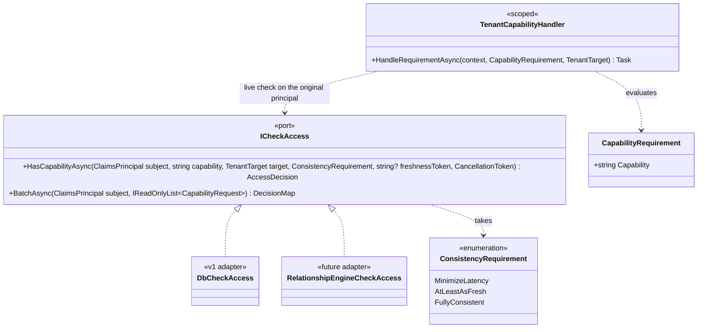
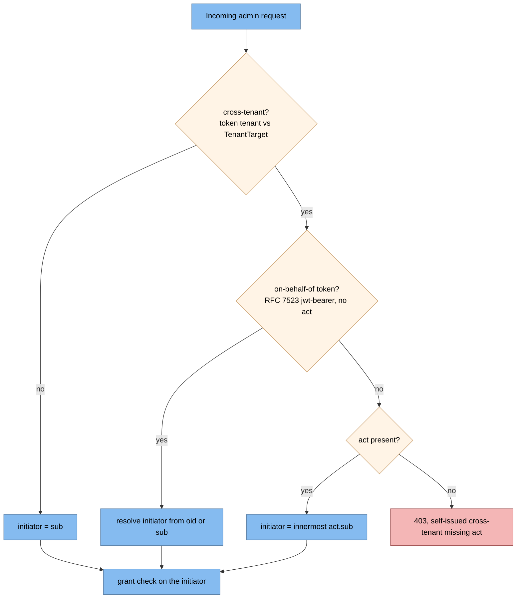
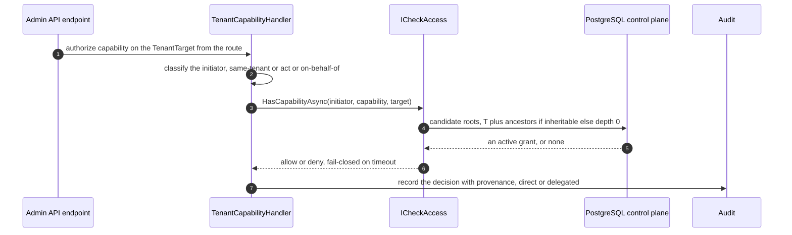
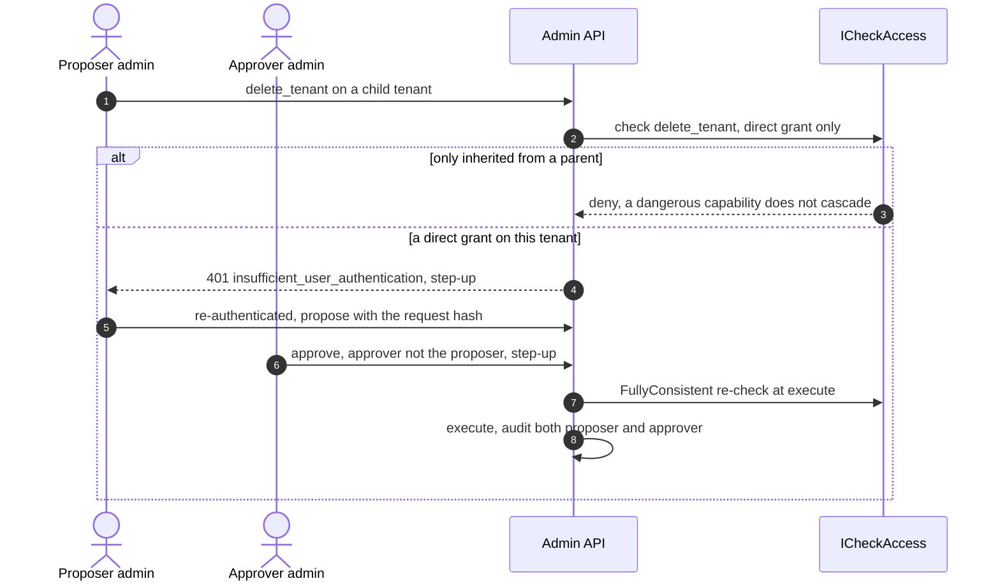
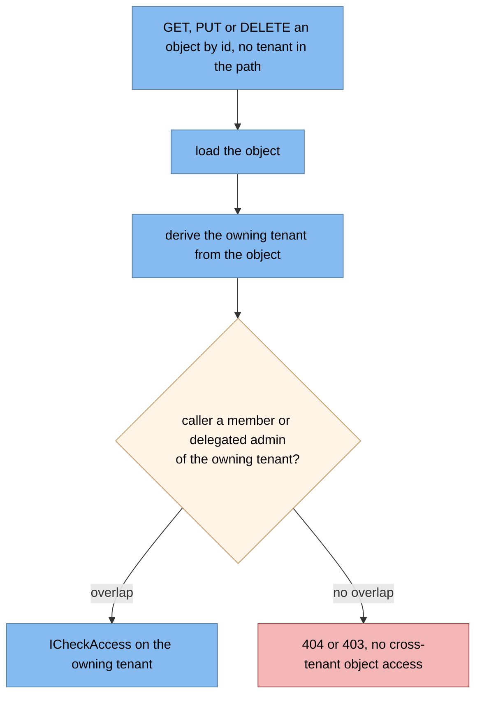

# Authorization and delegated administration (detailed design)

> **Sits under:** [architecture: component view](../architecture/08-component-view.md)
> (the authorization engine) and
> [security architecture](../architecture/13-security-architecture.md)
> (separation of duties and the confused-deputy defence).
> **Implementer source of record:** this document, for the authorization engine, the
> capability catalogue, the decision query, the enforcement types, and the delegation
> model. The schema is [02](02-data.md); the dual-control **saga** is
> [15](15-admin-api.md); the assurance claims this consumes are produced in
> [08](08-user-management.md); the audit **mechanism** is [03](03-audit.md), while the
> provenance **fields** are defined here.

Given a real person, a capability, and a target tenant, answer allow or deny.
Deny-by-default, evaluated live on **every** request.

The reason it is not simpler is delegated administration: a parent tenant acting on a
child must be **scoped to a subtree, capability-typed, time-bound, revocable, and
audited**, with no global super-admin and no automatic inheritance (ADR-0010). There is no
framework or product to copy this from, which raises the test bar rather than lowering it:
the negative tests are a production gate, not a nice-to-have.

## 1. Decisions realized

| Decision | What this design applies |
|---|---|
| ADR-0010 | Flat tenants with a parent link at the authorization layer; explicit membership; delegated admin as a scoped, capability-typed, time-bound, revocable grant; no global super-admin; dangerous capabilities never cascade |
| ADR-0047 | `ICheckAccess` as the one authorization port, with consistency in the contract and a database-first adapter now, a relationship engine later |
| ADR-0013 | Step-up assurance for sensitive capabilities, consuming `acr` and `auth_time` |
| ADR-0005 | Deny-by-default, which is what forces the fail-closed timeout |
| ADR-0008 | The audit provenance this design produces for every cross-tenant decision |
| ADR-0024 | The port as a real hexagonal boundary, not an interface added for layering |
| ADR-0001 | Global identity with per-tenant membership, and the tenant tree the closure walks |
| ADR-0021 | The relationship-engine APIs as a version-sensitive seam |
| ADR-0075 | The invariant a replacement adapter may not weaken |

## 2. Purpose and scope

In scope: the `ICheckAccess` contract and its consistency semantics, the capability
catalogue and forbidden cascade, the decision query, the ASP.NET enforcement types, the
delegation and initiator-classification model, the step-up and dual-control gating rule,
the authorization provenance fields, and the relationship-engine evolution seam.

Out of scope: putting the tenant and coarse roles **into** the token, which is
[04](04-core-protocol.md); producing `acr`, `amr`, and `auth_time`, which is
[08](08-user-management.md); emitting the `401` step-up challenge, which is
[04](04-core-protocol.md) and [15](15-admin-api.md); the dual-control **saga** with its
proposal aggregate and executor registry, which is [15](15-admin-api.md), while this
document says only which capabilities route through it; the audit chain mechanism, which
is [03](03-audit.md); the schema and the closure maintainer, which are [02](02-data.md)
and [18](18-tenant-lifecycle.md).

## 3. Interfaces and contract

There is exactly **one** authorization seam. The extensibility catalogue's conceptual
"relationship checker" is this same port under a different name, not a second abstraction.



* **`subject`** is the `ClaimsPrincipal` of the **original principal**, never a service
  identity. **`target`** is a `TenantTarget` passed **explicitly** from the route or body,
  and it differs from the caller's ambient tenant. `BatchAsync` exists to avoid N+1 on list
  screens.
* **`ConsistencyRequirement`** is in the contract so a later engine swap cannot silently
  reintroduce stale-after-revoke authorization. `MinimizeLatency` is the steady state;
  `AtLeastAsFresh` is at least as fresh as a supplied token; `FullyConsistent` bypasses any
  cache and is **mandatory on the check immediately after a revoke or grant write**. The
  database adapter satisfies all three because PostgreSQL reads are strong; a relationship
  engine maps them to its own minimize-latency, at-least-as-fresh-with-a-token, and
  fully-consistent modes, with no call site changing (ADR-0047).
* **Fail-closed**: an `AuthzCheckTimeout`, default 250 ms and tunable through
  `IOptionsMonitor`, returns `Deny` on timeout, forced by deny-by-default (ADR-0005). An
  `authz_check.duration` histogram and an `authz_check_timeouts` counter back the CI
  objective gate.
* **Caching**: per-request scoped memoization of `(subject, capability, tenant)`. A
  cross-request decision cache is load-test-optional and not a v1 gate; if added it carries
  its **own** invalidation rather than reusing the revocation-propagation channel, because
  revoke immediacy here is a direct strongly-consistent read and needs no backplane.

## 4. Data and structure

No new tables. This design reads and writes structures defined in [02](02-data.md):
`Memberships`, `DelegatedAdmin` and `DelegatedAdminCapabilities`, `CapabilityCatalog`,
`TenantClosure`, `AuditLog`, and `DualControlProposals`.

Two index shapes are load-bearing for the hot path and are defined with the schema: a
filtered covering index on the grant table keyed by grantee and expiry, including the root
and validity-start columns and excluding revoked rows; and a reverse closure index keyed by
descendant then ancestor, including depth, so the ancestor walk is an index-only read.

The **authorization provenance** written on every cross-tenant decision is this design's to
define, while the chain that protects it is [03](03-audit.md): `ActorSub`, the
`ActorChainJson` nested actor chain, `OnBehalfOfSubject`, `TargetTenantId`, `GrantId`,
`Capability`, `DecisionPath` (direct or delegated), `AuthzDecision` with its policy,
`Result`, `Acr`, `AuthTime`, `StepupSatisfied`, `ApprovalRequestId` with `ApproverSub`, and
`RequestHash`. The subject-bearing fields are ciphertext at write so the chain survives
crypto-shred (ADR-0016).

The capability taxonomy and its inheritance flags are seeded from the catalogue and are a
Security and DPO ratification item.

## 5. Behaviour

### 5.1 Token versus decision point

The 15-minute single-tenant access token carries the `tenant` claim and **coarse per-tenant
roles** (`member`, `tenant_admin`, `billing`, sourced from `Memberships.RolesJson`) plus the
client's scopes. That is enough for a gateway or resource-server check, and it is
standards-sanctioned: RFC 9068 section 2.2.3.1 defines the `roles` claim as a legitimate
part of a JWT access token.

**Delegated-admin capabilities are never baked into the token.** They are revocable and
subtree-scoped, so a claim would be stale the moment a grant is revoked and there would be
no way to withdraw it before expiry. They are checked **live at the Admin API** on every
request. This mirrors how mainstream cloud authorization works: a role assignment is
evaluated per request, and removing the assignment is what revokes access.

### 5.2 The capability catalogue and forbidden cascade

Two families, distinguished by one flag:

| Capability | Inheritable | Meaning |
|---|---|---|
| `manage_users`, `manage_clients`, `manage_scopes`, `view_audit`, `view_config` | yes, cascades down the subtree | routine tenant administration |
| `delete_tenant`, `data_export`, `iam_change`, `re_delegate` | **no**, direct grant only | dangerous or irreversible; additionally gated by step-up, and by dual-control on every action that **confers** privilege. Actions that only *reduce* privilege (revoking a grant, removing a membership) are step-up gated and single-actor, because they are the incident path |

**The v1 model is purely additive, so read ADR-0010's "inheritance only narrows" as an
outcome rather than a rule.** There is no scoped deny row and no parent-deny override: a
grant grants, and nothing subtracts. The narrowing intent is delivered by three other
mechanisms instead: least-privilege capabilities on each grant, `IsInheritable = false` for
the dangerous family, and the non-cascading `re_delegate` gate on grant management. Nothing
here may assume a child-cannot-exceed-parent ceiling is enforced, because it is not; a
scoped deny override belongs to the relationship-engine era (ADR-0010 states this
reconciliation at the decision level).

### 5.3 The decision query

"Does user X hold capability C on tenant T?" walks the ancestor chain for an active grant,
honouring the forbidden cascade.

```sql
-- params: :userId, :tenantId, :capability, :now
WITH cap AS (
  SELECT "IsInheritable" FROM "CapabilityCatalog" WHERE "Capability" = :capability
),
candidate_roots AS (              -- T plus ancestors; if NOT inheritable, only depth 0
  SELECT c."AncestorId"
  FROM "TenantClosure" c, cap
  WHERE c."DescendantId" = :tenantId
    AND (cap."IsInheritable" = TRUE OR c."Depth" = 0)
)
SELECT EXISTS (
  SELECT 1
  FROM "DelegatedAdmin" da
  JOIN "DelegatedAdminCapabilities" dac ON dac."GrantId" = da."GrantId"
  JOIN candidate_roots cr             ON cr."AncestorId" = da."RootTenantId"
  WHERE da."GranteeUserId" = :userId
    AND dac."Capability"   = :capability
    AND da."RevokedAt" IS NULL
    AND da."ValidFrom" <= :now
    AND (da."ExpiresAt" IS NULL OR da."ExpiresAt" > :now)
) AS allowed;
```

**`IsInheritable = TRUE OR Depth = 0` is the whole mechanism.** A dangerous capability
matches only a grant rooted at exactly T, never at an ancestor. Everything else in the
query is ordinary liveness: revoked, not-yet-valid, and expired grants are excluded. There
is no global super-admin, because every grant is anchored to a concrete `RootTenantId`.

Worked through, with `tenant-a` the parent of `tenant-b` and `tenant-c`, and one grant `g1`
to `ops` rooted at `tenant-a` carrying `[manage_users, view_audit]`:

| Subject | Capability | Target | Candidate roots | Result | Why |
|---|---|---|---|---|---|
| ops | `manage_users` | tenant-b | {tenant-b, **tenant-a**} | **allow** | inheritable, so the grant at the parent cascades |
| ops | `manage_users` | tenant-c | {tenant-c, **tenant-a**} | **allow** | the same, for the other child |
| ops | `delete_tenant` | tenant-b | {tenant-b} only | **deny** | not inheritable, so only a grant rooted exactly at tenant-b would match |
| ops | `delete_tenant` | tenant-a | {tenant-a} | **deny** | rooted correctly, but g1 does not carry the capability |
| ops | `manage_users` | tenant-b, after revoke | {tenant-b, tenant-a} | **deny** | the live check sees `RevokedAt`, with no propagation delay |

The last two rows are the ones worth remembering: the third shows the cascade being
refused where it would be dangerous, and the fifth shows why the check is live rather than
in the token.

### 5.4 ASP.NET Core enforcement

`CapabilityRequirement` plus a **scoped** `TenantCapabilityHandler` that authorizes the
original principal against `ICheckAccess`. **Scoped is an override**, not the default: the
framework's own guidance registers authorization handlers as singletons, and this one
cannot be, because it depends on the scoped `ICheckAccess` and the scoped tenant context.
Getting this wrong produces a handler that captures the first request's tenant.

A single **singleton** `IAuthorizationPolicyProvider` parses a `Capability:` policy-name
prefix, emitted by the developer-facing `[HasCapability("manage_users")]` attribute as
`Capability:manage_users`, and validates it against the catalogue: an unknown capability
yields 403, which closes an injection hole rather than inventing a policy. The
`DefaultAuthorizationPolicyProvider` remains the backup for the fixed role, assurance, and
actor policies. The framework caches the **compiled policy** by name, but the
deny-by-default decision stays in the scoped handler, so **no access decision is ever
cached**.

`TenantTarget` comes from the route or body and is passed explicitly; it is never assumed
equal to the ambient caller tenant.

A precondition to any capability check is **`RequireActor`**: the request must carry a real
user (a `sub` plus **`auth_time`**, on the `admin-api` audience; **never `amr`**, which is
id_token-only and therefore absent from the access token this policy reads). An app-only or
client-credentials token is rejected with 403 `admin_requires_actor`, so an application
permission can never exercise admin authority. It is paired with an issuance-time
invariant: no client-credentials client is ever granted the `admin-api` scope, so an
app-only token for the admin API cannot exist in the first place (policy detailed in
[15](15-admin-api.md)).

For **root-level id-routes** that carry an object id but no tenant segment
(`/applications/{id}`, `/users/{id}`, `/proposals/{id}`), the owning tenant is derived from
the loaded object before the check, which is the object-level filter that closes broken
object-level authorization. Because a user is global, such a route authorizes by the
overlap between the caller's tenant set and the object's owning tenant; when the loaded
object belongs to a user who is in no tenant, that overlap is empty and only a global
user-admin may act. It is the same seam with a different `TenantTarget` source.

The pipeline wires `UseMultiTenant()` before authentication and authorization, so the
tenant is resolved before any check runs.

### 5.5 Delegation and initiator classification

Authority is the **server-side grant check on the real initiator** (CWE-441), never a
service identity. The `act` claim (RFC 8693) is an identity and audit carrier, not
authority, and `may_act` is deliberately **not** issued: it would be exactly the stale,
un-revocable authority this model rejects. RFC 8693 permits authorizing delegation by other
means, and the grant is that means.

Classification comes **first**, because an unconditional "no `act`, therefore forbid" would
reject both a legitimate same-tenant call and a valid on-behalf-of token that never carries
`act`.



A self-issued cross-tenant token from Nami always carries `act`; its absence there is
anomalous and is rejected with 403. **Falling back to `sub` would authorize the wrong
principal**, because in a delegation token `sub` is the *target*, not the administrator. An
upstream on-behalf-of token uses the `jwt-bearer` grant (RFC 7523) and never carries `act`,
since it expresses delegation through `sub` and `azp`; it is a first-class
no-`act`-available path resolved through the mapped identifier plus the same grant check,
not a 403. A client-supplied acting-for value is never trusted.

Emitting `act` is Nami's own code in the token-exchange handler, since the engine validates
only the parameter syntax; it is a build-interim seam with a decommission marker (ADR-0021,
registered in [22](22-openiddict-seam-catalogue.md)).



### 5.6 Consistency and immediate revoke

Revoke immediacy is a **strongly consistent live read**, not a propagation channel. A
revoke is a direct database write, and because PostgreSQL reads are strong the v1 adapter
satisfies it without a backplane. The rule: **every check immediately after a revoke or
grant write uses `FullyConsistent`**, and is never served from a cache. This is the
"new enemy" problem: after a write, the next check must be strongly consistent, or a
revoked administrator keeps acting for as long as the cache lives.

### 5.7 Step-up and dual-control for dangerous capabilities

Dangerous or high-assurance operations return `401` with
`WWW-Authenticate: ... error="insufficient_user_authentication", acr_values, max_age`
(RFC 9470). The required assurance is `max(client default, scope, runtime)` and is consumed
from the `acr` and `auth_time` produced in [08](08-user-management.md). Where the upstream
is an enterprise provider, the equivalent challenge is an insufficient-claims error with a
claims parameter and its authentication-context values.

A fixed catalogue of destructive or irreversible actions additionally requires
**dual-control**: `delete-application`, `delete-scope`, `delete-tenant`, `suspend-tenant`
and `resume-tenant`, `offboard-user`, `revoke-all-tokens`, a dangerous delegated-admin
grant, `secret-revoke`, key purge, and a bulk `audit-export` (full or unfiltered, a range
over 90 days, or over 10k rows; a small export goes direct but is still audited). A
proposer creates an approval bound to a `request_hash` over the capability, target, and
parameters; a different principal approves, itself step-up gated, single-use and time-boxed
against that hash; then the action executes. A constructive variant, `approve-user-invite`,
reuses the same four-eyes saga, gated per tenant by `RequireInviteApproval`.

**Issuing or revoking a delegated-admin grant is itself gated**: both require `re_delegate`
held **directly** on the root tenant. That is the anti-escalation gate which makes
`re_delegate` meaningful, because without it a delegated administrator could mint sub-grants
and quietly widen their own reach.

**Dual-control applies to issuing and deliberately not to revoking** (ADR-0010). Two eyes
exist to stop authority being *manufactured*; revoke only *destroys* authority, so the same
control applied there buys nothing and costs the one thing an incident cannot spare. A
two-person revoke means **no single responder can cut off a delegated admin whose account is
compromised**, and worse, an attacker sitting on a hijacked admin session could refuse to
approve their own removal. Revoke is still **step-up gated**, which is the distinction worth
holding: dual-control costs a second *person*, step-up costs the responder *seconds*.
Dropping step-up as well would turn a safety control into an attack tool.

The saga aggregate lives in [02](02-data.md) and its workflow and executor registry in
[15](15-admin-api.md). This design owns the decision and the gating rule.



### 5.8 Object-level authorization for id-routes



### 5.9 The relationship-engine evolution seam

The database model maps cleanly onto a relationship engine, which is what makes the port
credible rather than aspirational. An inheritable capability becomes a relation with a
**parent arrow**, roughly `manage_users: [user] or manage_users from parent`, so it cascades
structurally. A dangerous capability becomes a relation with **no parent arrow**, roughly
`delete_tenant: [user]`, so it **cannot** inherit no matter how the tree is shaped.

That is the elegant part: the `IsInheritable` flag stops being data and becomes the
presence or absence of the arrow, so the forbidden cascade is enforced by the schema rather
than by a query condition. Time-bounding and revocation map to the engine's conditions or
caveats, or to deleting the tuple. Those APIs are version-dependent and are re-verified on
every engine bump (ADR-0021).

## 6. Dependencies and wiring

```csharp
services.AddScoped<ICheckAccess, DbCheckAccess>();          // swappable, contract unchanged
services.AddScoped<IAuthorizationHandler, TenantCapabilityHandler>();   // scoped, not singleton
services.AddSingleton<IAuthorizationPolicyProvider, CapabilityPolicyProvider>();
// UseMultiTenant() runs before UseAuthentication() and UseAuthorization().
```

| Configuration key | Purpose | Default |
|---|---|---|
| `Nami:Authorization:CheckTimeoutMs` | The fail-closed budget for one check | `250` |
| `Nami:Authorization:DecisionCacheEnabled` | The optional cross-request cache, off in v1 | `false` |

No new third-party dependency in v1: ASP.NET Core authorization plus the persistence stack
of [02](02-data.md). The future relationship engines are a swappable adapter, both under
permissive licences, and their consistency APIs are a version-dependent seam (ADR-0021).

> **Patterns applied** (ADR-0066). **Ports and Adapters** for `ICheckAccess`, which meets
> the two-reasons bar of ADR-0024 comfortably: there is a real engine swap in view and a
> genuine boundary. **Strategy** for the consistency-to-adapter mapping. **Specification**
> for `CapabilityRequirement` and its catalogue check. **Closure Table** for ancestor
> lookup, defined in [02](02-data.md).

## 7. Error handling, edge cases, invariants

* **Deny-by-default everywhere.** An unknown capability yields 403, never a silent allow.
* **Fail-closed on timeout.** A check exceeding the budget returns `Deny`.
* **No global super-admin and no automatic inheritance.** Every grant anchors to a concrete
  root, and dangerous capabilities never cascade.
* **Grant management is gated** on `re_delegate` held directly. Dual-control on **issuing**
  only; **revoking** is single-actor and step-up gated, so one responder can cut off a
  compromised delegated admin (ADR-0010).
* **Confused deputy**: a self-issued cross-tenant token missing `act` is rejected with 403
  and **never** falls back to `sub`, which in a delegation token is the target. An
  on-behalf-of token legitimately has no `act` and is resolved through the mapped
  identifier, not rejected.
* **No client-supplied subject or acting-for value** is ever trusted.
* **`FullyConsistent` immediately after a revoke or grant write.**
* **`TenantTarget` is explicit**, never assumed equal to the ambient tenant.
* **Registration mistakes are the quiet ones**: the handler must be scoped, since a
  singleton captures the first request's tenant context; the policy provider must cache the
  compiled policy but never a decision; and the admin tenant-scope filter's
  set-tenant-context side effect must be rehomed before it is retired, because it also
  configures the tenant for downstream manager calls ([15](15-admin-api.md)).

## 8. Security and multi-tenancy notes

Deny-by-default, server-side, evaluated per request. Grants are least-privilege,
time-bound, and revocable, and there is no global super-admin (ADR-0010).

**Delegation is not impersonation.** The administrator's identity stays distinct, carried
by `act`, so every cross-tenant action is attributable to a real person rather than to a
service. That is what makes the provenance record meaningful.

Dangerous and irreversible capabilities require a direct grant, plus dual-control, plus
step-up. Approvals are single-use and bound to a request hash, so an approval cannot be
replayed onto a different action.

Consistency is in the contract, so a later engine swap cannot reintroduce
stale-after-revoke authorization (ADR-0047). And the port carries a security invariant a
replacement adapter may not weaken (ADR-0075): deny-by-default, consistency-carrying, and
no decision cached behind the port.

## 9. Testing

There is no reference implementation to lean on here, so the **negative** tests are the
production gate:

* a cross-tenant check denies; the forbidden cascade holds, so a parent administrator
  cannot `delete_tenant` a child; an expired or revoked grant denies immediately;
* a check immediately after a revoke, run `FullyConsistent`, denies with no stale hit; a
  timed-out check denies;
* an unknown capability yields 403;
* confused deputy: self-issued cross-tenant missing `act` gives 403; an on-behalf-of token
  with no `act` and a valid grant is allowed; a same-tenant call with no `act` is allowed
  with the initiator taken from `sub`;
* dual-control: a proposer cannot self-approve, and step-up is enforced on dangerous
  capabilities;
* an app-only token is rejected by `RequireActor`, and a root-level id-route authorizes
  against the loaded object's owning tenant, so a caller cannot act on an object outside
  its tenant set;
* the worked example of section 5.3 is a test table in its own right: the same five rows,
  asserted;
* a CI gate asserts the database-tier objective (p95 under 30 ms, p99 under 80 ms; the
  future engine tier is p95 under 50 ms, p99 under 150 ms) and a timeout rate below 0.001.
  The single seam is exercised by both the token and the admin paths.

## 10. Open and build-time items

* The final capability catalogue, the inheritance flags, and the forbidden-cascade list are
  a Security and DPO ratification item (ADR-0010).
* The per-capability required assurance, the dual-control approver roles, and audit
  retention and signing are Security and DPO items.
* The authorization objective numbers and the 250 ms timeout are interim, pending Ops and
  Security ratification (ADR-0047).
* Relationship-engine adoption timing is deferred; its condition and consistency APIs are a
  version-dependent seam (ADR-0021).
* Whether to use an `act` token or an on-behalf-of exchange is provider-dependent and a
  Security and DPO item.
* Performance: a shallow tenant tree reduces ancestor hops, and the closure ancestor set is
  cached and invalidated only on a tenant reshape.
* `act` emission carries a decommission marker if the engine ships it natively.

## 11. Sources

* **ADRs:** 0010 (the delegated-admin policy, including the narrows-in-effect
  reconciliation), 0047 (the engine and the port), 0013 (step-up), 0005 (deny-by-default),
  0008 (audit provenance), 0024 (the port as a real boundary), 0075 (the invariant a
  replacement may not weaken), 0001 (tenancy), 0021 (the engine version seam), 0016 (why
  the provenance fields are ciphertext at write).
* **Architecture:** [component view](../architecture/08-component-view.md),
  [security architecture](../architecture/13-security-architecture.md),
  [runtime flow views](../architecture/09-runtime-flow-views.md).
* **Design:** [02](02-data.md) (the schema, the covering indexes, and the closure
  maintainer), [04](04-core-protocol.md) (roles and `act` in the token),
  [03](03-audit.md) (the chain that protects the provenance), [08](08-user-management.md)
  (the assurance producer), [15](15-admin-api.md) (the dual-control saga and the actor
  policy), [18](18-tenant-lifecycle.md) (tree mutation and closure maintenance),
  [22](22-openiddict-seam-catalogue.md) (the `act` seam).
* **Standards:** RFC 9068 section 2.2.3.1 (the roles claim in a JWT access token), RFC 8693
  (delegation rather than impersonation, and `act` as identity rather than authority), RFC
  7523 (the on-behalf-of grant that carries no `act`), RFC 9470 (the step-up challenge),
  CWE-441 (the confused deputy).
* Reconciled against the design corpus's authorization design and its root document on
  2026-07-27, through the corpus's five-part bundle including both decision trees. Three
  things were adopted: the decision query as SQL with its worked example, which turns a
  described rule into a testable one; the standards basis for coarse roles in the token; and
  the relationship-engine relation shapes, where the inheritance flag becomes the presence
  or absence of a parent arrow. The corpus decision states inheritance as "only narrows,
  parent deny wins"; ADR-0010 here already records that v1 is purely additive and that the
  narrowing is an outcome of three other mechanisms, so this document follows ours.

---

[Prev: Sender-constrained tokens](06-sender-constrained-tokens.md) · [Index](README.md) · Next: [User management and authentication](08-user-management.md)
