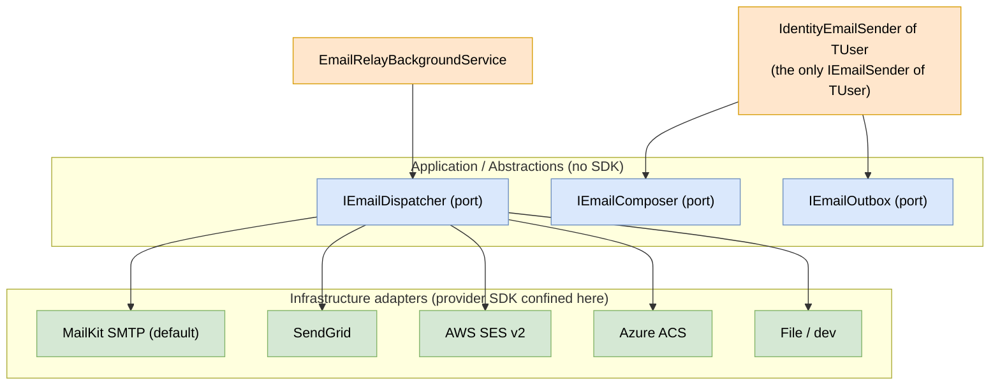
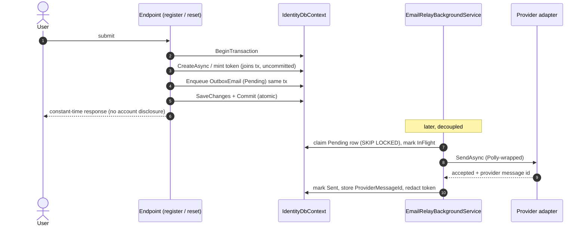
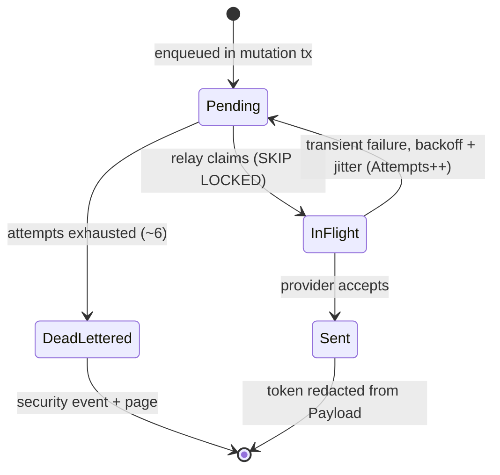
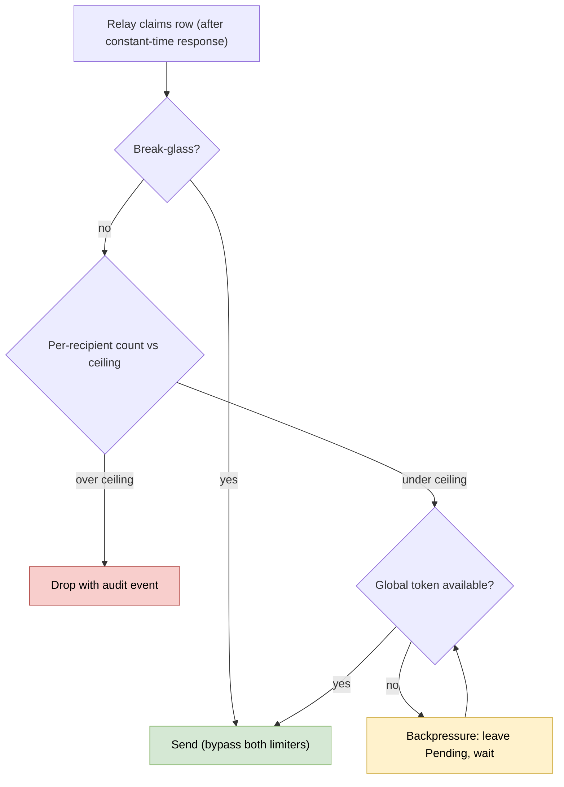
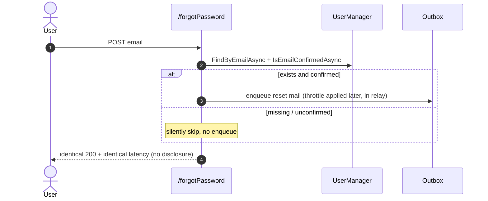
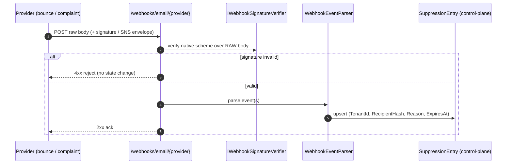

# Email and notification subsystem (detailed design)

## Purpose and scope

Transactional mail is the one delivery path the whole product depends on and the
cross-doc audit (A04) flagged as the single real design hole: account confirmation,
password reset, MFA-related mail, change-email tripwires, and the break-glass alert
all flow through it. Because sign-in sets `SignIn.RequireConfirmedAccount = true`
(the SSOT is 06 / the hardening baseline), the framework default (a no-op sender that
renders the link to the browser) means **nobody can log in** until a real sender
exists. This design replaces the one-line placeholder task in the user-management
plan ("SMTP/SendGrid abstraction") with the full subsystem: a cloud-agnostic port and
adapters, a transactional outbox that is the reliability chassis other subsystems
reuse, anti-abuse throttling, anti-enumeration, templating/i18n, and bounce/complaint
suppression.

In scope: the `IEmailSender<TUser>` shim, the `IEmailDispatcher` port and its provider
adapters, the transactional outbox and relay (the shared at-least-once chassis),
two-tier throttling, anti-enumeration on the reset/resend endpoints, templating and
i18n, bounce/complaint suppression and webhook ingestion, per-purpose token lifespans,
and the delivery slice of change-email.

Out of scope: the schema (02 is the SSOT for `OutboxEmail` and `SuppressionEntry`; this
doc references it and owns behavior only), the change-email *flow and policy* (06), the
step-up *enforcement* that gates change-email (05), the audit sink internals (03), and
the reset/confirm UI pages (08).

## Decisions realized

| Decision | What this design applies |
|---|---|
| ADR-0038 | The owning decision: `IEmailSender<TUser>` shim to a cloud-agnostic `IEmailDispatcher`; transactional outbox with an at-least-once relay; two-tier throttle; anti-enumeration; suppression; per-purpose token lifespans |
| ADR-0006 / ADR-0009 | Cloud-agnostic port with a DB-default adapter; provider secrets resolve through the existing `ISecretResolver`, never plaintext config |
| ADR-0008 | Dead-letter and other email security events go on the `ISecurityEventSink` audit lane (append-only, hash-chained, delivery-guaranteed) |
| ADR-0022 | Operational detail goes on the `ILogger` + OpenTelemetry diagnostic lane with PII redaction; the two lanes are never mixed |
| ADR-0024 | Ports in `Nami.Identity.Abstractions`, relay/compose logic in core, provider SDKs confined to adapter packages; ArchUnitNET-enforced |
| ADR-0013 | Change-email requires step-up (`acr` >= aal2) before initiate; enforced at the 06/endpoint layer, the composer is invoked only after the gate |
| ADR-0040 | Polly `AddStandardResilienceHandler` on every provider call; the email anti-abuse throttle is the one deliberate fail-closed carve-out |
| ADR-0015 | The break-glass alert email is the most-critical at-least-once flow and uses a priority lane that bypasses both limiters |
| ADR-0042 / ADR-0038 | Throttle numbers are interim (owner: Product), tracked on the Pre-GA checklist |
| ADR-0021 | The version-sensitive Identity/provider contracts are re-verified at each .NET/OpenIddict bump via the seam catalogue |
| ADR-0028 / ADR-0037 | Consumed through `.AddUsers(...)` as a swappable port; the outbox/suppression DDL is realized on PostgreSQL |

## Framework facts this design is built on (verified .NET 10)

| Fact | Consequence |
|---|---|
| Two different interfaces exist: the legacy `IEmailSender` (one method, called only by scaffolded Razor) and `IEmailSender<TUser>` (8.0+, three methods, called by Identity infrastructure for confirm/reset) | Implement `IEmailSender<TUser>` as the integration point (it carries `TUser`, so branding/i18n can key off tenant and locale); implementing only the legacy one means confirm/reset never send |
| `IEmailSender<TUser>` exposes `SendConfirmationLinkAsync`, `SendPasswordResetCodeAsync`, `SendPasswordResetLinkAsync`; we do not map `MapIdentityApi` on the authorization-server host (decision recorded in 06 / user-management) | Reset uses the **link-style** path with a self-minted token; the `MapIdentityApi` reset-code path does not exist on this host |
| The default (no sender registered) is a no-op that renders the link to the browser (test only) | A real adapter is mandatory; `DisplayConfirmAccountLink = false` in production |
| Tokens come from `DataProtectorTokenProvider`; `DataProtectionTokenProviderOptions.TokenLifespan` defaults to one day | One day is too long for a security flow; subclass per purpose (below), never change the global default |
| Data-protection tokens contain `+`, `/`, `=` that corrupt in a URL | `WebEncoders.Base64UrlEncode` on mint and `Base64UrlDecode` on consume; this is the most common "invalid token" bug |
| Tokens are not intrinsically single-use; they are invalidated when the `SecurityStamp` changes | Keep the default security-stamp behavior; a successful reset rotates the stamp, killing outstanding tokens |
| `System.Net.Mail.SmtpClient` is not recommended by Microsoft ("use MailKit or other libraries instead") | The SMTP adapter uses MailKit |

## Component and interface design

### Two-layer port and adapter

The Application/abstractions layer owns a cloud-agnostic port; the shim that Identity
calls composes a message and enqueues it, and never sends inline.

```csharp
// Nami.Identity.Abstractions (no provider SDK)
public sealed record EmailMessage(
    string ToAddress, string? ToDisplayName, string Subject,
    string HtmlBody, string PlainTextBody, string TemplateId,
    IReadOnlyDictionary<string, string> Metadata, // tenant, flow, correlationId
    string IdempotencyKey);

public interface IEmailDispatcher { Task<EmailSendResult> SendAsync(EmailMessage m, CancellationToken ct); }

// Infrastructure: the single IEmailSender<TUser> - composes + enqueues, never sends inline
public sealed class IdentityEmailSender<TUser>(IEmailComposer composer, IEmailOutbox outbox)
    : IEmailSender<TUser> where TUser : class
{
    public Task SendConfirmationLinkAsync(TUser u, string email, string link)
        => Enqueue(EmailFlow.Confirmation, u, email, link);
    public Task SendPasswordResetCodeAsync(TUser u, string email, string code)
        => Enqueue(EmailFlow.PasswordResetCode, u, email, code);
    public Task SendPasswordResetLinkAsync(TUser u, string email, string link)
        => Enqueue(EmailFlow.PasswordResetLink, u, email, link);

    private async Task Enqueue(EmailFlow f, TUser u, string email, string token)
    {
        var msg = await composer.ComposeAsync(f, u, email, token);
        await outbox.EnqueueAsync(msg); // same DbContext transaction as the user mutation
    }
}
```

`IEmailDispatcher` was already declared for this phase in the foundations ports catalog
(01). Its siblings introduced here are `IEmailComposer` (template resolution and
render), `IEmailOutbox` (transactional enqueue), and the webhook ports
`IWebhookSignatureVerifier` and `IWebhookEventParser`; all live in
`Nami.Identity.Abstractions`. Secret material (SMTP credentials, provider API keys,
webhook-signing secrets) resolves through the **existing** `ISecretResolver` (01,
ADR-0009), never plaintext config; this design declares no new secret port.



### Provider adapters and configuration

The adapter is chosen by `Nami:Email:Provider` (env `Nami__Email__Provider`),
mirroring the `Cloud:Provider` selector shape whose SSOT is the foundations config
layer (01 §1.14, `Database` default). Configuration binds a static section; production
values that change at runtime are managed through admin surfaces, not redeploys.

```jsonc
"Nami": { "Email": {
  "Provider": "Smtp",
  "FromAddress": "no-reply@auth.example",
  "FromDisplayName": "Nami Identity",
  "Smtp": { "Host": "...", "Port": 587, "UseStartTls": true },        // creds via ISecretResolver
  "SendGrid": { "ApiKeySecretRef": "kv://email/sendgrid-key" },
  "Ses": { "Region": "eu-north-1" },
  "Acs": { "ConnectionStringSecretRef": "kv://email/acs-conn" }
}}
```

| Provider | Package (license) | Call shape | Note |
|---|---|---|---|
| SMTP (MailKit) | `MailKit` (MIT) | `ConnectAsync(host, port, StartTls)` then `AuthenticateAsync` then `SendAsync(MimeMessage)` | Default / on-premises |
| SendGrid | `SendGrid` (MIT) | `new SendGridClient(apiKey)` then `SendEmailAsync`; `SetClickTracking(false, false)` | Click-tracking off for security links |
| AWS SES v2 | `AWSSDK.SimpleEmailV2` (Apache-2.0) | `SendEmailAsync(SendEmailRequest)` | Use v2; credentials via IAM role |
| Azure ACS | `Azure.Communication.Email` (MIT) | `SendAsync(WaitUntil.Started, ...)` then poll `UpdateStatusAsync` | Non-blocking plus outbox poll |
| Dev / File | none | write `.eml` to a pickup dir / log | CI and local; no real cloud |

Adapters live in the phase-later packages named in the foundations package graph
(`Nami.Identity.Email.Smtp` / `.SendGrid` / `.Ses` / `.Acs`, under the
`Nami.Identity.*` root). No cloud SDK type leaks into the Application layer (the SOLID
layering rule); this is ArchUnitNET-enforced (ADR-0024). All packages above are
permissive (MIT / Apache-2.0 / BSD-class) per ADR-0026; none is commercial or
copyleft. The templating engine (Fluid, MIT, or Scriban, BSD-2) and the resilience
libraries (Polly, BSD-3; `System.Threading.RateLimiting`, MIT) are likewise permissive.

### Patterns applied (ADR-0066)

**Transactional Outbox** (atomic enqueue plus at-least-once relay), **Adapter** (per
provider and per webhook scheme), **Strategy** (provider selection via config),
**Ports and Adapters** (the cloud-agnostic seam), and a thin **Humble Object** (the
`IdentityEmailSender<TUser>` shim holds no logic beyond compose-and-enqueue).

## Data touchpoints (schema is 02)

This design references two tables defined at design fidelity in the data-tier doc (02,
the schema SSOT) and realized on PostgreSQL (ADR-0037); it does not redefine columns or
types.

- **`OutboxEmail`** has **two homes**: one in `IdentityDbContext` (global, for
  confirm/reset) and one in `ControlPlaneDbContext` (which adds a `TenantId` column
  under FORCE RLS, for break-glass alert, admin/proposal, and invite mail). Key
  columns: `IdempotencyKey` (unique, prevents double-send), `Status`
  (`Pending`/`InFlight`/`Sent`/`DeadLettered`), `Attempts`, `NextAttemptAt`, `Payload`,
  `ProviderMessageId`. The index `(Status, NextAttemptAt)` backs the relay claim via
  `SKIP LOCKED`.
- **`SuppressionEntry`** (control-plane, tenant-columned) stores `RecipientHash`
  (`bytea`, hash only, never the address, DP.01), `Reason`, `ExpiresAt`, indexed
  `(TenantId, RecipientHash)`.

Both tenant-columned tables use the `TenantId = NULLIF(current_setting('app.current_tenant', true), '')::uuid`
RLS predicate form (02): an unset GUC then fails closed rather than crashing with a
`22P02` cast error, so the relay's per-tenant iteration must set the ambient tenant and
GUC before touching the control-plane copies. The same outbox shape is reused by a
second consumer, back-channel `logout_token` delivery (`LogoutDeliveryOutbox`, 04),
which stores delivery *intent* rather than a payload; that table is defined in 02 and
owned by the revocation-propagation design, not here.

## Reliability: transactional outbox and relay

Two failure modes must be designed out: **send-before-commit** (the confirmation goes
out, then registration rolls back) and **lost-after-commit** (the user commits, then
the process crashes before the mail is sent, so the account can never confirm). Both
are eliminated by writing an `OutboxEmail` row in the *same* database transaction as the
user mutation, and sending from a background relay afterward.

The subtle part is that Identity's own `IEmailSender<TUser>` callback cannot provide
this. `UserManager.CreateAsync` / `ResetPasswordAsync` call `SaveChangesAsync`
internally and Identity invokes the sender only *after* the method returns, so an
enqueue inside that callback lands in a **later** transaction, which is exactly the
lost-after-commit case. Critical flows therefore own the transaction boundary
explicitly and bypass the auto-email callback:

```csharp
await using var tx = await identityDb.Database.BeginTransactionAsync(ct);
var r = await userManager.CreateAsync(user, password);   // internal SaveChanges joins the ambient tx (uncommitted)
if (!r.Succeeded) return; // tx disposes -> rollback, no orphan user, no mail
var token = await userManager.GenerateEmailConfirmationTokenAsync(user);
outbox.Enqueue(BuildConfirmEmail(user, token));          // OutboxEmail row on the same DbContext
await identityDb.SaveChangesAsync(ct);                   // user + outbox in one SaveChanges
await tx.CommitAsync(ct);                                // atomic: both commit or both roll back
```

Because the Identity shim is wired to `IdentityDbContext`, mail emitted from the
**control plane** (break-glass alert, admin/proposal such as the terminal
`Failed(target_changed)` proposal notification, and invites) cannot get same-transaction
atomicity through it. The outbox therefore has its second home in `ControlPlaneDbContext`
with a direct `IEmailDispatcher.EnqueueAsync` path on the control-plane transaction, and
**one** `EmailRelayBackgroundService` polls both tables.

The relay:

- **Claims** a pending row with optimistic concurrency (`SKIP LOCKED`), so two relay
  instances never double-send.
- **Retries** transient failures (5xx, throttling, network) with exponential backoff
  plus jitter, capped at about six attempts, using `NextAttemptAt`.
- Wraps every outbound provider call in Polly `AddStandardResilienceHandler` (a single
  handler: total timeout ~30s, per-attempt ~10s, retry with jitter, circuit breaker;
  retries disabled for non-idempotent verbs) per ADR-0040.
- **Dead-letters** a row that exhausts the cap into `DeadLettered`, emits a security
  event on the audit lane, and pages. A dead-lettered break-glass alert is a security
  incident.
- **Redacts** the live token from the `Payload` once the row reaches `Sent`, and stores
  the `ProviderMessageId` for correlation.

The break-glass alert runs on a **priority lane** (sync-with-fallback) so it is never
stuck behind a confirmation backlog, and it bypasses both throttle limiters. It is
enqueued on the control-plane transaction, consistent with the break-glass ordering in
06 where `audit.RecordSuccessAndAlert()` runs, fail-closed, *before* `SignInAsync`.





## Throttle and anti-abuse

Two limiters with different breach behavior, plus a deliberate fail-closed carve-out.

- **Per-recipient (anti-abuse, may deny).** A rolling-window cap: interim defaults of
  five security-emails per recipient per hour, a sub-cap of three password-resets per
  hour, and a hard ceiling of ten. Up to the ceiling the relay enqueues-with-delay;
  past it, it **drops with an audit event**. The counter is persisted (a Redis
  sorted-set, or an outbox row-count) so it survives restarts, keyed on `recipientHash`
  only (tenant-agnostic, because identity is global). **This limiter runs in the relay,
  on the dequeued row, after the constant-time HTTP response has already returned** - it
  is never applied synchronously before enqueue at the endpoint, because that would
  reintroduce a timing oracle and violate the anti-enumeration invariant below.
- **Global (reputation/quota, lossless).** A standalone
  `System.Threading.RateLimiting.TokenBucketRateLimiter` sized to about 80% of the
  adapter's provider quota. A breach applies `AcquireAsync` backpressure (wait, leave
  the row `Pending`); it never drops. Default-on, disable-able per adapter.
- **Redis fail-closed carve-out.** The per-recipient cap is a *security* control and is
  never "cap disabled" on a Redis outage - the single deliberate exception to the
  otherwise fail-open Redis-as-accelerator posture (ADR-0040 / 11 §6.9). On a Redis
  outage it degrades to a per-instance in-process bucket plus an outbox-row-count
  counter; the cap stays enforced, accepting per-instance inaccuracy rather than
  switching it off.
- The break-glass alert bypasses both limiters.

The throttle numbers are interim (owner: Product) and tracked on the Pre-GA checklist
(ADR-0042 / ADR-0038).



## Anti-enumeration and endpoints

`/forgotPassword` and `/resendConfirmationEmail` **always return the same response with
the same latency** whether or not the account exists or is confirmed: the handler runs
`FindByEmailAsync` plus `IsEmailConfirmedAsync`, silently skips on failure, and never
branches the HTTP result or the timing ("do not reveal that the user does not exist").
An endpoint rate limiter keys on IP plus email-hash. A **latency-invariance test is a
mandatory, permanent acceptance criterion**; it is what keeps the per-recipient throttle
from creeping back to the endpoint. These are net-new custom minimal endpoints (they
are not OIDC endpoints in the endpoint catalogue, and `MapIdentityApi` is deliberately
not mapped on this host); the webhook route `/webhooks/email/{provider}` is likewise a
custom minimal endpoint.



## Templating, i18n, and deliverability

`IEmailComposer` resolves a template by `(flow, tenant, culture)` from `TUser` and
renders **both** an HTML body and a plain-text body (multipart/alternative). The engine
is a sandboxed one (Fluid or Scriban, implementation-open) - never Razor for
tenant-editable templates, which would execute C#. Per-tenant branding (from-address,
logo) comes from the tenant registry with a global fallback.

Two fallback chains keep rendering total:

- **String i18n:** requested culture (for example `nb-NO`) then neutral culture (`nb`)
  then the default `en` floor; never throw, warn once on a missing key. Reuse
  `IStringLocalizer` / `ResourceManager` fallback.
- **Template resolution:** `(flow, tenant, culture)` then tenant-override-any-culture
  then global-template-that-culture then global `en`. `en` is the hard floor that
  always renders.

Target locales are configuration-driven (for example `en`, `nb-NO`, `nl`, `vi`), not
hard-coded. Deliverability: SPF/DKIM/DMARC on a dedicated sending subdomain (for example
`auth.<domain>`), click-tracking off for security links, and HTTPS absolute links to the
canonical domain.

## Bounce and complaint suppression, and webhooks

A canonical `SuppressionEntry` store (control-plane, tenant-columned, 02) is checked
immediately before dispatch: a lookup on `(TenantId, RecipientHash)` filtered by
`ExpiresAt`, right before `SendAsync`. Provider-native suppression lists are
deliberately **not** used - SES account-wide lists leak across tenants (violating the
tenant-isolation decision), SMTP and File have none, and the sync API would sit in the
hot path.

Suppression is populated from provider webhooks at `/webhooks/email/{provider}`. Each
provider's native signature scheme is verified over the **raw** request body through the
`IWebhookSignatureVerifier` / `IWebhookEventParser` ports with a per-provider adapter; a
generic HMAC middleware is rejected because it is cryptographically impossible across
the three schemes without disabling native auth on a public endpoint.

| Provider | Verification |
|---|---|
| AWS SES via SNS | SigV2 SHA256 over the canonical string, host-pinned HTTPS `SigningCertURL` plus certificate-chain validation, auto-confirm subscription; prefer the AWS SDK built-in validator over hand-rolling |
| SendGrid | ECDSA/SHA256 over `(timestamp + raw body)` via the official (MIT) `RequestValidator`, rejecting timestamp skew; the curve is taken from the helper source, not assumed |
| Azure Event Grid / ACS | No HMAC scheme, so a high-entropy URL secret (constant-time compare) plus optional Entra bearer; handle `SubscriptionValidationEvent` and the CloudEvents OPTIONS handshake |

TTL rules: a permanent reason (hard bounce, complaint) sets `ExpiresAt` NULL and is
cleared only by an audited admin action; a soft/transient reason carries a TTL
(interim default 72h) with a sweeper. Events correlate back to sent mail via
`ProviderMessageId`. Whether the recipient is stored as a hash or encrypted, and the
soft-bounce TTL, are DPO-gated (DP.01) and tracked on the Pre-GA checklist; the interim
baseline is hash-only.



## Per-purpose token lifespans

A subclassed `DataProtectorTokenProvider` per purpose - confirmation ~4h, password-reset
~1h, change-email ~1h - registered through
`config.Tokens.EmailConfirmationTokenProvider` / `PasswordResetTokenProvider`; the global
one-day default is left unchanged. Tokens are `Base64Url`-encoded on mint and decoded on
consume, and are invalidated by `SecurityStamp` rotation (they are not intrinsically
single-use).

## Change-email: the delivery slice

The change-email flow, policy, and its four-branch test are owned by the user-management
design (06): step-up (`acr` >= aal2) before initiate, verify the new address before the
switch takes effect, and on completion rotate the `SecurityStamp` (so the 1-2 minute
`ValidationInterval` forces re-login) and revoke the refresh-token family. This subsystem
owns only the *delivery* mechanics of two of those obligations:

- **Notify the old address on request** via a dedicated `EmailFlow.EmailChangeNotifyOld`
  template - a tripwire carrying a "contact support if this was not you" call to action
  and **no token or actionable link** (so it cannot itself become a phishing template) -
  routed through the outbox like any security mail.
- **Verify the new address before the switch** via a ~1h change-email token sent to the
  new address; the old address remains the login until verification completes.

The step-up gate (b) is enforced at the 06/endpoint layer, and the composer is invoked
only after it passes; the `SecurityStamp` rotation and refresh revocation (c) happen in
06. This doc coordinates with, and does not duplicate, that flow.

## Security considerations

- **No secret logging (hard rule).** Never log the token, link, or body; log only the
  recipient hash, flow, tenant, correlation/idempotency id, provider message id, and
  status. The outbox `Payload` holds a live token, so it is redacted from the row once
  `Sent`.
- **Two lanes, never mixed.** Email security events (dead-letter, throttle drop,
  break-glass alert failure) go on the `ISecurityEventSink` audit lane (append-only,
  hash-chained, delivery-guaranteed; ADR-0008). Operational detail goes on the
  `ILogger` plus OpenTelemetry diagnostic lane with PII redaction via
  `Microsoft.Extensions.Telemetry` / `Microsoft.Extensions.Compliance.Redaction`
  (ADR-0022). The two are joined only by a
  correlation/trace id.
- **Anti-enumeration** and the relay-side throttle placement (above) are security
  invariants, not conveniences; both carry mandatory tests.
- **Webhook endpoints** are public and unauthenticated at the network edge, so signature
  verification over the raw body is the only trust boundary; an invalid signature changes
  no state.
- **Verify-before-build (ADR-0021).** The `IEmailSender<TUser>` contract,
  `DataProtectionTokenProviderOptions`, and each provider's request builder are
  version-sensitive; they are re-verified at each .NET / OpenIddict bump through the seam
  catalogue and the contract-regression suite.

### Audit events

The audit catalog (03) has no email-specific events yet. This design **reuses** the
existing generic events where they fit (`break_glass` for the break-glass alert path,
`degraded_mode_enabled` for the Redis fail-closed degrade, `mass_revoke` where relevant)
and proposes a **minimal** net-new set - `email_dead_letter`, `email_send_suppressed`,
and `email_throttle_drop` (snake_case, matching the catalog convention). Per the design
decision rule these are raised as a proposed addition to the ADR-0008 catalog and flagged
in Open items, not settled inside this feature doc; the audit minimum-catalog line on the
Pre-GA checklist (ADR-0008) is where they land.

## Testing strategy

- **Outbox atomicity:** a rolled-back user mutation leaves no outbox row (no orphan
  user with no mail); a committed one leaves exactly one; two concurrent relays never
  double-send (idempotency-key + `SKIP LOCKED`).
- **Latency invariance:** `/forgotPassword` and `/resendConfirmationEmail` return
  identical response and timing for existing/confirmed, existing/unconfirmed, and
  missing accounts - a permanent invariant.
- **Throttle under Redis outage:** the per-recipient cap stays enforced per-instance
  when Redis is down (never "cap disabled").
- **Webhook signature verification:** each provider adapter accepts a genuine signed
  payload and rejects a tampered body, a bad signature, and (SendGrid) a skewed
  timestamp.
- **i18n fallback:** a missing key falls through to the `en` floor and warns once; a
  missing tenant template falls through to the global template.
- **Token hygiene:** `Base64Url` round-trip on mint/consume; a rotated `SecurityStamp`
  invalidates an outstanding token; per-purpose lifespans (confirm 4h, reset 1h).
- **Break-glass lane:** the alert is not starved behind a confirmation backlog and
  bypasses both limiters.

## Open and build-time items

- **Proposed audit events** (`email_dead_letter`, `email_send_suppressed`,
  `email_throttle_drop`) - raise as an addition to the ADR-0008 catalog; tracked under
  the audit minimum-catalog Pre-GA line.
- **Throttle numbers** (per-recipient 5/hr, sub-cap 3, ceiling 10) and the Redis
  fail-closed deviation - interim (Nam, 2026-07-04), await Product ratification
  (Pre-GA checklist, ADR-0042 / ADR-0038).
- **Suppression** hash-versus-encrypt and soft-bounce TTL (72h) plus complaint
  auto-expiry - interim hash-only baseline, await DPO ratification (DP.01; Pre-GA
  checklist, ADR-0038).
- **Ops / DNS:** SPF/DKIM/DMARC on the sending subdomain; provider account and quota.
- **Same-transaction outbox** remains a named implementation-time code spike to validate
  the transaction-boundary mechanism with running code (per the architecture-grading
  bucket).
- **Verify-before-build:** re-verify the version-sensitive Identity/provider contracts at
  each .NET / OpenIddict bump (ADR-0021).

## References

- ADR-0038 (email/notification subsystem), ADR-0006 / ADR-0009 (cloud-agnostic port,
  `ISecretResolver`), ADR-0008 (audit sink), ADR-0022 (diagnostic lane), ADR-0024
  (hexagonal ports), ADR-0013 (step-up), ADR-0021 (verify-before-build), ADR-0040
  (resilience and the fail-closed carve-out), ADR-0015 (break-glass alert), ADR-0042
  (abuse/throttle numbers), ADR-0028 / ADR-0037 (packaging, PostgreSQL DDL).
- Design docs: [02 data tier](02-data.md) (schema SSOT for `OutboxEmail` /
  `SuppressionEntry`), [03 audit](03-audit.md) (two lanes, security events), [06 user
  management](06-user-management.md) (change-email flow, `RequireConfirmedAccount`), [01
  foundations](01-foundations.md) (ports catalog, `Cloud:Provider` selector, package
  graph).
- [Architecture](../architecture/README.md): components view (email subsystem),
  runtime view 8 (transactional email outbox).
- [Pre-GA ratification checklist](../PRE-GA-RATIFICATION-CHECKLIST.md) (throttle numbers;
  suppression hash/TTL; audit minimum catalog).
