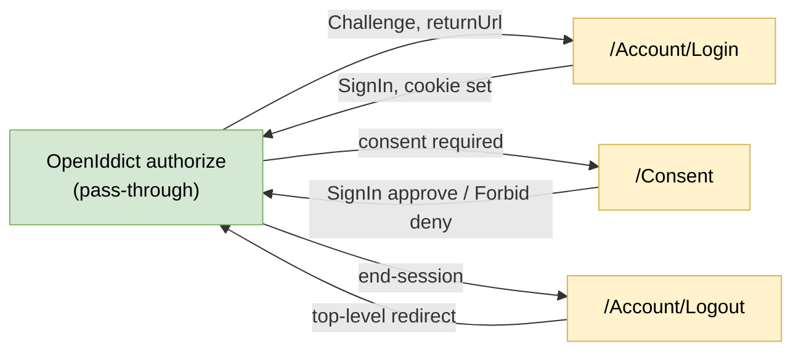
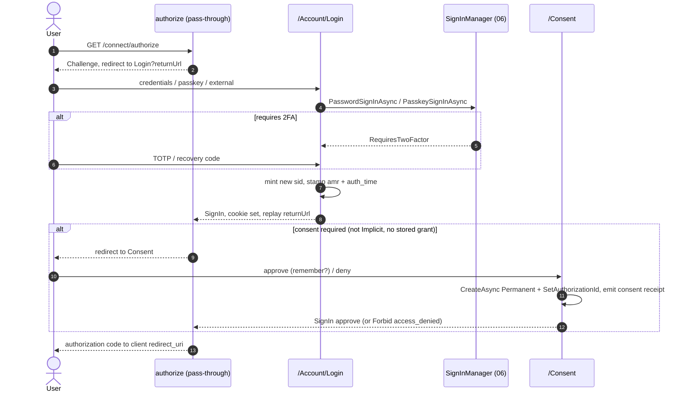
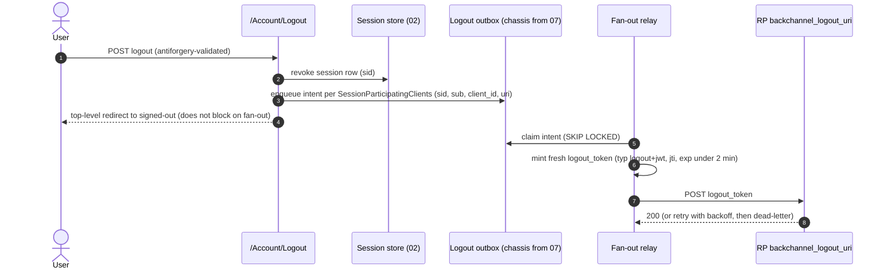
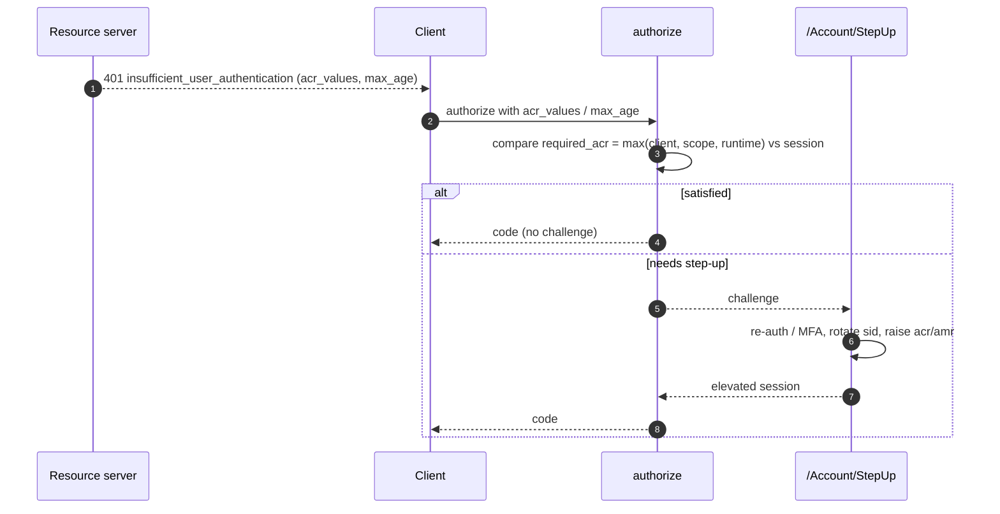
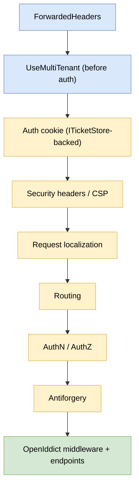

# Login, consent, and logout UI (detailed design)

## Purpose and scope

The human-facing surface of the authorization server: a complete set of Razor Pages
(login, consent, logout, passkeys, account management, error) decoupled from the
OpenIddict engine by a thin interaction service, plus the cross-cutting UI concerns that
protect every page (security headers, antiforgery, cookie pinning, open-redirect guard,
theming, localization). OpenIddict ships no UI and, unlike the commercial engines, no
interaction-service abstraction, so this layer is what makes the product turnkey.

This design owns the **presentation** layer and one piece of runtime behavior that is
naturally UI-initiated: the single-logout fan-out. It deliberately defers the machinery
it renders:

- **Protocol** (authorize / consent / end-session pass-through, `prompt=none` errors,
  single-token revocation) to the core protocol server (04).
- **Auth backend** (the `SignInManager` / `UserManager` calls, server-side sessions,
  external federation, the claims contract, the change-email flow and policy) to user
  management (06).
- **Email landing pages** (reset / confirm anti-enumeration timing, per-purpose token
  lifespans, the `en`-floor i18n chain) to the email subsystem (07).
- **Audit** to (03), **step-up enforcement and dual-control** to (05), and the **schema**
  (`TenantBranding`, `ServerSideSessions`, the OpenIddict `Application`) to (02, the SSOT).

In scope: the interaction service, the page catalog, consent/grants UI, the single-logout
fan-out, the tenant switcher, the step-up challenge page, the external-login / passkey /
MFA / account-management pages, the error-state inventory, security-headers/CSP wiring,
antiforgery, the cookie matrix, the open-redirect guard, theming and the OSS override
seam, and localization. The UI lives inside the `Nami.Identity` reference host (a
dedicated UI assembly would be a future ADR); the admin console is a separate app (04 /
ADR-0020) and is out of scope here.

## Decisions realized

| Decision | What this design applies |
|---|---|
| ADR-0019 | Single logout: front-channel iframe dropped (dead); end-session and tenant-switch are top-level redirects; interim back-channel `logout_token` fan-out; first-party SPAs delegate logout to the BFF |
| ADR-0004 | Persistent consent as a permanent OpenIddict `Authorization` (no expiry); silent `prompt=none` renew; the grants page is the sole revoke path |
| ADR-0003 | Server-side sessions keyed by `sid`; `sid` rotates on step-up; a new `sid` is minted at primary auth (fixation defense); revoke denies authorize/refresh |
| ADR-0001 | Tenant-aware UI resolved by host/path; the tenant switcher reads `memberships` and switches via silent `prompt=none`; access tokens are single-tenant |
| ADR-0002 | Handler-based external login into the global identity; `(provider, sub)` anti-takeover linking; deny-by-default external-claim allow-list; unique callback + `iss` + SSRF guard |
| ADR-0013 | Step-up challenge page triggered by `acr_values`/`max_age`/`prompt`; `required_acr = max(client, scope, runtime)`; UI renders the challenge, 05 enforces |
| ADR-0028 | Passkeys as v1 core (enroll/list/remove); self-service via custom endpoints, never `MapIdentityApi`; credential-hardening surfaced in copy |
| ADR-0029 / ADR-0043 | The UI's server-rendered antiforgery profile is distinct from the BFF's CSRF profile; the core-cookie-attributes invariant with a startup self-check |
| ADR-0053 / ADR-0008 | A hash-chained consent receipt on grant and `consent.revoked` on revoke; branding changes are an `admin_config_change` security event |
| ADR-0042 / ADR-0038 | Risk-triggered `IChallengeProvider` on login/reset/device/signup (off in Development); per-IP plus per-account lockout; constant-time anti-enumeration |
| ADR-0027 / ADR-0062 | OSS theming override seam (config / view-override / theme folder); OWASP ASVS 5.0 L2 baseline with each test tagged to its requirement id |

## Component and interface design

### The interaction service

OpenIddict has no engine-to-UI bridge (there is no `IIdentityServerInteractionService`
equivalent). The UI builds a thin `IInteractionService` over
`HttpContext.GetOpenIddictServerRequest()`, `IOpenIddictApplicationManager`, and
`IOpenIddictScopeManager`: it reads the current OIDC request, resolves the client and
scope display metadata, and turns a page decision back into an engine result. Consent is
a **round-trip to the pass-through authorize endpoint** (the original request parameters
are carried to `/Consent` and back), not a callback. The authorize controller's
`Challenge()` redirects an unauthenticated request to `/Account/Login?returnUrl=<the full
original request>`, and the login page round-trips that `returnUrl`.

### Page catalog

The five v1 core pages are Login, Passkeys, Logout, Consent, and Home/Error; the rest
round out parity. There is no API-Resource / Identity-Resource concept in the UI
(OpenIddict has none); the consent screen shows scopes only.

| Page | Core v1 | Owns / renders | Backend |
|---|---|---|---|
| Account/Login | yes | credentials, passkey button, external buttons, tenant branding | 06 |
| Account/Passkeys | yes | enroll / list / remove (WebAuthn) | 06 |
| Account/Logout | yes | end-session + single-logout fan-out | 04 / this doc |
| Consent | yes | client branding, scope list, remember, approve/deny | 04 |
| Home/Error | yes | workflow error surface | 04 |
| Account/Create + ConfirmEmail | | register + confirm landing | 06 / 07 |
| Account/Forgot + ResetPassword | | reset request + landing | 07 |
| Account/Manage (family) | | TOTP, recovery codes, password, email, profile | 06 |
| Account/ExternalLogin | | callback + anti-takeover linking | 06 |
| Account/StepUp | | re-auth / MFA challenge | 05 / 06 |
| Account/AccessDenied | | authenticated-but-unauthorized | 04 |
| Tenant/Switcher | | membership list, silent switch | 04 / 06 |
| Grants | | view / revoke persistent consent | 04 |
| Device | | device-code user entry | 11 |

CIBA is de-scoped (ADR-0014); the device page is kept.

### Login

The login page is tenant-aware: tenant is resolved by host/path (never a claim, ADR-0001)
and the page renders that tenant's branding and context. It carries the five login-form
parity behaviors (R17): a remember-me checkbox mapped to `AuthenticationProperties.IsPersistent`
(gated by `AllowRememberLogin`); a Cancel button that returns `access_denied` to the
client via the authorize controller's `Forbid()` (not a redirect home); a single generic
invalid-credentials message that discloses no field (anti-enumeration); an
`EnableLocalLogin` toggle with external-only auto-redirect (local off plus exactly one
external provider redirects straight through); and a client display ("sign in to
«AppName»") from `IOpenIddictApplicationManager.FindByClientIdAsync` then
`GetDisplayNameAsync`, with the external-provider list from `IAuthenticationSchemeProvider`.

Two backend contracts the page must honor (owned by 06): sign-in stamps `amr` via
`SignInWithClaimsAsync(user, isPersistent, [amr=pwd/otp/mfa])` with `auth_time` from
`IssuedUtc`; and at the anonymous-to-authenticated primary auth the page mints a **new
`sid`** and a new ticket-store row, discarding the pre-login session key (session-fixation
defense). The external-button enumeration is the single v1-to-v2 touch point for dynamic
per-tenant IdPs: v1 shows the static host-level set, and when v2 lands exactly one
call-site routes through `IExternalProviderQuery.GetForTenantAsync` (the seam is
deliberately not planted in v1, doc 32 / ADR-0034).

### Consent and grants

The consent controller switches on `GetConsentTypeAsync`: `Implicit` (first-party)
auto-consents silently; `External` with no stored authorization returns
`Forbid(ConsentRequired)`; otherwise the screen renders. Approve builds a `ClaimsIdentity`,
sets scopes/resources/destinations, and `SignIn`s under the OpenIddict server scheme;
deny or cancel returns `Forbid` with `access_denied` to the client. When the user ticks
remember, the page persists a permanent authorization via
`IOpenIddictAuthorizationManager.CreateAsync(identity, subject, clientId,
AuthorizationTypes.Permanent, scopes)` and then calls `identity.SetAuthorizationId(...)`
(load-bearing: family-revoke and entry validation key on it). The silent-renew and
grants-list lookups use `FindAsync(subject, client, Statuses.Valid,
AuthorizationTypes.Permanent, request.GetScopes())` (not `FindBySubjectAsync`); the scope
filter is what forces re-consent on scope expansion. The don't-remember branch creates no
permanent authorization and issues an ad-hoc grant for the current request only.

Consent has **no expiry** (OpenIddict permanent authorizations never expire; there is no
per-client `ConsentLifetime`), so the grants page (`TryRevokeAsync`) is the only removal
path; this is an accepted decision, revisited only if a security/DPO policy later requires
periodic re-consent. On grant the page emits a hash-chained **consent receipt** through
the audit sink (subject, client, tenant, scope set, purpose, legal basis, policy-version
hash, timestamp, locale, method) and `consent.revoked` on revoke (ADR-0053 §F); the
receipt schema and consent-policy-version governance are owned by the data-subject-rights
design (13) and its ADR, referenced here, not defined here.

Client branding on the consent (and login) screen reads the client display name from the
native `DisplayName` descriptor field and the `logo_uri` / `client_uri` from
`Application.Properties` (the same JSON-dict mechanism used for `cors_origins`, doc 03 /
13); no new client column is introduced, and the exact read path is confirmed against 02.
The logo URL is validated https-only with a mixed-content / SSRF guard on render. Scope
display metadata (DisplayName, Description, Emphasize, Required, Checked) comes from
`IOpenIddictScopeManager`, grouped identity-versus-api.

### Logout and single logout

Front-channel iframe logout is dropped as a dead dependency (third-party-cookie blocking,
V11); end-session is a top-level redirect. The logout page invokes the backend (cookie
sign-out, OIDC end-session, server-side session revoke) and initiates the **back-channel
fan-out**, which this design owns. The fan-out reuses the shared outbox chassis from the
email design (07): it stores delivery *intent* (`sid`, `sub`, `client_id`, `backchannel_logout_uri`)
over the `SessionParticipatingClients` rows, mints a fresh `logout_token` on each send
(`typ=logout+jwt`, the `backchannel-logout` events member, `sub` and/or `sid`, `iat`,
`jti` replay guard, no `nonce`, `exp` under about two minutes), claims with `SKIP LOCKED`,
retries with backoff (attempt cap about five, total about ten minutes), and dead-letters.
Interactive logout never blocks on the fan-out.

"Log out everywhere" maps to the built `RevokeBySubjectAsync` (owned by 06 / revocation
propagation 10) plus session revocation, never the single-token `/connect/revoke` endpoint.
Force-logout is a ticket-store row removal, effective on the next request on any node with
the 1-2 minute validation-interval backstop. First-party SPAs delegate logout to the BFF,
which receives the back-channel token (BFF details out of scope). Post-v1 logout
extensibility (upstream notification, custom redirect writer, login/logout context) is
deferred.

### Tenant switcher, step-up, external login, passkeys, MFA, and account management

The **tenant switcher** reads `memberships` (and `memberships_truncated`) from the
`id_token`, calling the self-service full-list endpoint (06 / 29) when truncated; a switch
is a silent `prompt=none` authorize round trip as a top-level redirect (never an iframe),
with no password prompt, and access tokens stay single-tenant.

The **step-up** page is triggered when an API returns `401
insufficient_user_authentication` with `acr_values` / `max_age` (RFC 9470); the authorize
endpoint checks these against the session and re-challenges, a `prompt=none` that cannot
satisfy the requirement returns `login_required`, and the `sid` rotates on step-up. The
required level is `max(client DefaultAcr, scope RequiredAcr, runtime request)`; the UI
renders the challenge, 05 enforces the threshold.

**External login** uses handler-based ASP.NET Core Identity external login
(`GetExternalLoginInfoAsync` then `ExternalLoginSignInAsync`, or create plus
`AddLoginAsync`), provisioning into the global identity. Linking keys on `(provider, sub)`
and never on an unverified email: auto-link only when the email is verified on both sides,
otherwise the user signs in locally and links deliberately. External claims pass a
deny-by-default allow-list; role, groups, and `email_verified` always come from the local
record. Each provider has a unique callback path, `iss` is verified (RFC 9207), correlation
is bound to the scheme, a fail-closed SSRF guard rejects cross-host redirects, and the
`idp` claim is set explicitly. The friendly failure page for a remote error / correlation
failure / user cancellation is error-state E3.

**Passkeys** are v1 core: enroll/list/remove, with a passkey as a primary factor.
Registration is `MakePasskeyCreationOptionsAsync` then `navigator.credentials.create` then
`PerformPasskeyAttestationAsync` then `AddOrUpdatePasskeyAsync`; sign-in is
`MakePasskeyRequestOptionsAsync` then `navigator.credentials.get` then
`PasskeySignInAsync`. The endpoints are not auto-mapped, so the UI hand-maps
`/account/passkey/*` with antiforgery and HTTPS, list/remove read `UserPasskeyInfo`, and
there is no default attestation validation (the attestation policy is a GA gate). The `amr`
is `hwk` or `swk`, never the string "passkey".

The **MFA** page runs the `PasswordSignInAsync` then `RequiresTwoFactor` branch and calls
`TwoFactorAuthenticatorSignInAsync(code, isPersistent, rememberClient)`, surfacing **two
distinct checkboxes** (remember-me = `isPersistent`, remember-this-machine =
`rememberClient`) plus a "use a recovery code" fallback
(`TwoFactorRecoveryCodeSignInAsync`). The **Account/Manage** family covers TOTP enroll (QR
from the `otpauth://` provisioning URI then `VerifyTwoFactorTokenAsync` then
`SetTwoFactorEnabledAsync`), recovery codes (`GenerateNewTwoFactorRecoveryCodesAsync`,
display-once, regenerate), change-password, change-email, and profile edit. Change-email
enforces the four-branch hardening whose flow is owned by 06 (step-up before initiate,
notify the old address with a no-token tripwire, verify the new address before the switch,
rotate the security stamp on completion); the UI enforces the branches and defers the
flow. Self-service uses custom endpoints; `MapIdentityApi` is deliberately not mapped.

The **reset / confirm** pages preserve the constant-time anti-enumeration contract owned
by 07, Base64Url-decode the token, land on the per-purpose lifespans (reset about 1h), and
render explicit success versus expired/invalid states with a request-new link.

### Key libraries and patterns

Razor Pages on ASP.NET Core (the established quickstart idiom for this style of
server-rendered identity UI; Blazor is a later option). Bootstrap 5 is the default CSS framework (CSS-variable driven so the CSP stays
strict, no npm/Tailwind build step; Tailwind is a later option). `IStringLocalizer` /
`.resx` for localization, `RequestLocalizationMiddleware` for culture resolution, and the
built-in antiforgery and data-protection stacks. All are part of ASP.NET Core or
permissive (MIT/Apache-2.0/BSD) per ADR-0026.

Patterns applied (ADR-0066): **Humble Object / pass-through controller** (the interaction
service holds no protocol logic), **Strategy** (`ConsentType` handling, `IChallengeProvider`,
external-provider selection), **Adapter** (external IdP handlers), **Template Method** (the
Razor view-override theming seam), and deny-by-default (returnUrl and scope validation).

## Data touchpoints (schema is 02)

The UI reads three tables defined in the data-tier SSOT (02); it does not define or extend
their schema.

- **`TenantBranding`** (`TenantId` PK/FK, `LogoUri`, `ThemeJson` jsonb, `DisplayName`,
  `UpdatedByMembershipId`, `UpdatedAtUtc`): the tenant-level branding source, resolved
  per-tenant with a global fallback. `ThemeJson` holds **design tokens, not raw CSS**;
  tenant-supplied raw CSS is not part of the v1 schema and is treated as a future
  extension. `LogoUri` is https-only and SSRF-safe.
- **`ServerSideSessions`** (and the child `SessionParticipatingClients`): the session the
  logout UI revokes and the RP list the fan-out iterates. Session establishment is owned by
  06; the fan-out behavior over `SessionParticipatingClients` is owned here.
- **OpenIddict `Application`**: `DisplayName` (native) plus `Properties['logo_uri' /
  'client_uri']` for consent branding, following the `cors_origins` property pattern.

## Runtime flows

Interactive login through consent back to the client:

Single logout (top-level redirect plus non-blocking back-channel fan-out):

Step-up challenge:

## Cross-cutting UI protections

### Middleware ordering

The committed pipeline (01) resolves tenant before authentication and OpenIddict, but does
not yet include the UI's own stages. This design inserts them as: `ForwardedHeaders` then
`UseMultiTenant()` (before auth) then the ticket-store-backed **auth cookie** then
**security headers / CSP** then **request localization** then routing then
authentication/authorization then **antiforgery** then the OpenIddict middleware and
endpoints. This extends the 01 composition and is called out there as a build-time item.

### Antiforgery (distinct from OAuth CSRF and the BFF)

An antiforgery token is required on every interactive form POST (Login, Consent
Accept/Deny, Logout, 2FA, Register) via `@Html.AntiForgeryToken()` plus
`[ValidateAntiForgeryToken]` (or `AutoValidateAntiforgeryToken` on the UI area). The
machine-to-machine OAuth endpoints (`/connect/token`, and the authorize entry) carry
`[IgnoreAntiforgeryToken]` and must not have antiforgery. This server-rendered-form profile
is distinct from OAuth-layer state/PKCE CSRF and from the BFF's JS/SPA CSRF profile (custom
header plus strict CORS, doc 30 / ADR-0029). The reference `velusia.cs` shows exactly this
split (`[ValidateAntiForgeryToken]` on Accept/Deny/Logout, `[IgnoreAntiforgeryToken]` on
token/authorize).

### Cookie matrix

| Cookie | Attributes |
|---|---|
| SSO / session | `__Host-` prefix, `Secure`, `HttpOnly`, `SameSite=Lax`, `Path=/` |
| External-login correlation / nonce | `Secure`, `HttpOnly`, `SameSite=None`, no `__Host-` prefix |

The correlation cookie is `SameSite=None` because the external callback is a cross-site
POST/redirect; the SSO cookie stays `Lax` because it still transmits on a top-level POST
navigation. This reconciles with `response_mode=form_post` (a cross-site POST-back needs
`SameSite=None; Secure` on any cookie read in that request). The invariant is enforced by
the fail-fast `core-cookie-attributes` startup self-check (09) and an OWASP ASVS L2 V3 test
(which also asserts the `sid` is reissued after primary auth), per ADR-0043 / ADR-0062.

### Open-redirect guard

Every `returnUrl` and `post_logout_redirect_uri` is validated with `Url.IsLocalUrl` for
internal redirects or against the client's registered redirect allow-list for external
ones, applied consistently across Login, Logout, Consent, ExternalLogin, Redirect, StepUp,
and the tenant switcher; the helpers live in `Extensions.cs`. Registered redirect URIs are
exact-match https with no wildcard (client-registration owns that policy, ADR-0035).

### Security headers and CSP

A `SecurityHeadersAttribute` applies CSP, `X-Frame-Options`, and `X-Content-Type-Options`
to all UI pages; the concrete CSP policy values are finalized in the observability/security
hardening phase (referenced, deferred). Theming must not loosen the CSP (no
`unsafe-inline`; colors come from CSS variables or a nonce).

### Theming and branding (the OSS override seam)

Two branding tiers must not be conflated: tenant-level (Login/Logout/StepUp show which
tenant's IdP this is, resolved by host/path from `TenantBranding`) and client-level
(Consent shows which app is asking, from the OpenIddict `Application`). A default Bootstrap
5 theme ships so a deployment runs out of the box. Consumers restyle without forking core
through three override points (doc 28 §5.3bis): config-level (logo/color/name via
config/env), Razor **view-override** (a consumer `_Layout` or view wins over the default by
`RazorViewEngine` precedence), and a `wwwroot/theme/` assets folder. A branding change is
an `admin_config_change` security event committed synchronously in the same transaction
(03 / ADR-0008), and branding is per-tenant data under tenant isolation. Asset URLs are
https-only with SSRF and mixed-content guards.

### Localization

Culture is resolved from `Accept-Language` (`RequestLocalizationMiddleware`) with a
per-tenant default-culture override, and an explicit user culture cookie wins over both.
All Razor pages use `.resx` plus `IStringLocalizer<T>` (no hard-coded strings; validation
messages localized too). The fallback chain is the same as the email subsystem (07):
requested culture then neutral culture then the `en` floor that always renders, warning
once on a missing key. The UI and email render the same language within one flow. Supported
cultures are configuration-driven per deployment; RTL is out of scope for v1.

### Abuse defense on UI surfaces

A risk-triggered `IChallengeProvider` (CAPTCHA / Turnstile / proof-of-work) is applied to
the login, password-reset, device-verification, and signup surfaces (not always-on, and
disabled in Development); failures are scoped per source IP alongside per-account lockout,
and the break-glass account is exempt. The provider mechanics and the risk thresholds are
owned by ADR-0042 (deferred numbers), referenced here. The reset/resend endpoints keep the
constant-time anti-enumeration contract from 07.

## Error-state inventory

| # | State | Required UX |
|---|---|---|
| E1 | Lockout at login | uniform "invalid credentials", never "account locked"; any lockout notice goes by email |
| E2 | Disabled user | same uniform message (`CanSignInAsync` gate, disable-not-delete) |
| E3 | External-IdP callback failure | friendly retry / choose-another; log server-side, never dump the raw IdP error |
| E4 | Expired/invalid confirm-email token | dedicated state plus resend (anti-enumeration) |
| E5 | Expired/invalid reset token | dedicated state plus request-new link; no precise reason |
| E6 | `prompt=none` failure | error redirect to client (`login_required` / `consent_required`); HTML Error page only when no valid redirect_uri |
| E7 | Unknown/invalid scope | `invalid_scope` to client; if no redirect, generic Error page, never echo the raw scope value |

General rule: the end-user error is a generic message plus a correlation id; technical
detail goes only to the log/audit lane (`ISecurityEventSink` for security-relevant cases),
and all copy passes through localization.

## Security considerations

- **Open redirect** is the classic login/logout/consent vulnerability; `returnUrl` and
  post-logout redirects are untrusted input and are always validated (above).
- **Anti-enumeration** is uniform across login (E1/E2), reset, and resend; error copy never
  reveals account existence or state.
- **Session fixation** is defended by minting a new `sid` at primary auth and rotating it
  on step-up.
- **External-token trust:** sensitive claims come from the local record, never the external
  token; the linking key is `(provider, sub)`, never an unverified email.
- **Antiforgery, cookie pinning, and CSP** are the standing per-page protections, with the
  cookie invariant asserted at startup and in an ASVS test.
- **Reflected injection:** the Error/consent pages never echo raw scope or IdP error values.
- The whole UI surface is held to OWASP ASVS 5.0 Level 2, with each security test tagged to
  its requirement id (ADR-0062).

## Testing strategy

- End-to-end: client → login → (MFA/passkey) → consent → code → token.
- Persistent consent: remember creates a permanent authorization and silent `prompt=none`
  renew succeeds; a grants-page revoke makes the next request re-prompt.
- Tenant switch: silent `prompt=none` top-level redirect, no re-login, single-tenant token.
- Step-up: triggered by `acr_values`/`max_age`/`prompt`; `sid` rotates.
- Single logout: back-channel by `sid` ends exactly one session (not all `sub` sessions);
  `logout_token` has `typ=logout+jwt`, the events member, and no `nonce`; tenant-switch is a
  top-level redirect, not an iframe.
- Open redirect: a non-local, non-allow-listed `returnUrl` is rejected.
- Cookies: SSO `__Host-`+Lax and correlation `SameSite=None` both present; external login
  with `response_mode=form_post` completes without cookie loss; `sid` reissued after primary
  auth (ASVS V3).
- Antiforgery: interactive form POSTs require a valid token; machine OAuth endpoints do not.
- Error states: E1-E7 render the specified copy and behavior.
- Localization: a missing key falls to the `en` floor and warns once; a missing tenant
  template falls to global.

## Open and build-time items

- **UI package placement:** the UI lives in the `Nami.Identity` reference host; a dedicated
  `Nami.Identity.UI` assembly would be a new ADR.
- **Middleware pipeline:** the security-headers/CSP, request-localization, and antiforgery
  stages are added to the 01 composition (extends that pipeline).
- **`logo_uri` / `client_uri`:** confirm the read path with 02 and add the config-DX mapper
  entries (following `cors_origins`); no new client column.
- **Deferred to GA (Pre-GA checklist):** per-scope required-`acr` and AAL thresholds
  (ADR-0013); credential-hardening thresholds surfaced in copy (ADR-0028); passkey
  attestation policy (ADR-0028); challenge/abuse thresholds (ADR-0042/0038); consent
  policy-version governance driving the receipt hash (ADR-0053); redirect_uri guardrail
  thresholds (ADR-0035); ASVS L2 coverage sign-off (ADR-0062).
- **Deferred to other docs:** the CSP policy values (hardening phase); the consent-receipt
  schema (13 / ADR-0053).
- **Deferred to v2:** dynamic per-tenant IdP (the single login call-site through
  `IExternalProviderQuery`, doc 32 / ADR-0034); logout extensibility (ADR-0019).

## References

- ADRs: ADR-0019 (single logout), ADR-0004 (persistent consent), ADR-0003 (sessions),
  ADR-0001 (multi-tenancy/tenant UI), ADR-0002 (external login), ADR-0013 (step-up),
  ADR-0028 (passkeys/user management), ADR-0029 (BFF boundary), ADR-0043 (cookie invariant),
  ADR-0053 (consent receipt), ADR-0008 (audit), ADR-0042 (abuse defense), ADR-0062 (ASVS),
  ADR-0027 (theming seam), ADR-0035 (redirect_uri guardrails), ADR-0014 (device / CIBA
  de-scope), ADR-0020 (admin-UI boundary), ADR-0034 (dynamic IdP v2), ADR-0010
  (delegated-admin approval boundary).
- Design docs: [04 core protocol](04-core-protocol.md) (authorize/consent/logout,
  `prompt=none`, revocation), [06 user management](06-user-management.md) (login/MFA/passkey/
  federation, claims, sessions, change-email), [07 email](07-email-notification.md) (reset/
  confirm anti-enumeration, tokens, i18n floor, outbox chassis), [03 audit](03-audit.md)
  (two lanes, `admin_config_change`), [02 data](02-data.md) (`TenantBranding`,
  `ServerSideSessions`, `Application.Properties`), [01 foundations](01-foundations.md)
  (composition and middleware ordering).
- [Architecture](../architecture/README.md): containers (UI in the reference host),
  runtime views 1 (auth code) and 6 (BFF token custody).
- [Pre-GA ratification checklist](../PRE-GA-RATIFICATION-CHECKLIST.md).
