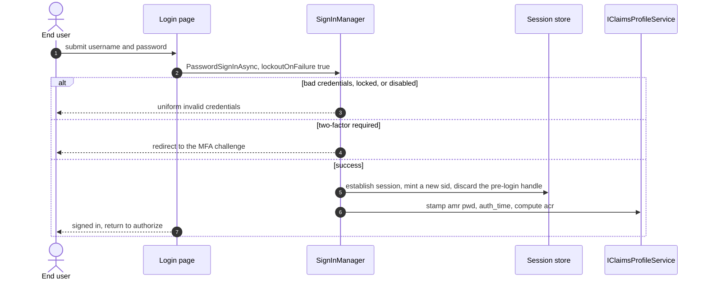
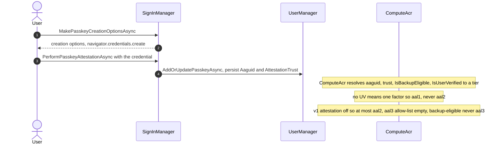
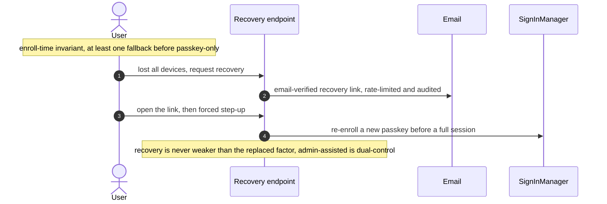
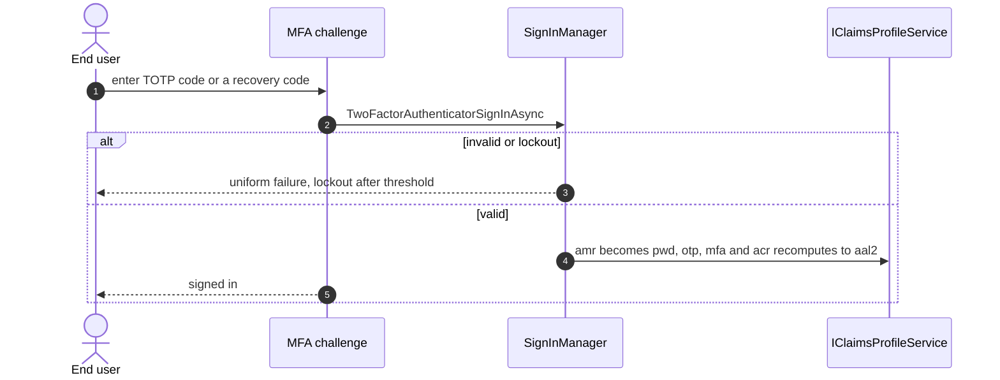
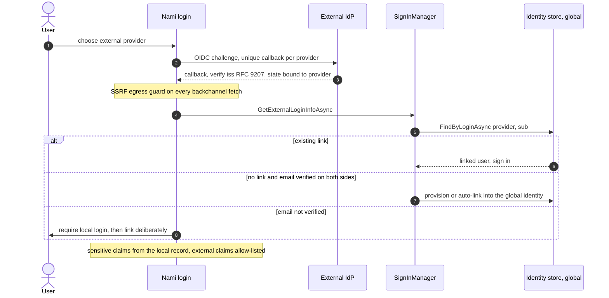
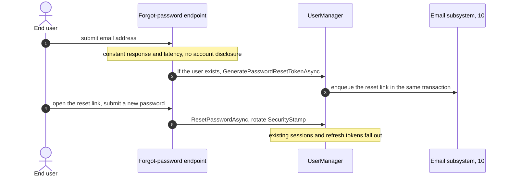
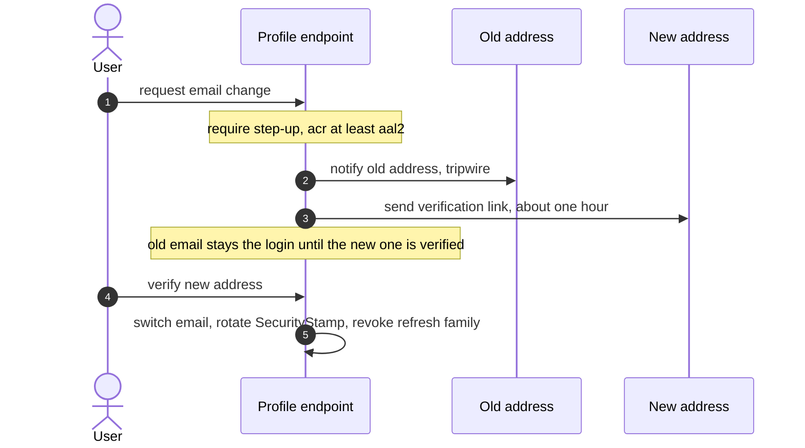
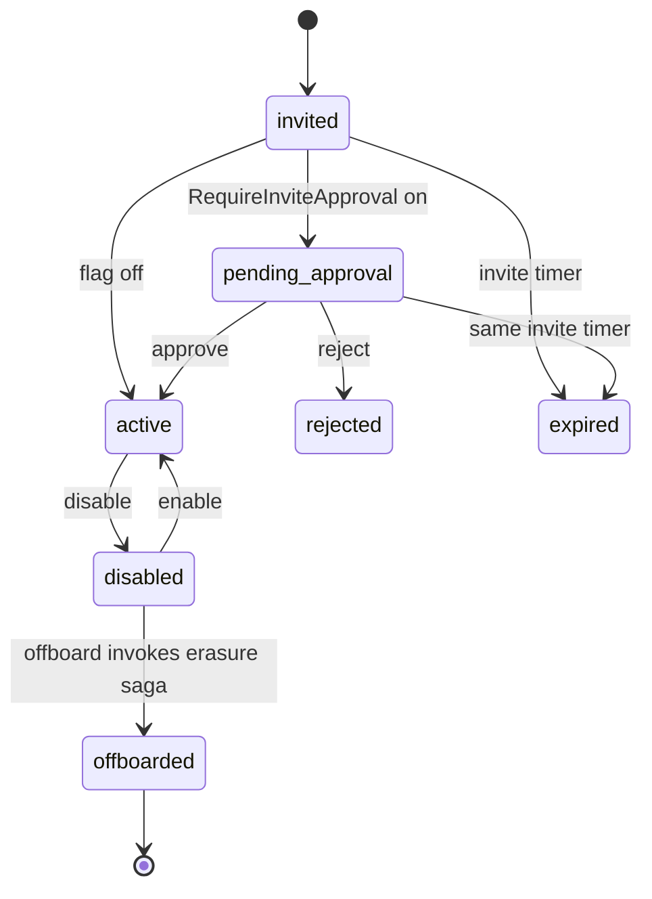

# User management and authentication (detailed design)

## 1. Decisions realized

| Decision | What this design applies |
|---|---|
| ADR-0028 | Build on ASP.NET Core Identity; native passkeys with an attestation/AAL seam; lifecycle; credential-hardening baseline; `Nami.Identity.Users` |
| ADR-0013 | Produce `acr` (recomputed per token-request), `amr` (RFC 8176 array), `auth_time` (JSON number); step-up is enforced in 07 |
| ADR-0003 | Server-side session store (`ITicketStore`): `sid` lifecycle, inactivity 1h / absolute 8h, concurrent-session cap, revoke-denies-authorize/refresh |
| ADR-0002 | Handler-based external login into the global identity; `(provider, sub)` anti-takeover linking; external-claim allow-list; SSRF; RFC 9207 `iss` |
| ADR-0075 / ADR-0005 / ADR-0001 | The `IClaimsProfileService` choke-point and its deny-by-default destinations are ADR-0075's invariant; ADR-0005 sets which claims exist and how small they stay; global identity with tenant via membership is ADR-0001 |
| ADR-0008 / ADR-0016 / ADR-0009 | Audit provenance on every lifecycle transition; offboard invokes the gated erasure saga; external secrets in the secret store |

## 2. Purpose and scope

The identity store and the human-authentication surface built on ASP.NET Core
Identity: the global user model, passkeys/WebAuthn and MFA, the assurance producer
(`acr`/`amr`/`auth_time`), server-side sessions, the credential
hardening baseline, self-service (including change-email hardening), and the user
lifecycle. It is Phase 04 and produces what the protocol engine (04) and
authorization (07) consume.

In scope: the Identity store, passkeys/MFA/assurance, sessions, federation, claims
production, credential hardening, self-service, and lifecycle. Out of scope: the
login/consent/logout UI pages (11), the step-up *enforcement* and dual-control (07),
the email subsystem mechanics (10), the erasure saga (17), and the schema (02, the
SSOT).

## 3. Interfaces and contract

### Native versus built, at a glance

The framework supplies most of this subsystem, and the single most expensive mistake here
is rebuilding something it already does. This table is the boundary, and it is worth
reading before writing any code in this area.

| Concern | Native, use as-is | Built here |
|---|---|---|
| Credentials | `UserManager` and `SignInManager`, `PasswordSignInAsync`, lockout, hashing with re-hash-on-verify | the password policy values, and the breach-check port |
| MFA (TOTP) | `GetAuthenticatorKeyAsync`, `VerifyTwoFactorTokenAsync`, `SetTwoFactorEnabledAsync`, `TwoFactorAuthenticatorSignInAsync` | the enrolment page and QR, and `amr` stamping |
| Recovery codes | `GenerateNewTwoFactorRecoveryCodesAsync` (ten by default, stored hashed), `TwoFactorRecoveryCodeSignInAsync`, `CountRecoveryCodesAsync` | the last-fallback invariant |
| Passkeys | the .NET 10 creation, attestation, assertion, and sign-in APIs, plus `IdentityPasskeyOptions` and `UserPasskeyInfo` | endpoint mapping, attestation policy, and the authenticator-to-assurance seam |
| Assurance | **nothing**: the protocol engine emits only `sub` | the whole `acr`, `amr`, and `auth_time` producer, including `ComputeAcr` |
| External login | the handler-based authentication schemes | provisioning and linking by `(provider, sub)`, and the claims allow-list (09) |
| Session | the ASP.NET cookie | the server-side ticket store, and revocation (13) |
| Email | Identity's generic `IEmailSender<TUser>`, which the infrastructure itself calls | the cloud-agnostic adapter and outbox (10) |

The assurance row is the one that surprises people: the engine emits `sub` and nothing
else, so every claim a resource server uses to decide *how strongly* a person authenticated
is produced here.

### Store and model

`ApplicationUser : IdentityUser<Guid>` (UUIDv7 PK) is **global** (one human, one
identity); tenant belonging is a `Membership`, never a user-per-tenant (ADR-0001).
`AddIdentity<ApplicationUser, IdentityRole<Guid>>()` over the global
`IdentityDbContext` (02), with default token providers. OpenIddict owns the
protocol; Identity owns the user store entirely.

## 4. Data and structure

No new tables; this design uses `AspNetUsers`/roles/claims, `UserPasskeyInfo`
(`Aaguid`, `AttestationTrust`), `Memberships`, and `ServerSideSessions`, all in
[02-data](02-data.md). It adds one field to the tenant config in 02: a per-tenant
`RequireInviteApproval` boolean for the invite-approval gate.

## 5. Behaviour

### 5.1 Interactive login and the assurance producer

OpenIddict has no profile-service equivalent, so a single `IClaimsProfileService` (the
choke-point owned by 04, with the claim contract in 09) is where session claims are
produced: `acr` is
**recomputed per token-request** from `amr` plus session age, with the aal2 predicate
requiring `amr` to include `mfa` or `otp`, **or** `hwk`/`swk` **with user verification
recorded for that assertion** (so a passkey-only login is not mis-scored as aal1, and a
passkey used without user verification is not mis-scored as aal2 either, section 5.2)
and an aal2 freshness window of about 12 hours with 30-minute
inactivity (NIST), capped by the 8h absolute session ceiling (ADR-0013) so an aged
session downgrades; `amr` is stamped at sign-in via
`SignInWithClaimsAsync(user, isPersistent, [amr claims])`, and **`auth_time` is stamped as
an immutable claim in that same call**, emitted as a JSON number (the `long` overload, not
a string).

**`auth_time` is deliberately not taken from `AuthenticationProperties.IssuedUtc`, and this
design said the opposite until 2026-08-01.** `IssuedUtc` is *ticket* metadata, not
authentication metadata: Microsoft's shipped documentation defines it as "the time at which
the **authentication ticket** was issued", and defines `SlidingExpiration` as instructing
the handler "to **re-issue a new cookie with a new expiration time** any time it processes a
request which is more than halfway through the expiration window". ADR-0003 sets a
**sliding** 1-hour inactivity window, so the ticket is re-issued on ordinary traffic. An
`auth_time` read from it therefore advances with no re-authentication, and everything that
depends on freshness silently stops working: `max_age` never fires, `prompt=login` never
fires, and the 12-hour aal2 window above never expires for an active user. The failure is
invisible, because every value looks recent and plausible.

*What is verified and what is not:* the two definitions above are read at Microsoft's own
documentation shipped with the .NET 10.0.9 reference assemblies. That the handler assigns
the refreshed instant back onto `properties.IssuedUtc` during renewal was read against
`dotnet/aspnetcore` in the design corpus and is **not** re-verified here. The fix is chosen
so that it does not depend on settling that: an immutable claim is the correct source
either way, it is explicit rather than inferred, and it matches how `amr` is already
handled. The sliding-renewal test in [20](20-testing.md) is the settling experiment, and it
is a regression test regardless of the outcome: sign in, wait past half of `ExpireTimeSpan`
to force a renewal, issue a token, assert `auth_time` is unchanged, with counter-branches
asserting that `max_age` and `prompt=login` still fire.

Consumers read the claim, never the property. Where the claim is absent from a cookie
principal, the correct response is to **re-challenge**, not to infer a time from the
ticket, since inferring is how the defect returns.

**`amr` is a historical fact of one authentication, stamped once and never recomputed**,
which is exactly why `acr` has to be recomputed instead: the factors used do not change,
but their sufficiency decays with session age. Password plus TOTP stamps
`["pwd","otp","mfa"]`, and the `mfa` value sits **alongside** its factor children rather
than replacing them because RFC 8176 Appendix A shows that combination: a verifier that
wants "was more than one factor used" reads `mfa`, and one that wants "which factors"
reads the children, without either having to infer the other. A passkey stamps `hwk` when
the credential is device-bound or `swk` when it is synced.

The **shape and destination** of each of those claims is the canonical claims contract,
which [09](09-federation-and-claims-profile.md) owns: its seven claims have five
different producers, so the table lives in a neutral document rather than in whichever
producer happened to be written first. What belongs here is the producer side. `acr` and
`auth_time` reach both tokens so a resource server can enforce RFC 9470; `amr` reaches
only the id_token, because it can be absent on a silent refresh and a resource server
gating on it would fail closed at random. A federated login stamps the factor the
provider actually used (`pwd`, `otp`) rather than a synthetic `external` value, since
RFC 8176 defines none. OpenIddict 7.5 does not emit `sid` natively, so it is set
explicitly to the session `sid`; without it a relying party can only log out by `sub`,
killing every session the person has rather than the one that ended.

#### Interactive login

The backend authentication step (the protocol wrapper is 04's authorize flow): a
password sign-in, uniform failure, session establishment, and claim production.

### 5.2 Passkeys and assurance level

Passkeys are native to .NET 10 (`SignInManager.MakePasskeyCreationOptionsAsync` /
`PerformPasskeyAttestationAsync` / `MakePasskeyRequestOptionsAsync` /
`PasskeySignInAsync`), but the endpoints are **not** auto-mapped and there is no
default attestation validation, and a passkey is a **primary** factor. Nami builds:
the passkey endpoints (`/account/passkey/register/options|verify` and
`/account/passkey/login/options|verify`, antiforgery and HTTPS required); an
`IdentityPasskeyOptions` attestation policy (v1 leaves `VerifyAttestationStatement`
unset); and an **AAL seam** that persists `UserPasskeyInfo.Aaguid` and an
`AttestationTrust` column, with an `IAttestationValidator` port and an `AaguidAalPolicy`
bound in `AssuranceOptions` through `IOptionsMonitor` (hot-reload of the aal3 allow-list
without a restart).
**v1 ships attestation off, so no passkey reaches `aal3`, and a passkey reaches `aal2` only
when user verification actually happened.** Until 2026-08-01 this design said "every passkey
is `aal2`", which was wrong in the direction that grants assurance rather than withholding
it. A cryptographic authenticator used **without** user verification proves possession of
the credential and nothing else, which is one factor; the PIN or biometric that UV performs
is what supplies the second. So a non-UV assertion is a single-factor login, and scoring it
`aal2` meant the per-scope `RequiredAcr` gate passed on it and RFC 9470 step-up saw `aal2`
already satisfied and never challenged. It also interacts with the `amr` predicate in
section 5: a passkey stamps `hwk`/`swk`, and that value alone must not be read as
multi-factor.

Three rules follow, and .NET 10 supplies what each needs:

* **Require UV in both ceremonies.** `IdentityPasskeyOptions.UserVerificationRequirement`
  applies to creating a new passkey and to requesting an existing one, takes `"required"`,
  `"preferred"` or `"discouraged"`, and its **default is `"required"`** (read at the .NET
  10.0.9 reference assemblies). Nami sets it explicitly anyway, because a security-relevant
  default that nothing states is a default that a future upgrade may change silently.
* **Assert the flag, do not trust the request.** The requirement travels to the client as a
  ceremony parameter, so it expresses intent; the authenticator's own UV result is the fact.
  Read `UserPasskeyInfo.IsUserVerified`, which exists on the .NET 10 type and is reachable
  from `PasskeyAssertionResult<T>.Passkey`, documented as "the **updated** passkey
  information when assertion succeeds".
* **Make the `aal2` branch conditional** on that flag rather than unconditional on the
  credential being a passkey.

**Not verified here, and deliberately named:** whether the framework *enforces*
`UserVerificationRequirement` server-side. The documentation for the sibling
`ResidentKeyRequirement` says explicitly that it "is **not enforced on the server**", and
`UserVerificationRequirement` carries no such sentence, but an absent caveat is not a
statement, and this design does not treat it as one. Asserting `IsUserVerified` makes the
question moot at the point that matters, which is why the assertion is a rule rather than a
belt-and-braces extra. The AAL2 two-factor definition itself should be confirmed against the
mandated revision of NIST SP 800-63B, alongside the freshness numbers ADR-0013 already
parks there.

The aal3 allow-list is empty, ready to enable
hardware-attested aal3 later as config plus an MDS adapter (`fido2-net-lib`, MIT). A
**backup-eligible (synced) credential is never aal3** (the rule keys off
`IsBackupEligible`, not `IsBackedUp`, so a credential that can sync is disqualified
before it has). Because a passkey is primary,
account recovery is designed in: before a user goes passkey-only there must be at
least one fallback (a second passkey, recovery codes, or a password); the last
recovery path cannot be removed; a lost-all-devices flow uses email-verified
recovery plus a forced step-up re-enroll and is never weaker than the factor it
replaces; every recovery step is rate-limited and audited, and admin-assisted
recovery is dual-control (07).

#### Passkey registration and AAL resolution

#### Passkey recovery (lost all devices)

### 5.3 MFA

TOTP plus 10 recovery codes are the baseline (native); passkeys ship in v1. `amr`
reflects the factors used; SMS/email OTP is roadmap (weakest factor). TOTP enrollment is
`GetAuthenticatorKeyAsync` (or `ResetAuthenticatorKeyAsync` when null) then a QR from the
`otpauth://totp/{issuer}:{email}?secret=..` provisioning URI, confirmed with
`VerifyTwoFactorTokenAsync(user, Options.Tokens.AuthenticatorTokenProvider, code)` then
`SetTwoFactorEnabledAsync(user, true)` (there is no `GenerateNewAuthenticatorKey` instance
method). Recovery codes are `GenerateNewTwoFactorRecoveryCodesAsync(user, 10)` (hashes
stored in `AspNetUserTokens`, redeemed via `TwoFactorRecoveryCodeSignInAsync`, counted with
`CountRecoveryCodesAsync`). The challenge is `PasswordSignInAsync` then the
`RequiresTwoFactor` branch over the `IdentityConstants.TwoFactorUserIdScheme` interim cookie
(`GetTwoFactorAuthenticationUserAsync`) then
`TwoFactorAuthenticatorSignInAsync(code, isPersistent, rememberClient)`.

#### MFA (TOTP) sign-in

### 5.4 Server-side sessions (ADR-0003)

Sessions are core, not optional: an `ITicketStore` over PostgreSQL persists the
ticket and the cookie carries only a handle. Keyed by `sid`; inactivity 1h, absolute
8h; a re-validation interval of 1-2 minutes; a per-user `MaxConcurrentSessions` cap
(default ~5, per-tenant overridable) evicting the oldest on login; authorize and
refresh are denied when the session is revoked (revocation deletes the session row,
so row-absence is the revoked state the deny check tests; the refresh half of that check
is executed in [04](04-core-protocol.md), and because row-absence cannot distinguish
revoked from expired, the 1-hour inactivity window ends a refresh chain as well). The interim
back-channel-logout emitter and the first-party-SPA BFF receiver (ADR-0019) build on
this store and consume the `sid`/`logout_token` contract, their fan-out owned by the
logout design (11). The `sid` is stable across passive
refresh and **rotated on step-up or re-authentication**. At primary auth
(anonymous to authenticated) a **new `sid` and a new ticket row are minted and the
pre-login session handle discarded** (session-fixation defense); an anonymous
session is never upgraded in place.

### 5.5 Federation (external login, ADR-0002)

Handler-based ASP.NET Core external login (`AddMicrosoftAccount` /
`AddMicrosoftIdentityWebApp` / `AddOpenIdConnect`), provisioning or linking into the
**global** identity; the external IdP set is static and host-level in v1 (dynamic
per-tenant is v2, ADR-0034). Security requirements ship with the decision:
account-linking key is `(provider, sub)` and never an unverified email (auto-link
only when the email is verified on both sides); external claims pass an **allow-list**
and sensitive claims (`role`/`groups`/`email_verified`) always come from the local
record and membership (external claims are stripped at `OnTokenValidated` before the local
principal is built, and the linking decision runs in the `ExternalLogin` callback action,
not a handler event); authority/discovery URLs and every backchannel fetch pass a
fail-closed **SSRF egress handler** (`SsrfEgressHandler` on `BackchannelHttpHandler` that
resolves the host to an IP before connecting and rejects loopback, RFC1918, link-local,
ULA, and the `169.254.169.254` metadata address, plus `PostConfigure` host allow-listing,
`AllowAutoRedirect=false`, and cross-host redirect rejection); each provider has a unique callback and the
authorization-response `iss` is verified (RFC 9207; whether .NET 10's OIDC handler
enforces `iss` natively is a verify-at-source item, and if it does not it is wired in
`OnMessageReceived` without double-handling) with the correlation state bound to the
provider scheme (mix-up defense); provider secrets live in the secret store
(ADR-0009), never plaintext.

#### External login with anti-takeover linking

### 5.6 Credential hardening baseline (ADR-0028 §E)

The levers, in order of effect, are MFA/passkeys, a breached-password check, length
over complexity, strong hashing, then lockout, not complexity rules or rotation
(which NIST shows weaken passwords):

| Setting | Baseline | Why |
|---|---|---|
| `Password.RequiredLength` | 12 | length over complexity (NIST) |
| PBKDF2 `IterationCount` | >= 210000 | OWASP 2023 (Argon2id via a custom hasher optional) |
| `SecurityStampValidatorOptions.ValidationInterval` | 1-2 min | fast logout-everywhere (ADR-0003) |
| `SignIn.RequireConfirmedAccount` | true | anti-fake-account |
| `User.RequireUniqueEmail` | true | one email is one identity (ADR-0001) |
| `RequiredUniqueChars` | 4 | blocks trivial repeats |
| Lockout | on-failure enabled, 5 attempts, 5-15 min timespan, plus a separate 2FA-step lockout | the template defaults on-failure off |
| Breached-password check | HIBP range API (k-anonymity), fail-open, prod-on | banned-password lever |
| Forced rotation | none | rotation weakens passwords (NIST) |

The password hasher upgrades transparently: on a successful verify against an older stored
hash it re-hashes at the current work factor (re-hash-on-verify), so raising
`IterationCount` migrates users at their next login without a reset.

Complexity flags stay on as defense-in-depth backstop, not the primary lever. The
lockout-DoS mitigation and the risk-triggered challenge layer are ADR-0042.

### 5.7 Self-service

Self-service (profile, email/phone, MFA/passkey/password, sessions, membership) uses
**custom endpoints, not `MapIdentityApi`**: `MapIdentityApi` exposes `/register`,
`/login`, and similar as a parallel JSON attack surface that bypasses the UI flow,
anti-enumeration, and the challenge layer. **Change-email is hardened** (the top
takeover surface): notify the old address (an informational tripwire with a support
CTA and no actionable token or link), require step-up (acr >= aal2)
before initiating, verify the new address before the switch takes effect (the old
email stays the login until then), and on completion rotate the `SecurityStamp` and
revoke the refresh-token family so existing sessions fall out.

#### Password reset

The Identity side; the email delivery, anti-enumeration timing, and token lifespan
are the email subsystem (10).

#### Change-email hardening

### 5.8 Lifecycle

`invited -> pending-approval -> active -> disabled -> offboarded`, with
disable-not-delete by default and offboard invokes the gated erasure saga (17,
dual-control and Art.17/DPO-gated, not automatic per offboard); every transition is
audited with provenance (ADR-0008). The `pending-approval` state is gated by
an **override** of `CanSignInAsync` reading a `Membership` status marker (approval is
tenant-scoped even though identity is global) and is enabled by a per-tenant `RequireInviteApproval`
flag; approval reuses the dual-control saga (its catalogue entry in 07, its executor
registry in 15) as a constructive-action variant (a new
`approve-user-invite` `ActionType` plus its `IProposalExecutor`, with the saga executor
structure unchanged), and the invite-expiry timer is reused (not a second clock).

#### Lifecycle states

## 6. Dependencies and wiring

### Patterns applied

Named per ADR-0066:

* **State machine** for the user lifecycle.
* **Strategy** for external auth handlers per provider and for `ComputeAcr`
  assurance tiers.
* **Single choke-point** for `IClaimsProfileService` (shared with 04).
* **Ports and Adapters** for `IAttestationValidator`, `IPasswordBreachCheck`,
  `IEmailDispatcher`, and `IAuditSink`.

### Libraries

ASP.NET Core Identity and native .NET 10 passkeys (MIT); the external-login handlers
(`Microsoft.Identity.Web` / `AddMicrosoftAccount` / `AddOpenIdConnect`, stated MIT but
**not verified offline** for `Microsoft.Identity.Web`, which the ADR-0026 licence-scan gate
confirms when the solution lands); the
HIBP Pwned-Passwords range API (an external service, k-anonymity, fail-open); and, for
future hardware-attested aal3, `fido2-net-lib` (MIT) with the FIDO MDS. No commercial
dependency (ADR-0026). The confirm/reset path integrates through Identity's generic
`IEmailSender<TUser>` (the interface Identity infrastructure itself calls), never the
legacy single-method `IEmailSender` (only scaffolded Razor calls that one); implementing
only the legacy interface means confirm/reset mail silently never sends. The delivery
mechanics are 10's.

### Packaging

Bundled as `Nami.Identity.Users` with an `.AddUsers(...)` builder (ADR-0027). The
`IEmailDispatcher` and `IAuditSink` ports are consumer swap-points (ADR-0024), and the
user-management public surface is governed by the SemVer and deprecation policy
(ADR-0044).

## 7. Error handling, edge cases, invariants

* **Passkey lockout**: a passkey-only user who loses all devices is locked out
  unless a fallback exists; the last recovery path cannot be removed, and recovery is
  never weaker than the factor it replaces.
* **Account takeover via linking**: linking on an unverified email would allow
  takeover; the key is `(provider, sub)` and auto-link requires verified email on
  both sides.
* **`CanSignInAsync` is an override, and crediting the native call is the trap.**
  `SignInManager<TUser>.CanSignInAsync` takes **only the user** (verified at the .NET 10.0.9
  reference assemblies: the signature carries a single parameter) and evaluates only the
  `Options.SignIn` confirmation flags. It takes no tenant, reads no membership row, and knows
  nothing about a disabled state. So it cannot be the gate for tenant-scoped
  pending-approval, and it cannot be the gate for disabled users; both are **build**. Nami
  overrides the method (it is `virtual`, wired through `.AddSignInManager<>()`) and calls
  `base` **first**, so the three native checks still run and the override only ever narrows.
  The danger is specific rather than theoretical: ADR-0004 deliberately de-scopes the
  per-validation active-user check and compensates with force-revoke-on-disable, so treating
  the native call as the gate removes the last one there is. A negative test belongs here:
  revert to the native implementation and both the disabled and the pending-approval branch
  must fail.
* **`auth_time` serialization**: emitted as a JSON number (the `long` overload); a
  string violates OIDC.
* **`amr` on refresh**: may be absent on silent refresh, so resource servers gate on
  `acr`+`auth_time`, not `amr`.
* **Session fixation**: a pre-login session handle is never upgraded in place; a new
  `sid` is minted at primary auth.
* **`MapIdentityApi`**: not mapped, because it is a parallel attack surface bypassing
  anti-enumeration and the challenge layer.
* **HIBP outage**: the breach check is fail-open (a timeout or error allows the set),
  so a third-party outage never blocks sign-in.
* **Backup-eligible passkey**: a synced credential is never rated aal3.
* **Login-error uniformity**: lockout and disabled-account login failures return the
  same generic invalid-credentials response as a bad password (no locked/disabled
  oracle); the lockout notice is emailed, not shown (11).

## 8. Security and multi-tenancy notes

* MFA/passkeys are the top lever; the breached-password check and length beat
  complexity and rotation (ADR-0028).
* External trust is minimized: sensitive claims come from the local record, external
  claims are allow-listed, backchannel calls are SSRF-guarded, and `iss` is verified
  against mix-up (ADR-0002).
* Sessions are revocable server-side with enforced lifetimes; change-email rotates
  the security stamp and revokes refresh so a hijacked session cannot persist
  (ADR-0003, ADR-0028).
* Sign-in success and failure (with IP and user-agent) are emitted to the audit
  lane, alongside lockout and reuse events (ADR-0008, catalog in 03).
* Every lifecycle transition and recovery step is audited with provenance
  (ADR-0008); offboard invokes the gated erasure saga, which revokes live access
  first and preserves the audit hash-chain by crypto-shredding PII and appending a
  tombstone rather than deleting the row (17, ADR-0016).

## 9. Testing

* Passkey register/login end-to-end; removing the last fallback is blocked;
  lost-all-devices recovery forces re-enroll and is not weaker than the replaced
  factor.
* Anti-enumeration on `/forgotPassword` and resend (constant response and latency);
  no `MapIdentityApi` surface exists.
* External login: linking by `(provider, sub)`, rejection of unverified-email
  linking, external-claim allow-list, SSRF egress rejects private/link-local/metadata
  IPs, and `iss` mix-up rejection (the federation-security tests).
* Change-email: the four-branch test (notify-old, step-up-before-initiate,
  verify-new-before-switch, stamp-rotate-and-revoke).
* Assurance: `acr` recomputes and downgrades with session age; `amr` reflects the
  factors and never contains `passkey`; `auth_time` is a JSON number.
* Sessions: a revoked session is denied at authorize/refresh within one interval;
  session-fixation (the `sid` changes at primary auth); concurrent-session cap evicts
  the oldest.
* Lifecycle: invite/approve/disable/offboard transitions; offboard revokes sessions
  and tokens and invokes the gated erasure saga (dual-control, revoke-first, audit
  preserved).

## 10. Open and build-time items

* The aal3 attestation thresholds and the AAGUID allow-list are a Security
  ratification item; v1 attestation is off (flat aal2).
* The credential-hardening thresholds (length 12, PBKDF2 >= 210000) and sending a
  hash prefix to HIBP are Security/DPO ratification items (ADR-0028).
* `RequireInviteApproval` is a v1, per-tenant decision; its field is threaded into
  the tenant config (02).
* The initial external-provider list is finalized during implementation (ADR-0002).
* The dynamic per-tenant external-IdP flow is a v2 feature (ADR-0034) designed
  separately, not in this v1 doc.

## 11. Sources

* Architecture overview: [components](../architecture/08-component-view.md) (user
  management, sessions, external login), [runtime views](../architecture/09-runtime-flow-views.md).
* Design: [02-data](02-data.md) (Identity, passkeys, sessions, membership schema),
  [04-core-protocol](04-core-protocol.md) (the claims choke-point and token issuance),
  [09-federation-and-claims-profile](09-federation-and-claims-profile.md) (the canonical
  claims contract these claims are shaped by, and the federation path itself),
  [07-authorization](07-authorization.md) (step-up enforcement, dual-control),
  [03-audit](03-audit.md) (transition provenance).
* ADRs: 0028 (user management), 0013 (MFA/assurance producer), 0003 (sessions), 0002
  (federation), 0075 (the choke-point's deny-by-default destinations), 0005 (which claims
  exist and the minimal token), 0001 (global identity/membership), 0008
  (audit), 0016 (offboard/erasure), 0009 (secret store), 0042 (abuse/lockout).

---

[Prev: Authorization and delegated admin](07-authorization.md) · [Index](README.md) · Next: [Federation and the claims profile](09-federation-and-claims-profile.md)
