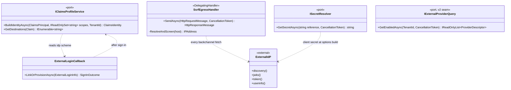
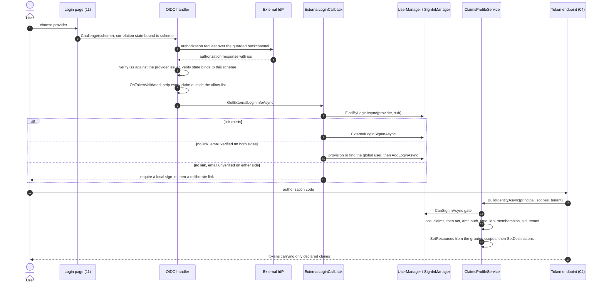
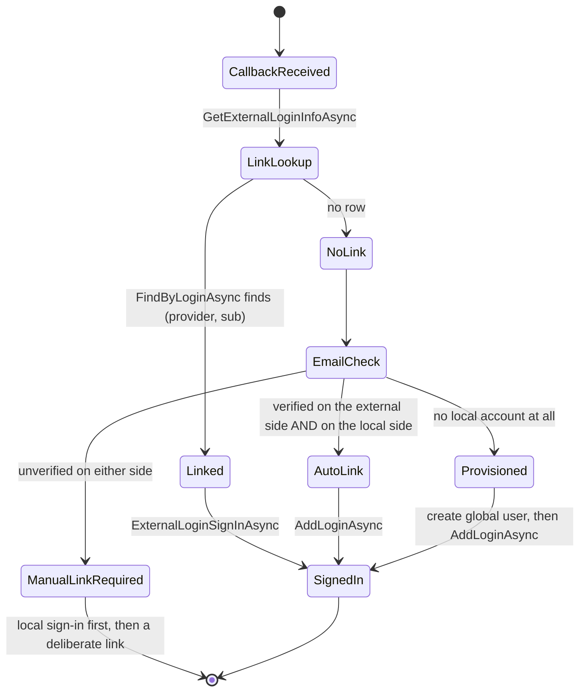
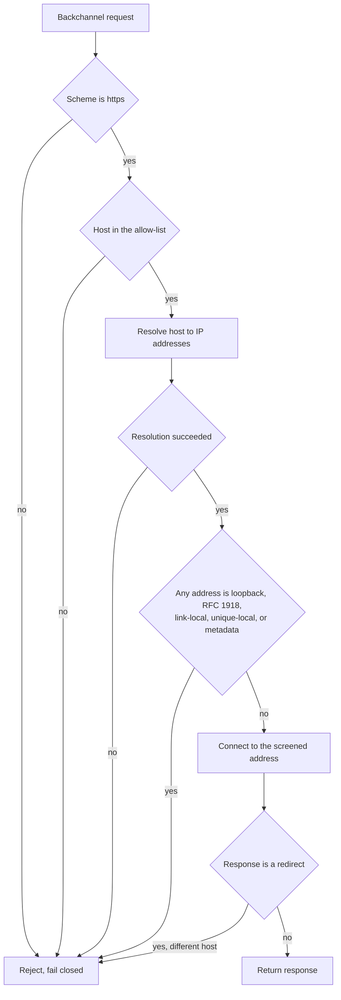
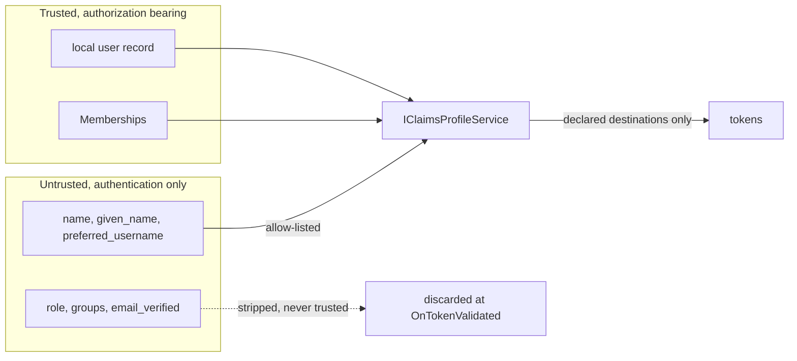

# External federation and the claims profile (detailed design)

> **Sits under:** [architecture: system context](../architecture/04-system-context.md)
> (the external IdP as an outbound integration), [component view](../architecture/08-component-view.md)
> (the user-management and authentication subsystem), and
> [threat model](../architecture/14-threat-model.md) (S5, account takeover through linking).
> **Implementer source of record:** this document, for external federation, the
> federation-security hooks, and the **canonical claims contract**. The local user store,
> password and MFA policy, and the assurance producer are [08](08-user-management.md); the
> `GetDestinations` switch and the endpoint model are [04](04-core-protocol.md); the
> `Memberships` store is [07](07-authorization.md); the `AspNetUserLogins` schema is
> [02](02-data.md).

Two things named "identity" meet here and they are complementary, which is the first thing
to get straight. **ASP.NET Core Identity** is Nami's local user store, the system of
record. An **external identity provider** (an enterprise OIDC IdP, Entra ID, Google) is an
optional upstream that authenticates a person and nothing more. Federation therefore adds
an authentication path, never an authorization source: every claim that can grant
something is read from the local record.

That asymmetry is the whole design. The rest is two mechanisms which enforce it: one
choke-point through which all claims pass on their way into a token, and five hooks that
each pin one federation-security requirement to a named place in the handler pipeline.

## 1. Decisions realized

| Decision | What this design applies |
|---|---|
| ADR-0002 | Federation is ASP.NET Core Identity **external login**, handler-based, with a static host-level provider set in v1; and the five security requirements that ship with that decision |
| ADR-0075 | Claim destinations are **deny-by-default**, and `IClaimsProfileService` is the single choke point for every issuance path |
| ADR-0005 | Which claims exist and how small they stay: the minimal access token, and the `memberships` cap with its truncation flag |
| ADR-0001 | One **global** identity per person, tenant access through membership, and exactly one `tenant` claim on an access token |
| ADR-0013 | `acr` is recomputed per token request, `amr` is stamped at sign-in, `auth_time` is a JSON number |
| ADR-0019 | `sid` rides the id_token and the `logout_token`, so back-channel logout can correlate |
| ADR-0009 | Provider client secrets live in the secret store behind a port, never in plaintext configuration |
| ADR-0034 | v1 stays static and global; per-tenant self-service federation is additive v2, and its one v1 touch point is the provider-enumeration seam |

## 2. Purpose and scope

In scope: the static handler-based external-login path and its callback; provisioning and
linking into the global identity; the `IClaimsProfileService` composition on every issuance
path; the **canonical claims contract**, which is the single definition of every bespoke
Nami claim; and the five federation-security enforcement hooks (SSRF egress, RFC 9207
issuer, account-linking anti-takeover, external-claim allow-list, secret custody).

Out of scope, referenced and not redefined: the ASP.NET Core Identity store, password,
lockout, hashing, MFA, passkey, and breach-check policy, all of which are
[08](08-user-management.md); the `GetDestinations` **switch body** and the endpoint model,
which are [04](04-core-protocol.md); the `Memberships` table and the coarse-role source,
which are [07](07-authorization.md); the `AspNetUserLogins` schema, which is
[02](02-data.md); per-tenant token validation on the resource side, which is
[05](05-resource-server-validation.md); the login and external-login **pages**, which are
[11](11-login-consent-ui.md); back-channel logout delivery, which is
[13](13-revocation-caching.md).

The claims contract is deliberately here rather than in a producer design. Its seven claims
have five different producers, so hosting the table in any one of them would make the other
four point sideways at a peer. A neutral home is the only arrangement in which every
producer points at the same place.

## 3. Interfaces and contract



* **`IClaimsProfileService`** is the single choke point. Controllers call it and nothing
  else; no claim or destination logic exists anywhere on an issuance path. It gates with
  `SignInManager.CanSignInAsync`, builds the identity, sets the bespoke claims, resolves
  the audience from the granted scopes, and applies `GetDestinations`. Its deny-by-default
  destination rule is an invariant of ADR-0075, not a convention: a claim reaches a token
  only where a destination was declared for it, and the fallback returns nothing.
  It runs on **every** issuance path, authorize, token, refresh, and userinfo, because a
  path that skipped it would be a path with no allow-list.
* **`SsrfEgressHandler : DelegatingHandler`** is installed on
  `OpenIdConnectOptions.BackchannelHttpHandler`. The framework handler shares one
  backchannel for discovery, JWKS, token, and userinfo, so one handler covers all four
  fetches, which is why this is the right seam rather than four call-site checks.
* **`ISecretResolver`** resolves a provider client secret or certificate from the
  secret store through the ADR-0009 port. Configuration holds a reference, never a value.
* **`IExternalProviderQuery`** is the one seam v2 needs (ADR-0034). In v1 it returns the
  static host-level set and ignores the tenant. It exists now so that when per-tenant
  federation lands, exactly one call site changes rather than the login page being
  rewritten.

The identity is built **manually** rather than through `CreateUserPrincipalAsync`, so only
chosen claims enter the token and the `SecurityStamp` never does. That is a security
property, not a style preference: the security stamp is the revocation primitive, and a
token carrying it hands a copy of the revocation key to every holder of the token.

## 4. Data and structure

This design owns no relational table. It reads three stores and writes to one of them
through `UserManager`:

| Store | Read or written | What for | Owner |
|---|---|---|---|
| `AspNetUserLogins` | read and written | The external-login link, keyed `(LoginProvider, ProviderKey)`, which is `(provider, sub)`. This composite key **is** the anti-takeover mechanism, because it cannot be forged by controlling an email address | [02](02-data.md) |
| `Memberships` | read | The `memberships` claim and the coarse per-tenant roles | [07](07-authorization.md) |
| Secret store | read | Provider client secrets and certificates, through the ADR-0009 port | [12](12-key-management.md) |

`ProviderKey` holds the external `sub`, and `sub` is the only external value the design
treats as a stable identifier. An email address is data about the person, not the person's
name in the provider's namespace, and it can change or be reassigned.

## 5. Behaviour

### 5.1 The claim choke point

OpenIddict does not copy a principal's claims into tokens on its own. Its documentation
states that the server "doesn't automatically copy the claims attached to a
`ClaimsPrincipal` to access or identity tokens", `sub` excepted, and a claim is serialized
only where `SetDestinations` declared a destination for it (ADR-0075). That default is
safe, and the design's job is to keep it safe in one place instead of restating it on four
paths.



Three steps in that sequence are the ones an implementer gets wrong by omission. The
`iss` and state checks happen in the handler, before any local lookup, so a mixed-up
response never reaches the callback. The allow-list strip happens in `OnTokenValidated`,
before the local principal exists, so an untrusted claim is gone before anything can read
it. And `CanSignInAsync` is checked inside the choke point rather than at the login page,
because refresh and userinfo do not pass through a page.

`SetResources` comes from `_scopeManager.ListResourcesAsync(identity.GetScopes())`, so the
audience is derived from what was actually granted rather than configured per client.

### 5.2 The canonical claims contract

This is the single definition of every bespoke Nami claim. Other designs reference it and
none redefine it; adding a first-party claim means editing this table **and** the
`GetDestinations` switch in [04](04-core-protocol.md) in the same change, which the
regression test in [20](20-testing.md) enforces by asserting that an undeclared claim
reaches no token.

| Claim | JSON shape | Destination | Producer | Consumer |
|---|---|---|---|---|
| `memberships` | array of `{tid, name?, roles?}` where `tid` is required and `name` and `roles` are optional; capped at about 10 entries, and over the cap **truncated to 10** with **`memberships_truncated: true`** set alongside it (ADR-0005) | id_token only, because an access token is single-tenant | This design, from the `Memberships` store (07) | The tenant switcher (11) and integrators; on `memberships_truncated=true` the full list comes from the self-service membership endpoint (08), never from a larger token |
| `acr` | single string, `urn:nami.identity:aal1`/`aal2`/`aal3`, with `0` meaning below aal1 and not for a valuable resource | id_token and access_token | `ComputeAcr`, recomputed per token request (08, ADR-0013) | Step-up at a resource server (05) and the Admin `AcrRequirement` (15) |
| `amr` | array, RFC 8176 values `pwd`, `otp`, `mfa`, `hwk`, `swk` | id_token | Stamped at sign-in via `SignInWithClaimsAsync` (08) | Informational only |
| `auth_time` | JSON **number**, a NumberDate, via the `long` overload | id_token and access_token | This design, from `AuthenticationProperties.IssuedUtc` | `max_age` and step-up freshness |
| `idp` | string, the external scheme or `local` | id_token | This design, set explicitly | Relying party, and tenant or membership decisions |
| `sid` | string session identifier | id_token and `logout_token` | Session establishment (ADR-0019, 08) | Back-channel logout correlation (13) |
| `tenant` | single string tenant identifier, always exactly one | access_token | This design, from the resolved tenant | Resource-server tenant isolation (05) |

Four properties of that table are load-bearing and each has a reason a reader would
otherwise have to reconstruct:

* **`amr` has no `external` value.** RFC 8176 defines none, so emitting one would be
  non-conformant. A federated sign-in records the factor the provider actually used,
  `pwd` or `otp`, and the provider itself is named by `idp`. This is a deliberate
  divergence from the design corpus, which named `external`.
* **`amr` carries no `passkey` value** either, for the same reason: a passkey is `hwk` or
  `swk` depending on where the key lives.
* **`acr` and `auth_time` go to both tokens** so a resource server can implement RFC 9470
  without an extra round trip, while `amr` does not, because `amr` can be absent on a
  silent refresh and a resource server that gated on it would fail closed at random.
* **`auth_time` is a number.** The `long` overload yields a JSON number; a `.ToString()`
  yields a JSON string, which violates OIDC Core, and nothing in the pipeline catches it
  (verification record V02).

`sid` is set explicitly because OpenIddict 7.5 does not emit it. Without it a relying
party can only end sessions by `sub`, which kills every session the person has rather
than the one that ended.

### 5.3 External federation, static and handler-based

Wiring is one framework handler per provider, registered at host level:
`AddAuthentication().AddOpenIdConnect(...)` for a generic OIDC provider, or a provider
package where one exists. The set is fixed at deployment time in v1 (ADR-0002); nothing
resolves a provider per request.

Provisioning goes into **one global** `ApplicationUser` (ADR-0002, which is where that
wording is fixed), and tenant access follows as membership rather than as a second
identity, which is the ADR-0001 model. The `Memberships` table itself is
[07](07-authorization.md) over the schema in
[02](02-data.md). A person who signs in through an external IdP for three tenants
is one identity with three memberships, never three identities. The linking state machine
is where account takeover is either prevented or introduced:



`ManualLinkRequired` is the branch that exists to be taken. An IdP that asserts an
unverified email for an address someone else owns locally is the classic takeover, and the
only defence that holds is refusing to treat an unverified email as a join key at all.

The OpenIddict client stack (`OpenIddict.Client.WebIntegration` with `UseWebProviders()`)
remains an allowed exception where provider-specific token management is genuinely needed,
for example calling a provider's downstream API, and such a use brings its own
provisioning bridge (ADR-0002).

### 5.4 The five enforcement hooks

Each requirement below is anchored to a named place in the pipeline, because a security
requirement with no location is a requirement nobody implements.

| Requirement | Hook | Mechanism | Test |
|---|---|---|---|
| **SSRF** on every backchannel fetch | `SsrfEgressHandler` on `BackchannelHttpHandler`, plus `PostConfigure<OpenIdConnectOptions>` | The handler resolves the host to an IP **before** connecting and rejects loopback, RFC 1918, link-local, unique-local, and cloud-metadata addresses, rejects non-HTTPS, and rejects a cross-host redirect with `AllowAutoRedirect = false`. `PostConfigure` validates `Authority` and `MetadataAddress` at options build against HTTPS and the host allow-list. Fail-closed | F1 |
| **RFC 9207 issuer** on the authorization response | `OnMessageReceived`, with `OnTokenResponseReceived` as the second read | Read `iss` from the protocol message and compare it to the provider's expected issuer; a mismatch fails the callback, and so does an absent `iss` where the provider advertises `authorization_response_iss_parameter_supported`. Correlation state is bound to the initiating scheme, so a callback is valid only for the provider that started it | F2 |
| **Account-linking anti-takeover** | The callback action, not a handler event | `FindByLoginAsync(provider, providerKey)`; auto-link only where the email is verified on both sides, otherwise a local sign-in followed by a deliberate link. An unverified email is never a join key | F3 |
| **External-claim allow-list** | `OnTokenValidated` to strip, and the choke point to emit | Only allow-listed claim types survive the callback (`name`, `given_name`, `preferred_username`, and similar). `role`, `groups`, and `email_verified` always come from the local record and membership | F4 |
| **Secret custody** | `ISecretResolver` at options build | The client secret or certificate is resolved from the secret store through the ADR-0009 port; configuration holds a reference | Configuration test |

The egress screen is worth drawing, because the order of its steps is the part that fails
silently when it is wrong:



Resolution happens **before** the connection and the connection targets the screened
address, which closes the rebinding gap: screening a hostname and then letting the stack
resolve it again allows a second answer to differ from the first. `AllowAutoRedirect` is
off so a redirect is a decision this handler makes rather than one the stack makes
silently.

The claim trust boundary is the other picture worth holding, because it is what the
allow-list is defending:



### 5.5 What v2 changes, and what it does not

v1 is static and global. Per-tenant self-service federation is v2 (ADR-0034): OIDC only,
a dynamic scheme provider that **decorates** rather than replaces the default, name-scoped
named options, and a version-invalidated options cache. Spike A-8 cleared its gate, 8 of 8
on 2026-07-10 (verification record V28), including that a callback reaches
`GetExternalLoginInfoAsync` with the correct provider and subject.

The one v1 touch point is provider enumeration on the login page: v1 shows the static
global set, and v2 must show that set unioned with the tenant's own while hiding other
tenants' providers. `IExternalProviderQuery` exists for exactly that, so v2 changes one
call site. The kill switch for the whole v2 path is not registering the dynamic scheme
provider.

## 6. Dependencies and wiring

```csharp
// One handler per static provider, at host level. The secret is a reference, resolved
// through the ADR-0009 port at options build, never read from configuration as a value.
services.AddAuthentication()
        .AddOpenIdConnect("enterprise-oidc", o =>
        {
            o.Authority = cfg["Nami:Federation:Providers:enterprise-oidc:Authority"];
            o.ClientId  = cfg["Nami:Federation:Providers:enterprise-oidc:ClientId"];
            o.ClientSecret = secrets.GetSecretAsync("enterprise-oidc").Result;
            o.BackchannelHttpHandler = new SsrfEgressHandler(egressPolicy);
            o.Events.OnMessageReceived  = VerifyAuthorizationResponseIssuer;
            o.Events.OnTokenValidated   = StripClaimsOutsideAllowList;
        });

// Authority and MetadataAddress are screened once more where every options instance is
// finally built, so a provider added later cannot bypass the check.
services.PostConfigure<OpenIdConnectOptions>(o => EgressPolicy.Validate(o));

// The choke point, and the only place claims or destinations are set.
services.AddScoped<IClaimsProfileService, ClaimsProfileService>();

// The v2 seam. In v1 the static implementation ignores the tenant argument.
services.AddScoped<IExternalProviderQuery, StaticExternalProviderQuery>();
```

`AddIdentity()` is registered **before** the OpenIddict server, because the server reads
the Identity cookie session; the reverse order leaves the server without a session to read.

### Configuration keys

Following `Nami:Section:Key` with the `Nami__Section__Key` environment form (ADR-0065):

| Key | Purpose |
|---|---|
| `Nami:Federation:Enabled` | Whether any external provider is registered at all |
| `Nami:Federation:AuthorityHostAllowList` | The host allow-list both the egress handler and `PostConfigure` screen against. ADR-0002 requires an allow-list and validation at configuration time; the key name and the `PostConfigure` seam are this design's, under the ADR-0065 shape |
| `Nami:Federation:ExternalClaimAllowList` | The claim types that survive the callback strip |
| `Nami:Federation:Providers:<scheme>:Authority` | The provider's OIDC authority, https only |
| `Nami:Federation:Providers:<scheme>:ClientId` | The client identifier |
| `Nami:Federation:Providers:<scheme>:ClientSecretRef` | A **reference** the secret source resolves, never a secret value |

Two things are deliberately **not** configuration. The RFC 9207 issuer check and the
account-linking rule are fixed by ADR-0002, so neither has a key: a switch that turned
them off would be a switch that turns off the decision.

### Key libraries and licenses

| Library | Purpose | License |
|---|---|---|
| `Microsoft.AspNetCore.Authentication.OpenIdConnect` | The generic OIDC handler every static provider uses | MIT (verified in the package's own `nuspec`, 10.0.8) |
| `Microsoft.AspNetCore.Authentication.MicrosoftAccount` | The social-provider handler where that provider is enabled | MIT (verified in the package's own `nuspec`) |
| `Microsoft.AspNetCore.Authentication.Google` | The same, for Google | MIT (verified in the package's own `nuspec`) |
| `Microsoft.IdentityModel.Protocols.OpenIdConnect` | Discovery-document model, including `AuthorizationResponseIssParameterSupported` | MIT |
| `OpenIddict.Server` | The issuance pipeline the choke point runs inside | Apache-2.0 |

`Microsoft.Identity.Web` is an optional provider package for one specific upstream and is
**not** required by this design. Its license is not verified in this repository, so the
ADR-0026 scan is what clears it if it is ever taken as a dependency.

> **Patterns applied** (ADR-0066, vocabulary by reference). **Adapter** for
> `ISecretResolver` and `IExternalProviderQuery`, which is why a cloud secret
> store and a v2 database-backed provider set are both reachable without touching the
> callback. **Chain of Responsibility** for `SsrfEgressHandler`, which is the framework's
> own `DelegatingHandler` pipeline and not a pattern this design introduces. **Facade** for
> `IClaimsProfileService`, whose value is precisely that it is the only door. No pattern
> here is applied for its own sake; the pragmatic-use rule in ADR-0066 is the reason the
> linking logic stays a plain method rather than becoming a strategy set.

## 7. Error handling, edge cases, invariants

* **Every claim passes the choke point, and destinations are deny-by-default** (ADR-0075).
  A new issuance path that does not call it is the defect, not a variation.
* **`role`, `groups`, and `email_verified` always come from the local record and
  membership.** An external assertion of any of the three is discarded, not merged.
* **The linking key is `(provider, sub)`.** An unverified email is never a join key, on
  either side.
* **SSRF screening is fail-closed** and rejects an unresolvable host, a private or
  metadata address, a non-HTTPS scheme, and a cross-host redirect.
* **The authorization-response `iss` is verified, not only the id_token issuer.** Running
  more than one external provider is itself the mix-up precondition, so each provider gets
  a distinct callback path and the correlation state binds to the initiating scheme.
* **Provider secrets are never plaintext**; configuration holds a reference (ADR-0009).
* **`memberships` is capped** at about ten entries with `memberships_truncated`, and the
  answer to a truncated list is the self-service endpoint, never a larger token.
* **`idp` is set explicitly**, because nothing sets it for us and a tenant or membership
  decision that cannot see the source provider is making that decision blind.
* **The `SecurityStamp` never enters a token.** Building the identity manually is what
  guarantees it.
* **A provider whose discovery document fails screening does not start.** Failing at
  options build is preferable to failing per request, because a per-request failure looks
  like an outage at the provider rather than a misconfiguration here.

## 8. Security and multi-tenancy notes

The trust boundary is the sentence the rest of the design serves: **an external IdP
authenticates, and authorizes nothing.** Threat S5 in the
[threat model](../architecture/14-threat-model.md) is takeover through linking, and its
residual is the linking policy itself, which is a Security ratification item.

Multi-tenancy enters twice. Identity is global (ADR-0001), so a federated person is one
`ApplicationUser` (ADR-0002) and their tenant reach is entirely a function of membership
records ([07](07-authorization.md)); there is no per-tenant identity to be confused with
another. And the `tenant`
claim on an access token is always exactly one value, so a token minted in one tenant's
context carries no ambiguity a resource server could resolve the wrong way
([05](05-resource-server-validation.md)).

The provider set being static in v1 is itself a security property, not only a scope
decision: an Authority that only a deployment can set is an Authority that no runtime
input can point at an internal address. v2 gives that field to a tenant admin, which is
why ADR-0034 tightens SSRF to two stages rather than reusing the v1 posture.

## 9. Testing

Federation-security tests, one per hook:

* **F1, SSRF.** A discovery, JWKS, token, or userinfo target that is a private address, a
  cloud-metadata address, a non-HTTPS URL, or a cross-host redirect is rejected. The
  rebinding case is explicit: a host resolving to a public address on the first lookup and
  a private one on the second must still fail.
* **F2, mix-up.** An authorization response with a mismatched `iss` fails; an absent `iss`
  fails where the provider advertises support for it; a callback presented to a scheme that
  did not start it fails.
* **F3, anti-takeover.** Linking by an unverified email is refused on either side.
  Auto-link succeeds only when both sides are verified. The refused path leads to a local
  sign-in plus a deliberate link, and that path is asserted to work.
* **F4, allow-list.** An external `role`, `groups`, or `email_verified` claim never reaches
  a token or a local decision, and a claim type outside the allow-list is gone before the
  local principal exists.

Claims-contract tests:

* A provisioned user signs in and the token carries exactly the contracted claims, with
  the `SecurityStamp` absent.
* `memberships` has the contracted shape, respects the cap, and sets
  `memberships_truncated` when it truncates.
* `auth_time` deserializes as a JSON number, and `amr` as a JSON array.
* `tenant` is a single claim on the access token, and `sid` is present on the id_token.
* The deny-by-default assertion from [20](20-testing.md): a claim added to the contract but
  not to `GetDestinations` reaches no token, and the test fails rather than the token
  silently omitting it.

## 10. Open and build-time items

* **The initial provider list** is settled at build (ADR-0002 records this as an open
  follow-up that does not block implementation).
* **Linking policy ratification.** Threat S5 records the linking policy as a Security
  ratification item; the mechanism above is the implementation, the sign-off is the gate.
* **Changing a provider's IAM or application registration is a dual-control action** and
  needs the Security Lead, which is process rather than code.
* **`Microsoft.Identity.Web`'s license is not verified here.** If that package is taken as
  a dependency, the ADR-0026 scan clears it.
* **Resolved, and recorded because the corpus left it open.** The design corpus asked
  whether .NET 10's `OpenIdConnectHandler` validates the authorization-response `iss`
  natively, so that Nami could assert a flag rather than handle it. Checked against the
  shipped assemblies: `Microsoft.IdentityModel.Protocols.OpenIdConnect` 8.16.0 models
  `AuthorizationResponseIssParameterSupported`, so the discovery flag is parsed, but in
  `Microsoft.AspNetCore.Authentication.OpenIdConnect` 10.0.8 every `iss` diagnostic
  (`RemoteSignOutIssuerMissing`, `RemoteSignOutIssuerInvalid`) and every member that reads
  `Iss` belongs to `HandleRemoteSignOutAsync`. The handler verifies `iss` on a **remote
  sign-out request**, which is a different message from an authorization response, so Nami
  enforces the RFC 9207 check itself in `OnMessageReceived`. **The limit of this evidence:**
  it is the assemblies' string and member tables, not an instruction-level trace, so it is
  strong evidence and not a proof; a build-time test asserting that an unverified response
  fails is what closes the gap either way.

## 11. Sources

* **ADRs:** 0002 (the owning decision: handler-based external login, static global set, and
  the five security requirements), 0075 (the deny-by-default destination invariant, and the
  choke point as a closed-register port), 0005 (the minimal access token, the `memberships`
  cap and its flag), 0001 (global identity, membership, the single `tenant` claim), 0013
  (the `acr`/`amr`/`auth_time` producer and the recompute rule), 0019 (`sid` and
  back-channel logout), 0009 (the secret-store port), 0034 (v2 dynamic federation, spike
  A-8, and the enumeration seam), 0026 (the license gate), 0065 (configuration-key shape),
  0066 (pattern vocabulary).
* **Architecture:** [system context](../architecture/04-system-context.md) (the external
  IdP as an outbound integration, with issuer verification and state binding),
  [component view](../architecture/08-component-view.md) (the subsystem this sits in),
  [threat model](../architecture/14-threat-model.md) (S5).
* **Design:** [04](04-core-protocol.md) (the `GetDestinations` switch this contract pairs
  with), [08](08-user-management.md) (the store, the assurance producer, `sid` minting),
  [07](07-authorization.md) (the `Memberships` store), [02](02-data.md)
  (`AspNetUserLogins`), [05](05-resource-server-validation.md) (the `tenant` claim and
  step-up consumer), [11](11-login-consent-ui.md) (the login and external-login pages),
  [13](13-revocation-caching.md) (back-channel logout delivery),
  [20](20-testing.md) (the undeclared-claim regression).
* **Records:** V02 (`auth_time` number coercion), V28 and spike A-8 (the v2 dynamic-scheme
  gate, 8 of 8 on 2026-07-10).
* **External verification, 2026-07-26.** Package licenses read from each package's own
  `nuspec` in the local package cache. The `iss` question above checked against
  `Microsoft.AspNetCore.Authentication.OpenIdConnect` 10.0.8 and
  `Microsoft.IdentityModel.Protocols.OpenIdConnect` 8.16.0. OpenIddict was **not** the
  source for that question: the federated leg is a framework handler, and OpenIddict is the
  server on the other side of it.
* Reconciled against the design corpus's federation and claims-profile design on
  2026-07-26. Divergences from it are deliberate and stated where they occur: `amr` carries
  no `external` value (RFC 8176 defines none), the `acr` set includes `0`, the choke-point
  invariant is attributed to ADR-0075 rather than ADR-0005, and the corpus's open `iss`
  question is resolved above.

[Prev: User management](08-user-management.md) · [Index](README.md) · Next: [Email and notification](10-email-notification.md)
