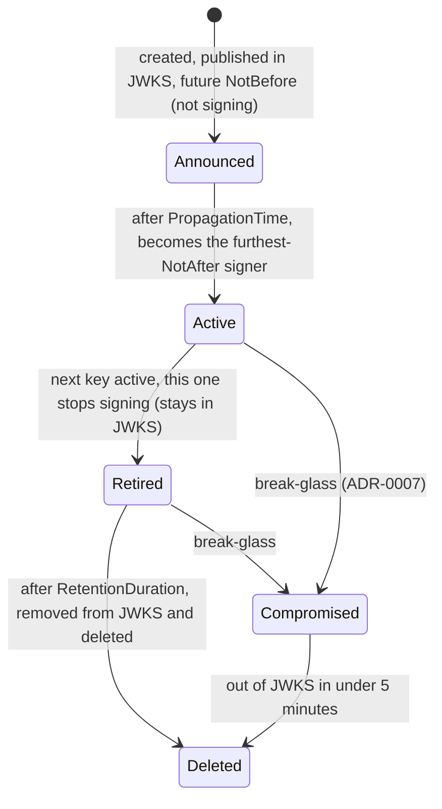
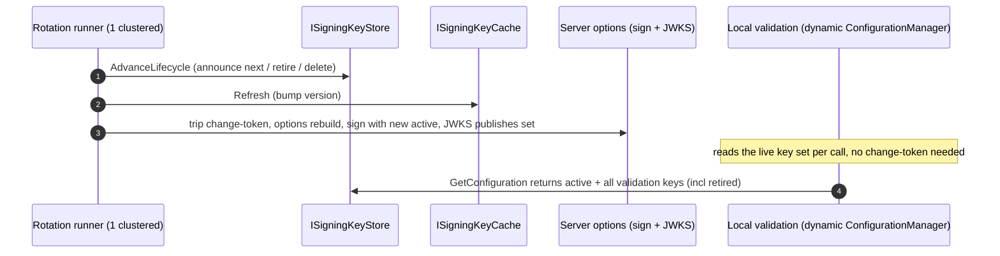
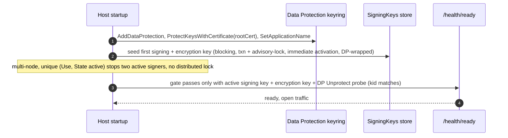
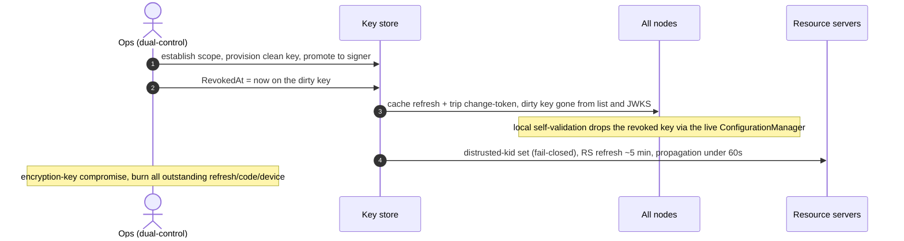
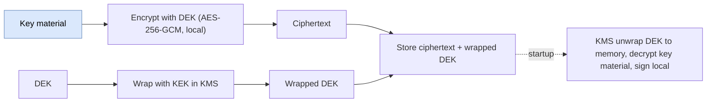

# Key management and rotation (detailed design)

## Purpose and scope

OpenIddict ships no key store and no automatic rotation: signing keys are registered
in code and a change means redeploying. This subsystem builds what is missing, the way
the commercial engines do it, but no-restart and cloud-agnostic: a key store, a rotation
lifecycle, the three separate keyrings, envelope encryption at rest, per-tier key-scope
isolation, a bootstrap and disaster-recovery sequence, and a break-glass path. It is the
most sensitive subsystem in the product; key material never leaves the store or a
sanctioned destination.

In scope: the signing/encryption key store and cache, the no-restart integration seam
(the custom `IOptionsMonitor` for signing/JWKS and the custom `IConfigurationManager` for
local self-validation), the rotation state machine, the encryption-credential lifecycle,
envelope encryption and the optional HSM-sign adapter, key-scope isolation, the
bootstrap/DR sequence, break-glass, store access, and key observability.

Out of scope, referenced not redefined: the `SigningKeys` and `DataProtectionKeys`
schema (02, the SSOT); the JWE `alg`/`enc` pins, the no-symmetric-signing-key startup
self-check, and the per-tenant inferred issuer (04); the numeric SLO table (14); the
`SubjectDek` crypto-shred consumer (03/13); and the break-glass *operational policy*
(authorized personnel, KEK custody) which is deferred to ADR-0007/0009 ratification.

## Decisions realized

| Decision | What this design applies |
|---|---|
| ADR-0011 | No-restart rotation via a custom `IOptionsMonitor<OpenIddictServerOptions>` + `ISigningKeyStore` + TTL cache; rolling-restart and `IOptionsMonitorCache.Clear()` rejected |
| ADR-0005 | Signing and encryption credentials have separate lifecycles; encryption retention floor covers live JWEs; RS256 baseline, ES256 config-selectable |
| ADR-0006 | Cloud-agnostic credential-source ports with a DB default; envelope encryption is the signing default, sign-in-HSM an optional adapter; DR restores keys + keyring + root cert together |
| ADR-0007 | Break-glass: a dirty key out of JWKS in under 5 minutes; scope-before-act; dual-control on revoke/purge; signing vs encryption compromise handling |
| ADR-0012 | Bootstrap sequence (DP keyring before first key), auto-seed the first key with immediate activation, `ProtectKeysWithCertificate` default, restore-both |
| ADR-0033 | One keyset per running instance; pool-group (Pool) vs tenant (Silo) `KeyScope`; scope-aware store with a centralized predicate; the Pool-shared-keyset accepted risk |
| ADR-0009 / ADR-0021 | No static store secret (least-privilege / workload identity); every access audited; the rotation monitor is a catalogued version-sensitive seam with a per-bump contract test |
| ADR-0039 / ADR-0049 | Break-glass triggers the fail-closed distrusted-kid module (owned by 10) for RS propagation under 60s; the shared-Pool-key mitigation (RS validates signature + issuer + audience + tenant) |

## OpenIddict facts this design is built on (verified 7.5, pinned seams)

| Fact | Consequence |
|---|---|
| `AttachSecurityCredentials` signs with `SigningCredentials.First()` (the list is sorted active-first); `AttachSigningKeys` (JWKS) publishes **all** keys and does not filter on `NotBefore` | Publish-before-sign works by keeping keys in the list and controlling order: an announced key (future `NotBefore`) is published in JWKS but is not selected to sign |
| Signing selection is the valid cert with the **furthest `NotAfter`**; a future-`NotBefore` cert does not sign | Rotation loads current + next + retired; "next" gets a future `NotBefore`; "retired" keeps validating |
| `IOptionsMonitor.CurrentValue` is read several times per request (issue #1434) | Making the options dynamic makes both signing and JWKS dynamic for free, with no handler changes; but the credentials must be cached, never `RSA.Create()`-d per read |
| `UseLocalServer` snapshots the signing keys into an **immutable `StaticConfigurationManager`** at startup; `RequestRefresh()` is a no-op | In-process self-validation freezes: a token signed by a freshly rotated key fails with `ID2090` until restart, unless the static manager is replaced (the fix below) |
| `AddSigningCertificate(Stream)` accepts PKCS#12 only | Load bytes explicitly: PFX via `X509CertificateLoader.LoadPkcs12`, PEM via `X509Certificate2.CreateFromPem`, then `new X509SecurityKey(cert)` |
| OpenIddict signs **in-process** (the key must be in memory); there is no native sign-in-HSM | The default is envelope encryption (wrap at rest, unwrap to memory, sign local); HSM-sign is an optional custom-`SignatureProvider` adapter |

These behaviors are catalogued as version-sensitive seams (ADR-0021) and guarded by a
contract-regression test on every OpenIddict bump (7.5 to 7.6 to 8.0; the 8.0 options
base-type change is pre-flagged).

## Component and interface design

### Three keyrings (kept separate)

| Keyring | Protects | Public? | Rotation |
|---|---|---|---|
| Signing (asymmetric) | JWT signatures | public key in JWKS | 90-day with propagation/retention (external clients validate) |
| Encryption (asymmetric) | refresh/code/device JWEs | no | separate lifecycle (below) |
| Data Protection (symmetric AEAD) | cookies, antiforgery, OIDC nonce/correlation | never exposed | automatic ~90-day (only this instance needs it) |

The Data Protection keyring **wraps** `SigningKeys.Data` when `DataProtectKeys = true`.
Pointing Data Protection at a persistent store disables its own at-rest encryption, so
`ProtectKeysWith...` is mandatory, and `SetApplicationName("Nami.Identity")` is fixed and
shared across all nodes (a rename isolates the keyring and loses the old keys).

### Rotation state machine

Four phases, adopted from the commercial parity model: announced (in JWKS, not signing)
then active (promoted to signer) then retired (kept in JWKS for `RetentionDuration`) then
deleted. Defaults: `RotationInterval` 90 days, `PropagationTime` 14 days,
`RetentionDuration` 14 days, `DeleteRetiredKeys = true`, `DataProtectKeys = true`, RS256,
RSA-2048. Propagation exists because clients cache JWKS (12-hour default refresh, 5-minute
floor, out-of-band refresh on an unknown `kid`), so 14 days is a large safety margin. NIST
SP 800-57 puts a private signing key's cryptoperiod at one to three years, so a 90-day
rotation is deliberately conservative for an internet-facing IdP.

Two invariants:

- **X509-only ordering.** OpenIddict's comparator demotes not-yet-valid keys and prefers
  the furthest `NotAfter` **only for `X509SecurityKey`**; two bare `RsaSecurityKey`s
  compare equal, so `.First()` could pick the wrong one. Every rotation signing key must
  therefore be an `X509SecurityKey` (carrying the dates), asserted at startup. An HSM key
  (a bare `RsaSecurityKey`) must be wrapped in an X509 shell or paired with a custom
  active-selection guard.
- **Key #1 immediate activation.** At genesis there is no active key and nothing cached to
  protect, so propagation is vacuous and the first key activates immediately;
  announce-before-sign applies from key #2. (`InitializationDuration` is a multi-node sync
  window, not an activation skip.)

### The no-restart integration seam (spike-proven)

Rotation is dynamic on both the issuing side and the local-validation side, with no
restart. The seam was validated end to end in the A-2 spike (V19).

- **Signing / JWKS.** A custom `IConfigureOptions<OpenIddictServerOptions>` adds the
  cached credentials to `SigningCredentials`, and a custom
  `IOptionsChangeTokenSource<OpenIddictServerOptions>` is tripped on rotation. Because the
  handlers read `context.Options.SigningCredentials` and `CurrentValue` is re-resolved per
  request, the next token signs with the new active key and JWKS publishes the new set,
  with no restart and no handler changes (the maintainer-endorsed issue-#1434 seam).
- **Local self-validation.** `UseLocalServer`'s frozen `StaticConfigurationManager` is
  replaced by a custom non-static `IConfigurationManager<OpenIddictConfiguration>` whose
  `GetConfigurationAsync` returns the **live key set** on every call (the active signing
  key plus **all** validation keys, including retired, per the validate-by-any-`kid`
  rule). It is installed via an `IPostConfigureOptions<OpenIddictValidationOptions>` that
  sets `Configuration = null` and swaps in the dynamic manager, and it must be registered
  **after** `AddValidation()` so it post-configures last. This is the mechanism that lets
  a token signed by a just-rotated key self-validate in-process without restart; the
  server change-token alone does not refresh local validation.

The key store and cache sit behind ports: `ISigningKeyStore` exposes
`LoadAsync(scope, ct)` (active + announced + retired for the scope) and
`AdvanceLifecycleAsync(scope, ct)`; `ISigningKeyCache` caches with a 24-hour steady TTL
that drops to 1 minute when a new key exists, materializing the `SigningCredentials` once
per version via `Lazy<>` and disposing rotated-out certificates. A single clustered
(Quartz) `KeyRotationHostedService` runs `AdvanceLifecycleAsync`, refreshes the cache
(bumping its version), and trips the change-token; other nodes only read.

Three production items the spike deliberately did not cover are carried as build-time
work: making the dynamic `IConfigurationManager` scope-aware via `LoadAsync(scope)`;
excluding a break-glass-revoked key from the validation set; and the TTL/`Lazy` cache
(the spike rebuilds per call, which does not hold at scale).

### Encryption credential lifecycle (separate from signing)

Because access tokens are plain JWTs (`DisableAccessTokenEncryption`) but refresh tokens,
authorization codes, and device codes stay JWE, an encryption credential is always
required and must never be retired on the signing schedule. Its retention floor is
`max(refresh-token lifetime ~8h, device-code lifetime, other JWE lifetimes)` plus a
margin, and a hard guard refuses to un-register an encryption `kid` while a live JWE could
still reference it.

### Envelope encryption and the optional HSM-sign adapter

The default is **envelope encryption**: the private key is wrapped at rest by a KEK (the
Data Protection keyring on-premises, or a cloud KMS key), unwrapped into memory, and
signed locally; the app holds only the wrapped key and the KEK never leaves the KMS.
Cloud adapters map to each provider (Azure `wrapKey`/`unwrapKey`, AWS
`GenerateDataKey`/`Decrypt`, GCP `Encrypt`/`Decrypt`). Sign-in-HSM (the key never leaves
the HSM) is an optional adapter via a custom `SignatureProvider` (`ICryptoProvider`, the
preferred seam) or an `RSAKeyVault` RSA subclass; either accepts KMS round-trip latency
for a smaller blast radius, and must respect the X509-ordering invariant above. The
application never calls a cloud SDK directly; the ports are `ISigningCredentialSource`,
`IEncryptionCredentialSource`, `ISecretResolver`, and `IDataProtectionKeyStore`, default
DB-backed, and every cloud adapter must provide versioning, soft-delete/recovery,
purge-protection, at-rest encryption, and access auditing.

### Key-scope isolation

Each running instance serves exactly one keyset, asserted at startup. A Pool deployment
shares one **pool-group** keyset across the tenants in the group; a Silo tenant has its
own keyset in its own database. `SigningKeys.KeyScope` is `pool-group` or `tenant`, and
`LoadAsync` must filter by scope through a predicate centralized in one adapter (a unit
test asserts no query omits scope); a store serving multiple scopes carries RLS on
`(KeyScope, TenantId)`, the same defense-in-depth the token store has (ADR-0033 F2).

The `KeyScope` vocabulary reconciles with the data tier: `Tenants.KeyScope` (`own` /
`pool-group`) records a tenant's isolation *choice*, while `SigningKeys.KeyScope`
(`tenant` / `pool-group`) tags the *key* — a Silo tenant's `own` choice produces
`tenant`-scoped keys. Because a pool-group signature is shared, it is **not** a tenant
boundary at the resource server: isolation there is by issuer plus the `tenant` claim
(and RLS), and the resource server must validate signature **and** issuer **and** audience
**and** tenant (ADR-0049). Pool tenants sharing a keyset is an accepted risk (a leaked
pool-group key affects the whole group); tenants needing crypto-isolation choose Silo, and
Security ratifies the risk before GA.

### Store access, provider selection, patterns, and libraries

The adapter is selected by `KeyManagement:Provider`
(`Database` default / `AzureKeyVault` / `AwsKmsSecrets` / `GcpKmsSecret` /
`HashiCorpVault`) through the shared `CloudProviderSelector`. Store access uses no static
long-lived secret: a least-privilege DB user on-premises, or per-platform workload
identity in cloud, with only `get`/`unwrap`/`wrap` at runtime; `purge`/`delete` are never
runtime rights (they are break-glass, two-approver, outside the identity-service runtime).
Every store access is audited (ADR-0008), and key-rotation, key-purge, and token
issued/revoked events commit synchronously in-transaction.

Libraries are all permissive (ADR-0026): ASP.NET Core Data Protection (+ its EF Core store),
`X509Certificate2`/`X509SecurityKey` from the BCL, and the optional cloud SDKs (Azure
Key Vault, AWS KMS, GCP KMS, Vault) confined to their adapter packages; the OSS
`RSAKeyVaultProvider` (MIT) is the reference for the HSM path. A commercial rotation
component exists but is not used (OSS-only). Patterns applied (ADR-0066): **Strategy**
(provider selection), **Adapter** (per-cloud KMS/HSM), **Ports and Adapters** (credential
sources), **State** (rotation lifecycle), **Cache-aside** (`ISigningKeyCache`), and a
single clustered **scheduled job** (the rotation runner).

## Data touchpoints (schema is 02)

`SigningKeys` (control-plane, `Id`=kid PK, `Use`/`Algorithm`/`State`, `Data`/`DataProtected`,
`NotBefore`/`NotAfter`/`RetiresAt`/`DeletesAt`/`RevokedAt`, `KeyScope`/`TenantId`, with a
unique `(Use, State)` where active preventing two active signers) and `DataProtectionKeys`
(the `IDataProtectionKeyContext` keyring that wraps `SigningKeys.Data`) are defined in 02;
this design references them and owns behavior only. The keyring master key governed here is
also what wraps the per-subject `SubjectDek` DEKs (02), so its custody must stay consistent
with the crypto-shred dependency (03/13).

## Runtime flows

Rotation lifecycle:

No-restart rotation, both sides:

Bootstrap cold start (chicken-and-egg: the DP keyring must work before the first signing
key exists):

Break-glass (dirty key out of JWKS in under 5 minutes):

Envelope wrap/unwrap:

## Bootstrap and disaster recovery

The cold-start order is fixed: the Data Protection keyring initializes first
(`ProtectKeysWithCertificate(rootCert)` by default, DPAPI or a cloud vault as optional
adapters), then `KeyRotationHostedService.StartAsync` seeds the first signing and
encryption keys in a transaction under an advisory-lock/unique-constraint (so only one
node seeds), immediate-activated and DP-wrapped, and only then does readiness pass and
traffic open. First-key minting is done by the app identity, mitigated by a mandatory
bootstrap audit event (who, when, `kid`); dual-control applies to revoke/purge/rotate-out,
not to bootstrap.

Disaster recovery must **restore all three together** — `SigningKeys`,
`DataProtectionKeys`, and the `rootCert` protector — with an identical `SetApplicationName`,
covering the pool-group key and each Silo key. Deleting a Data Protection key is
irreversible and is not the same as revoking it: a revoked DP key still unwraps old
payloads (it merely stops protecting new ones), but a deleted one loses everything it
wrapped (the signing-key blob, cookies, reference-token payloads) permanently. A DP key is
therefore never hard-deleted while it still wraps live data; a suspected-bad DP key is
treated as a compromise (rotate and re-wrap), only ever soft-deleted under
purge-protection. The failure mode this guards against is
specific and verified: if the keyring or `rootCert` is lost while `SigningKeys` survives,
ASP.NET Data Protection **silently regenerates** a new key on keyring load (not at
per-payload `Unprotect`), an undecryptable key is skipped rather than throwing, and the
result is that all old tokens and sessions silently break. So the readiness probe asserts
the active `kid` **matches the expected persisted `kid`** (a bare Protect/Unprotect
round-trip would pass on a freshly regenerated key and mask the loss), and the DR-restore
validation runs the probe with `DisableAutomaticKeyGeneration()` so a missing protector
fails loudly — scoped to DR only, so it does not block a legitimate empty-ring cold-start
seed. Targets are RTO under 15 minutes and RPO under 5 minutes per store, with the DP
keyring the strictest (RPO near zero); the exact numbers are an Ops ratification item. A DR
drill runs quarterly and after every key-infrastructure change, with the pass criterion
that tokens and cookies issued before the restore still validate after it.

## Break-glass

The SLO is a compromised key out of the JWKS in under 5 minutes. The runbook establishes
scope first (a pool-group key, a single Silo tenant, or the global keyring = system-wide),
then provisions a clean key and promotes it (skipping propagation), sets `RevokedAt` on the
dirty key, refreshes the cache and trips the change-token so the key disappears from the
list and JWKS on every node with no restart, un-registers the dirty certificate, and
force-evicts the JWKS/discovery caches. Local self-validation drops the revoked key through
the live `IConfigurationManager` (not the change-token). Resource-server propagation is
under 60 seconds via the fail-closed distrusted-kid module (the Redis-backed set, its
in-process L1 cache, and the ~5-minute resource-server refresh are owned by the
revocation-propagation design, 10); the break-glass step here is the **trigger** that sets
`RevokedAt`, refreshes the cache, and trips the change-token. A signing-key compromise
means tokens stop validating once the key leaves JWKS (bounded by
the 15-minute access-token TTL; issued JWTs are not retroactively un-trusted by JWKS
alone); an encryption-key compromise means every outstanding refresh token, authorization
code, and device code is treated as burned and revoked. Mass-revoke and purge are
two-approver dual-control, audited on the hash-chain, and the KEK/DP keyring is rotated if
wrapped material is suspected.

## Observability

Key-health metrics: a `key_rotations` counter, a `keys_loaded` gauge, and a
`signing_key_days_to_expiry` observable gauge with a low-value alert routing to the
key-rotation runbook; a JWKS-availability burn alert pages (JWKS down breaks all
verification). The rotation runner emits a last-successful-run heartbeat, alerting when
stale beyond two intervals. JWKS and discovery are output-cached and tag-evicted on
rotation (the output cache and its Redis backplane are owned by 10; they are about a
quarter of traffic and effectively free from
cache). The JWKS-availability SLO is 99.99%; the full numeric SLO table is owned by 14.

## Security considerations

- Key material is the most sensitive asset: it is encrypted at rest (envelope or DP-wrap),
  never logged, and never placed in an unsanctioned destination; `rootCert` bytes never
  enter the repo.
- No static store secret; runtime rights are `get`/`unwrap`/`wrap` only, never
  `purge`/`delete`.
- The no-symmetric-signing-key invariant and the JWE `alg`/`enc` pins are asserted at
  startup (04); this design must ensure seeded and rotated keys are asymmetric so the
  invariant holds.
- A pool-group signature is not an isolation boundary; the resource-server
  signature+issuer+audience+tenant validation is a non-negotiable mitigation (ADR-0049).
- Every provisioning, rotation, revoke, and purge is audited; revoke/purge is dual-control.

## Testing strategy

- **No-restart rotation:** signing uses the active key, JWKS contains announced + active +
  retired, and nothing restarts.
- **The seam contract regression (per OpenIddict bump):** the paired T3b/T3c test — the
  change-token alone fails local self-validation with `ID2090` (tripwire), and the dynamic
  `IConfigurationManager` makes a new-key token self-validate with no restart — plus the
  overlap-window check (old and new tokens both validate).
- **Bootstrap:** an empty DB and empty ring seed exactly one signing and one encryption key
  even under concurrent multi-node start; readiness fails before and passes after; an
  auto-seeded token validates.
- **DR restore-both:** a token/cookie issued before the restore validates after; the
  negative case (missing keyring) is detected via `DisableAutomaticKeyGeneration()`, never
  silently regenerated.
- **Readiness probe:** asserts the active `kid` matches the expected persisted `kid`, not a
  bare round-trip.
- **Distrusted-kid trigger:** revoking a key sets `RevokedAt` and drops it from the live
  validation set; the cross-node propagation and fail-closed behavior are verified in 10.
- **X509-only ordering:** a startup assertion rejects a non-X509 rotation signing key.
- **Cache correctness:** `CurrentValue` read many times per request does not regenerate a
  key each time (the `Lazy` cache holds).

## Open and build-time items

- **Production seam residuals:** the dynamic `IConfigurationManager` made scope-aware via
  `LoadAsync(scope)`; break-glass key removal from the validation set; the TTL/`Lazy` cache
  in place of the spike's rebuild-per-call.
- **Deferred to GA (Pre-GA checklist):** the formal cryptoperiod (ISMS sign-off; NIST 1-3y
  verified, 90d conservative); RTO/RPO targets, the DR runbook, and the per-adapter
  capability matrix (Ops, ADR-0006); the `rootCert`/KEK provisioning and rotation ceremony
  and per-environment cloud-protector adapter (Ops, ADR-0012); the Pool-shared-keyset
  accepted risk (Security, ADR-0033); the break-glass authorized-personnel list and
  multi-node reload automation (Security, ADR-0007) and the secret-store purge holder and
  two-approver process (ADR-0009).
- **Deferred post-v1:** a FIPS 140-3-validated crypto mode (no ADR yet).

## References

- ADRs: ADR-0011 (no-restart rotation), ADR-0005 (encryption credential lifecycle),
  ADR-0006 (DR / cloud-agnostic key material), ADR-0007 (key-compromise break-glass),
  ADR-0012 (key bootstrap and DR sequence), ADR-0033 (key-scope isolation), ADR-0009
  (secret-store access), ADR-0021 (seam catalogue), ADR-0039 (break-glass RS propagation),
  ADR-0049 (shared-key mitigation), ADR-0004 (8h refresh ceiling), ADR-0008 (audit),
  ADR-0018 (Silo connection), ADR-0031 (clustered rotation timer), ADR-0026 (OSS licenses).
- Design docs: [02 data](02-data.md) (`SigningKeys` / `DataProtectionKeys` schema),
  [04 core protocol](04-core-protocol.md) (JWE pins, self-check, inferred issuer),
  [01 foundations](01-foundations.md) (ports, `CloudProviderSelector`, readiness),
  [03 audit](03-audit.md) (the `SubjectDek` crypto-shred consumer), [14 observability]
  (the numeric SLO table).
- [Architecture](../architecture/README.md): components (the key-management subsystem),
  runtime view 3 (no-restart key rotation).
- Verification: the A-2 no-restart-rotation spike (V19) and the NIST cryptoperiod
  primary-source check (V16).
- [Pre-GA ratification checklist](../PRE-GA-RATIFICATION-CHECKLIST.md).
