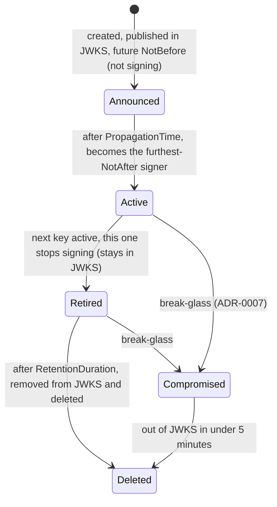
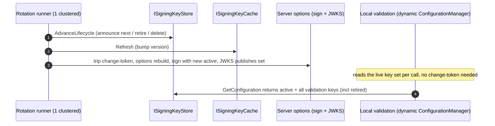
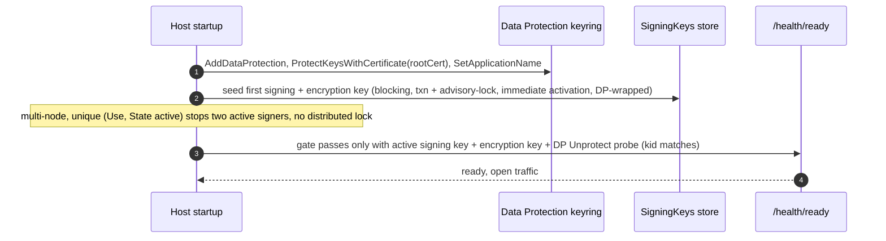
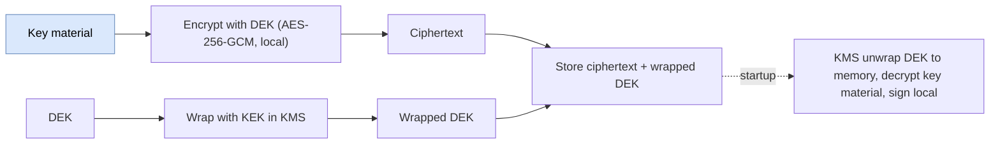
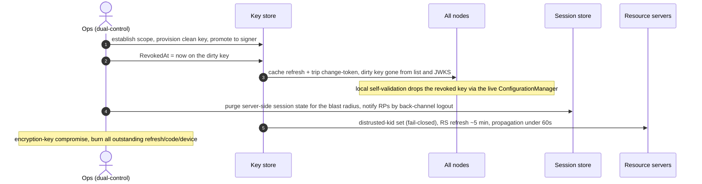

# Key management and rotation (detailed design)

## 1. Decisions realized

| Decision | What this design applies |
|---|---|
| ADR-0011 | No-restart rotation via the #1434 seam (framework options monitor + custom `IConfigureOptions<OpenIddictServerOptions>` + custom change-token source) + `ISigningKeyStore` + TTL cache; rolling-restart and `IOptionsMonitorCache.Clear()` rejected. Nami does **not** write the monitor: see ADR-0011 for the four things `OpenIddictServerConfiguration` would skip |
| ADR-0005 | Signing and encryption credentials have separate lifecycles; encryption retention floor covers live JWEs; RS256 baseline, ES256 config-selectable, EdDSA off |
| ADR-0006 | Cloud-agnostic credential-source ports with a DB default; envelope encryption is the signing default, sign-in-HSM an optional adapter; DR restores keys + keyring + root cert together; RPO monitored continuously, not only at the drill |
| ADR-0007 | Break-glass: a dirty key out of JWKS in under 5 minutes; scope-before-act; server-side session purge for the blast radius; dual-control plus IR notification on mass-revoke |
| ADR-0012 | Bootstrap sequence (DP keyring before first key), auto-seed the first key with immediate activation, `ProtectKeysWithCertificate` default, restore-both |
| ADR-0033 | One keyset per running instance; pool-group (Pool) vs tenant (Silo) `KeyScope`; scope-aware store with a centralized predicate; the cache keyed by scope as well as version; the Pool-shared-keyset accepted risk |
| ADR-0009 / ADR-0021 | No static store secret (least-privilege / workload identity); every access audited; the rotation monitor is a catalogued version-sensitive seam with a per-bump contract test |
| ADR-0039 / ADR-0049 | Break-glass triggers the fail-closed distrusted-kid module (owned by 13) for RS propagation under 60s; the shared-Pool-key mitigation (RS validates signature + issuer + audience + tenant) |
| ADR-0015 (ref) | The **admin-access** break-glass is a different mechanism from the **key-compromise** break-glass owned here; they are not interchangeable |

## 2. Purpose and scope

OpenIddict ships no key store and no automatic rotation: signing keys are registered
in code and a change means redeploying. This subsystem builds what is missing, the way
the commercial engines do it, but no-restart and cloud-agnostic: a key store, a rotation
lifecycle, the three separate keyrings, envelope encryption at rest, per-tier key-scope
isolation, a bootstrap and disaster-recovery sequence, and a break-glass path. It is the
most sensitive subsystem in the product; key material never leaves the store or a
sanctioned destination.

In scope: the signing/encryption key store and cache, the no-restart integration seam
(the #1434 seam for signing/JWKS and the custom `IConfigurationManager` for
local self-validation), the rotation state machine, the encryption-credential lifecycle,
envelope encryption and the optional HSM-sign adapter, key-scope isolation, the
bootstrap/DR sequence, break-glass, store access, and key observability.

Out of scope, referenced not redefined: the `SigningKeys` and `DataProtectionKeys`
schema (02, the SSOT); the JWE `alg`/`enc` pins, the no-symmetric-signing-key startup
self-check, and the per-tenant inferred issuer (04); the minimal access-token claim set
that plain-JWT access tokens require (09); the numeric SLO table (19); the
`SubjectDek` crypto-shred consumer (03/17); and the break-glass *operational policy*
(authorized personnel, KEK custody) which is deferred to ADR-0007/0009 ratification.

## 3. Interfaces and contract

### 3.1 OpenIddict facts this design is built on (verified 7.5, pinned seams)

| Fact | Consequence |
|---|---|
| `AttachSecurityCredentials` signs with `SigningCredentials.First()` (the list is sorted active-first); `AttachSigningKeys` (JWKS) does not filter on `NotBefore` | Publish-before-sign works by keeping keys in the list and controlling order: an announced key (future `NotBefore`) is published in JWKS but is not selected to sign |
| JWKS publishes every key **whose algorithm is a supported RSA or ECDSA signing algorithm**; the handler skips the rest with a log line, and filters on nothing else | "Publish all" is precisely bounded: an unsupported-algorithm key silently never reaches JWKS while still sitting in the options list |
| The sort **prefers a symmetric key over everything else** | Load-bearing, not hygiene: a symmetric signing key would be chosen to sign and, having no supported JWKS algorithm, would never be published, so tokens would be signed by a key no client can find. See the invariant in 5.3 |
| Signing selection is the valid cert with the **furthest `NotAfter`**; a future-`NotBefore` cert does not sign | Rotation loads current + next + retired; "next" gets a future `NotBefore`; "retired" keeps validating |
| Startup throws when **all** signing credentials are X509-backed and **none** is currently valid, and the same for encryption credentials | Because X509-only is our own invariant (5.3), this guard is always live for us: the registered set must always contain at least one currently-valid certificate, so a set of only announced keys fails startup |
| The published `kid` is **inferred** when the key carries none: the certificate thumbprint for an X509 key, a truncated modulus for a bare RSA key | `SigningKeys.Id` is declared to be the kid, so the key identifier must be set explicitly; otherwise the published `kid` diverges from the store's primary key and breaks revoke-by-kid, the distrusted-kid set (13), and log correlation |
| `IOptionsMonitor.CurrentValue` is read several times per request (issue #1434) | Making the options dynamic makes both signing and JWKS dynamic for free, with no handler changes; but the credentials must be cached, never `RSA.Create()`-d per read |
| `UseLocalServer` snapshots the signing keys into an **immutable `StaticConfigurationManager`** at startup; `RequestRefresh()` is a no-op | In-process self-validation freezes: a token signed by a freshly rotated key fails with `ID2090` until restart, unless the static manager is replaced (5.2) |
| `AddSigningCertificate(Stream)` accepts PKCS#12 only | Load bytes explicitly: PFX via `X509CertificateLoader.LoadPkcs12`, PEM via `X509Certificate2.CreateFromPem`, then `new X509SecurityKey(cert)` |
| OpenIddict signs **in-process** (the key must be in memory); there is no native sign-in-HSM | The default is envelope encryption (wrap at rest, unwrap to memory, sign local); HSM-sign is an optional custom-`SignatureProvider` adapter |

These behaviors are catalogued as version-sensitive seams (ADR-0021) and guarded by a
contract-regression test on every OpenIddict bump (7.5 to 7.6 to 8.0; the 8.0 options
base-type change is pre-flagged). The first six rows were read at the engine's own source
rather than taken from a summary, because each one changes what gets built.

### 3.2 Ports

`ISigningKeyStore` exposes `LoadAsync(scope, ct)` (active + announced + retired for the
scope) and `AdvanceLifecycleAsync(scope, ct)`. `ISigningKeyCache` materializes the
`SigningCredentials` once per cache version via `Lazy<>`, with a 24-hour steady TTL that
drops to 1 minute while a new key exists, and disposes rotated-out certificates.
`ISigningCredentialSource` and `IEncryptionCredentialSource` supply the materialized
credentials that the `IConfigureOptions` adds to the options; in the reference
implementation `ISigningKeyCache` **fulfils both**, so they are a role seam rather than a
second component to build. `IDataProtectionKeyStore` persists and loads the Data
Protection keyring that wraps the key `Data`. `ISecretResolver` (01) resolves the store
credential itself.

**The two `ISigningKeyStore` signatures, stated here 2026-08-05.** This section named both
members and neither return type until that date, which is not enough to write the port from.
The shapes below are reconciled from the external design corpus this layer was built against,
and they are now this design's own.

| Member | Parameters | Returns |
|---|---|---|
| `LoadAsync` | `KeyScope`, `CancellationToken` | `Task<IReadOnlyList<KeyRecord>>` |
| `AdvanceLifecycleAsync` | `KeyScope`, `CancellationToken` | `Task` |

`Task` here differs from the `ValueTask` the audit ports use ([03](03-audit.md) section 3),
and that is not a contradiction. No decision in this repository rules on which task type a
port takes. Each store reaches a database on nearly every call, so a synchronous completion
is not the common case that `ValueTask` exists to serve.

**What is still missing, so this port cannot be written yet.** Two gaps, both enumerated on
2026-08-05 rather than estimated.

1. **`KeyRecord` has no members stated in this repository.** The corpus states them only in
   its digest layer, which is not its implementer source, and it writes database types rather
   than C# ones with no nullability marked. Its `TenantId` is a string where section 4 of
   [02](02-data.md) declares the column `uuid NULL`. So the member list needs writing here
   against that schema, not transcribing.
2. **`KeyScope` has no C# form anywhere.** Searched both trees on 2026-08-05 for
   `enum KeyScope`, `class KeyScope`, and `KeyScope.` with no definition returned. It appears
   only as a parameter type and as the column vocabulary `pool-group` or `tenant`, given in
   section 4 of [02](02-data.md). Whether it is an enum is open. So is how the C# type spans
   the two vocabularies section 8 below reconciles, since `Tenants.KeyScope` reads `own` where
   `SigningKeys.KeyScope` reads `tenant`.

Both are per-port work owned here. Closing them is what unblocks the port, and
[`../BUILD-PLAN.md`](../BUILD-PLAN.md) carries the queue entry.

### 3.3 Three keyrings (kept separate)

| Keyring | Protects | Public? | Rotation |
|---|---|---|---|
| Signing (asymmetric) | JWT signatures | public key in JWKS | 90-day with propagation/retention (external clients validate) |
| Encryption (asymmetric) | refresh/code/device JWEs | no | separate lifecycle (5.4) |
| Data Protection (symmetric AEAD) | cookies, antiforgery, OIDC nonce/correlation | never exposed | automatic ~90-day (only this instance needs it) |

The Data Protection keyring **wraps** `SigningKeys.Data` when `DataProtectKeys = true`.
Pointing Data Protection at a persistent store disables its own at-rest encryption, so
`ProtectKeysWith...` is mandatory, and `SetApplicationName("Nami.Identity")` is fixed and
shared across all nodes (a rename isolates the keyring and loses the old keys; on a
platform with deployment slots, a swap that does not share the ring is a mass logout).

## 4. Data and structure

`SigningKeys` (control-plane, `Id`=kid PK, `Version`, `Use`/`Algorithm`,
`IsX509Certificate`, `Data`/`DataProtected`, `State`,
`NotBefore`/`NotAfter`/`RetiresAt`/`DeletesAt`/`RevokedAt`, `KeyScope`/`TenantId`,
`Created`, with a unique `(Use)` where active preventing two active signers) and
`DataProtectionKeys` (the `IDataProtectionKeyContext` keyring that wraps `SigningKeys.Data`)
are defined in 02; this design references them and owns behavior only. Two column
semantics govern the behavior here: `Data` is the **authoritative** key material and every
other column is operational, and `RevokedAt` is **orthogonal to `State`**, so a compromise
is a timestamp rather than a fifth state value. The keyring master key governed here is
also what wraps the per-subject `SubjectDek` DEKs (02), so its custody must stay consistent
with the crypto-shred dependency (03/17).

## 5. Behaviour

### 5.1 Rotation state machine

Four phases, adopted from the commercial parity model: announced (in JWKS, not signing)
then active (promoted to signer) then retired (kept in JWKS for `RetentionDuration`) then
deleted. Defaults: `RotationInterval` 90 days, `PropagationTime` 14 days,
`RetentionDuration` 14 days, `DeleteRetiredKeys = true`, `DataProtectKeys = true`, RS256,
RSA-2048.



Two notes on reading that diagram, both of which an implementer would otherwise get wrong:

- **`Compromised` is a transition, not a stored state.** The schema's `State` is
  `announced | active | retired | deleted` and a compromise is recorded by setting
  `RevokedAt` (section 4). Adding a fifth `State` value contradicts 02.
- **The announced-to-active cutover is not instantaneous at the `NotBefore` second.**
  Promotion takes effect the next time the options are re-resolved through the custom
  `IOptionsMonitor`, so the rotation runner trips a refresh around the window rather than
  relying on wall-clock arrival.

A worked timeline at the defaults, which is what makes the two windows concrete:

| Day | Event | Key A | Key B |
|---|---|---|---|
| 0 | A created and announced (in JWKS, not signing) | announced | |
| 14 | A's `NotBefore` arrives, A becomes the signer | **active** | |
| ~90 | B created and announced, 14 days ahead of use | active | announced |
| ~104 | B becomes active; A stops signing but stays in JWKS | retired | **active** |
| ~118 | A passes `RetentionDuration`, leaves JWKS and is deleted | deleted | active |

So each key signs for about 90 days with a 14-day warm-up and a 14-day cool-down, and the
sets always overlap: there is no instant at which a client holds no usable key.

Propagation exists because clients cache JWKS. The 12-hour figure is the default automatic
refresh interval of the Microsoft IdentityModel configuration manager, with a 5-minute
floor and an out-of-band refresh when an unknown `kid` appears, so 14 days is a wide margin
**against that stack**; a relying party built on a different stack may cache differently,
which is why the margin is deliberately generous rather than tuned. Retention exists
because already-issued tokens must keep validating after their key stops signing.

The state names map onto NIST SP 800-57: pre-activation is announced, active is active,
deactivated is retired, compromised is break-glass, and destroyed is deleted. The reason
there are two windows at all is that standard's distinction between **originator usage**
(signing) and **recipient usage** (verifying): the two do not end at the same moment, and
propagation and retention are exactly the gap between them. NIST puts a private signing
key's cryptoperiod at one to three years, so a 90-day rotation is deliberately
conservative for an internet-facing IdP.

### 5.2 The no-restart integration seam (spike-proven)

Rotation is dynamic on both the issuing side and the local-validation side, with no
restart. The seam was validated end to end in the A-2 spike (V19).



- **Signing / JWKS.** A custom `IConfigureOptions<OpenIddictServerOptions>` adds the
  cached credentials to `SigningCredentials`, and a custom
  `IOptionsChangeTokenSource<OpenIddictServerOptions>` is tripped on rotation. Because the
  handlers read `context.Options.SigningCredentials` and `CurrentValue` is re-resolved per
  request, the next token signs with the new active key and JWKS publishes the new set,
  with no restart and no handler changes (the maintainer-endorsed issue-#1434 seam).
- **Local self-validation.** `UseLocalServer`'s frozen `StaticConfigurationManager` is
  replaced by a custom non-static `IConfigurationManager<OpenIddictConfiguration>` whose
  `GetConfigurationAsync` returns the **live key set** on every call (the active signing
  key plus **all** validation keys, including retired, per the validate-by-any-`kid`
  rule). It is installed via an `IPostConfigureOptions<OpenIddictValidationOptions>` that
  sets `Configuration = null` and swaps in the dynamic manager, and it must be registered
  **after** `AddValidation()` so it post-configures last. This is the mechanism that lets
  a token signed by a just-rotated key self-validate in-process without restart; the
  server change-token alone does not refresh local validation.

A single clustered (Quartz) `KeyRotationHostedService` runs `AdvanceLifecycleAsync` on
roughly a ten-minute poll, refreshes the cache, and trips the change-token; other nodes
only read and let their own TTL bring them level. The **cache key is `(scope, version)`,
not version alone**, even though one deployment serves a single scope: the monitor stays
version-only, but a cache that cannot name its scope cannot be reasoned about if a
deployment ever serves more than one (ADR-0033).

#### Reference implementation, quoted from the A-2 harness

**This is quoted from a run this repository did not perform.** The code below is quoted from
the design corpus's spike-A-2 harness (`RotationHost.cs`, `RotationTests.cs`; verdict in its
verification record V19, `net10.0`, OpenIddict 7.5.0). It
is **evidence of what executed**, not code this repository compiled: Nami has no harness tree
and cannot re-run it here.

**What was actually verified, stated precisely because the loose version of this claim was
wrong.** Every quoted line was compared against the harness on 2026-08-01. **53 of the 54
match the harness character for character once the enclosing indentation is removed**, since
the corpus lifted class members and registration lines out of their surrounding block. The
54th is `// ...`, which is the corpus's own elision marker between two registration lines and
is not harness code. So this is verbatim modulo indentation and one marked elision, which is
a weaker claim than "byte for byte" and is the true one. Where the spike simplified something,
the delta is stated below rather than edited into the snippet, because silently rewriting a
block labelled verbatim destroys the only thing it is good for. The `doc 18` pointers inside
the comments are the corpus's own numbering and resolve here to section 5.3.

**1. The live configuration manager.** This is the whole of the local-validation fix: it
reads the store on every call rather than snapshotting.

```csharp
// ===== THE FIX (long-term, OSS): a NON-static, live ConfigurationManager for local self-validation.
// Replaces the StaticConfigurationManager that UseLocalServer installs. GetConfigurationAsync returns
// a config whose SigningKeys reflect the CURRENT key store on every call -> a token signed by a
// freshly-rotated key self-validates with NO restart and NO change-token dance. =====
public sealed class DynamicKeyConfigurationManager(KeyStore store, Uri issuer) : IConfigurationManager<OpenIddictConfiguration>
{
    public Task<OpenIddictConfiguration> GetConfigurationAsync(CancellationToken cancellationToken)
    {
        var config = new OpenIddictConfiguration { Issuer = issuer };
        foreach (var key in store.ValidationKeys) config.SigningKeys.Add(key);   // ALL live keys (doc 18 §0: validate by any kid)
        return Task.FromResult(config);
    }
    public void RequestRefresh() { }   // no cache to invalidate; always live
}
```

**2. Swapping the frozen manager, and the ordering that makes it work.**

```csharp
// Runs after OpenIddict's own post-configure; swaps the frozen static manager for the live one.
public sealed class SwapValidationConfigManager(KeyStore store) : IPostConfigureOptions<OpenIddictValidationOptions>
{
    public void PostConfigure(string? name, OpenIddictValidationOptions options)
    {
        options.Configuration = null;   // drop the static config that would build a StaticConfigurationManager
        options.ConfigurationManager = new DynamicKeyConfigurationManager(store, new Uri("http://localhost/"));
    }
}
```

```csharp
oi.AddValidation(o => { o.UseLocalServer(); o.UseAspNetCore(); });
// ...
if (useDynamicValidationManager)   // THE FIX - registered after AddValidation so it post-configures last
    services.AddSingleton<IPostConfigureOptions<OpenIddictValidationOptions>, SwapValidationConfigManager>();
```

**3. The signing side, which is the issue-#1434 seam.**

```csharp
// Custom IConfigureOptions reading the mutable store (re-runs on every options rebuild).
public sealed class ConfigureServerSigning(KeyStore store) : IConfigureOptions<OpenIddictServerOptions>
{
    public void Configure(OpenIddictServerOptions options) => options.SigningCredentials.Add(store.Active);  // sign with active
}

// Change-token source for the SERVER options (the #1434 seam).
public sealed class ServerChangeTokenSource(KeyStore store) : IOptionsChangeTokenSource<OpenIddictServerOptions>
{
    public string Name => Options.DefaultName;
    public IChangeToken GetChangeToken() => store.Token;
}
```

```csharp
// The #1434 seam: supply signing keys via IConfigureOptions + a change-token source.
services.AddSingleton(keys);
services.AddSingleton<IConfigureOptions<OpenIddictServerOptions>, ConfigureServerSigning>();
services.AddSingleton<IOptionsChangeTokenSource<OpenIddictServerOptions>, ServerChangeTokenSource>();
```

**4. How the store trips the token, which is the part prose keeps losing.** The store owns a
`CancellationTokenSource` and swaps it; there is no method on the change-token source to call.

```csharp
public IChangeToken Token => new CancellationChangeToken(_cts.Token);
```

```csharp
// Promote 'next' to active, KEEP the old key in the validation set (overlap window) - doc 18 §0.
public void Rotate(SigningCredentials next)
{
    lock (_lock) { _all.Add(next); _active = next; }
    var old = Interlocked.Exchange(ref _cts, new CancellationTokenSource());
    old.Cancel();   // trips options-reload so SIGNING picks up the new active key
}
```

```csharp
public SigningCredentials Active => _active;
public SigningCredentials Current => _active;   // alias (existing tests)
// ALL non-deleted keys for validation (retired keys stay until their tokens expire).
public IReadOnlyList<SecurityKey> ValidationKeys { get { lock (_lock) return _all.Select(c => c.Key).ToList(); } }
```

**What the harness asserted**, so the claims above are read as results rather than intentions:
the baseline key both signs and self-validates; after a rotation with no restart a token
signed by the new key self-validates; a token signed by the **retired** key still validates,
which is the overlap window; and, with the swap deliberately not registered, signing stays
dynamic while local self-validation freezes with `ID2090`. That last case is a **tripwire**
rather than a bug report: if a future OpenIddict refreshes `UseLocalServer` by itself, that
assertion flips to success and this design is revisited.

**Three wrong turns are recorded here because the correct code alone does not prevent them.**
Each was written by someone reading a prose description of this same seam.

- **`IOptionsChangeTokenSource<T>` has no `Trigger()`.** It declares `Name` and
  `GetChangeToken()` and nothing else, and because it is covariant in `TOptions` a method
  taking one is not expressible. The trip belongs to the store, as in snippet 4.
- **Do not hand-build an `IOptionsMonitor<OpenIddictServerOptions>`.** The harness registers
  the **framework** monitor plus a custom `IConfigureOptions` and change-token source. A
  hand-constructed options instance skips `OpenIddictServerConfiguration`, which sorts the
  handlers and the credentials, generates a missing `kid`, and fills the validation
  parameters, so every `SetOrder` in this design stops meaning anything and JWKS loses its
  `kid`. If a custom monitor is ever unavoidable it must obtain options through
  `IOptionsFactory.Create(name)`, never `new`.
- **`OpenIddictValidationOptions` has no `SetIssuer`.** `Issuer` is a property there; the
  builder method exists only on the server side (design [05](05-resource-server-validation.md)).

**Spike versus production, and the issuer line is the one to read twice.** Production
replaces the harness's in-memory `KeyStore` with the `ISigningKeyStore` port plus
`ISigningKeyCache` and its TTL, makes the manager scope-aware through `LoadAsync(scope)`
(ADR-0033), and excludes a revoked key from the validation set during break-glass (5.7). The
seam itself, the non-static `IConfigurationManager`, the `IPostConfigureOptions` swap, and the
`IConfigureOptions` plus change-token pair, is unchanged. **The two lines that must not be
copied** are the pinned `Issuer` in snippet 1 and the `new Uri("http://localhost/")` in
snippet 2: a non-null `Configuration.Issuer` wins over the per-request base URI and pins
issuer validation to one value, so a token carrying the per-tenant `iss` fails the server's
own self-validation. The contract that replaces them, including why a null issuer is safe
only inside a request, is in the seam catalogue at rows S4a and S4b
([22](22-openiddict-seam-catalogue.md)), and the per-tenant issuer itself is design
[04](04-core-protocol.md).

### 5.3 Key-selection invariants

Three invariants govern which key signs, and all three exist because of how the engine
sorts and validates its credential list rather than as house style.

- **X509-only ordering.** The comparator demotes not-yet-valid keys and prefers the
  furthest `NotAfter` **only for `X509SecurityKey`**; two bare `RsaSecurityKey`s compare
  equal, so `.First()` could pick either. Every rotation signing key must therefore be an
  `X509SecurityKey` carrying the dates, asserted at startup. An HSM key (a bare
  `RsaSecurityKey`) must be wrapped in an X509 shell or paired with a custom
  active-selection guard, never left to the comparator.
- **No symmetric signing key.** The comparator prefers a symmetric key ahead of every
  asymmetric one, so a stray symmetric credential would win `.First()` and sign, while
  JWKS would never publish it because its algorithm is not a supported publishing
  algorithm. The result would be valid-looking tokens that no client can verify. Startup
  fails fast instead (the self-check lives in 04).
- **At least one currently-valid certificate, always.** Because every rotation key is
  X509, the engine's own startup guard is permanently armed: a set in which no certificate
  is valid right now throws rather than starting. Announcing a key never means replacing
  the active one in the list, only appending to it.

A fourth rule is about consistency rather than selection: the `kid` used for signing, the
`kid` published in JWKS, and the `kid` offered to validation must all come from the **same
store version**, or a client will fetch a JWKS that does not contain the key that signed
the token it is holding. That is the failure the single materialization per cache version
prevents, and it is why the published `kid` must be set explicitly rather than inferred
(3.1).

### 5.4 Encryption credential lifecycle (separate from signing)

Access tokens are plain JWTs (`DisableAccessTokenEncryption`), but refresh tokens,
authorization codes, and device codes are JWE and **that cannot be turned off**, so an
encryption credential is always required and must never be retired on the signing
schedule. Retiring it early does not degrade anything gracefully: every live artifact that
references the removed `kid` becomes permanently undecryptable, which logs users out and
fails redemptions.

The retention floor is `max(refresh-token lifetime, device-code lifetime, other JWE
lifetimes)` plus a margin. The refresh token's 8-hour ceiling (ADR-0004) is the binding
term because the device code is deliberately short, so in practice the floor is about
8 hours plus margin. A hard guard refuses to un-register an encryption `kid` while a live
JWE could still reference it. Encryption keys follow the same scope model as signing keys,
differing only in volume: the shorter retention means more encryption keys overlap within
a scope at any moment (ADR-0033 F49).

Because the access token is a plain readable JWT once encryption is disabled for it, its
claim set has to stay minimal; that claim contract is 09's, and this design only supplies
the credential that makes the choice safe.

### 5.5 Bootstrap and cold start

The Data Protection keyring wraps the signing key's `Data`, so it must be usable **before**
any signing key can be read or written. On an empty database, a fresh deploy or a DR
restore, that is a chicken-and-egg problem and the order is fixed.



Three details in that sequence carry the weight:

- **The seeding runs in `StartAsync`, which blocks startup, not in a
  `BackgroundService.ExecuteAsync`, which does not.** Choosing the wrong one opens traffic
  before any key exists and the failure looks like an intermittent signing error rather
  than a startup bug.
- **Key #1 activates immediately.** At genesis there is no active key and nothing cached to
  protect, so propagation is vacuous; announce-before-sign applies from key #2.
  (`InitializationDuration` is a multi-node convergence window, not an activation skip.)
- **The seed lock must not deadlock a cold start.** A transaction plus an advisory lock or
  the unique `(Use)` where-active index is enough to stop two nodes minting two active
  signers; the reference model is deliberately lock-free precisely to avoid a cold-start
  deadlock, so our stricter guard has to be verified against many nodes starting at once.

First-key minting is done by the app identity, mitigated by a mandatory bootstrap audit
event (who, when, `kid`); dual-control applies to revoke, purge, and rotate-out, not to
bootstrap.

### 5.6 Envelope encryption and the optional HSM-sign adapter

The default is **envelope encryption**: the private key is wrapped at rest by a KEK (the
Data Protection keyring on-premises, or a cloud KMS key), unwrapped into memory, and
signed locally; the app holds only the wrapped key and the KEK never leaves the KMS.



The two signing postures trade the same four properties, and the choice is a compliance
question rather than a technical one:

| | Sign in the HSM | Unwrap and sign locally (default) |
|---|---|---|
| Where the key lives | never leaves the HSM | decrypted into process memory |
| Latency per signature | a KMS round trip | microseconds, local |
| Ceiling | the KMS request quota | CPU |
| If the process is compromised | the attacker can request signatures while access lasts, but cannot exfiltrate the key | the attacker can steal the raw key |

Cloud adapters map onto each provider for both postures:

| Operation | Azure Key Vault | AWS KMS | GCP KMS |
|---|---|---|---|
| Wrap and unwrap the DEK (envelope) | `wrapKey` / `unwrapKey` | `GenerateDataKey` / `Decrypt` | `Encrypt` / `Decrypt` |
| Sign in the HSM (key not exportable) | `sign` / `verify` | `Sign` / `Verify` | `AsymmetricSign` |
| Hardware tier | Managed HSM, FIPS 140-3 Level 3 | KMS hardware-backed keys, not exported in plaintext | Cloud HSM |

Sign-in-HSM is reached through a custom `SignatureProvider` (`ICryptoProvider`, the
preferred seam, registered on the crypto-provider factory) or through an RSA subclass that
delegates to the vault (`RSAKeyVaultProvider`, MIT, is the OSS reference), and either way it
must respect the X509-ordering invariant of 5.3, since a bare RSA key carries no dates. The application never calls a cloud SDK directly; the ports are
`ISigningCredentialSource`, `IEncryptionCredentialSource`, `ISecretResolver`, and
`IDataProtectionKeyStore`, default DB-backed.

### 5.7 Break-glass (key compromise)

The SLO is a compromised key out of the JWKS in under 5 minutes. This is the
**key-compromise** path; the **admin-access** break-glass for when the IdP itself cannot
authenticate anyone is a different mechanism with different custody (ADR-0015), and the two
must not be conflated in a runbook.



The runbook **establishes scope first**, since a pool-group key affects every tenant in the
group, a Silo key affects one tenant, and the global Data Protection keyring is a
whole-system incident. It then provisions a clean key and promotes it, skipping propagation
and accepting that a client which has only just cached the JWKS will fail until it
refreshes. It sets `RevokedAt` on the dirty key, refreshes the cache and trips the
change-token so the key disappears from the list and from JWKS on every node with no
restart, un-registers the dirty certificate, and force-evicts the JWKS and discovery
caches. Local self-validation drops the revoked key through the live
`IConfigurationManager` rather than the change-token. Retention is **skipped** for a dirty
key: it is deleted rather than kept in JWKS, which is the opposite of a normal rotation.

Server-side session state is purged for the blast radius, and because sessions were purged
the relying parties are notified through the interim back-channel logout (ADR-0007 step 5,
ADR-0003). Resource-server propagation is under 60 seconds via the fail-closed
distrusted-kid module (the Redis-backed set, its in-process L1 cache, and the ~5-minute
resource-server refresh are owned by the revocation-propagation design, 13); the
break-glass step here is the **trigger** that sets `RevokedAt`, refreshes the cache, and
trips the change-token.

A signing-key compromise means tokens stop validating once the key leaves JWKS, bounded by
the 15-minute access-token TTL, since issued JWTs are not retroactively un-trusted by JWKS
alone. An encryption-key compromise means every outstanding refresh token, authorization
code, and device code is treated as burned and revoked, because the attacker may be able to
decrypt them. Mass-revoke and purge are two-approver dual-control with an incident-response
notification, audited on the hash-chain, and the KEK or DP keyring is rotated as well if
wrapped material may have been exposed.

A worked example, at the defaults: a leak of key A is found at 09:00. Under dual control,
Ops provisions key C and promotes it, sets `A.RevokedAt = 09:01`, refreshes the cache with
the TTL lowered for the emergency, and by roughly 09:02 every node's JWKS carries only B
and C while local self-validation has already dropped A because the live manager reads the
store rather than waiting on a change-token. Tokens signed by A fail from that point, the
audit chain records proposer, approver, and grant, and resource servers converge inside the
60-second distrusted-kid SLO.

### 5.8 Disaster recovery

Disaster recovery must **restore all three together**: `SigningKeys`,
`DataProtectionKeys`, and the `rootCert` protector, with an identical
`SetApplicationName`, covering the Data Protection keyring, the pool-group key set, and
**each** Silo key set separately. Losing any one of the three loses the keys.

Deleting a Data Protection key is irreversible and is not the same as revoking it: a
revoked DP key still unwraps old payloads and merely stops protecting new ones, while a
deleted one loses everything it wrapped (the signing-key blob, cookies, reference-token
payloads) permanently. A DP key is therefore never hard-deleted while it still wraps live
data; a suspected-bad DP key is treated as a compromise, rotated and re-wrapped, and only
ever soft-deleted under purge-protection. Soft-delete and purge-protection are required on
**all three key layers**, the signing certificate, the encryption certificate, and the key
that wraps the keyring, not on the Data Protection keyring alone (ADR-0006).

The failure mode this guards against is specific, and it has **two shapes that log
completely differently**. Both end the same way, with Data Protection regenerating a key on
keyring load rather than failing, so every previously issued cookie and every DP-wrapped
signing key becomes undecryptable. Only one of them is quiet, and it is the quiet one that
sets the design.

Measured on .NET 10.0.9 (see the [Data Protection regeneration probe](../kb/notes/data-protection-keyring-regeneration-log-levels.md)
for the method and the full output):

| Shape | What survives | Log profile per load | Detectable from logs |
|---|---|---|---|
| **A. Protector lost, keyring rows survive** | the keyring XML, not the root that encrypts it | **11 x `Error`** (`XmlKeyManager: An exception occurred while processing the key element '<key id="..." />'`), **2 x `Warning`** (`DefaultKeyResolver: Key {...} is ineligible to be the default key because its CreateEncryptor method failed after the maximum number of retries`), then `Information` `XmlKeyManager: Creating key {kid} ...` | **yes, loudly and unambiguously** |
| **B. Keyring itself lost** | the key store, not the ring | `Trace 1 / Debug 12 / Information 2 / Warning 0 / Error 0` | **no** |

**Shape B is byte-for-byte indistinguishable from a legitimate first boot.** The probe ran
an empty-ring cold start and a wiped-keyring restore and got **identical** level counts and
the same two `Information` lines. That is the whole reason the readiness probe asserts the
active `kid` **matches the expected persisted `kid`** rather than watching logs or running a
protect-and-unprotect round trip: the round trip passes on the freshly regenerated key, and
no log line distinguishes "restored without the ring" from "first pod ever". Only a
comparison against an *expected* value can, because only that carries the knowledge that a
ring was supposed to exist.

Two corrections to what this section previously said, both from the probe. Regeneration is
**not** logged at debug level: `XmlKeyManager: Creating key {kid} with creation date ...` is
at **`Information`** in every case. And shape A does not fail silently at all; it emits
eleven `Error` lines before regenerating, and a subsequent `Unprotect` of an old payload
**throws** `CryptographicException` rather than being skipped. The "skipped rather than
throwing" behaviour is real but belongs to the **key-ring load**, not to per-payload
unprotect, and conflating the two understated how much signal shape A actually gives.

Three countermeasures follow, and they are deliberately layered because no single one
covers both shapes. The readiness `kid`-match gate above is the only detector for **shape B**.
The alert family in [19](19-observability-capacity-slo.md) section 5.8 pages on the shape-A
error and warning lines, which the gate would otherwise catch only at the next pod start.
And the DR-restore validation runs its probe with `DisableAutomaticKeyGeneration()`, so a
missing protector fails loudly, scoped to the DR path only so it does not block a legitimate
empty-ring cold-start seed.

The RTO under 15 minutes and RPO under 5 minutes targets bind to **each store** (keyring,
certificates, operational database, session store) rather than to the system as a whole,
and the exact numbers are an Ops ratification item. RPO is **monitored continuously**, not
only proven at the drill: write-ahead-log archiving lag, last-successful-backup age, and
replication lag are each alerted against the RPO bound of their store, so a backup that has
silently stopped is caught before a disaster rather than during one. A DR drill runs
quarterly and after every key-infrastructure change, with the pass criterion that tokens
and cookies issued before the restore still validate after it, and the runbook documents
the blast radius per token format so an operator can tell what a given loss actually costs.

### 5.9 Key-health observability

This design owns the key-specific instruments; the numeric SLO table itself is 19's. A
`nami.identity.key_rotations` counter, a `nami.identity.keys_loaded` gauge, and a
`nami.identity.signing_key_days_to_expiry`
observable gauge whose low-value alert routes to the key-rotation runbook, so an
approaching expiry is a scheduled task rather than an incident. A JWKS-availability burn
alert **pages**, because JWKS being down breaks every verification everywhere at once; its
SLO is 99.99%. The rotation runner emits a last-successful-run heartbeat and alerts when
that goes stale beyond two intervals, which is the only way a silently dead single runner
becomes visible before a key expires under it. JWKS and discovery are output-cached and
tag-evicted on rotation; that cache and its Redis backplane are owned by 13, and they carry
roughly a quarter of all traffic, so serving them from cache is close to free. RPO
monitoring for the key stores is described with the rest of DR in 5.8.

## 6. Dependencies and wiring

### Patterns applied

Patterns applied (ADR-0066): **Strategy** (provider selection), **Adapter** (per-cloud
KMS/HSM), **Ports and Adapters** (credential sources), **State** (rotation lifecycle),
**Cache-aside** (`ISigningKeyCache`), and a single clustered **scheduled job** (the
rotation runner).

### Registration order

`IConfigureOptions<OpenIddictServerOptions>` and `IOptionsChangeTokenSource<...>` supply
the #1434 seam; `IPostConfigureOptions<OpenIddictValidationOptions>` must be registered
**after** `AddValidation()` so it post-configures last and wins over the static manager.
No static certificate is registered in the protocol host: the custom monitor is the only
credential source. `AddDataProtection().PersistKeysTo...().ProtectKeysWith...()
.SetApplicationName(...)` uses the same application name on every node.

### Store access and provider selection

The adapter is selected by `KeyManagement:Provider`
(`Database` default / `AzureKeyVault` / `AwsKmsSecrets` / `GcpKmsSecret` /
`HashiCorpVault`) through the shared `CloudProviderSelector`. Every adapter, including the
default, must provide versioning, soft-delete with a recovery window, purge-protection,
at-rest encryption, and access auditing; the database adapter meets them through a
soft-delete state column, Data Protection at rest, and the audit log, which is why it is a
real baseline rather than a development stand-in. Store access uses no static long-lived
secret: a least-privilege database user on-premises, or per-platform workload identity in
cloud, with only `get`, `unwrap`, and `wrap` at runtime; `purge` and `delete` are never
runtime rights, being break-glass, two-approver, and outside the identity-service runtime.
Every store access is audited (ADR-0008), and key-rotation, key-purge, and token
issued/revoked events commit synchronously in-transaction.

### Libraries

All permissive (ADR-0026): ASP.NET Core Data Protection with its EF Core store,
`X509Certificate2` and `X509SecurityKey` from the BCL, and the optional cloud SDKs (Azure
Key Vault, AWS KMS, GCP KMS, Vault) confined to their adapter packages. An MIT-licensed
key-vault RSA provider is the reference for the HSM path. A commercial rotation component
implements this same model but is not used, since the policy is OSS-only.

## 7. Error handling, edge cases, invariants

- **No symmetric signing key** and a fixed algorithm (RS256 baseline, ES256
  config-selectable, EdDSA off for interop and library support), asserted at startup (04).
- **X509-only for rotation ordering** (5.3), asserted at startup.
- **At least one currently-valid certificate** in the registered set at all times, since
  the engine's own guard throws otherwise (3.1).
- **Single active signer** per use, enforced by the unique index rather than by
  application logic.
- **Explicit `kid`**, never the inferred thumbprint, so the store's primary key and the
  published identifier are the same string (3.1).
- **Readiness fail-closed**: no traffic without an active signing key, an encryption key,
  and a Data Protection keyring whose probe asserts the expected `kid`.
- **Encryption credential un-register guard**: refused while a live JWE could still
  reference the `kid` (5.4).
- **Materialize and cache, never `RSA.Create()` per read**, since `CurrentValue` is called
  several times per request and re-creating would be both slow and wrong (a different
  random key each time); track and dispose retired certificates to avoid leaking OS
  handles.
- **Runtime least-privilege**: `get`, `unwrap`, `wrap` only; soft-delete and
  purge-protection on all three key layers; every key access audited.
- **Key material never leaves the store**: not into logs, not into chat, not into the
  repository; `rootCert` bytes are provisioned out-of-band.

## 8. Security and multi-tenancy notes

Each running instance serves exactly one keyset, asserted at startup. A Pool deployment
shares one **pool-group** keyset across the tenants in the group; a Silo tenant has its
own keyset in its own database. `SigningKeys.KeyScope` is `pool-group` or `tenant`, and
`LoadAsync` must filter by scope through a predicate centralized in one adapter (a unit
test asserts no query omits scope); a store serving multiple scopes carries RLS on
`(KeyScope, TenantId)`, the same defense-in-depth the token store has (ADR-0033 F2).
Because the scope is fixed by deployment rather than resolved per request, the custom
`IOptionsMonitor` stays version-only while the cache is still keyed by scope as well.

The `KeyScope` vocabulary reconciles with the data tier: `Tenants.KeyScope` (`own` /
`pool-group`) records a tenant's isolation *choice*, while `SigningKeys.KeyScope`
(`tenant` / `pool-group`) tags the *key*, so a Silo tenant's `own` choice produces
`tenant`-scoped keys. Because a pool-group signature is shared, it is **not** a tenant
boundary at the resource server: isolation there is by issuer plus the `tenant` claim
(and RLS), and the resource server must validate signature **and** issuer **and** audience
**and** tenant (ADR-0049). Pool tenants sharing a keyset is an accepted risk (a leaked
pool-group key affects the whole group); tenants needing crypto-isolation choose Silo, and
Security ratifies the risk before GA.

## 9. Testing

The A-2 spike (V19) proved the seam itself; the integration tests below are to build, and
the distinction matters because one of them covers behavior the spike deliberately did not
exercise.

**Spike-proven.** The active key both signs and self-validates (baseline). After a rotation
with no restart, a token signed by the new key self-validates immediately, which is the
SEV-1 fix. In the overlap window both the old-key and new-key tokens self-validate. And the
tripwire: without the fix, signing is dynamic but local self-validation freezes with
`ID2090`, a regression guard that flips if a future OpenIddict refreshes `UseLocalServer`
by itself.

**To build.**

- **No-restart rotation:** signing uses the active key, JWKS contains announced + active +
  retired, and nothing restarts.
- **Cache correctness:** `CurrentValue` read many times per request does not regenerate a
  key each time. This was **not** covered by the spike, whose manager rebuilt its
  configuration on every call, so the `Lazy` behavior is unproven rather than proven.
- **The seam contract regression (per OpenIddict bump):** `AttachSecurityCredentials`
  reads `SigningCredentials.First()`, `AttachSigningKeys` iterates the whole list without a
  `NotBefore` filter, plus the paired tripwire-and-fix validation contract. This is the
  canonical contract-regression item that ADR-0021 extends.
- **Bootstrap:** an empty database and empty ring seed exactly one signing and one
  encryption key even under concurrent multi-node start; readiness fails before and passes
  after; an auto-seeded token validates.
- **DR restore-both:** a token or cookie issued before the restore validates after; the
  negative case (missing keyring) is detected with automatic key generation disabled, never
  silently regenerated.
- **Readiness probe:** asserts the active `kid` matches the expected persisted `kid`, not a
  bare round trip.
- **Distrusted-kid trigger:** revoking a key sets `RevokedAt` and drops it from the live
  validation set; the cross-node propagation and fail-closed behavior are verified in 13.
- **Invariant guards:** a startup assertion rejects a non-X509 rotation signing key, a
  symmetric signing credential, and a set with no currently-valid certificate.

## 10. Open and build-time items

- **Production seam residuals** (two, not three): excluding a break-glass-revoked key from
  the validation set, which the spike only ever added to; and the TTL and `Lazy` cache in
  place of the spike's rebuild-per-call. The third item once carried here, making the
  dynamic `IConfigurationManager` scope-aware, is **resolved and not applicable to v1**:
  the issuer is per-request but keys are per-deployment, so the scope is a constant of the
  instance and `LoadAsync(scope)` differs only between deployments (ADR-0011, ADR-0033
  Option B).
- **Spike-gated upgrade path:** co-hosting several key scopes in one process (per-request
  scope resolution) is not shipped on faith. It requires its own spike plus a cross-scope
  JWKS negative test and a local-self-validation check before it could be considered.
- **Conditional contingency, not an open decision:** if the per-bump contract test ever
  shows the #1434 seam is too fragile to carry, that opens a new ADR to evaluate a
  fallback rather than a silent workaround in this design.
- **Deferred to GA (Pre-GA checklist):** the formal cryptoperiod (ISMS sign-off; NIST 1 to
  3 years verified, 90 days conservative); RTO/RPO targets, the DR runbook, and the
  per-adapter capability matrix (Ops, ADR-0006); the `rootCert` and KEK provisioning and
  rotation ceremony and the per-environment cloud-protector adapter (Ops, ADR-0012); the
  Pool-shared-keyset accepted risk (Security, ADR-0033); the break-glass
  authorized-personnel list and multi-node reload automation (Security, ADR-0007) and the
  secret-store purge holder and two-approver process (ADR-0009); sign-in-HSM versus
  envelope as a compliance choice (Security).
- **Deferred post-v1:** a FIPS 140-3-validated crypto mode (no ADR yet).

## 11. Sources

- ADRs: ADR-0011 (no-restart rotation), ADR-0005 (encryption credential lifecycle),
  ADR-0006 (DR / cloud-agnostic key material), ADR-0007 (key-compromise break-glass),
  ADR-0012 (key bootstrap and DR sequence), ADR-0033 (key-scope isolation), ADR-0009
  (secret-store access), ADR-0021 (seam catalogue), ADR-0039 (break-glass RS propagation),
  ADR-0049 (shared-key mitigation), ADR-0004 (8h refresh ceiling), ADR-0008 (audit),
  ADR-0015 (the distinct admin-access break-glass), ADR-0018 (Silo connection), ADR-0031
  (clustered rotation timer), ADR-0026 (OSS licenses), ADR-0066 (patterns).
- Design docs: [02 data](02-data.md) (`SigningKeys` / `DataProtectionKeys` schema),
  [04 core protocol](04-core-protocol.md) (JWE pins, self-check, inferred issuer),
  [01 foundations](01-foundations.md) (ports, `CloudProviderSelector`, readiness),
  [03 audit](03-audit.md) (the `SubjectDek` crypto-shred consumer),
  [17 erasure](17-erasure-and-data-subject-rights.md) (the crypto-shred saga that destroys
  the DEK), [09 claims](09-federation-and-claims-profile.md) (the minimal access-token
  claim set), [19 observability](19-observability-capacity-slo.md) (the numeric SLO table),
  [13 revocation](13-revocation-propagation-and-caching.md) (the distrusted-kid propagation and the
  JWKS/discovery output cache).
- [Architecture](../architecture/README.md): components (the key-management subsystem),
  runtime view 3 (no-restart key rotation).
- Engine source, read directly for section 3.1: the credential comparator and the
  startup validity guard in the server configuration, the JWKS attach handler's
  algorithm filter, and the key-identifier inference used when a key carries no
  identifier.
- Verification: the A-2 no-restart-rotation spike (V19) and the NIST cryptoperiod
  primary-source check (V16).
- [Pre-GA ratification checklist](../PRE-GA-RATIFICATION-CHECKLIST.md).

---

[Prev: Login, consent, and logout UI](11-login-consent-ui.md) · [Index](README.md) · Next: [Revocation propagation and caching](13-revocation-propagation-and-caching.md)
