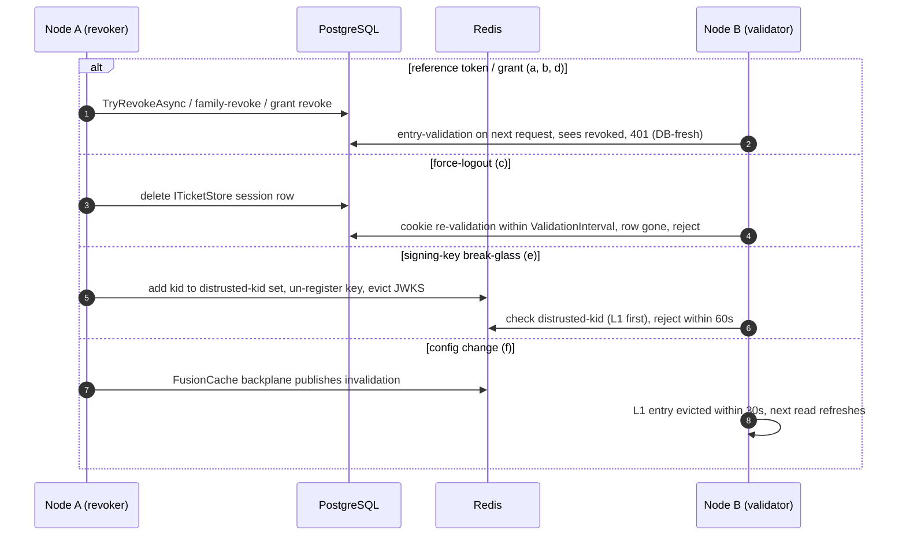
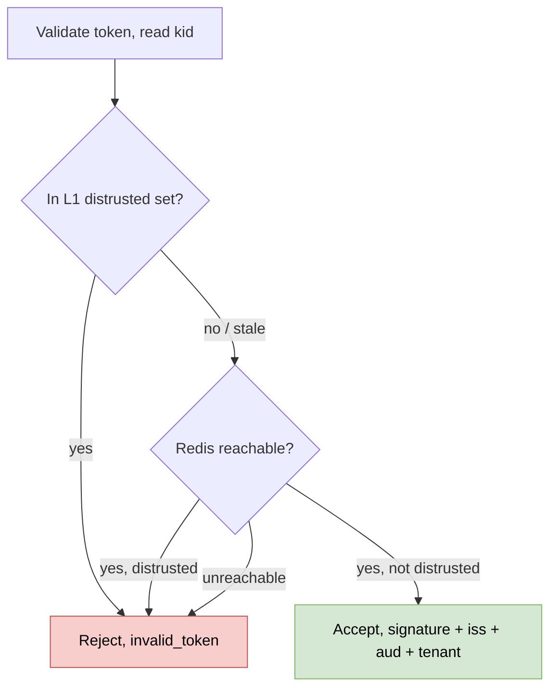

# Revocation propagation and caching (detailed design)

## Purpose and scope

How a revocation performed on one node takes effect on every other node, and how the
caches that could hold stale authorization data are kept coherent. The starting premise
of the original audit finding was wrong, and correcting it is the design: OpenIddict's
entity caches (Application/Scope/Authorization/Token managers) are `TryAddScoped` private
per-request `MemoryCache`s with a local change-token and no `IDistributedCache` and no
cross-node hook, so a stale read cannot outlive a single HTTP request. There is nothing to
invalidate across nodes, and no Redis pub/sub backplane for the manager cache is needed or
built. Revocation freshness is instead solved **per path**, each with the standard
mechanism already present in OpenIddict, ASP.NET Core, or an established library.

This design is largely an **integration layer**. It references the per-path targets owned
elsewhere and owns only the cross-node propagation and cache-coherence over them, plus the
two pieces that live nowhere else: the fail-closed distrusted-kid module (path e) and the
config-cache backplane (path f), and the Redis/FusionCache wiring that foundations left
open. It adds no database tables and emits only audit events already in the catalog.

In scope: the reframe and the six-path model; the distrusted-kid set (owned here, with the
key-management design providing only the break-glass trigger); the config-cache
FusionCache + Redis backplane; the JWKS/discovery output-cache eviction; the fail-open
versus fail-closed discipline; and the Redis/FusionCache wiring.

Out of scope, referenced not redefined: the revocation endpoint, entry-validation flags,
per-client `AccessTokenType`, the introspection result cache, and the 15-minute access TTL
(04); server-side sessions, `ITicketStore` force-logout, `ValidationInterval`, and the
session side of `RevokeBySubjectAsync` (08); the key-break-glass trigger and the RS
validation-key set (12); and the schema (02).

## Decisions realized

| Decision | What this design applies |
|---|---|
| ADR-0039 | Per-path cross-node revocation freshness with **no backplane** for the per-request entity cache; the distrusted-kid module; the config-cache backplane |
| ADR-0040 | Redis is an accelerator, never the sole source of truth; ordinary caches fail open, security checks fail closed; a Redis outage degrades latency, not authentication |
| ADR-0003 / ADR-0004 | Force-logout via `ITicketStore` with the `ValidationInterval` backstop; the 15-minute JWT residual and 30-second reuse leeway as the freshness bounds |
| ADR-0048 / ADR-0049 | Reference-token clients validate via introspection; a shared Pool signature is not a boundary, so the RS validates signature + issuer + audience + tenant |
| ADR-0007 / ADR-0021 | The distrusted-kid module realizes the break-glass eject SLO; the version-sensitive OpenIddict/IdentityModel facts are catalogued seams with a per-bump contract test |
| ADR-0068 (proposed) | A v2 Shared-Signals/CAEP channel may externalize revocation to relying parties as a parallel addition that must not alter the internal enforcement here |

## OpenIddict and IdentityModel facts this design rests on (pinned seams)

| Fact | Consequence |
|---|---|
| The manager entity caches are `TryAddScoped` private `MemoryCache`s, `EntityCacheLimit = 250`, no time-TTL (size-bounded eviction), local change-token, no `IDistributedCache` | A stale entity-cache read dies at the end of the request; no cross-node invalidation is needed for it |
| `EnableTokenEntryValidation` / `EnableAuthorizationEntryValidation` live on the **`.AddValidation()`** builder (not `.AddServer`); enabled, each API request makes a DB call to validate the entry | Paths (a/b/d) are DB-direct and therefore already cross-node-consistent; the cost is DB load, not propagation lag |
| There are **two distinct validator caches**: the client-side `IdentityModel DiscoveryCache` (24h) and the resource-server `ConfigurationManager` JWKS cache (~12h, `AutomaticRefreshInterval`) | Only the RS JWKS cache holds stale *revocation* data (a distrusted `kid`); it is the one addressed by path (e). Do not conflate the two |
| `AutomaticRefreshInterval` defaults to 12h with a 5-minute floor (`MinimumAutomaticRefreshInterval`) enforced by a throw, not a silent clamp; it is a different constant from `RefreshInterval` (5-minute default, 1-second minimum) | Shortening `AutomaticRefreshInterval` to ~5 minutes for break-glass is the lowest legal value, not a workaround |
| Those constants live on `BaseConfigurationManager` in `Microsoft.IdentityModel.Tokens`, pulled transitively via `Microsoft.IdentityModel.Protocols` | Pin `Microsoft.IdentityModel.Protocols >= 8.16.0` and re-verify the constants on each bump (ADR-0021) |

## The six revocation paths

| Path | Freshness needed | Cache holding stale | Mechanism | Owned by |
|---|---|---|---|---|
| (a) access-token revoke | JWT to expiry / reference immediate | the JWT itself | short-TTL 15-min JWT + reference token for sensitive clients | 04 (referenced) |
| (b) refresh-family revoke | immediate on next use | none (DB-direct) | native family-revoke on rotation, DB-fresh | 04 (referenced) |
| (c) force-logout / session | near-immediate | cookie not yet re-validated | `ITicketStore` row-delete + `ValidationInterval` 1-2 min | 06 (referenced) |
| (d) delegated-admin grant revoke | immediate (live check) | none (DB-direct) | `EnableAuthorizationEntryValidation`, DB-fresh | 04/05 (referenced) |
| (e) signing-key break-glass | ≤ 60s (SLO) | RS JWKS cache ~12h | ~5-min RS refresh + fail-closed distrusted-kid set | **this design** |
| (f) client/scope config change | ≤ 30s (SLO) | the config cache you add | FusionCache + Redis backplane | **this design** |

Paths (a)-(d) are DB-direct or expiry-bounded and depend on no cross-node channel; the
hot 10k-CCU token path therefore has **no mandatory synchronous Redis hit**. Redis is a
bounded fast path for the low-traffic paths (e) and (f) only.

### Paths a, b, d (referenced from 04)

The tiered model is a short-TTL JWT validated locally by default, with reference tokens
plus introspection reserved for the clients that need instant revocation. Per-client
`AccessTokenType` (jwt or reference, default jwt) is enforced by the custom
`GenerateTokenContext` handler (04); opting a client into reference forces that client's
resource server onto introspection, because an opaque reference token cannot be validated
locally. The revocation endpoint is single-token native (no cascade); "log out everywhere"
is the separate built `RevokeBySubjectAsync`, and family-revoke by `AuthorizationId` is
native and must not be double-called. `EnableTokenEntryValidation` and
`EnableAuthorizationEntryValidation` (on `.AddValidation()`) make token and grant checks
DB-direct, so a revoke on node A is seen by node B on its next validation with no lag; the
cost is one DB read per validation, measured on the hot path in the capacity design (19).
The introspection result cache (~5 min, owned by 04) is the one caching TTL that trades
directly against revocation freshness, so its value is reconciled against the revocation
SLO rather than set independently.

### Path c (referenced from 08)

Force-logout deletes the session row from the shared `ITicketStore` (PostgreSQL); the
row's absence *is* the revoked state, so the next request on any node fails cookie
re-validation within the 1-2 minute `ValidationInterval`. No backplane is involved.

### Path e: the distrusted-kid module (owned here)

When a signing key is revoked in a break-glass event, tokens it signed must stop
validating fast, but a resource server's `ConfigurationManager` caches the JWKS for about
12 hours. Two mechanisms close that window, and both are owned here (the key-management
design owns only the *trigger*, setting `RevokedAt`, refreshing its cache, tripping the
change-token, un-registering the cert, and evicting JWKS, and references this module):

- The resource-server `AutomaticRefreshInterval` is shortened to about 5 minutes (the
  lowest legal automatic value); on a distrusted-kid signal a resource server may
  additionally call `ConfigurationManager.RequestRefresh()` (whose `RefreshInterval` floor
  is about 1 second) to re-fetch the JWKS on demand. This complements, and does not
  replace, the set below, which enforces the SLO even before any JWKS refresh.
- A Redis-backed **distrusted-kid set** is checked on every validation, **fail-closed**:
  if Redis is unreachable or the answer cannot be confirmed, the `kid` is treated as
  distrusted, not trusted (the classic denylist-fails-open trap, avoided the way CRL/OCSP
  do for certificates). It is served from an in-process `HybridCache` L1 so the happy path
  takes no per-request Redis hit, and cross-node propagation is under 60 seconds.

The set is **not persisted**: it is Redis-only and rebuildable from `SigningKeys.RevokedAt`
(02), so this design adds no table. The JWKS/discovery output cache (`AddOutputCache` with
a Redis backplane, tag-evicted on rotation) is owned here as well; local self-validation
drops a revoked key through the key-management design's live `IConfigurationManager` (12),
not through this set.

### Path f: the config-cache backplane (owned here)

Client/scope/tenant configuration is cached for latency (the per-client CORS provider of
04 reads this same cache), and a config change must reach every node within about 30
seconds. Bare .NET 10 `HybridCache` has no cross-node L1 invalidation (open proposal
dotnet/runtime #125602), so the config cache is **FusionCache plus a Redis backplane**,
which adds the cross-node invalidation and brings built-in stampede protection (a single
concurrent factory) and jittered TTLs. This is the single system of record for that cache;
it is invalidated when a client changes, and a cold refresh lists the applications per
tenant under the Finbuckle ambient context.

## Failure modes

- **Redis pub/sub is at-most-once** (fire-and-forget): it is a fast path only, never the
  sole source of truth, and every path it accelerates is bounded by a TTL or backed by a
  durable store.
- **Fail-open versus fail-closed.** Ordinary performance caches fail open (a miss reads
  through to the durable store at higher latency, never a 5xx); security checks fail closed.
  The distrusted-kid set is fail-closed under this general rule, not as a special
  carve-out (the one deliberate carve-out in the resiliency posture is the email throttle,
  ADR-0038, which is not part of this design). Note the DPoP `jti` replay cache (14) is a
  different pattern again: Redis is its **authoritative L2 store** (a replay set has no DB
  backstop to read through to), so it is fail-closed by necessity, not an accelerator in
  front of a durable source.
- **Redis down.** Paths (a)-(d) do not depend on Redis and stay DB-fresh; path (e) fails
  closed; path (f) degrades to the durable store with a short TTL. The session store is
  durable PostgreSQL and the Data Protection keyring is independent of Redis, so an outage
  degrades latency, not authentication. This is load-tested (no 5xx, higher latency, auth
  continues).

## Wiring (extends the foundations composition)

The foundations design names Redis and FusionCache as phase-later libraries but does not
wire them; this design adds that wiring: the Redis connection (externalized per-deploy
config), FusionCache with its Redis backplane for the config cache, and the `HybridCache`
L1 for the distrusted-kid set. FusionCache (Apache-2.0) is recorded with its license per
ADR-0026. Any new port this introduces (for example a distrusted-key checker) is declared
in its own package, not retro-added to the Phase-01 ports catalog, and Redis is never the
sole source of truth (consistent with the `ITicketStore` principle in 01). The
degraded-mode startup guard (ADR-0043) underpins the fail-closed stance.

## Data touchpoints (schema is 02)

This design defines no tables. It reads `SigningKeys.RevokedAt` (the source of truth the
distrusted-kid set is rebuilt from), the `ServerSideSessions` rows (whose deletion is
force-logout), and the OpenIddict `TenantToken` / `TenantAuthorization` tables (which
entry-validation reads); all are defined in 02. The distrusted-kid set and the config
cache are intentionally non-persistent (Redis plus in-memory); if any persistence were
ever needed it would be raised as an ADR, not settled here.

## Runtime flows

Cross-node revocation, per path (elaborates SAD runtime view 4):

Distrusted-kid check (fail-closed):

## Security considerations

- The distrusted-kid check fails closed; a Redis outage never turns it into an
  accept-all. This is proven by a Redis-down acceptance test.
- A shared Pool signature is not a tenant boundary; the resource server validates
  signature and issuer and audience and the `tenant` claim (ADR-0049), so a revoked key or
  a cross-tenant token is rejected regardless of cache state.
- The JWT path has an inherent 15-minute revocation residual (a self-contained token
  cannot be pulled back mid-life); the tiered model gives reference tokens to the clients
  that cannot tolerate it.
- This design emits only audit events already in the catalog (03): `token_revoked`
  (critical, synchronous), `mass_revoke`, `force_logout`, `key_rotation`, `break_glass`,
  `degraded_mode_enabled`, and `refresh_reuse_detected`. A genuinely new event type would
  be raised into the 03 catalog, not invented here.

## v2 awareness (does not touch v1 enforcement)

A proposed v2 channel (Shared Signals Framework / CAEP as a transmitter, ADR-0068; the
identity-change-events design, 34) would externalize the revocations here to relying
parties as standard Shared-Signals events, and would emit backend integration events
through an outbox from a single handler at the existing back-channel-logout /
session-revoke seam. It is a **parallel addition** for external consumers; it does not
replace or alter the internal per-path enforcement in this design, and v1 stays frozen.

## Testing strategy

- **Cross-node propagation:** a revoke on node A is enforced on node B within the path's
  SLO, the distrusted-kid set within 60 seconds (9.T16), config within 30 seconds (9.T18),
  a reference-token revoke DB-fresh with no lag, and force-logout on the next request.
- **Redis-down fail-closed:** with Redis unreachable, the distrusted-kid check rejects
  (9.T17), and paths (a)-(d) continue DB-fresh.
- **No hot-path Redis:** the 10k-CCU token path issues and validates with Redis down (no
  5xx, latency only).
- **Contract regression (per OpenIddict/IdentityModel bump):** the entity cache is still
  per-request, the entry-validation flags are still on `.AddValidation()`, the
  `AutomaticRefreshInterval` 5-minute floor still holds, and `Microsoft.IdentityModel.Protocols`
  is pinned at or above 8.16.0.

## Open and build-time items

- **SLO numbers deferred:** the concrete propagation-time and cache-TTL targets (the
  ≤60s / ~5-min / 15-min / ≤30s figures are interim design values) are ratified with the
  SLO numeric table and error-budget policy (Product/Ops, ADR-0041, Pre-GA checklist).
- **Break-glass automation sign-off:** the multi-node cache-evict automation designed here
  has its operational sign-off (and the authorized-personnel list) deferred to
  ADR-0007 (Security, Pre-GA checklist), also flagged in 12.
- **Deferred to v2:** the Shared-Signals/CAEP transmitter and the backend event-bus
  (ADR-0068 proposed; the v2 change-event design is not in this layer yet).

## References

- ADRs: ADR-0039 (revocation propagation), ADR-0040 (resiliency / Redis accelerator),
  ADR-0003 (sessions), ADR-0004 (token posture), ADR-0007 (break-glass), ADR-0048
  (introspection), ADR-0049 (resource-server validation), ADR-0021 (seam catalogue),
  ADR-0068 (v2 Shared Signals, proposed).
- Design docs: [04 core protocol](04-core-protocol.md) (revocation endpoint,
  entry-validation, `AccessTokenType`, introspection cache, 15-min TTL), [06 user
  management](08-user-management.md) (sessions, force-logout, `ValidationInterval`), [09
  key management](12-key-management.md) (break-glass trigger, RS validation-key set), [02
  data](02-data.md) (`SigningKeys.RevokedAt`, `ServerSideSessions`), [01 foundations]
  (01-foundations.md) (Redis / cache wiring), [03 audit](03-audit.md) (event catalog).
- [Architecture](../architecture/README.md): runtime view 4 (cross-node revocation),
  cross-cutting (resiliency and overload, the fail-closed carve-outs).
- Verification: the cross-node revocation research (R15); the `AutomaticRefreshInterval`
  floor check (CAT-2 FLAG-6).
- [Pre-GA ratification checklist](../PRE-GA-RATIFICATION-CHECKLIST.md).

---

[Prev: Key management and rotation](12-key-management.md) · [Index](README.md) · Next: [Advanced flows](14-advanced-flows.md)
