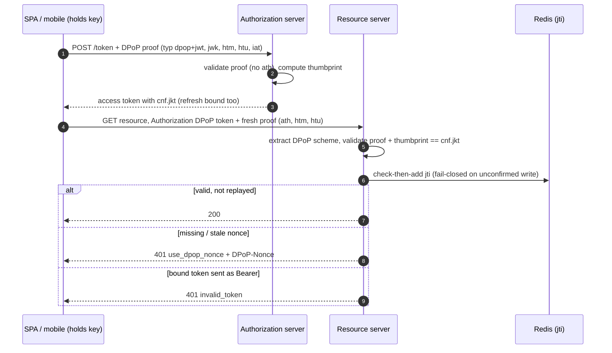
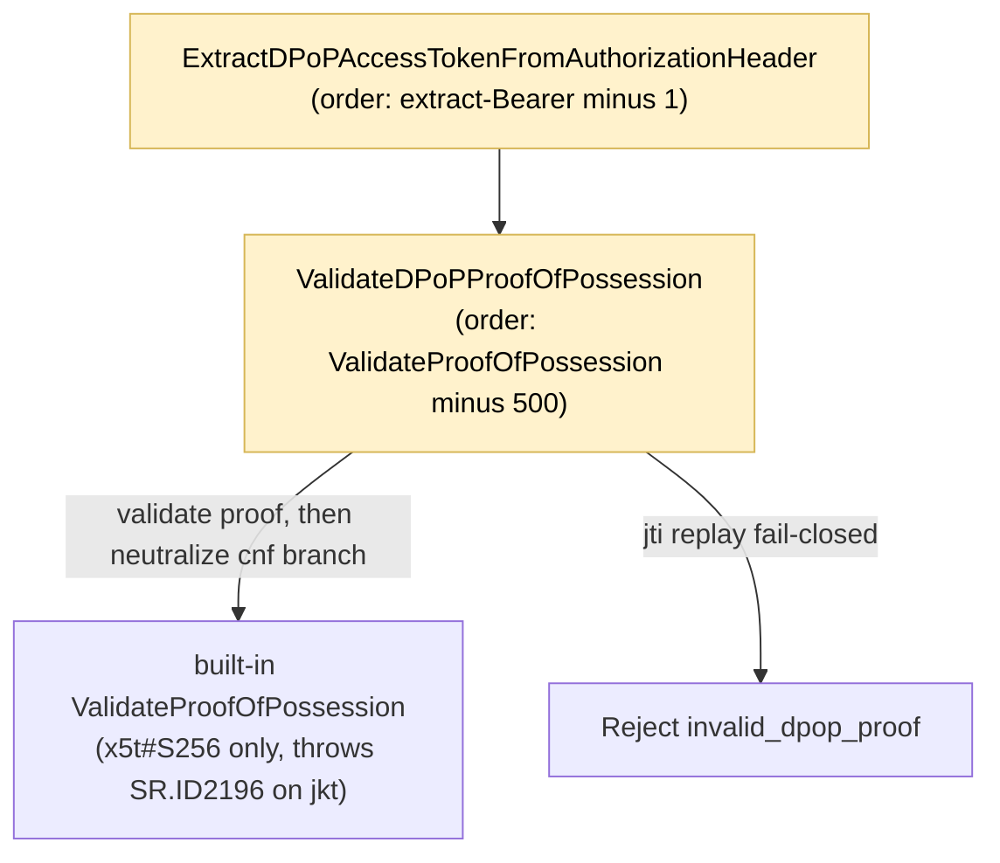
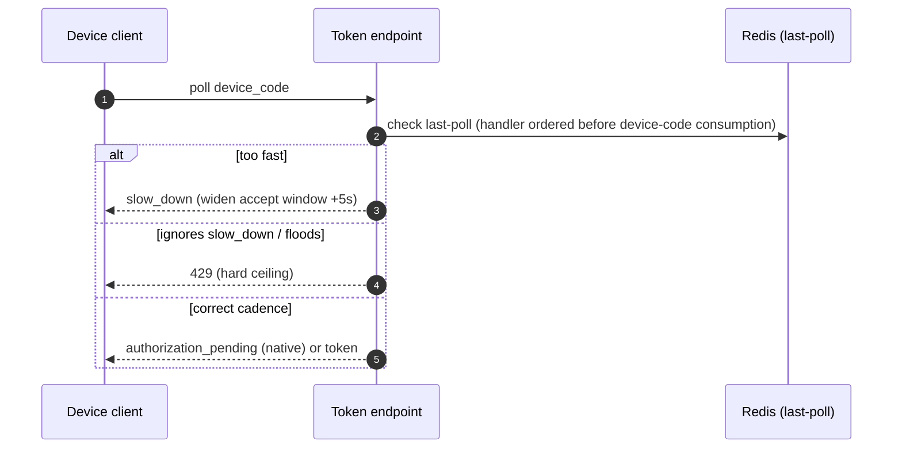

# Advanced flows (detailed design)

## Purpose and scope

The advanced OAuth/OIDC flows beyond the core protocol: what OpenIddict supports
natively (wire and test), what Nami builds, and what is deliberately de-scoped, skipped,
or waiting on the engine roadmap. Most of the matrix is native. The substantial build in
this area is sender-constraint, and it has its own design now
([06](06-sender-constrained-tokens.md)), so what remains here is the backend hardening for
device flow and PAR, the token-exchange grant wiring, and the recorded de-scope and
roadmap decisions.

In scope (owned): the device-flow polling backoff and DoS ceiling; the PAR per-client
enforcement, `request_uri` lifetime, and anti-flood control; the token-exchange grant
wiring; and the de-scope and roadmap decisions.

Out of scope, referenced not redefined: **both sender-constraint mechanisms**, DPoP and
mTLS, with their handlers, replay cache, packages, and the `IDPoPReplayCache` port
([06](06-sender-constrained-tokens.md), and 04 for the issuance-side wiring); the
token-exchange **`act`**/initiator resolution and confused-deputy handling (07);
**step-up** authentication, which the design corpus lists as its largest build but which is already
allocated across the producer (08), the enforcement (07), and the UI (11), this design
owns **none** of it; the device and step-up **UI** pages and the back-channel logout
fan-out (11); and the core native-verify flows (04). It adds no database tables.

## Decisions realized

| Decision | What this design applies |
|---|---|
| ADR-0014 | The flow scope matrix: native-verify versus build versus de-scope versus skip versus roadmap-wait. The sender-constraint half of that matrix is realized in 06 |
| ADR-0021 | The device-flow and PAR handler orders are pinned and contract-tested per bump, with decommission markers; the archetypal build-interim seam is sender-constraint, in 06 |
| ADR-0042 | Device-flow `slow_down`/429 backoff and the PAR anti-flood ceiling |
| ADR-0048 | Introspection stays native; the enrich-or-inactive rule for a bound token is 06's |
| ADR-0049 | Every advanced flow runs in the resolved tenant scope; the RS validates signature + issuer + audience + tenant, and `cnf` composes on top after per-tenant validation |
| ADR-0013 / ADR-0019 (ref) | Step-up (producer 08 / enforcement 07 / UI 11) and back-channel logout (08/10) are referenced, not built here |
| ADR-0056 / ADR-0064 (proposed) | The revisit triggers for the de-scoped items: a FAPI 2.0 message-signing tier (JAR/JARM/RAR) and an MCP AS-role resource-indicator policy layer |

## Flow support matrix

| Flow / standard | Status | Where |
|---|---|---|
| Auth code + PKCE, client credentials, refresh, `iss` (9207), Resource Indicators (8707), exact-match redirect_uri, introspection, revocation, end-session | native, verify + test | 04 (referenced) |
| Device authorization (RFC 8628) | native grant + **built backoff hardening** | owned here |
| PAR (RFC 9126) | native + **built anti-flood/enforcement hardening** | owned here |
| Token exchange (RFC 8693) | native grant wire + **`act` logic built in 07**; **`may_act` de-scoped** as a security decision (ADR-0014) | grant here, logic 07 |
| mTLS-bound tokens (RFC 8705) | native (confidential and M2M) | 06, and 04 for the wiring |
| **DPoP (RFC 9449)** | **built, both issuance and validation** | **06** |
| Back-channel logout | built interim (front-channel is dead) | 11 / 13 (referenced) |
| Step-up (`acr`/`amr`/`max_age`/`prompt`) | built | 08 / 07 / 11 (referenced) |
| JAR (RFC 9101) | de-scoped (revisit if FAPI) | this doc |
| JARM, RAR (RFC 9396), EdDSA, front-channel logout / `check_session_iframe` | de-scoped | this doc |
| CIBA | skipped | this doc |
| Dynamic Client Registration (RFC 7591/7592) | roadmap-wait (OpenIddict 8.0); interim Admin CRUD | this doc / 15 |

## DPoP and mTLS (owned by 06)

Both sender-constraint mechanisms moved to [06](06-sender-constrained-tokens.md) when
that design was written: the DPoP issuance and validation handlers with their order
anchors, the replay cache and its fail-closed carve-out, the freshness modes and the
nonce, the client key contract, the cross-site-scripting caveat and why the
backend-for-frontend is the real mitigation, and the native mTLS binding. This design
keeps only what the advanced flows themselves need: a sender-constrained token composes
**after** per-tenant validation (05), and a resource server that introspects a bound
token must receive its binding in the response or an inactive result (04, ADR-0048).

## Device flow (RFC 8628): backend hardening

The grant is native (`AllowDeviceAuthorizationFlow`, `SetDeviceAuthorizationEndpointUris`
plus `SetEndUserVerificationEndpointUris`, a native `user_code` of 12 characters by
default and a 10-minute lifetime, native `authorization_pending`/`expired_token`), and the
verification endpoint needs its `Enable*EndpointPassthrough` (the exact builder method name,
inferred by analogy with the other `Enable*EndpointPassthrough` methods as
`EnableEndUserVerificationEndpointPassthrough`, is not confirmed in the checked-in reference
tree, verify on pin, contract-tested per bump, ADR-0021) or the approval page (11) never runs. The gap this design closes: OpenIddict emits **no `interval`** and
**never returns `slow_down`**, so a client falls back to 5-second polling with no
server-enforced backoff and no rate limit on unauthenticated device-code polling. The
hardening is layered:

- Emit `interval=5` via an `ApplyDeviceAuthorizationResponseContext` handler.
- Enforce `slow_down` in a `HandleTokenRequestContext` handler for the device-code grant,
  ordered **before** OpenIddict consumes the device code (right after `ExtractTokenRequest`,
  order 100_000): a Redis last-poll store keyed by `device_code` rejects a too-fast poll
  and widens the accept window by 5 seconds each time (RFC 8628 §3.5), while a correct
  cadence falls through to the native `authorization_pending`.
- Cap the token endpoint with a hard **429** via `Microsoft.AspNetCore.RateLimiting`, the
  real DoS control against a client that ignores `slow_down`.

A contract test asserts both that `interval` is emitted and that the backoff handler is
ordered before device-code consumption (ADR-0021).

## PAR (RFC 9126): backend hardening

PAR is native (since OpenIddict 6.1, `SetPushedAuthorizationEndpointUris`); the endpoint
and seam are owned by 04. This design owns the hardening: a client must hold
`Permissions.Endpoints.PushedAuthorization` to call `/par` (missing permission is a reject
unless endpoint permissions are ignored); per-client force-PAR is
`Requirements.Features.PushedAuthorizationRequests` (`"ft:par"`) on the descriptor (not a
client-level `RequirePushedAuthorizationRequests()`), with the native
`ValidatePushedAuthorizationRequestsRequirement` rejecting a direct authorize; the
`request_uri` lifetime (`RequestTokenLifetime`, default 1 hour) is shortened to 5-600
seconds (RFC 9126); and an anti-flood control rate-limits `/par` per client (and per IP
for public clients) with a bounded maximum of outstanding `request_uri`s, returning 429 on
breach (the same 429 mechanism as the device endpoint).

## Token exchange (RFC 8693): grant wiring

`AllowTokenExchangeFlow()` registers the native grant and validates parameter syntax
(`subject_token` required, `actor_token` paired, token types in the allowed set). The
authority logic, `act` emission, subject/actor resolution, delegation-versus-impersonation,
the confused-deputy rejection, and the Entra-OBO exemption, is **not native** (the engine's
exchange handler has no `act` logic) and is owned by the authorization design (07). This
design wires the grant and defers that logic to 07.

## mTLS (referenced)

mTLS (RFC 8705) is the native sender-constrained mechanism for confidential and
machine-to-machine clients and the counterpart to DPoP. [06](06-sender-constrained-tokens.md)
owns it alongside DPoP, and 04 owns the issuance-side wiring (the native `cnf.x5t#S256`, the
enable API, the certificate-forwarding order, and the anti-spoof allow-list). This design
adds nothing to mTLS except to note that the trusted-proxy address list is a deferred Ops
and Security ratification item (ADR-0014, ADR-0073, Pre-GA checklist).

## De-scoped and roadmap-gated

Recorded so they are not rediscovered:

- **JAR (RFC 9101)**: de-scoped; OpenIddict hard-rejects the `request` parameter, and PAR
  plus issuer identification plus mTLS cover the integrity benefit for non-FAPI. Revisit
  only on entering FAPI (the message-signing tier, proposed ADR-0056).
- **JARM, RAR (RFC 9396), EdDSA**: de-scoped; `iss` plus Resource Indicators plus
  RSA/ECDSA cover the current model. RAR's fine-grained `authorization_details` is the MCP
  resource-policy revisit trigger (proposed ADR-0064).
- **Front-channel logout and `check_session_iframe`**: dead (third-party cookies);
  replaced by end-session as a top-level redirect plus the interim back-channel logout
  (08/10, ADR-0019).
- **CIBA**: skipped; no engine support, no roadmap, no use case; revisit on a real
  decoupled-device flow.
- **Dynamic Client Registration (RFC 7591/7592)**: waits for OpenIddict 8.0 (issue #2404,
  re-targeted from 7.6, which shipped as maintenance without it); interim onboarding is the
  authenticated Admin-API client CRUD (12 / ADR-0035).

## Multi-tenant scope and parity boundaries

Every advanced flow runs within the resolved tenant scope, and cross-tenant use is
rejected: device codes, `request_uri`s, `subject_token`s, and introspection/revocation
lookups are all tenant-bound. Because a shared Pool signature is not a tenant boundary
(ADR-0033), a resource server validates signature **and** issuer **and** audience **and**
the `tenant` claim, and a DPoP `cnf` composes on top *after* that per-tenant validation
(ADR-0049). Two adopter-visible parity boundaries are stated deliberately, not treated as
bugs: immediate single-logout is available only to BFF and back-channel-registered RPs (a
non-BFF SPA's session is bounded at the access-token TTL, and such SPAs are recommended to
adopt the BFF); and dynamic per-tenant external IdP federation is deferred post-v1, gated
on a "no-restart-scheme" feasibility spike (v1 supports multi-tenant identities but not
per-tenant runtime federation; ADR-0034; the v2 dynamic-provider design is not in this layer yet).

## Data touchpoints

This design adds no tables. The `jti` replay set is Redis-only (non-persistent,
fail-closed); PAR `request_uri`s and device codes ride the native OpenIddict token
entities in the OpenIddict context (device codes are JWE); any new persistence would be
raised as an ADR, not settled here.

## Runtime flows

DPoP issuance and resource validation (the detailed realization of SAD runtime view 5):

DPoP validation pipeline order:

Device-flow backoff:

## Security considerations

- **No half-bound token:** a token is fully DPoP-bound or plain; there is no partial
  `cnf.jkt`, and a bound token presented as `Bearer` is rejected.
- **Replay is fail-closed by necessity:** an unconfirmed `jti` write rejects the proof.
- **XSS:** browser DPoP is not an XSS defense; the BFF is the real SPA mitigation.
- **Tenant isolation:** signature alone is not a boundary; the RS validates
  issuer/audience/tenant and `cnf` composes after that.
- **Device and PAR DoS:** the 429 ceilings, not `slow_down`/rate hints alone, are the real
  controls.
- **Version-sensitive seams:** the DPoP handler orders, the `SR.ID2196` avoidance, the
  device pre-consumption order, the end-user-verification passthrough method name (inferred,
  not yet confirmed in the reference tree), and the PAR/introspection behaviors are pinned
  seams with a contract-regression test on every bump; DPoP is owned permanently (no
  committed native).

## Testing strategy

- **DPoP:** a token over `Authorization: DPoP` passes and the same token over `Bearer` is
  rejected (§7.2); tampering `htm`/`htu`/`ath` is rejected; a replayed `jti` is rejected
  (including cross-node over shared Redis); an out-of-skew `iat` is rejected; a
  `cnf.jkt` that does not match the proof thumbprint is rejected; the nonce flow
  (401 → retry → 200) works; mTLS `x5t#S256` still validates (no regression); introspection
  is enrich-or-inactive; and refresh requires `jkt` continuity.
- **Device:** the `slow_down` handler is ordered before device-code consumption and
  `interval` is emitted; the 429 ceiling holds.
- **PAR:** the anti-flood ceiling returns 429 and the shortened `request_uri` lifetime
  applies.
- **Multi-tenant:** every advanced flow is tenant-scoped and cross-tenant use is rejected.
- **Contract regression (per bump):** the DPoP handler orders and `SR.ID2196` avoidance,
  the device ordering, the PAR seam, and the standalone-versus-co-host validation anchor.

## Open and build-time items

- **Standalone-versus-co-host DPoP validation anchor:** the exact order anchor for a
  standalone `OpenIddict.Validation` resource server is confirmed at build time (the spikes
  exercised the `TokenValidationParameters` layer, not the real validation-scheme wiring).
- **Refresh `jkt`-continuity and the server-issued nonce** (phase 2) are build-time items.
- **Trusted-proxy mTLS IP list** is an Ops/Security ratification item (ADR-0014, Pre-GA
  checklist); the step-up AAL thresholds are referenced there too (ADR-0013), owned by
  05/06.
- **De-scope revisit triggers:** the FAPI 2.0 message-signing tier (proposed ADR-0056, for
  JAR/JARM/RAR), the MCP AS-role resource-indicator policy layer (proposed ADR-0064), and
  the native DCR and back-channel logout that arrive with OpenIddict 8.0.

## References

- ADRs: ADR-0014 (advanced protocol scope), ADR-0021 (seam catalogue), ADR-0042 (abuse /
  device + PAR hardening), ADR-0048 (introspection `cnf.jkt`), ADR-0049 (RS validation),
  ADR-0013 (step-up, referenced), ADR-0019 (back-channel logout, referenced), ADR-0005
  (device-code JWE, referenced), ADR-0033 (shared-key isolation, referenced), and the
  proposed ADR-0056 (FAPI 2.0) / ADR-0064 (MCP AS-role) for de-scope revisit.
- Design docs: [04 core protocol](04-core-protocol.md) (mTLS, PAR endpoint, device grant,
  introspection, discovery, the pipeline seam), [05 authorization](07-authorization.md)
  (token-exchange `act`, step-up enforcement), [06 user management](08-user-management.md)
  (the acr/amr/auth_time producer), [08 login/consent/logout UI](11-login-consent-ui.md)
  (device and step-up pages, back-channel fan-out), [10 revocation and caching]
  (13-revocation-caching.md) (the Redis wiring, the fail-closed discipline).
- [Architecture](../architecture/README.md): runtime view 5 (DPoP), the protocol-core
  components (DPoP handlers), the Redis container role.
- Verification: the A-1 issuance and A-3 validation spikes and their results (V18); the
  RS-side per-tenant validation spike (V27); the DPoP research (R16).
- [Pre-GA ratification checklist](../PRE-GA-RATIFICATION-CHECKLIST.md) (trusted-proxy mTLS
  IP list).

---

[Prev: Revocation propagation and caching](13-revocation-caching.md) · [Index](README.md) · Next: [Admin API](15-admin-api.md)
