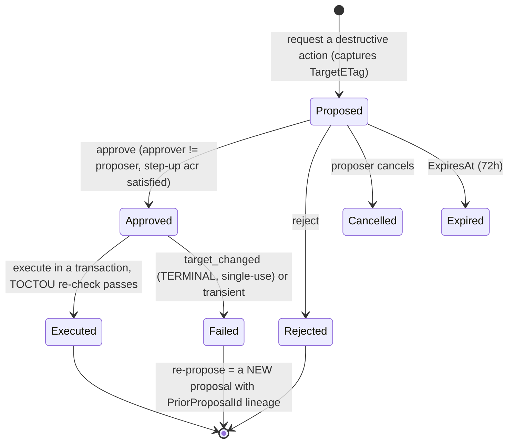
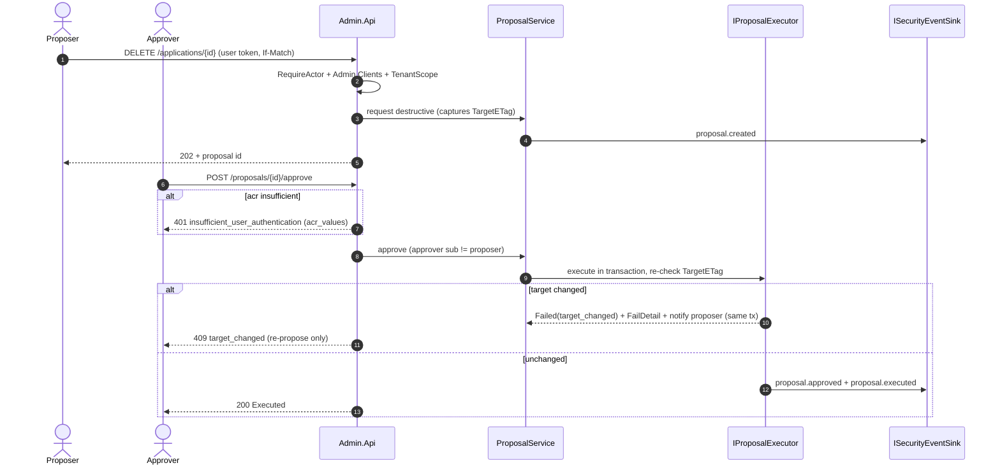

# Admin API (detailed design)

## Purpose and scope

The REST administration API (`Nami.Identity.Admin.Api`): the endpoints and DTOs for
managing clients, scopes, grants, users, roles, tenants, memberships, delegated-admin
grants, sessions, and audit; the **dual-control saga** that makes destructive actions
four-eyes and un-bypassable; the **first-admin bootstrap and admin break-glass**
(ADR-0015); and how the API is documented (Scalar) and secured (it is a resource server of
the IdP itself). The MVC Razor front end is a separate design ([Admin App](16-admin-app.md));
this doc is the backend it consumes.

In scope (owned): the API surface and per-resource CRUD contracts; the data-access model
(which `DbContext`s, managers-not-stores); the dual-control saga workflow and the
`IProposalExecutor` registry; API documentation + security; RBAC and how a user gains admin
access; the first-admin bootstrap and the break-glass path; and admin NFR (security,
performance, availability).

Out of scope, referenced not redefined: the authorization **decision** and the dual-control
**gating rule** (05); the user lifecycle, force-logout, and sessions (06); the tenant and
erasure saga **bodies** (13, entered here); the **schema** (02, the SSOT); the audit catalog
(03); the numeric SLO table (14); the front end ([Admin App](16-admin-app.md)); and the
**key**-compromise break-glass (09, distinct). Dynamic per-tenant external IdP management is
**v2** (ADR-0034 / design 32), so there is no IdentityProvider CRUD in v1, external IdPs are
static host-level configuration (06).

## Decisions realized

| Decision | What this design applies |
|---|---|
| ADR-0020 | Two projects + two DTO assemblies; `Application/`-folder business logic (managers-not-stores); dual-control server-side; no app-only token (RequireActor) |
| ADR-0015 | First-admin bootstrap and the break-glass admin path |
| ADR-0010 / ADR-0047 (ref) | The delegated-admin grant model and `ICheckAccess` decision engine the API consumes (owned by 05) |
| ADR-0009 / ADR-0035 | Secret rollover via `private_key_jwt` multi-key; self-service client CRUD (distinct) |
| ADR-0008 / ADR-0003 / ADR-0019 | Every action on the audit hash-chain; force-logout via the session store; single-token vs subject-wide revoke |
| ADR-0013 (ref) | Step-up returns 401 `insufficient_user_authentication` (RFC 9470), not 403 |

## Project structure and data access

Two hosts plus two DTO assemblies, flat under `src/`, grouped by name prefix:
`Nami.Identity.Admin.Api` (this doc), `Nami.Identity.Admin.App` (the front end),
`Nami.Identity.Admin.Contracts` (DTOs + `ProblemCodes`, referenced only by the two admin
hosts, the core IdP never references it, a compile-enforced boundary), and
`Nami.Identity.Contracts` (cross-cutting types only). Business logic is an **`Application/`
folder** inside `Admin.Api` (vertical-slice feature folders), not a separate project; an
ArchUnitNET test forbids it from referencing ASP.NET/HTTP or EF types.

**Data access is managers-not-stores.** The Admin API never opens an OpenIddict or Identity
`DbContext` directly; it goes through the manager facades so caching, validation, and a
future store swap keep working:

| Data | Accessed via | Backing context (02) |
|---|---|---|
| Clients / scopes / authorizations / tokens | `IOpenIddictApplicationManager` / `ScopeManager` / `AuthorizationManager` / `TokenManager` | `OpenIddictDbContext` |
| Users / roles | `UserManager<ApplicationUser>` / `RoleManager` | `IdentityDbContext` |
| Memberships, delegated-admin grants, capability catalog, tenants, tenant branding, sessions, audit | control-plane ports / repositories | `ControlPlaneDbContext` |
| **Dual-control proposals** | the one table the admin app **owns** directly, via an `IProposalStore` repository | `ControlPlaneDbContext` (`DualControlProposals`) |

The Admin API is itself a **resource server of the IdP** (`AddValidation`, audience
`admin-api`, `EnableTokenEntryValidation` for instant admin-token revocation). It holds no
auth of its own, authentication and authorization both go through the main Identity (below).
Optimistic concurrency uses PostgreSQL `xmin` as the ETag (never SQL-Server `rowversion`).

## Authentication, authorization, and who can access admin

**The main Identity is the authority.** The Admin App authenticates as a confidential OIDC
client of the IdP and forwards the *user's* delegated token; the Admin API validates that
IdP-issued token (`AddValidation`, audience `admin-api`); there is no separate admin auth
system. The `RequireActor` policy accepts **only user-delegated tokens** (a `sub` plus `amr`
or `auth_time` on the `admin-api` audience) and rejects any app-only / client-credentials
token with 403 `admin_requires_actor`; no client is ever granted the `admin-api` scope
through client-credentials. Every action is therefore attributable to a real person.

Granular RBAC policies (not one flat admin role):

| Policy | Requires | Applies to |
|---|---|---|
| `Admin.Read` | admin-viewer role or above | all GETs |
| `Admin.Clients` / `Admin.Scopes` / `Admin.Users` | the matching role | CRUD in that area |
| `Admin.Secrets` | secrets role + acr ≥ aal2 | secret rollover, certs |
| `Admin.Approver` | approver role + acr per the capability→acr map | approving proposals |
| `Admin.TenantScope` | membership or delegated-admin grant for `{tenantId}` (via `ICheckAccess`, 05) | every tenant-scoped route |

A dangerous action lacking sufficient `acr` returns **401** `WWW-Authenticate: Bearer
error="insufficient_user_authentication", acr_values="urn:nami.identity:aal2|aal3"` (RFC 9470, a 401
challenge, not a 403), and the App re-authenticates. Tenant-scoped resources sit under
`/tenants/{tenantId}/...` where `TenantScopeHandler` checks the grant and sets the tenant
context; global id-routes pass the deny-by-default BOLA/IDOR object-level filter (05).
(`Admin.TenantScope`'s set-tenant-context side effect must be rehomed before that handler is
retired in favor of `[HasCapability]`, a build-time item flagged by 05.)

**Who can access, and how admin is granted.** There are two ways to hold admin authority,
both deny-by-default:

- A **global admin role** (`Admin`, plus the granular roles above) assigned on the user via
  `RoleManager`, for platform operators.
- A **delegated-admin grant** (05/ADR-0010): scoped to a tenant subtree, capability-typed,
  time-bound, and revocable, for tenant administrators, with **no global super-admin**.

The **first admin** is created by the bootstrap seeder (below). After that, granting admin is
itself an admin action: assigning a global admin role or issuing a delegated-admin grant goes
through the Admin API under `Admin.Users`/`re_delegate`, and a *dangerous* delegated-admin
grant is a dual-control proposal (05). Issuing or revoking a delegated-admin grant requires
`re_delegate` held **directly** on the root tenant plus dual-control (this closes chain
re-delegation). Admin login requires MFA; sensitive actions require step-up to aal2/aal3.

## API documentation and security (Scalar)

This design adopts **Scalar** (`Scalar.AspNetCore`) as the OpenAPI reference UI, replacing
the corpus's Swagger-UI placeholder (a design decision, not a corpus fact; the OpenAPI
document itself is the standard built-in .NET output). The document declares an **OAuth2/OIDC security
scheme** pointing at the main IdP (authorization-code + PKCE against the tenant issuer,
scope `admin-api`), so the reference UI performs a real login through Identity and every
"try it" call carries a user-delegated token, consistent with `RequireActor` (no static API
key, no app-only path). Scalar is exposed in Development by default; if enabled in a
non-Development environment it sits behind the same authenticated admin surface (never
anonymous), and the raw OpenAPI JSON is likewise gated. Every operation is annotated with its
RBAC policy and its ProblemDetails responses.

## API surface and per-resource CRUD

Conventions: `?page=&size=` paging with `X-Total-Count`; explicit filtering (no OData);
ISO-8601 UTC; ETag on every resource (from `xmin`), `If-Match` required on mutation (missing
→ 428, mismatch → 409); an `Idempotency-Key` header on proposal creation; ProblemDetails
(RFC 9457) with a machine `code` on every error. DTOs are immutable records, enum-as-string,
versioned under `V1`. Secrets are never returned in a DTO (a create/rollover returns the
value exactly once).

### Clients (Applications): the hardest screen

`GET/POST /tenants/{t}/applications`, `GET/PUT /applications/{id}`, `DELETE`→proposal,
`POST /applications/{id}/secrets/rollover`, `PUT /applications/{id}/cors-origins`.

`ApplicationDto`: `Id`, `ClientId`, `DisplayName`, `ClientType` (`confidential`|`public`),
`ApplicationType` (`web`|`native`), `ConsentType`
(`explicit`|`implicit`|`external`|`systematic`), `RedirectUris[]`,
`PostLogoutRedirectUris[]`, `AllowedCorsOrigins[]` (from `Application.Properties['cors_origins']`),
`Permissions`, `Policy`, `ETag`.
`ApplicationPermissionsDto`: `Endpoints[]` (authorization/token/introspection/revocation/
end_session/device_authorization/pushed_authorization), `GrantTypes[]`, `ResponseTypes[]`,
`Scopes[]`, `RequirePkce`, `RequirePar`.
`ApplicationPolicyDto`: `IssueRefreshToken` (M2M false), `AccessTokenType` (`jwt`|`reference`),
`DefaultAcr?`, `BackchannelLogoutUri?`.
Server-side validation is the fail-closed `ToDescriptor` mapper (defined in the foundations
config layer, 01): a public/code client is
forced to PKCE (throws if absent), a confidential client without a credential is rejected,
wildcard/non-exact redirects are rejected, an origin is scheme+host+port (no path). The
Permissions/Requirements mapping to OpenIddict constants follows the `thomasduft/openiddict-ui`
pattern (referenced, not a dependency; the CRUD is built).

### Scopes

`GET/POST /tenants/{t}/scopes`, `GET/PUT/DELETE /scopes/{id}` (DELETE → proposal).
`ScopeDto`: `Id`, `Name`, `DisplayName`, `Description`, `Resources[]` (the audiences the
scope maps to), `ETag`. There is no API-Resource / Identity-Resource concept (OpenIddict does
not model them); audiences are expressed via a scope's `Resources`.

### Grants (Authorizations) and Tokens

`GET /tenants/{t}/authorizations?subject=&client=`, `POST /authorizations/{id}/revoke`;
`GET /tenants/{t}/tokens?subject=&client=&status=`, `POST /tokens/{id}/revoke`,
`POST /tenants/{t}/tokens/revoke-all`→proposal. A single revoke is direct + audited; the
subject-wide `revoke-all` is dual-control (it maps to `RevokeBySubjectAsync`, 06/10), never
the single-token endpoint. `AuthorizationDto`/`TokenDto` are read-mostly: subject, client,
type, status, scopes, created/expires.

### Users

`GET/POST /users`, `GET/PUT /users/{id}`, `POST /users/{id}/{lock|unlock|reset-password|
force-logout}`; lifecycle `POST /users/invite`, `POST /users/{id}/{disable|enable}`,
`POST /users/{id}/offboard`→proposal; passkeys `GET /users/{id}/passkeys`,
`DELETE /users/{id}/passkeys/{credentialId}`. `UserDto`: `Id`, `Email`, `DisplayName`,
`Memberships[]` (tenant + roles), `LockoutEnd?`, `TwoFactorEnabled`, `Disabled`, `ETag`.
`InviteUserRequest`: `Email`, `DisplayName?`, `TenantId?`, `Roles[]` (if the tenant sets
`RequireInviteApproval`, invite routes through the `approve-user-invite` proposal).
`PasskeyDto`: `CredentialId`, `DeviceName?`, `CreatedAt`, `LastUsedAt?` (metadata only, never
key material). Disable is `CanSignInAsync=false` + force-logout (not delete, and distinct
from lock which auto-expires); offboard invokes the gated erasure saga (13). The lifecycle
model itself is 06's.

### Roles

`GET/POST /roles`, `PUT/DELETE /roles/{id}`. `RoleDto`: `Id`, `Name`, `Claims[]`.

### Tenants, memberships, and delegated-admin

`GET/POST /tenants` (provision → proposal), `GET/PUT /tenants/{id}` (rejects any `Identifier`
change → 400 `tenant_identifier_immutable`), `DELETE`/`suspend`/`resume`→proposal,
`GET/PUT /tenants/{id}/memberships`, `GET/POST/DELETE /tenants/{id}/delegated-admin`.
`TenantDto`: `TenantId`, `ParentTenantId?`, `Identifier` (immutable post-provision), `Name`,
`IsolationMode` (`Pool`|`Silo`), `KeyScope`, `Enabled`, `SchemaVersion?`,
`RequireInviteApproval`, `ETag`. `DelegatedAdminGrantDto`: `GrantId`, `GranteeUserId`,
`RootTenantId`, `Capabilities[]` (from the catalog; a dangerous capability → proposal),
`ValidFrom`, `ExpiresAt?`, `RevokedAt?`, `GrantedBy`, `ETag`. The provision/suspend/resume/
delete saga **bodies** and their runtime semantics are 13's; this API is the entry point and
the dual-control gate.

### Tenant branding

`GET/PUT /tenants/{t}/branding`. `TenantBrandingDto`: `TenantId`, `LogoUri?` (https-only,
SSRF-safe), `Theme?` (design tokens (colors/fonts) not raw CSS), `DisplayName?`,
`UpdatedAtUtc`, `ETag`. PUT is direct + ETag + audit `tenant.branding.updated`.

### Sessions and audit

`GET /sessions?subject=`, `POST /sessions/{sid}/revoke` (`ITicketStore`, 03/06). `GET /audit`
(filter by type/tenant/actor/from/to, paged), `GET /audit/chain-status`. `AuditEntryDto`:
`EntryId`, `Timestamp`, `EventType`, `ActorSub`, `TargetTenantId?`, `Capability?`, `Result?`,
`CorrelationId`. `ChainStatusDto`: `Valid`, `LastVerifiedAt`, `FirstBrokenEntryId?`. The audit
**read** path is itself audited (`audit_read`) and tenant-filtered deny-by-default on the
shared Pool store (below).

### Proposals and meta

`POST /proposals`, `GET /proposals?status=&mine=`, `GET /proposals/{id}`,
`POST /proposals/{id}/approve`, `POST /proposals/{id}/reject`, `POST /proposals/{id}/cancel`
(cancel is proposer-only). `ProposalDto` carries `ProposalId`, `ActionType`, `TargetType`,
`TargetId`, `TenantId?`, `Payload`, `TargetETag`, `Justification`, `ProposedBy`, `ProposedAt`,
`Status`, `ApprovedBy?`, `DecidedAt?`, `ExecutedAt?`, `FailReason?`, `ExpiresAt`,
`CorrelationId`, `ETag`; the saga behavior is below. Meta: `GET /health`, `GET /health/ready`.

### ProblemCodes

`admin_requires_actor` (403), `insufficient_user_authentication` (401),
`tenant_scope_denied` (403), `proposer_cannot_approve` (403), `target_changed` (409),
`etag_mismatch` (409), `precondition_required` (428), `proposal_expired` (410),
`validation_failed` (400), `tenant_identifier_immutable` (400), `tenant_suspended` (409).

## Dual-control saga (the workflow; the gating rule is 05's)

The destructive-action catalog and the gating rule (proposer ≠ approver, `request_hash =
H(capability + target + params)`, single-use, step-up-gated, the `FullyConsistent` re-check)
are owned by 05. This design owns the **workflow**: the saga state machine, the
`IProposalExecutor` registry (one keyed executor per catalog `ActionType`), and the
`DualControlProposals` behavior. Enforcement is at the Application layer, `ProposalService`
is the *only* path to an executor, so adding a controller cannot bypass it. EDA is forbidden
for execution: approve-and-execute is synchronous, transactional, and TOCTOU-safe.

The TOCTOU guard stores the target's `TargetETag` (the `xmin`-derived ETag) at propose time
and re-checks it `FullyConsistent` before execution; a changed target becomes
`Failed(target_changed)`, **terminal and single-use**: the transaction sets `FailReason` and
`FailDetail` (expected/observed ETag), emits `proposal.failed`, and enqueues the proposer
notification in the same transaction via `IEmailDispatcher` on the `ControlPlaneDbContext`
(07's control-plane outbox home). Recovery is a new proposal with a fresh `TargetETag` and a
`PriorProposalId` link; a *transient* failure stays retry-able while the `TargetETag` matches
(the ETag guard, not terminal-ness, blocks stale retry). The constructive
`approve-user-invite` reuses the same saga (gated per-tenant by `RequireInviteApproval`).

## Secret rollover, bootstrap, and break-glass

**Secret rollover** (ADR-0009): the standard is `private_key_jwt` multi-key, a client's
`JsonWebKeySet` holds several keys for zero-downtime add/migrate/remove, with a masked,
hash-only `ApplicationSecrets` side-table as the symmetric fallback; revoking the old
credential is a proposal, and every step is audited. Self-service client CRUD (ADR-0035) is
distinct: it generates a random secret, shows it once, stores no plaintext, and does not use
the secret store.

**First-admin bootstrap** (ADR-0015): an idempotent seeder (`FindByNameAsync`/
`FindByClientIdAsync` under an advisory lock, run once across nodes) creates the first admin
user, the `Admin` role, and the admin OIDC client if absent; it issues a one-time setup token
(`GeneratePasswordResetTokenAsync`) out-of-band with a random temporary password that is never
logged, forces a change and MFA enrollment, and flags the account temporary until a real admin
exists (then auto-removed, NIST AC-2(2)). The zero-code reference host uses an apply-once
`Bootstrap__Admin*` env config, applied only at first start when no admin exists, forcing a
change, auditing `admin.bootstrap`, and failing fast in Production on a weak/absent value.

**Break-glass** (ADR-0015; distinct from the *key* break-glass, 09) is a separate path, **not
through this API**, for emergency admin access when the IdP cannot issue tokens: a separate
`"BreakGlass"` cookie scheme (`__Host-bg`, path `/breakglass`, HttpOnly/Secure/`SameSite=Strict`,
15-minute hard cap) whose only crypto dependency is the Data Protection keyring (so it works
when signing keys/JWKS/discovery are down); `EmergencyAccess:Enabled` default-off + an IP
allow-list that returns 404 to hide it + an internal-network listener + a `BreakGlassAdmin`
role; two sealed credentials (`PasswordHasher<T>`, PBKDF2 100k, dual-control unseal by two
custodians, single-use, rotated after use); audit-before-`SignInAsync` fail-closed with the
alert on 07's break-glass priority lane; the endpoint returns 401/403, not a redirect; boot
order is DB up → verify credential → direct session → repair keys → restore OIDC; a 90-day
drill plus a post-mortem after every use. The policy parameters are an ISMS DP.01 ratification
item (Pre-GA).

## Audit, concurrency, and hardening

Every mutation and dual-control transition emits on the `ISecurityEventSink` hash-chain (never
`ILogger`), with the security-critical ones (`admin_config_change`, proposal execute)
committing synchronously in the action's transaction. It reuses the existing catalog
(`admin_config_change`, `dual_control_approval`, `force_logout`, `mass_revoke`, `key_purge`)
and **proposes a minimal net-new set**: the granular `proposal.created/approved/rejected/
executed/failed` events and `audit_read`, raised as a proposed addition to the ADR-0008
catalog (flagged, not settled here), each carrying the authz provenance produced by 05
(`actor_sub`, `actor_chain`, `on_behalf_of_subject`, `capability`, `grant_id`, `decision_path`,
`authz_decision`, `stepup_satisfied`, `approval_request_id`, `approver_sub`, `request_hash`,
`result`). The audit-read path (`GET /audit*`) is itself audited and tenant-filtered
deny-by-default on the shared Pool store (mirroring `SuppressionEntry`), so no covert
cross-tenant viewing. An audit-context middleware stamps the correlation id and actor on every
request.

## Non-functional requirements

- **Security.** No app-only path (`RequireActor`); the API holds no auth of its own (it
  validates IdP tokens); TLS internal; the host runs **separately from the IdP runtime** so an
  admin-surface problem cannot degrade token issuance; every mutation is on the hash-chain;
  secrets are never returned or logged. The whole surface is held to OWASP ASVS L2 (ADR-0062,
  owned by 15/CI), with BOLA/IDOR object-level authz a must-pass (05).
- **Performance.** List endpoints are always paged (`X-Total-Count`, no unbounded scans); each
  request incurs one `ICheckAccess` call (DB-tier p95 < 30ms / p99 < 80ms, fail-closed at
  250ms, 05); reads go through the manager caches (per-request, no cross-node backplane, 10);
  the config/CORS cache is the FusionCache+Redis one (10), invalidated on a client change; the
  audit list query is tenant-filtered and indexed. The numeric SLO table is owned by 14.
- **Availability.** The Admin API is **not on the critical authentication path**: if it is
  down, token issuance and validation continue. Rate limiting is per actor; a hard 429 write
  ceiling uses the same `Microsoft.AspNetCore.RateLimiting` mechanism as the device/PAR
  endpoints (11).

## Data touchpoints (schema is 02)

References, does not redefine: `DualControlProposals` (with `xmin` as the ETag/TOCTOU source,
plus `FailReason`/`FailDetail`/`PriorProposalId`), `TenantBranding`, `DelegatedAdmin` /
`CapabilityCatalog` / `Memberships` / `TenantClosure`, `ServerSideSessions`, and
`Tenants.RequireInviteApproval`. Any new column is raised into 02, not invented here.

## Patterns applied (ADR-0066)

**Aggregate + State Machine** (`Proposal`), **Registry** (the keyed `IProposalExecutor`),
**Facade** (managers-not-stores), **Vertical Slice** (the `Application/` feature folders),
**Optimistic Concurrency** (ETag over `xmin`).

## Testing strategy

An app-only token gets 403 (anti-bypass); proposer == approver is rejected; a changed target
yields `Failed(target_changed)`; a cross-tenant id-route is denied (the BOLA matrix); ETag
gives 428/409; step-up returns 401 then succeeds on retry; every mutation emits an audit
event; the audit-read path is audited and tenant-filtered; `PUT` changing `Identifier` gives
400; suspend/resume go through a proposal; an http/private-IP branding logo is rejected;
secret rollover has no downtime (`private_key_jwt` parallel keys); force-logout and the
session cap behave; break-glass works with the IdP down (audit-before-action, single-use); the
first-admin seed is idempotent and forces a change; Scalar performs a real OIDC login and the
"try it" call carries a user token.

## Open and build-time items

- `Admin.TenantScope` rehome (move its set-tenant-context side effect before retiring it, 05).
- Proposed catalog additions (`proposal.*`, `audit_read`) into the ADR-0008 minimum-catalog gate.
- 02 schema: `DualControlProposals` gains `FailReason`/`FailDetail` + the lifecycle timestamps
  (added in 02).
- Deferred to GA: the admin break-glass policy (ISMS DP.01, ADR-0015); the capability taxonomy,
  the per-capability acr map, and approver-role separation (ADR-0010/0013); the secret-store
  purge holder and two-approver process (ADR-0009); the authorization SLO (ADR-0047, owned by 05).
- Deferred to other docs: the tenant/erasure saga bodies (13); IdentityProvider management (v2,
  ADR-0034); the numeric SLO table (14).

## References

- ADRs: ADR-0020, ADR-0015, ADR-0010 / ADR-0047 (05), ADR-0029 (the App's BFF), ADR-0009 /
  ADR-0035, ADR-0008, ADR-0003, ADR-0019, ADR-0007 (distinct), ADR-0013, ADR-0021, ADR-0024 /
  ADR-0027, ADR-0034 (v2 dynamic IdP), ADR-0062 (ASVS).
- Design docs: [Admin App](16-admin-app.md), [05 authorization](07-authorization.md) (the
  decision and gating rule), [06 user management](08-user-management.md) (lifecycle, force-logout,
  sessions), [07 email](10-email-notification.md) (proposal-failure notification), [10
  revocation](13-revocation-caching.md) (force-logout / config cache), [02 data](02-data.md)
  (`DualControlProposals`, `TenantBranding`), [03 audit](03-audit.md), [13 GDPR erasure and
  tenant provisioning] (saga bodies), [14 observability] (SLO table), [01
  foundations](01-foundations.md) (package graph).
- Reference: open-source admin-console studies inform the manager-wrapper and Permissions-mapping
  pattern; the CRUD is built, not a dependency (the build-vs-buy of `thomasduft/openiddict-ui`,
  MIT, was decided in favor of build-own).
- [Architecture](../architecture/README.md): containers (`Admin.Api`), domain (the `Proposal`
  aggregate), runtime views 2 (dual-control) and 9 (delegated cross-tenant).
- [Pre-GA ratification checklist](../PRE-GA-RATIFICATION-CHECKLIST.md).

---

[Prev: Advanced flows](14-advanced-flows.md) · [Index](README.md) · Next: [Admin App](16-admin-app.md)
