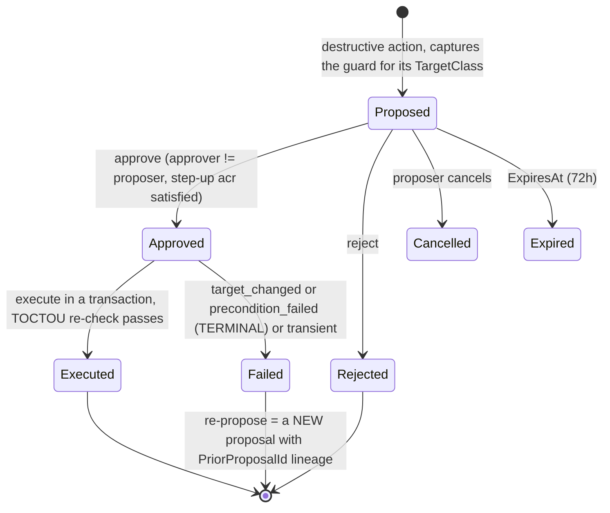
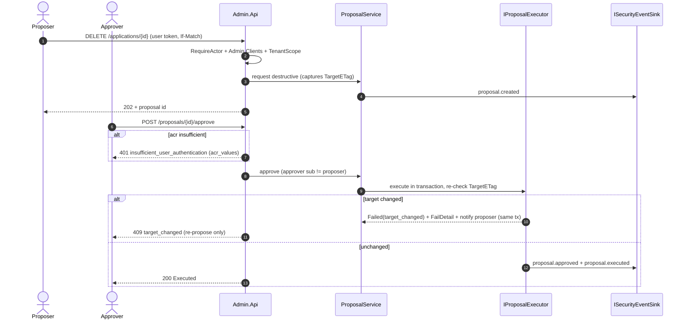

# Admin API (detailed design)

## 1. Decisions realized

| Decision | What this design applies |
|---|---|
| ADR-0020 | Two projects + two DTO assemblies; `Application/`-folder business logic (managers-not-stores); dual-control server-side; no app-only token (RequireActor) |
| ADR-0015 | First-admin bootstrap and the break-glass admin path |
| ADR-0010 / ADR-0047 (ref) | The delegated-admin grant model and `ICheckAccess` decision engine the API consumes (owned by 07) |
| ADR-0009 / ADR-0035 | Secret rollover via `private_key_jwt` multi-key; self-service client CRUD (distinct) |
| ADR-0008 / ADR-0003 / ADR-0019 | Every action on the audit hash-chain; force-logout via the session store; single-token vs subject-wide revoke |
| ADR-0013 (ref) | Step-up returns 401 `insufficient_user_authentication` (RFC 9470), not 403 |

## 2. Purpose and scope

The REST administration API (`Nami.Identity.Admin.Api`): the endpoints and DTOs for
managing clients, scopes, grants, users, roles, tenants, memberships, delegated-admin
grants, sessions, and audit; the **dual-control saga** that makes destructive actions
four-eyes and un-bypassable; the **first-admin bootstrap and admin break-glass**
(ADR-0015); and how the API is documented (Scalar) and secured (it is a resource server of
the IdP itself). The MVC Razor front end is a separate design ([Admin App](16-admin-app.md));
this doc is the backend it consumes.

In scope (owned): the API surface and per-resource CRUD contracts; the data-access model
(which `DbContext`s, managers-not-stores); the dual-control saga workflow and the
`IProposalExecutor` registry; API documentation + security; RBAC and how a user gains admin
access; the first-admin bootstrap and the break-glass path; and admin NFR (security,
performance, availability).

Out of scope, referenced not redefined: the authorization **decision** and the dual-control
**gating rule** (07); the user lifecycle, force-logout, and sessions (08); the tenant and
erasure saga **bodies** (18 and 17, entered here); the **schema** (02, the SSOT); the audit catalog
(03); the numeric SLO table (19); the front end ([Admin App](16-admin-app.md)); and the
**key**-compromise break-glass (12, distinct). Dynamic per-tenant external IdP management is
**v2** (ADR-0034), so there is no IdentityProvider CRUD in v1, external IdPs are
static host-level configuration (08).

## 3. Interfaces and contract

Conventions, all six governed by **ADR-0079**, which is the authority when this section and
that ADR disagree: `?page=&pageSize=` paging with a **body envelope**
`PageMeta { page, pageSize, total }` and **no** `X-Total-Count` header; explicit filtering
(no OData); ISO-8601 UTC; ETag on every resource (from `xmin`), with `If-Match`
**required on a state edit** and **deliberately absent on a revocation** (see below, and
note this is not "required on every mutation": that phrasing put a `428` on the incident
path); an `Idempotency-Key` header on proposal creation; ProblemDetails
(RFC 9457) with a machine `code` on every error. DTOs are immutable records, enum-as-string,
versioned under `V1`. Secrets are never returned in a DTO (a create/rollover returns the
value exactly once).

**The `If-Match` split, by intent rather than by verb.** A `PUT`, and a `DELETE` that raises
a destructive proposal against an existing target (application, scope, tenant, secret),
**require** `If-Match`: absent gives `428`, mismatch `409`, because an approver must be
approving the object they looked at. A `DELETE` that **revokes** a session, token,
authorization, or delegated-admin grant carries **no** precondition: that is the incident
path, a `428` while cutting off a compromised principal is a hazard, and revocation only
reduces privilege so a lost update cannot escalate anything.

**Revocation is `DELETE`, a state transition is `POST /{id}/{verb}`, and the two shapes
coexist on purpose** (ADR-0079 rule 1). Do not tidy one into the other.

### 3.1 Clients (Applications): the hardest screen

`GET/POST /tenants/{t}/applications`, `GET/PUT /applications/{id}`, `DELETE`→proposal,
`POST /applications/{id}/secrets/rollover`, `PUT /applications/{id}/cors-origins`.

**Deleting a client does not delete its tokens, and that is a security requirement rather
than housekeeping.** The engine maps `Application` to its `Tokens` and `Authorizations` as
**optional** relationships and sets no delete behaviour at all, so EF Core's default for an
optional relationship applies: no cascade. Deleting the application row leaves its tokens
and authorizations in the store with a null client reference and **still valid**, so an
already-issued JWT access token keeps validating until it expires and a reference token
keeps validating through the surviving entry. The delete executor therefore revokes in a
fixed order inside one transaction, tokens then authorizations then the application, and an
implementer must not assume the database will cascade. The default `disable-not-delete`
posture avoids the situation entirely, which is why it is the default.

`ApplicationDto`: `Id`, `ClientId`, `DisplayName`, `ClientType` (`confidential`|`public`),
`ApplicationType` (`web`|`native`), `ConsentType`
(`explicit`|`implicit`|`external`|`systematic`), `RedirectUris[]`,
`PostLogoutRedirectUris[]`, `AllowedCorsOrigins[]` (from `Application.Properties['cors_origins']`),
`Permissions`, `Policy`, `ETag`.
`ApplicationPermissionsDto`: `Endpoints[]` (authorization/token/introspection/revocation/
end_session/device_authorization/pushed_authorization), `GrantTypes[]`, `ResponseTypes[]`,
`Scopes[]`, `RequirePkce`, `RequirePar`.
`ApplicationPolicyDto`: `IssueRefreshToken` (M2M false), `AccessTokenType` (`jwt`|`reference`),
`DefaultAcr?`, `BackchannelLogoutUri?`.
Server-side validation is the fail-closed `ToDescriptor` mapper (defined in the foundations
config layer, 01): a public/code client is
forced to PKCE (throws if absent), a confidential client without a credential is rejected,
wildcard/non-exact redirects are rejected, an origin is scheme+host+port (no path). The
Permissions/Requirements mapping to OpenIddict constants follows the `thomasduft/openiddict-ui`
pattern (referenced, not a dependency; the CRUD is built).

### 3.2 Scopes

`GET/POST /scopes`, `GET/PUT/DELETE /scopes/{id}` (DELETE → proposal). The collection is
**root-level, not under a tenant prefix**, because ADR-0001 makes the scope catalog global:
`Scope` carries no tenant discriminator, so a tenant path would misstate ownership
(ADR-0079 rule 2). This read as an inconsistency until the rule was written down, and it
was in fact a contradiction with an accepted ADR.
`ScopeDto`: `Id`, `Name`, `DisplayName`, `Description`, `Resources[]` (the audiences the
scope maps to), `ETag`. There is no API-Resource / Identity-Resource concept (OpenIddict does
not model them); audiences are expressed via a scope's `Resources`.

### 3.3 Grants (Authorizations) and Tokens

`GET /tenants/{t}/authorizations?subject=&client=`, `DELETE /authorizations/{id}`;
`GET /tenants/{t}/tokens?subject=&client=&status=`, `DELETE /tokens/{id}`,
`POST /tenants/{t}/tokens/revoke-all`→proposal. A single revoke is direct + audited; the
subject-wide `revoke-all` is dual-control (it maps to `RevokeBySubjectAsync`, 08/13), never
the single-token endpoint. `AuthorizationDto`/`TokenDto` are read-mostly: subject, client,
type, status, scopes, created/expires.

### 3.4 Users

`GET/POST /users`, `GET/PUT /users/{id}`, `POST /users/{id}/{lock|unlock|reset-password|
force-logout}`; lifecycle `POST /users/invite`, `POST /users/{id}/{disable|enable}`,
`POST /users/{id}/offboard`→proposal; passkeys `GET /users/{id}/passkeys`,
`DELETE /users/{id}/passkeys/{credentialId}`. `UserDto`: `Id`, `Email`, `DisplayName`,
`Memberships[]` (tenant + roles), `LockoutEnd?`, `TwoFactorEnabled`, `Disabled`, `ETag`.
`InviteUserRequest`: `Email`, `DisplayName?`, `TenantId?`, `Roles[]` (if the tenant sets
`RequireInviteApproval`, invite routes through the `approve-user-invite` proposal).
`PasskeyDto`: `CredentialId`, `DeviceName?`, `CreatedAt`, `LastUsedAt?` (metadata only, never
key material). Disable is `CanSignInAsync=false` + force-logout (not delete, and distinct
from lock which auto-expires); offboard invokes the gated erasure saga (17). The lifecycle
model itself is 08's.

### 3.5 Roles

`GET/POST /roles`, `PUT/DELETE /roles/{id}`. `RoleDto`: `Id`, `Name`, `Claims[]`.

### 3.6 Tenants, memberships, and delegated-admin

`GET/POST /tenants` (provision → proposal), `GET/PUT /tenants/{id}` (rejects any `Identifier`
change → 400 `tenant_identifier_immutable`), `DELETE`/`suspend`/`resume`→proposal,
`GET/PUT /tenants/{id}/memberships`, `DELETE /tenants/{id}/memberships/{userId}`,
`GET/POST /tenants/{id}/delegated-admin`,
`DELETE /tenants/{id}/delegated-admin/{grantId}`.

**Revoking a grant is specified rather than left to the implementer**, because "add a
DELETE" understates the design content. It is a **soft delete** (`RevokedAt = now`, so the
row survives and the provenance in `DelegatedAdminGrantDto` is not erased); **idempotent**,
so a second revoke is also success, since incident-time retries must be safe; **`404` and
not `403`** for a grant belonging to another tenant, so the endpoint does not confirm the
grant exists; **step-up gated but not dual-control** (ADR-0010), and **no `If-Match`**
(ADR-0079), because it is a revocation and a `428` mid-incident is a hazard rather than a
safeguard.

**Removing a membership is a compound operation, and ADR-0084 is the authority for what
it guarantees.** There was no `DELETE` here at all until 2026-08-01, so nothing in the
contract revoked a person's access to one tenant. Adding the obvious route would have been
wrong in two ways that both read as correct:

- The decision query in [07](07-authorization.md) joins `DelegatedAdmin`,
  `DelegatedAdminCapabilities`, `TenantClosure` and `CapabilityCatalog`, and **never joins
  `Memberships`**. Deleting the membership row alone leaves every delegated-admin capability
  the person held fully alive.
- `tenant` and the coarse per-tenant role are **token claims** ([04](04-core-protocol.md)),
  so the Admin API stops honouring the person immediately, on a live `ICheckAccess` read,
  while a resource server keeps honouring the token it already holds.

So in one transaction: remove the row; revoke the user's grants **rooted exactly at this
tenant** (soft delete); revoke that subject's tokens and authorizations **scoped to this
tenant**, never subject-wide, which would cut them out of every tenant; and audit all of it
under one correlation id. The response is **`200` with a body**, not `204`, carrying
`residualAncestorGrants` (an ancestor-rooted grant is ADR-0010's decision to make at the
ancestor and is deliberately untouched) and `residualTokenWindowSeconds` = 900 (ADR-0004's
access-token lifetime, small but not zero).

**`409` when it would leave the tenant with no administrator**: no other active membership
with an admin role, and no active grant conferring user management rooted here or at an
ancestor. Otherwise recovery is break-glass only (ADR-0015). It is a revocation, so `DELETE`
with **no** `If-Match` (ADR-0079), idempotent, `404` for a membership in another tenant,
step-up gated but **not** dual-control, for the same reason grant revoke is not: it reduces
privilege and it is on the incident path.
`TenantDto`: `TenantId`, `ParentTenantId?`, `Identifier` (immutable post-provision), `Name`,
`IsolationMode` (`Pool`|`Silo`), `KeyScope`, `Enabled`, `SchemaVersion?`,
`RequireInviteApproval`, `ETag`. `DelegatedAdminGrantDto`: `GrantId`, `GranteeUserId`,
`RootTenantId`, `Capabilities[]` (from the catalog; a dangerous capability → proposal),
`ValidFrom`, `ExpiresAt?`, `RevokedAt?`, `GrantedBy`, `ETag`. The provision/suspend/resume/
delete saga **bodies** and their runtime semantics are 18's; this API is the entry point and
the dual-control gate.

### 3.7 Tenant branding

`GET/PUT /tenants/{t}/branding`. `TenantBrandingDto`: `TenantId`, `LogoUri?` (https-only,
SSRF-safe), `Theme?` (design tokens (colors/fonts) not raw CSS), `DisplayName?`,
`UpdatedAtUtc`, `ETag`. PUT is direct + ETag + audit `tenant.branding.updated`.

### 3.8 Sessions and audit

`GET /sessions?subject=`, `DELETE /sessions/{sid}` (`ITicketStore`, 02/08). `GET /audit`
(filter by type/tenant/actor/from/to, paged), `GET /audit/chain-status`. `AuditEntryDto`:
`EntryId`, `Timestamp`, `EventType`, `ActorSub`, `TargetTenantId?`, `Capability?`, `Result?`,
`CorrelationId`. `ChainStatusDto`: `Valid`, `LastVerifiedAt`, `FirstBrokenEntryId?`. The audit
**read** path is itself audited (`audit_read`) and tenant-filtered deny-by-default on the
shared Pool store (below).

**A bulk export is a dual-control action, not a bigger read.** Audit rows carry personal
data and actor identity, so a bulk egress is a genuine data-protection risk rather than a
convenience: `audit-export` is in the destructive-action catalogue (07) whenever the request
is full or unfiltered, spans more than 90 days, or exceeds 10k rows. A small filtered export
goes direct and is still audited. There is deliberately no ungated bulk-export endpoint in
v1; if one is added it routes through a keyed `IProposalExecutor` like every other catalogue
action, and paged `GET /audit` is not a substitute for that gate.

### 3.9 Proposals and meta

**There is no `POST /proposals`** (ADR-0079 rule 5): a proposal is created only by the
destructive endpoint it belongs to, which has already run that route's policy and capability
check. A generic route taking a caller-supplied `ActionType` and `TargetId` would let a
caller raise a proposal for an action whose own endpoint they may not call, and an approver
would then execute it; the saga guards the executor, not the endpoint's authorization.
Reading and deciding proposals is unaffected: `GET /proposals?status=&mine=`,
`GET /proposals/{id}`,
`POST /proposals/{id}/approve`, `POST /proposals/{id}/reject`, `POST /proposals/{id}/cancel`
(cancel is proposer-only). `ProposalDto` carries `ProposalId`, `ActionType`, `TargetType`,
`TargetId`, `TenantId?`, `Payload`, `TargetClass`, `TargetETag?`, `Justification`,
`ProposedBy`, `ProposedAt`,
`Status`, `ApprovedBy?`, `DecidedAt?`, `ExecutedAt?`, `FailReason?`, `ExpiresAt`,
`CorrelationId`, `ETag`; the saga behavior is below.

**Meta: `GET /health/live` and `GET /health/ready`, and both are anonymous** (ADR-0080).
This host's probes are the **only** exemption from `RequireActor`, which otherwise rejects
every token without a `sub`. The exemption is invisible at the call site, so an implementer
applying the policy uniformly will produce a pod that never reaches Ready. Neither route
returns a detail body: the status code alone is public, because the dependency report names
internal state and the kubelet cannot present a token to earn it. This design previously
listed `GET /health` plus `GET /health/ready`, which used a spelling nothing else in the
repository used and omitted liveness altogether.

### 3.10 ProblemCodes

`admin_requires_actor` (403), `insufficient_user_authentication` (401),
`tenant_scope_denied` (403), `proposer_cannot_approve` (403), `target_changed` (409),
`etag_mismatch` (409), `precondition_required` (428), `proposal_expired` (410),
`validation_failed` (400), `tenant_identifier_immutable` (400), `tenant_suspended` (409).

## 4. Data and structure

References, does not redefine: `DualControlProposals` (with `xmin` as the ETag/TOCTOU source,
plus `FailReason`/`FailDetail`/`PriorProposalId`), `TenantBranding`, `DelegatedAdmin` /
`CapabilityCatalog` / `Memberships` / `TenantClosure`, `ServerSideSessions`, and
`Tenants.RequireInviteApproval`. Any new column is raised into 02, not invented here.

## 5. Behaviour

### 5.1 Authentication, authorization, and who can access admin

**The main Identity is the authority.** The Admin App authenticates as a confidential OIDC
client of the IdP and forwards the *user's* delegated token; the Admin API validates that
IdP-issued token (`AddValidation`, audience `admin-api`); there is no separate admin auth
system. The `RequireActor` policy accepts **only user-delegated tokens**: a `sub` **and**
`auth_time` on the `admin-api` audience, and it rejects any app-only / client-credentials
token with 403 `admin_requires_actor`; no client is ever granted the `admin-api` scope
through client-credentials. Every action is therefore attributable to a real person.

**The gate is `auth_time`, never `amr`.** `auth_time` is the interactive-authentication
marker that reaches **both** tokens, so a resource server can read it off an access token.
`amr` reaches the **id_token only** (the claims contract, 09), and it can be absent on a
silent refresh, so a policy that gated on `amr` over an access token would reject every
legitimate admin call, and the version that treated it as an alternative would simply never
fire. This is the same reason 08 gives for keeping `amr` informational.

Granular RBAC policies (not one flat admin role):

| Policy | Requires | Applies to |
|---|---|---|
| `Admin.Read` | admin-viewer role or above | all GETs |
| `Admin.Clients` / `Admin.Scopes` / `Admin.Users` | the matching role | CRUD in that area |
| `Admin.Secrets` | secrets role + acr ≥ aal2 | secret rollover, certs |
| `Admin.Approver` | approver role + acr per the capability→acr map | approving proposals |
| `Admin.TenantScope` | membership or delegated-admin grant for `{tenantId}` (via `ICheckAccess`, 07) | every tenant-scoped route |

A dangerous action lacking sufficient `acr` returns **401** `WWW-Authenticate: Bearer
error="insufficient_user_authentication", acr_values="urn:nami.identity:aal2|aal3"` (RFC 9470, a 401
challenge, not a 403), and the App re-authenticates. Tenant-scoped resources sit under
`/tenants/{tenantId}/...` where `TenantScopeHandler` checks the grant and sets the tenant
context; global id-routes pass the deny-by-default BOLA/IDOR object-level filter (07), which
loads the object, derives its owning tenant, and asks `ICheckAccess`. **A user is the one
object with no single owning tenant**, being global by ADR-0001, so a user id-route is
authorized by **membership overlap** instead: the actor needs a membership or delegated-admin
grant intersecting that user's own tenant set, and a user belonging to no tenant is reachable
only by a global user-admin. Deriving a single owning tenant for a user would either deny
legitimate access or invent an ownership the model does not have.
(`Admin.TenantScope`'s set-tenant-context side effect must be rehomed before that handler is
retired in favor of `[HasCapability]`, a build-time item flagged by 07.)

**Who can access, and how admin is granted.** There are two ways to hold admin authority,
both deny-by-default:

- A **global admin role** (`Admin`, plus the granular roles above) assigned on the user via
  `RoleManager`, for platform operators.
- A **delegated-admin grant** (07/ADR-0010): scoped to a tenant subtree, capability-typed,
  time-bound, and revocable, for tenant administrators, with **no global super-admin**.

The **first admin** is created by the bootstrap seeder (below). After that, granting admin is
itself an admin action: assigning a global admin role or issuing a delegated-admin grant goes
through the Admin API under `Admin.Users`/`re_delegate`, and a *dangerous* delegated-admin
grant is a dual-control proposal (07). Issuing **or** revoking a delegated-admin grant
requires `re_delegate` held **directly** on the root tenant (this closes chain
re-delegation), but **only issuing is dual-controlled**: revoke is single-actor and step-up
gated, so one responder can cut off a compromised delegated admin without waiting for a
second pair of eyes that the attacker may be holding (ADR-0010, and section 3.6 for the
endpoint's other properties). Admin login requires MFA; sensitive actions require step-up
to aal2/aal3.

### 5.2 The dual-control saga (the workflow; the gating rule is 07's)

The destructive-action catalog and the gating rule (proposer ≠ approver, `request_hash =
H(capability + target + params)`, single-use, step-up-gated, the `FullyConsistent` re-check)
are owned by 07. This design owns the **workflow**: the saga state machine, the
`IProposalExecutor` registry (one keyed executor per catalog `ActionType`), and the
`DualControlProposals` behavior. Enforcement is at the Application layer, `ProposalService`
is the *only* path to an executor, so adding a controller cannot bypass it. EDA is forbidden
for execution: approve-and-execute is synchronous, transactional, and TOCTOU-safe.

**The guard depends on the proposal's `TargetClass`, because not every action has a target
row** (ADR-0081, which is the authority for this taxonomy; the column and its two `CHECK`
constraints are in [02](02-data.md)).

| `TargetClass` | `TargetETag` | `TargetId` holds | Re-checked before executing | Actions here |
|---|---|---|---|---|
| `mutate` | required | the existing row's id | the ETag still matches | `delete-application`, `delete-scope`, `delete-tenant`, `suspend-tenant`, `resume-tenant`, `offboard-user`, `revoke-all-tokens`, `secret-revoke`, key purge, the Pool-to-Silo re-home, and `approve-user-invite` with a **server-filled** ETag |
| `create` | NULL | the id of the thing **to be created** | the create preconditions still hold: uniqueness, every referenced principal still exists, and the endpoint's own admission rules | `provision-tenant`, a dangerous `delegated-admin-grant` |
| `query` | NULL | a SHA-256 digest of the frozen filter | the filter frozen in `PayloadJson` is authoritative and **may not be widened**, and the size or scope threshold that gated the approval is re-evaluated | bulk `audit-export` |

For `mutate`, the guard stores the target's `xmin`-derived ETag at propose time and re-checks
it `FullyConsistent` before execution. `TargetETag` need not come from `If-Match`: a client
supplies it for a client-named target (ADR-0079 rule 4), and the **server** fills it for a
target the server just created, which is why `approve-user-invite` is `mutate` rather than
`create`.

**Across all three classes the executor also re-checks that the proposer still holds the
capability** through `ICheckAccess`. Approval authorises the action; it does not waive
validation, and a 72-hour window is long enough for a grant to be revoked inside it.

A failed guard becomes `Failed(target_changed)` for `mutate` or
`Failed(precondition_failed)` for `create` and `query`, both **terminal and single-use**: the
transaction sets `FailReason` and `FailDetail` (expected and observed), emits
`proposal.failed`, and enqueues the proposer notification in the same transaction via
`IEmailDispatcher` on the `ControlPlaneDbContext` (10's control-plane outbox home). Recovery
is a new proposal with a fresh guard and a `PriorProposalId` link.

**Retryability is decided by `FailReason`, not by the ETag.** Only a genuinely transient
executor error is retryable, and for `mutate` it additionally requires the ETag to still
match. A duplicate-key or precondition violation surfaces as `precondition_failed` and is
never a transient error. The previous rule, "a transient failure stays retry-able while the
`TargetETag` matches", was **vacuously true** for the three targetless actions, so a
`provision-tenant` whose identifier had been taken would have been retried forever against
something that can never succeed. The constructive `approve-user-invite` reuses the same
saga (gated per-tenant by `RequireInviteApproval`).

### 5.3 Secret rollover, bootstrap, and break-glass

**Secret rollover** (ADR-0009): the standard is `private_key_jwt` multi-key, a client's
`JsonWebKeySet` holds several keys for zero-downtime add/migrate/remove, with a masked,
hash-only `ApplicationSecrets` side-table as the symmetric fallback; revoking the old
credential is a proposal, and every step is audited. Self-service client CRUD (ADR-0035) is
distinct: it generates a random secret, shows it once, stores no plaintext, and does not use
the secret store.

**First-admin bootstrap** (ADR-0015): an idempotent seeder (`FindByNameAsync`/
`FindByClientIdAsync` under an advisory lock, run once across nodes) creates the first admin
user, the `Admin` role, and the admin OIDC client if absent; it issues a one-time setup token
(`GeneratePasswordResetTokenAsync`) out-of-band with a random temporary password that is never
logged, forces a change and MFA enrollment, and flags the account temporary until a real admin
exists (then auto-removed, NIST AC-2(2)). The zero-code reference host uses an apply-once
`Bootstrap__Admin*` env config, applied only at first start when no admin exists, forcing a
change, auditing `admin.bootstrap`, and failing fast in Production on a weak/absent value.

**Break-glass** (ADR-0015; distinct from the *key* break-glass, 12) is a separate path, **not
through this API**, for emergency admin access when the IdP cannot issue tokens: a separate
`"BreakGlass"` cookie scheme (`__Host-bg`, path `/breakglass`, HttpOnly/Secure/`SameSite=Strict`,
15-minute hard cap) whose only crypto dependency is the Data Protection keyring (so it works
when signing keys/JWKS/discovery are down); `EmergencyAccess:Enabled` default-off + an IP
allow-list that returns 404 to hide it + an internal-network listener + a `BreakGlassAdmin`
role; two sealed credentials (`PasswordHasher<T>`, PBKDF2 100k, dual-control unseal by two
custodians, single-use, rotated after use); audit-before-`SignInAsync` fail-closed with the
alert on 10's break-glass priority lane; the endpoint returns 401/403, not a redirect; boot
order is DB up → verify credential → direct session → repair keys → restore OIDC; a 90-day
drill plus a post-mortem after every use. The policy parameters are an ISMS DP.01 ratification
item (Pre-GA).

### 5.4 Audit, concurrency, and hardening

Every mutation and dual-control transition emits on the `ISecurityEventSink` hash-chain (never
`ILogger`), with the security-critical ones (`admin_config_change`, proposal execute)
committing synchronously in the action's transaction. It reuses the existing catalog
(`admin_config_change`, `dual_control_approval`, `force_logout`, `mass_revoke`, `key_purge`)
and **proposes a minimal net-new set**: the granular `proposal.created/approved/rejected/
executed/failed` events and `audit_read`, raised as a proposed addition to the ADR-0008
catalog (flagged, not settled here), each carrying the authz provenance produced by 07
(`actor_sub`, `actor_chain`, `on_behalf_of_subject`, `capability`, `grant_id`, `decision_path`,
`authz_decision`, `stepup_satisfied`, `approval_request_id`, `approver_sub`, `request_hash`,
`result`). The audit-read path (`GET /audit*`) is itself audited and tenant-filtered
deny-by-default on the shared Pool store (mirroring `SuppressionEntry`), so no covert
cross-tenant viewing. An audit-context middleware stamps the correlation id and actor on every
request.

## 6. Dependencies and wiring

Two hosts plus two DTO assemblies, flat under `src/`, grouped by name prefix:
`Nami.Identity.Admin.Api` (this doc), `Nami.Identity.Admin.App` (the front end),
`Nami.Identity.Admin.Contracts` (DTOs + `ProblemCodes`, referenced only by the two admin
hosts, the core IdP never references it, a compile-enforced boundary), and
`Nami.Identity.Contracts` (cross-cutting types only). Business logic is an **`Application/`
folder** inside `Admin.Api` (vertical-slice feature folders), not a separate project; an
ArchUnitNET test forbids it from referencing ASP.NET/HTTP or EF types.

**Data access is managers-not-stores.** The Admin API never opens an OpenIddict or Identity
`DbContext` directly; it goes through the manager facades so caching, validation, and a
future store swap keep working:

| Data | Accessed via | Backing context (02) |
|---|---|---|
| Clients / scopes / authorizations / tokens | `IOpenIddictApplicationManager` / `ScopeManager` / `AuthorizationManager` / `TokenManager` | `OpenIddictDbContext` |
| Users / roles | `UserManager<ApplicationUser>` / `RoleManager` | `IdentityDbContext` |
| Memberships, delegated-admin grants, capability catalog, tenants, tenant branding, sessions, audit | control-plane ports / repositories | `ControlPlaneDbContext` |
| **Dual-control proposals** | the one table the admin app **owns** directly, via an `IProposalStore` repository | `ControlPlaneDbContext` (`DualControlProposals`) |

The Admin API is itself a **resource server of the IdP** (`AddValidation`, audience
`admin-api`, `EnableTokenEntryValidation` for instant admin-token revocation). It holds no
auth of its own, authentication and authorization both go through the main Identity (below).

Optimistic concurrency has **two ETag sources**, and using the wrong one silently disables
the check. For the control-plane tables this design owns, the ETag is PostgreSQL `xmin`
(never SQL-Server `rowversion`). For engine entities (applications, scopes, authorizations,
tokens) the ETag is the entity's own `ConcurrencyToken`, which the engine marks as a
concurrency token, so EF Core enforces it on update and delete by itself and raises a
concurrency exception on a stale value. The value has to be read **off the entity**: the
manager's descriptor type does not expose `ConcurrencyToken` at all, so an implementer who
looks for it there will find nothing and is likely to ship an ETag that never conflicts.

### 6.1 API documentation and security (Scalar)

This design adopts **Scalar** (`Scalar.AspNetCore`) as the OpenAPI reference UI, replacing
the corpus's Swagger-UI placeholder (a design decision, not a corpus fact; the OpenAPI
document itself is the standard built-in .NET output). The document declares an **OAuth2/OIDC security
scheme** pointing at the main IdP (authorization-code + PKCE against the tenant issuer,
scope `admin-api`), so the reference UI performs a real login through Identity and every
"try it" call carries a user-delegated token, consistent with `RequireActor` (no static API
key, no app-only path). Scalar is exposed in Development by default; if enabled in a
non-Development environment it sits behind the same authenticated admin surface (never
anonymous), and the raw OpenAPI JSON is likewise gated. Every operation is annotated with its
RBAC policy and its ProblemDetails responses.

### 6.2 Patterns applied

**Aggregate + State Machine** (`Proposal`), **Registry** (the keyed `IProposalExecutor`),
**Facade** (managers-not-stores), **Vertical Slice** (the `Application/` feature folders),
**Optimistic Concurrency** (ETag over `xmin`).

## 7. Error handling, edge cases, invariants

The rules below are enforced, not advisory, and each one is stated where it is designed;
this is the list an implementer should be able to point at a test for.

- **No app-only path.** `RequireActor` demands `sub` and `auth_time`; `amr` is never the
  gate, because it reaches only the id_token (5.1).
- **`ProposalService` is the only route to an executor**, so adding a controller cannot
  bypass dual control, and approve-and-execute is synchronous, transactional, and
  TOCTOU-checked rather than event-driven (5.2).
- **Proposer is never approver**, compared on `sub` rather than trusted from a role, and
  approval is itself step-up gated per capability.
- **A failed guard is terminal and single-use**, as `target_changed` for `mutate` or
  `precondition_failed` for `create` and `query`. **Retryability follows `FailReason`, not
  the ETag** (ADR-0081): only a genuinely transient executor error is retryable, and for
  `mutate` it additionally requires the ETag to still match. The former rule, "retry-able
  only while the stored `TargetETag` still matches", was **vacuously true** for the three
  actions that have no target row, so a duplicate-key failure would have been retried
  forever. A duplicate-key or precondition violation is `precondition_failed`, never
  transient.
- **Two ETag sources, never interchanged**: `xmin` for control-plane rows, the entity's own
  `ConcurrencyToken` for engine entities, read off the entity and not the descriptor
  (section 6).
- **`If-Match` is required on a state edit and deliberately absent on a revocation**
  (ADR-0079 rule 4): on a `PUT` or a proposal-raising `DELETE`, absent gives 428 and stale
  gives 409; on a `DELETE` that revokes a session, token, authorization, or grant there is
  no precondition at all, because that is the incident path and a 428 there is a hazard.
  The former wording, "required on every mutation", was a universal that several endpoints
  correctly did not satisfy.
- **Deleting a client revokes its tokens and authorizations first, in one transaction**,
  because the engine's relationships do not cascade (3.1).
- **A tenant `Identifier` is immutable after provisioning**; a rename is a new-tenant
  migration, never an in-place update.
- **The audit read path is itself audited and tenant-filtered deny-by-default**, and a bulk
  export is a dual-control action rather than a larger read (3.8).
- **Admin adds exactly one table.** Everything else goes through existing managers and
  ports; a new column is raised into 02 rather than invented here.
- **Step-up refusal is a 401 challenge, not a 403**, so the client knows to re-authenticate
  instead of treating it as a permanent denial.

## 8. Security, performance, and availability

- **Security.** No app-only path (`RequireActor`); the API holds no auth of its own (it
  validates IdP tokens); TLS internal; the host runs **separately from the IdP runtime** so an
  admin-surface problem cannot degrade token issuance; every mutation is on the hash-chain;
  secrets are never returned or logged. The whole surface is held to OWASP ASVS L2 (ADR-0062,
  owned by 21/CI), with BOLA/IDOR object-level authz a must-pass (07).
- **Performance.** List endpoints are always paged (the `PageMeta` body envelope, no
  unbounded scans); each
  request incurs one `ICheckAccess` call (DB-tier p95 < 30ms / p99 < 80ms, fail-closed at
  250ms, 07); reads go through the manager caches (per-request, no cross-node backplane, 13);
  the config/CORS cache is the FusionCache+Redis one (13), invalidated on a client change; the
  audit list query is tenant-filtered and indexed. The numeric SLO table is owned by 19.
- **Availability.** The Admin API is **not on the critical authentication path**: if it is
  down, token issuance and validation continue. Rate limiting is per actor; a hard 429 write
  ceiling uses the same `Microsoft.AspNetCore.RateLimiting` mechanism as the device/PAR
  endpoints (14).

## 9. Testing

An app-only token gets 403 (anti-bypass); a token carrying `sub` and `auth_time` passes while
one lacking `auth_time` does not, and no test relies on `amr` being present on an access
token; proposer == approver is rejected; a changed target
yields `Failed(target_changed)`; a cross-tenant id-route is denied (the BOLA matrix), and a
user id-route is allowed exactly on membership overlap; ETag
gives 428/409, over both an `xmin`-backed control-plane row and an engine entity whose
`ConcurrencyToken` is the source; **deleting a client leaves no valid token or authorization
behind**, with a negative test asserting a deleted client's reference token no longer
validates; step-up returns 401 then succeeds on retry; every mutation emits an audit
event; the audit-read path is audited and tenant-filtered; `PUT` changing `Identifier` gives
400; suspend/resume go through a proposal; an http/private-IP branding logo is rejected;
secret rollover has no downtime (`private_key_jwt` parallel keys); force-logout and the
session cap behave; break-glass works with the IdP down (audit-before-action, single-use); the
first-admin seed is idempotent and forces a change; Scalar performs a real OIDC login and the
"try it" call carries a user token.

## 10. Open and build-time items

- `Admin.TenantScope` rehome (move its set-tenant-context side effect before retiring it, 07).
- **Verify at build (ADR-0084): does a tenant-scoped subject revoke actually honour the tenant
  filter?** Step 3 of the membership-removal cascade revokes that subject's tokens and
  authorizations **scoped to this tenant**, which presumes the store query applies the
  Finbuckle filter when the ambient tenant is set. Spike A-4 proved the filter applies to
  store queries in general, but **not specifically for the subject-wide revoke API**, so this
  is asserted by a test rather than by this document. If it turns out not to hold, the
  cascade needs an explicit tenant predicate, not a wider revoke: a subject-wide revoke would
  cut the person out of every tenant, which is a different operation.
- **Settled 2026-08-01 (ADR-0081), recorded because the reasoning is not recoverable from
  the schema:** `TargetId` stays `NOT NULL` for all three classes and `TargetClass` says what
  it means, rather than a second column being relaxed. For `query` it is a **SHA-256 digest
  of the frozen filter**, computed over the **canonical TEXT** rendering of `PayloadJson` and
  never over the stored `jsonb`, because `jsonb` does not preserve input byte order and two
  identical filters would otherwise digest differently (the constraint [03](03-audit.md)
  section 5.2 already solved for the chain; the same canonicalisation is reused). It is
  **plain, not keyed**: this identifies an export, it does not attest to one, and an HMAC
  would imply tamper-evidence the column does not carry. It complements the
  `Idempotency-Key` header rather than replacing it, the header being client-supplied and
  per-request against this being server-derived and content-derived, and it is **not** a
  guard: the `query` guard is re-evaluating the filter and its thresholds.
- Proposed catalog additions (`proposal.*`, `audit_read`) into the ADR-0008 minimum-catalog gate.
- 02 schema: `DualControlProposals` gains `FailReason`/`FailDetail` + the lifecycle timestamps
  (added in 02).
- Deferred to GA: the admin break-glass policy (ISMS DP.01, ADR-0015); the capability taxonomy,
  the per-capability acr map, and approver-role separation (ADR-0010/0013); the secret-store
  purge holder and two-approver process (ADR-0009); the authorization SLO (ADR-0047, owned by 07).
- Deferred to other docs: the tenant/erasure saga bodies (18 and 17); IdentityProvider management (v2,
  ADR-0034); the numeric SLO table (19).

## 11. Sources

- ADRs: ADR-0020, ADR-0015, ADR-0010 / ADR-0047 (07), ADR-0029 (the App's BFF), ADR-0009 /
  ADR-0035, ADR-0008, ADR-0003, ADR-0019, ADR-0007 (distinct), ADR-0013, ADR-0021, ADR-0024 /
  ADR-0027, ADR-0034 (v2 dynamic IdP), ADR-0062 (ASVS).
- Design docs: [Admin App](16-admin-app.md), [07 authorization](07-authorization.md) (the
  decision and gating rule), [08 user management](08-user-management.md) (lifecycle, force-logout,
  sessions), [10 email](10-email-notification.md) (proposal-failure notification), [13
  revocation](13-revocation-propagation-and-caching.md) (force-logout / config cache), [02 data](02-data.md)
  (`DualControlProposals`, `TenantBranding`), [03 audit](03-audit.md),
  [17 erasure and data-subject rights](17-erasure-and-data-subject-rights.md) and
  [18 tenant lifecycle](18-tenant-lifecycle.md) (the saga bodies this API enters),
  [19 observability](19-observability-capacity-slo.md) (the numeric SLO table),
  [01 foundations](01-foundations.md) (package graph).
- Reference: open-source admin-console studies inform the manager-wrapper and Permissions-mapping
  pattern; the CRUD is built, not a dependency (the build-vs-buy of `thomasduft/openiddict-ui`,
  MIT, was decided in favor of build-own).
- [Architecture](../architecture/README.md): containers (`Admin.Api`), domain (the `Proposal`
  aggregate), runtime views 2 (dual-control) and 9 (delegated cross-tenant).
- [Pre-GA ratification checklist](../PRE-GA-RATIFICATION-CHECKLIST.md).

---

[Prev: Advanced flows](14-advanced-flows.md) · [Index](README.md) · Next: [Admin App](16-admin-app.md)
