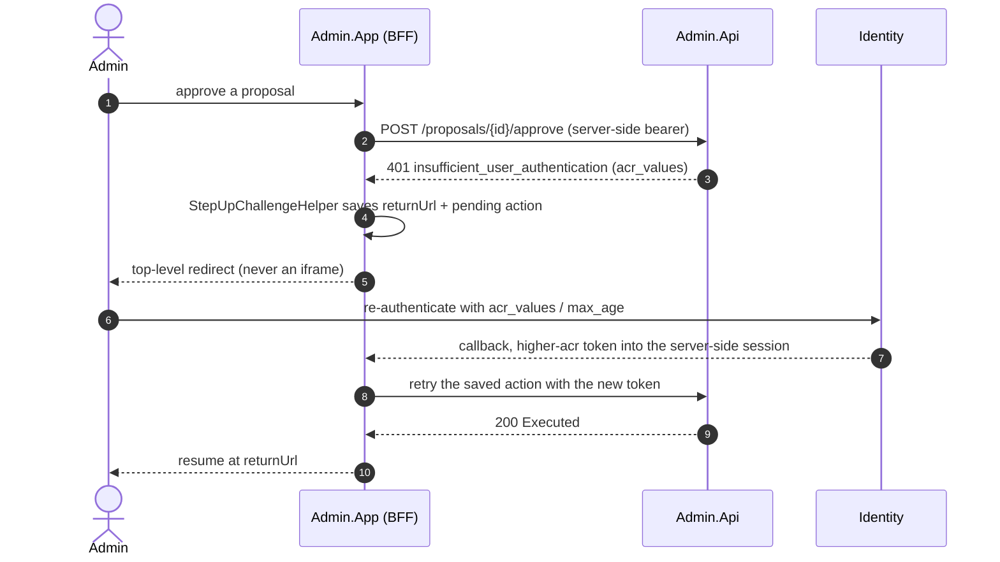

# Admin App (detailed design)

## 1. Decisions realized

| Decision | What this design applies |
|---|---|
| ADR-0020 | The Admin App is a presentation-only MVC Razor BFF that consumes the Admin API; no business logic, no direct data access |
| ADR-0029 | Confidential-client BFF built on the shared `Nami.Identity.Bff` package; token stays server-side; antiforgery mandatory |
| ADR-0003 (ref) / ADR-0019 | The App's **own** RP session cookie, correlated to the OP session by `sid` rather than sharing its store ([24](24-bff.md)); receives back-channel logout |
| ADR-0013 (ref) | Consumes the 401 step-up challenge (RFC 9470) during approvals |

## 2. Purpose and scope

The administration front end (`Nami.Identity.Admin.App`): an MVC Razor **BFF** that
consumes the [Admin API](15-admin-api.md). It holds **no business logic** and never talks to
managers or the database directly; it renders screens, carries the user's session, and proxies
to the API with a server-side token. The access token **never reaches the browser** (ADR-0029).

In scope: the OIDC client and session; the UI design (layout, navigation, components, paging,
theming, accessibility); the screen inventory; the step-up UX; the error/UX conventions; and
the front-end security (antiforgery, CSP, no-token-in-browser, back-channel logout).

Out of scope, referenced not redefined: the API surface, DTOs, CRUD semantics, dual-control
saga, RBAC, bootstrap, and break-glass ([Admin API](15-admin-api.md)); the step-up *enforcement*
and the challenge *page mechanics* (07 / 11); the BFF package internals, including the two
anti-forgery profiles, the proxy allow-list, the logout-CSRF guard and the silent-renew 401
contract ([24](24-bff.md)). The end-user login/consent UI (11) is a different application.

## 3. Interfaces and contract

| Screen | Content | Note |
|---|---|---|
| Dashboard | health, audit chain-status badge, proposals awaiting me, key days-to-expiry | |
| Clients (Applications) | list/search per tenant; grouped-checkbox Permissions form; secret-rollover wizard (parallel keys, no downtime); CORS-origins editor; **back-channel logout URI** (https-only, SSRF-validated, and an empty value shown as the explicit choice "this relying party accepts bounded logout" rather than as unset, ADR-0019) | hardest screen |
| Scopes | CRUD + resources/audience | |
| Grants and Tokens | list by subject/client; single revoke; revoke-all → proposal | |
| Users | CRUD, lock/unlock, reset; **force-logout**; lifecycle **Invite** (+ pending-approval state), **Disable/Enable**, **Offboard** (dual-control, irreversible warning); **Passkeys panel** (metadata + remove-confirm) | lifecycle in 08 |
| Roles | CRUD + claims | |
| Tenants | registry; provision wizard (→ proposal, per-step status); **Suspend/Resume** (→ proposal, semantics warning); `Identifier` read-only post-provision; Memberships editor; Delegated-admin grant picker (capability + subtree + expiry; it warns that a proposal will open when the capability set is no-cascade **or the chosen root tenant has descendants**, ADR-0010, so the warning matches the reach rule rather than the "dangerous" label; a request above the actor's own capabilities is refused `403` by the ceiling and must be shown as a refusal, never as a pending approval) and grant **revoke**, which is single-actor and step-up gated rather than a proposal (ADR-0010), so the UI must not present it as needing a second approver | bodies in 18 |
| Branding | design-token form (colors/fonts), https-only logo URL (ProblemDetails validation), live preview | |
| Approval Inbox | proposals awaiting me / mine / history; diff + justification + **the guard appropriate to the proposal's `TargetClass`** (an ETag for `mutate`, the create preconditions for `create`, the frozen filter for `query`, ADR-0081), so the two thirds of action types that have no target ETag do not render an empty field; **Approve = step-up**; Reject/Cancel; a `precondition_failed` failure is presented exactly like `target_changed`, since both mean the world moved under the proposal | dual-control core |
| Audit viewer | taxonomy filter; chain-verify badge; controlled export (a filtered request within 90 days and 10k rows goes direct and is still audited; full, unfiltered, longer or larger is dual-control, and the thresholds are org-configurable) | 15 / 07 |
| Sessions | list / revoke server-side sessions | |
| Account/StepUp | re-auth / MFA challenge landing | reuses 11's page |

There is no IdentityProvider screen in v1 (dynamic per-tenant external IdP is v2, ADR-0034),
and no API-Resource/Identity-Resource screen (OpenIddict does not model them; audiences are
managed via Scopes).

## 4. Data and structure

This design defines and reads no tables of its own. Every value it renders arrives as a
DTO from the Admin API (15), whose contracts are versioned in the shared admin contracts
assembly, and the only client-side state is the authentication session cookie. The schema
behind those DTOs is 02's.

## 5. Behaviour

### 5.1 OIDC client and session

The App is a **confidential OIDC client of the IdP** (dogfooding): authorization code + PKCE,
`client_secret` migrating to `private_key_jwt`, scopes `openid profile admin-api`, exact-match
redirect URIs. The session is a `__Host-` HttpOnly/Secure/SameSite=Lax cookie over the App's **own**
RP-side ticket store, which is not the ADR-0003 server-side session store: that one is the
OP's, keyed by a `sid` no relying party mints, and the very fact that this App must
*receive* a back-channel logout to end its session is what shows the two are separate
objects ([24](24-bff.md)). It receives back-channel logout (validating
the signature, `iss`, `aud`, `sid`, and the `events` member, requiring **no `nonce`**, and
deduplicating on `jti`) so an admin's IdP logout ends the console session. Token management uses `Duende.AccessTokenManagement.OpenIdConnect` (Apache-2.0,
provider-agnostic, ADR-0026 section D): `AddOpenIdConnectAccessTokenManagement()` plus
`AddUserAccessTokenHttpClient("adminApi", ...)` keep the user's access and refresh tokens
server-side and auto-refresh them, and a typed `AdminApiClient` attaches the bearer to each
API call. Login requires the admin role and MFA; the current `acr`/`amr` are surfaced so the
UI can show the session's assurance level. It is built on the shared `Nami.Identity.Bff`
package (which must not depend on the `Admin.*` assemblies).

### 5.2 UI design

- **Stack.** ASP.NET Core MVC + Razor views, Bootstrap 5, **minimal JavaScript**: standard
  form POSTs with antiforgery, no SPA framework. Changing the theme or CSS never touches the
  flow (the engine-decoupled principle from 11). A single `AdminApiClient` maps the API's
  ProblemDetails to UI errors and carries the ETag through edit round-trips.
- **Layout and navigation.** One `_Layout` with a left nav grouped by area (Clients, Scopes,
  Grants/Tokens, Users, Roles, Tenants, Branding, Approvals, Audit, Sessions), a top bar with
  the signed-in admin, the current assurance level, and a **tenant context** indicator; a
  breadcrumb; and a persistent "proposals awaiting me" badge. Global-admin vs tenant-admin nav
  is filtered by the caller's policies/grants (a tenant-admin sees only their subtree).
- **Lists.** Server-side paging and filtering (the API's `?page=&size=` + `X-Total-Count`);
  no client-side data grids pulling whole tables. Explicit filter controls (no free-form
  query). Each row exposes the actions the caller is allowed (others hidden, not just
  disabled).
- **Forms and components.** Reusable partials per resource. The Clients form renders
  Permissions/Requirements as **grouped checkboxes** (endpoints, grant types, response types,
  scopes, PKCE/PAR toggles), never raw JSON. Every mutation is a confirm dialog; a
  proposal-generating action additionally requires a **justification** field. A **diff viewer**
  (the approval inbox) shows the proposed payload against current, with the `TargetETag` status.
  An `ETag`/`If-Match` is carried on every edit; a 409 offers reload-diff.
- **Theming.** By design the console uses its **own** theme (it is an operator console, not
  a tenant-facing surface), so per-tenant branding (`TenantBranding`) is *managed* here but
  not *applied* to the console itself. The Branding
  screen has a client-side **live preview** that renders a sample login card from the entered
  design tokens (never executing tenant CSS). The CSP stays strict (no `unsafe-inline`;
  CSS-variable-driven), reusing the `SecurityHeadersAttribute` posture from 11.
- **Accessibility and feedback.** Semantic HTML, labelled form controls, keyboard-navigable
  tables and dialogs; every result surfaces a correlation id for audit tracing; secrets and key
  material are never displayed (a newly created secret is shown once, not stored client-side).

### 5.3 Step-up UX (RFC 9470)

When an API call returns **401** `WWW-Authenticate: ... acr_values="urn:nami.identity:aal2|aal3"`, a
`StepUpChallengeHelper` branches on the 401, saves the return URL and the pending action, and
issues an OIDC challenge to the IdP with `acr_values`/`max_age` (and `prompt=login` if needed)
as a **top-level redirect** (never an iframe, ADR-0019). After MFA the App returns with a
higher-`acr` token (the token-management library picks it up) and retries the action. Dangerous
actions show a "requires AAL2/AAL3" hint before the button.

The full propose-to-execute sequence belongs to the API (15); what this design owns is the
front-end half of the loop, which is where the pending action has to survive a redirect:

Two properties of that loop are load-bearing: the pending action is held **server-side**
alongside the token, so nothing about the retry is reconstructible from the browser, and the
helper branches on **401** rather than 403, because a 403 would mean "never allowed" and
would send the admin round a redirect loop that could not succeed.

### 5.4 Error and UX conventions

The `AdminApiClient` maps each ProblemDetails `code` to a message and action: a **transient 409**
(the data changed during an edit) offers "reload and re-diff"; a **`target_changed` 409** on a
post-approval execute is different: the proposal is now `Failed` (terminal, single-use), so the
UI shows the failure with `FailReason`/`FailDetail`, notifies the proposer (in-app + email), and
offers **re-propose only** (a new proposal pre-filled with a fresh `TargetETag` and a
`PriorProposalId` link), never a reload-diff retry. `428` (missing `If-Match`) is a front-end
bug (auto-attach). `admin_requires_actor` should never occur from the App (only from
misconfigured tooling). Every mutation confirms; a proposal-generating one collects a
justification; the correlation id is shown for tracing.

## 6. Dependencies and wiring

Patterns applied (ADR-0066): **Backend-for-Frontend** (the token stays server-side and the
browser holds only a session cookie), **Humble Object** (controllers and views hold no
business logic, which lives in the API's `Application/` folder), **Adapter** (the typed
`AdminApiClient` translating ProblemDetails into UI state), and **Template Method** for the
Razor layout and per-resource partials.

Libraries are permissive (ADR-0026) and named in full so the licence-scan gate can act on
them:

| Package | Licence |
|---|---|
| `Duende.AccessTokenManagement` and `Duende.AccessTokenManagement.OpenIdConnect` | Apache-2.0 (recorded in ADR-0026 section D, verified at the package registry on 2026-07-25) |
| `Duende.IdentityModel` (transitive) | Apache-2.0 (read from the package metadata at 8.1.0) |

These identifiers are deliberately not generalized. The dependency record has to be
factually usable by the licence-scan gate, which matches exact package ids, and these
packages are the vendor's separately licensed open-source line rather than its commercial
product. Everything else on this surface is ASP.NET Core MVC, Razor, and Bootstrap 5.

## 7. Error handling, edge cases, invariants

- **The access token never reaches the browser.** A test asserts no `access_token` appears
  in any response body or script.
- **Antiforgery on every state-changing POST**, the server-rendered-form profile, distinct
  from the JS/SPA custom-header profile (ADR-0029).
- **The step-up helper branches on 401, never 403.** A 403 means never-allowed, and treating
  it as a challenge would loop the admin through a redirect that cannot succeed.
- **`target_changed` offers re-propose only**, never reload-and-retry, because the proposal
  is terminal and single-use by then (5.4).
- **`If-Match` is auto-attached**, so a 428 from this client is a front-end bug rather than a
  user error.
- **No secret or key material is ever rendered**; a new secret appears once and is not kept
  client-side, and the branding preview never executes tenant-supplied CSS.
- **Actions the caller cannot perform are hidden, not disabled**, so the UI does not leak the
  shape of another principal's authority.

## 8. Security and multi-tenancy notes

- **Token never in the browser:** the BFF holds it server-side; a test asserts no
  `access_token` appears in any response.
- **Antiforgery** on every state-changing form POST (the server-rendered-form profile, distinct
  from the JS/SPA custom-header CSRF profile, ADR-0029).
- **Strict CSP** (no `unsafe-inline`), `SecurityHeadersAttribute` reused from 11; open-redirect
  guard (`IsLocalUrl`/allow-list) on every `returnUrl`.
- **No secret/key display;** a newly created secret is shown once and not persisted
  client-side; the live-preview never executes tenant-supplied CSS.
- **Back-channel logout receiver** ends the console session when the IdP revokes it.

## 9. Testing

Playwright end-to-end (the suite owned by 20): login → propose → a **second** user approves with step-up
→ executed; the ETag-conflict UX; **no access token in any browser response**; the
invite/disable/offboard flows; passkey removal; a suspend→resume round trip; branding save +
preview + a rejected http/private-IP logo; and a back-channel-logout that ends the session.

## 10. Open and build-time items

- The tenant-provisioning and offboard/erasure flows the wizards drive have their **bodies** in
  18 and 17; the App only renders their status.
- Localization of the admin console copy (shares the 11 i18n approach) is a build-time item.
- The BFF package split (`.Bff` / `.Bff.Yarp`) is finalized at M1 (ADR-0029/0027).
- **Package currency, not package identity.** The token-management package is named in full
  in 5.1 because ADR-0026's dependency record needs exact identifiers for the licence-scan
  gate; what remains open is confirming at pin time that the package is still maintained and
  has not been relocated or archived (the ADR-0021 re-verify discipline applied to a
  dependency rather than a seam).

## 11. Sources

- ADRs: ADR-0020 (admin architecture), ADR-0029 (BFF), ADR-0003 (sessions), ADR-0019
  (back-channel logout), ADR-0013 (step-up, referenced).
- Design docs: [Admin API](15-admin-api.md) (the backend it consumes), [11 login/consent/logout
  UI](11-login-consent-ui.md) (the `SecurityHeadersAttribute`, step-up page, open-redirect
  guard, i18n), [07 authorization](07-authorization.md) (step-up enforcement),
  [17 erasure and data-subject rights](17-erasure-and-data-subject-rights.md) and
  [18 tenant lifecycle](18-tenant-lifecycle.md) (the saga bodies the wizards drive),
  [20 testing](20-testing.md) (the end-to-end suite this design's flows land in).
- [Architecture](../architecture/README.md): containers (`Admin.App`), runtime view 2
  (dual-control with step-up).
- [Pre-GA ratification checklist](../PRE-GA-RATIFICATION-CHECKLIST.md).

---

[Prev: Admin API](15-admin-api.md) · [Index](README.md) · Next: [Erasure and data-subject rights](17-erasure-and-data-subject-rights.md)
